# 人人能懂的人工神经网络

> ANN for the Rest of Us
>
> 版本：v2026.05.09

免责申明：本书还在很早期的草稿阶段，以下内容可能有很多逻辑混乱、甚至胡言乱语的地方，我会慢慢改进！


<div style="page-break-after: always;"></div>


## 前言

智能体（Agent）、技能（Skills）、大语言模型（Large Language Model，简称 LLM）、深度学习（Deep Learning，简称 DL）…… 随着人工智能（Artificial Intelligence，简称 AI）浪潮席卷全球，各类创新应用井喷式落地普及，相信大家对这些专业词汇早已耳熟能详。

尽管相关技术在近年才迎来爆发式发展，但支撑一切的底层基石，早在八十余年前便已悄然萌芽，它就是人工神经网络（Artificial Neural Network，简称 ANN）。

作为普通人（比如你和我），要想跟上时代，必须学习各种各样的AI工具，提高学习和工作效率。如今，我们可以借助AI查找资料、解答问题、翻译文字、写文章、写剧本、写代码、生成图片、创造音乐、制作视频等等。不过，普通人也能理解这些AI工具底层的工作原理吗？我认为完全可以，而且你不必是计算机系或数学系高材生（如果是的话，当然是加分项）。

也许你也曾试着去了解过相关资料，可里面满是概率论、线性代数、微积分等知识，还有一大堆复杂难懂的数学公式。一看到反向传播、损失函数、梯度消失这些概念，就觉得头都大了，于是默默放弃。但其实，人工神经网络的整体思路非常容易理解。我们完全可以把少数过于艰深的细节暂时当成 “黑盒子”，不用死磕每一个数学推导。

总之，只要掌握中学阶段的基础数学知识，再配合循序渐进、由浅入深的学习节奏，普通读者也完全能够读懂并理解人工神经网络。本书正是为实现这一目标而创作，我们将从最简单的人工神经元（Artificial Neuron）入手，循序渐进搭建完整的知识体系。全书不堆砌复杂公式，不生硬灌输晦涩理论，以直观易懂、通俗好理解的讲解方式，带你揭开人工智能底层原理的神秘面纱。

如果你也和我一样，对未知领域充满好奇，那就一同踏入人工神经网络的知识 “兔子洞” 吧。准备好了吗？我们正式开始。


### 写作动机

我，也就是本书作者，是一名普通的程序员。在读研究生的时候，我也上过 AI 相关课程，不过那已经是二十年前（2006年）的事情了。当时学过的东西现在基本已经忘得差不多了，只隐约记得买过几本厚厚的教材，里面讲的重点还是专家系统之类的内容。

毕业以后，我陆续在互联网金融、网络游戏等领域自顾自地写着代码，并没有特别关注 AI，只是偶尔会被一些重大新闻吸引，比如 2016 年 AlphaGo 对战李世石。

但实际上，AI 一直在持续发展，并在潜移默化中改变着我们的生活。例如，我们的智能手机可以通过语音进行控制，我们的汽车开始具备自动驾驶能力，就连我们爱吃的冰激凌也开始由机器人制作和售卖。而推荐系统更是无处不在，从电商、短视频到各类内容平台，几乎随处可见它们的身影，悄无声息地影响着我们的选择和日常体验。不过在这个阶段，AI 仍然属于一个相对小众的领域，大概只有专业的研究人员和开发者才会持续关注。

直到 2022 年 ChatGPT 正式发布，上线后用户规模迅速爆发，并引发了广泛讨论；进入 2023 年，AI 彻底成为全球性科技热点，各类相关概念与技术术语如雨后春笋般不断涌现。我也是从那时开始，重新认真关注 AI，阅读相关文章与书籍，慢慢钻研学习。此时的 AI，早已是深度神经网络（或者说深度学习）的天下。至于何为 “深度”，本书后续会逐步展开讲解。

我并不满足于只停留在应用层面。在好奇心的驱使下，我开始一点点往底层原理钻。但在学习过程中，我遇到了不小的困惑。首先是术语实在太多，而且彼此之间关系复杂，很难理清脉络，不知道该从哪里入手。其次是现有资料各有不足：有的偏重概念，讲得比较抽象，细节不够；有的则一上来就是大量公式和推导，让人很难跟上节奏。我始终没有找到一本既系统、又难度适中，同时能讲清楚深度神经网络底层原理的书（肯定有，只是我不知道，或者不适合我）。

于是，我开始一边查资料，一边学习，一边整理思路，也顺手写下一些笔记。慢慢地，这些零散的内容在脑海中形成了一个相对完整的结构，也逐渐演变成这本书的大致框架。再后来，我决定认真把它写出来，把几乎所有的业余时间都投入其中。


### 本书特色

我希望将本书写成休闲读本与专业教材之间的折中形式，兼顾通俗易读与知识严谨，融合两类读物的优势。相较于市面上介绍神经网络与深度学习的各类书籍，本书主要具备以下特点。


#### 沿着历史脉络讲解

整个 AI 的知识体系非常庞杂，如果一头扎进去，很容易迷失方向。但如果能抓住一条清晰的线索，顺着它由浅入深地走，就会轻松很多。我在学习过程中逐渐发现，AI 的发展历史，本身就是这样一条很好的线索。

虽然这一波 AI 热潮是在 2020 年代爆发的，但如果往回看，你会发现它的萌芽其实早在 1940 年代就已经出现了。人工神经网络的基本构成单元，也就是人工神经元，就是在那个年代被提出的。不过受限于当时的计算能力和数据条件，直到 1950 年代末，基于人工神经元的单层网络才真正得到应用，也就是感知机（Perceptron）的问世。

到了 1960 年代末，人们逐渐认识到单层神经网络的局限性，并提出了多层感知机的设想。但问题在于，当时还不知道该如何有效训练多层网络，因此这些想法更多停留在概念层面。一直到 1980 年代中后期，反向传播算法逐渐被系统化并推广开来，多层神经网络（也即深度神经网络）才开始真正走向实用。

当“如何训练多层神经网络”这个关键问题被解决之后，研究者们便开始在模型结构上进行各种探索和创新。其中比较有代表性的方向包括卷积神经网络（CNN）和循环神经网络（RNN）。CNN 为图像识别、视觉处理等任务打下了重要基础；而 RNN 则在序列建模方面不断演进，发展出了长短期记忆网络（LSTM）、编解码模型、注意力机制，最终走向了 Transformer 架构，并为今天大语言模型的兴起奠定了关键基础。

从某种意义上说，这本书也可以看作是一部“人工神经网络的简史”。我们会从最基本的人工神经元出发，一步步往前，介绍每一个关键技术节点，看看人工神经网络是如何不断演进，最终发展到今天的大语言模型，并催生出繁荣的生态和应用。本书正文要讲解的主要内容，也就是这条路线图，大致如下：

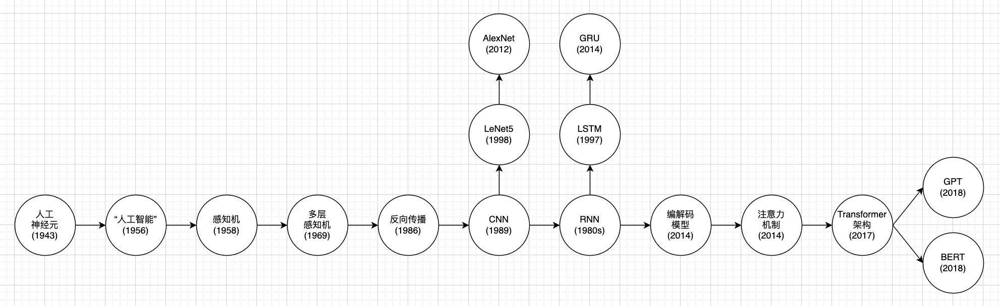


#### 把训练过程当黑盒

现在我们已经有了一条相对清晰的线索和脉络。不妨把学习神经网络的过程想象成是在玩一款游戏：前进路径上的每一个知识点，就像一个 BOSS，打败它，才能继续往前走。

我相信大多数人都玩过游戏，也都知道游戏的节奏通常是由易到难的。BOSS 会一关比一关更强，玩家则在不断尝试中逐渐成长。如果一上来就是一个极其困难的大 BOSS，很可能大部分人都会卡在第一关，后面的精彩内容也就无缘体验了。

而“坏消息”是，在前面提到的人工神经网络发展路径上，确实有这么一个“终极大 BOSS”挡在前面，它就是“反向传播”。如果想理解深度神经网络是如何训练的，就绕不开反向传播；而要理解反向传播，又往往需要掌握偏导数、链式法则等一整套微积分工具和知识。这一部分内容，确实会让不少非专业读者望而却步。事实上很多神经网络相关教科书就是这种写法，如果你的数学功底不够深，是很难读下去的。

不过“好消息”是，我们完全可以换一种打法：先绕过这个 BOSS，最后再来挑战它。我在自己的学习过程中发现，其实可以暂时把反向传播和训练过程当作一个“黑盒子”。不必一开始就纠结它内部是怎么运作的，只需要先接受这样一个事实：它是可以工作的，而且效果很好。就像我们日常开车，也不需要先搞懂发动机的内部结构，只要知道踩油门车会走就够了。

这样一来，我们就可以把注意力先放在神经网络的“前向计算”过程上。理解了人工神经元的基本工作方式之后，就可以顺着这条线，一步步了解不同模型的结构：从感知机出发，一路推进，直到各种现代架构，比如注意力机制和Transformer架构。等整体知识体系建立起来之后，再回过头来，专门攻克最难的那一关：反向传播。

当然，如果你更关心神经网络整体架构，或者只想了解训练好的模型是如何工作的，也可以暂时忽略训练细节。本书后面相关章节大致浏览即可，甚至暂时不读也无妨。

我们可以把神经网络架构看作一层一层搭建起来的技术栈，上层依赖下层；而反向传播这类训练机制，可以暂时视作一旁的 “支撑模块”。按照这种思路，整个技术体系大致可以这样理解：

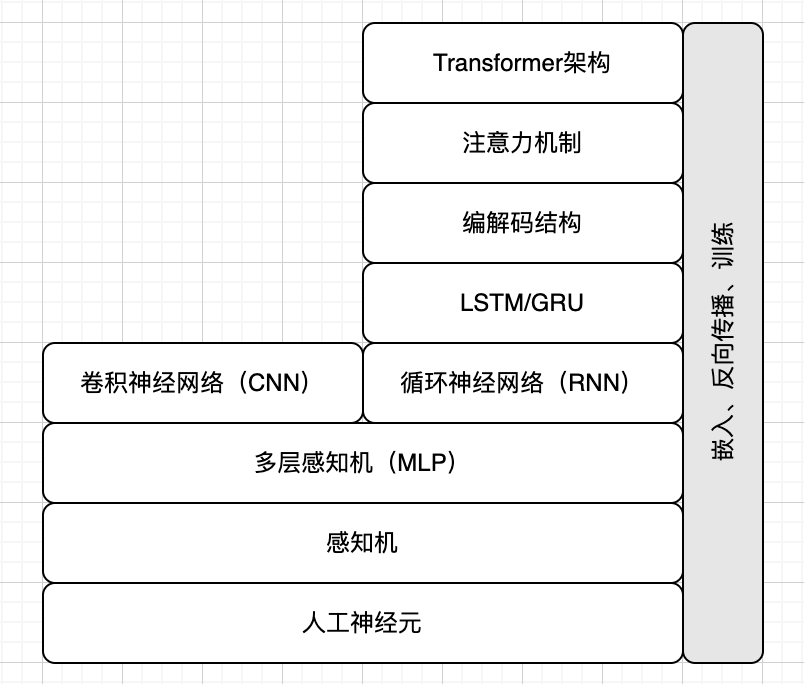


#### 用最少的数学知识

这一节我还是想告诉读者两个消息：一个好消息，一个坏消息。先说坏消息。虽然我们已经把反向传播，也就是模型的训练过程，放到了最后再讲，但想读懂前面的内容，依然需要一点数学基础。具体来说，会涉及一些线性代数的知识。我知道，只要一提到“数学”，哪怕不涉及微积分，很多读者也会下意识地有点抗拒。

不过好消息是，这里需要的数学其实并不多。最基础的加减乘除，再加上一点指数和对数运算，基本就够用了，应该不会超过高中数学的水平。至于线性代数，虽然通常被归在大学课程里，但理解神经网络真正需要用到的那一部分，其实非常有限。你只需要知道什么是向量、什么是矩阵，以及向量点积、矩阵乘法这些基本概念，就已经足够应付大部分内容了。只要不害怕这些概念和符号，本质上它们和普通的四则运算并没有那么大的区别。

为了让阅读更顺畅，本书会在第零章先介绍一遍所需的最基础线性代数知识。如果你对这些内容已经比较熟悉，也完全可以跳过这一章，直接从第一章开始阅读。


#### 每次只讲一个概念

在平时写代码的时候，我不太习惯、也不太能够把一个复杂的系统一下子完整写出来。我的开发模式更倾向于：先写一个最小化、最基础的版本，很类似大家熟知的“Hello, World”。然后，每次只增加一个小功能，在原有基础上不断迭代。这样一步一步地扩展，代码会逐渐变得完整，最终发展成一个复杂的功能，甚至一个完整的系统。

本书同样采用由浅入深的写作思路。以人工神经元为例：我会先介绍最简单的单输入、单输出神经元；再扩展为多输入神经元；接着讲解如何将大量神经元组合搭建，构成全连接层；以此循序渐进，逐步带领读者理解更为复杂的神经网络结构。全书每一步讲解都力求简洁清晰，方便读者轻松跟上推导与思考过程。

基于这一点，本书的正文在结构上并不会刻意设计很深的层级。大多数章节的组织方式都比较简单：先是“章”，然后是若干“小节”，基本不会再向下细分。每一个小节，都会尽量只在前一个小节的基础上增加一个新的知识点，控制学习节奏，避免信息过载。

这样一来，如果读者按照本书的节奏逐步阅读，就可以在不知不觉中建立起对神经网络工作原理的整体理解。如果在某一处没有完全看明白，也不用着急，可以停下来想一想、推一推，甚至自己动手实现一遍，然后再继续往下读。通过这种循序渐进的方式，更不容易迷失方向，也更不容易在中途放弃。


#### 公式、图表、代码

由于神经网络本身比较复杂，很多内容如果只靠文字讲解，理解起来会比较吃力。所以在本书中，除了文字之外，我还会借助三种工具来帮助你理解：公式、图表，以及代码。

俗话说“一图胜千言”，我对此深有同感。所以本书会配上大量示意图，帮助你从直观上理解概念。有些时候，尤其是在对比数字或结果时，表格往往会更加清晰直观。至于公式，它们虽然看起来有点“吓人”，但抽象表达能力非常强，因此也是不可或缺的一部分。我知道不少读者一看到公式就会有点发怵，但其实本书中的大部分公式都不复杂。只要你愿意多看几眼，慢慢就会发现，它们并没有想象中那么难。

再来说代码，神经网络毕竟属于计算机科学领域，适当的代码是非常有帮助的。本书中的代码大致可以分为两类。

第一类是“玩具代码”。这类代码的作用类似于图和公式，主要是帮助你理解概念。它们使用 Python 编写，整体都比较简短。如果你熟悉 Python，那自然更好；如果不熟悉，也不用担心，大多数代码即使不完全理解语法，也能看懂个大概。如果你想搞清楚细节，借助 AI 工具查一查，也很容易弄明白。

第二类是可以真正运行的示例代码，它们真的可以训练出小型神经网络。这部分代码使用著名的 PyTorch 框架编写，你可以下载到本地直接运行。因为主要是演示用途，所以不需要 GPU，用 CPU 也完全可以跑起来。不过，这类代码相对会更长一些。为了控制篇幅，书中只会展示其中关键的片段。如果你希望查看完整代码，可以从本书的配套仓库中获取。

本书并不会教大家具体的 Python 语法，或者如何下载、安装和使用 PyTorch 框架。因为这些内容对于本书来说，更多是锦上添花，而不是理解核心原理所必需的前提。如果你确实希望把书中的示例代码跑起来，甚至尝试自己动手实现一些简单的神经网络，那么可以在阅读过程中自行补充这部分知识，相关资料在网上也非常丰富，入门门槛并不高。

需要强调的是，即使不具备完整的编程基础，你依然可以顺利阅读本书的大部分内容。代码更多是作为辅助理解的工具，而不是学习的门槛。你完全可以把它们当作“带有逻辑的示意图”来看待，重点关注其中的思路，而不是每一行具体的语法细节。

此外，由于书籍这一介质的限制，公式、图表和代码都只能以静态形式呈现。在我自己的学习过程中，也接触到了一些非常优秀的交互式学习网站，它们通过可视化和实时操作，让很多抽象概念变得直观易懂。本书在部分章节中也附上了相关内容的截图，作为参考。

如果你在阅读过程中觉得某些静态的图表或公式不太容易理解，不妨通过浏览器访问这些网站，亲自动手操作一下。通过这种交互式的学习方式，往往能从另一个角度加深理解，尤其是在面对一些比较抽象或不太直观的内容时，会更有帮助。

在公式、图表、代码和交互式工具的共同辅助下，我相信你能够更轻松地理解神经网络的核心思想，学起来也会更加扎实，而不只是停留在抽象概念上。这个过程也许不会一蹴而就，但只要你一步一步往前走，把每个小问题都弄明白，最终一定能把这条路线走通。加油！


### 本书内容

前面也提到过，整个 AI 知识体系非常庞杂。作为一本入门读物，本书不可能做到面面俱到；而且坦率地说，把所有方向都展开，也早已超出作者本人的认知边界。因此，在内容上我做了一些有意识的取舍。简而言之，本书主要聚焦于人工神经网络相关技术。整体上，我会沿着前面梳理出的那条发展脉络展开：从基础概念出发，一步步推进到关键模型和方法。至于其他分支技术，有的会简单带过，大部分则暂时不涉及，留给读者在打好基础之后再自行探索。

在这一小节中，我会先介绍本书的主要内容和整体结构，让你对接下来要走的学习路线有一个大致的认识；接着会简单说明我的写作方式，尤其是大语言模型（LLM）对本书写作的帮助和影响。除此之外，我还会介绍本书的目标读者，适合什么背景的人阅读，以及如果你希望获得更好的学习效果，可以如何更高效地使用这本书。


#### 主要内容

如前所述，本书主要围绕神经网络展开讨论。神经网络属于机器学习的范畴，而机器学习本身也只是人工智能的一个分支。除了机器学习之外，人工智能还包括前面提到的专家系统、规则系统等方向。如果读者对这些内容感兴趣，可以自行查阅相关资料做进一步了解。

需要说明的是，神经网络只是机器学习中的一大类方法，虽然是当前最火的一类，但并不是全部。在它之外，还有不少经典方法，而且在很多实际工程场景中依然非常实用。比如决策树、随机森林、线性回归、朴素贝叶斯、支持向量机（SVM）等。这些方法各有特点，也各有适用场景，不过它们也不在本书的主要讨论范围内，感兴趣的读者可以参考其他资料。

进一步来说，多层神经网络通常被称为深度神经网络，而基于这类模型的学习方法，就称为深度学习。关于“为什么叫深度”，以及“深度”具体体现在哪里，正文中会有更详细的说明。本书会从最基础的人工神经元开始，介绍其基本工作原理；然后过渡到早期的单层神经网络，也就是感知机；而后面的大部分篇幅，则集中在深度学习相关内容，并大致按照发展脉络展开，比如多层感知机（MLP）、卷积神经网络（CNN）、循环神经网络（RNN）等典型模型。

人工智能、机器学习、神经网络、深度学习，以及本书重点介绍的这些模型和架构之间的关系，可以通过下图来做一个整体性的理解：

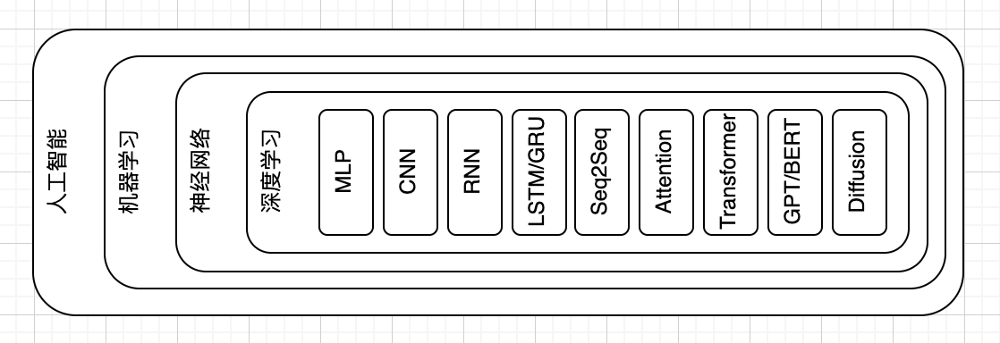


#### 整体结构

从整体上看，本书的主要内容大致可以分为三个部分。此外，在正式进入正文之前，还会有一个简单的铺垫章节，介绍一些必要的基础数学知识，主要集中在向量和矩阵等概念上，目的是帮助没有系统学习过线性代数的读者打好基础。这一部分内容力求简明、实用，只覆盖后文真正会用到的知识点。如果你已经对这些内容比较熟悉，也完全可以跳过这一部分，直接从正文开始阅读。

正文的第一部分，主要围绕“手写数字识别”这一经典任务展开，通过一个具体问题逐步引入相关概念。在这一部分中，我们会依次介绍人工神经元、感知机、多层感知机（MLP）以及卷积神经网络（CNN），为后续内容打下基础。

第二部分则转向自然语言处理任务。我们会先以“自动生成文本”为例，介绍循环神经网络（RNN）、长短期记忆网络（LSTM）以及门控循环单元（GRU）；接着以“机器翻译”为例，引出编解码结构、注意力机制以及著名的 Transformer 架构；最后再介绍词元（Token）和嵌入（Embedding），帮助理解文本是如何被表示和处理的。

第三部分属于进阶内容。在这一部分中，我们会介绍 GPT 和 BERT 这类典型模型，帮助读者理解大语言模型的基本原理；随后会简单介绍扩散模型，解释“文生图”这类应用背后的基本思路；接着回到一个核心问题——神经网络是如何训练的，也就是反向传播及相关学习过程；最后，还会简要介绍一些与大语言模型应用相关的技术，例如检索增强生成（RAG）、智能体（Agent）、技能（Skills） 等，帮助读者从“原理”走向“应用”。

本书每一章的主要内容，可以通过下面这个列表做一个更清晰的了解：

- 基础知识
  - 第零章：基础知识。介绍向量、矩阵、向量点积、矩阵乘法等基础线性代数概念，为后续内容打基础。
- 第一部分
  - 第一章：人工神经元。介绍构成神经网络的最基本单位——人工神经元的结构和计算方式。
  - 第二章：单层神经网络。介绍感知机的工作原理，以及其历史背景和局限性。
  - 第三章：多层神经网络。介绍多层感知机的结构、表达能力提升，以及相关发展历程。
  - 第四章：卷积神经网络。介绍卷积神经网络的结构和内部机制，以及其在图像任务中的应用。
- 第二部分
  - 第五章：循环神经网络。介绍循环神经网络处理序列数据的基本思路和工作机制。
  - 第六章：词元和词嵌入。介绍文本如何被切分为词元，以及如何转化为向量表示。
  - 第七章：长短期记忆网络。介绍 LSTM 及其简化版本 GRU，解决长序列依赖问题的思路。
  - 第八章：编解码模型。介绍序列到序列问题，以及编码器-解码器结构的基本框架。
  - 第九章：注意力机制。介绍注意力机制如何动态关注关键信息，提高模型表现。
  - 第十章：Transformer 架构。介绍基于注意力机制的 Transformer 结构及其核心设计。
- 第三部分
  - 第十一章：GPT 和 BERT。介绍两类典型大语言模型的结构特点及其差异。
  - 第十二章：扩散模型。介绍扩散模型的基本原理及其在生成任务中的应用。
  - 第十三章：反向传播。介绍神经网络的训练方法以及反向传播的核心思想。
  - 第十四章：应用。介绍一些大模型相关的应用技术，如 RAG、Agent、Skills 等。


#### 写作方式

神经网络、深度学习、大语言模型，以及聊天机器人，不光是本书要讨论的主要内容，也几乎彻底改变了本书的写作方式。

在写这本书之前，我曾经写过三本与虚拟机相关的书（JVM、Lua、Wasm）。其中第三本也是六年以前（2020 年）的事情了。虽然那时候 GPT 和 BERT 已经问世两年多了，但我对“大语言模型”几乎一无所知。我相信，当时的大部分读者和我也是类似的情况。所以前三本书，基本都是我一字一句慢慢写出来的。

但六年之后的今天，情况已经完全不同了。我也相信，已经很少有人再像以前那样“纯手工”写作了。对我来说，AI 对本书的帮助是全方位的，可以从几个方面来讲。

一、文字润色。大多数时候，我的思路其实是比较清晰的。但毕竟是程序员出身，文字表达多少还是欠缺一些，很难做到行云流水。以前写作时，常常需要反复斟酌措辞，每一段都要花不少时间打磨。现在有了大语言模型的辅助，我可以先把核心想法快速写下来，再交给 AI 做润色和调整。从实际效果来看，这种方式既节省时间，也能让表达更顺畅。

二、补充内容。有时候思路是有的，但在具体表达上会卡住，或者某些细节一时想不清楚。这种情况下，我通常会先把已经明确的部分写出来，把暂时不确定的地方留出来，再让 AI 帮忙补充。补充完成后，我会再逐一核对和修改。大多数情况下效果都不错；如果不太满意，多和 AI 迭代几轮，也往往能达到预期。相比完全自己从头写，效率确实提高了不少。

三、提供思路。写作过程中难免会遇到思路不清、结构混乱的时候，脑子里只有一些零散的知识点，不知道该如何组织。这时和 AI 聊一聊，问问它的理解和建议，往往能帮我理出一个基本框架，或者提供一些新的角度和灵感。然后再结合自己的理解，继续深入学习和写作。

四、查阅资料。以前遇到不确定的问题，或者需要补充背景知识时，通常要通过搜索引擎查资料、对比多篇内容，再自己整理总结，这个过程比较耗时。现在很多问题可以直接向 AI 提问，通常都能得到比较完整的回答，有时甚至比我原本想查的内容还要更全面。当然，也需要注意，AI 并不是总是正确的，关键内容仍然需要自己核实。

五、检查校对。人难免会犯各种低级错误，我也不例外。以前写书时，为了尽量减少出版后的错误和疏漏，需要请朋友帮忙通读初稿，检查错别字和表达问题，之后出版社编辑还会再做一轮校对。即便如此，仍然难免会有遗漏。现在，AI 在这方面可以提供很大的帮助，大部分明显的错误都能被及时发现和修正。

此外，AI在帮我编写和检查示例代码方面的帮助就不必多说了。总的来说，如果没有 AI 的帮助，我学习新知识的速度不会这么快，这本书的写作过程也不会这么顺利，甚至可能连动笔的信心都没有。当然，任何工具都有两面性，AI 辅助写作也不例外。如果你在阅读过程中，偶尔感觉到一些“AI 味道”，那大概就是这种写作方式带来的副作用。不过我会尽量在效率与表达之间找到一个平衡点，让内容既清晰高效，也尽可能保留应有的“人味”。


#### 目标读者

正所谓众口难调，我也很清楚，本书不可能满足所有人的阅读偏好与需求。因此，与其试图“面面俱到”，不如把目标读者说清楚，帮助你判断这本书是否适合自己。那么，本书适合谁，又不太适合谁呢？本书的目标读者可以大致分为以下几类。

第一类，是已经能够熟练使用各种大模型应用（比如聊天机器人）的读者，但不满足于“会用就行”，也不满足于只停留在概念层面，而是希望进一步理解底层原理。这类读者不一定具备编程背景，但最好具备一定的数学基础，并且勇于挑战、愿意多思考。对于这类读者，我的建议是：可以尝试去理解书中的代码；如果一时看不懂，也不必焦虑，并不会影响对整体内容的理解。

第二类，是像我一样的程序员。不想错过这波 AI 浪潮，希望从工程和实现的角度了解大模型是如何设计、如何训练、以及如何工作的。这类读者往往不太想一上来就啃厚重、偏理论的专业教材，那么本书可以作为一个相对轻量但有结构的入门入口。等建立起整体认知之后，再去阅读更系统、更深入的专业书籍，会更加顺畅。

第三类，是已经对 AI 底层原理有一定了解，但知识比较零散、缺乏体系的读者。可能零零碎碎看过一些资料，也学过一些模型，但对整体脉络还不够清晰。这类读者可以把本书当作一次“重新整理知识结构”的机会，在补齐缺失的同时，也能把已有的知识串联起来，而且阅读体验相对轻松，不至于枯燥难以坚持。

当然，也有一些读者可能并不太适合本书。比如已经系统学习过 AI 的相关专业本科生、研究生，或者本身就是相关领域的从业人员；又或者具备较强数学背景、希望深入理论推导的读者。那么本书对你来说可能偏入门，你可以直接选择更专业、更系统的教材来学习。不过，如果你只是想换个角度回顾一下知识，或者当作轻松阅读材料翻一翻，本书也未尝不可。


#### 如何阅读

如果你是上面描述的第一类或第二类读者，那么我建议你从头到尾按顺序阅读本书。打好基础，一步一步往前推进，效果会更好。当然，如果你的数学基础比较扎实，也可以跳过第零章中关于向量和矩阵的内容，直接从第一章开始阅读正文；等后面遇到相关概念时，再回头查阅第零章即可。

如果你是第三类读者，那么阅读方式可以更加灵活一些。你可以根据自己的兴趣或已有基础，自由选择章节阅读，顺序并不是必须的。不过，建议先大致浏览一下前面几章，熟悉本书的表达方式，包括图表、代码和公式的使用习惯，这样在后续阅读时会更加顺畅。

如果你是偶然翻到本书的专业读者，那么我对你还是有一点“小期待”的。我希望你能带着审视的眼光，选择一两个章节仔细看看，或许能发现一些不足之处，甚至是错误。如果你愿意把这些问题反馈给我，那将对本书后续版本的改进非常有帮助。


#### 提供反馈

总之，不管你是刚开始接触的神经网络初学者，还是已经有一定经验的专业人士，只要在阅读过程中有任何意见或建议，都欢迎告诉我，帮助我不断改进这本书。如果你发现了书中的疏漏、错误，或者有更好的表达方式，也非常欢迎指出。

你可以通过本书配套的 GitHub 仓库提交 issue，与我交流和反馈。我会对这些反馈进行整理和记录：对于一些较小的疏漏或笔误，会在后续印刷中及时修订；而涉及结构性或内容层面的调整，则会在下一版中进行更新和完善。你的每一条反馈，都会让这本书变得更好。

TODO：放上GitHub仓库链接？


### 致谢

可能和其他书不太一样，关于这本书，我最想感谢的是那些有名或无名的前辈。

首先要感谢计算机与人工智能领域的各位先驱。他们在不同发展阶段推动着整个领域不断前行：有人潜心基础研究，有人开发工具与框架，也有人创立公司、提供产品与服务。在学习相关知识的过程中，我体会到了极大的乐趣；在系统梳理内容的过程中，收获了满满的成就感；而在撰写本书的过程中，更是直接受益于他们长期的积累与卓越贡献。

其次，是那些热衷于总结与分享知识的人。无论是技术文章、博客，还是系统性的书籍，这些内容都极大地方便了我的学习和查阅。从某种意义上说，我在做的事情也是“再一次总结”。同时，这些海量的高质量文本，也构成了大语言模型的重要基础。正是在大量人类知识的积累之上，模型才能展现出今天这样的能力。

然后是整个开源社区。本书的写作和配套代码，离不开大量开源软件、编程语言和工具的支持。例如，书稿的编写使用了 Markdown 语言和文本编辑器；示意图通过 VS Code 配合 draw.io 插件绘制；所有内容都通过 Git 进行版本管理；书中的示例代码则基于 Python 语言和 PyTorch 框架完成。至少对我而言，如果没有这些开源项目，这本书的写作难度会高出很多。

当然，这本书最终能够完整呈现在读者面前，也离不开帮助我审阅初稿的各位朋友。他们提出的宝贵意见与建议，让本书内容更加完整、表达更加清晰严谨。同时，我也要由衷感谢家人的支持与理解 —— 写作占用了大量本应陪伴他们的时间，没有他们的包容与鼓励，这本书很难顺利完成。


<div style="page-break-after: always;"></div>

## 第零章：基础知识

如果可以的话，不用数学公式就把人工神经网络讲清楚，那当然是最理想的。不过很遗憾，这在实践中几乎做不到，除非只是停留在一些名词解释和宏观概念层面。

不过，二八原则在这里依然适用。实际上，我们只需要掌握少量的数学知识，就足以理解神经网络的大部分核心内容；而剩下那一小部分更深入的细节，才需要较强的数学功底，以及投入更多时间去仔细推敲。本书的目标，正是帮助读者用尽量少的数学工具，理解人工神经网络的主要思想和关键机制。

本章主要介绍线性代数中最基础的概念，具体来说，就是向量和矩阵，以及它们的一些基本运算规则，例如向量点积和矩阵乘法。这些内容是理解后续章节的基础。在此之前，我还会简单介绍一下不同维度的数据类型，帮助你建立直观的认识；而在本章的最后，也会简要介绍 NumPy 库和 PyTorch 框架，为后续代码部分做一个铺垫。

从实际经验来看，只要你没有把中学阶段的数学知识完全遗忘，理解向量和矩阵及其基本运算并不困难，大致相当于在四则运算的基础上稍微增加一点抽象程度而已。此外，像指数运算、方程、坐标系，以及一点点概率的基本概念，如果你还有印象，那就已经足够了。当然，如果这些内容已经比较生疏，也不必担心，可以在阅读过程中按需回顾，遇到不理解的地方再补一补即可。

好，我们先从“不同维度的数据”这个最直观的角度开始说起。


### 数据类型

维度这个概念，想必大家都不陌生。平时我们会去看2D或者3D动画电影，偶尔也会玩2D或者3D游戏。喜欢科幻小说的读者，应该也读过刘慈欣的《三体》，对“降维打击”也不陌生。

所谓的零维空间，其实就是一个点，除此之外什么也没有；一维空间可以理解为一条直线，上面可以有无数个点；二维空间则是一个平面，可以包含无数条直线；三维空间就是我们所生活的现实空间。至于再往上，如果再加上“时间”这个维度，有时也会把它粗略地理解为“四维时空”。而五维及更高维度的空间，就已经超出了大多数人的直觉范围，很难去想象。

在我们的日常经验中，连续空间是很自然、直观的。不过在神经网络和机器学习的语境中，我们通常不直接处理连续空间，而是更倾向于用“离散”的方式来表示数据。你可以把整个世界想象成由一个个小方格组成的结构，而不是连续的点、线、面、体。如果你玩过《我的世界》这种由方块构成的游戏，那这个类比就很好理解了：一切都是由离散的小单元拼接起来的。

在数学或编程语言中，我们通常用一个数（比如 `1.23`）来表示某种量的大小。这样一个单独的数，称为标量（Scalar），大致对应前面提到的“零维”。如果把多个标量按顺序排成一列（或一行），用来表示一组数据，就得到向量（Vector），可以类比为一维结构。如果把标量按行和列排成一个表格状的结构，就得到矩阵（Matrix），对应二维结构。如果再把数据像“魔方小方块”一样堆叠起来，就可以形成三维的数据结构。

再往更高维扩展时，就不再为每一种维度单独命名了，通常统一称为张量（Tensor）。例如，类似“魔方”的三维结构可以称为三阶张量，更高维则依次类推。从这个角度看，向量其实是一维张量，矩阵是二维张量，只不过在实际使用中，人们更习惯用“向量”和“矩阵”这些更具体的名称。

在这种离散的表示方式下，标量、向量、矩阵以及三阶张量的关系，可以通过下图更直观地理解：

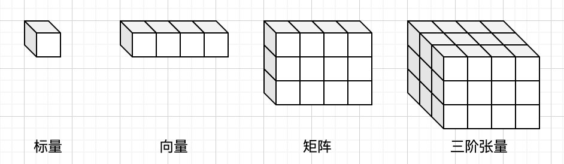

在本书的公式和图表中，我们通常用小写字母（例如 `x`）来表示标量，用大写字母（例如 `X`）来表示向量或矩阵。一般来说，大写字母究竟表示向量还是矩阵，可以通过上下文来判断；如果存在歧义，我也会在文中明确说明。如果出现三阶张量，我会用大写字母配合方括号来表示（例如 `[X]`），以便和向量、矩阵做一个简单区分。更高阶的张量在正文中出现得不多，即使出现，也会结合具体语境进行解释。

在示例代码中，为了尽量降低理解门槛，我会使用尽可能简单直观的表示方式：通常用 Python 的 `float` 类型来表示标量，用列表（`list`）来表示向量，用嵌套列表来表示矩阵以及更高维的数据结构。这种表示方式虽然不够高效，但胜在直观，便于理解其结构。

需要稍微提醒的是，在实际工程中（例如使用 NumPy 或 PyTorch 时），这些数据通常会用专门的数组或张量类型来表示，它们在性能和功能上都更强大。但在本书中，我们更关注概念本身，因此会优先选择更容易理解的表达方式。

维度、空间、离散数值、Python 数据类型，以及本书中符号表示之间的对应关系，可以通过下面这个表格来做一个整体性的理解：

| 维度 | 连续空间 | 离散数值       | Python类型                | 本书约定              |
| ---- | -------- | -------------- | ------------------------- | --------------------- |
| 零维 | 点       | 标量（Scalar） | `float`                   | 小写字母，例如`x`     |
| 一维 | 直线     | 向量（Vector） | `list[float]`             | 大写字母，例如`X`     |
| 二维 | 平面     | 矩阵（Matrix） | `list[list[float]]`       | 大写字母，例如`Y`     |
| 三维 | 立体     | 三阶张量       | `list[list[list[float]]]` | [大写字母]，例如`[Z]` |
| n维  |          | n阶张量        |                           |                       |


### 向量

解释清楚了空间与维度的概念，以及连续和离散的差别之后，我们就可以更具体地来看向量了。重点是理解：向量与标量之间，以及向量与向量之间，是如何进行计算的。在本书中，当我们需要把向量或矩阵”展开”来看时，会把它们的元素写在方括号中，并按照固定顺序排列。例如，一个包含三个元素的向量 $A$ ，可以表示为： $[a_1, a_2, a_3]$ 。

我们先来看向量与标量的四则运算。先说明：无论是“向量在左、标量在右”，还是“标量在左、向量在右”，结果都是一样的。计算时，只需要把这个标量依次作用到向量的每一个元素上即可，最终得到的结果仍然是一个向量。以加法为例，其含义就是把标量分别加到向量的每个元素上，计算公式如下：

$$
[a_1, a_2, ..., a_n] + b = [a_1 + b, a_2 + b, ..., a_n + b]
$$

进一步来说，如果有一个函数原本是作用在标量上的，那么我们也可以将它扩展到向量上：也就是让该函数分别作用于向量的每一个元素，最终得到一个新的向量。前面介绍的加法运算其实只是这类函数的一个特例，而无论函数多么复杂，都可以用同样的方式理解。我们用小写字母 `f` 表示任意函数，那么将 `f` 作用于向量的效果可以用下面的公式表示：

$$
f([a_1, a_2, ..., a_n]) = [f(a_1), f(a_2), ..., f(a_n)]
$$

接下来再看向量与向量之间的运算。向量之间同样可以进行加法和减法运算，但这里需要特别注意一个前提：两个向量的长度（也就是元素的个数）必须相同，否则无法逐元素对应计算。以加法为例，就是把两个向量中“位置相同”的元素一一相加，得到一个新的向量，计算公式如下：

$$
[a_1, a_2, ..., a_n] + [b_1, b_2, ..., b_n] = [a_1 + b_1, a_2 + b_2, ... , a_n + b_n]
$$

除了逐元素的加减运算之外，还有一种非常重要的运算，叫做向量的**点积**（Dot Product）。对于两个长度相同的向量，我们可以先按顺序将对应位置的元素两两相乘，然后把所有乘积加起来，最终得到一个标量，这就是点积运算的结果。我们可以使用数学中的求和符号来更清晰地表达“累加”的过程，向量点积的计算公式如下：

$$
[a_1, a_2, ..., a_n] \cdot [b_1, b_2, ..., b_n] = \sum_{i=1}^n{a_i \cdot b_i}
$$

讲到这里，我需要给不太熟悉向量的读者做一个补充说明。很多人之所以会感到困惑，是因为“向量”在不同的语境下，可能代表不同的含义。在前一小节中，我们把向量当作一组按顺序排列的离散数值（类似一个一维数组）来理解。但在几何意义上，向量也可以表示某个空间中的“点”或者“方向”。比如下图中的左、中、右三幅示意，分别展示了一维空间、二维空间和三维空间中的点与方向。

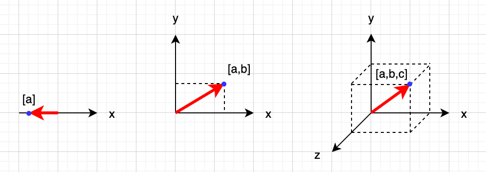

当我们用向量来表示空间中的点或方向时，向量中包含的元素个数，就对应了它所在空间的维度。比如，只包含一个数值的向量，可以表示一维空间中的位置；包含两个数值的向量，可以表示二维平面中的点或方向；包含三个数值的向量，则可以表示三维空间中的点或方向。在这个语境下，我们把向量所包含的数值个数称为向量的**维度**。

如此一来，尽管高维空间本身难以直观想象，但高维空间中的 “点” 却可以很方便地用向量表示，只需要用更多的数值来描述其位置即可。从这个角度看，向量既是一组数据的集合，也是连接“数据表示”与“几何直觉”的重要桥梁。


### 矩阵

如果已经理解了向量，那么矩阵其实就很好理解了。如果把向量想象成一列队伍，那矩阵则像做广播体操时排成的方阵，每个人对应一个元素。由于矩阵是二维结构，我们通常用“行数 × 列数”来描述它的形状（Shape）。按照惯例，在本书中，我们把一个有 n 行 m 列的矩阵称为一个 n×m 矩阵。

对于标量与矩阵之间的运算，以及矩阵与矩阵的加减运算，其规则和向量是类似的。先来看矩阵与标量的加法：只需要把这个标量加到矩阵的每一个元素上即可，结果仍然是一个矩阵。为了便于观察，我们以一个 2×3 的矩阵为例，对应的计算公式如下所示：

$$
\begin{bmatrix}
a_{11} & a_{12} & a_{13} \\
a_{21} & a_{22} & a_{23}
\end{bmatrix} + b =
\begin{bmatrix}
a_{11}+b & a_{12}+b & a_{13}+b \\
a_{21}+b & a_{22}+b & a_{23}+b
\end{bmatrix}
$$

正如前一小节所说，加法本质上只是一个特殊的函数。更一般地，对于任意一个作用在标量上的函数 `f`，我们都可以把它扩展到矩阵上：也就是让这个函数分别作用在矩阵的每一个元素上，最终得到一个新的矩阵。还是以 2×3 矩阵为例，其计算公式如下所示：

$$
f(\begin{bmatrix}
a_{11} & a_{12} & a_{13} \\
a_{21} & a_{22} & a_{23}
\end{bmatrix}) = 
\begin{bmatrix}
f(a_{11}) & f(a_{12}) & f(a_{13}) \\
f(a_{21}) & f(a_{22}) & f(a_{23})
\end{bmatrix}
$$

矩阵与矩阵之间的加减法，同样是逐元素进行的。因此，参与运算的两个矩阵必须具有完全相同的形状（行数和列数都一致），计算结果也保持相同的形状。我们仍然以 2×3 矩阵为例，矩阵加法的计算公式如下所示：

$$
\begin{bmatrix}
a_{11} & a_{12} & a_{13} \\
a_{21} & a_{22} & a_{23}
\end{bmatrix} +
\begin{bmatrix}
b_{11} & b_{12} & b_{13} \\
b_{21} & b_{22} & b_{23}
\end{bmatrix} =
\begin{bmatrix}
a_{11} + b_{11} & a_{12} + b_{12} & a_{13} + b_{13} \\
a_{21} + b_{21} & a_{22} + b_{22} & a_{23} + b_{23} \\
\end{bmatrix}
$$

这里特别说明一下：如果把上述逐元素计算中的“加法”替换为“乘法”，那么这种运算有一个专门的名字，叫做矩阵的哈达玛积（Hadamard Product），通常用一个带点的小圆圈符号来表示。这种运算在神经网络中也非常常见，因此我们也单独给出它的计算公式：

$$
\begin{bmatrix}
a_{11} & a_{12} & a_{13} \\
a_{21} & a_{22} & a_{23}
\end{bmatrix} \odot
\begin{bmatrix}
b_{11} & b_{12} & b_{13} \\
b_{21} & b_{22} & b_{23}
\end{bmatrix} =
\begin{bmatrix}
a_{11} \cdot b_{11} & a_{12} \cdot b_{12} & a_{13} \cdot b_{13} \\
a_{21} \cdot b_{21} & a_{22} \cdot b_{22} & a_{23} \cdot b_{23} \\
\end{bmatrix}
$$

最后，也是最重要的一种运算，是矩阵与矩阵的乘法。需要注意的是，矩阵乘法并不是把两个矩阵中对应位置的元素相乘（那是刚刚提到的哈达玛积）。矩阵乘法的规则稍微复杂一些，不太适合直接从公式入手理解。不过，如果我们把矩阵看作由“行向量”和“列向量”组成的集合，并用 `row(A, n)` 表示矩阵 A 的第 n 行，用 `col(B, n)` 表示矩阵 B 的第 n 列，那么矩阵乘法就可以理解为：用 A 的每一行，与 B 的每一列做向量点积，从而得到结果矩阵中的对应元素。以两个较小的矩阵为例，乘法计算公式如下所示：

$$
\begin{bmatrix}
a_{11} & a_{12} & a_{13} \\
a_{21} & a_{22} & a_{23}
\end{bmatrix} \times
\begin{bmatrix}
b_{11} & b_{12} \\
b_{21} & b_{22} \\
b_{31} & b_{32}
\end{bmatrix} =
\begin{bmatrix}
row(A, 1) \cdot col(B, 1) & row(A, 1) \cdot col(B, 2) \\
row(A, 2) \cdot col(B, 1) & row(A, 2) \cdot col(B, 2) \\
\end{bmatrix}
$$

需要特别注意的是，从这个定义可以看出，矩阵乘法并不要求两个矩阵的形状完全一致，但必须满足一个条件：前一个矩阵的列数，要等于后一个矩阵的行数。一般来说，一个 n×m 的矩阵与一个 m×k 的矩阵相乘，得到的结果是一个 n×k 的矩阵。


### NumPy

NumPy 是 Python 生态中一个非常重要、也非常常用的库，几乎是进行数学计算、科学计算以及编写 AI 相关代码时的“标配”。NumPy 提供了一个 `array()` 方法，可以通过 Python 原生的列表，方便地构造出向量、矩阵，乃至更高维的张量。基于这些数据结构，我们就可以使用 NumPy 提供的一系列函数，在标量、向量和矩阵之间进行高效而简洁的计算。

以向量为例，下面的代码展示了常见的一些运算方式。需要特别注意的是，在 NumPy 中，默认的乘法是逐元素相乘，而不是向量点积。如果需要计算点积，可以使用 `@` 运算符来实现。

```python
import numpy as np

a = np.array([1, 2, 3])
b = np.array([4, 5, 6])

print(a + 1) # [2 3 4]
print(a * 2) # [2 4 6]
print(a + b) # [5 7 9]
print(a - b) # [-3 -3 -3]
print(a * b) # [ 4 10 18]
print(a @ b) # 32
```

接下来是矩阵的相关计算示例。通过 `shape` 属性，我们可以方便地获取一个矩阵（或者更高维张量）的形状信息。在矩阵运算中，同样需要注意：默认的乘法依然是逐元素相乘（也就是前面提到的哈达玛积）；如果需要进行标准的矩阵乘法，也需要使用 `@` 运算符来表示。

```python
import numpy as np

a = np.array([[1, 2, 3], [4, 5, 6]])
b = np.array([[2, 3, 4], [5, 6, 7]])
c = np.array([[1, 2], [3, 4], [5, 6]])

print(a.shape) # (2, 3)
print(c.shape) # (3, 2)
print(a + 1)   # [[ 2  3  4] [ 5  6  7]]
print(a * 2)   # [[ 2  4  6] [ 8 10 12]]
print(a + b)   # [[ 3  5  7] [ 9 11 13]]
print(a - b)   # [[-1 -1 -1] [-1 -1 -1]]
print(a * b)   # [[ 2  6 12] [20 30 42]]
print(b * a)   # [[ 2  6 12] [20 30 42]]
print(a @ c)   # [[22 28] [49 64]]
print(c @ a)   # [[ 9 12 15] [19 26 33] [29 40 51]]
```

对于三阶及以上的张量，本书不会涉及太多具体的计算细节，因此这里不再展开演示。在后续章节中，如果需要详细展示某一步的计算过程，我通常会使用 Python 原生的列表来表达，以便读者更直观地理解；而在不需要关注具体计算细节、只关心整体流程时，则会更多使用 NumPy 来书写代码，使表达更加简洁清晰。


### PyTorch

PyTorch 是一个基于 Python 语言的深度学习框架，最初由 Facebook（现 Meta）推出，目前由社区与企业共同维护与发展。它在学术研究和工业实践中都被广泛使用，因其灵活性和易用性而受到欢迎。除了 PyTorch 之外，常见的深度学习框架还包括 TensorFlow 等。

正如前言中提到的，本书中的示例代码大致分为两类：一类是用于帮助理解概念的“玩具代码”，另一类是可以实际运行的示例代码。对于后者，本书统一采用 PyTorch 来实现。

由于篇幅所限，这里不会详细介绍 PyTorch 的安装步骤或完整使用方法。在本书中，我们更多是把 PyTorch 当作一种“描述神经网络的工具”，重点关注模型的结构和计算流程，而不是框架本身的各种细节用法。如果你希望进一步学习 PyTorch，或者想在本地运行本书中的示例代码，可以查阅官方文档，或者参考一些专门介绍 PyTorch 的书籍和教程。


### 本章小结

在本章中，我们首先讨论了空间与维度的基本概念，以及连续空间与离散表示之间的差异。随后介绍了向量和矩阵的定义，并讲解了它们的基本运算规则，尤其是向量的点积和矩阵的乘法这两个后续会频繁用到的核心操作。接着，我们还简要了解了 NumPy 的基本用法，以及 PyTorch 框架的一些基础概念。

读完这一章，你已经打下了一个比较扎实的基础，足以理解后文中绝大部分涉及的公式和代码表达。当然，随着内容逐渐深入，个别细节可能仍需要反复体会，但整体阅读已经不会有太大障碍。从下一章开始，我们将正式进入人工神经网络的世界。在继续前行之前，不妨稍作休整，以更好的状态开启一个全新的学习阶段。

<div style="page-break-after: always;"></div>

## 第一章：人工神经元

大家有没有和孩子一起拼过积木模型？这种模型买回来时，是一大堆带有凸起与凹槽的塑料积木块，再配上一张拼装图纸。我们只要按照图纸，把积木一块一块、一层一层地拼接、垒叠起来，最后就能拼出一个完整又漂亮的模型（可以是人偶、动物、汽车，也可以是建筑物）。搭建人工神经网络也是一样的道理。先设计好整体的网络架构，再一层一层地构造、连接起来，最终就形成了一个完整的神经网络。

拼积木模型，首先得有积木块。搭建人工神经网络也是一样，首先得有人工神经元。如果你明白人工神经元是如何工作的，也理解每一层是如何运作的，那你就基本弄懂了整个人工神经网络是怎么起作用的。本章的任务，就是带你搞清楚：什么是人工神经元，以及它究竟是如何工作的。


### 最简单的神经元

我们的大脑大约有几百亿个神经元，它们相互连接，构成了一个无比庞大的神经网络。如果想用计算机程序模拟人类大脑，自然也要从模拟神经元开始，再逐步搭建出复杂的网络。这种由计算机程序模拟出来的神经元，叫作人工神经元（Artificial Neuron）；由大量人工神经元组成的网络，就是人工神经网络（Artificial Neural Network，简称ANN）。本书只围绕人工神经元展开讲解，在没有歧义的情况下，后文会直接简称其为**神经元**。

那么神经元起什么作用呢？传递信号。一个神经元会从其他神经元接收若干输入信号，再产生输出信号传递给其他神经元。我们先从最简单的情况入手：只接受一个输入，产生一个输出。我们用空心圆来表示神经元，用小写英文字母来表示信号。于是，一个最简单的神经元就如下图所示：

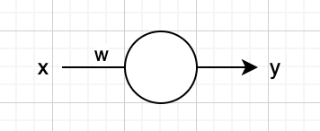

上图里的`w`是什么呢？它是一个系数，用来根据输入信号`x`计算输出信号`y`。这里的`x`、`y`、`w`都可以是任意实数。输入信号`x`乘以系数`w`就得到了输出信号`y`，就这么简单。这一计算可以用方程表示为：

$$
y = wx
$$

如果我们把上面的人工神经元放大，把系数`w`以及计算过程画在神经元内部，那么它看起来像是下面这样：

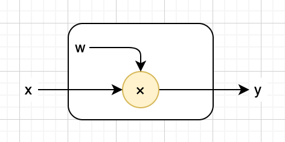

啥？这就是神经元？眼尖的读者一眼就能看出来，这不就是数学里最简单的**函数**（Function）吗？输入是`x`，输出是`y`。而且它对应的就是一个直线方程，表示平面直角坐标系中穿过原点的一条直线，斜率是`w`。当`w=2`时，这条直线就是[下面](https://www.desmos.com/calculator/pyztpgmk36?lang=zh-CN)这样：

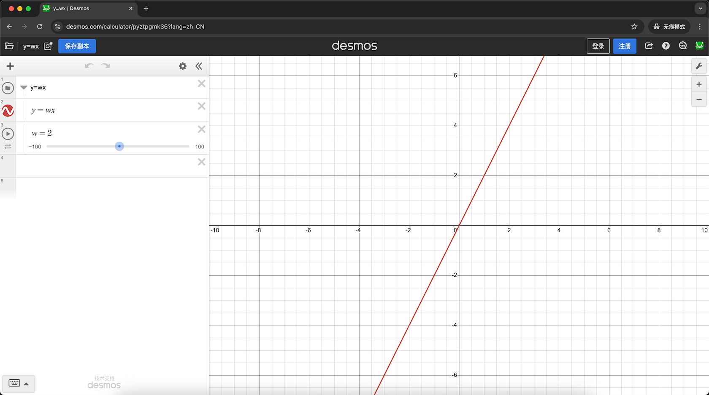

你是对的，而且这个结论非常重要。一个神经元就是一个函数，甚至整个人工神经网络，本质上也是一个超级复杂的函数。如果你暂时不理解也没关系，本书会慢慢为你解释这一点。我们用小写字母`f`来表示函数，于是上面的等式可以重新写为：

$$
y = f(x) = wx
$$

好了，我们已经构造出了一个最简单的人工神经网络。它简单到甚至还称不上真正的“网络”，因为里面只有一个神经元。这个神经元也只有一个输入、一个输出。我们把这个系数`w`称为神经元的**参数**（Parameter），调整它就能对应到不同斜率的直线。也就是说，我们这个神经网络，只有一个参数。而与之形成巨大反差的是，最新发布的GPT‑5.4模型，参数数量可能高达数万亿！

那么，我们这个微不足道的迷你神经网络，到底能做些什么呢？答案很直观：它能根据给定的x坐标，“预测”出某条经过原点的直线上对应点的y坐标。我们用几行Python代码就可以实现这个神经网络，代码如下所示：

```python
def new_neuron(w: float):
    return lambda x: w * x

neuron = new_neuron(2) # w=2
print(neuron(1.2)) # 2.4
```

或许你心里还会有个疑问：这个参数为什么要用字母`w`来表示？别急，在后面“加权求和”这一小节里，我会给你解释。


### 偏置

既然我们的神经元已经能根据x坐标（输入），“预测”一条直线上某个点的y坐标（输出），那何必非要限制这条直线必须经过原点呢？回想一下，参数`w`代表的是直线的斜率，也就是直线的倾斜程度。只需要再增加一个表示截距的参数就够了，这样就能让直线沿y轴“平移”，不用再死死卡在原点上。我们称这个新参数为**偏置**（Bias），用小写字母`b`表示，并把它写在神经元里面，如下图所示：

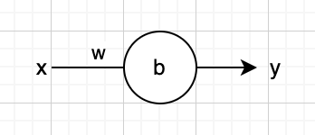

现在，我们的神经元表示的函数更强大一些了，因此需要更新一下它的等式，把偏置加上去。为清晰起见，我们还是把函数和直线完整的斜截式方程写在一起，如下所示：

$$
y = f(x) = wx + b
$$

我们把放大的神经元示意图也修改一下，把偏置的计算画进去，现在它看起来是下面这样：

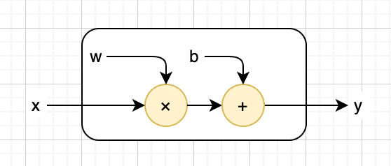

回到直线方程，假设某个神经元的参数`w`（斜率）为`3`，参数`b`（截距）为`4`，那么它对应的直线就如[下图](https://www.desmos.com/calculator/eyx6eo0mjx?lang=zh-CN)所示。如果你看的是本书电子版，可以点开这个链接，调整`w`和`b`的数值，观察直线的变化。

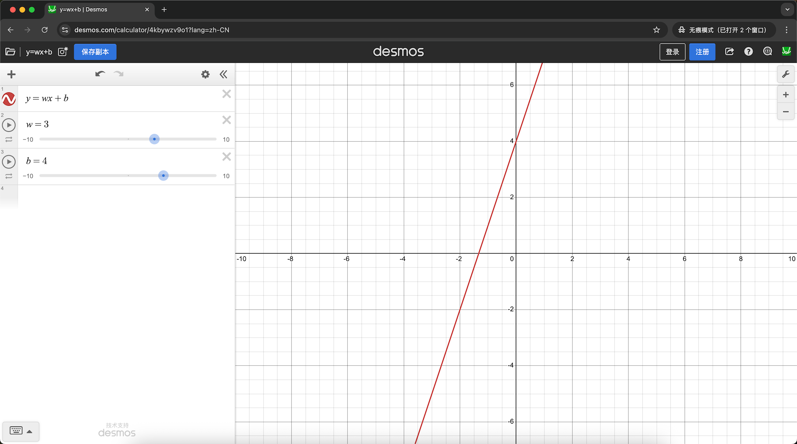

既然我们这个小小的“神经网络”已经变强了一点点，多了个参数 `b`，那我们也得修改之前的Python代码，把这个参数加进去。修改之后的代码如下：

```python
def new_neuron(w: float, b: float):
    return lambda x: w * x + b

neuron = new_neuron(3, 4) # w=3, b=4
print(neuron(2.5)) # 11.5
```


### 激活函数

如果你学过线性代数，就会发现，我们的神经元目前只能通过对输入做**线性变换**（Linear Transformation）来得到输出。就算你不懂线性代数也没关系，你只需要记住：我们的神经元现在只会计算直线。那要怎样才能让神经元计算更复杂的曲线呢？答案很简单：给输出加一个非线性变换。也就是说，神经元不直接输出`y`，而是先把`y`放进另一个函数里算一遍，然后再输出最终结果。我们用小写希腊字母`σ`来表示这个函数，并把它画在神经元的输出线上，如下图所示：

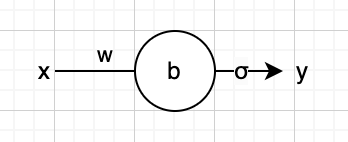

引入非线性变换后，我们的神经元变得更加强大了。现在，它表示的函数如下所示：

$$
y = f(x) = σ(wx + b)
$$

我们继续修改放大版的神经元示意图，把激活函数的计算也画进去，现在它看起来是下面这样：

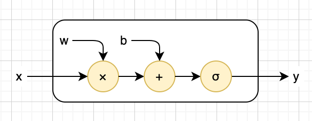

在人工神经网络中，这个用来引入非线性变换的函数，就叫做**激活函数**（Activation Function）。这个名字，直接来自它的核心功能：决定神经元是否被激活，以及激活到什么程度。如果你暂时还不太理解，也不用纠结，只要先看懂上面的公式就够了。随着你慢慢深入学习人工神经网络，自然会越来越明白它的作用。

那么真正的问题来了：激活函数到底长啥样呢？答案是，激活函数有很多种。这里我们先介绍三个最经典、最常用的。第一个激活函数叫做**Sigmoid**（也叫S型函数）。如果把它画出来，形状就像字母S，因此得名。它会把任意数值压缩到0～1之间，经常用来输出概率。下面是Sigmoid激活函数的定义：

$$
Sigmoid(x) = \frac{1}{1+e^{-x}}
$$

这里`e`表示自然常数，也叫欧拉数。如果用Python来实现Sigmoid函数，代码可能是下面这样：

```python
from math import e

def sigmoid(x: float) -> float:
    return 1 / (1 + e ** (-x))
```

第二个是**双曲正切函数**（Hyperbolic Tangent，简称Tanh），它会把任意数值压缩到-1～1之间。听名字就很复杂，对吧？（好像是这样的）下面是Tanh激活函数的定义：

$$
Tanh(x) = \frac{e^x - e^{-x}}{e^x + e^{-x}}
$$

如果用Python来实现Tanh函数，代码可能是下面这样：

```python
def tanh(x: float) -> float:
    a, b = e ** x, e ** (-x)
    return (a - b) / (a + b)
```

第三个是**修正线性单元**（Rectified Linear Unit，简称ReLU）。是不是名字听起来也很吓人？不过相比Sigmoid和Tanh，这个激活函数倒是特别简单：它会把小于0的数值都变成0，大于等于0的数值保持不变。下面是ReLU激活函数的定义：

$$
ReLU(x) = max(0, x)
$$

如果用Python来实现ReLU函数，代码可能是下面这样：

```python
def relu(x: float) -> float:
    return x if x >= 0 else 0
```

仅从数学公式来看，很难直观地理解这些激活函数。将它们画在坐标系中，会更容易看出它们的特点。下面是 [Sigmoid](https://www.desmos.com/calculator/97wpmsaney)、[Tanh](https://www.desmos.com/calculator/tuldscdhoa)和[ReLU](https://www.desmos.com/calculator/kxppk5qyd7)激活函数的图像：

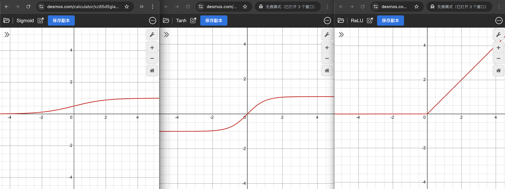

讲到这里，我需要说明几点。第一，小写希腊字母`σ`通常专门用来表示Sigmoid激活函数，但在本书中，我们用它来泛指所有激活函数。第二，虽然引入激活函数后，我们小小的神经元变得更加强大了，但到目前为止，它依然只有`w`和`b`两个参数。至于在真正的人工神经网络中该如何选择激活函数，这是个很重要的问题，我们留到后面再详细讨论。

在之前的Python代码中，我们在构造神经元时传入了`w`和`b`这两个参数；现在，我们把激活函数也作为“参数”传入。修改后的代码如下：

```python
def new_neuron(w: float, b: float, af):
    return lambda x: af(w * x + b)

neuron1 = new_neuron(w=1, b=2, af=sigmoid)
neuron2 = new_neuron(w=3, b=4, af=tanh)
neuron3 = new_neuron(w=5, b=6, af=relu)
print(neuron1(-1.2)) # 0.6899744811276125
print(neuron2(-3.4)) # -0.9999917628565104
print(neuron3(-5.6)) # 0
```


### 加权求和

我们前面构造的神经元都只有一个输入和一个输出，这样的神经元只能连成一串，无法形成真正的网络。为了突破这个限制，神经元需要变得更加强大，支持多个输入和多个输出。不妨就先从实现“多个输入”开始。假设某个神经元有三个输入，它的结构就如下图所示：

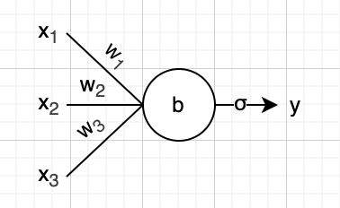

因为神经元有三个输入，所以参数`w`也对应变成了三个（和输入一一匹配）。需要注意的是，偏置参数 `b` 依然只有一个。相应地，神经元所表示的函数形式也发生了变化，新的计算公式如下所示：

$$
y = f(x_1, x_2, x_3) = σ(w_1 x_1 + w_2 x_2 + w_3 x_3 + b)
$$

聪明的读者一定已经看出来了吧？我们先把`w`和`x`一一相乘，再把所有乘积加起来，这正是经典的**加权求和**。这里的每一个`w`，就是对应输入`x`的**权重**（Weight）。参数`w`这个名字，正是取自英文单词权重的首字母。得到加权求和之后，再把偏置`b`也加上，然后再把结果送进激活函数就可以得到最终输出。我们把这些细节画进放大版的神经元示意图中，现在它看起来是下面这样：

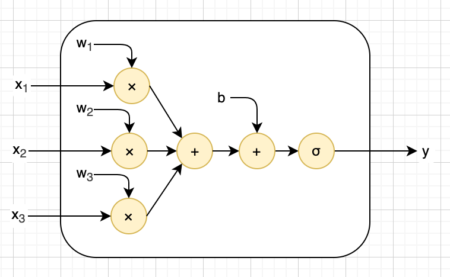

如果我们看懂了上面的图，也明白了全部的计算过程，就可以把神经元所接收的输入泛化到任意多个，并用数学里的求和符号来简化公式。新的函数和计算公式如下所示：

$$
y = f(x_1, x_2, ..., x_n) = σ(\sum_{i=1}^{n}{w_i x_i} + b)
$$

上面的等式看起来已经清爽多了，但还能进一步简化吗？答案是肯定的，我们有请**向量**（Vector）登场。假如某个神经元有n个输入，我们可以把这n个`x`写成向量形式 $[x_1, x_2, ..., x_n]$ ，并用大写字母`X`表示。相应的，我们把n个权重`w`也写成向量形式 $[w_1, w_2, ..., w_n]$ ，并用大写字母`W`表示。我们知道，向量**点积**正好可以用来计算加权求和：

$$
W \cdot X = w_1 x_1 + w_2 x_2 + ... + w_n x_n = \sum_{i=1}^n{w_i x_i}
$$

于是，我们就可以用向量和点积来简化神经元对应的函数与计算公式。新的等式如下所示：

$$
y = f(X) = σ(W \cdot X + b)
$$

注意，上面这个简化意义重大。第一，等式重新变得非常简洁；第二，表达的含义也十分明确：我们的神经元现在接受向量作为输入，输出单个数值；第三，也是最重要的一点：这种向量计算可以直接交给计算机的图形处理器（Graphics Processing Unit，简称GPU） 来优化执行，比直接在中央处理器（Central Processing Unit，简称CPU） 上快好几个数量级。

GPU在通用计算上不如CPU，但非常擅长向量点积这类运算，能够大规模并行执行大量计算任务。虽然对单个神经元来说，在CPU还是GPU上计算差别不大，但对于动辄拥有成百上千亿个参数的神经网络而言，两者的速度差距就天壤之别了。

现在我们来修改前面的Python代码，主要做两处调整：第一，构造神经元时，将参数`w`从数值类型改为列表类型（用以表示向量）；第二，神经元计算环节，把普通乘法替换为向量点积。新增的点积函数，以及修改后的神经元构造函数，代码如下：

```python
def dot_product(a: list[float], b: list[float]) -> float:
    return sum(x * y for x, y in zip(a, b))

def new_neuron(w: list[float], b: float, af):
    return lambda x: af(dot_product(w, x) + b)
```

神经元的代码已经准备就绪，现在我们用它来搭建一个简单的应用案例：这个应用接收三个输入 $x_1$ 、 $x_2$ 、 $x_3$ ，判断 $x_1$ 与 $x_2$ 之和是否大于 $x_3$ ，并将判断结果作为输出。对我们实现的神经元来说，完成这个任务易如反掌，只需为它设置合适的权重和偏置参数即可。将三个权重分别设置为：1、1、-1，将偏置设置为0，我们期望的计算如以下等式所示：

$$
y = 1 \times x_1 + 1 \times x_2 + (-1) \times x_3 + 0
$$

这里其实不用激活函数也可行，不过为了演示效果，我们选用最简单的ReLU函数。若最终输出大于0，则表示正向判断；反之则为反向判断。完整的应用代码和测试如下：

```python
neuron = new_neuron(w=[1, 1, -1], b=0, af=relu)
print(neuron([1, 2, 3]) > 0) # False
print(neuron([4, 5, 6]) > 0) # True
```

经过一番努力，我们的迷你“神经网络”已经拥有了四个参数（三个权重和一个偏置），它能判断某两个数之和是否大于第三个数。是不是很了不起？我们可以把它封装起来，对外提供服务啦，如下图所示：

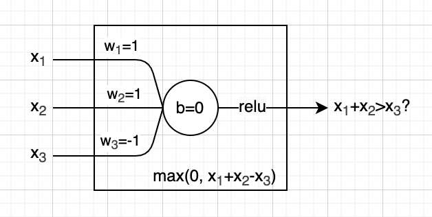


### MCP神经元

很多人会以为，人工神经元和神经网络是近几年才出现的时髦技术，其实不然。人工神经元的概念，早在1943年就已经诞生了。它由生物学家沃伦・麦卡洛克（[Warren McCulloch](https://en.wikipedia.org/wiki/Warren_Sturgis_McCulloch)）和逻辑学家沃尔特・皮茨（[Walter Pitts](https://en.wikipedia.org/wiki/Walter_Pitts)）在研究大脑工作机制后共同提出，初衷就是用机器模拟人类大脑的神经活动。这在当时是极具前瞻性的想法！要知道，那时候还没有真正进入计算机时代呢，世界上第一台通用电子计算机[ENIAC](https://en.wikipedia.org/wiki/ENIAC)直到三年后（1946年）才问世。

为了纪念这两位先驱，后人将他们提出的人工神经元模型命名为McCulloch–Pitts神经元，简称MCP神经元。MCP 神经元与本章介绍的神经元工作原理十分相似，感兴趣的读者可以查阅相关资料或阅读当年的原始[论文](https://en.wikipedia.org/wiki/A_Logical_Calculus_of_the_Ideas_Immanent_in_Nervous_Activity)，进一步深入学习。

MCP神经元的想法在当时实在太过超前，受限于那个年代的技术条件，很难搭建出真正实用的神经网络。直到1958年，人类历史上第一个具备自动学习能力的人工神经网络才终于出现。它掀起了人工智能史上第一波热潮，却又因一本著作而迅速陷入低谷。这段有趣的历史，我会在下一章为你详细介绍。


### 人工智能

我们前面已经多次提及**人工智能**（Artificial Intelligence，简称 AI），这个词最早是在 1956 年的[达特茅斯夏季研究项目](https://en.wikipedia.org/wiki/Dartmouth_workshop)中正式提出的。该会议由约翰・麦卡锡（[John McCarthy](https://en.wikipedia.org/wiki/John_McCarthy_(computer_scientist))）、马文・明斯基（[Marvin Minsky](https://en.wikipedia.org/wiki/Marvin_Minsky)）、克劳德・香农（[Claude Shannon](https://en.wikipedia.org/wiki/Claude_Shannon)）与纳撒尼尔・罗切斯特（[Nathaniel Rochester](https://en.wikipedia.org/wiki/Nathaniel_Rochester_(computer_scientist))）共同发起，它也标志着人工智能作为一门独立学科正式诞生。

上述四位科学家都是计算机科学与人工智能领域里程碑式的人物，他们每一个人的成就都值得大书特书、深入研读。不过限于本书篇幅，我们这里仅列举他们成就中最具影响力的一两个核心亮点，其余诸多重要贡献，感兴趣的读者可以自行查阅相关资料进一步了解。

例如，约翰・麦卡锡是著名的 Lisp 语言发明者。这门语言成为早期人工智能研究的核心工具，深刻影响了后续编程语言的发展，同时他也是 1971 年图灵奖获得者，以其对人工智能学科的奠基性贡献，被公认为 “AI 之父” 之一。

马文・明斯基是早期神经网络与认知科学研究的先驱，同样是 1969 年图灵奖得主。他创建了麻省理工学院人工智能实验室，推动了认知科学与人工智能的深度融合。我们在下一章介绍感知机时，会重点介绍这位先驱者的核心贡献。

克劳德・香农则是信息论的创始人，被誉为 “数字时代的奠基人”，他提出的信息熵等核心理论，不仅奠定了现代通信技术的基础，更为人工智能中的数据表示、信息处理与智能决策提供了不可替代的数学支撑。

纳撒尼尔・罗切斯特是汇编语言的重要开创者，极大降低了编程门槛，为计算机普及奠定了基础。同时他也是计算机体系结构与软件工程领域的早期奠基人，主导设计了 IBM 701 这一里程碑式的商用科学计算机。

总之，由这四位先驱共同发起的达特茅斯会议，极大地激发了学术界与工业界对智能机器研究的热情，吸引了大量资金、人才与项目投入，开启了人工智能发展史上的第一个黄金时代，是人工智能发展历程中最重要的里程碑。而这段黄金时代，会在十几年后因马文・明斯基与另一位人工智能先驱合著的一部著作，以及后续一系列研究争议与经费政策转向而骤然陷入低谷，这一关键转折我们也将在下一章末尾详细展开。


### 本章小结

本章我们从单输入、单输出且仅含一个权重参数的神经元入手，介绍了其基本概念；随后引入偏置参数，再讲解激活函数，让神经元具备了非线性输出能力；接着将参数推广至任意多个，并阐释了加权求和的核心原理；最后补充了MCP神经元以及“人工智能”的相关历史背景。

如果你理解了本章内容，一定会惊讶于人工神经元的原理竟如此简单。你或许很难相信，正是这些看似不起眼的小单元，能组合成复杂的神经网络，甚至展现出逼近人类的智能水平。但事实确实如此，下一章，我便会带你初步验证这一结论。

<div style="page-break-after: always;"></div>

## 第二章：单层神经网络

在第一章中，我们已经了解了神经网络最基础的构成单元——神经元是如何工作的。我们知道，一个神经元的本质其实很简单：它先把n个输入分别与对应的权重相乘，再把所有结果加在一起；随后再加上一个偏置，对整体结果做一次平移调整；最后把这个值送入一个激活函数，完成一次非线性变换，输出最终结果。整个过程，就是人工神经元最核心的计算逻辑。

不过，单个神经元的能力终究是有限的。可一旦把大量神经元相互连接，组成一张神经网络，它能实现的功能就会变得异常强大。神经网络的结构，通常是一层一层搭建起来的。在本章，我会先带你认识单层神经网络，你很快就能直观感受到它的威力。而在下一章，我们再继续深入，一起学习更复杂的多层神经网络。


### 两个神经元

到目前为止，我们一直都在让单个神经元单打独斗。接下来，我们给它配上一个小伙伴，让它们一起工作，构成一个真正意义上的神经网络。为了画图和讲解方便，我们依然假设该网络有三个输入。这三个输入会同时被两个神经元完整接收，各自完成计算，最终分别输出一个结果，一共得到两个输出。这个简单的小神经网络，参数已经达到了八个（六个权重加两个偏置），结构如下图所示：

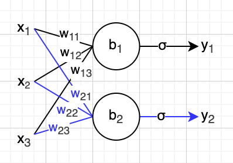

注意，虽然它们已经组成了一个小团队，但这两个神经元依然各自独立工作，不共享权重参数，彼此之间也并没有任何互动。我们在第一章已经学过单个神经元的工作原理，现在我们把这两个神经元的计算公式写在一起，如下所示：

$$
y_1 = f_1(x_1, x_2, x_3) = σ(w_{11} x_1 + w_{12} x_2 + w_{13} x_3 + b_1) \\
y_2 = f_2(x_1, x_2, x_3) = σ(w_{21} x_1 + w_{22} x_2 + w_{23} x_3 + b_2)
$$

还记得吗？我们可以用**向量**来简写输入列表与权重列表，再通过**点积**运算来完成输入的加权求和。举个例子，我们可以用大写字母 $W_1$ 表示向量 $[w_{11}, w_{12}, w_{13}]$ 。这样一来，上面的公式就可以简化成下面这样：

$$
y_1 = f_1(X) = σ(W_1 \cdot X + b_1) \\
y_2 = f_2(X) = σ(W_2 \cdot X + b_2)
$$

就像前一章一样，我们可以把上面这个由两个神经元组成的小网络放大，把计算细节画进去，如下图所示。注意，输入X、权重W，以及输出Y，全部都是大写字母，表示向量。

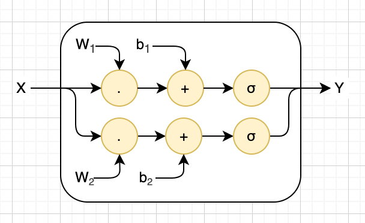

那么，前面这两个等式还能进一步简化吗？答案依然是肯定的。在数学中，我们把单个数值称为**标量**（Scalar）；把多个数值排成一行，放在小方括号里，就称为**向量**（Vector）；而把多个数值排成阵列形式，同样放在大方括号中，就叫作**矩阵**（Matrix）。比如，我们把六个权重参数排成两行三列，组合成一个矩阵，并用大写字母`W`表示，形式如下：

$$
W = \begin{bmatrix}
w_{11} & w_{12} & w_{13} \\
w_{21} & w_{22} & w_{23}
\end{bmatrix}
$$

顺便说一下，如果一个向量里有n个数值，我们就说这是一个n维向量。如果一个矩阵有n行m列，我们就说这是一个n×m矩阵。矩阵也可以只有一行数据，也就是说，向量其实是一种特殊的1×m矩阵。同样，矩阵也可以只有一列数据。因此，我们也可以把输入列表、输出列表、偏置列表都写成n×1矩阵形式，如下所示：

$$
X = \begin{bmatrix}
x_1 \\
x_2 \\
x_3
\end{bmatrix},
Y = \begin{bmatrix}
y_1 \\
y_2
\end{bmatrix},
B = \begin{bmatrix}
b_1 \\
b_2
\end{bmatrix}
$$


于是，我们就可以使用矩阵乘法和加法，重新写出由这两个神经元构成的小神经网络的计算公式。为了清晰起见，我们先把所有矩阵元素都明确写出来，完整公式如下所示。注意，当我们把矩阵丢给激活函数时，它会在矩阵的每一个元素上面起作用，输出一个同样大小的矩阵。

$$
\begin{bmatrix}
y_1 \\
y_2
\end{bmatrix}=σ(
\begin{bmatrix}
w_{11} & w_{12} & w_{13} \\
w_{21} & w_{22} & w_{23}
\end{bmatrix} \times
\begin{bmatrix}
x_1 \\
x_2 \\
x_3
\end{bmatrix} +
\begin{bmatrix}
b_1 \\
b_2
\end{bmatrix})
$$

也许你还不熟悉矩阵乘法的计算规则，这完全没关系。你可以去网上简单了解，也可以直接忽略不计。你只需要记住：上面这行紧凑的公式，和前面两行的公式是**完全等价**的。而且，用上矩阵之后，就算神经元和输入的数量再多，我们也能轻松表示。假设某个和上面结构类似的神经网络，有n个独立工作的神经元，接收m个输入，它的计算公式就可以写成：

$$
\begin{bmatrix}
y_1 \\
y_2 \\
\vdots \\
y_n
\end{bmatrix}=σ(
\begin{bmatrix}
w_{11} & w_{12} & \dots & w_{1m} \\
w_{21} & w_{22} & \dots & w_{2m} \\
\vdots & \vdots & \ddots & \vdots \\
w_{n1} & w_{n2} & \dots & w_{nm}
\end{bmatrix} \times
\begin{bmatrix}
x_1 \\
x_2 \\
\vdots \\
x_m
\end{bmatrix} +
\begin{bmatrix}
b_1 \\
b_2 \\
\vdots \\
b_n
\end{bmatrix})
$$

好的，相信你已经理解这个概念了。现在我们可以把矩阵里的具体元素隐藏起来，整个公式就又会变得非常简洁：

$$
Y = f(X) = σ(WX + B)
$$

我们利用矩阵乘法，可以把上面这个计算公式画进神经网络的内部，看起来是下面这样。注意，输入X、输出Y和偏置B仍然是列向量（或者说只有1列的矩阵），但是权重W是n×m矩阵。

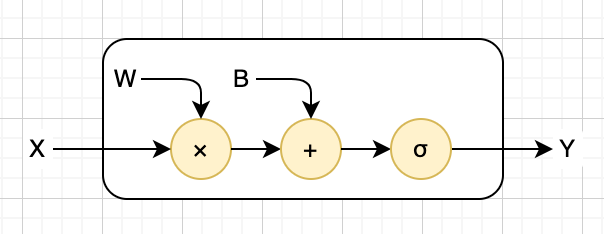

还记得前一章我们提到，GPU特别擅长处理向量计算吗？其实这个说法并不够准确，主要是因为在上一章我们还没有介绍矩阵运算。事实上，GPU真正擅长的是矩阵运算。换句话说，我们这个神经网络的整套计算，完全可以直接交给GPU高效处理。借助矩阵，公式不仅看起来简洁，还天然隐含了计算上的优化，真是一举两得。

好了，我们的神经网络经历了一番蜕变：从单个输入到多个输入；从单个神经元到多个独立工作的神经元构成网络。它变复杂了，能力也变强了，但本质上仍然只是一个函数，而且函数的形式也没怎么变，不信你看下这张表：

| 神经网络                       | 公式                   | 说明                       |
| ------------------------------ | ---------------------- | -------------------------- |
| 单个神经元，单个输入，单个输出 | $y = f(x) = σ(wx + b)$ | $x$ 、 $y$ 、 $w$ 和 $b$ 都是标量 |
| 单个神经元，多个输入，单个输出 | $y = f(X) = σ(WX + b)$ | $X$ 和 $W$ 是向量             |
| 多个神经元，多个输入，多个输出 | $Y = f(X) = σ(WX + B)$ | $X$ 、 $Y$ 、 $W$ 和 $B$ 都是矩阵 |


### 简化网络图

如果神经网络只有几个神经元、少数输入，像前面那样画图，问题还不大。但我们接下来要面对的网络规模会相当可观，可能会有几百个神经元。如果还像之前那样细致画图，不仅十分繁琐，也不美观。因此，我们需要对图示进行简化。

具体来说，我们做五点简化：第一，权重不再逐一标出，你只需知道每条连接线上都对应一个权重参数即可；第二，偏置也不画出，你只需知道每个神经元都带有一个偏置参数；第三，激活函数同样隐藏，心里有数就行。做完这三点简化后，前面例子里的神经网络就可以画成下图（中）这样。

让我们继续简化。第四，去掉输出信号与连线，直接把输出值写在神经元内部；第五，把输入也视作神经元，并将输入值直接写进神经元里。经过这两步简化后，我们的神经网络就可以画成下图（右）这样：

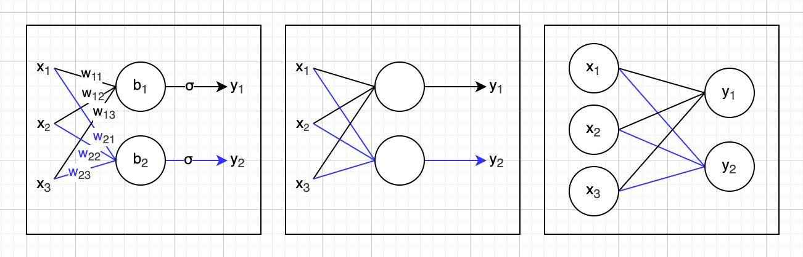

好啦，我们化繁为简。从此以后，权重、偏置和激活函数，就都记在心里就好。那么问题来了：画成这样之后，我们的神经网络到底是一层，还是两层？从结构图上看，它确实包含输入层与输出层两层；但在神经网络的通用定义中，只有带可学习参数的层才被计入网络层数。因此，这是一个单层神经网络。重点在于，每一个输入神经元都与每一个输出神经元相连接，我们把这样的神经网络层叫做**全连接层**（Fully Connected Layer）。

另外，不难看出，假设某个全连接层有n个输入、m个输出，那么它对应的权重和偏置参数总数量可以用下面这个公式计算：

$$
params = (n + 1) \times m
$$


### 玩具全连接层

在第一章中，我们通过 Python 代码实现了基础的人工神经元，用于直观演示其工作原理。在本节，我们将继续用代码实现全连接网络层，展示其计算过程。为了省去手动实现矩阵乘法、向量加法等繁琐步骤，我们直接使用大名鼎鼎的 NumPy 库来完成这些计算。事实上，实现一个完整的全连接层非常简洁，除去库导入和测试代码，核心逻辑仅需两行，具体实现如下：

```python
import numpy as np

def new_fc_layer(w, b, af):
    return lambda x: af(w @ x + b)

w = np.array([[0.11, 0.12, 0.13],
              [0.21, 0.22, 0.23]])
b = np.array([0.31, 0.32])

layer = new_fc_layer(w, b, np.tanh) 
x = np.array([0.4, 0.5, 0.6])
print(layer(x)) # [0.45580236 0.57301481]
```

我们通过 NumPy 提供的 `array` 方法来创建矩阵与向量。特别需要注意代码中的 `@` 运算符，它是 NumPy 中专门用于矩阵乘法的符号。虽然输入参数 `x` 是一个一维向量，但 NumPy 会自动将其视为 3×1 的列向量参与运算，无需我们手动转换，使用起来非常方便。另外，NumPy还提供了Tanh激活函数，我们在测试代码里直接使用就可以了。


### MNIST数据集

前面我们的神经网络还太小，只能解决一些简单问题，比如预测直线上点的坐标、判断两个数是否大于第三个数，诸如此类。现在，我们终于可以挑战更复杂的任务了，比如人工神经网络领域的经典“Hello, World”案例：识别手写数字。不过在这之前，我们需要一些手写数字样本。好在这个麻烦早就有现成的解决方案，那就是[MNIST数据集](https://en.wikipedia.org/wiki/MNIST_database)。这一小节，我会简单介绍这个数据集，让你先有个基本认识。下一节我们就用Python代码写一个单层神经网络，并教它识别手写数字。

好，言归正传。MNIST数据集一共包含70,000张手写数字图片，其中60,000张用于训练，10,000张用于测试。这些图片都是灰度图，尺寸统一为28×28像素。也就是说，每张图片由784个像素点组成，每个像素占用一个字节，数值大小对应灰度深浅：0代表黑色，255代表白色。除此之外，每张图片还附带一个**标签**（Label），标明它对应的数字是0～9中的哪一个。你一定很好奇这些手写数字究竟长什么样，下面这张图就展示了其中一些例子：


那么，我们该从哪里获取MNIST数据集呢？本书的示例代码主要基于开源的深度学习框架PyTorch编写，用它下载并加载MNIST十分方便，绝大部分工作都会自动完成，具体可以参考下面的Python代码片段。如果你使用其他框架，通常也会提供类似的便捷方法。

```python
from torchvision import datasets, transforms

transform = transforms.ToTensor()
train_dataset = datasets.MNIST(root="./data", train=True, download=True, 
                               transform=transform)
test_dataset = datasets.MNIST(root="./data", train=False, 
                              transform=transform)
```

就算你暂时没看懂上面的代码也没关系，因为这也不是重点。你只需要知道：它会自动帮你把MNIST数据集下载到指定目录，并将训练数据和测试数据分别加载到内存中，供后续代码使用。其他相关代码，我们会在后面的小节再介绍。


### 识别手写数字

接下来，就让我们一起见证“大力出奇迹”的时刻。我们将搭建一个单层神经网络，利用MNIST数据集进行训练，让它学会识别手写数字。说是搭建，其实非常简单。以我们目前掌握的知识，只需要构建一个全连接层就足够了。把MNIST手写数字图片作为输入，网络就能直接输出对应的识别结果。

先来看输入部分。先不用纠结MNIST手写数字图片是不是二维的，你只需要把它看成28×28个像素点，每个像素点对应一个数值。这些像素值连在一起，就是一个长度为784的向量，也可以看作一个784×1的矩阵。因此，我们的神经网络一共需要784个输入神经元。

输出层的设计，倒是很有讲究。你可能会想：不就是输出0～9这十个数字吗？其实没这么简单。就算是人，也有看走眼的时候，更不用说神经网络了。因此，我们更希望网络输出的是**概率**，表示它认为这张图片是某个数字的可能性有多大。比如，网络可以输出：是数字7的概率为95.1%，是数字1的概率为4.3%，以此类推。所以，我们一共设置10个输出神经元，并且期望每个输出值都在0.0～1.0之间，分别对应数字0～9的概率。并且，这10个概率加起来，应该正好等于1。

如果要亲手画出这个神经网络的示意图，工作量可不小。好在有一个很方便的工具叫做[NN‑SVG](https://alexlenail.me/NN-SVG/index.html)，可以帮我们自动生成简化后的神经网络结构图。我用它生成的示意图大致如下。这个神经网络里一共有794个神经元、7,840条连接，线条密密麻麻，几乎看不清细节，我们只要直观感受一下它的复杂度就可以了。

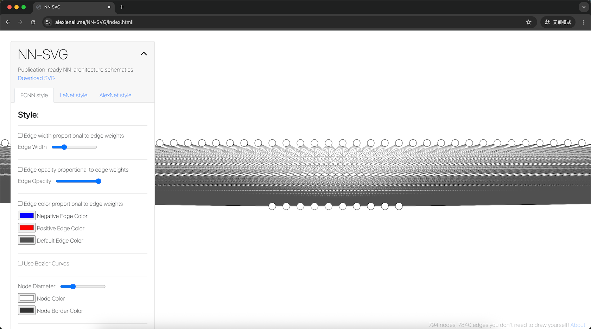

根据前文的公式，我们很容易算出这个神经网络的总参数数为`(784+1)×10`，也就是7,850个参数。在第一章中，单个神经元的结构比较简单，我们都是手动设置参数。但上面这个看似简单的网络，实际已包含七千多个参数，手动设置显然不太现实，因此我们必须通过训练让它自动学习并调整参数。我已经用PyTorch框架实现了这个神经网络，代码其实非常简洁。这里仅展示构建网络的核心部分，完整代码可从本书配套源代码中获取。

```python
# 定义神经网络（感知机）
class Perceptron(nn.Module):
    def __init__(self):
        super(Perceptron, self).__init__()
        self.fc = nn.Linear(28 * 28, 10) # 全连接层：784 -> 10

    def forward(self, x):
        x = x.view(-1, 28 * 28) # 展平
        x = self.fc(x)
        return x
```

不懂编程的读者也完全不用担心。你只需要知道：PyTorch框架已经帮我们完成了大量底层工作，我们只需要简单描述出这个全连接层就够了。暂时也不用关心具体的训练过程，在本书后半部分我会为你详细讲解。现在，你不妨把它当成一个黑箱魔法：写好代码，用MNIST数据集跑一遍，这七千多个参数就会自动被调整好。我已经帮你运行了一遍这份代码，结果如下：

```
# uv run python ch02/perceptron.py 
Epoch [1/5], Loss: 0.9870
Epoch [2/5], Loss: 0.5525
Epoch [3/5], Loss: 0.4722
Epoch [4/5], Loss: 0.4333
Epoch [5/5], Loss: 0.4090
Test Accuracy: 89.93%
```

我们只看最后一行结果就够了：训练完成后，这个神经网络在识别MNIST手写数字时，准确率已经接近90%，简直难以置信！如果你有编程基础，可以想象一下：要是不使用神经网络，完全靠自己手写规则去识别这些数字，过程得有多么繁琐，而且未必就能达到这么高的准确率。

还有两点需要澄清。第一，我们目前的这个神经网络实际上并没有使用任何激活函数，它只是对输入做了一次线性变换。在下一章中，我们会对网络进行改进，在模型中加入激活函数。第二，输出层的10个神经元目前输出的只是**原始分数**（通常称为Logits），而不是概率。为了把这些分数转换为表示各个数字概率的数值，并使所有概率之和等于1，通常会使用一种叫作**Softmax**的函数。关于Softmax函数的具体原理，我也会在下一章中详细介绍。


### 感知机

我们上面实现的神经网络结构这么简单，是不是早就被前人想到了？你又猜对了：它就是我们在第一章结尾提到的[感知机](https://en.wikipedia.org/wiki/Perceptron)（Perceptron），也是人类历史上第一个具备自动学习能力的人工神经网络。

我们知道，由于时代条件的限制，MCP神经元的思想在问世后很长一段时间里都难以落地。直到1957年，心理学家和人工智能先驱弗兰克・罗森布拉特（[Frank Rosenblatt](https://en.wikipedia.org/wiki/Frank_Rosenblatt)），在IBM 704计算机上模拟实现了感知机。到了1960年，他又进一步造出了专用计算机，名为马克一号（[Mark I](https://en.wikipedia.org/wiki/Mark_I_Perceptron)）感知机。上一小节的Python代码里，我们的神经网络就叫做`Perceptron`，现在你知道原因了吧。

如果你想更深入地了解感知机，可以进一步查阅相关资料。我在整理资料时发现了一个非常有意思的[网站](https://perceptrondemo.com/)，它不仅图文并茂地介绍了感知机的发展历史，还提供了可交互的演示Demo，能把抽象的感知机直观地展示出来，对理解它的工作原理非常有帮助。我推荐你也试试，具体效果可以参考下面的截图：

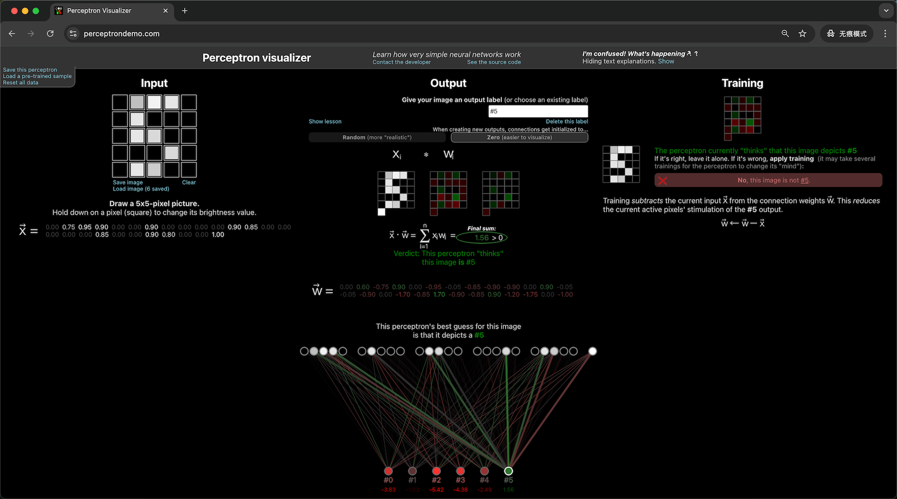

感知机问世之后，人工智能领域迎来了第一波发展热潮。人们纷纷对它寄予厚望，相信它即将开启智能机器的新时代，这波热潮足足持续了十年之久。不过在实践中，人们也渐渐发现，感知机的能力似乎并没有想象中那么强大。直到1969年，人工智能先驱马文・明斯基（[Marvin Minsky](https://en.wikipedia.org/wiki/Marvin_Minsky)）和西摩・派珀特（[Seymour Papert](https://en.wikipedia.org/wiki/Seymour_Papert)）出版了那本著名的[《感知机：计算几何学导论》](https://en.wikipedia.org/wiki/Perceptrons_(book))。

这本书不仅详细剖析了Frank Rosenblatt提出的感知机，还以清晰严谨的方式证明了一个关键结论：感知机的模型能力存在本质局限。更准确地说：它只能解决[线性可分问题](https://en.wikipedia.org/wiki/Linear_separability)。说得再直白一点：比如它连最简单的[异或（XOR）问题](https://en.wikipedia.org/wiki/Exclusive_or)都无法解决。

你可能还不了解什么是线性可分问题，甚至也不清楚是什么异或问题，但这完全不影响你继续阅读本书。然而，这个局限对当年的感知机和它的拥趸而言，却是致命的打击，也直接引发了人工智能历史上的第一次寒冬。许多科学家纷纷转向其他研究领域，只有一小部分研究者仍在艰难地坚持探索。也正是多亏了这群不曾放弃的人，我们今天的大模型时代，才不会被推迟更久才到来。


### 机器学习

不过，《感知机》一书并没有将神经网络一棒子打死。相反，它其实给出了破局的思路。简单来说：没有什么问题，是增加一个**隐藏层**解决不了的；如果有，那就再加一层。只可惜，当时的技术条件依然有限，人们还不知道该如何训练这种多层神经网络，于是再一次陷入困局。直到1986年，**反向传播**算法问世，这个难题才终于被攻克。关于隐藏层，我会在下一章详细讲解；而反向传播算法，暂时当成魔法就好，我会在本书的后半部分为你慢慢介绍。

虽然本章尚未专门介绍相关概念，但这种只需设计好算法架构，让程序通过训练数据自主学习并获得合适参数的方式，就称为**机器学习**（Machine Learning，简称ML）。在这一方法中，通过数据不断调整模型参数的过程被称为**训练**。在MNIST数据集中，每一张手写数字图片都带有对应的标签。这种利用已知标签为程序提供学习依据的机器学习方式，被称为**监督学习**（Supervised Learning）。

相反，在没有标签、也没有标准答案的场景下，让模型从原始数据中自动发现内在结构、模式与规律的一类机器学习方法，称为**无监督学习**（Unsupervised Learning）。关于无监督学习的更多细节，我们会在后续章节中详细介绍。

对于监督学习而言，它能解决的问题大致可以分为两大类。第一类是**分类任务**（Classification）。这类任务的目标是将输入数据划分到预先定义好的离散类别中。比如经典的手写数字识别，模型需要判断一张图片对应的数字是 0 到 9 中的哪一个；再比如图像识别里区分一张图片是猫还是狗；又比如对一封电子邮件进行判断，识别它是正常邮件还是垃圾邮件。这些任务的共同点是：输出是有限、固定的类别，而不是连续变化的数值。

第二类是**回归任务**（Regression）。这类任务的目标不再是分类，而是预测一个连续的数值。例如预测某地区房屋的价格、未来某一天的气温、某个商品下个月的销量、用户未来一段时间的消费金额等。这类问题的输出可以是整数，也可以是小数，取值范围通常是一个连续区间，我们会在后面的章节详细介绍。

我们回到手写数字识别的例子。理论上或许存在一个理想函数：输入一张手写数字图片，就能100%准确判断出对应的数字。但在现实中，我们通常并不知道这样的函数具体是什么，只能想办法去逼近它。就像本章我们搭建的单层神经网络，手写数字识别的准确率尚且不足90%。这类对理想函数进行近似实现的数学表达，我们称之为**模型**（Model）。本章实现的模型仅有数千个参数，规模可以说微不足道；而当模型的参数规模达到数十亿、数百亿甚至更多时，人们通常将其称为**大模型**（Large Model）。

最后提一下，在人工智能研究领域，这种通过神经网络等模型从数据中学习参数、而非依赖人工编写规则来实现智能的流派，叫做**连接主义**（Connectionism）；相反，那种依靠人工定义明确逻辑规则、通过符号表示与符号推理实现智能的学派，叫做**符号主义**（Symbolism）；此外，还有一种强调智能体通过与环境交互，并根据行为反馈逐步学习策略的思路，被称为**行为主义**（Behaviorism）。


### 本章小结

本章首先介绍了由两个神经元构成的简易神经网络，随后讲解了如何通过矩阵运算简化网络的函数表达，以及GPU对这类运算的优化执行逻辑。我们还对神经网络示意图进行了简化，使其更适合表示大规模节点的网络结构。在此基础上，引入经典的MNIST手写数字数据集，设计并通过PyTorch实现了一个单层神经网络，完成了手写数字识别的训练与验证。最后，补充介绍了感知机的发展历程与相关背景知识，并对机器学习算法的基本概念做了初步说明。

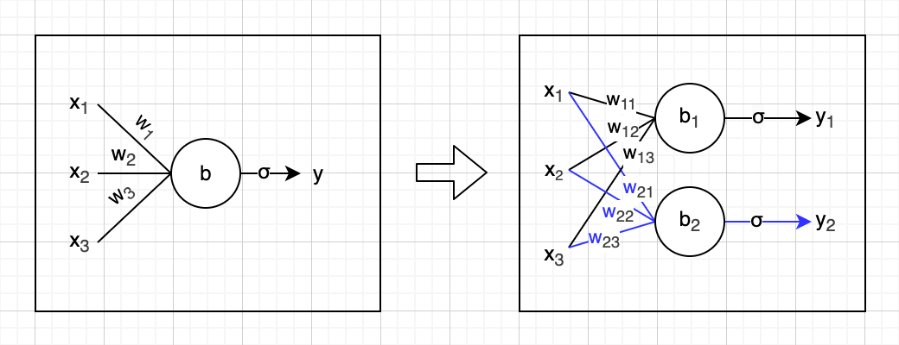

理解了单层神经网络的原理后，我们就可以迈出关键一步：将多个单层网络逐层叠加，从而构建出表达能力更强的多层网络。在下一章，我们将从结构最简单的多层感知机入手，一步步揭开多层网络的奥秘。在这之后，我们还会陆续介绍卷积神经网络（Convolutional Neural Network，简称CNN）、循环神经网络（Recurrent Neural Network，简称RNN）等更复杂、更强大的深度学习架构，带你一步步走进现代人工智能的核心世界。

<div style="page-break-after: always;"></div>

## 第三章：多层神经网络

在第一章中，我们讨论了人工神经网络的基本构成单元，也就是神经元的工作原理。在第二章中，我们进一步讨论了多个神经元如何组成单层神经网络，并动手设计了这样一个网络，用于识别手写数字。很难想象，如此简单的小型神经网络在经过MNIST数据集训练后，便能实现手写数字识别，且准确率接近90%。

我们知道，单层神经网络的计算能力是有限的。解决这一局限的方法在上一章中已经提及，那就是增加网络层数。本章将介绍如何为网络构建多层结构，并对上一章的实例进行改进，观察手写数字识别率能够提升到何种水平。上一章中还曾提到Softmax函数，但未展开介绍，本章也将对其进行详细讲解。


### 隐藏层

回顾第二章开头介绍的由三个输入、两个输出组成的简单神经网络，我们将输入神经元所在的层称为**输入层**，输出神经元所在的层称为**输出层**。由于输入层不包含权重与偏置参数，因此通常不将其算作真正意义上的网络层。从这个角度来看，该网络本质上仍是一个单层神经网络。现在我们对这个网络稍作修改，在中间增加一层神经元，并重新调整连接关系，如下图所示：

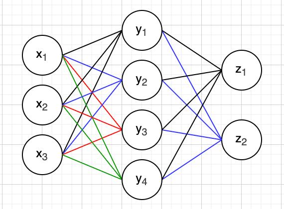

我们知道，输入层和输出层都是对外可见的：输入层负责接收外界信息，输出层负责呈现最终结果。而中间的层级，只在神经网络内部参与运算，外部无法直接观察，因此我们称之为**隐藏层**。

这样的网络结构看上去复杂了一些，但本质上并没有引入新的概念。我们完全可以把它拆开理解：输入层到隐藏层看成一个单层神经网络，隐藏层到输出层看成另一个单层神经网络。说白了，它就是两个单层全连接网络简单堆叠在一起。这两个单层网络各自都遵循我们前面介绍的计算规则，把它们放在一起，就可以写成下面的形式：

$$
H = f_1(X) = σ(W_1 X + B_1) \\
Y = f_2(H) = σ(W_2 H + B_2)
$$

如果我们像前面的章节一样，把全连接层的计算细节画出来，那么这个两层网络看起来是下面这样。注意，X、H、Y和偏置B都是列向量，而权重W则是矩阵。

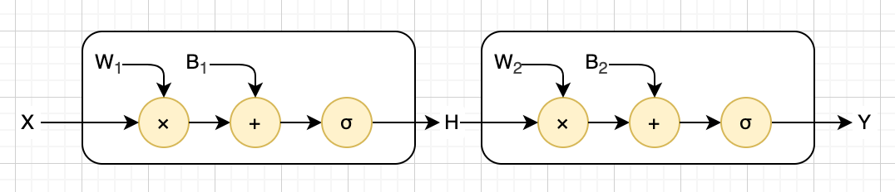

由于我们已经非常熟悉单层神经网络的计算公式，因此不妨省略中间细节，把上面两行公式合并成一行，如下所示：

$$
Y = f(X) = f_2(f_1(X))
$$

如果你熟悉Unix/Linux Shell，一定马上会想到管道（Pipe）机制；或者你熟悉函数式编程，也能联想到类似的串联执行效果。就算这两个你都不了解也没关系，我们还可以用一条假想的橙汁流水线来理解：送入一个橙子，第一道工序把它清洗干净，传给下一道；第二道工序去掉果皮，再传给下一道；第三道工序榨出橙汁，倒入杯中；最后一道工序密封包装、贴上标签，一杯新鲜橙汁就制作完成了。

我们的多层神经网络也是这样工作的。一组信号流入第一层神经网络，得到一组输出；这组输出再作为新的输入，流入第二层神经网络，得到新的输出。如此逐层传递，直到最后一层，产生最终的输出信号。既然如此，无论神经网络有多少层，我们都不必费力写出每一层的公式。假如有一个N层神经网络，我们仍然用Y表示最终输出，那么可以把整个网络统一写成一个公式，如下所示：

$$
Y = f(X) = f_n(...f_2(f_1(X))...)
$$


### 深度学习

顺便说一下，如果一个神经网络包含多个隐藏层，我们就可以把它称为**深度神经网络**（Deep Neural Network，简称 DNN）。这里的“深度”，指的其实就是网络中“层”的数量更多。层数越多，信息需要经过的计算步骤就越多，因此被形象地称为“更深”。而以这种深层神经网络为基础的机器学习方法，则被称为**深度学习**（Deep Learning，简称 DL）。

另外，我们这一章所讲的神经网络，信息是从输入层一路向前传递到输出层的，中间不会回头，也没有循环或反馈。这种最基础、最简单的网络结构，被称为**前馈神经网络**（Feedforward Neural Network，简称 FNN）。它可以看作是后面各种复杂网络结构的起点。

在后面的章节中，我们还会介绍一些结构更加复杂的模型，例如带有“循环结构”的网络（如 RNN），以及基于注意力机制的模型（如 Transformer）。不过，无论这些模型多么复杂，它们的基础，仍然可以追溯到这里介绍的这种最简单的前馈结构。


### 多层感知机

深度神经网络具备非常强大的表达能力，这一点我们会在后面的章节中逐步介绍。而目前我们能构建的，还只是最简单的一类神经网络结构，也就是由多个全连接层组成的前馈神经网络。由于这种网络可以看作是在前一章介绍的感知机模型基础上的扩展，因此通常被称为**多层感知机**（Multi-Layer Perceptron，简称MLP）。

实际上，多层感知机在功能上正是由多个感知机依次连接构成的。除了第一层的感知机直接接收外部输入外，每一个感知机的输出，都会作为下一个感知机的输入，信号在网络中逐层传递。一个由四个感知机依次串联组成的多层感知机结构，如下图所示：

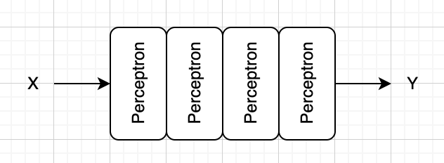

我找到一个非常适合理解多层感知机的网站，它用可视化的方式，展示了一个能识别手写数字的多层感知机是如何工作的。需要说明的是，这个模型已经预先训练完成，你不需要关心训练过程，只需关注它如何识别数字即可。如果你一路跟着本书学到这里，却感觉知识还没完全串起来，或是对某些细节理解得不够透彻，我强烈推荐你去体验一下这个工具。这个工具完全在浏览器中运行，有[2D](https://adamharley.com/nn_vis/mlp/2d.html)和[3D](https://adamharley.com/nn_vis/mlp/3d.html)两个版本，下面是2D版本的截图：

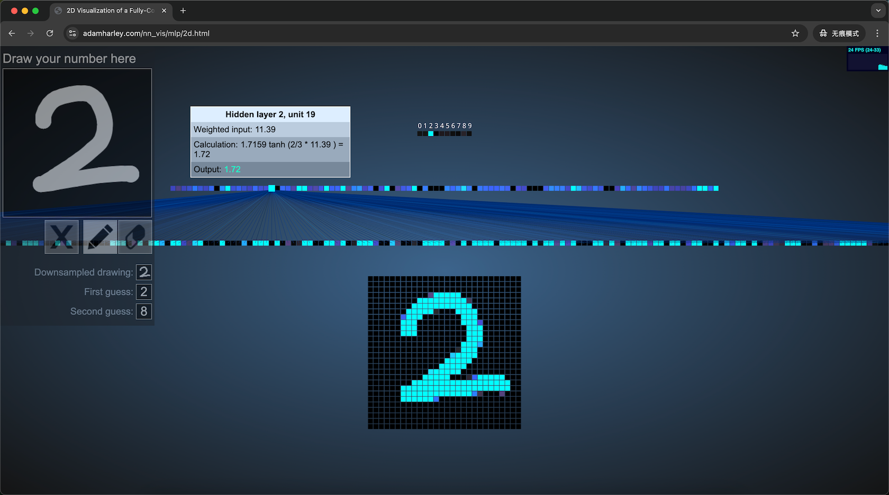

以2D版本为例，这个MLP可视化工具的左上角是一块手写板，你可以直接手写数字进行测试。界面中其他区域的每一个小方格，都代表一个神经元。方格的亮度对应神经元的输出值：颜色越亮，代表数值越高。当你在手写板上书写数字时，整个神经网络会进行实时计算，并将结果立刻反映在所有神经元方格的颜色变化上。

网页最下方是一个由28×28个小方格组成的数字显示器，尺寸正好对应训练网络时使用的MNIST数据集图像。你在手写板上书写的内容，会被压缩为28×28像素的灰度图并显示在这里，这正是当前神经网络的输入层。

输入层上方是由300个神经元组成的隐藏层，再往上是另一个由100个神经元构成的隐藏层。最上方则是由10个神经元组成的输出层，分别对应0～9各个数字的得分。得分越高，代表神经网络判定为该数字的可能性越大。需要注意的是，这里的得分还不是严格意义上的概率。我会在后面的小节介绍如何通过Softmax函数，将这些得分转化为标准概率。

如果你选中某个神经元，网页还会以连线的形式把它对应的所有权重展示出来。比如上面的截图，就选中了第二个隐藏层中的第19个神经元。和神经元的表示方式一样，连线的颜色代表权重大小，线条越亮，对应的权重值越高。同时，页面还会弹出一个小窗口，显示该神经元的具体位置、带偏置的加权输入值，以及最终的输出值。从截图里也能看出，这个神经网络使用了我们在第一章介绍过的Tanh激活函数。

那么这个多层感知机一共有多少个参数呢？我们用上一章的公式来计算一下，结果见下表：

| 层     | 输入 | 输出 | 算式            | 参数数量 |
| ------ | ---: | ---: | --------------- | -------: |
| 第一层 |  784 |  300 | (784 + 1) × 300 |  235,500 |
| 第二层 |  300 |  100 | (300 + 1) × 100 |   30,100 |
| 输出层 |  100 |   10 | (100 + 1) × 10  |    1,010 |
| 累计   |      |      |                 |  266,610 |


### 玩具MLP

在第二章中，我们已经用 Python 代码亲手实现了玩具全连接层。现在，我们将这些独立的层按顺序串联起来，搭建一个完整的多层感知机（MLP）。为了让你阅读更连贯、不用来回翻页，我把之前定义的 `new_fc_layer` 函数也一并展示出来。下面是可以直接运行的完整代码：

```python
import numpy as np

def new_fc_layer(w, b, af=np.tanh):
    return lambda x: af(w @ x + b)

def new_mlp(layers: list):
    def mlp(x):
        current = x # 保存输入，逐层向前传播
        for layer in layers:
            current = layer(current)  # 一层一层计算
        return current
    return mlp
```

接下来，我们就用前面定义的全连接层，构建一个假想的多层感知机网络。这个网络的输入是一张 28×28 大小的灰度图片（与手写数字数据集的图片规格一致），经过多层计算后，最终输出 0～9 这 10 个数字对应的分数（分数可用于后续判断图片属于哪个数字类别）。

当然，我们这里仅为了直观展示网络的前向计算过程，也就是输入数据如何通过层层传递，最终得到输出结果。因此网络的所有参数（权重 w、偏置 b）都采用随机生成的方式，输入的图片数据也同样随机生成，暂不涉及模型训练和参数优化的内容。下面是完整的测试代码，可直接运行查看网络的计算效果：

```python
layer1 = new_fc_layer(np.random.randn(300, 784), np.random.randn(300))
layer2 = new_fc_layer(np.random.randn(100, 300), np.random.randn(100))
layer3 = new_fc_layer(np.random.randn(10, 100), np.random.randn(10))
mlp = new_mlp([layer1, layer2, layer3])
print(mlp(np.random.randn(28 * 28)))
```


### 真实MLP

现在你应该已经理解隐藏层和多层感知机的核心概念了。前面介绍的这款可视化工具非常直观实用，接下来我们就借鉴它的网络设计思路，对前一章实现的单层感知机进行升级，将其扩展为多层结构，并用MNIST数据集完成训练，看看实际效果如何。

我已经完成了相关代码的编写，其实新版代码和上一章的单层感知机代码相比，整体差异并不大，仅需新增两个隐藏层，并引入ReLU激活函数即可。以下是构建这个多层感知机的核心代码，完整代码可以从本书配套的源代码中获取。

```python
# 定义神经网络
class MLP(nn.Module):
    def __init__(self):
        super(MLP, self).__init__()
        self.fc1 = nn.Linear(28*28, 300) # 第一层：784 -> 300
        self.fc2 = nn.Linear(300, 100)   # 第二层：300 -> 100
        self.fc3 = nn.Linear(100, 10)    # 输出层：100 -> 10
        self.relu = nn.ReLU()

    def forward(self, x):
        x = x.view(-1, 28*28) # 展平
        x = self.relu(self.fc1(x))
        x = self.relu(self.fc2(x))
        x = self.fc3(x)
        return x
```

这段代码其实挺好理解，因为它基本就是把我们前一小节介绍的可视化神经网络，用PyTorch框架描述了一遍。但就算暂时读不懂也完全不用担心，你只需要知道，它帮我们构建了一个包含两个隐藏层、并使用ReLU激活函数的神经网络即可。另外，我们暂时不需要关心网络的训练过程，因此这里也没有展示训练相关的代码。我已经帮你运行过一遍完整代码，你直接查看结果就可以：

```
# uv run python ch03/mlp.py 
Epoch [1/5], Loss: 1.6728
Epoch [2/5], Loss: 0.5600
Epoch [3/5], Loss: 0.3944
Epoch [4/5], Loss: 0.3424
Epoch [5/5], Loss: 0.3125
Test Accuracy: 91.48%
```

我们直接来看最后一行的结果：准确率已提升至约91.5%。对比上一章不到90%的准确率，虽有进步，但提升幅度并不算大。上一章的单层网络仅有7千多个参数，而这个多层感知机的参数有将近27万个。增加了这么多神经元和参数，手写数字识别的准确率却只提升了不到2个百分点，效果确实差强人意。

这是因为手写数字本质上是二维的图像，而我们始终将其展平为一维数据来训练神经网络，这导致大量空间信息丢失。至于该如何解决这个问题，我们将在下一章详细探讨。


### Softmax函数

还记得吗？我们的神经网络输出的是一组分数值（有正有负），分数越高，代表识别为对应数字的倾向越强烈。在深度学习中，输出层这种未经处理的原始数值，通常被称为Logits（原始得分）。接下来我们就来聊聊Softmax函数，它也被称作“概率归一化函数”，可以将这些原始分数转换为一组概率值，并且所有概率加起来正好等于1。我们先来看Softmax函数的定义：

$$
Softmax(z_i) = \frac{e^{z_i}}{\sum_{j=1}^{n}e^{z_j}}
$$

这个公式本身并不难理解，如果你熟悉Python语言，仅需三行代码就能实现：

```python
def softmax(z: list[float]) -> list[float]:
    exp_values = [e ** v for v in z]
    total = sum(exp_values)
    return [v / total for v in exp_values]
```

不过还是有几点重要的细节需要说明。第一，虽然有些资料会把Softmax归为一种激活函数，但它与常见的激活函数存在本质区别。常见的激活函数通常是逐元素进行计算的，也就是说，每个神经元的输出只依赖于对应的输入值，彼此之间互不影响。而Softmax则不同：它的分母包含了所有神经元的输出，因此每一个输出都依赖整个向量，而不是逐元素计算得到的。

第二，Softmax 函数还有一个非常重要的优良特性：输入值越大，对应的概率会呈指数级放大；函数对数值之间的差异非常敏感。这个特性之所以重要，是因为它能拉大正确类别与其他类别的差距。

在类似识别手写数字这样的分类任务中，我们希望模型对“最可能的答案”给出极高置信度，同时压低其他错误类别的概率。指数形式能天然强化这种“优胜劣汰”的效果，让预测结果更清晰、更有区分度。

与之对比，如果我们只是简单地将所有输出直接求和，再用每个输出除以总和，虽然也能得到一组和为1的数值，看似也是概率分布，但这种方式对数值差异不敏感，无法放大最优解的优势。最终模型的预测会比较“模糊”，各类别概率接近，分类效果远不如Softmax理想。

顺便提一下，PyTorch框架内置了Softmax函数，使用起来非常方便，示例如下：

```python
outputs = model(images)  # 这里得到的是Logits
probabilities = torch.softmax(outputs, dim=1) # 转换为概率
```


### 超参数

在第二章的感知机中，我们直接使用28×28的输入和10个输出，没有引入更复杂的网络结构。本章介绍的多层感知机，我们也只是把可视化演示中的结构直接写成了代码。那么，对于像多层感知机这样的深度神经网络，究竟应该设计多少层、每层设置多少个神经元，又该使用哪种激活函数呢？从宏观层面确定网络结构的过程，通常被称为神经网络架构设计，而网络本身的结构则称为神经网络架构（Architecture）。

如何设计这样的架构并不在本书的讨论范围之内。不过，在带你学习新知识的同时，本书会逐步介绍一些非常经典的网络结构，例如下一章要讲的卷积神经网络，以及再下一章要讲的循环神经网络。

我们知道，神经网络的参数（权重和偏置等）是网络自己学出来的，会在训练过程中自动更新。与这些可学习的参数不同，神经网络架构中的层数、每层神经元的数量、激活函数的选择，以及本书后半部分会介绍的学习率、批次大小、训练轮数等，都是我们提前定好的，在训练过程中网络不会自行修改。我们把这些需要人工预先设定、无法通过训练自动学习的配置，统称为**超参数**（Hyperparameter）。


### 反向传播

我们前面介绍的多层感知机，在处理问题时，信号是单向流动的：从输入层进入，依次经过第一层、第二层等隐藏层，最后由输出层给出最终结果，因此也叫做前馈神经网络。但我们一直回避了一个关键细节：网络中的参数究竟是如何确定的？其实在第二章中我们已经初步提到：这类网络在训练时，会根据实际输出与预期结果之间的误差，从输出层开始，反向逐层调整参数，一直回溯到输入层。因为参数更新的方向，与信号前向传播的方向正好相反，所以这一算法被称为**反向传播**算法。

不过，要真正讲清反向传播算法，需要用到微积分等数学工具，理解门槛相对较高，因此我们会把详细推导放到本书后半部分再展开。这里我们先聚焦一个关键事实：反向传播的思想其实并不算新颖。早在1970年代，这一思路就已经被研究者提出，但长期没有得到广泛关注。直到1986年，大卫・鲁梅尔哈特（[David Rumelhart](https://en.wikipedia.org/wiki/David_Rumelhart)）、杰弗里・辛顿（[Geoffrey Hinton](https://en.wikipedia.org/wiki/Geoffrey_Hinton)）和罗纳德・威廉姆斯（[Ronald Williams](https://en.wikipedia.org/wiki/Ronald_J._Williams)）三人发表了那篇具有里程碑意义的论文，反向传播才真正被学界重视并流行起来。即便如此，在当时它也仍停留在理论与实验阶段，距离后来引爆深度学习浪潮，还有很长的路要走。

真正将反向传播算法落地到实际应用的，是杨立昆（[Yann LeCun](https://en.wikipedia.org/wiki/Yann_LeCun)）。1989年，他提出了卷积神经网络架构，并使用反向传播进行训练，成功应用于手写邮政编码识别，发表了极具影响力的论文，让这一算法从理论走向真实场景。到了1998年，杨立昆又推出了更加经典的LeNet-5，这一结构成为现代卷积神经网络的鼻祖。我们会在下一章详细讨论这一架构。


### 本章小结

本章首先介绍了隐藏层与深度神经网络的概念，借助可视化工具讲解了多层感知机，并使用PyTorch框架完成了模型实现。随后介绍了Softmax函数，说明如何将输出层的原始分数转换为归一化概率。最后，讲解了神经网络架构与超参数的含义，明确了二者在模型训练中的作用。

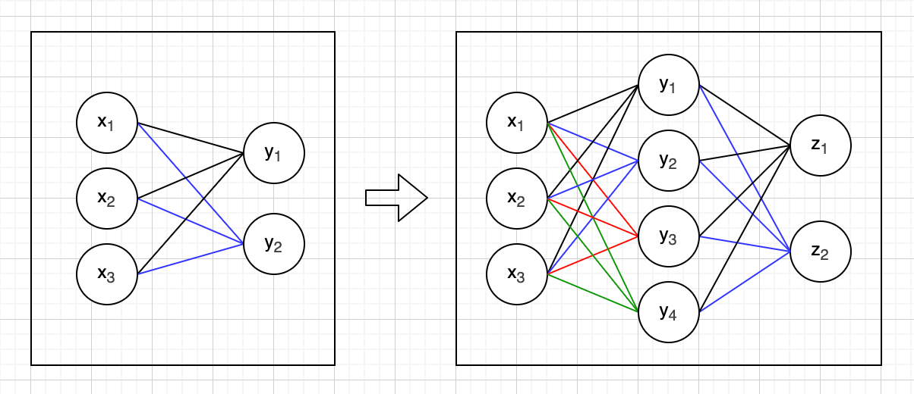

虽然我们实现的多层感知机参数已接近27万个，是上一章单层感知机参数的近34倍，然而手写数字识别的准确率却只提升了不到2%。其原因我们也已经了解：将二维图像信息直接展平为一维向量，会丢失大量空间结构信息。下一章，我们将介绍卷积神经网络，看看它是如何克服这一问题，以及能将数字识别的准确率提升到怎样的高度。

<div style="page-break-after: always;"></div>

## 第四章：卷积神经网络

从第二章开始，手写数字识别便一直作为本书的“Hello, World”示例，伴随我们逐步深入学习神经网络的相关原理。在整个过程中，我们一直采用一种直接的处理方式：将二维图像的像素点展平为一维向量，再直接输入网络进行处理。

然而对于手写数字识别而言，这种处理方式存在两个较为突出的问题：其一，它未能充分利用图像固有的空间结构，并非解决该问题的最优方案；其二，全连接网络的参数数量极为庞大，仅针对28×28像素的手写数字，我们设计的简单全连接网络参数就已达二十多万个，若面对更大尺寸的图像，其参数规模更是难以想象。

事实上，我们已经了解到，卷积神经网络（CNN）是处理图像数据的更优选择。本章将以此为切入点，带你深入剖析卷积神经网络的结构与工作原理，理解它如何通过特有的架构设计，高效提取并利用图像中的关键特征信息。

在本章中，我将先从宏观视角介绍卷积神经网络的整体架构，让你对其有一个整体认知。随后进入核心内容，依次讲解卷积神经网络中最关键的卷积运算与卷积层，再介绍池化层、扁平化等重要模块。我们会简要回顾1989年最早的卷积网络结构，并重点介绍1998年提出的经典架构LeNet‑5，同时完成该网络的复现。通过本章的学习，你将能够系统、清晰地建立起对卷积神经网络的完整认知。


### 整体架构

理解一个复杂问题最好的方式，是将其拆解为若干简单问题逐一突破。卷积神经网络同样可以沿用这一思路，我们可以把它清晰地拆分为两个核心模块来理解：卷积模块与多层感知机模块，如下图所示：

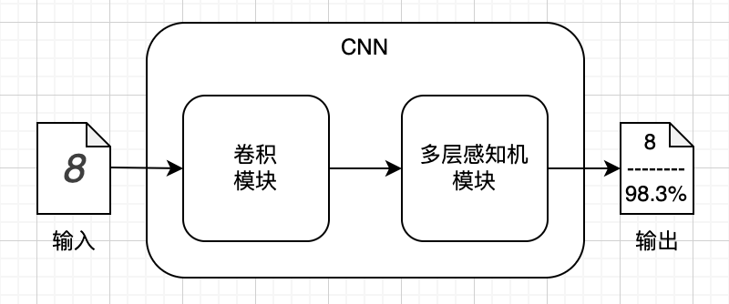

我们仍以手写数字识别为例进行学习。数字图像会先送入卷积模块完成特征提取与处理，输出一个特征向量（可以先这样直观理解）；再将该向量作为输入，传入多层感知机模块，最终得到分类识别结果。多层感知机就是我们已经熟悉的多层全连接网络，因此接下来只需重点理解卷积模块即可。卷积模块由卷积层、池化层等核心组件构成，我们可以逐一展开学习。而整个学习的起点，正是最基础的卷积操作。


### 卷积核

一听到卷积神经网络，再想到里面的卷积计算，你是不是瞬间觉得头大？如果去查数学上的卷积定义，还会看到一大堆带着复杂微积分符号的公式，很容易望而生畏。但实际情况是：尽管卷积神经网络中的“卷积”操作，和数学意义上的卷积本质同源，可我们理解深度学习里的卷积，完全不需要懂微积分，也不必纠结严格的数学定义，它的直观逻辑其实非常简单。

我们先从认识**卷积核**（Convolution Kernel，简称Kernel）开始。它也常被称作**过滤器**（Filter），至于为什么会有这个叫法，看完后面的内容你自然就明白了。所谓卷积核，本质上就是一个 n×n 的矩阵。这里的 n 称为卷积核的**大小**（Kernel Size），最常用的取值是 n=3 或 n=5。即便你已经忘记了矩阵的概念也完全不用担心，以 n=3 为例，你只需要把卷积核理解成一个 3×3 的九宫格，每个格子中存放一个数字即可，形式大致如下：

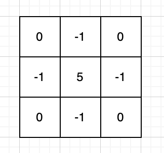

上面这个卷积核中的数值并非随意设定，它实际上能够对图像实现锐化处理。这一点，等你读完下一小节就会明白了。而在真实的卷积神经网络中，卷积核的这些数值并非人为指定，而是通过模型训练自动学习得到的。

接下来，我们画一张大小为 3×3 的小灰度图，总共包含 9 个像素。将它缩小观察，外形看起来就像一个微型的数字 1（下图左一）。把这张小图放大后，我们就可以在每个格子里标出对应像素的灰度数值（下图左二）。作为对比，我们把前面介绍的卷积核也放大绘制在一旁（下图左三）。

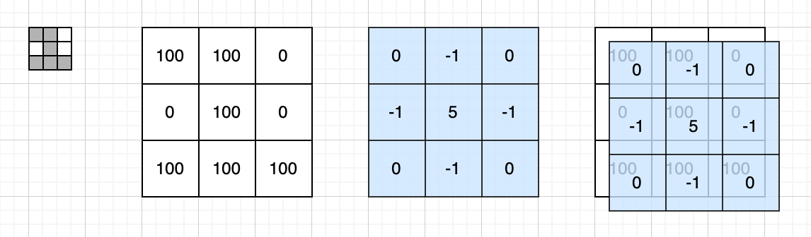

不难发现，这个卷积核恰好可以覆盖在这张小图像上，与其完全对齐（上图右一）。卷积核的作用，就是对它所覆盖的图像区域进行计算。计算过程也十分直观：依次遍历卷积核的每个位置，用核内数值与对应位置的像素灰度值相乘，再将所有乘积相加。如果你对神经元的工作原理还有印象，就会发现这一过程与神经元的加权求和十分相似。我们只需将图像的像素值看作输入，将卷积核中的每个数值对应为神经元的权重即可。

如果我们按照从上到下、从左到右的顺序遍历卷积核中的每个位置，上图展示的卷积计算过程就可以写成如下形式。为方便与上图对照查看，我将整个求和算式按三行展开：

$$
\begin{aligned}
(0×100) &+& (-1×100) &+& (0×0)   &+ \\
(-1×0)  &+& (5×100)  &+& (-1×0)  &+ \\
(0×100) &+& (-1×100) &+& (0×100) &= 300
\end{aligned}
$$

一般情况下，设卷积核大小为 $k$ 。我们用 $i$ 表示行号， $j$ 表示列号，用 $w_{ij}$ 表示卷积核中对应位置的值，用 $x_{ij}$ 表示被卷积核覆盖的图像对应像素值。那么，卷积核与它覆盖的图像的加权求和运算就可以用下面的公式统一表示：

$$
y = \sum_{i=1}^k\sum_{j=1}^k{w_{ij} \cdot x_{ij}}
$$

如果你对公式感到头疼，我们也完全可以用 Python 代码来表达这一计算过程，理解起来会更直观。它本质上只是一个两层循环：

```python
def weighted_sum(x: list[list[float]], 
                 w: list[list[float]], 
                 k: int) -> float:
    total = 0.0
    for i in range(k):
        for j in range(k):
            total += w[i][j] * x[i][j]
    return total
```

我们把卷积核里的每一个数值都称作它的参数。你应该还记得，单个神经元中通常还带有一个偏置参数，卷积核同样如此。也就是说，前面得到的加权求和结果，还需要再加上这个偏置，才是完整的计算结果。沿用之前的符号习惯，我们用大写字母 $P$ 表示被卷积核覆盖的小图像像素灰度矩阵，用 $K$ 表示卷积核的权重矩阵，用小写字母 $b$ 表示卷积核的偏置参数，并用星号（\*）表示卷积核的加权求和操作。由此，我们可以用下面的公式来表示完整的卷积计算：

$$
y = P * K + b
$$

我们用3×3小格子来表示输入小图片与卷积核矩阵，用一个小格子来表示输出值，用星号来表示卷积加权求和计算，于是上述卷积计算可以用下面这幅图表示：

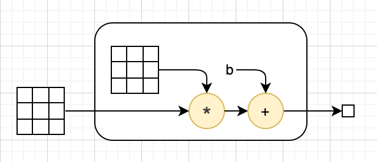

我们来总结一下：一个大小为 k 的卷积核，除了包含 k×k 个权重参数外，还额外带有一个偏置参数。因此，只要知道卷积核的大小 k，它的总参数数量就可以用下面的公式计算：

$$
params = k^2+1
$$

需要注意的是，卷积核并非必须是正方形。不过，为了便于讲解和大家理解，本章我们将默认卷积核为正方形。实际上，只要你掌握了正方形卷积核的基本运算规则，将其推广到非正方形卷积核的情况会非常容易。现在，我们已经理解了卷积核如何与图像的局部区域进行计算，接下来就一起学习完整的卷积操作。


### 滑动窗口

在前面的例子中，为了方便讲解，我们使用了与卷积核大小相同的小图像。但在实际场景里，卷积神经网络需要处理的图像，尺寸通常远大于卷积核，我们把这张待处理的图像称为卷积运算的输入。卷积核从上到下、从左到右依次扫过整个图像，将每个位置的计算结果按顺序排列，就构成了卷积运算的输出。

卷积核在单个位置上的计算结果只是一个数值，而完整的卷积运算最终会输出一个矩阵，相当于一张更小的图像。这张图像提取了输入图像的部分特征，因此通常被称为**特征图**。为方便图示说明，我们假设输入图像为 4×4 大小，卷积核仍保持 3×3 大小。完整的卷积运算过程如下图所示（这里假设偏置为0）：

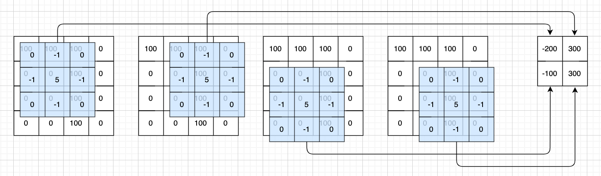

可以看到，卷积核如同一个小窗口，在图像上从上到下、从左到右依次滑动，这一过程被形象地称为**滑动窗口**（Sliding Window）机制。每次卷积核所覆盖的局部区域，则称为**图像块**（Patch）。不难得出，若输入图像大小为 n×n，卷积核大小为 k×k，卷积运算的输出即为 (n−k+1)×(n−k+1) 的矩阵。

我们用4×4的格子表示输入图片，仍然用3×3格子表示卷积核，并用2×2格子表示输出图片，那么滑动窗口的某次计算过程可以表示为下面这样：

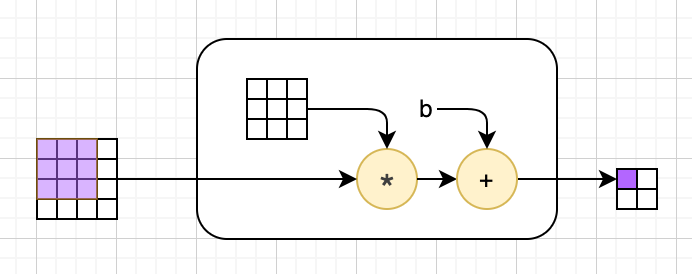

如果我们把前一小节介绍的卷积核加权求和过程抽象出来，将其视为一个作用于滑动窗口的独立函数，那么滑动窗口的主体逻辑就可以只关注窗口的移动规则，而不必关心内部具体如何计算。对应的 Python 实现如下：

```python
def apply_sliding_window(input_mat, k_h, k_w, stride, func):
    h, w = input_mat.shape                # 获取输入矩阵的高、宽
    out_h = (h - k_h) // stride + 1       # 计算输出矩阵的高、宽
    out_w = (w - k_w) // stride + 1       #
    output_mat = np.zeros((out_h, out_w)) # 初始化输出矩阵

    # 开始滑动窗口
    for i in range(out_h):
        for j in range(out_w):
            # 截取当前窗口
            start_i = i * stride
            start_j = j * stride
            window = input_mat[start_i:start_i + k_h, start_j:start_j + k_w]

            # 进行计算
            output_mat[i, j] = func(window)

    return output_mat
```

需要注意的是，该函数包含一个 `stride` 参数。这里我们先假设其值为 1，即暂时不产生实际效果，关于它的具体作用，我们会在后续小节详细介绍。此外，函数内部也已经考虑了窗口为矩形的通用情况。


### 填充

你可能已经发现，上面的操作会让输出尺寸与输入尺寸不一致。如果叠加多层卷积运算，图像会不断缩小，甚至可能被压缩到无法继续处理。此外，与图像中心的像素相比，边缘像素被卷积核覆盖的次数更少，也更容易出现信息丢失。为了同时解决这两个问题，我们会使用一项名为**填充**（Padding）的技术，如下图所示：

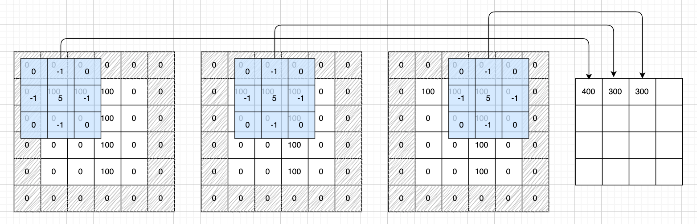

填充操作需要考虑两个关键要素：填充圈数和填充数值。先来看填充的圈数。在上面的例子中，我们对图像填充了一圈，从而让输出尺寸与输入保持一致。可以很直观地得出，若输入图像大小为 n×n，卷积核大小为 k×k，填充圈数为 p，那么卷积运算的输出就是一个 (n+2p−k+1)×(n+2p−k+1) 的矩阵。

再来看填充位置需要填入的数值。针对这一点有多种不同方案，本书不做过多展开。其中最简单的方式是直接填充 0，也就是**零填充（Zero Padding）**，正如上图所示。

我们稍微修改一下前一小节表示滑动窗口计算过程的内部细节图，给输入图片增加一圈填充，新的计算过程如下所示。就这个例子而言，滑动窗口已经走到了第二行第二列。

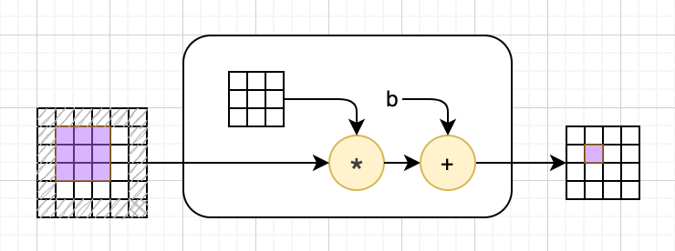

虽然手动实现填充逻辑并不复杂，但 NumPy 已经内置了 `pad` 方法，我们直接使用即可，既简洁又可靠。下面就是基于它实现的零填充函数：

```python
def zero_pad(input_mat, padding):
    if padding > 0:
        return np.pad(
            input_mat,
            pad_width=((padding, padding), (padding, padding)),
            mode='constant',
            constant_values=0
        )
    return input_mat
```


### 步幅

在前面的例子中，卷积核无论横向还是纵向，每次都只移动一个格子。它能否一次移动多个格子呢？答案是可以的。卷积核每次滑动的格子数，称为卷积操作的**步幅**（Stride）。我们沿用之前的示例，但是将卷积核大小设为 2×2，步幅也设为 2，此时卷积运算的前三次计算过程如下图所示：

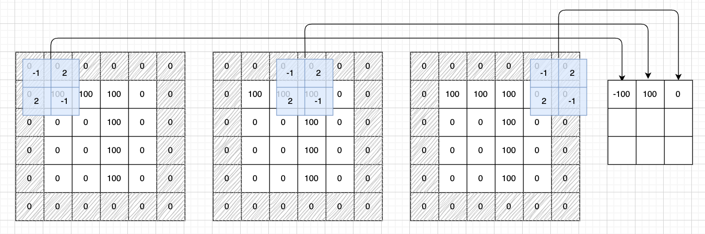

不难看出，在一般情况下，设输入图像大小为 n×n，卷积核大小为 k×k，填充圈数为 p，步幅为 s，则卷积运算的输出为 m×m 的矩阵，其中 m 可由下面的公式计算得出：

$$
m = \lfloor \frac{n+2p-k}{s} \rfloor +1
$$

我们之前实现的 `apply_sliding_window()` 函数已经内置了对步幅的支持，只需将 `stride` 参数设置为大于 1 的数值，即可生效。


### 完整的卷积运算

我们来总结一下：以一张 n×n 的图像为基础，在外围添加 p 圈填充后作为输入。使用一个 k×k 大小的卷积核，按照步幅 s，以从左到右、从上到下的滑动窗口方式在输入上滑动。卷积核与经过的每个图像块进行加权求和计算，并加上偏置，然后把这个值送入激活函数，得到最终计算结果。这些结果按对应位置依次排列，就得到了最终输出。整个过程是不是并不难理解？

现在，我们以填充后的图像作为输入。设卷积核为矩阵 $K$ ，卷积运算最终输出为 m×m 大小的矩阵 $Y$ ，用 $y_{ij}$ 表示其第 i 行第 j 列的元素，用矩阵 $P_{ij}$ 表示与该输出元素对应的局部图像块。那么，输出矩阵中任意位置的取值均可通过下面的公式计算。注意，之前为了便于理解，我们一直忽略了激活函数，这里把它给加上了。

$$
y_{ij} = σ(P_{ij} * K + b)
$$

现在，既然我们理解了卷积运算，就可以把细节都暂时抛弃了。我们知道星号代表这个操作就可以了。我们用X来表示输入图片，用K来表示卷积核权重矩阵，用b来表示卷积核偏置，用Y来表示输出图片。于是，完整的卷积计算可以用下图来表示：

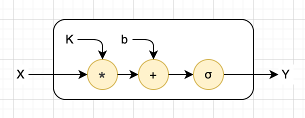

现在，我们使用 Python 代码完整实现卷积运算。这个函数能够灵活处理输入矩阵与卷积核不是正方形的情况。需要注意的是，我们直接通过 NumPy 的**逐元素相乘**（也叫哈达玛积，用星号表示）与内置的 `sum` 函数完成加权求和计算，没有使用之前我们自己定义的加权求和函数。完整的实现代码如下所示（TODO：补上激活函数）：

```python
def conv2d(input_mat, kernel_mat, bias, padding=0, stride=1):
    conv_func = lambda window: np.sum(window * kernel_mat) + bias # 卷积核计算
    k_h, k_w = kernel_mat.shape # 获取输入卷积核的高、宽
    input_mat = zero_pad(input_mat, padding) # 填充
    output_mat = apply_sliding_window(input_mat, k_h, k_w, stride, conv_func)
    return output_mat
```

读到这里，相信你已经对卷积运算有了清晰的认识。就算暂时没完全弄懂也没关系，毕竟书里的图都是静态的，确实不太好直观理解。我帮你找到了一个很好用的在[线小工具](https://poloclub.github.io/cnn-explainer/)，你可以随意调整输入大小、填充圈数、卷积核大小和步幅，既能自动播放整个滑动窗口的过程，也能手动选中区域，看清输入和输出之间的对应关系。强烈建议你动手试一试，效果非常直观。下面是它的界面截图：

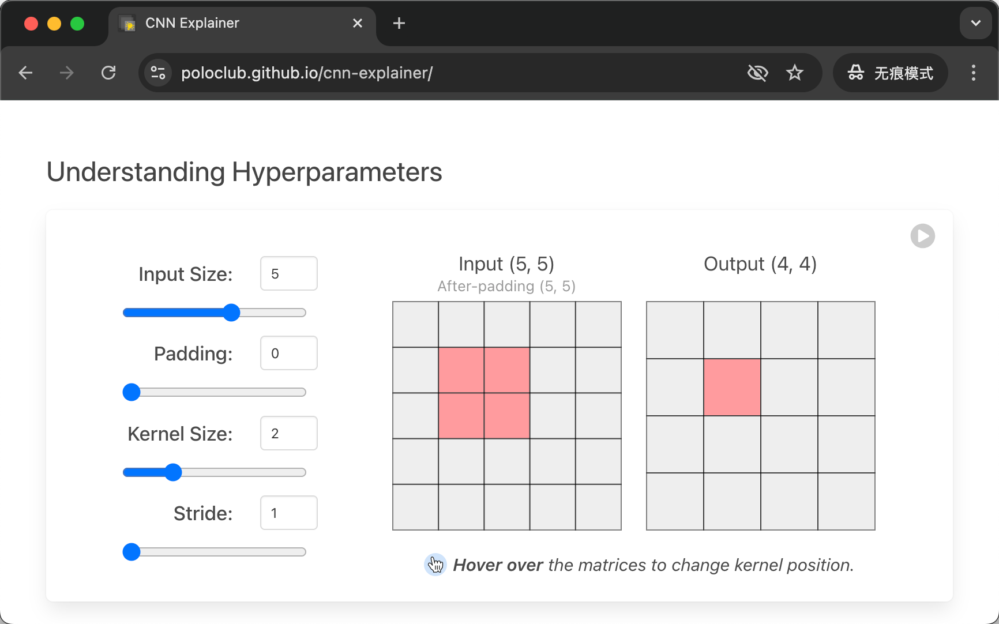

顺便提一句，卷积操作其实早在卷积神经网络出现之前就已经广泛使用了。它最早源于信号处理领域，主要用于对信号进行滤波，这也是它常被称作**过滤器**的原因。

除此之外，卷积在图像处理中也十分常见，比如实现图像模糊、锐化、边缘检测等效果。只不过在传统图像处理里，卷积核的数值通常由人工预先设定；而在卷积神经网络中，卷积核的参数是通过模型训练自动学习得到的。

这里有一个交互式在[线工具](https://setosa.io/ev/image-kernels/)，可以非常直观地帮你理解卷积核、卷积运算，以及它们在图像处理中的实际应用效果。下面这张截图展示了实现模糊效果所对应的卷积核，以及处理后的最终效果：

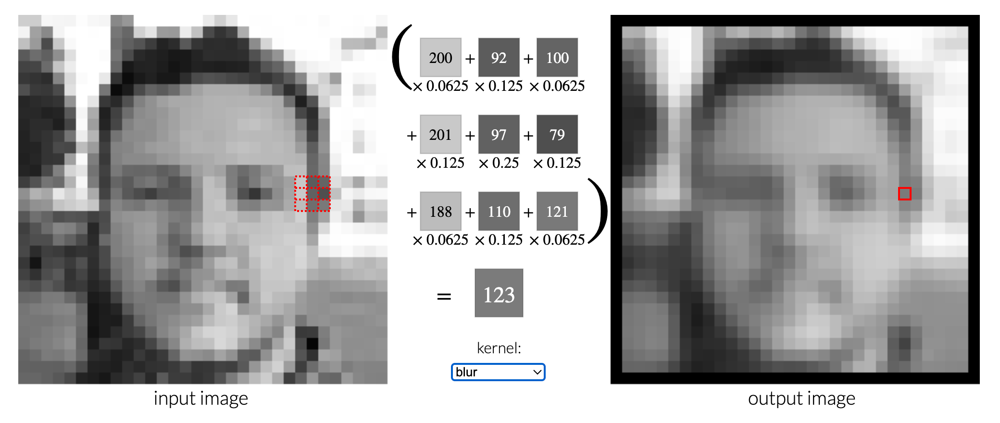


### 卷积层

弄懂了完整的卷积运算，我们就可以来学习卷积层了。在前面的例子中，我们只用一个卷积核进行计算，因此只能得到一张特征图。如果同时使用多个大小相同的卷积核，分别对输入执行卷积运算并提取多张特征图，就构成了一个卷积层。我们以一个最简单的卷积层为例：它包含两个 2×2 的卷积核，步幅为 2，输入为一张 3×3 的图像，最终输出两张 2×2 大小的特征图。这个卷积层的计算如下图所示：

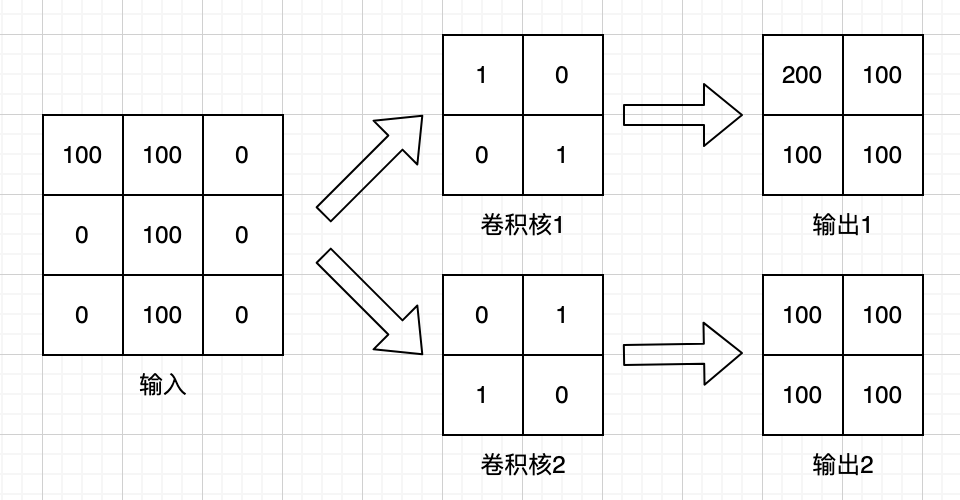

上面这张示意图，重点在于展示卷积核的数值分布与对应计算结果。和之前一样，我们可以先隐去具体的数值，只关注整体的计算逻辑。简化后的双核卷积层计算过程如下图所示：

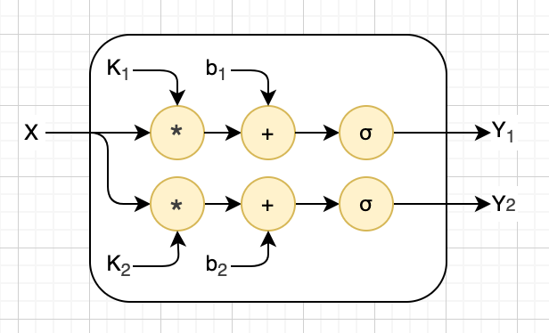

我们已经在前文中实现了 `conv()` 函数，基于该函数实现完整的卷积层会非常简便。只需对每个卷积核分别执行卷积操作，再将所有计算结果整合返回即可。对应的代码实现如下：

```python
def new_conv_layer(kernel_list, padding=0, stride=1):
    def conv_layer(input_mat):
        output_mat_list = []
        for kernel_mat, bias in kernel_list:
            output_mat = conv2d(input_mat, kernel_mat, bias, padding, stride)
            output_mat_list.append(output_mat)
        return output_mat_list
    return conv_layer
```

我们前面采用的两种画图方式，都不适合展示结构相对复杂的卷积层。因此，后续我们将采用 LeNet 风格来绘制复杂卷积网络，而 LeNet 网络的具体内容，会在本章后半部分详细介绍。恰好，我们在之前学习全连接网络时，已经介绍过一款在线工具 [NN-SVG](https://alexlenail.me/NN-SVG/LeNet.html)，它正好支持绘制 LeNet 风格的网络结构。

如下图所示，便是使用该工具绘制的卷积神经网络结构。网络输入为一张 64×64 的图像，随后经过一个卷积层；该卷积层包含 12 个 5×5 大小的卷积核，步幅设置为 1。需要注意的是，图中并未将全部卷积核逐一画出，仅在输入图像上用一个小方块示意卷积运算的过程。

不过从图中可以清晰看到，这个卷积层最终会输出12张60×60大小的特征图。这些特征图后续会进行扁平化处理，再输入到后面的全连接网络中，这部分内容我们将在后续小节中详细讲解。

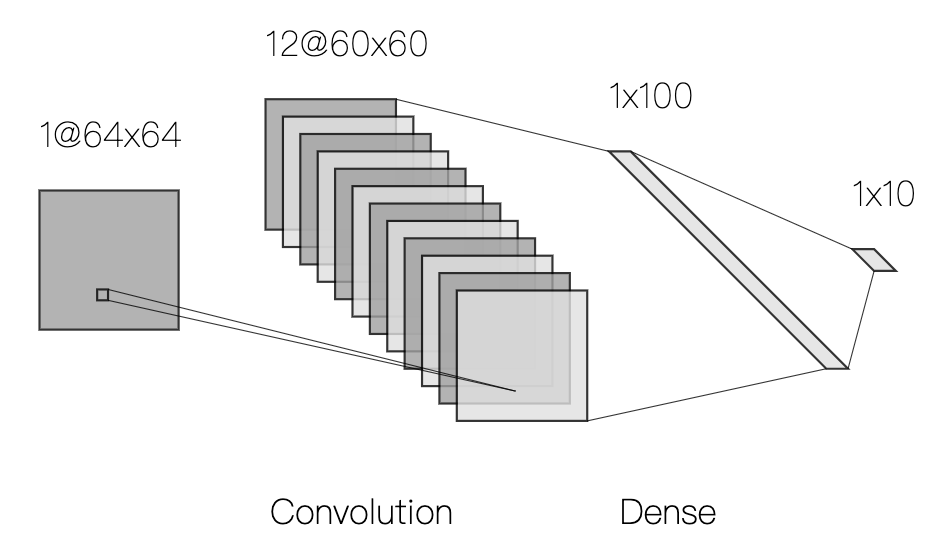

现在我们来计算上图所示卷积层的参数总数。每个卷积核包含 5×5+1=26 个参数，该层共有 12 个卷积核，因此这一层的总参数数量为 26×12=312。推广到一般情况：如果一个卷积层包含 n 个尺寸为 k 的卷积核，则该卷积层的参数总数可由以下公式计算：

$$
params = (k^2 + 1)n
$$


### 输入输出通道

在前面的例子中，我们假设输入为灰度图像。而在实际应用中，我们常常需要处理彩色图像。这类图像可以按照红、绿、蓝（RGB）三原色拆分为三张独立的图像分别进行处理，我们将一种颜色分量称为一个**通道**（Channel）。由于图像是卷积层的输入，因此我们将其称为**输入通道**。与之相对应，卷积层会生成多张特征图像，我们将其中的每一张特征图都称为一个**输出通道**。

为了适配多通道输入，卷积核不再是单一的二维矩阵，而是由多个矩阵组成的列表。具体来说，若输入通道数量为 m，则卷积层中的每个卷积核就对应包含 m 个矩阵，每个通道分别与一个矩阵进行运算。需要注意的是，每个卷积核对应的偏置项仍然只有一个。

我们再重申一遍：当输入通道数大于 1，例如为 m 时，每个卷积核同样会对应 m 个矩阵，而非单个矩阵。卷积核在某一位置计算时，只需对每个通道分别与对应的卷积核矩阵做加权求和，再将所有通道的结果累加，最后加上偏置即可。需要注意的是，偏置仅需添加一次。

为了更清晰地说明这一过程，我们仍以一个简单示例进行讲解。假设输入的彩色图像尺寸为 3×3，卷积核大小为 2×2，且当前计算位置位于图像左上角，此时的卷积计算过程如下图所示。可以看到，输入图像被拆分为三份，与之对应，卷积核同样包含三个矩阵。

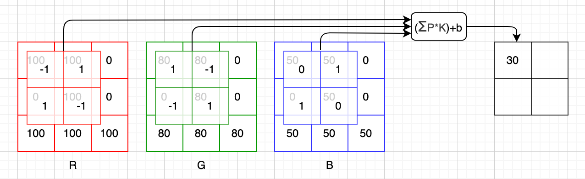

一般而言，我们假设某一卷积层具有 \(m\) 个输入通道和 \(n\) 个卷积核。我们仍采用 \(y_{ij}\) 表示某一个卷积核所对应输出矩阵中第 \(i\) 行、第 \(j\) 列的元素，用 \(P_{hij}\) 表示第 \(h\) 个输入通道上，与当前计算位置对应的小区域，用 $K_h$ 表示与通道对应的卷积核矩阵。那么，对于该卷积核而言，其输出矩阵上的某一元素 \(y_{ij}\)，可由以下公式计算得出：

$$
y_{ij} = (\sum_{h=1}^{m}{P_{hij} * K_{h}}) + b
$$

和前面小节的处理方式一致，我们将卷积核的具体参数隐去，仅保留核心的计算流程。下图清晰展示了上述 RGB 三通道卷积示例的完整计算细节：

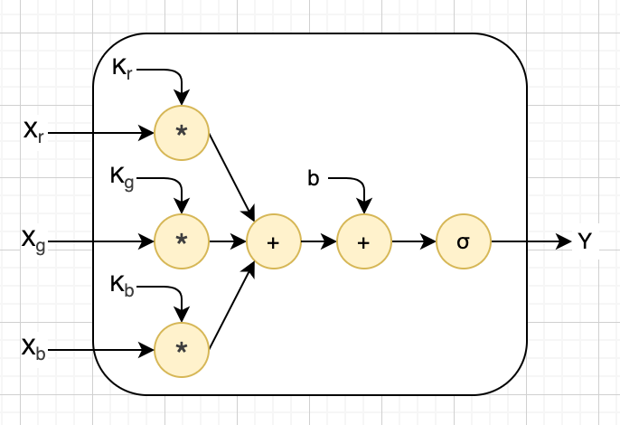

了解了输入通道的工作机制后，我们可以将这一细节暂时隐藏。我们用 `[X]` 表示多通道输入特征图，用 `[K]` 表示对应通道的卷积核权重集合，那么上文的计算过程便可简化为下图所示形式：

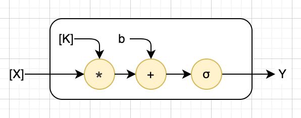

现在我们可以将卷积核的数量增加到两个，以此体现输出通道的概念。我们用 `[Y]` 表示多通道输出特征图，至此完整的卷积层计算过程可以用下图表示：

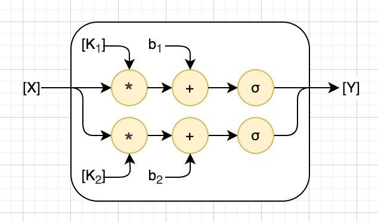

不过针对多通道输入的情况，我们需要相应更新卷积层参数的计算公式。一般而言，对于具有 \(m\) 个输入通道、\(n\) 个大小为 \(k\) 的卷积核的卷积层，其总参数数量可由以下公式计算得出：

$$
params = (m \cdot k^2 + 1)n
$$

现在我们来看一个稍复杂的网络结构。该网络在前一小节示例的基础上做了两处改造：第一，输入图像为彩色图像；第二，新增了第二个卷积层，该卷积层同样包含 12 个 5×5 大小的卷积核，且步幅设为 1。该网络的整体结构如下图所示：

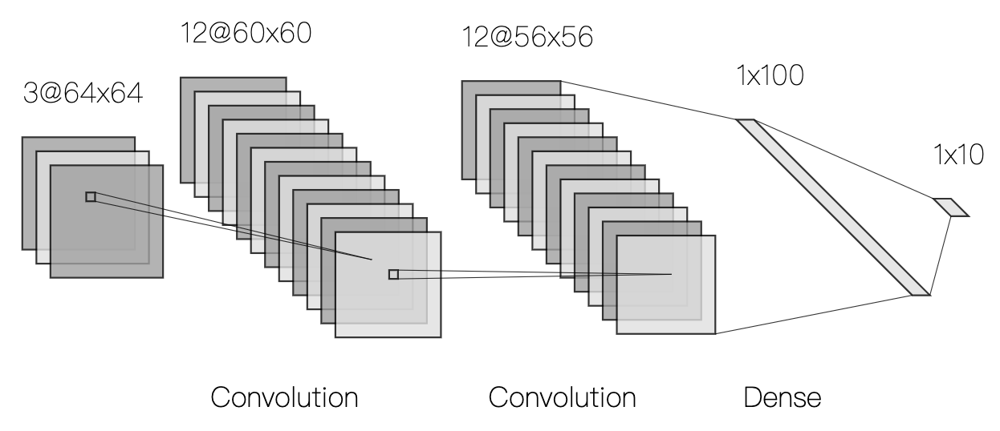

为了帮助大家更好地理解这一内容，我们来计算一下上图中两个卷积层的参数数量。首先分析第一个卷积层：该层的输入通道数为 3，输出通道数为 12，因此根据前文给出的公式，其总参数数量计算如下：

$$
(3 \times 5^2 + 1) \times 12 = 900
$$

接下来我们分析第二个卷积层：该层以第一个卷积层的输出作为自身输入，因此其输入通道数为 12；而该卷积层的输出通道数同样为 12，因此根据前文给出的公式，其总参数数量计算如下：

$$
(12 \times 5^2 + 1) \times 12 = 3612
$$

需要说明的是，此处为方便演示，卷积核数量等参数均为示例性设置，并无实际约束。在实际应用中，卷积层的数量、每个卷积层包含的卷积核个数、卷积核的大小及步幅等，均具有极强的灵活性，这些参数的设定属于模型架构设计的核心内容。

到这里，卷积层的核心工作原理、完整计算逻辑与关键细节，我们就已经全部讲解清楚了。接下来，我们对之前实现的卷积层函数进行改进，将输入通道与输出通道的相关逻辑整合进去，新的函数代码如下所示：

```python
def new_conv_layer2(kernel_list, padding=0, stride=1):
    def conv_layer(input_mat_list):
        output_mat_list = []
        
        # 遍历每一个多通道卷积核 (kernel_mat_list, bias)
        for kernel_mat_list, bias in kernel_list:
            output_mat_list_tmp = []
            
            # 遍历每个输入通道（对应每个卷积核通道）
            for i in range(len(input_mat_list)):
                input_mat = input_mat_list[i]
                kernel_mat = kernel_mat_list[i]
                output_mat = conv2d(input_mat, kernel_mat, 0, padding, stride)
                output_mat_list_tmp.append(output_mat)
            
            # 所有通道结果逐元素相加 → 再加偏置
            fused_mat = np.sum(output_mat_list_tmp, axis=0)
            output_mat = fused_mat + bias
            output_mat_list.append(output_mat)
        
        return output_mat_list
    return conv_layer
```


### 池化层

通过前文的介绍，我们已经掌握了卷积核、卷积运算的原理，也明确了卷积层的参数计算方式及输入、输出通道的核心概念。卷积层的核心作用是提取图像的局部特征，随着卷积操作的进行，特征图虽能保留关键特征，但仍存在尺寸较大、冗余信息较多的问题，且计算量会随网络深度增加而大幅提升。为解决这一问题，让模型更高效地学习通用特征，我们需要引入一种新的网络层——池化层（Pooling Layer）。

如果大家初次听到“池化层”这个词感到困惑，其实不必担心。我第一次接触这个术语时，也有同样的感受。实际上，我认为若将其翻译为“汇集层”，会更便于理解。因为池化层的核心作用，就是将局部区域内的多个像素特征汇集在一起，整合为一个特征值，从而达到缩小特征图尺寸、实现下采样的目的。不过，“池化层”作为领域内统一的标准翻译，我们后续仍沿用这一表述。接下来，我们将详细介绍池化层的定义、作用及常见的池化方式。

其实在理解卷积操作的基础上，掌握池化层就比较容易了。因为池化层同样采用滑动窗口机制，其计算逻辑与卷积操作的滑动窗口模式一致。不过与卷积操作相比，池化层的操作要简单得多。下面我们结合两者的异同，具体对比说明。

我们先来看二者的相似之处。首先，池化层同样需要定义一个固定大小的小窗口（即池化核），这个窗口有着明确的尺寸规格，比如常用的2×2规格。其次，与卷积操作的窗口移动方式一致，池化层的小窗口也会按照预设的步幅，从左至右、从上至下依次划过输入特征图，对窗口覆盖区域的特征进行计算处理后，将计算结果对应填入输出矩阵的相应位置。因此，对于任意一张输入图像而言，经过池化操作后，输出的依然是一张特征图，只是其尺寸会根据窗口和步幅的设置有所缩小，实现特征的压缩与提炼。

我们再来看二者的不同之处。第一，池化层的小窗口是没有可学习参数的。与卷积操作不同，卷积操作需要定义卷积核的具体权重参数，而池化操作的小窗口无需设置任何额外参数，因为其核心作用就是对覆盖区域内的图像信息进行汇集、整合，无需通过参数调整来提取特征。第二，虽然池化层的小窗口同样有移动步幅的设置，但该步幅通常大于1。例如，采用2×2的池化窗口搭配步幅2，就能将原特征图的尺寸压缩至原来的1/4，既实现了降维，又能高效保留关键特征，这也是实际应用中最常用的搭配方式。

可见，池化层的最主要目的就是压缩图像，也正因为如此，它经常被称为**下采样** （Downsampling）。最常用的池化操作是**最大池化**（Max Pooling） ，即取局部区域的最大值；除此之外，还有**平均池化** （Avg Pooling）等其他方式，此处不再一一介绍。我们以4×4的输入图片、2×2的池化窗口、步幅为2的最大池化为例，结合图示具体说明池化操作的过程。对于这张小图片而言，完整的池化操作如下图所示：

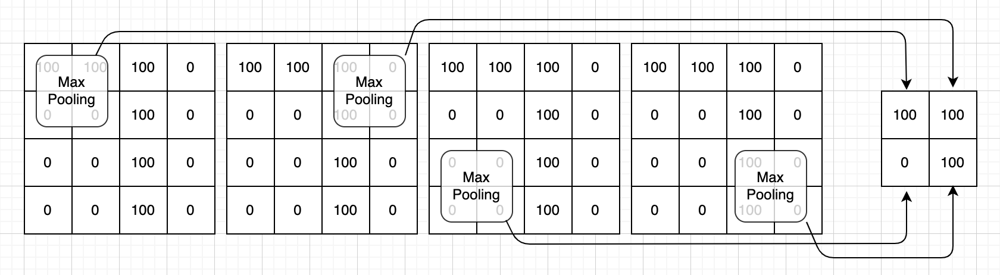

需要补充说明的是，若输入为多个通道，池化层会对每一张输入特征图依次进行独立处理，各通道的池化操作互不干扰、互不影响。对于任意一张输入特征图，我们仍假设其经过池化操作后的输出为矩阵 $Y$ ，其中 $y_{ij}$ 表示该矩阵中第i行、第j列的元素，矩阵 $P_{ij}$ 表示输入特征图上与该元素对应的局部区域（即池化窗口所覆盖的区域）。以最大池化为例，我们可通过以下公式，计算输出矩阵任意位置的元素值：

$$
y_{ij} = max(P_{ij})
$$

我们将上一节中的LeNet风格示例进行拓展，在两个卷积层之后分别增添一个池化层。具体设置为：池化窗口大小为2×2，移动步幅为2。通过这样的设置，可将输入特征图的尺寸缩小至原来的1/4。更新后的完整网络结构如下所示：

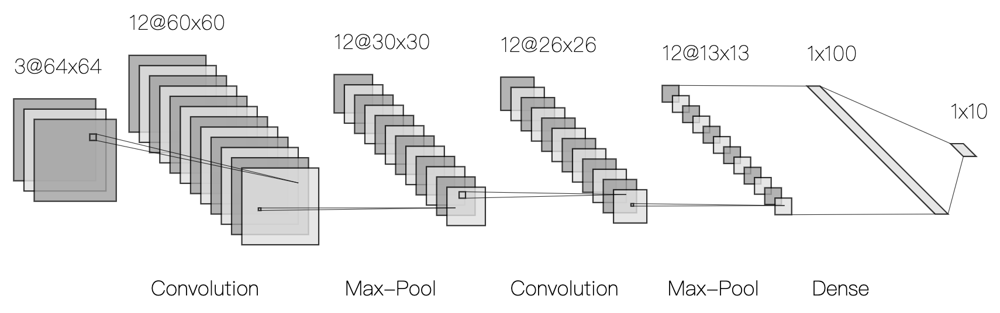

与上一节中的卷积层示例类似，此处池化层的小窗口大小、移动步幅也均为我随意设置的示例性参数，并非固定要求。在实际应用中，池化层的小窗口大小、移动步幅均可灵活调整，其设置逻辑与卷积核大小、步幅的设置逻辑一致，同样属于模型架构设计的核心内容之一。

代码：

```python
def max_pool2d(input_mat, win_size, stride=1):
    return apply_sliding_window(input_mat, win_size, win_size, stride, np.max)
```


### 扁平化

卷积模块处理完输入图片后，通常会输出 n 个特征图（其中 n 等于最后一层卷积层所使用的卷积核数量），这些特征图的尺寸通常远小于原始输入图片。而后续的全连接网络，其输入要求为一维特征向量，因此我们需要对这些多通道特征图进行一次**扁平化（Flatten）** 处理。

简单来说，扁平化的核心操作的是：将每一张特征图逐行逐列地展平为一个一维向量，再将所有通道对应的一维向量按顺序拼接整合，最终得到一个符合全连接网络输入规格的一维特征向量。我们可以将这一扁平化逻辑封装成一个函数，具体代码如下所示：

```python
def flatten(input_mat_list):
    flattened = []                # 创建一个空列表，用于存放所有元素
    for mat in input_mat_list:    # 遍历每一个通道的特征图
        for row in mat:           # 遍历矩阵中的每一行元素
            flattened.extend(row) # 将一行元素全部加入列表
    return flattened              # 返回展平后的一维数组
```

以上一小节的 LeNet 风格示意图为例，我们可以看到，经过卷积层和池化层处理后，会得到 12 张 13×13 大小的特征图（即 12 个通道）。把这 12 张 13×13 的小特征图进行扁平化处理后，每张特征图可展平为 13×13=169 个数值，12 张特征图总共就是 12×169=2028 个数值，这些数值整合起来，就构成了扁平化后的一维特征向量。将这个一维特征向量作为输入，送入后续的全连接模块，就能得到最终的输出结果。

好的，现在我们就来具体计算一下，上面例子中的卷积神经网络一共有多少个参数。首先明确两个关键前提：我们例子中所有卷积核的尺寸均为 5×5，且每个卷积层的卷积核都包含偏置项。具体计算过程如下：

第一个卷积层，输入通道数为 3，共设置 12 个卷积核（对应 12 个输出通道），根据参数计算逻辑，其总参数数量为 (3×5×5 + 1)×12 = 912 个；第二个卷积层，输入通道数为 12，同样设置 12 个卷积核，其总参数数量为 (12×5×5 + 1)×12 = 3612 个；需要注意的是，池化层仅负责特征压缩，没有可学习参数，因此不产生额外参数。综上，整个卷积模块的总参数数量就是 912 + 3612 = 4524 个。

扁平化处理后，12张13×13大小的特征图，总共可展平为12×13×13=2028个数值。这组扁平化后的数值将作为输入，传入第一个全连接隐藏层，该隐藏层共设置100个神经元。根据我们前文介绍的全连接层参数计算公式，可计算出该层的总参数数量为(2028+1)×100=202900个。

再看最后的输出层，该层共设置10个神经元，按照同样的参数计算公式，其参数数量为(100+1)×10=1010个。将第一个全连接隐藏层与输出层的参数数量相加，可得出整个全连接模块的总参数数量为202900+1010=203910个。卷积模块和全连接模块，一共是4524+203910=208434个参数。整个的计算见下表：

| 层             | 公式                              | 参数数量 |
| -------------- | --------------------------------- | -------: |
| 第一个卷积层   | $(3 \times 5^2 +1) \times 12$     |      912 |
| 第二个卷积层   | $(12 \times 5^2 +1) \times 12$    |    3,612 |
| 第一个全连接层 | $(12 \times 13^2 + 1) \times 100$ |  202,900 |
| 输出层         | $(100 + 1) \times 10$             |    1,010 |
| 累计           |                                   |  208,434 |


### 交互式工具

到这里为止，整个卷积神经网络就都介绍完毕了。相比多层感知机，卷积神经网络的结构确实更为复杂，因此我们不妨停下来，对前面讲解的内容做一个简要总结。其实卷积神经网络的核心概念很简洁，主要包含两个关键层：卷积层和池化层，这两个层交替堆叠，就构成了整个卷积模块。之后，我们将卷积模块的输出结果进行扁平化处理，再搭配一个全连接模块，便组成了完整的卷积神经网络。

卷积层由n个独立运行的卷积核组成，其输出结果为n个特征图，其中n也被称为卷积层的输出通道。每个卷积核包含m个k×k大小的权重矩阵，以及一个偏置项，这里的m就是卷积层的输入通道数量。每个卷积核会以滑动窗口的机制，按照预设的步幅划过输入图像，完成特征提取工作，并输出对应的特征图。

与卷积层不同，池化层没有可训练的参数，我们只需确定它的三个核心设置即可：池化方式（例如最大池化或平均池化）、池化窗口大小（如常用的2×2）以及移动步幅（如常用的2）。对于每一张输入特征图，池化层都会以相同的方式进行处理，最终生成一张尺寸缩小的特征图，从而实现下采样、压缩图像尺寸的核心作用。

在我们学习卷积核相关知识时，曾提到过一个[交互式工具](https://poloclub.github.io/cnn-explainer/)。这里需要补充说明的是，这个工具并非仅用于演示卷积核，而是一个完整的、以交互式方式讲解卷积神经网络的工具。如果大家对前面讲解的内容还没有完全理解，可以通过这个交互式网址深入学习。它的每一个部分几乎都可以点开查看细节，操作直观、讲解细致，非常适合入门学习者使用。下面是该工具的截图：

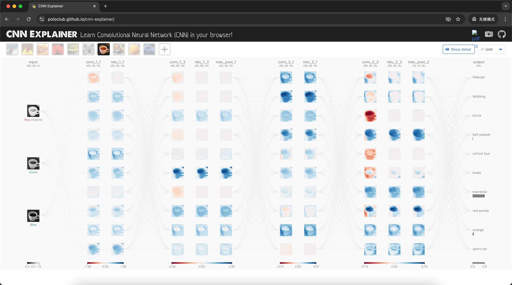


### LeCun1989：卷积神经网络的诞生

前面我们已经把 CNN 的核心组件（卷积层、池化层、扁平化）都讲完了，你可能会好奇：这么巧妙的结构是怎么想出来的？我们不妨从深度学习的一段关键历史讲起，你就能更深刻理解 CNN 的设计思路和价值。

时间回到 1989 年，当时神经网络研究刚刚从近 20 年的 “寒冬” 里走出来 ——1969年人工智能先驱马文・明斯基在《[感知机](https://direct.mit.edu/books/monograph/3132/PerceptronsAn-Introduction-to-Computational)》一书中证明了单层神经网络无法解决非线性问题，并且推断多层网络也没有有效的训练方法，这个结论直接把神经网络的研究打入了冷宫。直到 1986 年鲁梅尔哈特、辛顿等人提出反向传播（BP）算法，才从理论上解决了多层网络的训练问题，但当时这个算法只在简单的模拟数据集上跑通过，没人敢说它能解决真实世界的复杂任务。
就在这个节点，年轻的杨立昆（Yann LeCun）在贝尔实验室发表了一篇奠定现代计算机视觉基础的经典论文：《[反向传播算法在手写邮政编码识别中的应用](http://yann.lecun.com/exdb/publis/pdf/lecun-89e.pdf)》，直接打破了这个僵局，也开启了卷积神经网络的产业化序幕。
这篇论文没有做空泛的理论推导，而是瞄准了当时美国邮政的真实痛点：每天上百万封手写邮编的信件，人工识别效率低、错误率高，亟需自动化方案。杨立昆团队专门为手写数字识别设计的网络结构，第一次引入了我们前面刚讲的 “局部感受野”、“权值共享” 这两个卷积层的核心思想，这就是世界上第一个真正意义上的卷积神经网络，也是后续 LeNet 系列网络的雏形。

这里我们呼应一下前面的内容：我们之前用来绘制网络结构的 “LeNet 风格” 示意图，设计原型就来自这篇论文里的网络架构。
这篇论文最里程碑的意义在于：第一次把反向传播算法成功用到了真实世界的任务上。他们用了美国布法罗邮政局的真实手写邮编数据集，一共 9298 个样本，7291 个用来训练，2007 个用来测试，包含了各种书写风格、模糊不清的难例，非常贴近真实场景。最终网络做到了 1% 的错误率、9% 的拒绝率（实在识别不了的就交给人工），是当时的最高水平。这个成果直接打破了 “多层神经网络无法落地” 的固有认知：之前大家都觉得 BP 算法只是个理论玩具，而杨立昆团队证明了通过合理设计网络结构、融入任务先验知识，完全可以用 BP 算法训练深层网络处理真实图像数据。从此反向传播算法才真正成为所有深度神经网络训练的核心算法，卷积神经网络也正式走上了主流舞台。

这篇论文里的网络还只是雏形，经过杨立昆团队近 10 年的迭代优化，1998 年正式推出了更加成熟的 LeNet-5—— 是第一个真正商业化落地的卷积神经网络，后来被广泛用在 ATM 机识别支票数字的场景里，直到现在在很多银行还在使用基于这个架构改造的方案。1989 年的这个初代网络输入是 16×16 的灰度图像，包含两个卷积层（每个 12 个 5×5 卷积核）、一个全连接隐藏层、最后 10 个神经元输出对应 0-9 的分类。

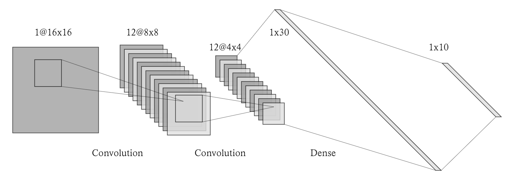

其实这个网络结构和我们前面讲的 CNN 结构逻辑已经完全一致了，只是在激活函数、下采样的实现细节上有一些差异，我们就不展开细讲了。
接下来我们重点讲解它的迭代版本：经典的 ***LeNet-5***。


### LeNet-5
LeNet-5作为 1989 年论文中网络雏形的优化升级版本，它的核心逻辑和我们前面刚讲的 CNN 标准范式完全一致：`输入层→卷积层→池化层→卷积层→池化层→扁平化→全连接层→全连接层→输出层`，这也奠定了后续所有卷积神经网络的标准结构模板。

原始 LeNet-5 的输入为单通道 32×32 像素的灰度图像，相比 1989 年版本的 16×16 输入有所扩大，目的是保留更丰富的数字笔画细节，提升识别精度。这里的尺寸设计也很巧：32×32 经过后续的卷积、池化操作，输出尺寸都是整数，不需要做特殊的裁剪或填充，刚好匹配我们前面讲的卷积输出尺寸计算公式。

我们逐层拆解它的结构：

+ 第一个卷积层：配置 6 个 5×5 大小的卷积核，卷积步幅设为 1，无填充。输入 32×32 的图像，输出为 6 张 28×28 大小的特征图，每个特征图对应一个卷积核提取的边缘、纹理等基础特征。
+ 第一个池化层：2×2 大小、步幅为 2 的最大池化，对特征图做下采样，输出变为 6 张 14×14 大小的特征图，既压缩了计算量，又提升了特征的平移鲁棒性。
+ 第二个卷积层：配置 16 个 5×5 大小的卷积核，步幅 1，无填充，进一步提取更高阶的组合特征（比如拐角、笔画片段），输出为 16 张 10×10 大小的特征图。
+ 第二个池化层：和第一个池化层参数一致，输出变为 16 张 5×5 大小的特征图，完成第二轮的特征压缩。
+ 扁平化处理：把 16 张 5×5 的二维特征图拉平成一维向量，总长度是 16×5×5=400，送给后续的全连接层。
+ 第一个全连接层：120 个神经元，负责把前面提取的所有特征做整合、映射。
+ 第二个全连接层：原始 LeNet-5 里是 84 个神经元，我们后面的代码实现做了微小调整，改成了 100 个，不影响核心结构。
+ 输出层：10 个神经元，对应 0-9 十个数字的分类。

它的结构示意图如下所示:
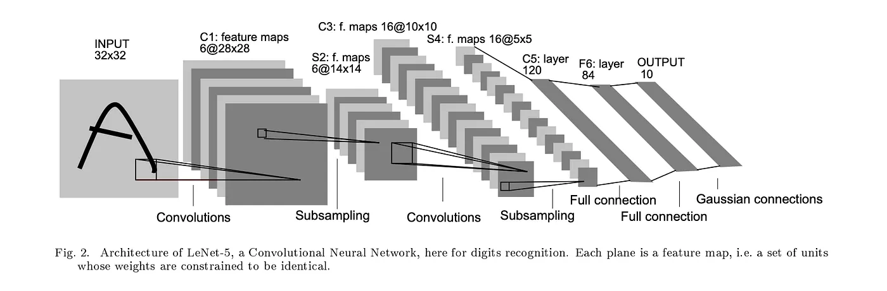

我们前面一直用的 LeNet 风格架构图，设计原型正是出自这篇经典论文。前面我们提到的 CNN 交互式可视化工具里，演示的就是这个 LeNet-5 的结构，感兴趣的同学可以去动手调整参数看看每一层的输出变化，理解起来会更直观。
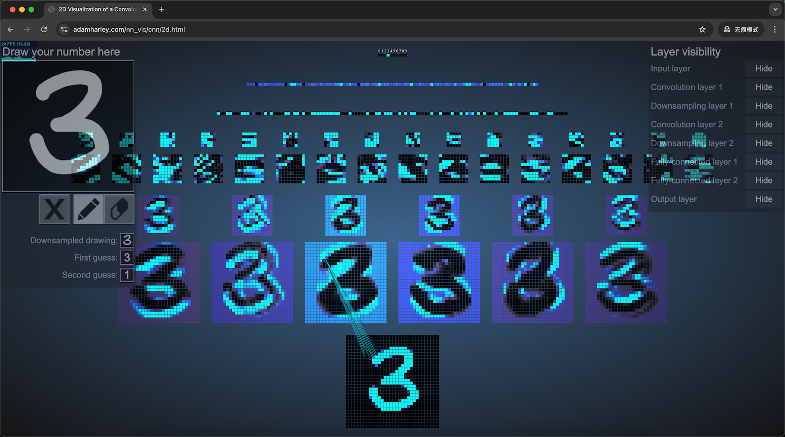

了解完 LeNet-5 的完整架构后，我们不妨举一反三，计算一下它的参数数量，巩固前面学过的参数计算方法。忘了怎么算的同学可以翻回本章前面卷积层、全连接层的参数计算公式，每一层的计算逻辑我们之前都讲过哦。我把每一层的参数数量整理在了下面的表格里，推导过程留给大家自行验证：

| 层             | 说明                                        | 参数量 |
| -------------- | ------------------------------------------- | -----: |
| 第一个卷积层   | 输入通道 = 1，输出通道 = 6，卷积核大小 = 5  |    156 |
| 第二个卷积层   | 输入通道 = 6，输出通道 = 16，卷积核大小 = 5 |  2,416 |
| 第一个全连接层 | 输入神经元 = 16×5×5=400，输出神经元 = 120   | 48,120 |
| 第二个全连接层 | 输入神经元 = 120，输出神经元 = 84           | 10,164 |
| 输出层         | 输入神经元 = 84，输出神经元 = 10            |    850 |
| 总计           |                                             | 61,706 |

接下来，我们用 PyTorch 框架来复刻这个经典的 LeNet-5 结构，用来完成 MNIST 手写数字识别任务。代码并不复杂（这里我们仅给出了前向推理过程，训练过程我们放在后面章节中单独讲解）：

```python
# 定义 LeNet-5 网络
class LeNet5(nn.Module):

    def __init__(self):
        super(LeNet5, self).__init__()

        # Conv layer 1, 1×28×28 -> 6×28×28
        self.conv1 = nn.Conv2d(in_channels=1, out_channels=6,
                               kernel_size=5, padding=2)

        # MaxPool, 6×28×28 -> 6×14×14
        self.pool = nn.MaxPool2d(2, 2)

        # Conv layer 2, 6×14×14 -> 16×10×10
        self.conv2 = nn.Conv2d(in_channels=6, out_channels=16,
                               kernel_size=5)

        # Fully connected layers, 16×5×5 = 400
        self.fc1 = nn.Linear(16 * 5 * 5, 120)
        self.fc2 = nn.Linear(120, 84)
        self.fc3 = nn.Linear(84, 10)

        self.relu = nn.ReLU()

    def forward(self, x):
        x = self.relu(self.conv1(x)) # Conv1
        x = self.pool(x)             # Pool1
        x = self.relu(self.conv2(x)) # Conv2
        x = self.pool(x)             # Pool2
        x = x.view(-1, 16 * 5 * 5)   # Flatten
        x = self.relu(self.fc1(x))   # Fully connected
        x = self.relu(self.fc2(x))   # Fully connected
        x = self.fc3(x)              # Output
        return x
```

这里有个小细节说明：原始LeNet-5的输入是32×32像素，而MNIST数据集的图片是28×28像素，所以我们只在第一个卷积层加了padding=2，通过边缘填充把输入补成32×32，其余结构完全和原始LeNet-5一致，最大程度保留了经典架构的设计。

我在本地跑了这个模型，训练5个epoch就能得到非常好的效果：
```
Epoch 1/5, Loss: 0.3111
Epoch 2/5, Loss: 0.0838
Epoch 3/5, Loss: 0.0595
Epoch 4/5, Loss: 0.0451
Epoch 5/5, Loss: 0.0378

Test Accuracy: 98.65%
```
这个准确率比我们之前实现的多层感知机的91.48%高了7个百分点，参数还不到它的1/4，这就是卷积结构处理图像数据的优势所在。


### 本章小结

在本章中，我们先从整体上介绍了卷积神经网络（CNN）的基本结构，然后循序渐进地讲解了卷积运算的核心机制，包括卷积核的计算方式、滑动窗口、填充、步幅、输入输出通道等关键概念。在此基础上，我们进一步介绍了一个完整卷积层的组成。接着，又讨论了池化层和扁平化等常见模块，帮助你理解一个典型 CNN 是如何由多个组件组合而成的。最后，我们简要回顾了杨立坤的重要研究与贡献，并重点介绍和复刻了经典的 LeNet-5 网络。

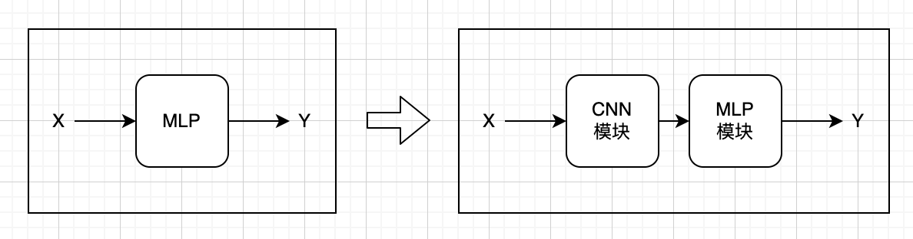

对比前一章介绍的多层感知机可以发现，LeNet-5 在参数数量上大约只有其 20% 左右，但在手写数字识别任务上的准确率却可以提升到接近 98.7%，效果提升是非常明显的。这也体现了卷积结构在处理图像数据时的优势：通过局部感受野、参数共享等机制，大幅减少参数的同时，还能更好地提取空间特征。为了让读者更直观地感受这种差异，我们将我们所实现的单层感知机、多层感知机以及 LeNet-5 的参数规模和识别准确率整理在下面的表格中，方便对比查看。

| 网络架构   | 参数数量 | 准确率 |
| ---------- | -------: | -----: |
| 单层感知机 |    7,850 | 89.93% |
| 多层感知机 |  266,610 | 91.48% |
| LeNet-5    |  61,706 | 98.65% |

从第二章开始，我们一直在处理“手写数字识别”这一类任务。这类问题有一个共同特点：输入数据的长度是固定的（例如固定大小的图像）。但在实际应用中，还有很多数据并不是固定长度的。比如给定一封邮件或一段文本，我们希望判断它是否是垃圾邮件；或者输入一句话，让模型完成翻译。这类问题的输入长度是变化的，传统的多层感知机和卷积神经网络就不太适合直接处理，而这正是循环神经网络（RNN）擅长的场景。

从发展历史来看，循环神经网络的提出其实要早于卷积神经网络。但从学习路径上考虑，后者的结构与计算过程更加直观易懂，因此我们先介绍了卷积神经网络相关内容。在接下来的章节中，我们将正式进入循环神经网络的学习，讲解其基本原理与经典变体。同时，我们也会逐步引入更具一般性的序列建模问题，并沿着模型演进的脉络，看看这些经典结构是如何一步步发展，最终走向如今的大语言模型的。

<div style="page-break-after: always;"></div>

## 第五章：循环神经网络

在第四章中，我们学习了卷积神经网络，并亲手实现了经典的 LeNet-5，在手写数字识别任务上取得了接近 99% 的准确率。从第二章的单层感知机，到第三章的多层感知机，再到第四章的卷积神经网络，一路走来，我们处理的始终是同一类问题：输入数据的结构是固定的。以手写数字识别任务为例，输入始终是一张尺寸固定的图像。

但现实世界中，有大量问题并不是这样的。考虑一下这些场景：给你一封邮件，判断它是否是垃圾邮件；给你一段语音，转录成文字；给你一句中文，翻译成英文。这些问题有一个共同点：输入的长度是不固定的。一封邮件可能有十个词，也可能有一千个词；一段语音可能持续三秒，也可能持续三分钟。我们把这类长度不定、有先后顺序的数据，统称为序列数据（Sequential Data）。

面对序列数据，我们之前学过的网络结构就显得力不从心了。比如，我们很难把一篇长短不一的文章直接塞进固定大小的输入层。而这正是循环神经网络（Recurrent Neural Network，简称 RNN）被提出的动机，它通过给全连接层添加一个隐藏状态，巧妙地解决了这个问题。

在本章中，我们将从回顾全连接层出发，一步步推导出 RNN 的结构与计算方式。你会看到，RNN 其实并不神秘，它只是在全连接层的基础上，增加了一个隐藏状态的传递机制。理解了 RNN 的基本原理之后，我们将动手实现一个字符级 RNN，让它在莎士比亚文集上训练，学会"续写"文章——这将是我们第一次亲身体验生成式 AI 的雏形。   


### 回顾全连接层

让我们先暂时忘记第四章介绍的卷积神经网络（CNN），回顾一下第二章开始介绍的全连接层。为了便于画图展示，我们以一个很小的全连接层为例来回顾：该层包含两个神经元，并接收三个输入。下图以三种不同的表现形式，展示了这个小的全连接层：

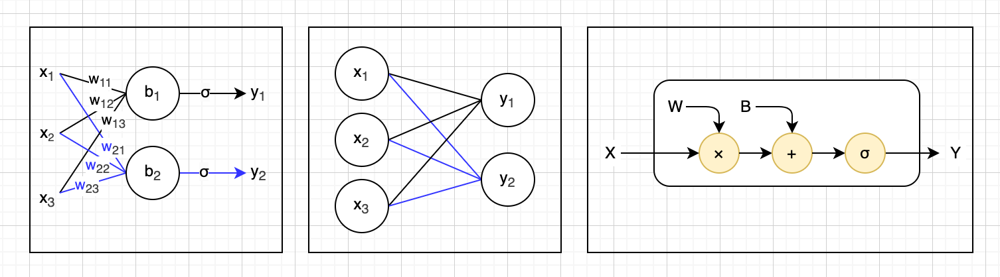

所谓全连接层，就是每一个输入都会与该层的每一个神经元相连接。但需要注意的是，全连接层中的每个神经元是相互独立计算的：每个神经元都拥有自己的一组权重参数（其数量与输入维度一致）以及一个偏置项，并基于这些参数独立地计算输出值。这一点也可以从上图（左）清晰地看出。

在我们熟悉了神经元和全连接层的基本工作机制之后，就可以把具体的权重、偏置和激活函数“折叠”或“隐藏”起来，从而将结构简化为更直观的表示形式，如上图（中）所示。这种表示方式更强调网络机构，而弱化了底层参数细节。

不过，无论是上图（左）还是（中），都只适用于展示结构较为简单的情况；当输入维度或神经元数量增加时，这种画法就会变得不够清晰。为了更好地描述实际中的全连接层结构，同时保留其计算本质，我们引入矩阵形式的表示方法，如上图（右）所示。

在这种表示中：输入 $X$ 、输出 $Y$ 、偏置 $B$ 都表示为**列向量**；权重 $W$ 表示为一个**矩阵**，其每一行对应一个神经元的权重参数。这样不仅可以清晰表达结构，还能自然引出其计算过程。全连接层的前向传播可以统一表示为：

$$
Y = f(X) = σ(WX + B)
$$

其中， $WX + B$ 表示线性变换， $\sigma$ 表示逐元素应用的激活函数（如 ReLU、Sigmoid 等）。这个公式完整刻画了全连接层的前向计算过程。如果你对这些内容还不够熟悉，可以回顾本书第二章和第三章的相关内容，再继续阅读本章后续部分。


### 增加隐藏状态

如果你已经理解了上面回顾的全连接层，那么你就会知道：全连接层本身完全是**无状态**的。也就是说，一旦我们确定了一个全连接层的结构（输入维度、神经元数量、激活函数）以及参数（每个神经元的权重向量和偏置），那么对于任意一个确定的输入向量 $X$ ，它的输出向量 $Y$ 就是**唯一且确定的**，不会受到“历史输入”的影响。

而循环神经网络（RNN）与全连接网络的关键区别就在这里：RNN 在全连接层的基础上，引入了一个**隐藏状态**（Hidden State）。这个隐藏状态可以在时间维度上被保留和传递。也就是说，RNN 在每次计算时，不仅依赖当前输入，还会结合“过去的信息”（即上一次的隐藏状态）来进行计算，并生成新的隐藏状态。随着输入序列一步一步地进入网络，这个隐藏状态会被不断更新、反复利用，这也正是“循环神经网络（Recurrent Neural Network）”这一名称的由来。

那么，RNN 层的隐藏状态到底是什么样子？它又是如何更新的呢？答案稍微复杂一点。首先，隐藏状态本质上是一个**向量**（通常称为隐藏向量或状态向量），其维度由模型设计决定（即隐藏层大小）。其次，为了完成隐藏状态的更新，RNN 在参数上也比全连接层更丰富一些。一个标准的 RNN 层通常包含三个权重矩阵和两个偏置向量，这些细节我们马上就会讨论。有些实现中会将偏置合并或省略输出层的激活函数，这取决于具体任务和框架实现。

简而言之，RNN 层的计算可以分为两个阶段来理解。首先，根据当前输入和旧的隐藏状态，计算新的隐藏状态。然后，基于更新后的隐藏状态，计算当前时刻的输出。我们用H和H'来表示前后隐藏状态，用带有下标的W、和B来表示权重矩阵和偏置向量，那RNN层对应的计算公式如下（这些下标的含义我马上会介绍）：

$$
H' = σ(W_{xh}X + W_{hh}H + B_h) \\
Y = σ(W_{hy}H' + B_y)
$$

相比全连接层，这个公式看起来确实更复杂一些。不过不用担心，如果你已经理解了全连接层，其实可以把 RNN 看作是“两个全连接层的组合 + 一个状态连接”。

我们先来看第一行的计算。如果暂时忽略 $W_{hh}H$ 这一项，那么这一部分其实就是一个标准的全连接层（输入为 $X$ ，输出为 $H'$ ），如下图（左侧虚线框）所示。而第二行计算，则完全对应另一个标准的全连接层（从 $H'$ 到 $Y$ ），如下图（右侧虚线框）所示。单看两个虚线框的话，完全就是一个两层全连接网络。

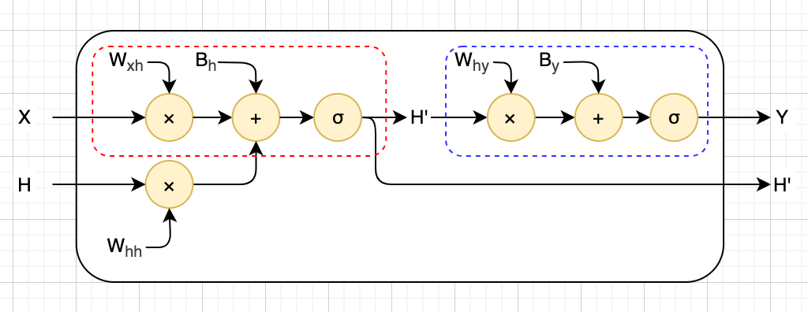

再回到第一行计算，我们只是在原本的全连接层基础上，引入了“上一时刻的隐藏状态”这一额外输入项（即 $W_{hh}H$ ）。可以把它理解为：这个全连接层不仅“看当前输入”，还“看过去的记忆”。换句话说，RNN 层本质上可以理解为：一个“带记忆的全连接层”（用于更新隐藏状态） + 一个标准的全连接层（用于生成输出）。

需要注意的是，在上图中，为了便于理解，我们把“旧的隐藏状态 $H$ ”画在左侧，与输入 $X$ 并列；把“新的隐藏状态 $H'$ ”画在右侧，与输出 $Y$ 并列。但在实际实现中，隐藏状态是RNN 内部维护的变量，并不会像普通输入输出那样显式暴露出来。等你熟悉这种计算方式后，可以将其理解为“隐式流动”的内部信息。

接下来，我们用一段 Python 代码来实现一个简单的玩具 RNN 层，帮助你加深对这些公式的理解：

```python
def new_rnn_layer(w_xh, w_hh, w_hy, b_h, b_y, h, af):
  def rnn_layer(x):
    nonlocal h  # 声明使用外部的h
    h = af(w_xh @ x + w_hh @ h + b_h)
    y = af(w_hy @ h + b_y)
    return y
  return rnn_layer
```

（TODO：激活函数一般用Tanh）

你可能已经看懂了上面的介绍与公式推导，但依然会困惑：这样设计的直观意义是什么？隐藏状态与各个权重矩阵具体是什么形状？一段序列又是如何被切分成输入、一步步送入 RNN 中进行计算的？别着急，下面我们一步步拆开来讲清楚。


### 隐藏状态形状

看懂了前面的公式与示意图后，隐藏状态 H 的形状就相对容易理解了。不过为了避免过于抽象，我们可以借助一个具体的多层感知机（MLP）示例，来辅助理解 RNN 层的结构。假设我们有一个两层全连接网络，输入维度为 3，输出维度为 2，隐藏层神经元数量为 4，其结构如下图所示。你可以暂时把这个 MLP 的隐藏层，看作具有相同输入、输出维度的 RNN 层的隐藏状态。

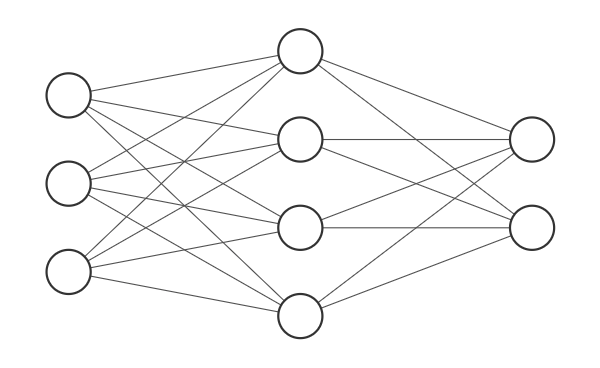

我们先来看前半部分公式，也就是更新隐藏状态的那一部分。还记得吗？它本质上是一个“增强版”的全连接层。因为隐藏状态 $H$ 需要与权重矩阵 $W_{hh}$ 相乘，并且其结果 $W_{hh}H$ 要与 $W_{xh}X$ 相加，所以它们的维度必须是兼容的。这就意味着：隐藏状态 $H$ 必须是一个向量，其长度等于该隐藏层的神经元数量。同时，矩阵 $W_{hh}$ 也必须是一个方阵，其行数和列数都等于隐藏层大小（即神经元数量）。

具体到上图这个例子，前半部分公式大致对应这个MLP的隐藏层。其输入维度是 3，临时的输出维度是（隐藏层神经元数量）是 4。那么：

- 输入 $X$ ：长度为 3 （输入数量）的列向量
- 偏置 $B_h$ ：长度为 4 （临时输出数量）的列向量
- 隐藏状态 $H$ ：长度为 4 （临时输出数量）的列向量
- 临时输出（新隐藏状态） $H'$ ：长度为 4 （临时输出数量）的列向量
- 权重 $W_{xh}$ ：形状为 $4 \times 3$ （临时输出 × 输入）
- 权重 $W_{hh}$ ：形状为 $4 \times 4$ （临时输出 × 临时输出）

在这个设定下，我们可以将输入、权重、偏置以及隐藏状态都画成“网格”形式，从而直观地理解矩阵运算的过程。第一部分（隐藏状态更新）的计算如下图所示：

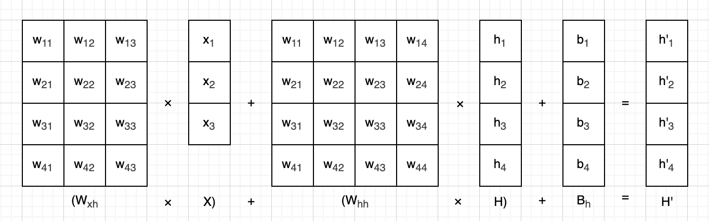

接下来再看后半部分公式，它就更容易理解了，因为这一部分本身就是一个标准的全连接层。其输入是隐藏向量 $H'$ ，神经元数量对应输出向量的维度，计算结果就是该时刻 RNN 层的输出。具体到刚才的例子，后半部分公式正好对应MLP的输出层，且输出维度为 2，于是：

- 临时输入 $H'$ ：长度为 4 （隐藏状态维度）的列向量
- 偏置 $B_y$ ：长度为 2 （最终输出数量）的列向量
- 输出 $Y$ ：长度为 2 （最终输出数量）的列向量
- 权重 $W_{hy}$ ：形状为 $2 \times 4$ （最终输出 × 临时输入）

对应的计算过程如下图所示：

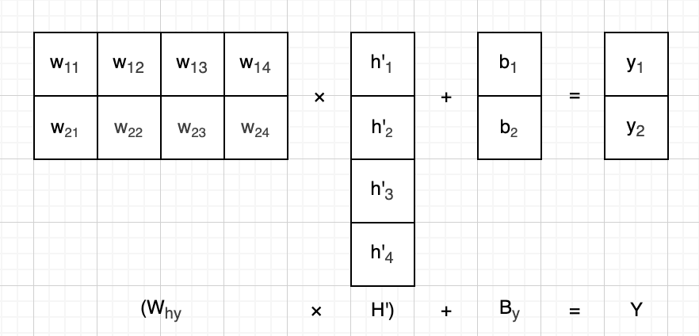

为了便于理解，我们暂时用小写字母x来表示输入向量X的维度，用小写字母h来表示隐藏状态H的维度，用小写字母y来表示输出向量Y的维度。当这些小写字母作为矩阵（包括列向量）下标时，它们不仅给出了矩阵的形状信息，还蕴含了矩阵的用途。下面这个表格，可以帮助你理解这些矩阵的形状和用途：

| 矩阵     | 形状 | 参数数量 | 说明                                          |
| -------- | ---- | -------- | --------------------------------------------- |
| $X$      | x×1  |          | 输入列向量                                    |
| $Y$      | y×1  |          | 输出列向量                                    |
| $H$      | h×1  | 0        | 隐藏状态（列向量）                            |
| $B_h$    | h×1  | h        | 偏置列向量，用于计算隐藏状态                  |
| $B_y$    | y×1  | y        | 偏置列向量，用于计算输出                      |
| $W_{xh}$ | h×x  | h×x      | 权重矩阵，根据输入计算隐藏状态（x→h）         |
| $W_{hh}$ | h×h  | h×h      | 权重矩阵，根据旧隐藏状态计算新隐藏状态（h→h） |
| $W_{hy}$ | y×h  | y×h      | 权重矩阵，根据新隐藏状态计算输出（h→y）       |

需要特别注意的是：在 RNN 层中，只有权重矩阵和偏置向量是可学习参数，而隐藏状态 $H$ 并不是模型参数，它只是随着输入序列动态更新的中间变量。因此，在给定输入维度 $x$ 、隐藏层维度 $h$ 、输出维度 $y$ 的情况下，RNN 层的总参数数量可以表示为：

$$
params=(h×x)+(h×h)+(y×h)+h+y
$$

为了直观感受 RNN 层的计算过程，我们结合上一小节实现的简易 RNN 层代码，把这个具体例子完整实现出来。由于不包含训练环节，我们直接用随机数初始化输入与所有参数，隐藏状态通常初始化为 0 即可。示例代码如下：

```python
_x, _h, _y = 3, 4, 2
w_xh = np.random.rand(_h, _x) # 4×3
w_hh = np.random.rand(_h, _h) # 4×4
w_hy = np.random.rand(_y, _h) # 2x4
b_h = np.random.rand(_h)      # 4×1
b_y = np.random.rand(_y)      # 2×1
h = np.zeros(_h)              # 4×1
x = np.random.rand(_x)        # 3×1
layer = new_rnn_layer(w_xh, w_hh, w_hy, b_h, b_y, h, np.tanh)
h2, y = layer(x)
print(h2, y)
```


### 循环更新状态

按照老规矩，既然我们已经理解了 RNN 层的基本结构，我们就可以把繁琐的计算细节先“隐藏”起来了。只保留几个核心要素：输入 $X$ 、输出 $Y$ ，以及“旧的隐藏状态” $H$ 和“新的隐藏状态” $H'$ 。同时，我们对示意图做一个小调整：将原本的结构逆时针旋转 90°。这样一来：隐藏状态 $H \rightarrow H'$ 的传递体现在**水平方向**（对应时间的推进）；输入 $X$ 和输出 $Y$ 的计算体现在**竖直方向**。

经过这样的简化与调整后，RNN 层可以表示为下图（左）这种形式。有些教材也会画成下图（右）这样：让隐藏状态从 RNN 单元“流出”后再“回流”进来，这种画法更直观地体现了“循环（Recurrent）”的含义。

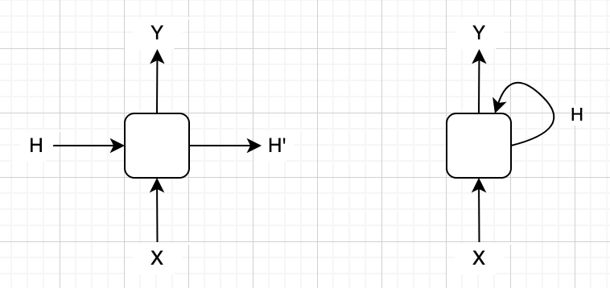

你可能会好奇：为什么要特意调整方向？毕竟我们一直习惯于“输入从左进入，输出从右流出”的表示方式。原因在于：我们接下来要引入“时间维度”。我们用下标 $t$ 表示某一时刻的计算，用 $t+1$ 表示下一个时刻，以此类推。在这样的表示下，隐藏状态就可以自然地在时间上串联起来：当前时刻的 $H_t$ 会作为下一时刻的输入之一，参与计算 $H_{t+1}$ 。

于是，我们就可以把 RNN 层在时间维度上“展开”（Unroll / Unfold）。展开之后，每一个时间步看起来就像一个结构相同、参数共享的“拷贝”。下图展示了某个 RNN 层在前三个时间步的计算过程：

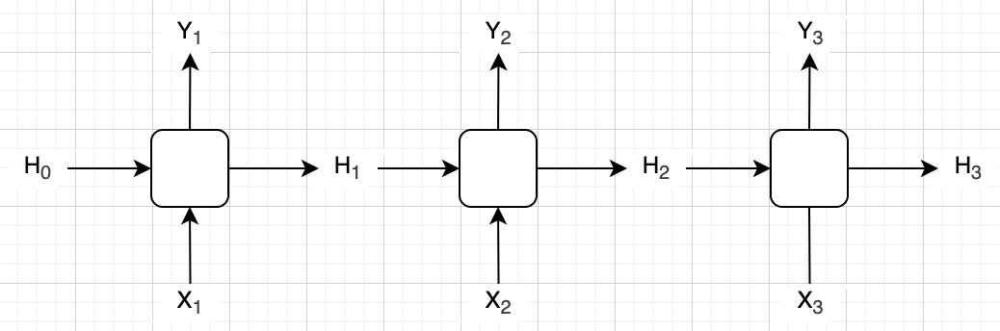

理解了这种展开方式的用意之后，我们还可以进一步简化表示，把隐藏状态写在水平箭头上方。这样既能减少图的复杂度，又能更紧凑地展示更长的时间序列。在这种表示方法下，我们可以很直观地画出 RNN 在多个时间步上的连续计算过程。如下图所示，展示了从某一时刻 $t$ 开始，连续进行六次计算的情况：

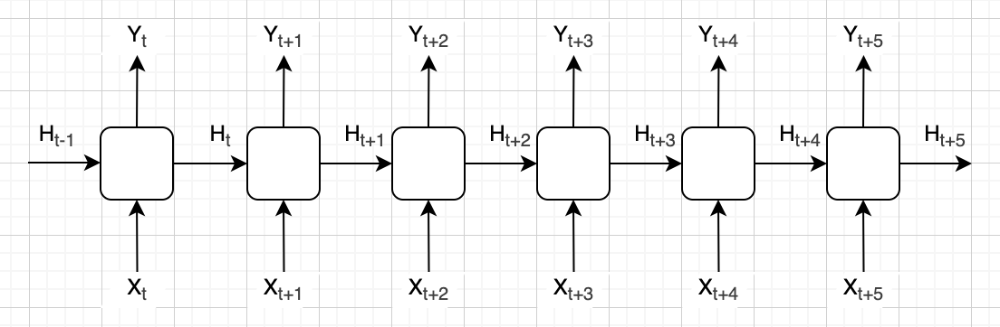

既然 RNN 层是在离散的输入序列上不断循环计算，那么用程序中的循环语句来表达这一过程就非常自然。我们可以直接使用上一小节实现的简易 RNN 层代码，将构造好的小 RNN 层放入循环中，逐次处理序列中的每一个步输入，从而完整模拟 RNN 的前向计算过程。

注意，我们在示例中暂时使用随机数来表示每一步的输入向量，并且写死循环次数为10。在后续小节中，我会详细介绍如何将一段真实文本转换成这样一系列的输入向量。示例代码如下所示：

```python
layer = new_rnn_layer(w_xh, w_hh, w_hy, b_h, b_y, h, np.tanh)

for i in range(10):
    x = np.random.rand(_x)
    h, y = layer(x)
    print(f't{i}: x={x.round(3)}, y={y.round(3)}, h={h.round(3)}')
```

跑一下上面的代码，可以打印出类似下面这样的内容：

```
t0: x=[0.301 0.594 0.333], y=[0.98  0.966], h=[0.915 0.83  0.872 0.707]
t1: x=[0.455 0.064 0.744], y=[0.989 0.982], h=[0.993 0.988 0.995 0.997]
t2: x=[0.72  0.571 0.219], y=[0.989 0.983], h=[0.996 0.995 0.998 0.998]
t3: x=[0.124 0.635 0.748], y=[0.989 0.983], h=[0.998 0.992 0.998 0.999]
t4: x=[0.621 0.12  0.373], y=[0.989 0.982], h=[0.993 0.993 0.997 0.998]
t5: x=[0.163 0.707 0.913], y=[0.989 0.983], h=[0.998 0.994 0.998 0.999]
t6: x=[0.257 0.867 0.719], y=[0.989 0.983], h=[0.998 0.995 0.999 0.999]
t7: x=[0.997 0.279 0.712], y=[0.989 0.983], h=[0.998 0.997 0.999 0.999]
t8: x=[0.222 0.346 0.866], y=[0.989 0.983], h=[0.997 0.992 0.998 0.999]
t9: x=[0.563 0.183 0.388], y=[0.989 0.983], h=[0.994 0.992 0.997 0.998]
```


### 多个RNN层

和多层感知机（MLP）的构建思路一致，我们同样可以将多个 RNN 层串联连接，组成一个深度 RNN 网络，以此提升模型对序列特征的提取能力。深层 RNN 能通过多层循环，逐步挖掘序列中更复杂、更抽象的上下文关联，比单层 RNN 更适合处理复杂的序列任务。

而在实际应用中，和卷积神经网络（CNN）的结构逻辑类似，大部分情况下，RNN 网络的最后都会衔接一个或多个普通的全连接层（MLP） 。这是因为 RNN 层的输出是包含序列特征的隐藏状态，其维度和特征形式往往无法直接适配最终任务的输出要求，全连接层的作用就是将这些时序特征进行映射、转换，最终输出符合任务需求的结果（如分类任务的类别概率、预测任务的数值等）。

下图展示的就是一个典型的深度 RNN 网络结构：包含两个串联的 RNN 层，以及一个用于最终输出的全连接层。

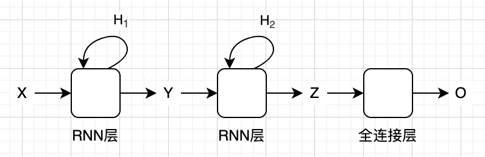

我们已经基本掌握 RNN 网络的核心基础概念。接下来，我们将前文实现的简易 RNN 层，与第二章搭建的全连接层代码进行整合。整合后的代码可以搭建出包含多层 RNN 结构与全连接输出层的完整网络，支持标准的前向计算流程；只需搭配循环逻辑，即可直接运行测试。具体实现代码如下所示：

```python
def new_rnn(rnn_layers: list, fc_layer):
    def rnn(x):
        current = x                     # 保存输入，逐层向前传播
        for rnn_layer in rnn_layers:    # 遍历每一个RNN层
            _h, _y = rnn_layer(current) # 一层一层计算
            current = _y                # 忽略隐藏状态
        return fc_layer(current)        # 全连接层计算
    return rnn
```


### 字符级RNN

本章开头我们提到过，RNN 比较适合处理输入序列长度不固定的问题。而在这类问题中，最常见、也最典型的应用场景就是文本处理，例如垃圾邮件识别、机器翻译等等。这也是本书接下来要重点讨论的内容。

现实世界中语言与文字种类繁多，而我们最为熟悉的便是中文与汉字。不过，为了降低理解门槛，同时避免过早引入复杂的文本预处理等问题，本书主要以字母构成的英文文本为例展开讲解。

对于英文这样的语言，一个更常见、也更“标准”的处理方式，是先将文本切分为一个个单词（word），再将这些单词作为序列输入到 RNN 中。不过，这种做法本身涉及到分词、词表构建、词向量等一系列额外的知识点。为了保持整体讲解的连贯性，本书会把这些内容放在后面再详细介绍。

在此之前，我们采用一种更直接的方式：将文本看作由字母和符号（统称为**字符**）组成的序列，一个字符一个字符地进行处理。虽然这种方法在表达能力上通常不如基于单词的建模方式，但它的优点在于简单直观，不需要太多前置知识，就可以直接应用 RNN 来解决问题。这种按字符处理文本的 RNN，我们称之为**字符级 RNN**（Character-Level RNN，简称 Char-RNN）。

不过，即便是使用 Char-RNN，我们仍然需要解决一个基本问题：如何将每一个字符（包括字母、数字以及标点符号）转换成模型可以接受的输入向量。最简单的方式是**索引编码**，但该方式存在明显缺陷，我将在下一小节进行说明。另一种经典方案为**独热编码**，将在后续小节中展开详细讲解。

这两种编码方案对于 Char-RNN 而言尚且可以接受，因为字符集规模通常很小（例如英文仅包含数十个字符，涵盖字母、数字与标点），无论是数据表示还是模型计算，整体开销都相对可控。但如果将处理单位从字符升级为单词，情况就会截然不同。在本书后续章节中，介绍完文本分词知识后，我会引入更加高效、通用的向量表示方法，以此解决单词级 RNN 所面临的各类问题。


### 索引编码

我们先来看最简单的索引编码（Index Encoding），也常称作标签编码（Label Encoding）。该编码方式只需将字符集中的字符统一排序，再按顺序从 1 开始依次编号，本质是将离散的类别符号映射为连续整数。为方便后续讨论，我们假设英文字符集仅包含小写字母与空格，字符集总大小为 27。由于 RNN 的输入要求为向量形式，因此可将每个字符编码为一维向量，这也是标量数值的简易向量化表示，具体编码过程如下图所示：

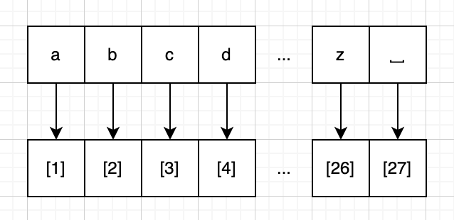

索引编码虽然简单直观，但问题也比较明显。由于篇幅原因，这里只列举几个容易理解的点。

首先，索引本身引入了人为的“顺序关系”。我们给字符排序并编号，只是为了方便表示，但这个顺序在语义上是没有意义的。然而，一旦把它作为数值输入给模型，RNN 在训练过程中可能会“误以为”这些数字之间存在大小关系。例如，它可能会认为 `b` 比 `a`“更大”，甚至在某些情况下倾向于学习这种数值上的大小规律，而不是字符本身的离散属性。

第二，索引编码会隐式引入“比例关系”。例如，模型可能会“误解”为 `d` 在某种意义上是 `b` 的“两倍”，或者 `c` 比 `a`“强三倍”。这些关系在数学上是成立的，但在字符表示中完全没有意义，却可能干扰模型的学习过程。

再进一步，这种码还会引入不合理的“距离关系”。例如，在这种表示下，`a` 和 `b` 的“距离”为 1，而 `a` 和 `z` 的“距离”为 25。但实际上，这种距离在字符语义中并没有任何真实含义。模型却可能会利用这些数值差异来进行计算，从而产生误导。

本质上来说，问题的根源在于：索引编码把“离散的符号”强行映射成了“连续的数值”，而神经网络恰恰非常擅长利用数值之间的大小、距离和比例关系，这就容易导致模型学习到一些并不存在的“伪规律”。

不过，我们也不是说索引编码完全没用。像学历、等级、星级评分这类自带高低、先后顺序的类别，使用整数编码就十分合适，数字大小能够直观体现层级关系，简洁又高效。但如果将其直接作为神经网络的原始输入来处理文本任务，多数情况下并不合适，因为文本中的字符并不存在天然大小关系。而我们接下来要介绍的独热编码，正好可以规避索引编码带来的顺序偏见，是一种更加合理的字符表示方案。


### 独热编码

其实，独热编码（One-Hot Encoding）和索引编码相比，本质上的差别只有一点：把原本的“一个整数索引”，展开成了一个 $k$ 维向量，其中 $k$ 等于字符集的大小。以前面的小写英文字母加空格为例，字符集大小是 27，因此每个字符都会被表示成一个长度为 27 的向量。

在这个向量中，只有当前字符对应的位置为 1，其余位置全部为 0。如果你把这些元素想象成一排小灯泡，那么只有一个灯泡是亮（“热”）的，其余都是灭的，因此得名“独热编码”。这种编码方式有时也被称为 1-of-k 编码。下图展示了独热编码的具体形式：

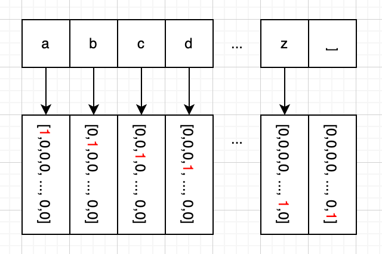

前面我们提到，索引编码会引入一些不合理的“大小关系”、“距离关系”和“比例关系”。而通过将索引展开成向量，独热编码彻底消除了这些问题：每个字符在向量空间中都是相互独立、等距的，模型无法再从数值上推断出任何“谁比谁大”之类的错误关系，从而避免了不必要的干扰。

不过，独热编码也并不是一个完美的方案，它同样存在一些明显的局限性。最典型的问题包括：

- **维度冗余**：向量的维度必须等于字符集大小，一旦字符集变大，输入维度就会迅速膨胀
- **数据稀疏**：每个向量中绝大多数元素都是 0，只有一个位置为 1，这在计算和存储上都不够高效
- **缺乏语义信息**：不同字符之间完全“正交”，无法表达任何相似性（例如 `a` 和 `b` 比 `a` 和 `#` 更相似这一点，在独热编码中是体现不出来的）

在字符集较小的情况下（例如 Char-RNN 场景），这些问题通常还可以接受。但如果我们把文本处理的基本单位从“字符”提升到更高层次的“单词”，那么词表规模往往会达到上万甚至更多，此时独热编码带来的维度和稀疏问题就会被放大许多个数量级，变得难以接受。关于这个问题，以及更高效的解决方案，我们会在后续章节中再详细讨论。

示例代码：

```python
import numpy as np

def char_one_hot(txt: str):
    # 1. 收集不重复的 char，排序
    vocab = sorted(set(txt))

    # 2. 生成 one-hot 矩阵
    one_hot = np.eye(len(vocab), dtype=int)

    # 3. 打印每个 char 及其 one-hot vector
    for idx, ch in enumerate(vocab):
        print(f"{repr(ch)}: {one_hot[idx].tolist()}")

txt = "To be, or not to be, that is the question."
char_one_hot(txt)
```

输出：

```
' ': [1, 0, 0, 0, 0, 0, 0, 0, 0, 0, 0, 0, 0, 0, 0, 0]
',': [0, 1, 0, 0, 0, 0, 0, 0, 0, 0, 0, 0, 0, 0, 0, 0]
'.': [0, 0, 1, 0, 0, 0, 0, 0, 0, 0, 0, 0, 0, 0, 0, 0]
'T': [0, 0, 0, 1, 0, 0, 0, 0, 0, 0, 0, 0, 0, 0, 0, 0]
'a': [0, 0, 0, 0, 1, 0, 0, 0, 0, 0, 0, 0, 0, 0, 0, 0]
'b': [0, 0, 0, 0, 0, 1, 0, 0, 0, 0, 0, 0, 0, 0, 0, 0]
'e': [0, 0, 0, 0, 0, 0, 1, 0, 0, 0, 0, 0, 0, 0, 0, 0]
'h': [0, 0, 0, 0, 0, 0, 0, 1, 0, 0, 0, 0, 0, 0, 0, 0]
'i': [0, 0, 0, 0, 0, 0, 0, 0, 1, 0, 0, 0, 0, 0, 0, 0]
'n': [0, 0, 0, 0, 0, 0, 0, 0, 0, 1, 0, 0, 0, 0, 0, 0]
'o': [0, 0, 0, 0, 0, 0, 0, 0, 0, 0, 1, 0, 0, 0, 0, 0]
'q': [0, 0, 0, 0, 0, 0, 0, 0, 0, 0, 0, 1, 0, 0, 0, 0]
'r': [0, 0, 0, 0, 0, 0, 0, 0, 0, 0, 0, 0, 1, 0, 0, 0]
's': [0, 0, 0, 0, 0, 0, 0, 0, 0, 0, 0, 0, 0, 1, 0, 0]
't': [0, 0, 0, 0, 0, 0, 0, 0, 0, 0, 0, 0, 0, 0, 1, 0]
'u': [0, 0, 0, 0, 0, 0, 0, 0, 0, 0, 0, 0, 0, 0, 0, 1]
```


### 生成式AI

（TODO：补充、润色）

如果你比较熟悉现在的聊天机器人，并且简单了解过它们的内部工作原理，你可能会惊叹：它们背后的基本思想其实并不复杂。根据已有的上下文，预测下一个词（或字符），然后不断重复这个过程，逐步生成整段文本，仅此而已。正是这样一个看似简单的机制，在大规模数据和模型参数的加持下，却能够表现出类似人类的语言能力，甚至在某些场景下呈现出“思考”的感觉。

这种从海量数据中学习规律，并据此生成新内容的模型范式，通常被称为**生成式 AI**（Generative AI，简称 GenAI）。而利用我们目前已经学习过的 Char-RNN，就可以构建一个“简化版”的生成式模型。

接下来，我们将搭建一个两层RNN+一个全连接层的小型RNN网络，并用一个微型的“莎士比亚文集”来训练它，并让它学会生成类似风格的文本。训练好以后，模型就帮我们写做了。例如，当我们输入 “Long, long ago,” 时，模型可能会生成类似 “when the world was quiet and full of gentle mysteries...” 这样的续写内容。

在这一小节中，我们将从**训练**、**种子**和**生成** 三个阶段，来理解这个模型是如何工作的。

先来看训练过程。本质上，我们是让模型从一个初始状态开始（通常将隐藏状态初始化为全 0），然后把文本数据**按字符逐个输入模型**。在每一个时间步，模型都会输出一个向量，表示“下一个字符”的概率分布（通常通过 softmax 归一化得到）。然后，我们将这个预测分布与真实的下一个字符进行对比，计算损失，并通过**反向传播**来不断调整模型参数。（关于反向传播的具体细节，我们会在本书的最后再详细介绍，这里先从整体流程理解。）假设训练文本以 “To be, or not to be...” 开头，那么训练过程大致如下图所示。在这个过程中，模型不断学习：在给定前面字符序列的情况下，应该预测什么样的下一个字符。

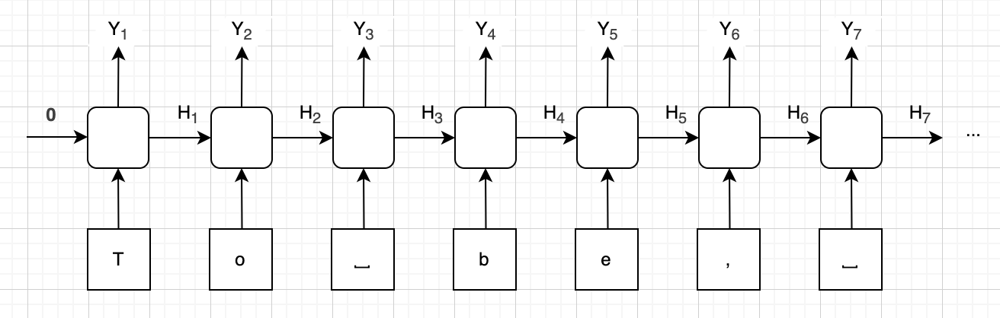

再来看种子阶段。当模型训练完成后，我们就得到了所有的参数。接下来，如果我们想让模型生成文本，就需要先给它一个“种子”。这个种子通常是一小段起始文本，你也可以把它理解为一个非常简化的“提示词（prompt）”。

在这个阶段，模型同样从初始隐藏状态开始（全 0），然后按顺序把种子中的字符输入模型。需要注意的是，这个过程中模型虽然也会输出“下一个字符的概率”，但这些输出我们通常不会使用，而是直接丢弃。我们的目的只是：通过输入种子，让模型内部的隐藏状态逐渐“进入语境”，形成一个能够代表当前上下文的状态。假如我们的种子是“Long, long ago,”，那么初始化阶段大致如下图所示：

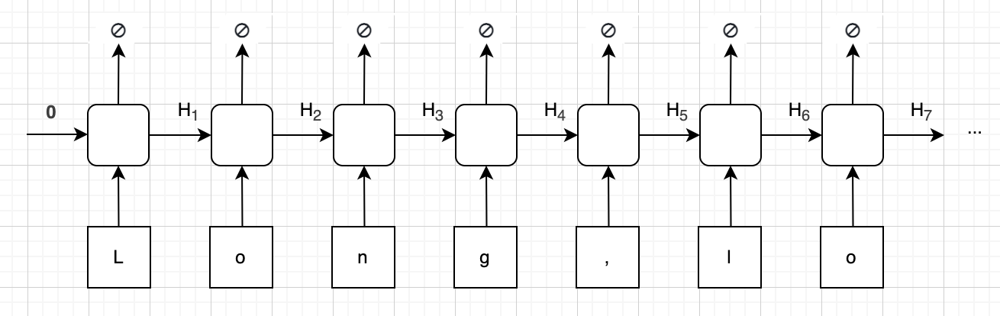

最后来看生成阶段。在完成种子输入之后，我们就进入真正的生成阶段。此时，模型已经有了一个包含上下文信息的隐藏状态，同时也能够输出“下一个字符的概率分布”。接下来，我们需要根据这个概率分布来选择一个字符，并将这个字符作为新的输入，继续喂给模型，从而不断生成后续内容。

最简单的做法是：每一步都选择概率最大的那个字符（贪心策略）。然后不断重复这个过程，直到生成了某个结束符（例如换行或特殊 token），或者达到预设的最大长度。我们假设模型预测的前几个字符是“when the world was quiet and full of gentle mysteries,”，生成过程大致如下图所示：

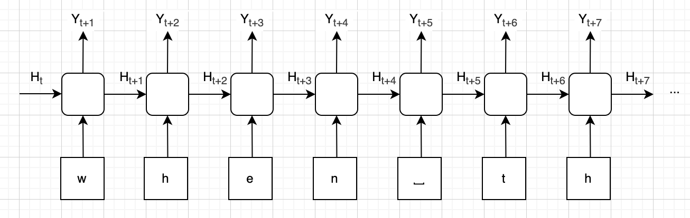

在工程实现上，我们不需要从零手写 RNN。像 PyTorch 这样的深度学习框架，已经内置了 RNN 模块，我们可以直接使用。只需要指定：字符集大小（vocab_size）、隐藏状态维度（hidden_size）、RNN 层数（num_layers），再配合一个全连接层，就可以构建出完整的 Char-RNN 模型。其中，RNN 负责处理序列信息，而线性层负责将隐藏状态映射到字符空间（即预测下一个字符的 logits）。例如：

```python
class CharRNN(nn.Module):
    def __init__(self, vocab_size, hidden_size, num_layers):
        super().__init__()
        self.rnn    = nn.RNN(vocab_size, hidden_size, num_layers)
        self.linear = nn.Linear(hidden_size, vocab_size)

    def forward(self, x_oh, hidden=None):
        out, hidden = self.rnn(x_oh, hidden)
        logits = self.linear(out)
        return logits, hidden
```

读者可能已经注意到：如果我们在生成阶段，每一步都选择概率最大的字符，那么在相同的种子输入下，模型每次生成的结果都会完全一致。这显然会让生成的文本变得单一、缺乏变化。而现实中的聊天机器人并不是这样工作的。它们通常会引入一些随机性控制策略，例如温度值、Top-k 采样、Top-p 采样等。这些方法可以在“确定性”和“随机性”之间做平衡，从而生成更加自然、多样的文本。我们将在下面的小节里，陆续详细介绍这些技术。

玩具char-rnn，效果：

```
============================================================
Seed: "long long ago"
============================================================
long long agooped the servant
The serves the world comes the servant the servant
The serves the world comes the servant the servant
The serves the world comes the servant the servant
The serves the world comes the servant the servant
The serves the world comes the servant the servant
The serves the world comes the servant the servant
The serves the world comes the servant the servant
The serves the world comes the servant the servant
The serves the world comes the servant the servant
The serves the world com
============================================================
```


### 温度值

我们在中学物理中学过，温度本质上反映的是分子的活跃程度。在 GenAI 中，也借用了“温度（Temperature）”这一概念，用来描述模型在生成文本时的“活跃程度”。温度值越高，模型越“发散”，生成结果更具多样性和创造性；温度值越低，模型越“保守”，更倾向于选择最确定的结果。

那温度是如何影响概率分布的呢？还记得在第三章中，我们介绍过 Softmax 归一化函数，它可以将模型输出的分数值（Logits）转化为概率分布。为了方便回顾，这里再次给出 Softmax 的公式，其中 $z_i$ 表示某个分数， $P_i$ 表示对应的概率：

$$
P_i = \frac{e^{z_i}}{\sum_{j=1}^{n}e^{z_j}}
$$

现在我们对这个公式做一个简单的改动，引入温度参数（用小写字母t表示）。方法很直接：将每个分数除以温度值，再进行 Softmax。也就是说，温度本质上是在 Softmax 之前对分数值进行整体缩放。修改后的公式如下：

$$
P_i = \frac{e^{z_i/t}}{\sum_{j=1}^{n}e^{z_j/t}}
$$

我们把第三章写的Softmax函数稍加修改，加上温度值参数`t`，就变成了带温度的归一化函数，修改后的代码如下所示：

```python
from math import e

def softmax(z: list[float], t: float) -> list[float]:
    exp_values = [e ** (v/t) for v in z]
    total = sum(exp_values)
    return [v / total for v in exp_values]
```

从新的归一化公式可以看出：

- 当 $t = 1$ 时，对原始 Softmax 没有任何影响
- 当 $t > 1$ 时，分数值被“压缩”，概率分布变得更加平缓：高概率降低，低概率升高
- 当 $t < 1$ 时，分数值被“放大”，概率分布变得更加尖锐：高概率更高，低概率更低
- 当 $t \to 0$ 时，分布趋近于 one-hot（只保留最大值）
- 当 $t \to \infty$ 时，分布趋近于均匀分布

我们以 logits = $[3, 2, 1]$ 为例，总结不同温度下，最终概率分布的变化情况，以及对模型输出的影响，见下表：

| 温度值变化 | 实际取值 | 概率分布              | 概率分布变化       | 模型输出       |
| ---------- | -------- | --------------------- | ------------------ | -------------- |
| → ∞        | 9.9      | [0.334, 0.333, 0.333] | 接近均匀分布       | 高度随机       |
| > 1        | 1.5      | [0.563, 0.289, 0.148] | 高概率 ↓，低概率 ↑ | 更随机，更发散 |
| = 1        | 1.0      | [0.665, 0.245, 0.09]  | 不改变分布         | “原始想法”     |
| < 1        | 0.5      | [0.867, 0.117, 0.016] | 高概率 ↑ ，低概率↓ | 更确定，更保守 |
| → 0        | 0.1      | [1.0, 0.0, 0.0]       | 极度尖锐           | 几乎完全确定   |

需要注意的是：仅仅调整温度值，并不能引入真正的随机性。如果我们在生成时始终选择概率最大的那个结果（即贪心策略），那么无论温度如何变化，最终输出仍然是确定的。因此，在实际应用中，温度通常需要配合采样策略（如 Top-k 或 Top-p）一起使用，才能既保证合理性，又增加多样性。


### Top-K/P采样

所谓 **Top-K 采样**（Top-K Sampling），其实从名字就可以很好理解。我们先将模型输出的概率分布按从大到小排序，然后只保留其中概率最高的前 $k$ 个（例如 $k=10$ ），其余的概率全部置为 0。

假设一共有 $n$ 个候选，由于我们丢弃了其中 $n-k$ 个概率值，此时剩余概率之和将不再等于 1，因此需要对保留下来的这 $k$ 个概率进行重新归一化。这里通常不再使用 Softmax，而是进行简单的比例归一化即可，其公式如下。注意：虽然公式写成对全部概率值求和，但实际上只有前 $k$ 项非零，其余已经被置为 0。

$$
P'_i = \frac{P_i}{\sum_{j=1}^{n}{P_j}}
$$

我们假设原始概率分布（已排序）为：[0.496, 0.254, 0.131, 0.067, 0.034, 0.018]，下表展示了不同 $k$ 值对采样范围和归一化结果的影响。可以看到： $k$ 越小，候选越少，结果越确定； $k$ 越大，候选越多，随机性越强。

| K    | 筛选后                                      | 归一化                                      |
| ---- | ------------------------------------------- | ------------------------------------------- |
| 4    | [0.496, 0.254, 0.131, 0.067, 0.0, 0.0, 0.0] | [0.523, 0.268, 0.138, 0.071, 0.0, 0.0, 0.0] |
| 3    | [0.496, 0.254, 0.131, 0.0, 0.0, 0.0]        | [0.563, 0.288, 0.149, 0.0, 0.0, 0.0]        |
| 2    | [0.496, 0.254, 0.0,  0.0, 0.0, 0.0]         | [0.661, 0.339, 0.0, 0.0, 0.0, 0.0]          |
| 1    | [0.496, 0.0, 0.0,  0.0, 0.0, 0.0]           | [1.0, 0.0, 0.0, 0.0, 0.0, 0.0]              |

和 Top-K 采样类似的，还有一种方法叫做 **Top-P 采样**（Top-p Sampling），它也被称为**核采样**（Nucleus Sampling）。两者的区别在于：Top-K固定候选数量（前 $k$ 个）；而Top-p则动态选择候选，使其累计概率达到阈值 $p$ （例如 0.8）。也就是说，我们从概率最大的开始往下累加，一直到总和超过 $p$ ，就停止，然后只保留这些候选，其余置为 0，再进行归一化。

不难看出，Top-P 是一种自适应机制：当概率分布很“集中”时，可能只需要少量候选；而当分布较“分散”时，则会保留更多候选。还是使用前面的例子，下表展示不同 $p$ 值的效果：

| P    | 筛选后                                      | 归一化                                      |
| ---- | ------------------------------------------- | ------------------------------------------- |
| 0.9  | [0.496, 0.254, 0.131, 0.067, 0.0, 0.0, 0.0] | [0.523, 0.268, 0.138, 0.071, 0.0, 0.0, 0.0] |
| 0.8  | [0.496, 0.254, 0.131, 0.0, 0.0, 0.0]        | [0.563, 0.288, 0.149, 0.0, 0.0, 0.0]        |
| 0.7  | [0.496, 0.254, 0.0,  0.0, 0.0, 0.0]         | [0.661, 0.339, 0.0, 0.0, 0.0, 0.0]          |
| 0.6  | [0.496, 0.254, 0.0,  0.0, 0.0, 0.0]         | [0.661, 0.339, 0.0, 0.0, 0.0, 0.0]          |

完成 Top-K 或 Top-p 筛选并归一化之后，我们就得到了一个新的概率分布。接下来，就可以按照这个分布进行**加权随机抽取**，选出最终的输出结果。这种方法的本质是：把概率分布看作一个 $[0,1]$ 区间的划分，然后随机落点，看最终落在哪一段。下面这个函数展示了一个简单的按概率采样的实现方式：

```python
import random

def sample_by_prob(probs: list[float]) -> int:
    # 生成 0~1 之间的随机数
    rand = random.random()
    
    # 累计概率，判断落在哪个区间
    cumulative = 0.0
    for idx, prob in enumerate(probs):
        cumulative += prob
        if rand < cumulative:
            return idx
```

最后，我们把整套采样流程完整串联。假设某次 RNN 输出的分数值为：[3, 1, 6, 2, 5, 4]，从带温度的概率归一化，到采样（这里以Top-K为例），再到加权随机抽取的完整过程，如下图所示：

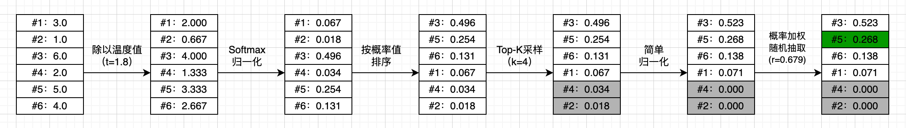

总之，通过温度 + Top-K / Top-p 采样 ，我们就可以在“确定性”和“随机性”之间取得平衡，从而生成既合理又多样的文本。

效果：

```
============================================================
Seed: "long long ago"
============================================================
long long agour,
Save at your suefilled to the counsel made a
kingarding fires will have thought in the consure
O' the that poised of little known to blood.

DUKE VINCENTIO:
So stay with thee saw I hear of love's face it be.
Which is umthing with them sorrow with thee?
Whating of them to be of me;
And tell me your most late, bid to bound touchly came,
For brother's saunt as great love; stranges: the swain
My sovereign, Gremio! why thou hast bitter years
To with my heart, give him particians?

BUCKINGHAM:
My
============================================================
```


### 本章小结

（TODO：这一小节是AI写的，需要重写）

本章从序列数据的处理需求出发，系统地介绍了循环神经网络（RNN）的核心思想与工作机制。

**从全连接层到 RNN。** 全连接层是无状态的：给定相同输入，输出始终一致。而现实中有大量任务涉及长度不固定的序列数据，如邮件分类、语音转录、机器翻译等。RNN 的核心创新在于引入了**隐藏状态**，使网络在处理每一步输入时，同时结合"过去的记忆"进行计算，并将更新后的状态传递给下一步——这正是"循环"二字的含义。

**RNN 的计算方式。** RNN 层的前向计算分为两个阶段：首先，结合当前输入与旧的隐藏状态，计算新的隐藏状态；然后，基于新的隐藏状态，输出当前时刻的结果。对应的公式为：

$$H' = σ(W_{xh}X + W_{hh}H + B_h)，\quad Y = σ(W_{hy}H' + B_y)$$

其中包含三个权重矩阵（ $W_{xh}$ 、 $W_{hh}$ 、 $W_{hy}$ ）和两个偏置，而隐藏状态 $H$ 本身不是可学习参数，只是随序列推进动态更新的中间变量。

**时间展开与深层 RNN。** 将 RNN 在时间维度上"展开"，可以直观地看到每一时刻的计算是结构相同、参数共享的拷贝。与 MLP 和 CNN 类似，多个 RNN 层可以串联叠加，形成深层 RNN，末端通常接一个全连接层，将时序特征映射到任务输出。

**字符级 RNN 与文本编码。** 本章以**字符级 RNN（Char-RNN）**为例，介绍了如何将文本转换为向量输入。**索引编码**将字符映射为整数，但会引入虚假的大小、距离与比例关系，容易误导模型。**独热编码**将每个字符展开为一个 $k$ 维向量（仅对应位置为 1），彻底消除了这些偏见，但在字符集较大时会面临维度膨胀和数据稀疏的问题。

**生成式 AI 的雏形。** 训练好的 Char-RNN，可以实现"根据上下文预测下一个字符"的功能，这正是当代大语言模型的基本工作原理。生成过程分为三个阶段：用数据训练模型、输入种子文本让隐藏状态进入语境、循环采样生成后续文本。

**采样策略。** 为了让生成结果既合理又富有多样性，本章介绍了三种常用的采样控制手段：
- **温度值**：通过缩放 Softmax 输入，控制概率分布的"尖锐"或"平缓"程度；
- **Top-K 采样**：只保留概率最高的前 $k$ 个候选，其余置零后重新归一化；
- **Top-P 采样**（核采样）：动态保留累计概率达到阈值 $p$ 的候选集，自适应地平衡确定性与多样性。

以上三种方法通常组合使用，共同实现对生成质量与多样性的精细控制。

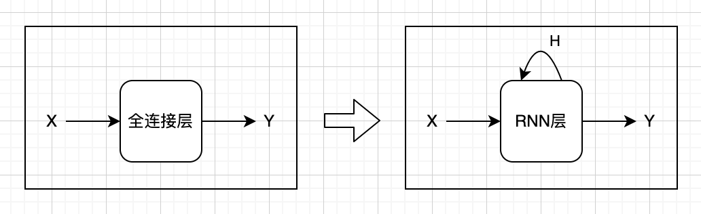


<div style="page-break-after: always;"></div>

## 第六章：词元和词嵌入

Token

Word Embedding


先介绍Token和Embeding？

BOW/Word2Vec


word2vec:
https://remykarem.github.io/word2vec-demo/


tiktoken:
https://github.com/openai/tiktoken
https://platform.openai.com/tokenizer


byte pair encoding (BPE), (widely used by GPT models)
WordPiece (used by BERT)


Word tokens
Subword tokens
Character tokens
Byte tokens


### 词元

编译原理，也要分词

（Token）


### 独热编码

One-hot


### 词袋模型

Bag-of-Words


### 词嵌入

TODO


### Word2Vec

TODO


### 本章小结

TODO


<div style="page-break-after: always;"></div>

## 第七章：长短期记忆网络

（TODO：这一章许多细节是AI补充的，需要统一润色）

在前一章中，我们系统地讨论了 RNN（循环神经网络），并介绍了基于字符的 Char-RNN，以及一个简化版的生成式模型（GenAI）。我们通过在迷你版的莎士比亚文集上训练模型，让它能够根据一段提示文本，自动续写出后续内容。从实现角度来看，这个过程并不复杂：模型只需要不断根据已有上下文预测下一个字符，就可以生成一段连贯的文本。不过，当我们进一步思考时，会发现：简单的 RNN 虽然结构清晰，但在实际应用中存在一些比较明显的缺点。

其中最经典的问题，就是长距离依赖难以建模。理论上，RNN 可以通过隐藏状态在时间上传递信息，但在实际训练中，随着序列变长，早期的信息往往会逐渐“遗忘”。例如，在一句很长的句子中，开头的信息很难有效影响到结尾的预测。

其次，信息的“保留与遗忘”是被动发生的。在标准 RNN 中，隐藏状态的更新完全依赖于一个固定的线性变换加激活函数，模型并没有显式的机制去决定“哪些信息应该保留，哪些应该丢弃”。这使得模型在处理复杂序列时显得不够灵活。

最后是梯度消失与梯度爆炸等问题。在训练过程中，RNN 需要通过时间反向传播（BPTT）来更新参数。当序列较长时，梯度在多次传递过程中可能会迅速变得极小（消失）或极大（爆炸），从而导致模型难以训练，甚至完全无法收敛。不过读者可以暂时先不管这一点，本书的最后会统一介绍反向传播机制，到时候我们再来重新讨论这些问题。

为了解决这些问题，研究者们在 RNN 的基础上提出了一系列改进模型。其中最重要、也最经典的两种结构，就是长短期记忆网络（LSTM）和门控循环单元（GRU）。这两种模型的核心思想可以用一个关键词来概括：门（Gate）。

接下来，我们先回顾 RNN，并引出“门”的基本思想。然后我们详细讨论 LSTM 的结构与计算过程，在此基础上介绍更加简洁的变体： GRU。通过本章的学习，你将理解：为什么简单 RNN 不够用、LSTM / GRU 是如何改进信息流动的，以及“记忆”和“遗忘”是如何被模型显式控制的。为后续更复杂的序列模型（例如 Transformer等）打下坚实的基础。


### Gate概念

在正式介绍 LSTM 和 GRU 之前，我们先来简要回顾一下前一章中学习的 RNN 层计算逻辑。这一步非常重要，因为我们将从中抽象出一个核心概念——**门**（Gate）。如果你对 RNN 的计算过程还不够熟悉，建议先回到第五章再复习一遍，再继续阅读本节内容。先回顾一下 RNN 层的基本计算公式：

$$
H' = σ(W_{xh}X + W_{hh}H + B_h) \\
Y = σ(W_{hy}H' + B_y)
$$

我们可以用一种更直观的方式来理解这两行公式：

- 第一行：根据当前输入 $X$ 和上一时刻的隐藏状态 $H$ ，计算新的隐藏状态 $H'$
- 第二行：根据新的隐藏状态 $H'$ ，计算当前输出 $Y$

换句话说，一个 RNN 层可以看作是：一个“带隐藏状态输入的增强版全连接层” + 一个标准的全连接层 的串联结构。从计算流程上看，RNN 层需要先“更新记忆”（隐藏状态），再“生成输出”。整个过程如下图所示：

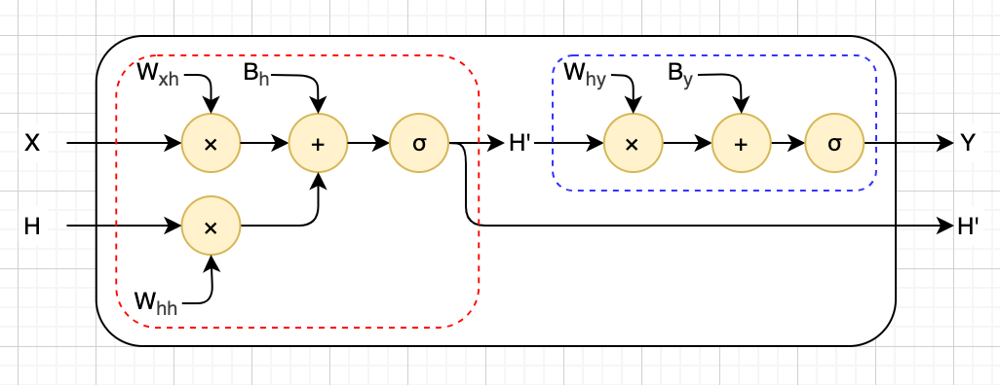

现在请特别关注上图左侧红框中的部分，也就是“根据输入和旧隐藏状态，计算新隐藏状态”的这一段逻辑。这一部分其实非常关键，因为：第一，它决定了“过去的信息如何影响现在”；第二，它是 RNN 能够处理序列的核心所在。如果我们把这部分计算抽象出来，并且暂时忽略内部的具体细节（权重、偏置、矩阵乘法等），就可以把它看作是一个“信息处理单元”。为了简化表示，我们可以将这个单元画成一个小梯形（或其他统一符号），表示它：接收输入 $X$ 和历史状态 $H$ ；输出新的状态 $H'$ 。我们把这个抽象出来的结构，称为：门。

这个名字并不是随便起的，它背后有一个非常重要的直觉：门的作用，是“控制信息是否通过”。虽然在标准 RNN 中，这个“门”还只是一个简单的线性变换 + 激活函数，但从抽象角度看，它已经具备了“筛选信息”的雏形：哪些信息被保留到新的隐藏状态中，哪些信息被削弱甚至丢弃。在后续的 LSTM 和 GRU 中，我们会看到：这个“门”会被进一步拆分成多个更加精细的控制结构（例如遗忘门、输入门等），从而实现对信息流动的精确控制。

在引入“门”的概念之后，我们可以对 RNN 的内部结构进行进一步简化：用一个“门”（梯形）表示隐藏状态更新过程；用一个“方块”表示标准全连接层（从隐藏状态到输出）这样，RNN 层的内部机制可以表示为如下形式：

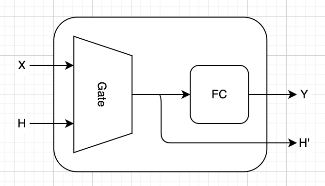

这种表示方式的好处在于：屏蔽了复杂的数学细节、突出了信息流动的路径，为后续理解 LSTM / GRU 打下基础。理解了这一抽象之后，我们会发现：所谓“门”，在实现上其实非常简单。本质上，它仍然是一个带有输入和隐藏状态的线性变换加激活函数。因此，我们完全可以用几行 Python 代码来实现一个“门”的创建与计算过程。为了便于对比，我们也把之前全连接层的实现一起列出。通过对比你会发现：Gate 和全连接层的区别，仅仅在于“是否引入了隐藏状态”这一额外输入。下面是对应的完整代码实现：

```python
# x => y
def new_fc_layer(w, b, af):
    return lambda x: af(w @ x + b)

# x, h => h'
def new_gate(w_xh, w_hh, b_h, af):
    return lambda x, h: af(w_xh @ x + w_hh @ h + b_h)
```


### 长短期记忆网络

了解了“门”的概念之后，我们就可以用它来搭建**长短期记忆网络**（Long Short-Term Memory，简称 LSTM）了。相比于普通的 RNN 层只使用一个“隐式的门”（也就是隐藏状态更新过程），LSTM 引入了多个显式的门结构，用来更精细地控制信息的流动。

具体来说，LSTM 一共包含三个“真正的门”，以及一个用于生成候选信息的结构（通常称为“细胞候选”或“候选记忆”）。此外，它还引入了一个新的状态变量：**细胞状态（Cell State）**，用大写字母 $C$ 表示。

在大多数资料中，这几个结构是严格区分的：三个门负责“控制”；候选记忆负责“生成内容”。不过从计算形式上看，它们都具有类似的结构（线性变换 + 激活函数）。为了便于理解，本书将它们统一抽象为“门”，并将生成候选记忆的模块称为“候选门（Candidate Gate）”。稍后我们会再强调它们之间的区别。下面是 LSTM 层的整体结构示意图（这里的 \* 表示按元素相乘，即哈达玛积）：

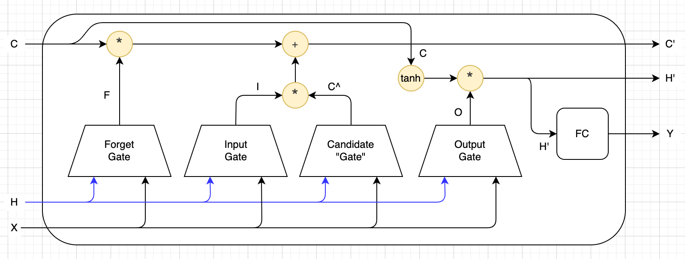

与标准 RNN 相比，LSTM 最关键的变化是：除了隐藏状态 $H$ ，还额外引入了细胞状态 $C$ 。这两个状态的分工可以简单理解为： $H$ ：短期状态（用于输出）； $C$ ：长期记忆（用于跨时间传递信息）。也正是因为这种“短期 + 长期”的结构，LSTM 才得名 **长短期记忆网络**。

沿用前一章的命名方式，LSTM 的完整计算过程如下（这里的 \* 表示按元素相乘，即哈达玛积）。而且注意，标准门使用的通常都是Sigmoid激活函数，而细胞门使用的是Tanh激活函数。

$$
\begin{aligned}
F &= σ(W_{fx}X + W_{fh}H + B_f) \\
I &= σ(W_{ix}X + W_{ih}H + B_i) \\
O &= σ(W_{ox}X + W_{oh}H + B_o) \\
\hat{C} &= tanh(W_{cx}X + W_{ch}H + B_c) \\
C' &= F * C + I * \hat{C} \\
H' &= O * tanh(C) \\
Y &= W_{hy}H' + B_y
\end{aligned}
$$

从上图中，以及公式，可以看到，LSTM 包含三个门和一个“细胞门”，它们的输入都是当前输入 $X$ 和上一时刻的隐藏状态 $H$ ：

- **遗忘门（Forget Gate）**：决定旧记忆 $C$ 中哪些内容需要保留，对应上面公式第一行。遗忘门输出的是一个0～1直接的权重向量。
- **输入门（Input Gate）**：决定当前新信息有多少被写入记忆，对应上面公式第二行
- **输出门（Output Gate）**：决定当前记忆中有多少被用于输出，对应上面公式第三行
- **候选“门”（Cell Gate）**：生成候选记忆内容（新的信息），对应上面公式地五行

上面的图，以及这个计算公式，太复杂了。所以我们需要把它拆解，一个门一个门来理解。我们先来看遗忘门，如下图所示：

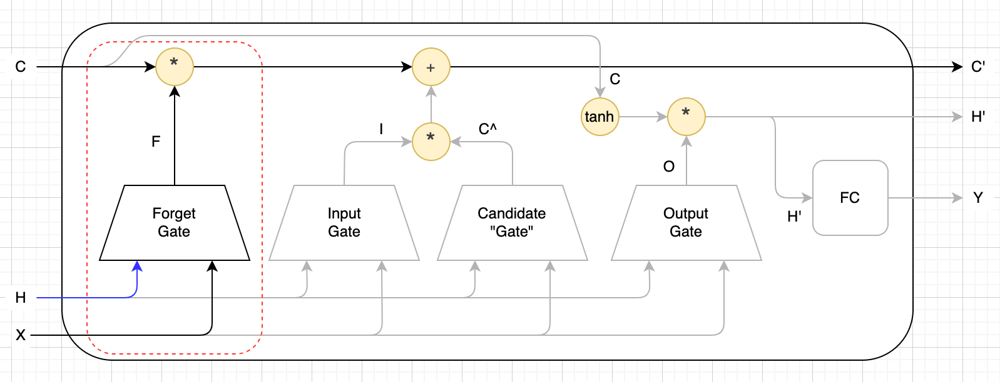

遗忘门，决定长期记忆C，哪些内容被慢慢忘记。遗忘门对应下面的计算公式：

$$
\begin{aligned}
F &= σ(W_{fx}X + W_{fh}H + B_f) \\
C' &= F * C + ... \\
\end{aligned}
$$

遗忘门的输出F，是一个0～1的权重矩阵。它和记忆C进行逐元素相乘，这是它能决定忘掉那些东西的核心。如果F的某个元素解决于0，则模型倾向于忘记对应状态。否则，如果接近于1，模型倾向于保留对应状态。

再来看输入门，如下图所示。

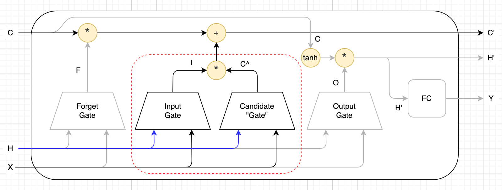

输入门对应下面公式：

$$
\begin{aligned}
I &= σ(W_{ix}X + W_{ih}H + B_i) \\
\hat{C} &= tanh(W_{cx}X + W_{ch}H + B_c) \\
C' &= ... + I * \hat{C} \\
\end{aligned}
$$

和遗忘门类似，输入门的输出I，也是一个0～1的权重矩阵。但是不同的是，我们还需要计算一个候选记忆 $\hat{C}$ 。注意，由于使用了Tanh激活函数，隐藏候选记忆的每个元素，是-1～1，这个很重要（补充说明）。候选记忆是当前时刻新生成的、待筛选的临时记忆。候选记忆和输入门输出I，逐元素相乘，就得到了需要补充的记忆。

$$
C' = F * C + I * \hat{C}
$$

然后，被遗忘门塞选后的记忆，加上被输入门塞选后的候选记忆，就得到了新的记忆状态。见上面的公式。

懂了遗忘门和输入门，输出门就相对好理解了。它基本上就是之前RNN层，只是略微改变了一下。差别在于，我们把记忆状态C也考虑了进来。输出门的计算逻辑如下图所示：

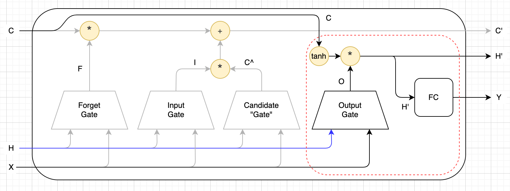

下面是输出门对应的公式：

$$
\begin{aligned}
O &= σ(W_{ox}X + W_{oh}H + B_o) \\
H' &= O * tanh(C) \\
Y &= W_{hy}H' + B_y
\end{aligned}
$$

和遗忘门、输入门一样，输出门的输出O，也是0～1的权重矩阵。和标准RNN模块不同，我们对C使用Tanh处理，然后和O逐元素相乘。输出门控制最终的短期记忆H，以及输出Y。


玩具代码：

```python
def new_lstm_layer(forget_gate, 
                   input_gate, 
                   output_gate, 
                   candidate_gate,
                   fc_layer):
    def layer(x, h, c):
        _f = forget_gate(x, h)
        _i = input_gate(x, h)
        _o = output_gate(x, h)
        _c = candidate_gate(x, h)
        new_c = _f * c + _i * _c
        new_t = _o * tanh(new_c)
        y = fc_layer(new_t)
        return y
    return layer
```


### 门控循环单元

LSTM 效果强、但结构重、计算贵；GRU 是 LSTM 的精简版，用更少参数、更快速度，换取接近的效果，在轻量化 / 低算力 / 短序列场景性价比碾压 LSTM。很多任务里，根本用不到这么复杂的三门机制。于是门控循环单元（Gated Recurrent Unit，简称GRU），对LSTM进行来简化。

GRU的主要简化：去掉细胞状态，重新回到单个隐藏状态H。三个门改成两个门。其中**重置门** （Reset Gate）：控制“过往历史要不要清空”。**更新门** （Update Gate）控制“旧记忆保留多少、新记忆写入多少”。下面是GRU的示意图：

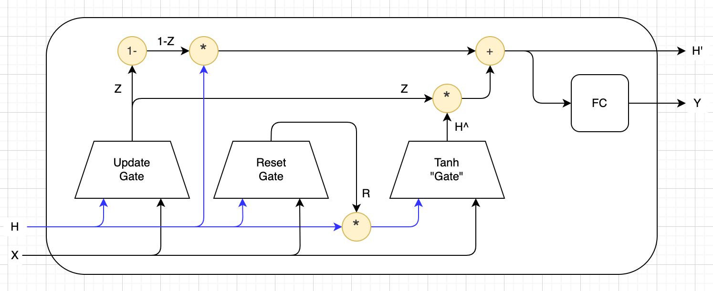

下面是GRU的计算公式。也可以看出来，的确是比LSTM简单了许多。

$$
\begin{aligned}
Z &= σ(W_{zx}X + W_{zh}H + B_z) \\
R I'm &= σ(W_{rx}X + W_{rh}H + B_r) \\
\hat{H} &= tanh(W_{hx}X + W_{hh}(R * H) +B_t)) \\
H' &= (1 - Z)*H + Z * \hat{H} \\
Y &= W_{hy}H' + B_y
\end{aligned}
$$

玩具代码：

```python
def new_gru_layer(update_gate, reset_gate, tanh_gate):
    def layer(x, h):
        _z = update_gate(x, h)
        _r = reset_gate(x, h)
        _h = tanh_gate(x, _r * h)
        new_h = (1 - _z) * h + _z * _h
        y = fc_layer(new_t)
        return y
    return layer
```


### 本章小结

TODO：


<div style="page-break-after: always;"></div>

## 第八章：编解码结构

Seq2Seq？？（要不要单独一章）

sequence-to-sequence problems/ Sequence Modelling problems 


### 序列问题

https://arxiv.org/abs/1406.1078

> Seq2Seq（问题）
> ↓
> Encoder–Decoder（解决方案）


sequence problem

one-to-one

one-to-many

many-to-one

many-to-many（Neural Machine Translation）


Sequence-to-Sequence (Seq2Seq) problems

> is a special class of Sequence Modelling Problems in which both, the input and the output is a sequence.
>
> Encoder-Decoder models were originally built to solve such Seq2Seq problems.


### 编解码结构

编码器模块=>解码器模块

Encoder/Decoder

encoder-decoder models

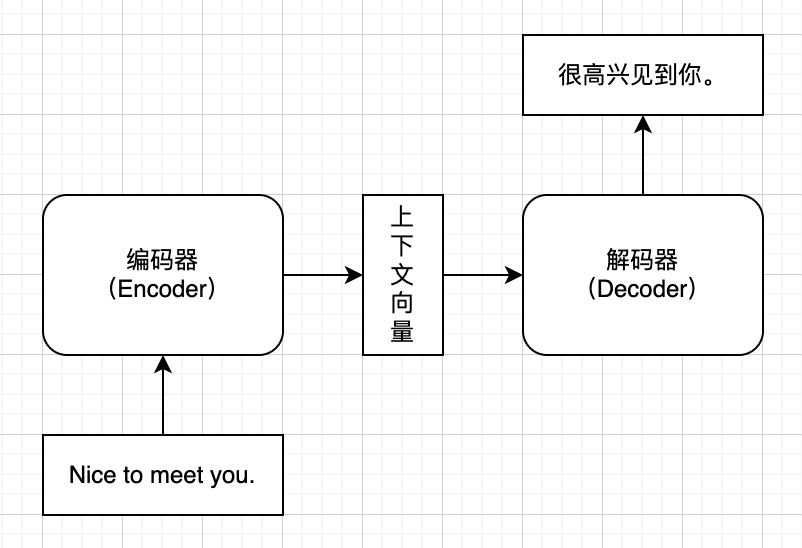

Encoder–Decoder（Seq2Seq）架构

Sequence to Sequence Learning with Neural Networks, 2014

https://arxiv.org/abs/1409.3215


Learning Phrase Representations using RNN Encoder–Decoder for Statistical Machine Translation


### 编码器

TODO


### 解码器

TODO


### 例子（翻译）

TODO


### 本章小结

TODO


<div style="page-break-after: always;"></div>

## 第九章：注意力机制

KQV是啥时候第一次出现的？

Attention，注意力机制，2015：

Neural Machine Translation by Jointly Learning to Align and Translate

https://arxiv.org/abs/1409.0473?utm_source=chatgpt.com


Effective Approaches to Attention-based Neural Machine Translation

https://arxiv.org/abs/1508.04025


Bahdanau attention（additive）

Luong attention（multiplicative）


### 注意力机制

TODO


### PyTorch实现

TODO


### 本章小结

TODO


<div style="page-break-after: always;"></div>

## 第十章：Transformer架构

自注意力机制，单独一章？

TODO

BERT：只用 Encoder（理解型模型）

GPT：只用 Decoder（生成型模型）


> 是的，**现在很火的大语言模型（LLM）底层就是深度学习**，而且是深度学习中的一种非常重要的模型结构：**Transformer**。


### Q、K、V

TODO：

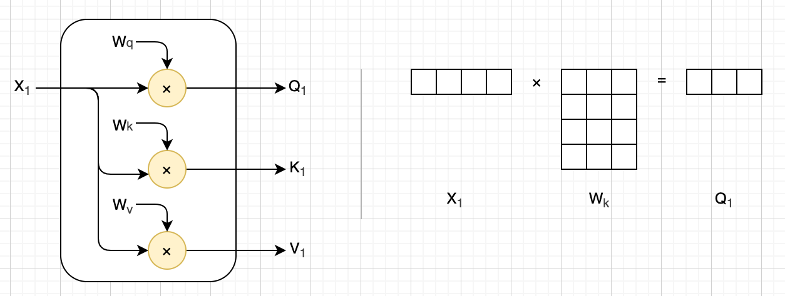

KQV计算：
$$
Q_1 = X_1 \times W_q \\
K_1 = X_1 \times W_k \\
V_1 = X_1 \times W_v
$$

矩阵：

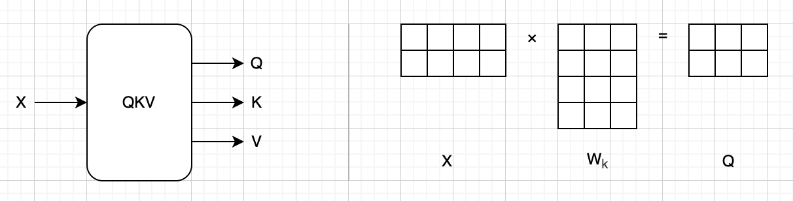

用矩阵表示：
$$
Q = X \times W_q \\
K = X \times W_k \\
V = X \times W_v
$$

Python代码：

```python
def calc_qkv(w_q, w_k, w_v, x):
    q = x @ w_q
    k = x @ w_k
    v = x @ w_v
    return q, k, v
```


### 分数

介绍

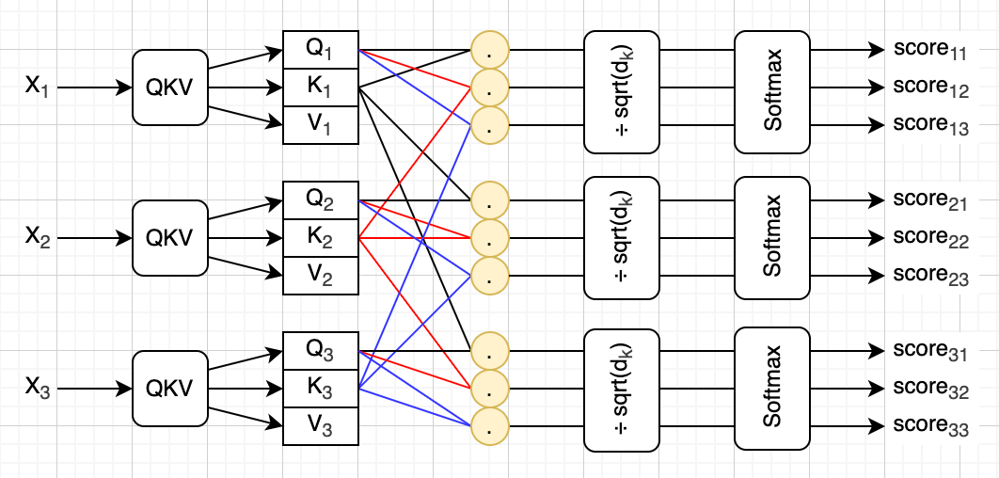


分数：
$$
score_{ij} = softmax(\frac{Q_i \cdot K_j}{\sqrt{d_k}})
$$
用矩阵表示：
$$
Score = softmax(\frac{Q \times K^T}{\sqrt{d_k}})
$$

Python代码：

```python
def calc_score(q, k, v, sqrt_d_k):
    score = q @ k.T / sqrt_d_k
    return softmax(score)
```


### 自注意力

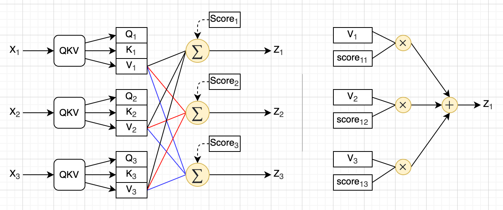

V加权求和：
$$
Z_i = \sum_{j=1}^{n}{score_{ij} \times V_j}
$$

用矩阵表示：
$$
Z = softmax(\frac{Q \times K^T}{\sqrt{d_k}}) \times V
$$

代码：

```python
def calc_self_attention(w_q, w_k, w_v, sqrt_d_k, x):
    q, k, v = calc_qkv(w_q, w_k, w_v, x)
    score = calc_score(q, k, v, sqrt_d_k)
    return score @ v
```


### 多头自注意力

多个W矩阵，计算出多个Z

拼接Z

乘上另外一个W

玩具代码：

```python
def new_multi_head(heads, w_o):
    def multi_head(x):
        z_list = [head(x) for head in heads]
        z = np.concatenate(z_list, axis=1)
        return z @ w_o
    return multi_head
```


### 编码器

TODO


### 解码器

TODO


### 整体架构

TODO


### PyTorch实现

TODO


### 本章小结

TODO


<div style="page-break-after: always;"></div>

## 第十一章：GPT和BERT

TODO


### 本章小结

TODO

<div style="page-break-after: always;"></div>

## 第十二章：Diffusion模型

TODO

GAN

U-Net（主流）


### 本章小结

TODO


<div style="page-break-after: always;"></div>

## 第十三章：反向传播

反向传播

训练

学习过程，学习率，学习系数

梯度，梯度下降，梯度消失

损失函数

cross-entropy loss

overfitting

Dropout

Stochastic Gradient Descent，Adam

overfits


### 本章小结

TODO

<div style="page-break-after: always;"></div>

## 第十四章：应用

RAG

Agent

MCP

Skills


### 本章小结

TODO


<div style="page-break-after: always;"></div>

## 后记

TODO

全连接层，和感知机，是一回事。

前馈神经网络，和多层感知机，是一回事。


<div style="page-break-after: always;"></div>

## 附录A：科学家列表

| 英文名              | 中文名             | 年代       |      |
| ------------------- | ------------------ | ---------- | ---- |
| Warren McCulloch    | 沃伦・麦卡洛克     | 1898～1969 |      |
| Walter Pitts        | 沃尔特・皮茨       | 1923～1969 |      |
| John McCarthy       | 约翰・麦卡锡       | 1927～2011 |      |
| Marvin Minsky       | 马文・明斯基       | 1927～2016 |      |
| Claude Shannon      | 克劳德・香农       | 1916～2001 |      |
| Nathaniel Rochester | 纳撒尼尔・罗切斯特 | 1919～2001 |      |
| Frank Rosenblatt    | 弗兰克・罗森布拉特 | 1928～1971 |      |
| Seymour Papert      | 西摩・派珀特       | 1928～2016 |      |
| David Rumelhart     | 大卫・鲁梅尔哈特   | 1942～2011 |      |
| Geoffrey Hinton     | 杰弗里・辛顿       | 1947～     |      |
| Ronald J. Williams  | 罗纳德・威廉姆斯   | 1945～2024 |      |
| Yann LeCun          | 杨立昆             | 1960～     |      |
|                     |                    |            |      |
|                     |                    |            |      |
|                     |                    |            |      |
|                     |                    |            |      |
|                     |                    |            |      |
|                     |                    |            |      |
|                     |                    |            |      |

<div style="page-break-after: always;"></div>

## 附录B：论文列表

| 年份 | 论文                                                         | 作者     |             |
| ---- | ------------------------------------------------------------ | -------- | ----------- |
| 1943 | A Logical Calculus of the Ideas Immanent in Nervous Activity |          | McP神经元   |
| 1958 | The Perceptron: A Probabilistic Model for Information Storage and Organization in the Brain |          | 感知机      |
| 1969 | Perceptrons: An Introduction to Computational Geometry       |          |             |
| 1986 | [Learning representations by back-propagating errors](https://www.nature.com/articles/323533a0) |          | 反向传播    |
| 1989 | [Backpropagation Applied to Handwritten Zip Code Recognition](http://yann.lecun.com/exdb/publis/pdf/lecun-89e.pdf) | 杨立昆等 | CNN         |
| 1997 | Long Short-Term Memory                                       |          | LSTM        |
| 1998 | [GradientBased Learning Applied to Document Recognition](http://yann.lecun.com/exdb/publis/pdf/lecun-01a.pdf) | 杨立昆等 | LeNet-5     |
| 2012 | ImageNet Classification with Deep Convolutional Neural Networks |          | ImageNet    |
| 2013 | [Efficient Estimation of Word Representations in Vector Space](https://arxiv.org/abs/1301.3781) | Google   | Word2Vec    |
| 2013 | [Distributed Representations of Words and Phrases and their Compositionality](https://arxiv.org/abs/1310.4546) | Google   | Word2Vec    |
| 2014 | [Learning Phrase Representations using RNN Encoder-Decoder for Statistical Machine Translation](https://arxiv.org/abs/1406.1078) |          | GRU         |
| 2014 | [Sequence to Sequence Learning with Neural Networks](https://arxiv.org/abs/1409.3215) | Google   | Seq2Seq     |
| 2014 | [Neural Machine Translation by Jointly Learning to Align and Translate](https://arxiv.org/abs/1409.0473) |          | Attention   |
| 2015 | [Effective Approaches to Attention-based Neural Machine Translation](https://arxiv.org/abs/1508.04025) |          | Attention   |
| 2017 | [Attention Is All You Need](https://arxiv.org/abs/1706.03762) | Google   | Transformer |
| 2018 | [Improving Language Understanding by Generative Pre-Training](https://cdn.openai.com/research-covers/language-unsupervised/language_understanding_paper.pdf) | OpenAI   | GPT-1       |
| 2018 | [BERT: Pre-training of Deep Bidirectional Transformers for Language Understanding](https://arxiv.org/abs/1810.04805) | Google   | BERT        |
|      |                                                              |          |             |
|      |                                                              |          |             |

<div style="page-break-after: always;"></div>

## 附录C：可视化工具列表

| 网址                                      | 简述                     | 章节 |
| ----------------------------------------- | ------------------------ | ---- |
| https://perceptrondemo.com/               | 可视化感知机介绍         |      |
| https://alexlenail.me/NN-SVG/index.html   | 自动生成神经网络结构图   |      |
| https://adamharley.com/nn_vis/mlp/2d.html | 可视化多层感知机2D版本   |      |
| https://adamharley.com/nn_vis/mlp/3d.html | 可视化多层感知机3D版本   |      |
| https://setosa.io/ev/image-kernels/       | 可视化卷积核介绍         |      |
| https://poloclub.github.io/cnn-explainer/ | 可视化卷积神经网络介绍   |      |
| https://adamharley.com/nn_vis/cnn/2d.html | 可视化卷积神经网络2D版本 |      |
| https://adamharley.com/nn_vis/cnn/3d.html | 可视化卷积神经网络3D版本 |      |
|                                           |                          |      |

<div style="page-break-after: always;"></div>

## 附录D：术语列表

| 英文                         | 英文缩写/简称 | 中文         | 章节 |
| ---------------------------- | ------------- | ------------ | ---- |
| Agent                        |               | 智能体       |      |
| Skills                       |               | 技能         |      |
| Large Language Model         | LLM           | 大语言模型   |      |
| Deep Learning                | DL            | 深度学习     |      |
| Artificial Intelligence      | AI            | 人工智能     |      |
| Artificial Neural Network    | ANN           | 人工神经网络 |      |
| Artificial Neuron            |               | 人工神经元   |      |
| Function                     |               | 函数         |      |
| Parameter                    |               | 参数         |      |
| Bias                         |               | 偏置         |      |
| Linear Transformation        |               | 线性变换     |      |
| Activation Function          |               | 激活函数     |      |
| Sigmoid                      |               | Sigmoid      |      |
| Hyperbolic Tangent           | Tanh          | 双曲正切函数 |      |
| Rectified Linear Unit        | ReLU          | 修正线性单元 |      |
| Weight                       |               | 权重         |      |
| Vector                       |               | 向量         |      |
| Central Processing Unit      | CPU           | 中央处理器   |      |
| Graphics Processing Unit     | GPU           | 图形处理器   |      |
| McCulloch–Pitts Neuron       | MCP Neuron    | MCP神经元    |      |
| Scalar                       |               | 标量         |      |
| Matrix                       |               | 矩阵         |      |
| Perceptron                   |               | 感知机       |      |
| Linear Separability          |               | 线性可分性   |      |
| Machine Learning             | ML            | 机器学习     |      |
| Supervised Learning          |               | 监督学习     |      |
| Unsupervised Learning        |               | 无监督学习   |      |
| Classification Tasks         |               | 分类任务     |      |
| Regression Tasks             |               | 回归任务     |      |
| Connectionism                |               | 连接主义     |      |
| Symbolism                    |               | 符号主义     |      |
| Behaviorism                  |               | 行为主义     |      |
| Convolutional Neural Network | CNN           | 卷积神经网络 |      |
| Recurrent Neural Network     | RNN           | 循环神经网络 |      |
| Deep Neural Network          | DNN           | 深度神经网络 |      |
| Feedforward Neural Network   | FNN           | 前馈神经网络 |      |
| Multi-Layer Perceptron       | MLP           | 多层感知机   |      |
| Logits                       |               | 原始分数     |      |
| Architecture                 |               | 架构         |      |
| Hyperparameter               |               | 超参数       |      |
| Convolution Kernel           | Kernel        | 卷积核       |      |
| Kernel Size                  |               | 卷积核大小   |      |
|                              |               |              |      |
|                              |               |              |      |
|                              |               |              |      |
|                              |               |              |      |
|                              |               |              |      |
|                              |               |              |      |
|                              |               |              |      |

