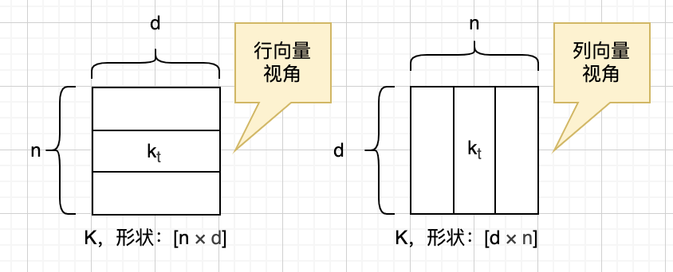
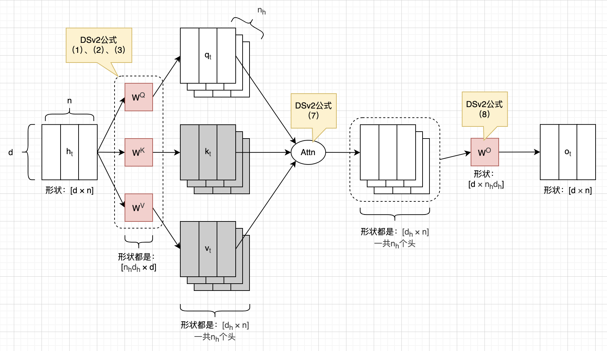
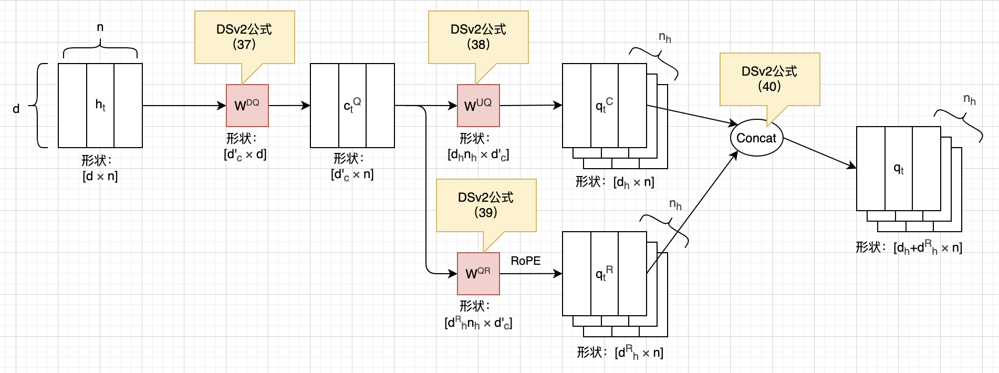
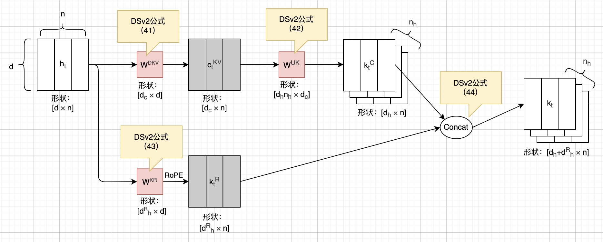
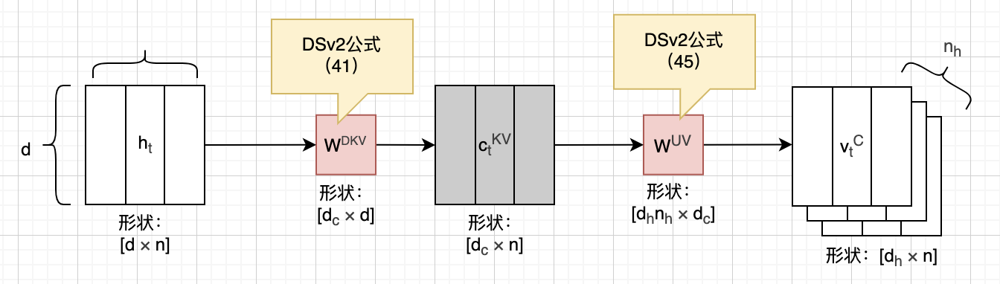
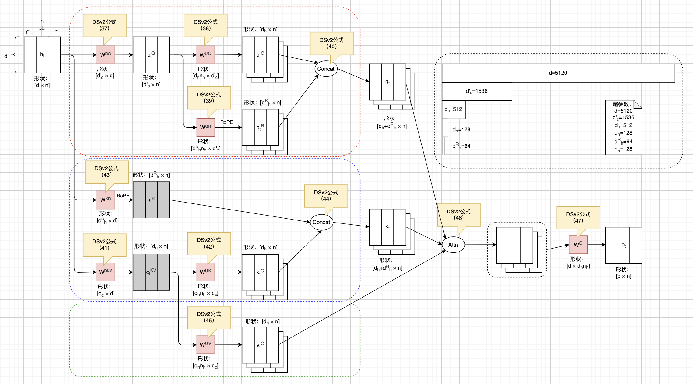
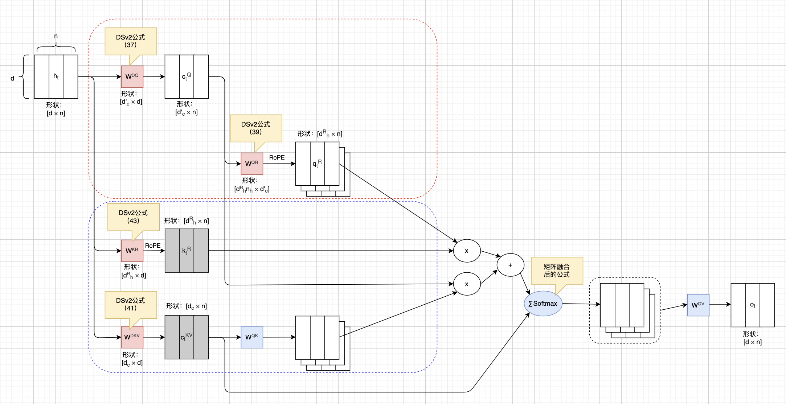

# 图解DeepSeek-V2 MLA公式

多头潜在注意力机制（Multi-Head Latent Attention，简称MLA），作为标准注意力机制的一种优化形式，是DeepSeek在V2版本引入的，并且沿用至V3版本。不过DeepSeek-V4并没有用MLA，而是换成了混合注意力机制，交错使用HCA和CSA注意力机制。

如果你读过DeepSeek-V2或者V3的论文，试图理解MLA，但是被公式给搞迷糊了，那么这篇文章可能就比较适合你。为了更好的理解MLA的数学公式，我画了很多图，这些图可能对你也有帮助。如果你对DeepSeek-V4的HCA和CSA注意力机制感兴趣，也可以看看我写的另外一篇文章。

本文没有用AI润色，文字都是自己敲的，图都是自己画的，原汁原味。不过我使用AI检查了错别字，还有一些我不确定的地方，也问了AI。一些AI回答的片段，我以引用的形式贴到了文中，一眼就能看出来。由于我还在慢慢学习中，本文可能难免有错误和疏漏，如果我发现的话，会在下一版改进。

## 标准注意力机制

本文假设读者已经对标准的Transformer架构和注意力机制非常熟悉了，如果还不熟悉的话，可以先熟读2017年的那篇经典论文：《Attention Is All You Need》。下面是关于注意力机制最经典的公式，也就是这篇论文里的公式（1）：

$$
\mathrm{Attention}(Q, K, V) = \mathrm{softmax}\left( \frac{QK^\top}{\sqrt{d_k}} \right) V \tag{1}
$$

上面是单头注意力公式，下面则是论文里给出的多头注意力公式：

$$
\begin{align*}
\mathrm{MultiHead}(Q, K, V) &= \mathrm{Concat}(\mathrm{head}_1, \dots, \mathrm{head}_h) W^O \\
\text{where}\quad \mathrm{head}_i &= \mathrm{Attention}\big(Q W_i^Q,\ K W_i^K,\ V W_i^V\big)
\end{align*}
$$

关于这两个公式，本文就不展开解释了，但是有一点必须说明：公式里的`Q`、`K`、`V`，都是矩阵，并且是由行向量`q`、`k`、`v`构成。但是在DeepSeek的MLA公式里，`q`、`k`、`v`都是列向量，这就导致了MLA的注意力计算公式，和标准写法相比，产生了差异：`QK`乘，转置在`Q`上；`QW`乘等，`W`在前。

我们可以很容易证明，这两种写法在计算上是完全等价的。为了区分，我们暂时给MLA公式里的`Q`、`K`、`V`等都加上撇号。以`QK`乘为例：

$$
\begin{aligned}
Q' &= Q^\top \\
K' &= K^\top \\
Q'^\top K' &= (Q^\top)^\top K^\top = Q K^\top \\
\end{aligned} \tag{a}
$$

我们用`d`来表示词嵌入维度，用`n`来表示输入序列长度，用`t`来表示输入的索引（编号），下面这幅图展示了两种视角下，矩阵`K`在形状上的差异。本文后面的图基本都是列向量视角。

## Preliminaries: Standard Multi-Head Attention

DeepSeek-V3基本是直接沿用了V2引入的MLA，数学公式完全一致。不过DeepSeek-V2论文里有更多的铺垫，介绍得更详细，因此本文主要以DeepSeek-V2论文为主来介绍MLA。

在DeepSeek-V2论文的2.1.1小节里，作者总结了标准的注意力机制。其中公式（1）、（2）、（3）描述了如何通过某个输入向量，得到对应的`q`、`k`和`v`向量：

$$
\begin{align}
\mathbf{q}_t &= W^Q \mathbf{h}_t, \tag{1} \\
\mathbf{k}_t &= W^K \mathbf{h}_t, \tag{2} \\
\mathbf{v}_t &= W^V \mathbf{h}_t, \tag{3}
\end{align}
$$

公式（4）、（5）、（6）只是描述了这些向量是如何切分，然后分别给多个头去用的。其中 $n_h$ 表示注意力的头数。

$$
\begin{align}
\left[\mathbf{q}_{t,1};\mathbf{q}_{t,2};\dots;\mathbf{q}_{t,n_h}\right] &= \mathbf{q}_t, \tag{4} \\
\left[\mathbf{k}_{t,1};\mathbf{k}_{t,2};\dots;\mathbf{k}_{t,n_h}\right] &= \mathbf{k}_t, \tag{5} \\
\left[\mathbf{v}_{t,1};\mathbf{v}_{t,2};\dots;\mathbf{v}_{t,n_h}\right] &= \mathbf{v}_t, \tag{6} \\
\end{align}
$$

最后公式（7）和（8）描述了注意力计算，以及最后的投影过程：

$$
\begin{align}
\mathbf{o}_{t,i} &= \sum_{j=1}^{t} \mathrm{Softmax}_j\left( \frac{\mathbf{q}_{t,i}^\top \mathbf{k}_{j,i}}{\sqrt{d_h}} \right) \mathbf{v}_{j,i}, \tag{7} \\
\mathbf{u}_t &= W^O \left[\mathbf{o}_{t,1};\mathbf{o}_{t,2};\dots;\mathbf{o}_{t,n_h}\right], \tag{8}
\end{align}
$$

如前所述，本文假设读者对于标准注意力机制已经非常熟悉了，所以这里不会展开介绍上面这些公式。唯一要注意的地方，就是上面这些公式里，所有向量都是列向量。这一点在前面也解释过了。我们把公式（1）到（8）都画在一起，如下图所示：

注意，在上图里，我们把K和V画成了灰色，表示它们需要被放进KVCache里。如果词嵌入维度很大，且输入序列也很长，那么KVCache就会成为瓶颈，这就是MLA要解决的问题。

## Full Formulas of MLA

DeepSeek-V2论文的2.1.2和2.1.3小节详细介绍了MLA的KV压缩和解耦RoPE，不过为了便于画图，这里我们使用论文附录C给出的完整MLA公式。我们先来看Q的部分，对应公式（37）到（40）：

$$
\begin{align}
\mathbf{c}_t^Q &= W^{DQ} \mathbf{h}_t, \tag{37} \\
\left[\mathbf{q}_{t,1}^C;\mathbf{q}_{t,2}^C;\dots;\mathbf{q}_{t,n_h}^C\right] &= \mathbf{q}_t^C = W^{UQ} \mathbf{c}_t^Q, \tag{38} \\
\left[\mathbf{q}_{t,1}^R;\mathbf{q}_{t,2}^R;\dots;\mathbf{q}_{t,n_h}^R\right] &= \mathbf{q}_t^R = \mathrm{RoPE}\big(W^{QR} \mathbf{c}_t^Q\big), \tag{39} \\
\mathbf{q}_{t,i} &= \left[\mathbf{q}_{t,i}^C;\mathbf{q}_{t,i}^R\right], \tag{40} \\
\end{align}
$$

公式（37）先给输入降维；然后公式（38）再升维、公式（39）应用RoPE编码；最后公式（40）按头进行拼接。我们把上面的计算，画成下面这个图：

再来看K的部分，对应论文里的公式（41）到（44）：

$$
\begin{align}
\mathbf{c}_t^{KV} &= W^{DKV} \mathbf{h}_t, \tag{41} \\
\left[\mathbf{k}_{t,1}^C;\mathbf{k}_{t,2}^C;\dots;\mathbf{k}_{t,n_h}^C\right] &= \mathbf{k}_t^C = W^{UK} \mathbf{c}_t^{KV}, \tag{42} \\
\mathbf{k}_t^R &= \mathrm{RoPE}\big(W^{KR} \mathbf{h}_t\big), \tag{43} \\
\mathbf{k}_{t,i} &= \left[\mathbf{k}_{t,i}^C;\mathbf{k}_t^R\right], \tag{44} \\
\end{align}
$$

这个和Q的计算基本是一样的，只是 $k_t^R$ 的计算有所不同，且是多个头共用的。我们把这些计算，画成下面这个图：

注意，上图这两个灰色矩阵，就是最后要放进KVCache里的内容。论文里说， $d_c \ll d_h n_h$ ， $d^R_h$ 更小，于是就起到了压缩KVCache的效果。我们再来看V的计算，对应公式（45）：

$$
\begin{align}
\left[\mathbf{v}_{t,1}^C;\mathbf{v}_{t,2}^C;\dots;\mathbf{v}_{t,n_h}^C\right] &= \mathbf{v}_t^C = W^{UV} \mathbf{c}_t^{KV}, \tag{45} \\
\end{align}
$$

看懂了Q和K的计算，V的计算就不是很难理解了。我们把这个计算，画成下面这个图：

最后是注意力计算，以及最后的投影，对应公式（46）和（47）：

$$
\begin{align}
\mathbf{o}_{t,i} &= \sum_{j=1}^{t} \mathrm{Softmax}_j\left( \frac{\mathbf{q}_{t,i}^\top \mathbf{k}_{j,i}}{\sqrt{d_h + d_h^R}} \right) \mathbf{v}_{j,i}^C, \tag{46} \\
\mathbf{u}_t &= W^O \left[\mathbf{o}_{t,1};\mathbf{o}_{t,2};\dots;\mathbf{o}_{t,n_h}\right], \tag{47}
\end{align}
$$

这两个公式基本就是标准注意力机制，没啥可说的。我们把Q、K、V的计算，以及最后的注意力计算，全部画在一起，如下图所示：

如前所述，KVCache是大大缩小了，可是计算量仿佛大了不少。MLA的巧妙之处在于，在推理时，我们不需要真的把中间这些矩阵都算出来。利用矩阵乘法的性质，我们可以把 $W^{UK}$ 融合进 $W^Q$ ，把 $W^{UV}$ 融合进 $W^O$ ，这就大大简化了计算量。不过这一点论文里并没有详细介绍，我们在下一小节讨论一下。

## 权重吸收融合

我们先来看 $q^\top k$ 这一项，根据矩阵乘法规则，可以把它展开成下面这样：

$$
\begin{aligned}
\mathbf{q}_{t,i}^{\top} \mathbf{k}_{j,i} &= \left[ \mathbf{q}_{t,i}^{C} ; \mathbf{q}_{t,i}^{R} \right]^{\top} \left[ \mathbf{k}_{j,i}^{C} ; \mathbf{k}_{j,i}^{R} \right] \\
&= \left( \mathbf{q}_{t,i}^{C} \right)^{\top} \mathbf{k}_{j,i}^{C} + \left( \mathbf{q}_{t,i}^{R} \right)^{\top} \mathbf{k}_{j}^{R}
\end{aligned} \tag{b}
$$

我们再把加号左边这一项继续展开，可以写成下面这样。于是， $W^{UK}$ 就可以被 $W^{UQ}$ 吸收，变成 $W^{QK}$ 。

$$
\begin{aligned}
\left(\mathbf{q}_{t,i}^{C}\right)^{\top} \mathbf{k}_{j,i}^{C} &= \left(W^{UQ} \mathbf{c}_t^Q\right)^{\top} \left(W^{UK} \mathbf{c}_j^{KV}\right) \\
&= \left(\mathbf{c}_t^Q\right)^{\top} \cdot \underbrace{\left(W^{UQ}\right)^{\top} W^{UK}}_{W^{QK}} \cdot \mathbf{c}_j^{KV}
\end{aligned} \tag{c}
$$

 但是由于叠加了RoPE编码，等号右边是不可融合的：

$$
\begin{aligned}
\mathbf{q}_{t,i}^{R} &= \operatorname{RoPE}\left(W^{QR} \mathbf{c}_t^Q\right), \\
\mathbf{k}_{j}^{R} &= \operatorname{RoPE}\left(W^{KR} \mathbf{h}_j\right),
\end{aligned} \tag{d}
$$

吸收融合后，计算变成了下面这个样子：

$$
\begin{aligned}
\mathbf{q}_{t,i}^{\top} \mathbf{k}_{j,i} &= \left(\mathbf{c}_t^Q\right)^{\top} W^{QK} \mathbf{c}_j^{KV} \\
&\quad + \left( \mathbf{q}_{t,i}^{R} \right)^{\top} \mathbf{k}_{j}^{R}
\end{aligned} \tag{e}
$$

我们再来看最后两个公式。先合并在一起写，然后展开`v`那一项，并利用矩阵乘法规则进行变换，最后就变成了下面这个样子：

$$
\begin{aligned}
\mathbf{u}_t
&= W^{O} \left[\mathbf{o}_{t,1};\dots;\mathbf{o}_{t,n_h}\right] \\
&= \sum_{i=1}^{n_h} W^{O}_i\, \mathbf{o}_{t,i} \\
&= \sum_{i=1}^{n_h} W^{O}_i
\sum_{j=1}^{t}
\operatorname{Softmax}_{j}^{(i)}(\cdot)\,
[W^{UV}]_i\,
\mathbf{c}_{j}^{KV} \\
&= \sum_{i=1}^{n_h}
\underbrace{W^{O}_i\,[W^{UV}]_i}_{[W^{OV}]_i}
\left(
\sum_{j=1}^{t}
\operatorname{Softmax}_{j}^{(i)}(\cdot)\,
\mathbf{c}_{j}^{KV}
\right).
\end{aligned} \tag{f}
$$

可以看到，对每个头 $i$ ，矩阵 $[W^{UV}]_i$ 被融合进了对应的 $W^O_i$ 里，得到 $[W^{OV}]_i$ 。经过这两个矩阵融合，计算被大幅简化了。我们把这个简化后的计算过程画出来，如下图所示。其中融合后的矩阵，用蓝色表示。

不难看出来，由于权重融合，我们大幅简化了标准注意力之前的计算。然而，我们也因此无法再套用标准的注意力计算公式了。一些优化措施，比如FlashAttention，也不能直接用了。

> Q：关于MLA我有个疑问，它还能直接套用标准attention计算吗？ 是不是只能自己写了？
>
> AI：核心结论分两层讲：**朴素实现能套标准 Attention，但性能爆炸差；推理优化（权重吸收 absorb 模式）完全不能直接套标准 FlashAttention，必须自定义算子。**
>

## 总结

本文解释了DeepSeek MLA相关的数学公式。标准的注意力机制，KVCache需要的空间和模型词嵌入维度成正比。如果词嵌入维度很大，且输入序列又特别长，那么KVCache就成了瓶颈。通过降维（低秩压缩），MLA大幅压缩了KVCache。通过权重矩阵融合，又大幅减少了推理时需要的计算量。代价就是无法套用标准注意力机制了，必须自己写算子。

## 主要参考资料

* 论文：[Attention Is All You Need](https://arxiv.org/abs/1706.03762)
* 论文：[DeepSeek-V3 Technical Report](https://arxiv.org/abs/2412.19437)
* 论文：[DeepSeek-V2: A Strong, Economical, and Efficient Mixture-of-Experts Language Model](https://arxiv.org/abs/2405.04434)

