# 图解DeepSeek-V4(Pro)推理公式

主要参考资料：

* 论文：[Attention Is All You Need](https://arxiv.org/abs/1706.03762)
* 论文：[DeepSeek-V4: Towards Highly Efficient Million-Token Context Intelligence](https://huggingface.co/deepseek-ai/DeepSeek-V4-Pro/blob/main/DeepSeek_V4.pdf)
* 论文：[DeepSeek-V3.2: Pushing the Frontier of Open Large Language Models](https://arxiv.org/abs/2512.02556)
* 配置：[Hugging Face config.json](https://huggingface.co/deepseek-ai/DeepSeek-V4-Pro/blob/main/config.json)

和所有论文一样，DeepSeek-V4的论文（对于普通人来说）挺难读的。DeepSeek-V4论文里包含了大量信息，但最难懂的，还是数学公式。本文将站在“推理”的角度，用大量示意图来帮助读者理解DeepSeek-V4论文中的相关公式。

## Transformer视角

本文假设读者已经对标准的Transformer架构和注意力机制非常熟悉了，如果还不熟悉的话，可以先熟读2017年的那篇经典论文。这里我们先假设DeepSeek-V4用的就是标准的Transformer架构（Decoder-only），而且先省略大部分细节（后文会展开），它的推理过程看起来大概是这样：

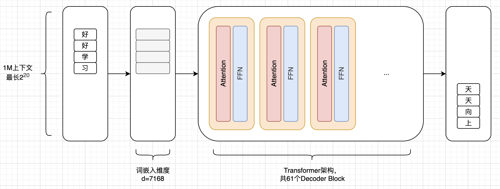

上图中有几个重要的信息：

* DeepSeek-V4支持**1M**上下文，也就是说输入+输出，最多可以达到100万个token。

* 词嵌入和隐藏向量维度都是**7168**。假如输入序列长度是n，那么一个[n × 7168]的矩阵会流经每层，最终变成输出。

* DeepSeek-V4一共堆叠了**61层**Decoder Block。

## 标准注意力机制

这里回顾一下标准的注意力公式，也就是论文《Attention Is All You Need》中的公式（1）：

$$
\begin{aligned}
\mathrm{Attention}(Q, K, V) = \mathrm{softmax}\left( \frac{QK^\top}{\sqrt{d_k}} \right) V
\end{aligned} \tag{1}
$$

我们知道，LLM的推理过程可以分为两个阶段：Prefill和Decode。由于Prefill阶段属于计算密集型，Decode阶段属于存储密集型，所以这两个阶段往往会被调度到不同硬件上去执行，这个就叫做PD分离。

> AI：LLM 推理流程分为 Prefill 和 Decode 两个阶段：Prefill 会并行一次性处理完整输入文本，属于计算密集型负载（Compute-bound）；Decode 依托 KV Cache 逐 Token 串行生成内容，瓶颈在于 GPU 显存带宽，工程场景中常简称为存储密集型负载（Memory-bound）。
>
> 针对两类负载资源需求完全不同的特性，业界提出 PD 分离（Prefill-Decode Disaggregation）推理架构优化方案：把 Prefill、Decode 调度至相互独立的硬件资源池（既可以是单台服务器内划分不同 GPU，也支持跨集群物理隔离部署），为两类任务分别匹配适配自身负载特征的专用硬件，以此避免两类任务互相抢占资源、产生性能干扰。

### Prefill

在本文的示意图里，我们用矩形来表示**向量**或**矩阵**（如下图Q、K、V）。由于很难通过图形形状把向量或者矩阵的形状准确表达出来，所以一般都会以文字形式说明它们的形状。我们用紫色方块来表示可学习的**权重矩阵**，如下图四个W矩阵。我们用圆形来表示**标量**（圆形也用于表示计算，但是很容易区分），如下图 $QK^T$ 矩阵里的元素。

我们用圆形或椭圆来表示**计算**（如下图`softmax`），如果某个计算对应某论文中某公式，我们也会用黄色框框标识出来。为了简化示意图，我们经常会省略矩阵乘法，直接用权重矩阵本身来表示。基于这些约定，我们把上面公式（1）的计算过程大致画出来，重点展示Prefill阶段，如下图所示：

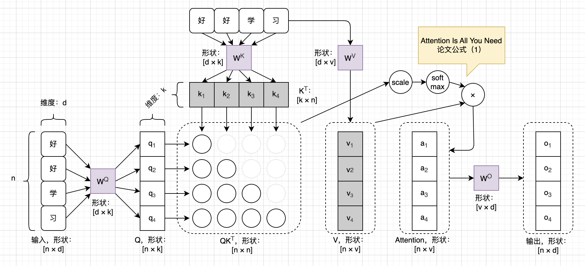

上图 $QK^T$ 矩阵中，有些元素是灰色的，表示加了因果掩码，这个细节这里就不展开解释了。不难看出，Q、K、V的计算、 $QK^T$ 的计算、注意力计算，以及最后输出的计算，大部分都是可以在GPU上大规模并行处理的矩阵乘法运算，所以Prefill阶段的确是**计算密集型**的，瓶颈是GPU算力。

### Decode

我们再来看Decode阶段。假如输入“好好学习”预测出的下一个字是“天”，我们会把“好好学习天”当作输入，再次预测下一个字。问题是前面4个字的K和V，完全是可以复用的，如果输入序列很长，那么重新计算就很浪费。所以我们可以把前面算好的K和V都缓存起来，下次直接拿出来用，这个就是所谓的KVCache机制。在上面的图里，我们把K和V画成了深灰色，表示它们可以被缓存起来，重复利用。基于KVCache机制，我们把Decode阶段的注意力计算也画出来，如下图所示：

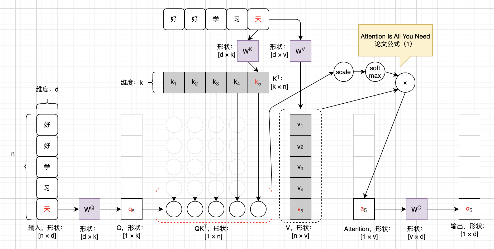

由于KVCache的使用，Decode阶段直接变成了**存储访问密集型**，稍后会详细说明。于是，Decode阶段瓶颈不再是GPU算力，而是GPU显存（HBM）。

### Multi-Head Attention

以上描述了单个头的注意力公式，多个头的注意力，拼在一起就行，如下面公式所示：

$$
\begin{aligned}
\mathrm{MultiHead}(Q, K, V) &= \mathrm{Concat}(\mathrm{head}_1,\, \dots,\, \mathrm{head}_h) W^O \\
\mathrm{where}\quad \mathrm{head}_i &= \mathrm{Attention}\left(Q W_i^Q,\, K W_i^K,\, V W_i^V\right)
\end{aligned} \tag{2}
$$

> 🤔原论文这个公式有点让人迷糊。实际上，上面公式的第二行，Q、K、V应该换成H才更合理：
>
> $\mathrm{head}_i = \mathrm{Attention}\left(H W_i^Q,\, H W_i^K,\, H W_i^V\right)$

我们把上面这个多头计算公式画成图，如下所示：

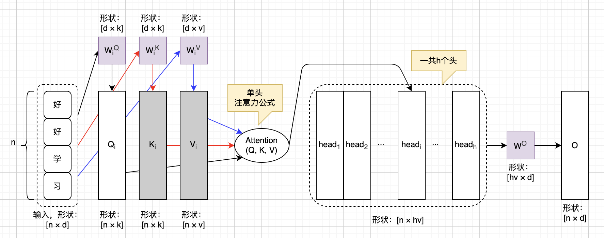

我们假设每个浮点数占用`f`个字节，Transformer架构一共有`l`个decoder层。那么根据上面这个图，我们可以粗略估计，KVCache占用的空间大约是：

$$
\begin{aligned}
((n × k) + (n × v)) × h × l × f
\end{aligned} \tag{a}
$$

### 参数&超参数

这里总结一下标准注意力机制公式中出现的参数和超参数。先看参数（可学习权重矩阵）：

| 权重矩阵 | 形状       | 说明              |
| -------- | ---------- | ----------------- |
| $W^Q$    | $[d × k]$  | 每层一套，每套h个 |
| $W^K$    | $[d × k]$  | 每层一套，每套h个 |
| $W^V$    | $[d × v]$  | 每层一套，每套h个 |
| $W^O$    | $[hv × d]$ | 每层一套，每套1个 |

超参数：

| 超参数 | 原始Transformer取值 | DeepSeek-V4(Pro)取值 | 说明         |
| ------ | ------------------- | -------------------- | ------------ |
| d      | 512                 | 7168                 | 隐藏状态维度 |
| h      | 8                   | 128                  | 注意力头数   |
| k      | 64                  |                      | d➗h          |
| v      | 64                  |                      | d➗h          |
| 层数   |                     | 61                   |              |

对于DeepSeek-V4 Pro，我们可以做一个粗略的估算。我们取n=1M，k=v=d➗h=56，f=1（fp8）。把这些值带入上面的公式（a）可得：

$$
\begin{aligned}
CacheSize &=((n × k) + (n × v)) × h × l × f \\
&= ((1M × 56) + (1M × 56)) × 128 × 61 × 1 \\
&= 1M × 56 × 2 × 128 × 61 \\
&= 874496M
\end{aligned} \tag{b}
$$

大约是854G（这里可能估计的不准？），这显然太大了。所以DeepSeek-V4要做的优化之一，就是尽可能让KVCache缩小，后文会详细介绍。

## DeepSeekV4整体结构

现在我们切换到DeepSeek-V4视角，看看它的整体推理过程，如下图所示：

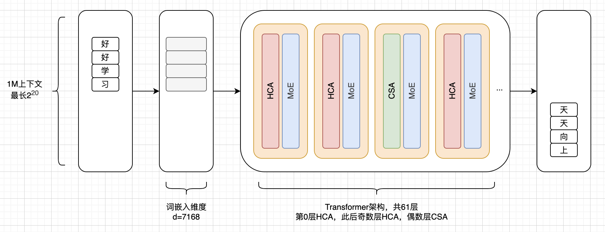

和最开始的Transformer视角相比，主要是两个细节发生了变化：

* DeepSeek-V4把标准的注意力机制换成了它自己的**混合注意力**机制，前两层是HCA，此后CSA和HCA交替使用。

* DeepSeek-V4也没有使用标准的FFN，而是使用了MoE。

这两点后文会详细说明。

## CSA（Compressed Sparse Attention）

先来看CSA，下面是DeepSeek-V4论文中给出的架构图。这个架构图还是比较抽象的，所以我把它展开一步一步介绍。顺便说一下，CSA其实用了DeepSeek-V3.2提出的DSA。不过，看懂了CSA就没必要再去专门看DSA了。

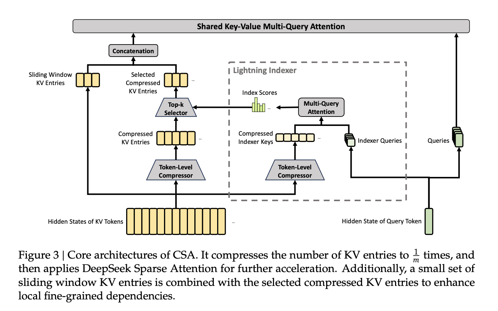

### Compressed Key-Value Entries

第一步，对输入序列进行降维，得到4个序列。这是论文中公式（9）和（10）描述的计算：

$$
\begin{aligned}
C^a &= H \cdot W^{a\mathrm{KV}}, & C^b &= H \cdot W^{b\mathrm{KV}}, \\
Z^a &= H \cdot W^{a\mathrm{Z}}, & Z^b &= H \cdot W^{b\mathrm{Z}},
\end{aligned} \tag{9, 10}
$$

这四个降维操作如下图所示。C、Z、W这些矩阵的形状，都可以从下图看到，后面也会以表格形式总结。

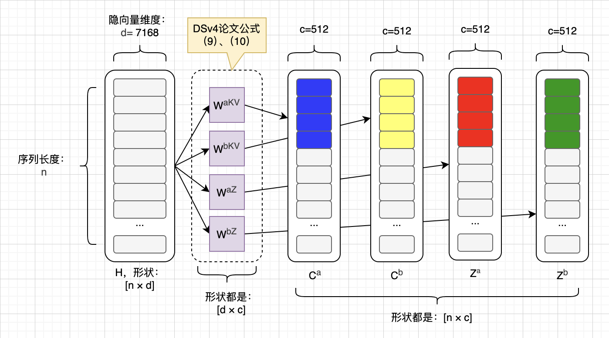

第二步，压缩。利用上面计算出的4个序列，计算出一个压缩序列，长度是原来的 $\frac{1}{m}$。其中`m`就是CSA的压缩率，论文中的取值是4。这一步对应论文中的公式（11）和（12）：

$$
\begin{aligned}
\left[S^a_{mi:m(i+1)-1}; S^b_{m(i-1):mi-1}\right] &= \text{Softmax}_\text{row}\left(\left[Z^a_{mi:m(i+1)-1} + B^a, Z^b_{m(i-1):mi-1} + B^b\right]\right), \\
C_i^\text{Comp} &= \sum_{j=mi}^{m(i+1)-1} S_j^a \odot C_j^a + \sum_{j=m(i-1)}^{mi-1} S_j^b \odot C_j^b,
\end{aligned} \tag{11, 12}
$$

压缩是分组计算的，每一组m个。为了便于理解，我们只取其中的一组（m个），把这两个计算展开。哈达吗积（⊙）和累加画出来太繁琐了，所以我们就用“压缩”来表示。于是上面的两个公式就画成了下面这样：

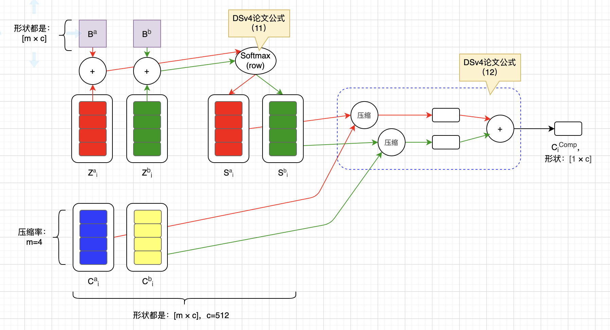

最终的效果，就是输入被降维和压缩了。维度从7168降到了512，只有原来的1/14。序列长度每4个一组压缩，只有原来的1/4。后面马上要介绍的“闪电索引”，也用了同样的套路，只是维度降的更低，降到了128，只有输入的1/56。这两个过程可以用下图表示：

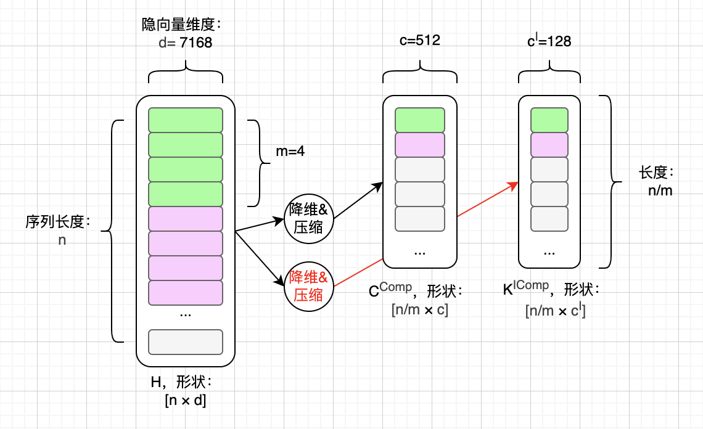

### Lightning Indexer for Sparse Selection

现在来看“闪电索引”，先看论文中的公式（13）和（14）：

$$
\begin{aligned}
\mathbf{c}_t^Q &= \mathbf{h}_t \cdot W^{DQ}, \\
\left[\mathbf{q}_{t,1}^I;\, \mathbf{q}_{t,2}^I;\, \dots;\, \mathbf{q}_{t,n_h^I}^I\right] &= \mathbf{q}_t^I = \mathbf{c}_t^Q \cdot W^{IUQ},
\end{aligned} \tag{13, 14}
$$

这个公式是针对某一个输入（ $h_t$ ）来计算的，具体过程如下图蓝框所示。公式中出现的权重矩阵、输入输出和中间结果的形状，都画在图里了。（公式18可以暂时忽略，等会再回来看）

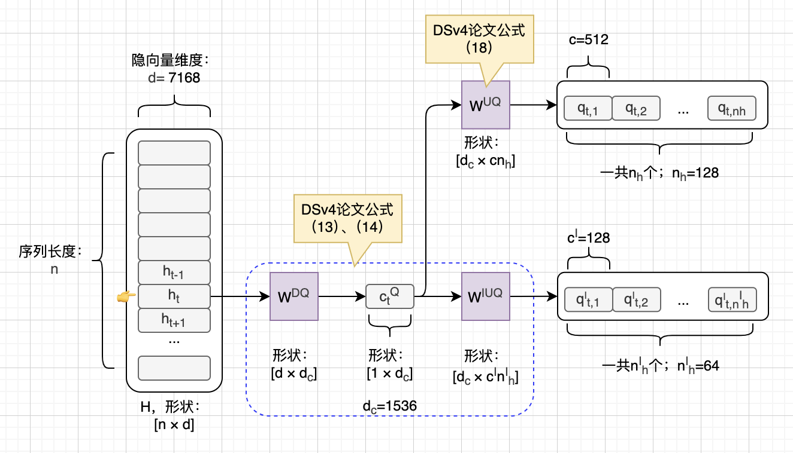

和注意力机制类似，闪电索引也是多头的，一共有 $n^I_h$ 个头（论文里这个值是64）。某个输入经过上面这套公式计算之后，就给每个闪电索引头算出来一个 $q^I$ 向量，维度是 $c^I$。再来看论文中的公式（15）和（16）：

$$
\begin{aligned}
\left[\mathbf{w}_{t,1}^I;\, \mathbf{w}_{t,2}^I;\, \dots;\, \mathbf{w}_{t,n_h^I}^I\right] = \mathbf{w}_t^I &= \mathbf{h}_t \cdot W^w, \\
I_{t,s} &= \sum_{h=1}^{n_h^I} w_{t,h}^I \cdot \mathrm{ReLU}\left( \mathbf{q}_{t,h}^I \cdot K_s^{\text{IComp}} \right),
\end{aligned} \tag{15, 16}
$$

其中公式（15）也是针对某个输入来计算的，结果是 $n^I_h$ 个权重值，如下图所示：

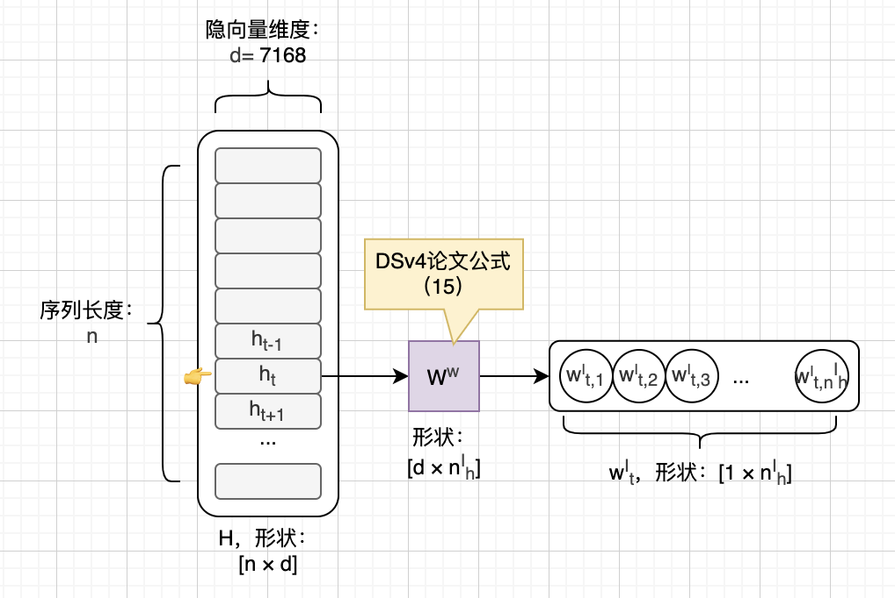

公式（16）也是针对某个输入计算的，索引也用`t`表示。对于某个输入，需要一个 $q_t$ 向量，这个是公式（13）和（14）算出来的。另外，还需要一个 $K^{IComp}$ 矩阵，索引用`s`表示。这个矩阵的计算过程和前一小节压缩KV的计算基本是一样的，可以去看上一小节的最后一幅图。于是，公式（16）的整体计算细节如下图所示：

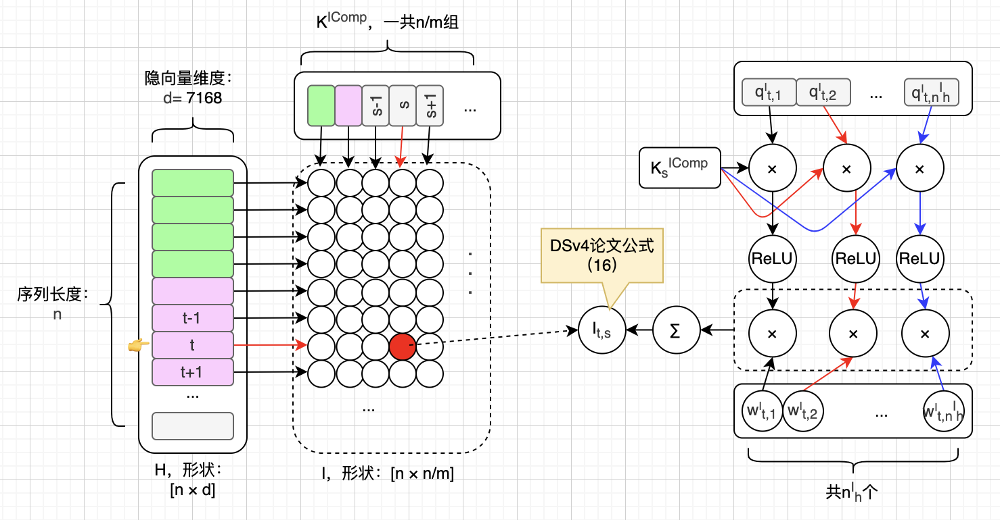

公式（16）看着特别复杂，但如果你忽略各种细节，其实就是针对每一个输入 $h_t$，算出一个打分向量 $I_t$，维度是n/m。有了打分之后，就可以用TopK算法去筛选稀疏KV了，也就是论文公式（17）：

$$
\begin{aligned}
C_t^{\text{SprsComp}} = \left\{ C_s^{\text{Comp}} \mid I_{t,s}\in\mathrm{TopK}(I_{t,:}) \right\}
\end{aligned} \tag{17}
$$

最后的效果就是，输入（形状是[n × d]）经过降维和压缩，得到了 $C^{Comp}$，形状是[n/m × c]。对于第`t`个输入，有一个打分向量 $I_t$，用它进行TopK筛选，得到了 $C_t^{SprsComp}$，形状是[K × c]。整个过程如下图所示：

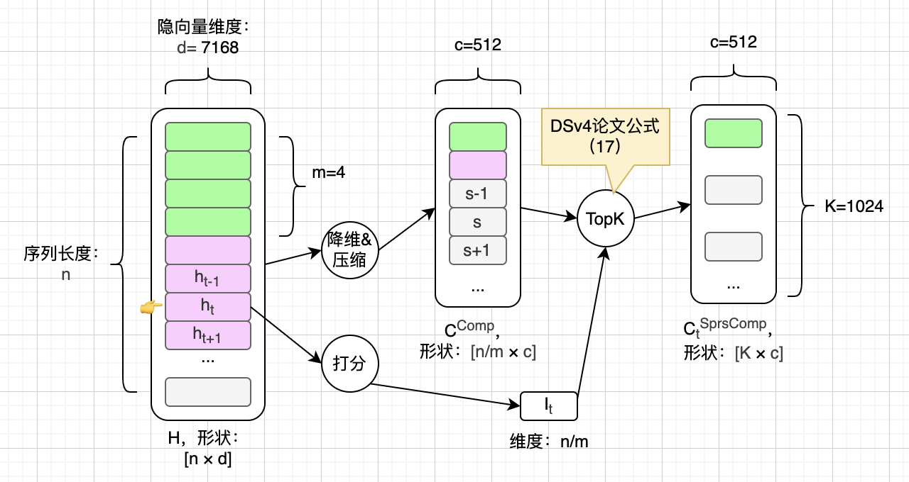

在DeepSeek-V4论文里，d=7168，c=512，m=4，K=1024。于是，不管输入序列有多长，对于某个输入，这么一大套算下来，最后得到的就是一个[1024 × 512]的矩阵。而 $C^{Comp}$ 矩阵，就是要放在KVCache里的数据。

### Shared Key-Value MQA

CSA最后使用的，也不是原始的注意力机制，而是[MQA](https://arxiv.org/abs/1911.02150)。和原始注意力机制相比，MQA最大的变化就是，所有的注意力头共享一组KV。前面计算的，其实是K和V。对于某个输入，我们还需要计算 $q$ 向量，这个对应论文公式（18）：

$$
\begin{aligned}
\left[\mathbf{q}_{t,1};\, \mathbf{q}_{t,2};\, \dots;\, \mathbf{q}_{t,n_h}\right] = \mathbf{q}_t = \mathbf{c}_t^Q \cdot W^{UQ},
\end{aligned} \tag{18}
$$

这个 $q$ 向量，和公式（14）的 $q^I$ 向量，在计算过程上基本是一样的，所以我把它们画在了一起。这里重新贴一下这个图：

现在，所有东西都准备好了，利用这些数据进行标准注意力计算就可以了。这个对应论文公式（19）：

$$
\begin{aligned}
o_{t,i} = \mathrm{CoreAttn}\left( \mathrm{query}=\mathbf{q}_{t,i},\, \mathrm{key}=C_t^{\mathrm{SprsComp}},\, \mathrm{value}=C_t^{\mathrm{SprsComp}} \right),
\end{aligned} \tag{19}
$$

上面公式里的`t`是输入的索引，`i`是注意力头的索引。由于使用的是MQA注意力机制，所以只有Q带着`i`下标。总之，最重要的是，不管输入序列多长，对于某个输入来说，最后进入注意力计算的，就是这个经过降维&压缩&筛选后的稀疏KV，长度固定为K=1024。到目前为止的整个过程如下图所示：

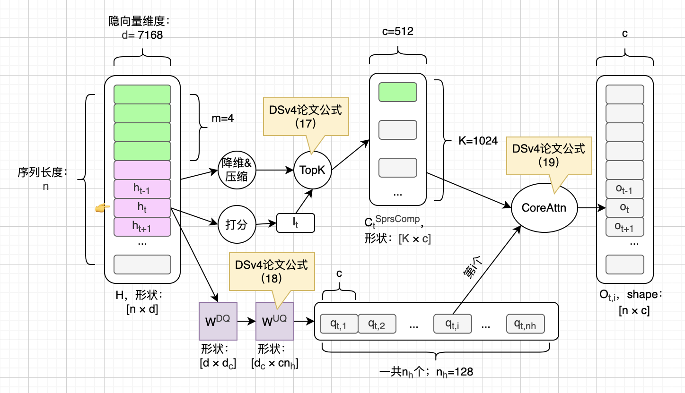

### Grouped Output Projection

上面这个图显示的是某个注意力头的计算，对于多个头（一共 $n_h=128$ 个），我们需要把这些 $o_{t, i}$ 都拼接起来，然后做一次线性变化，得到最终输出，如下图所示：

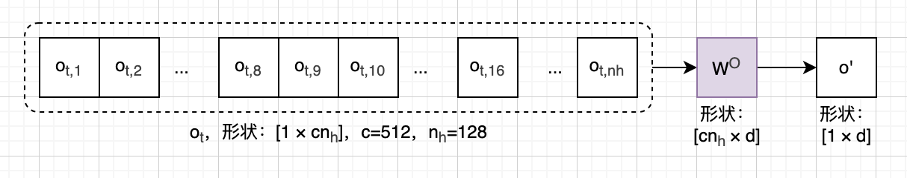

在DeepSeek-V4论文里，c=512， $n_h$ = 128，所以拼接起来的 $o_t$ 向量，维度是512×128=64K。这个计算量太大了，所以DeepSeek采取了一个“分组两级计算”的优化。

首先，把 $n_h$ 个向量分成g组（论文里取值16）。也就是说，分成16组，每组8个。然后把每个组，投影成一个向量，维度是 $d_g$ （论文里取值1024）。最后把这些中间的向量拼起来，再做一次变换，得到最终需要的输出。这个计算过程如下图所示：

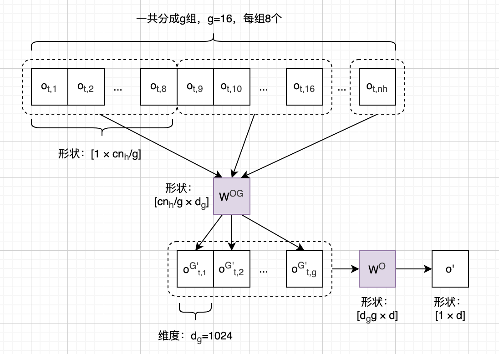

这里做一个简单的比较。我们知道：若矩阵A的形状是[a,b]，矩阵B的形状是[b,c]，那么矩阵乘 AB 计算量大约为 a⋅b⋅c。于是，优化前的计算量是：

$$
\begin{aligned}
c × n_h × d = 512 × 128 × 7168 = 448M 
\end{aligned} \tag{c}
$$

优化后，中间步骤计算量只是原来的1/7：

$$
\begin{aligned}
c × \frac{n_h}{g} × d_g × g = 512 × 128 × 1024 = 64M
\end{aligned} \tag{c}
$$

最后一步的计算量是原来的1/4：

$$
\begin{aligned}
g × d_g × d = 16 × 1024 × 7168 = 112M
\end{aligned} \tag{e}
$$

最终，优化后整体计算量大概是优化前的40%。

### 参数&超参数

总结一下CSA涉及到的参数和超参。下面是可学习权重矩阵和偏置：

| 权重/偏置 | 形状                     | 公式   |
| --------- | ------------------------ | ------ |
| $W^{aKV}$ | $[d × c]$                | （9）  |
| $W^{bKV}$ | $[d × c]$                | （9）  |
| $W^{aZ}$  | $[d × c]$                | （10） |
| $W^{bZ}$  | $[d × c]$                | （10） |
| $B^a$     | $[m × c]$                | （11） |
| $B^b$     | $[m × c]$                | （11） |
| $W^{DQ}$  | $[d × d_c]$              | （13） |
| $W^{IDQ}$ | $[d_c × c^I n^I_h]$      | （14） |
| $W^w$     | $[d × n^I_h]$            | （15） |
| $W^{UQ}$  | $[d_c × c n_h]$          | （18） |
| $W^{OG}$  | $[\frac{cn_h}{g} × d_g]$ |        |
| $W^{O}$   | $[d_g] × d$              |        |

超参数：

| 参数    | 取值 | 说明                        |
| ------- | ---- | --------------------------- |
| $d$     | 7168 | 隐藏向量维度                |
| $c$     | 512  | 注意力头维度                |
| $m$     | 4    | CSA压缩率                   |
| $d_c$   | 1536 | query compression dimension |
| $c^I$   | 128  | indexer head dimension      |
| $n_h^I$ | 64   | indexer query heads         |
| $n_h$   | 128  | query heads                 |
| $d_g$   | 1024 | 中间输出维度                |

## HCA（Heavily Compressed Attention）

现在来看HCA，下面是论文里给出的架构图。这个图同样也是比较抽象，所以我们还是需要展开来细看。相比CSA，HCA要简单一些（没有筛选逻辑）。如果你已经理解了CSA，那么HCA就比较好懂了，所以这一小节可能写的没那么详细。

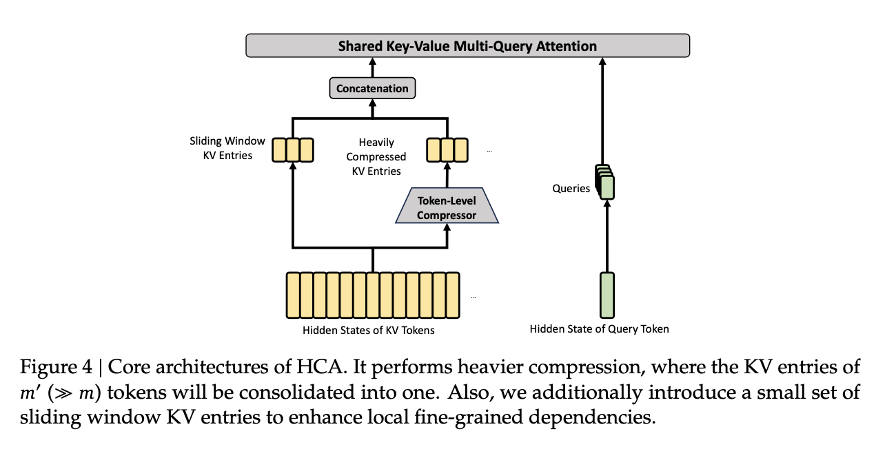

### Compressed Key-Value Entries

和CSA一样，HCA也是先对隐藏状态H进行降维，这一步对应论文中的公式（20）和（21）：

$$
\begin{aligned}
C &= H \cdot W^{\text{KV}},\\
Z &= H \cdot W^{Z},
\end{aligned} \tag{20, 21}
$$

这两个公式的计算如下图所示。其中两个W，以及C和Z的形状，都画在了图里。

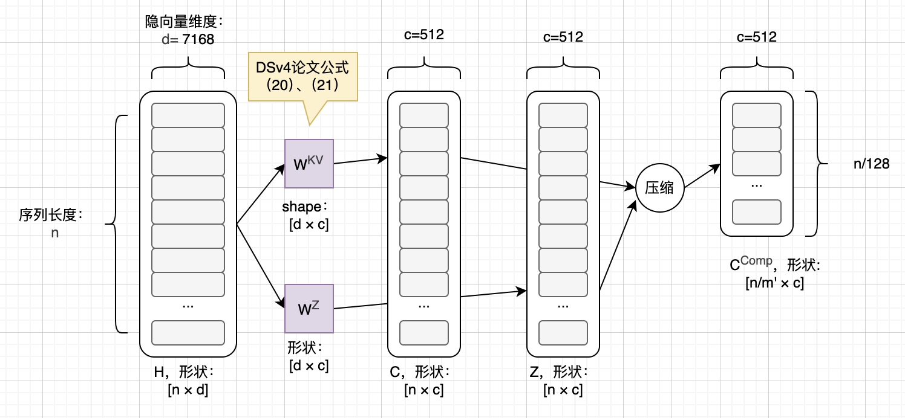

降维之后是压缩。我们展开来看一下上图中的“压缩”操作，它对应论文中的公式（22）和（23）：

$$
\begin{aligned}
S_{m'i:m'(i+1)-1} &= \mathrm{Softmax_{row}}\left(Z_{m'i:m'(i+1)-1} + B\right), \\
C_i^{\mathrm{Comp}} &= \sum_{j=m'i}^{m'(i+1)-1} S_j \odot C_j.
\end{aligned} \tag{22, 23}
$$

这两个公式都是针对一组输入来计算的，每一组有m'（论文取值128）个向量。首先，一组Z和偏置B，算出一组S（公式22）。然后，一组S和一组C，算出一个 $C^{Comp}$ 向量（公式23）。这两个计算过程如下图所示：

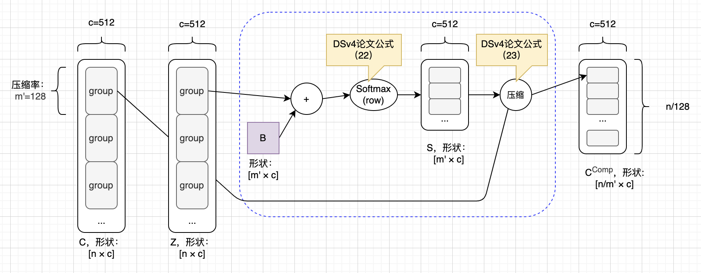

总之，输入序列的形状是[n × d]，其中d=7168。计算出的 $C^{Comp}$ 的形状是[n/m' × c]，其中m'=128，c=512。可以看到，长度缩小为原来的1/128，降维缩小为原来的1/14，效果还是挺明显的。

### Shared Key-Value MQA

HCA没有打分和筛选环境，所以直接来到MQA计算。对于某个输入，我们还是需要计算 $q$ 向量，这个对应论文公式（24）和（25）：

$$
\begin{aligned}
\mathbf{c}_t^Q &= \mathbf{h}_t \cdot W^{DQ}, \\
\left[\mathbf{q}_{t,1}; \mathbf{q}_{t,2}; \dots; \mathbf{q}_{t,n_h}\right] &= \mathbf{q}_t = \mathbf{c}_t^Q \cdot W^{UQ},
\end{aligned} \tag{24, 25}
$$

这个计算我们也很熟悉了，如下图所示。两个W矩阵的形状，中间状态的形状等，也是直接画在图里了。

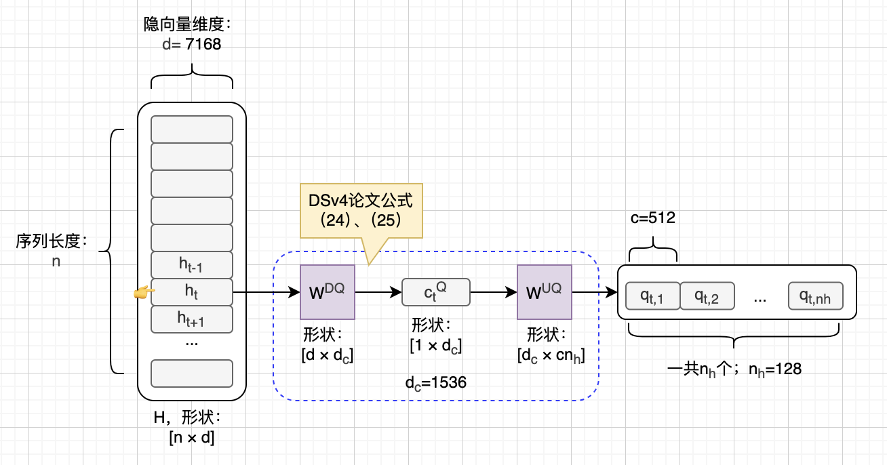

现在Q、K、V都准备好了，可以带入标准注意力公式进行计算了。这一步对应论文里的公式（26）：

$$
\begin{aligned}
\mathbf{o}_{t,i} = \mathrm{CoreAttn}\left(\mathrm{query} = \mathbf{q}_{t,i},\, \mathrm{key} = \mathbf{C}^{\mathrm{Comp}},\, \mathrm{value} = \mathbf{C}^{\mathrm{Comp}}\right),
\end{aligned} \tag{26}
$$

上面公式里的`t`是输入的索引，`i`是注意力头的索引。总之，对于某个输入来说，最后进入注意力计算的，就是这个经过降维&压缩后的KV，长度只是原来的1/128。现在我们把前面这些步骤都画在一起，如下图所示：

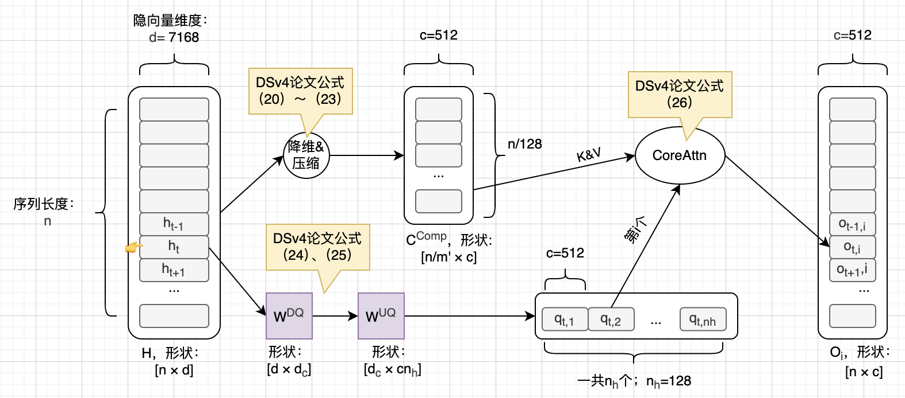

### Grouped Output Projection

和CSA一样，HCA这里也是有一个分组二级投影的优化的。这个优化和CSA是完全一样的，连参数设置也一样，这里就不再重复介绍其细节了。

### 超参数&参数

总结一下HCA涉及到的参数和超参。下面是可学习权重矩阵和偏置：

| 参数     | 取值            | 说明   |
| -------- | --------------- | ------ |
| $W^{KV}$ | $[d × c]$       | （20） |
| $W^Z$    | $[d × c]$       | （21） |
| $B$      | $[m' × c]$      | （22） |
| $W^{DQ}$ | $[d × d_c]$     | （13） |
| $W^{UQ}$ | $[d_c × c n_h]$ | （13） |

超参数：

| 参数  | 取值 | 说明                        |
| ----- | ---- | --------------------------- |
| $d$   | 7168 | 隐藏向量维度                |
| $c$   | 512  | 注意力头维度                |
| $m'$  | 128  | HCA压缩率                   |
| $d_c$ | 1536 | query compression dimension |
| $n_h$ | 128  | query heads                 |
| $d_g$ | 1024 | 中间输出维度                |

## MoE

和DeepSeek-V3一样。

## mHC

TODO

