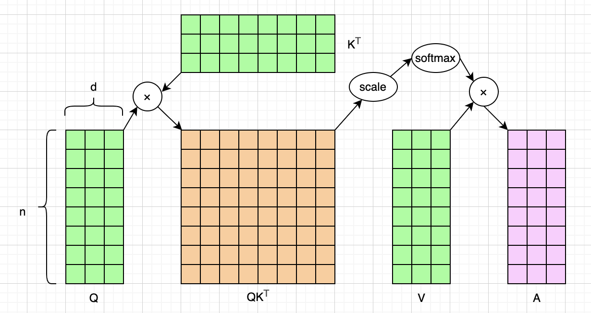
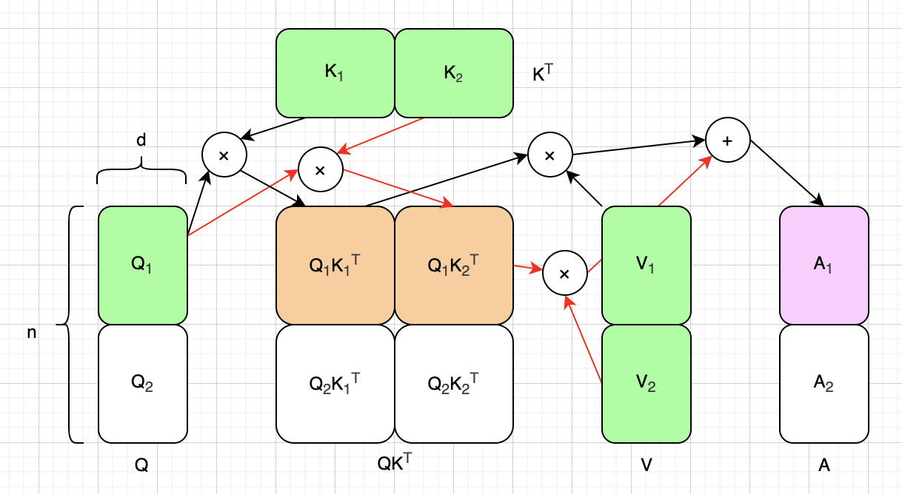
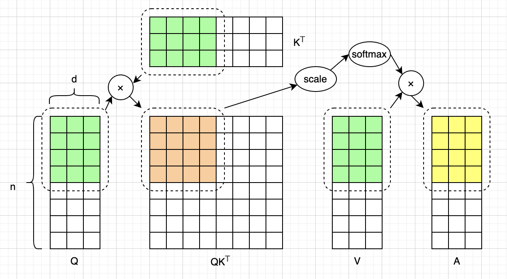
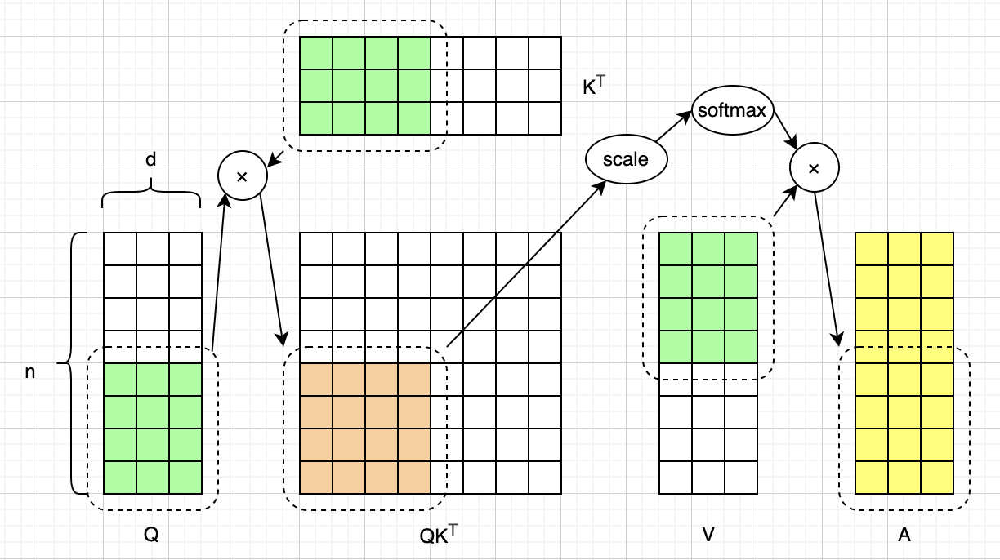
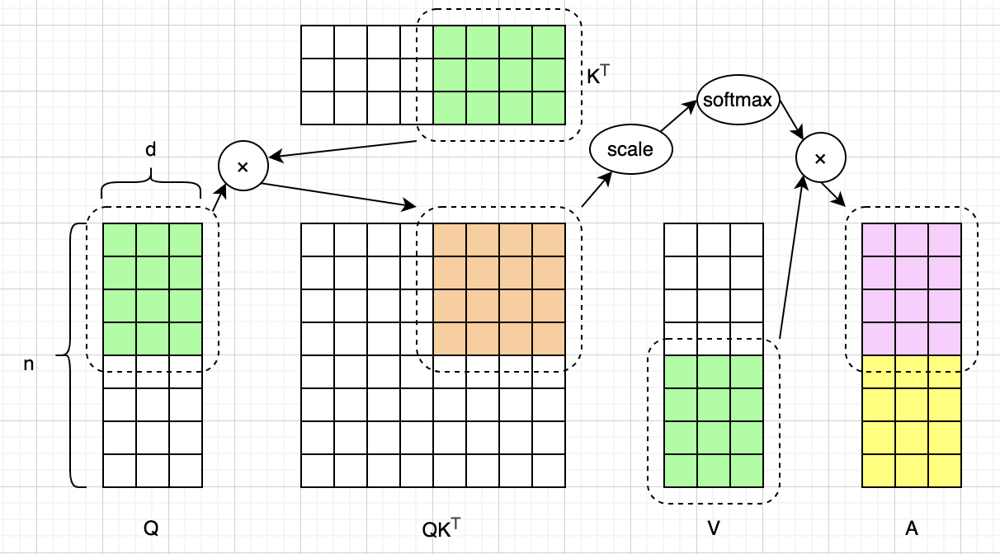
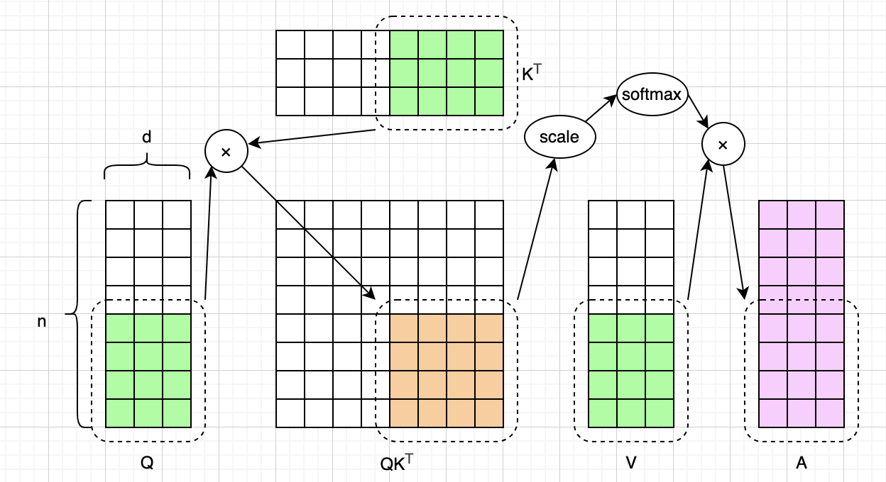
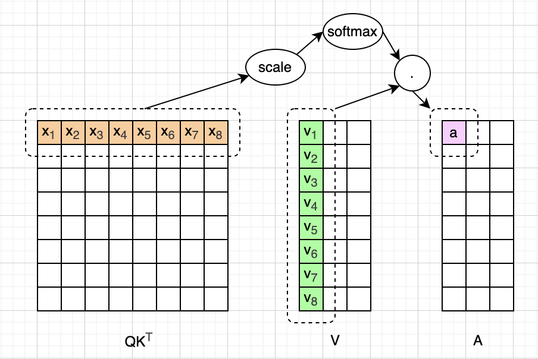
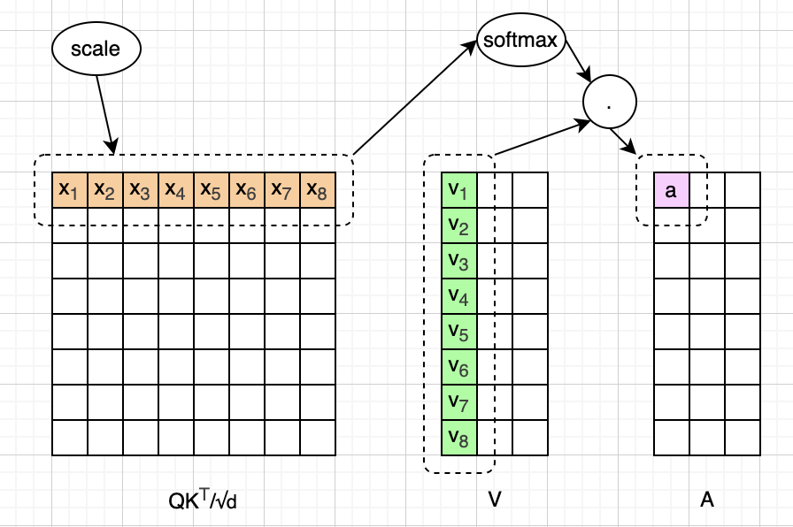
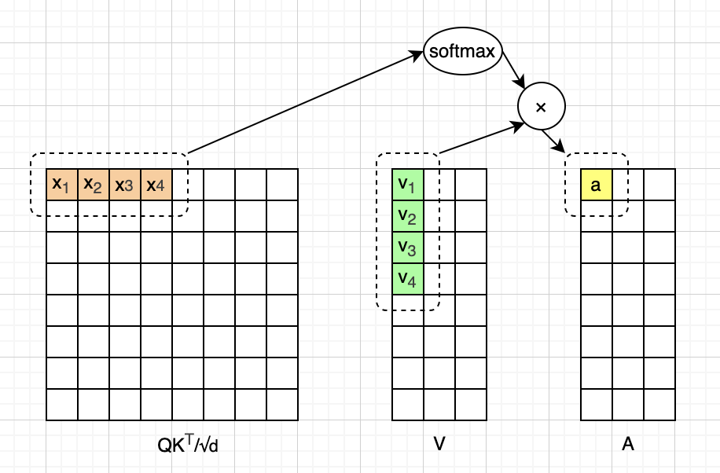
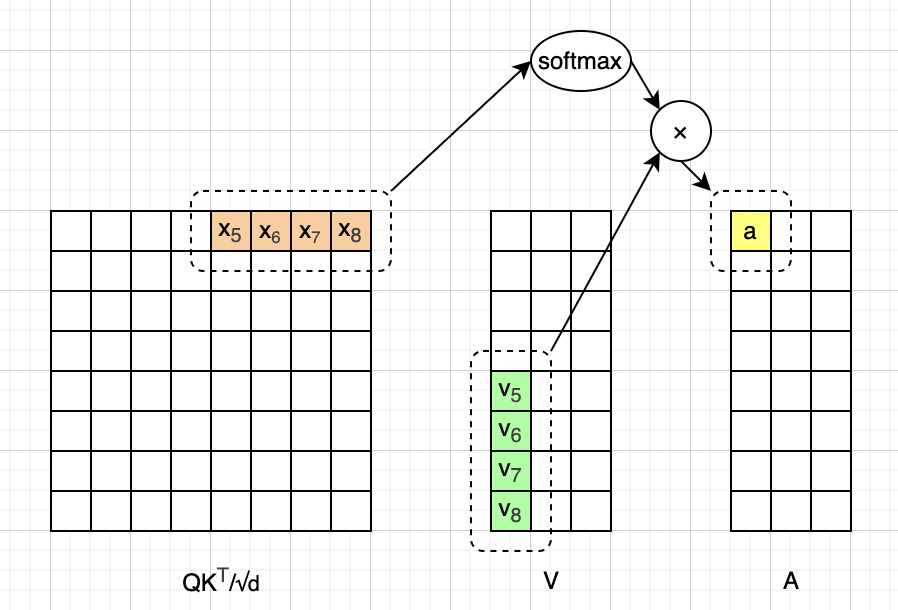

# 图解Flash Attention核心原理

如果你已经学习大语言模型（LLM）和Transformer架构有一段时间了，那么你肯定听说过Flash Attention。但也许你还没有彻底搞清楚Flash Attention的具体细节。本文的目的，就是用尽可能简单的方式，帮助大家理解Flash Attention的基本原理。

我们首先快速回顾一下标准的注意力机制，以及标准注意力计算存在的问题。然后简单复习一下Softmax函数，以及它的“数值稳定”版本，Safe Softmax函数。最后我们进入正题，介绍Flash Attention如何通过分块矩阵乘法和"在线Softmax"，巧妙地解决标准注意力计算存在的问题。

这个系列的文章都没有用AI润色，文字都是自己敲的，图都是自己画的，原汁原味。不过我使用AI检查了错别字，还有一些不确定的地方，我也问了AI。如果一些AI回答的片段，我觉得可以直接用，会以引用的形式贴到文中，一眼就能看出来。由于我还在慢慢学习中，本文可能难免有错误和疏漏，如果我发现的话，会在下一版改进。

## 标准注意力计算

本文假设读者已经对标准的Transformer架构和注意力机制非常熟悉了，如果还不熟悉的话，可以先熟读2017年的那篇经典论文。这里我们直接给出标准的单头注意力计算公式：

$$
\mathrm{Attention}(Q, K, V) = \mathrm{softmax}(\frac{Q K^\top}{\sqrt{d}}) V
$$

我们用`n`来表示输入序列的长度，用`d`来表示隐藏向量的维度。为了便于画图理解，在本文中，我们取`n=8`，`d=3`。于是，我们可以把上面这个公式画成下面这样：

如果我们就是简单地用代码实现这个公式的话，那么可能是分下面这些步骤去计算的：

1、把矩阵Q、K、V都算好，放在内存中（比如GPU的HBM显存），如上图绿色方块所示。

2、计算矩阵 $QK^\top$ ，并放在内存中，如上图棕色方块所示。

3、对计算好的 $QK^\top$ 矩阵，逐元素进行缩放（也就是除以 $\sqrt{d}$ ）。

4、对缩放完毕的 $QK^\top$ 矩阵，逐行算softmax，进行概率归一化。

5、最后用 $QK^\top$ 和V做矩阵乘法，得到矩阵A，如上图紫色方块所示。

现在的LLM都支持非常大的上下文，以DeepSeek-V4（Pro）为例，高达1M（100万），而隐藏向量维度只有7168。从上图中不难看出，当n远大于d时，上面这些计算过程需要的内存空间是 $O(n^2)$ 量级。更别说这还只是一个注意力头的计算。当输入序列很长时，需要非常夸张的显存用量，甚至一张GPU都放不下了。

而Flash Attention就是为了解决这个问题的，它可以把显存用量缩减到 $O(n)$ 量级，并把计算速度提升2～4倍。注意，Flash Attention完全没有改变标准注意力机制，它只是优化了显存使用，并加速了计算。我们会在本文后半部分详细介绍Flash Attention的工作机制。

## Softmax

我们再来看一下Softmax函数，它其实是针对一个向量来计算的，对整个向量进行概率归一化，下面是它的公式：

$$
\mathrm{softmax}(x_i) = \frac{e^{x_i}}{\sum_{j=1}^{n}{e^{x_j}}}
$$

Softmax函数是比较好理解的，这里就不展开讨论了。只说一个问题，就是如果某个 $x_i$ 特别大，那么计算 $e^{x_i}$ 时有可能会溢出。为了解决这个问题，现代的LLM，通常都会使用Safe Softmax。这种安全的Softmax，其实就是在算 $e^{x_i}$ 时，指数统一减去`x`的最大值。根据指数运算的规则，最后的结果和普通的Softmax是完全一样的。下面是Safe Softmax的计算公式：

$$
\begin{aligned}
\mathrm{softmax}(x_i) &= \frac{e^{x_i - \mathrm{max}(x)}}{\sum_{j=1}^{n}{e^{x_j - \mathrm{max}(x)}}} \\
&= \frac{e^{x_i} / e^{\mathrm{max}(x)}}{\sum_{j=1}^{n}{e^{x_j} / e^{\mathrm{max}(x)}}} \\
&= \frac{\frac{1}{e^{\mathrm{max}(x)}} e^{x_i}}{\frac{1}{e^{\mathrm{max}(x)}}\sum_{j=1}^{n}{e^{x_j}}} \\
&= \frac{e^{x_i}}{\sum_{j=1}^{n}{e^{x_j}}}
\end{aligned}
$$

可以看到，相比标准的Softmax函数，Safe Softmax相当于分子分母同时乘了一个系数，所以结果不变。Safe Softmax引入的这个系数特别重要，因为它是Flash Attention能够分块算注意力，而且最后还能算对的关键。下面我们就来讨论矩阵分块计算，然后介绍Flash Attention提出的“在线Softmax”如何修正最终的结果。

## 分块矩阵计算

如前文所述，标准注意力计算最大的问题，就是当输入序列很长的时候，需要巨大的显存用量，成为瓶颈。为了解决这个问题，Flash Attention提出了分块计算的办法。我们并不是一下把Q、K、V矩阵都加载到显存，也不需要存一个巨大的 $QK^\top$ 矩阵。而是把这些矩阵都分成小块，每次只加载一小块，这样问题就迎刃而解了。

我们继续使用前面那个示意图里的简化版例子，并且把Q、K、V以及结果A，都分成2块，把 $QK^\top$ 分成4块，如下图所示。注意，Flash Attention论文对于如何分块是有说明的，但这个细节并不影响我们的讨论。为了便于画图理解，我们把Q、K、V等分成了2块。但实际上分成3、4、5块，道理也都是一样的。

为了更好地理解分块计算，这里我们先忽略缩放和Softmax，只关注 $(Q K^\top)V$ 。根据矩阵乘法规则，我们知道，分块计算的结果，和直接计算的结果，是完全一致的，如上图所示。由于我们只把Q、K、V等分成了2份，所以很容易写出完整的分块计算公式：

$$
\begin{aligned}
(Q K^\top) V &= A = [ A_1, A_2] \\
(Q_1 K_1^\top) V_1 + (Q_1 K_2^\top) V_2 &= A_1\\
(Q_2 K_1^\top) V_1 + (Q_2 K_2^\top) V_2 &= A_2
\end{aligned}
$$

上图里涂色的方块，以及箭头和圆圈所表示的计算，对应上面这个公式里 $A_1$ 的计算。现在我们把缩放也加上，于是分块计算的公式变成了：

$$
\begin{aligned}
(\frac{Q K^\top}{\sqrt{d}}) V &= A = [ A_1, A_2] \\
(\frac{Q_1 K_1^\top}{\sqrt{d}}) V_1 + (\frac{Q_1 K_2^\top}{\sqrt{d}}) V_2 &= A_1\\
(\frac{Q_2 K_1^\top}{\sqrt{d}}) V_1 + (\frac{Q_2 K_2^\top}{\sqrt{d}}) V_2 &= A_2
\end{aligned}
$$

根据矩阵乘法的规则，分块计算和直接计算的结果，仍然是完全一致的。那我们再把Softmax也加上，然后分块计算的公式就变成了：

$$
\begin{aligned}
\mathrm{softmax}(\frac{Q K^\top}{\sqrt{d}}) V &= A = [ A_1, A_2] \\
\mathrm{softmax}(\frac{Q_1 K_1^\top}{\sqrt{d}}) V_1 + \mathrm{softmax}(\frac{Q_1 K_2^\top}{\sqrt{d}}) V_2 &= A'_1\\
\mathrm{softmax}(\frac{Q_2 K_1^\top}{\sqrt{d}}) V_1 + \mathrm{softmax}(\frac{Q_2 K_2^\top}{\sqrt{d}}) V_2 &= A'_2
\end{aligned}
$$

很遗憾，加入Softmax函数之后，分块计算的结果，和预期的结果不一致了！这就是“在线Softmax“要解决的问题，下一个小节讨论，这一小节我们先把分块计算搞清楚。

如果你还没看懂前面的图和公式，也没关系，我们分4步来理解分块计算。第一步，我们把 $K_1$ 、 $V_1$ 和 $Q_1$ 拿出来，放进内存，然后计算这些小块的注意力 $A_1$ 并放入内存，如下图所示。注意，这一步算出来的注意力，并不是最终结果，所以涂成了黄色。

第二步，我们把内存中的 $Q_1$ 换成 $Q_2$ ，再算一次小块的注意力 $A_2$ 并放入内存，如下图所示。同样的，这次算出来的也不是最终结果，所以也涂成了黄色。

第三步，内存中的 $K_1$ 和 $V_1$ 已经不再需要了，我们把它们换成 $K_2$ 、 $V_2$ ，并把 $Q_1$ 再次拿出来，然后计算小块注意力 $A_1$ 。我们把这次算好的临时 $A_1$ 和第一步算好的临时 $A_1$ 结合起来，就是最终需要的 $A_1$ ，我们把它涂成紫色，如下图所示。那具体怎么合并呢？这就是“在线Softmax”要解决的问题，我们下一小节讨论。

第四步，我们把内存中的 $Q_1$ 换成 $Q_2$ ，再算一次小块的注意力 $A_2$ 。和第三步一样，我们把这次算好的临时 $A_2$ 和第二步算好的临时 $A_2$ 结合起来，就是最终需要的 $A_2$ ，我们也把它涂成紫色，如下图所示。

到这里，我们就把矩阵的分块计算说明白了。如果你读Flash Attention论文的话，会发现里面有一段描述该算法的伪代码，用的是2层循环。这个2层循环逻辑，基本就对应上面这些步骤。由于不再需要存储整个 $QK^\top$ 矩阵，于是显存占用就减少成了 $O(n)$ 量级。现在只剩下“在线Softmax”怎么把注意力最终算对还没解释，马上来讨论。

## 在线Softmax

为了搞明白“在线Softmax”，我们需要进一步简化讨论。由于Softmax是按行计算的，这次我们只聚焦 $QK^\top$ 矩阵里的第一行（用粗体**x**来表示），以及V矩阵里的第一列（用粗体**v**来表示）。于是，根据标准缩放点积注意力公式可知：

$$
a = \mathrm{softmax}(\frac{\mathbf{x}}{\sqrt{d}}) \cdot \mathbf{v}
$$

上面这个公式可以画成下面这样：

根据前一小节的讨论可知，缩放并不干扰分块注意力计算，只有Softmax问题需要解决。于是，我们进一步简化问题，假设 $QK^\top$ 矩阵已经经过了缩放。我们把前面这个公式里的向量点积展开，写成下面这样。注意，我们使用的是Safe Softmax函数。

$$
\begin{aligned}
a &= \sum_{i=1}^{8} \frac{e^{x_i}/ e^{\mathrm{max}(x)}}{\sum{e^{x}} / e^{\mathrm{max}(x)}} \cdot v_i \\
&= \frac{\frac{1}{e^{\mathrm{max}(x)}} \sum_{i=1}^{8} e^{x_i} \cdot v_i}{\frac{1}{e^{\mathrm{max}(x)}} \sum_{j=1}^{8}{e^{x_j}}}
\end{aligned}
$$

上面这个展开后的公式可以画成下面这样：

现在我们来看一下分块计算。和前面一样，向量**x**和**v**都被分成了两半。我们先来看前一半的计算：

$$
a' = \frac
{\frac{1}{e^{\mathrm{max}_1(x)}} \sum_{i=1}^{4} e^{x_i} \cdot v_i}
{\frac{1}{e^{\mathrm{max}_1(x)}} \sum_{j=1}^{4}{e^{x_j}}}
$$

注意，由于我们只有一半的**x**，所以我们并不知道**x**的全局最大值是多少。为了说明这个问题，上面公式里的max函数带着下标1，表示它返回的是局部最大值。前半段的计算可以画成下面这样：

后半段的计算公式，和前半段几乎一样。注意，公式里的max函数带着下标2，表示它返回的也是局部最大值。

$$
a'' = \frac
{\frac{1}{e^{\mathrm{max}_2(x)}} \sum_{i=5}^{8} e^{x_i} \cdot v_i}
{\frac{1}{e^{\mathrm{max}_2(x)}} \sum_{j=5}^{8}{e^{x_j}}}
$$

后半段的计算可以画成下面这样：

这里有一个细节必须说明，我们实际上并不是直接把这个临时的a给算出来，并存下来。我们要做的，是把可以算出临时a的分子和分母，分别存下来。这样做的原因，马上就清晰了。现在，我们把分两次算出来的临时a加在一起，看看问题出在哪里，以及怎么解决：

$$
a''' = \frac
{\frac{1}{e^{\mathrm{max}_1(x)}} \sum_{i=1}^{4} e^{x_i} \cdot v_i + \frac{1}{e^{\mathrm{max}_2(x)}} \sum_{i=5}^{8} e^{x_i} \cdot v_i}
{\frac{1}{e^{\mathrm{max}_1(x)}} \sum_{j=1}^{4} e^{x_j} + \frac{1}{e^{\mathrm{max}_2(x)}} \sum_{j=5}^{8}{e^{x_j}}}
$$

不难看出，最大的问题出在系数，也就是 $\frac{1}{e^{\mathrm{max}(x)}}$ ，因为分段计算时，我们只知道**x**的局部最大值。假设我们有某种方式，可以拿到这个全局最大值，那么上面这个公式就完全等价于标准的计算公式了。为了解决这个问题，让我们简化上面的公式，把不必要的细节去掉，让重点聚焦在系数上：

$$
a''' = \frac
{\frac{1}{e^{\mathrm{max}_1(x)}} y_1 + \frac{1}{e^{\mathrm{max}_2(x)}} y_2}
{\frac{1}{e^{\mathrm{max}_1(x)}} z_1 + \frac{1}{e^{\mathrm{max}_2(x)}} z_2}
$$

那我们能修正这个系数吗？答案是可以。因为当我们算后半段的时候，就可以知道全局最大值了。我们先假设 $\mathrm{max}_1(x)$ 拿到的就是全局最大值，那么我们完全可以修改后半段的公式，因为这样算出来的就是预期的注意力a：

$$
a = \frac
{\frac{1}{e^{\mathrm{max}_1(x)}} y_1 + \frac{1}{e^{\mathrm{max}_1(x)}} y_2}
{\frac{1}{e^{\mathrm{max}_1(x)}} z_1 + \frac{1}{e^{\mathrm{max}_1(x)}} z_2}
$$

现在我们假设 $\mathrm{max}_2(x)$ 拿到的才是全局最大值，也就是说，我们需要修正第一段的计算。可是，第一段已经算好了，不能再重新算了。但是，此时我们已经知道第一段计算的误差是多大，我们只要修正这个误差就可以了，像下面这样：

$$
a = \frac
{\frac{1}{e^{\mathrm{max}_2(x) - \mathrm{max}_1(x)}}(\frac{1}{e^{\mathrm{max}_1(x)}} y_1) + \frac{1}{e^{\mathrm{max}_2(x)}} y_2}
{\frac{1}{e^{\mathrm{max}_2(x) - \mathrm{max}_1(x)}}(\frac{1}{e^{\mathrm{max}_1(x)}} z_1) + \frac{1}{e^{\mathrm{max}_2(x)}} z_2}
$$

为了像上面这样去修正前面的计算，我们不仅要保存计算临时a的分子和分母，还需要把**x**的局部最大值也保存下来。以上我们介绍了两段计算的修正法，实际上，无论分成几段，计算逻辑都是一样的。直观上就是，我们边算边修正，最终就能算出正确的a。

## 总结

本文介绍了 Flash Attention 的核心原理。为方便图示与讲解，我们仅讨论了简化版计算，很多底层细节并没有展开说明。目前 Flash Attention 已经迭代至第 4 版，如果你已经掌握基础逻辑、希望深入了解完整细节，建议阅读官方原始论文。

## 主要参考资料

* 论文：[Attention Is All You Need](https://arxiv.org/abs/1706.03762)
* 论文：[FlashAttention: Fast and Memory-Efficient Exact Attention with IO-Awareness](https://arxiv.org/abs/2205.14135)
* 书籍：[The Hitchhiker’s Guide to Agentic AI](https://arxiv.org/pdf/2606.24937)

