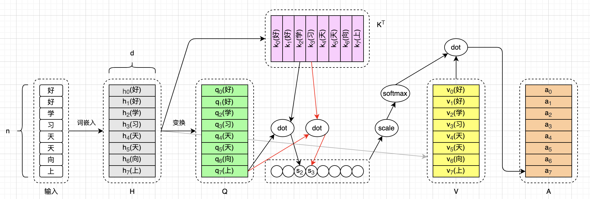
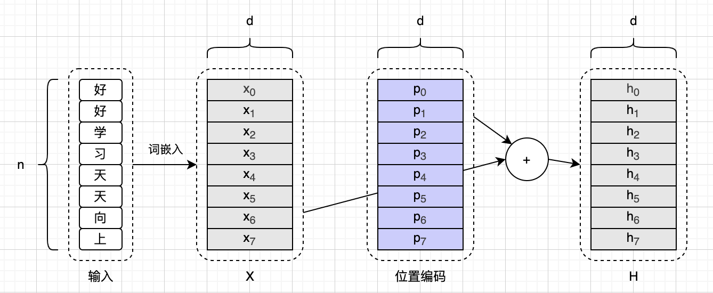
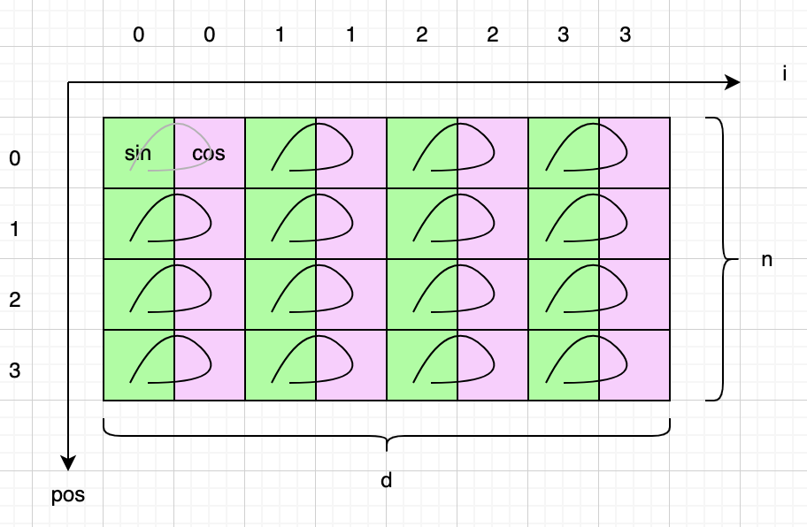
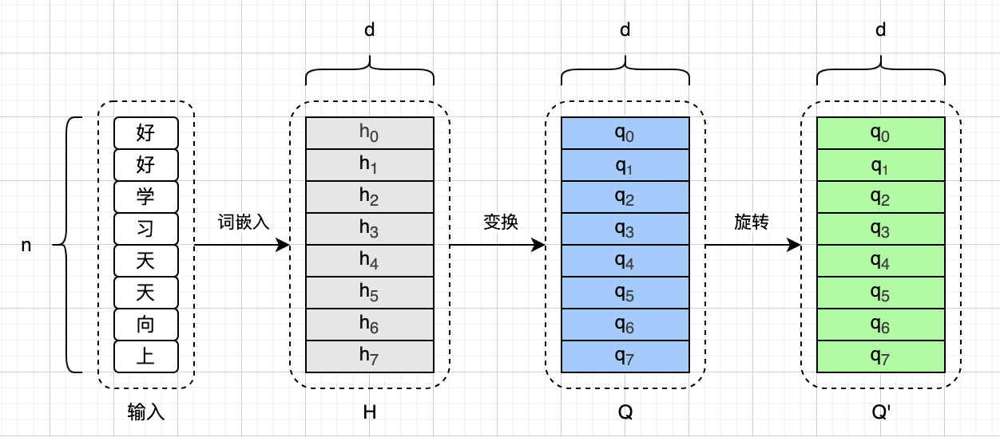
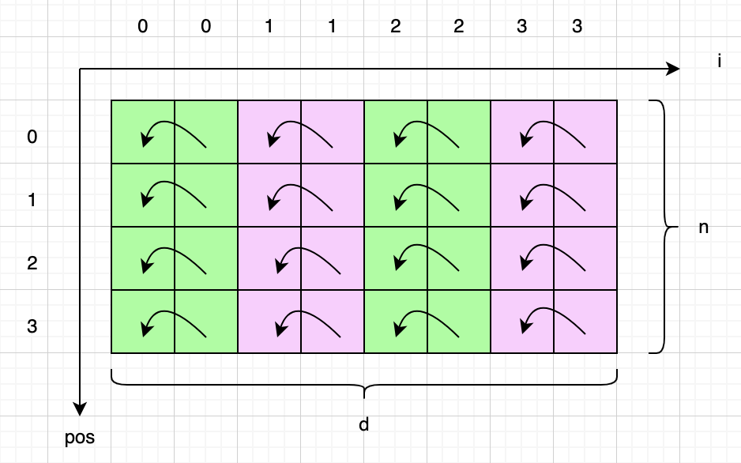

# 图解位置编码

本文介绍一下Transformer架构里的**位置编码**（Positional Encoding，简称**PE**）。位置编码早在2017年的经典论文《Attention Is All You Need》里，也就是Transformer架构被提出的时候，就已经同时被提出了。最开始提出的位置编码存在一些问题，所以后来有许多改进版本，甚至完全抛弃位置编码（例如ALiBi）。但现在**旋转位置编码**（Rotary Position Embedding，简称**RoPE**）基本上已经是事实标准了，GPT、Claude、Gemini、LLaMA、Mistral、Qwen、DeepSeek等模型，都在使用RoPE（或者其变种）。

本文只介绍2017经典论文里提出的**正弦位置编码**（Sinusoidal PE，本文简称**SinPE**），以及RoPE。其他的位置编码，或者RoPE的各种变种，本文不讨论，感兴趣的读者可以搜索相关资料或者阅读相关论文。在正式介绍SinPE和RoPE之前，我会简单介绍一些必要的前置数学知识，以及为啥需要位置编码。在文章的最后，还会有一个简单的总结，以及主要参考资料。

图解LLM系列的文章都没有用AI润色，文字都是自己敲的，图都是自己画的，原汁原味。不过我使用AI检查了错别字，还有很多不确定的地方，我也问了AI。如果一些AI回答的片段，我觉得可以直接用，会以引用的形式贴到文中，一眼就能看出来。由于我还在慢慢学习中，本文可能难免有错误和疏漏，如果你发现的话，可以在评论区告诉我，我会在下一版改进。

## 前置数学知识

我们先来复习几个三角函数相关的公式。这些公式我可能中学的时候背得很熟练，但也早就忘记了，也是写这篇文章时才重新回忆起来的。下面是第一组公式：

$$
\begin{aligned}
\sin(-\alpha) &= - \sin \alpha \\
\cos(-\alpha) &= \cos \alpha
\end{aligned}
$$

下面是第二组公式：

$$
\begin{aligned}
\sin(\alpha + \beta) &= \sin\alpha \cos\beta + \cos\alpha \sin\beta \\
\cos(\alpha + \beta) &= \cos\alpha \cos\beta - \sin\alpha \sin\beta
\end{aligned}
$$

再来看一组关于矩阵乘法和转置的公式。这组公式我也是老忘记，再写一遍加深记忆：

$$
\begin{aligned}
(A B)^\top &= B^\top A^\top \\
(A B C)^\top &= C^\top B^\top A^\top \\
\end{aligned}
$$

上面这些公式都很简单，这里就不解释了，我们直奔主题。

## 为什么需要位置编码

本文假设读者已经对标准的Transformer架构和注意力机制非常熟悉了，如果还不熟悉的话，可以先熟读2017年的那篇经典论文。

这一小节我们快速回顾一下标准注意力机制，看看为啥需要位置编码。这里先给出标准注意力计算公式，也就是经典论文里的公式（1）：

$$
\begin{aligned}
\mathrm{Attention}(Q, K, V) = \mathrm{softmax}(\frac{Q K^\top}{\sqrt{d}})V
\end{aligned}
\tag{A1}
$$

在本文中，我们用`n`来表示输入序列的长度，用`d`来表示词嵌入和隐藏向量的维度。上面这个公式，考虑的是整个输入序列，因此Q、K、V都是矩阵。为了方便画图，这里我们取`n=8`，并且只考虑第8个Query的注意力计算，于是上面的公式可以具体化为下面这样（下标从0开始）：

$$
\mathbf{a}_7 = \mathrm{softmax}(\frac{\mathbf{q}_7 K^\top}{\sqrt{d}})V
$$

我们可以把上面这个公式画成下面这样：

由于缩放和Softmax函数并不会影响对于位置编码的理解，因此我们可以暂时忽略它们，这样就可以进一步简化公式，写成下面这样：

$$
\mathbf{a}_7 = (\mathbf{q}_7 K^\top)V
$$

现在我们把上面这个公式展开，写成向量点积与加权求和形式，像下面这样：

$$
\mathbf{a}_7 = \sum_{i=0}^7 (\mathbf{q}_7 \cdot \mathbf{k}_i) \mathbf{v}_i
$$

可以看到，上面这个公式，完全不考虑kv的顺序。且加上缩放和Softmax后，结论依然成立。也就是说，这个注意力机制，无法捕捉文字的顺序信息。例如，在“上”看起来，“好好学习天天向”和“天天向好好学习”并没有啥区别，这就是问题所在。为了解决这个问题，Transformer论文里就提出了位置编码的方案。

## 位置编码

位置编码的思路很简单，就是给输入序列的每个位置，产生一个只和位置有关的编码（维度也是`d`），然后和输入叠加在一起，这样模型就可以注意到位置信息。我们把这个过程画出来，看起来就是下面这样：

我们沿用《Attention Is All You Need》论文里的写法，用`pos`来表示某位置，用`PE`来表示位置编码函数，那么某个输入叠加位置编码后的结果，可以用下面这个公式来计算：

$$
\mathbf{h}_{pos} = \mathbf{x}_{pos} + \mathrm{PE}(pos)
$$

但是这个位置编码函数，也是有讲究的。论文里提到了两种方案，一种是直接让模型去学出来一组位置编码，用的时候查表就行。这种方式不好，比如说训练时模型见过的最大序列长度是`n`，但是实际推理时，输入了一个长度是`n+1`的序列，那模型就傻眼了。所以论文说，不如直接通过输入Token的位置来计算位置编码，这就是正弦位置编码方案。

## 正弦位置编码（SinPE）

我们直接来看《Attention Is All You Need》论文3.5小节给出的`PE`函数定义（有一些小的调整）：

$$
\begin{aligned}
\mathrm{PE}(pos, 2i) &= \sin\left(\frac{\mathrm{pos}}{10000^{2i / d}}\right) \\
\mathrm{PE}(pos, 2i+1) &= \cos\left(\frac{\mathrm{pos}}{10000^{2i / d}}\right)
\end{aligned}
$$

如果你没有一眼看懂这组公式，也没关系。因为我刚开始看论文的时候，也没看懂。在这组公式里，`pos`表示某个输入的位置，`d`表示词嵌入维度，这些我们前面解释过了。`2i`和`2i+1`表示词嵌入的维度索引，两两一组，这个主要是为了区分奇数和偶数的维度索引。对于偶数维度索引，我们就用`sin`函数；对于奇数维度索引，我们就用`cos`函数。

我们假设有一个很小的模型（词嵌入维度`d=8`）和一个很短的输入（`n=4`），那么完整的位置编码表可以画成下面这样。其中绿色的格子，都是要用`sin`函数去算的，粉色的格子，都是需要用`cos`函数去算。然后你只要把`pos`和`2i`带入到`sin`或者`cos`函数里，就能算出这个格子里的位置编码值。

顺便说一下，论文里说，我们可以给输入注入相对或者绝对位置信息。前面的公式里，位置编码是根据`pos`直接算出来的，所以SinPE注入的是绝对位置信息。上面这个图可能过于简化了，我从网上找了一个更好的图（`d=64`，`n=100`），可以更直观的感受SinPE：

那么为啥要用这种方式算位置编码呢？论文里说：给定位置`pos`和`pos+k`，如果位置编码`PE(pos)`和`PE(pos+k)`之间能有一个只和`k`有关的线性变换，那就最好了。也就是说，我们期望模型能注意到的，是相对位置信息。比如说有一段很长的话：“。。。好好学习，天天向上！”。对于“上”来说，其实模型也不需要关心其他字的位置，它只要知道，“上”的前面是“向”，再往前是“天”，再往前也是“天”，如此等等，就可以了。

而正弦位置编码就符合这个特点。为了搞清楚为啥SinPE满足这个特点，让我们简化一下前面的公式，令：

$$
\begin{aligned}
\theta &= \frac{pos}{10000^{2i/d}} \\
\Delta &= \frac{k}{10000^{2i/d}}
\end{aligned}
$$

然后我们把前面的PE公式，写成列向量形式：

$$
\begin{bmatrix}
\mathrm{PE}(pos, 2i) \\
\mathrm{PE}(pos, 2i+1)
\end{bmatrix} =
\begin{bmatrix}
\sin(\frac{pos}{10000^{2i/d}}) \\
\cos(\frac{pos}{10000^{2i/d}})
\end{bmatrix} =
\begin{bmatrix}
\sin \theta \\
\cos \theta
\end{bmatrix}
$$

同样的，我们可以写出`pos+k`位置的PE公式，并根据文章最开始复习的三角函数公式进行展开：

$$
\begin{bmatrix}
\mathrm{PE}(pos+k, 2i) \\
\mathrm{PE}(pos+k, 2i+1)
\end{bmatrix} =
\begin{bmatrix}
\sin(\frac{pos+k}{10000^{2i/d}}) \\
\cos(\frac{pos+k}{10000^{2i/d}})
\end{bmatrix} = 
\begin{bmatrix}
\sin (\theta + \Delta) \\
\cos (\theta + \Delta)
\end{bmatrix} =
\begin{bmatrix}
\sin\theta \cos \Delta + \cos\theta \sin \Delta \\
\cos\theta \cos \Delta - \sin\theta \sin \Delta
\end{bmatrix}
$$

我们可以把上面等式里最右边的那项，写成矩阵乘法的形式，继续写这个等式：

$$
=
\begin{bmatrix}
\cos \Delta & \sin \Delta \\
- \sin \Delta & \cos \Delta
\end{bmatrix}
\begin{bmatrix}
\sin \theta \\
\cos \theta
\end{bmatrix} = 
\begin{bmatrix}
\cos \Delta & \sin \Delta \\
- \sin \Delta & \cos \Delta
\end{bmatrix}
\begin{bmatrix}
\mathrm{PE}(pos, 2i) \\
\mathrm{PE}(pos, 2i+1)
\end{bmatrix}
$$

省略掉中间步骤，最终我们得到等式：

$$
\begin{bmatrix}
\mathrm{PE}(pos+k, 2i) \\
\mathrm{PE}(pos+k, 2i+1)
\end{bmatrix} =
\begin{bmatrix}
\cos \Delta & \sin \Delta \\
- \sin \Delta & \cos \Delta
\end{bmatrix}
\begin{bmatrix}
\mathrm{PE}(pos, 2i) \\
\mathrm{PE}(pos, 2i+1)
\end{bmatrix}
$$

我们把`i`完全展开，于是上面这个等式可以写成下面这样：

$$
\begin{bmatrix}
\mathrm{PE}(pos+k, 0) \\
\mathrm{PE}(pos+k, 1) \\
\mathrm{PE}(pos+k, 2) \\
\mathrm{PE}(pos+k, 3) \\
\vdots \\
\mathrm{PE}(pos+k, d-2) \\
\mathrm{PE}(pos+k, d-1) \\
\end{bmatrix} =
\begin{bmatrix}
\cos \Delta_1 & \sin \Delta_1 & 0 & 0 & \dots & 0 & 0 \\
- \sin \Delta_1 & \cos \Delta_1 & 0 & 0 & \dots & 0 & 0 \\
0 & 0 & \cos \Delta_2 & \sin \Delta_2 & \dots & 0 & 0 \\
0 & 0 & - \sin \Delta_2 & \cos \Delta_2 & \dots & 0 & 0 \\
\vdots & \vdots & \vdots & \vdots & \ddots & \vdots & \vdots \\
0 & 0 & 0 & 0 & \dots & \cos \Delta_{d/2} & \sin \Delta_{d/2} \\
0 & 0 & 0 & 0 & \dots & - \sin \Delta_{d/2} & \cos \Delta_{d/2} 
\end{bmatrix}
\begin{bmatrix}
\mathrm{PE}(pos, 0) \\
\mathrm{PE}(pos, 1) \\
\mathrm{PE}(pos, 2) \\
\mathrm{PE}(pos, 3) \\
\vdots \\
\mathrm{PE}(pos, d-2) \\
\mathrm{PE}(pos, d-1) \\
\end{bmatrix}
$$

现在我们已经掌握了全貌，我们把上面的公式简写为：

$$
\mathrm{PE}(pos+k) = M \times \mathrm{PE}(pos)
$$

由于矩阵M只和`k`相关，和`pos`无关，于是我们就解释了SinPE可以让模型注意到Token之间相对位置的特点。然而，SinPE也是有缺陷的。这些缺陷RoPE都解决了，所以现在RoPE（包括各种变种）成为了主流的位置编码方案。

> Q：能一两句话总结Sinusoidal PE的缺点吗？以及为啥RoPE更好？
>
> AI：正弦 PE 仅基于单个 Token 绝对下标生成向量，注意力分数无法剥离绝对位置、外推能力极差，且仅靠简单相加融合语义与位置易互相干扰；而 RoPE 通过旋转矩阵耦合位置相位，点积天然只依赖 Token 相对间距，原生支持长上下文缩放，位置与语义融合更稳定。

## 旋转位置编码（RoPE）

如果你已经理解了SinPE，那么RoPE就相对好懂了。我们总结一下，SinPE是直接根据位置算出位置编码，然后叠加到词嵌入上。RoPE不同，它是直接作用在Q和K上（旋转它们）。我们以Q为例，如下图所示：

由于RoPE是作用在Q和K上，那就不能只计算一次，而是每一个decoder层都要算一次。对比SinPE，这显然是增加了计算量的，但是可以接受。RoPE旋转Q或者K的方式，跟SinPE计算位置编码是有些相似之处的，比如都是按词嵌入维度两两一组计算。还是以Q为例，如下图所示：

那具体是如何进行旋转的呢？还是以Q为例，我们仿造SinPE的写法，给出下面这个公式。这里我们参考RoPE论文的写法，把表示输入位置的`pos`换成了`m`，而`i`的含义和SinPE是完全一样的。

$$
\begin{bmatrix}
q'_{m, 2i} \\
q'_{m, 2i+1}
\end{bmatrix} =
\begin{bmatrix}
\cos m\theta & -\sin m\theta \\
\sin m\theta & \cos m\theta
\end{bmatrix}
\begin{bmatrix}
q_{m, 2i} \\
q_{m, 2i+1}
\end{bmatrix}
$$

那你可能要问了，上面这个公式有啥含义呢？含义就是把等号右边的向量，逆时针旋转 $m\theta$ 弧度，得到等号左边的向量，这就是RoPE为啥叫旋转位置编码的缘故。其中 $\theta$ 是和维度方向的`i`相关的，可以通过下面的公式得到：

$$
\theta_i = 10000^{-2i / d}
$$

我们把前面的公式展开，于是有：

$$
\begin{bmatrix}
q'_{m, 0} \\
q'_{m, 1} \\
q'_{m, 2} \\
q'_{m, 3} \\
\vdots \\
q'_{m, d-2} \\
q'_{m, d-1} \\
\end{bmatrix} =
\begin{bmatrix}
\cos m\theta_1 & -\sin m\theta_1 & 0 & 0 & \dots & 0 & 0 \\
\sin m\theta_1 & \cos m\theta_1 & 0 & 0 & \dots & 0 & 0 \\
0 & 0 & \cos m\theta_2 & -\sin m\theta_2 & \dots & 0 & 0 \\
0 & 0 & \sin m\theta_2 & \cos m\theta_2 & \dots & 0 & 0 \\
\vdots & \vdots & \vdots & \vdots & \ddots & \vdots & \vdots \\
0 & 0 & 0 & 0 & \dots & \cos m\theta_{d/2} & -\sin m\theta_{d/2} \\
0 & 0 & 0 & 0 & \dots & \sin m\theta_{d/2} & \cos m\theta_{d/2} 
\end{bmatrix}
\begin{bmatrix}
q_{m, 0} \\
q_{m, 1} \\
q_{m, 2} \\
q_{m, 3} \\
\vdots \\
q_{m, d-2} \\
q_{m, d-1} \\
\end{bmatrix}
$$

可以看到，等号右边这个旋转矩阵，仅和位置`m`有关。我们用 $R_m$ 来表示某位置`m`的旋转矩阵，于是上面的公式可以简写为：

$$
\mathbf{q}_m' = R_m \mathbf{q}_m
$$

现在我们重点来看这个 $R_m$ 矩阵，这就是RoPE论文里的公式（15）：

$$
\begin{aligned}
R_m &=
\begin{bmatrix}
\cos m\theta_1 & -\sin m\theta_1 & 0 & 0 & \dots & 0 & 0 \\
\sin m\theta_1 & \cos m\theta_1 & 0 & 0 & \dots & 0 & 0 \\
0 & 0 & \cos m\theta_2 & -\sin m\theta_2 & \dots & 0 & 0 \\
0 & 0 & \sin m\theta_2 & \cos m\theta_2 & \dots & 0 & 0 \\
\vdots & \vdots & \vdots & \vdots & \ddots & \vdots & \vdots \\
0 & 0 & 0 & 0 & \dots & \cos m\theta_{d/2} & -\sin m\theta_{d/2} \\
0 & 0 & 0 & 0 & \dots & \sin m\theta_{d/2} & \cos m\theta_{d/2} 
\end{bmatrix}

\end{aligned}
\tag{R15}
$$

关于 $R_m$ ，有好几个特别重要的性质，见下面这几个等式：

$$
\begin{aligned}
R_m^\top &= R_{-m} \\
R_m R_n &= R_{m+n} \\
R_m R_m^\top &= I 
\end{aligned}
$$

因为R是旋转矩阵，所以上面这几个等式也很好理解的，都不需要证明。当然了，位置`m`可以是负数是很不合理的。所以上面公式里，你就把`m`当成计算旋转角度的系数就好了。

* 第一个等式：R转置，相当于反向旋转。这个可以利用文章开头复习的三角函数公式进行验证，这里就不详细推导了。
* 第二个等式：先旋转`m`，再旋转`n`，相当于直接旋转`m+n`。
* 第三个等式：先旋转`m`，再反向旋转`m`，相当于不旋转。

根据标准注意力机制，我们知道向量**q**和**k**都是通过输入向量**x**变换而来的，于是有：

$$
\mathbf{q}_m' = R_m W_q \mathbf{x}_m \\
\mathbf{k}_m' = R_m W_k \mathbf{x}_m
$$

然后我们利用到目前为止掌握的知识，把**q**和**k**的点积写出来，这就是RoPE论文里的公式（16）。疑问：RoPE原论文里这个公式最后一步好像写错了两个地方。

$$
\begin{aligned}
\mathbf{q}_m^\top \mathbf{k}_n &= (R_m W_q \mathbf{x}_m)^\top (R_n W_k \mathbf{x}_n) \\
&= \mathbf{x}_m^\top W_q^\top (R_m^\top R_n) W_k \mathbf{x}_n \\
&= \mathbf{x}_m^\top W_q^\top R_{n-m} W_k \mathbf{x}_n
\end{aligned}
\tag{R16}
$$

从上的等式可以看到，位置`m`的向量**q**和位置`n`的向量**k**计算注意力分数时，模型可以学习到一个仅仅和相对位置`n-m`有关的信息。总之，和SinPE相比，我们并不是直接把位置信息叠加到词嵌入上，而是通过旋转Q和K来记录位置信息，从而使注意力分数仅依赖Token之间的相对距离，因此获得了更好的扩展性。

简而言之，使用RoPE，模型学到的是相对位置关系，所以推理时可以自然处理比训练时更长的序列，这就是它的核心优势。说到这里，我认为RoPE论文里的图1还是挺清晰的，放到这里供读者参考：

最后介绍一下RoPE论文里提到的公式（34）。由于旋转矩阵 $R_m$ 里大部分元素都是0，所以算矩阵乘法并不是很划算。RoPE给出了优化方案：把矩阵乘法改成两次向量哈达玛积（逐元素相乘）和一次向量加法。下面是这个公式：

$$
\begin{aligned}
R_m \mathbf{x} &=
\begin{pmatrix}
x_1 \\
x_2 \\
x_3 \\
x_4 \\
\vdots \\
x_{d-1} \\
x_d
\end{pmatrix}
\otimes
\begin{pmatrix}
\cos m\theta_1 \\
\cos m\theta_1 \\
\cos m\theta_2 \\
\cos m\theta_2 \\
\vdots \\
\cos m\theta_{d/2} \\
\cos m\theta_{d/2}
\end{pmatrix}
+
\begin{pmatrix}
-x_2 \\
x_1 \\
-x_4 \\
x_3 \\
\vdots \\
-x_d \\
x_{d-1}
\end{pmatrix}
\otimes
\begin{pmatrix}
\sin m\theta_1 \\
\sin m\theta_1 \\
\sin m\theta_2 \\
\sin m\theta_2 \\
\vdots \\
\sin m\theta_{d/2} \\
\sin m\theta_{d/2}
\end{pmatrix}

\end{aligned}
\tag{R34}
$$

## 总结

缩放点积注意力机制本身不包含任何位置信息，因此对Token的排列顺序并不敏感。为此，Transformer架构在提出时引入了位置编码，用于向模型提供序列的位置信息。

Transformer原论文简短讨论了两种位置编码方案：一种是将位置编码作为模型参数进行学习（Learned PE）；另一种是通过固定函数根据位置计算位置编码（SinPE）。由于固定函数能够计算任意位置的位置编码，所以相比学习得到的位置编码，具有更好的长度外推能力，因此论文最终采用了后者。

随后的研究又发展出了两大类位置编码方法：绝对位置编码和相对位置编码。绝对位置编码为每个位置分配一个唯一的位置表示；相对位置编码则更关注Token之间的相对位置关系，使注意力计算能够直接利用两个Token的相对距离。SinPE属于前者，RoPE则属于后一类。

RoPE通过分别旋转Q和K，使注意力分数最终仅依赖于Token的相对位置。由于它能够自然地编码相对位置信息，同时具有良好的长度外推能力且无需增加额外参数，因此成为当前大语言模型中应用最广泛的位置编码方案。

## 主要参考资料

* 论文：[Attention Is All You Need](https://arxiv.org/abs/1706.03762)
* 论文：[RoFormer: Enhanced Transformer with Rotary Position Embedding](https://arxiv.org/abs/2104.09864)
* 书籍：[The Hitchhiker’s Guide to Agentic AI](https://arxiv.org/pdf/2606.24937)

