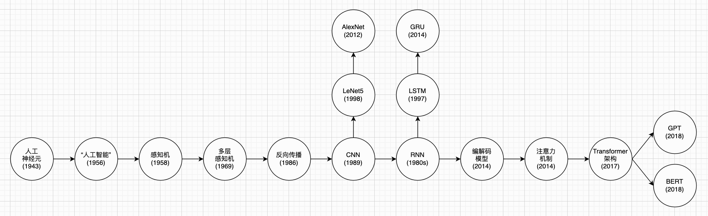
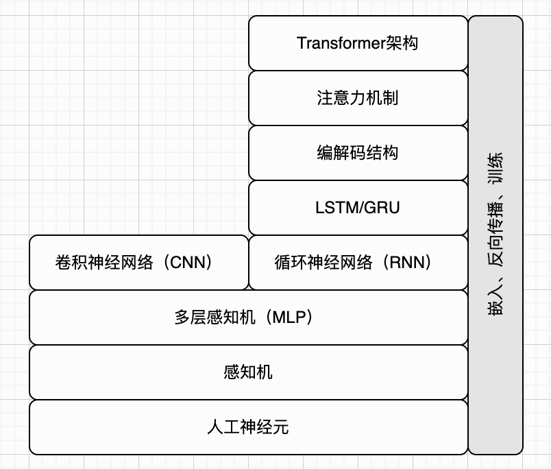
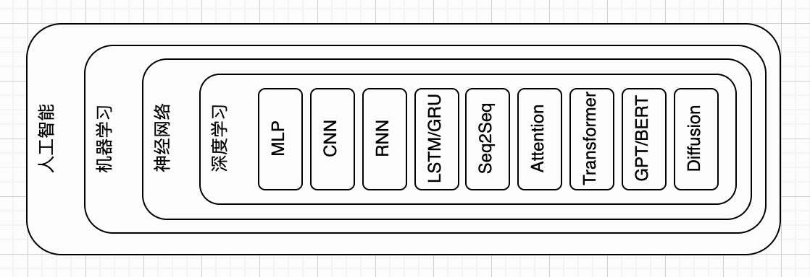

## 前言

智能体（Agent）、技能（Skills）、大语言模型（Large Language Model，简称 LLM）、深度学习（Deep Learning，简称 DL）…… 随着人工智能（Artificial Intelligence，简称 AI）浪潮席卷全球，各类创新应用井喷式落地普及，相信大家对这些专业词汇早已耳熟能详。

尽管相关技术在近年才迎来爆发式发展，但支撑一切的底层基石，早在八十余年前便已悄然萌芽，它就是人工神经网络（Artificial Neural Network，简称 ANN）。

作为普通人（比如你和我），要想跟上时代，必须学习各种各样的AI工具，提高学习和工作效率。如今，我们可以借助AI查找资料、解答问题、翻译文字、写文章、写剧本、写代码、生成图片、创造音乐、制作视频等等。不过，普通人也能理解这些AI工具底层的工作原理吗？我认为完全可以，而且你不必是计算机系或数学系高材生（如果是的话，当然是加分项）。

也许你也曾试着去了解过相关资料，可里面满是概率论、线性代数、微积分等知识，还有一大堆复杂难懂的数学公式。一看到反向传播、损失函数、梯度消失这些概念，就觉得头都大了，于是默默放弃。但其实，人工神经网络的整体思路非常容易理解。我们完全可以把少数过于艰深的细节暂时当成 “黑盒子”，不用死磕每一个数学推导。

总之，只要掌握中学阶段的基础数学知识，再配合循序渐进、由浅入深的学习节奏，普通读者也完全能够读懂并理解人工神经网络。本书正是为实现这一目标而创作，我们将从最简单的人工神经元（Artificial Neuron）入手，循序渐进搭建完整的知识体系。全书不堆砌复杂公式，不生硬灌输晦涩理论，以直观易懂、通俗好理解的讲解方式，带你揭开人工智能底层原理的神秘面纱。

如果你也和我一样，对未知领域充满好奇，那就一同踏入人工神经网络的知识 “兔子洞” 吧。准备好了吗？我们正式开始。

### 写作动机

我，也就是本书作者，是一名普通的程序员。在读研究生的时候，我也上过 AI 相关课程，不过那已经是二十年前（2006年）的事情了。当时学过的东西现在基本已经忘得差不多了，只隐约记得买过几本厚厚的教材，里面讲的重点还是专家系统之类的内容。

毕业以后，我陆续在互联网金融、网络游戏等领域自顾自地写着代码，并没有特别关注 AI，只是偶尔会被一些重大新闻吸引，比如 2016 年 AlphaGo 对战李世石。

但实际上，AI 一直在持续发展，并在潜移默化中改变着我们的生活。例如，我们的智能手机可以通过语音进行控制，我们的汽车开始具备自动驾驶能力，就连我们爱吃的冰激凌也开始由机器人制作和售卖。而推荐系统更是无处不在，从电商、短视频到各类内容平台，几乎随处可见它们的身影，悄无声息地影响着我们的选择和日常体验。不过在这个阶段，AI 仍然属于一个相对小众的领域，大概只有专业的研究人员和开发者才会持续关注。

直到 2022 年 ChatGPT 正式发布，上线后用户规模迅速爆发，并引发了广泛讨论；进入 2023 年，AI 彻底成为全球性科技热点，各类相关概念与技术术语如雨后春笋般不断涌现。我也是从那时开始，重新认真关注 AI，阅读相关文章与书籍，慢慢钻研学习。此时的 AI，早已是深度神经网络（或者说深度学习）的天下。至于何为 “深度”，本书后续会逐步展开讲解。

我并不满足于只停留在应用层面。在好奇心的驱使下，我开始一点点往底层原理钻。但在学习过程中，我遇到了不小的困惑。首先是术语实在太多，而且彼此之间关系复杂，很难理清脉络，不知道该从哪里入手。其次是现有资料各有不足：有的偏重概念，讲得比较抽象，细节不够；有的则一上来就是大量公式和推导，让人很难跟上节奏。我始终没有找到一本既系统、又难度适中，同时能讲清楚深度神经网络底层原理的书（肯定有，只是我不知道，或者不适合我）。

于是，我开始一边查资料，一边学习，一边整理思路，也顺手写下一些笔记。慢慢地，这些零散的内容在脑海中形成了一个相对完整的结构，也逐渐演变成这本书的大致框架。再后来，我决定认真把它写出来，把几乎所有的业余时间都投入其中。

### 本书特色

我希望将本书写成休闲读本与专业教材之间的折中形式，兼顾通俗易读与知识严谨，融合两类读物的优势。相较于市面上介绍神经网络与深度学习的各类书籍，本书主要具备以下特点。

#### 沿着历史脉络讲解

整个 AI 的知识体系非常庞杂，如果一头扎进去，很容易迷失方向。但如果能抓住一条清晰的线索，顺着它由浅入深地走，就会轻松很多。我在学习过程中逐渐发现，AI 的发展历史，本身就是这样一条很好的线索。

虽然这一波 AI 热潮是在 2020 年代爆发的，但如果往回看，你会发现它的萌芽其实早在 1940 年代就已经出现了。人工神经网络的基本构成单元，也就是人工神经元，就是在那个年代被提出的。不过受限于当时的计算能力和数据条件，直到 1950 年代末，基于人工神经元的单层网络才真正得到应用，也就是感知机（Perceptron）的问世。

到了 1960 年代末，人们逐渐认识到单层神经网络的局限性，并提出了多层感知机的设想。但问题在于，当时还不知道该如何有效训练多层网络，因此这些想法更多停留在概念层面。一直到 1980 年代中后期，反向传播算法逐渐被系统化并推广开来，多层神经网络（也即深度神经网络）才开始真正走向实用。

当“如何训练多层神经网络”这个关键问题被解决之后，研究者们便开始在模型结构上进行各种探索和创新。其中比较有代表性的方向包括卷积神经网络（CNN）和循环神经网络（RNN）。CNN 为图像识别、视觉处理等任务打下了重要基础；而 RNN 则在序列建模方面不断演进，发展出了长短期记忆网络（LSTM）、编解码模型、注意力机制，最终走向了 Transformer 架构，并为今天大语言模型的兴起奠定了关键基础。

从某种意义上说，这本书也可以看作是一部“人工神经网络的简史”。我们会从最基本的人工神经元出发，一步步往前，介绍每一个关键技术节点，看看人工神经网络是如何不断演进，最终发展到今天的大语言模型，并催生出繁荣的生态和应用。本书正文要讲解的主要内容，也就是这条路线图，大致如下：

#### 把训练过程当黑盒

现在我们已经有了一条相对清晰的线索和脉络。不妨把学习神经网络的过程想象成是在玩一款游戏：前进路径上的每一个知识点，就像一个 BOSS，打败它，才能继续往前走。

我相信大多数人都玩过游戏，也都知道游戏的节奏通常是由易到难的。BOSS 会一关比一关更强，玩家则在不断尝试中逐渐成长。如果一上来就是一个极其困难的大 BOSS，很可能大部分人都会卡在第一关，后面的精彩内容也就无缘体验了。

而“坏消息”是，在前面提到的人工神经网络发展路径上，确实有这么一个“终极大 BOSS”挡在前面，它就是“反向传播”。如果想理解深度神经网络是如何训练的，就绕不开反向传播；而要理解反向传播，又往往需要掌握偏导数、链式法则等一整套微积分工具和知识。这一部分内容，确实会让不少非专业读者望而却步。事实上很多神经网络相关教科书就是这种写法，如果你的数学功底不够深，是很难读下去的。

不过“好消息”是，我们完全可以换一种打法：先绕过这个 BOSS，最后再来挑战它。我在自己的学习过程中发现，其实可以暂时把反向传播和训练过程当作一个“黑盒子”。不必一开始就纠结它内部是怎么运作的，只需要先接受这样一个事实：它是可以工作的，而且效果很好。就像我们日常开车，也不需要先搞懂发动机的内部结构，只要知道踩油门车会走就够了。

这样一来，我们就可以把注意力先放在神经网络的“前向计算”过程上。理解了人工神经元的基本工作方式之后，就可以顺着这条线，一步步了解不同模型的结构：从感知机出发，一路推进，直到各种现代架构，比如注意力机制和Transformer架构。等整体知识体系建立起来之后，再回过头来，专门攻克最难的那一关：反向传播。

当然，如果你更关心神经网络整体架构，或者只想了解训练好的模型是如何工作的，也可以暂时忽略训练细节。本书后面相关章节大致浏览即可，甚至暂时不读也无妨。

我们可以把神经网络架构看作一层一层搭建起来的技术栈，上层依赖下层；而反向传播这类训练机制，可以暂时视作一旁的 “支撑模块”。按照这种思路，整个技术体系大致可以这样理解：

#### 用最少的数学知识

这一节我还是想告诉读者两个消息：一个好消息，一个坏消息。先说坏消息。虽然我们已经把反向传播，也就是模型的训练过程，放到了最后再讲，但想读懂前面的内容，依然需要一点数学基础。具体来说，会涉及一些线性代数的知识。我知道，只要一提到“数学”，哪怕不涉及微积分，很多读者也会下意识地有点抗拒。

不过好消息是，这里需要的数学其实并不多。最基础的加减乘除，再加上一点指数和对数运算，基本就够用了，应该不会超过高中数学的水平。至于线性代数，虽然通常被归在大学课程里，但理解神经网络真正需要用到的那一部分，其实非常有限。你只需要知道什么是向量、什么是矩阵，以及向量点积、矩阵乘法这些基本概念，就已经足够应付大部分内容了。只要不害怕这些概念和符号，本质上它们和普通的四则运算并没有那么大的区别。

为了让阅读更顺畅，本书会在第零章先介绍一遍所需的最基础线性代数知识。如果你对这些内容已经比较熟悉，也完全可以跳过这一章，直接从第一章开始阅读。

#### 每次只讲一个概念

在平时写代码的时候，我不太习惯、也不太能够把一个复杂的系统一下子完整写出来。我的开发模式更倾向于：先写一个最小化、最基础的版本，很类似大家熟知的“Hello, World”。然后，每次只增加一个小功能，在原有基础上不断迭代。这样一步一步地扩展，代码会逐渐变得完整，最终发展成一个复杂的功能，甚至一个完整的系统。

本书同样采用由浅入深的写作思路。以人工神经元为例：我会先介绍最简单的单输入、单输出神经元；再扩展为多输入神经元；接着讲解如何将大量神经元组合搭建，构成全连接层；以此循序渐进，逐步带领读者理解更为复杂的神经网络结构。全书每一步讲解都力求简洁清晰，方便读者轻松跟上推导与思考过程。

基于这一点，本书的正文在结构上并不会刻意设计很深的层级。大多数章节的组织方式都比较简单：先是“章”，然后是若干“小节”，基本不会再向下细分。每一个小节，都会尽量只在前一个小节的基础上增加一个新的知识点，控制学习节奏，避免信息过载。

这样一来，如果读者按照本书的节奏逐步阅读，就可以在不知不觉中建立起对神经网络工作原理的整体理解。如果在某一处没有完全看明白，也不用着急，可以停下来想一想、推一推，甚至自己动手实现一遍，然后再继续往下读。通过这种循序渐进的方式，更不容易迷失方向，也更不容易在中途放弃。

#### 公式、图表、代码

由于神经网络本身比较复杂，很多内容如果只靠文字讲解，理解起来会比较吃力。所以在本书中，除了文字之外，我还会借助三种工具来帮助你理解：公式、图表，以及代码。

俗话说“一图胜千言”，我对此深有同感。所以本书会配上大量示意图，帮助你从直观上理解概念。有些时候，尤其是在对比数字或结果时，表格往往会更加清晰直观。至于公式，它们虽然看起来有点“吓人”，但抽象表达能力非常强，因此也是不可或缺的一部分。我知道不少读者一看到公式就会有点发怵，但其实本书中的大部分公式都不复杂。只要你愿意多看几眼，慢慢就会发现，它们并没有想象中那么难。

再来说代码，神经网络毕竟属于计算机科学领域，适当的代码是非常有帮助的。本书中的代码大致可以分为两类。

第一类是“玩具代码”。这类代码的作用类似于图和公式，主要是帮助你理解概念。它们使用 Python 编写，整体都比较简短。如果你熟悉 Python，那自然更好；如果不熟悉，也不用担心，大多数代码即使不完全理解语法，也能看懂个大概。如果你想搞清楚细节，借助 AI 工具查一查，也很容易弄明白。

第二类是可以真正运行的示例代码，它们真的可以训练出小型神经网络。这部分代码使用著名的 PyTorch 框架编写，你可以下载到本地直接运行。因为主要是演示用途，所以不需要 GPU，用 CPU 也完全可以跑起来。不过，这类代码相对会更长一些。为了控制篇幅，书中只会展示其中关键的片段。如果你希望查看完整代码，可以从本书的配套仓库中获取。

本书并不会教大家具体的 Python 语法，或者如何下载、安装和使用 PyTorch 框架。因为这些内容对于本书来说，更多是锦上添花，而不是理解核心原理所必需的前提。如果你确实希望把书中的示例代码跑起来，甚至尝试自己动手实现一些简单的神经网络，那么可以在阅读过程中自行补充这部分知识，相关资料在网上也非常丰富，入门门槛并不高。

需要强调的是，即使不具备完整的编程基础，你依然可以顺利阅读本书的大部分内容。代码更多是作为辅助理解的工具，而不是学习的门槛。你完全可以把它们当作“带有逻辑的示意图”来看待，重点关注其中的思路，而不是每一行具体的语法细节。

此外，由于书籍这一介质的限制，公式、图表和代码都只能以静态形式呈现。在我自己的学习过程中，也接触到了一些非常优秀的交互式学习网站，它们通过可视化和实时操作，让很多抽象概念变得直观易懂。本书在部分章节中也附上了相关内容的截图，作为参考。

如果你在阅读过程中觉得某些静态的图表或公式不太容易理解，不妨通过浏览器访问这些网站，亲自动手操作一下。通过这种交互式的学习方式，往往能从另一个角度加深理解，尤其是在面对一些比较抽象或不太直观的内容时，会更有帮助。

在公式、图表、代码和交互式工具的共同辅助下，我相信你能够更轻松地理解神经网络的核心思想，学起来也会更加扎实，而不只是停留在抽象概念上。这个过程也许不会一蹴而就，但只要你一步一步往前走，把每个小问题都弄明白，最终一定能把这条路线走通。加油！

### 本书内容

前面也提到过，整个 AI 知识体系非常庞杂。作为一本入门读物，本书不可能做到面面俱到；而且坦率地说，把所有方向都展开，也早已超出作者本人的认知边界。因此，在内容上我做了一些有意识的取舍。简而言之，本书主要聚焦于人工神经网络相关技术。整体上，我会沿着前面梳理出的那条发展脉络展开：从基础概念出发，一步步推进到关键模型和方法。至于其他分支技术，有的会简单带过，大部分则暂时不涉及，留给读者在打好基础之后再自行探索。

在这一小节中，我会先介绍本书的主要内容和整体结构，让你对接下来要走的学习路线有一个大致的认识；接着会简单说明我的写作方式，尤其是大语言模型（LLM）对本书写作的帮助和影响。除此之外，我还会介绍本书的目标读者，适合什么背景的人阅读，以及如果你希望获得更好的学习效果，可以如何更高效地使用这本书。

#### 主要内容

如前所述，本书主要围绕神经网络展开讨论。神经网络属于机器学习的范畴，而机器学习本身也只是人工智能的一个分支。除了机器学习之外，人工智能还包括前面提到的专家系统、规则系统等方向。如果读者对这些内容感兴趣，可以自行查阅相关资料做进一步了解。

需要说明的是，神经网络只是机器学习中的一大类方法，虽然是当前最火的一类，但并不是全部。在它之外，还有不少经典方法，而且在很多实际工程场景中依然非常实用。比如决策树、随机森林、线性回归、朴素贝叶斯、支持向量机（SVM）等。这些方法各有特点，也各有适用场景，不过它们也不在本书的主要讨论范围内，感兴趣的读者可以参考其他资料。

进一步来说，多层神经网络通常被称为深度神经网络，而基于这类模型的学习方法，就称为深度学习。关于“为什么叫深度”，以及“深度”具体体现在哪里，正文中会有更详细的说明。本书会从最基础的人工神经元开始，介绍其基本工作原理；然后过渡到早期的单层神经网络，也就是感知机；而后面的大部分篇幅，则集中在深度学习相关内容，并大致按照发展脉络展开，比如多层感知机（MLP）、卷积神经网络（CNN）、循环神经网络（RNN）等典型模型。

人工智能、机器学习、神经网络、深度学习，以及本书重点介绍的这些模型和架构之间的关系，可以通过下图来做一个整体性的理解：

#### 整体结构

从整体上看，本书的主要内容大致可以分为三个部分。此外，在正式进入正文之前，还会有一个简单的铺垫章节，介绍一些必要的基础数学知识，主要集中在向量和矩阵等概念上，目的是帮助没有系统学习过线性代数的读者打好基础。这一部分内容力求简明、实用，只覆盖后文真正会用到的知识点。如果你已经对这些内容比较熟悉，也完全可以跳过这一部分，直接从正文开始阅读。

正文的第一部分，主要围绕“手写数字识别”这一经典任务展开，通过一个具体问题逐步引入相关概念。在这一部分中，我们会依次介绍人工神经元、感知机、多层感知机（MLP）以及卷积神经网络（CNN），为后续内容打下基础。

第二部分则转向自然语言处理任务。我们会先以“自动生成文本”为例，介绍循环神经网络（RNN）、长短期记忆网络（LSTM）以及门控循环单元（GRU）；接着以“机器翻译”为例，引出编解码结构、注意力机制以及著名的 Transformer 架构；最后再介绍词元（Token）和嵌入（Embedding），帮助理解文本是如何被表示和处理的。

第三部分属于进阶内容。在这一部分中，我们会介绍 GPT 和 BERT 这类典型模型，帮助读者理解大语言模型的基本原理；随后会简单介绍扩散模型，解释“文生图”这类应用背后的基本思路；接着回到一个核心问题——神经网络是如何训练的，也就是反向传播及相关学习过程；最后，还会简要介绍一些与大语言模型应用相关的技术，例如检索增强生成（RAG）、智能体（Agent）、技能（Skills） 等，帮助读者从“原理”走向“应用”。

本书每一章的主要内容，可以通过下面这个列表做一个更清晰的了解：

- 基础知识
  - 第零章：基础知识。介绍向量、矩阵、向量点积、矩阵乘法等基础线性代数概念，为后续内容打基础。
- 第一部分
  - 第一章：人工神经元。介绍构成神经网络的最基本单位——人工神经元的结构和计算方式。
  - 第二章：单层神经网络。介绍感知机的工作原理，以及其历史背景和局限性。
  - 第三章：多层神经网络。介绍多层感知机的结构、表达能力提升，以及相关发展历程。
  - 第四章：卷积神经网络。介绍卷积神经网络的结构和内部机制，以及其在图像任务中的应用。
- 第二部分
  - 第五章：循环神经网络。介绍循环神经网络处理序列数据的基本思路和工作机制。
  - 第六章：词元和词嵌入。介绍文本如何被切分为词元，以及如何转化为向量表示。
  - 第七章：长短期记忆网络。介绍 LSTM 及其简化版本 GRU，解决长序列依赖问题的思路。
  - 第八章：编解码模型。介绍序列到序列问题，以及编码器-解码器结构的基本框架。
  - 第九章：注意力机制。介绍注意力机制如何动态关注关键信息，提高模型表现。
- 第三部分
  - 第十章：Transformer 架构。介绍基于注意力机制的 Transformer 结构及其核心设计。
  - 第十一章：GPT 和 BERT。介绍两类典型大语言模型的结构特点及其差异。
  - 第十二章：DeepSeek。介绍DeepSeek-V4架构及其创新。
  - 第十三章：扩散模型。介绍扩散模型的基本原理及其在生成任务中的应用。
- 第四部分
  - 第十四章：反向传播。介绍神经网络的训练方法以及反向传播的核心思想。
  - 第十五章：应用。介绍一些大模型相关的应用技术，如 RAG、Agent、Skills 等。

#### 写作方式

神经网络、深度学习、大语言模型，以及聊天机器人，不光是本书要讨论的主要内容，也几乎彻底改变了本书的写作方式。

在写这本书之前，我曾经写过三本与虚拟机相关的书（JVM、Lua、Wasm）。其中第三本也是六年以前（2020 年）的事情了。虽然那时候 GPT 和 BERT 已经问世两年多了，但我对“大语言模型”几乎一无所知。我相信，当时的大部分读者和我也是类似的情况。所以前三本书，基本都是我一字一句慢慢写出来的。

但六年之后的今天，情况已经完全不同了。我也相信，已经很少有人再像以前那样“纯手工”写作了。对我来说，AI 对本书的帮助是全方位的，可以从几个方面来讲。

一、文字润色。大多数时候，我的思路其实是比较清晰的。但毕竟是程序员出身，文字表达多少还是欠缺一些，很难做到行云流水。以前写作时，常常需要反复斟酌措辞，每一段都要花不少时间打磨。现在有了大语言模型的辅助，我可以先把核心想法快速写下来，再交给 AI 做润色和调整。从实际效果来看，这种方式既节省时间，也能让表达更顺畅。

二、补充内容。有时候思路是有的，但在具体表达上会卡住，或者某些细节一时想不清楚。这种情况下，我通常会先把已经明确的部分写出来，把暂时不确定的地方留出来，再让 AI 帮忙补充。补充完成后，我会再逐一核对和修改。大多数情况下效果都不错；如果不太满意，多和 AI 迭代几轮，也往往能达到预期。相比完全自己从头写，效率确实提高了不少。

三、提供思路。写作过程中难免会遇到思路不清、结构混乱的时候，脑子里只有一些零散的知识点，不知道该如何组织。这时和 AI 聊一聊，问问它的理解和建议，往往能帮我理出一个基本框架，或者提供一些新的角度和灵感。然后再结合自己的理解，继续深入学习和写作。

四、查阅资料。以前遇到不确定的问题，或者需要补充背景知识时，通常要通过搜索引擎查资料、对比多篇内容，再自己整理总结，这个过程比较耗时。现在很多问题可以直接向 AI 提问，通常都能得到比较完整的回答，有时甚至比我原本想查的内容还要更全面。当然，也需要注意，AI 并不是总是正确的，关键内容仍然需要自己核实。

五、检查校对。人难免会犯各种低级错误，我也不例外。以前写书时，为了尽量减少出版后的错误和疏漏，需要请朋友帮忙通读初稿，检查错别字和表达问题，之后出版社编辑还会再做一轮校对。即便如此，仍然难免会有遗漏。现在，AI 在这方面可以提供很大的帮助，大部分明显的错误都能被及时发现和修正。

此外，AI在帮我编写和检查示例代码方面的帮助就不必多说了。总的来说，如果没有 AI 的帮助，我学习新知识的速度不会这么快，这本书的写作过程也不会这么顺利，甚至可能连动笔的信心都没有。当然，任何工具都有两面性，AI 辅助写作也不例外。如果你在阅读过程中，偶尔感觉到一些“AI 味道”，那大概就是这种写作方式带来的副作用。不过我会尽量在效率与表达之间找到一个平衡点，让内容既清晰高效，也尽可能保留应有的“人味”。

#### 目标读者

正所谓众口难调，我也很清楚，本书不可能满足所有人的阅读偏好与需求。因此，与其试图“面面俱到”，不如把目标读者说清楚，帮助你判断这本书是否适合自己。那么，本书适合谁，又不太适合谁呢？本书的目标读者可以大致分为以下几类。

第一类，是已经能够熟练使用各种大模型应用（比如聊天机器人）的读者，但不满足于“会用就行”，也不满足于只停留在概念层面，而是希望进一步理解底层原理。这类读者不一定具备编程背景，但最好具备一定的数学基础，并且勇于挑战、愿意多思考。对于这类读者，我的建议是：可以尝试去理解书中的代码；如果一时看不懂，也不必焦虑，并不会影响对整体内容的理解。

第二类，是像我一样的程序员。不想错过这波 AI 浪潮，希望从工程和实现的角度了解大模型是如何设计、如何训练、以及如何工作的。这类读者往往不太想一上来就啃厚重、偏理论的专业教材，那么本书可以作为一个相对轻量但有结构的入门入口。等建立起整体认知之后，再去阅读更系统、更深入的专业书籍，会更加顺畅。

第三类，是已经对 AI 底层原理有一定了解，但知识比较零散、缺乏体系的读者。可能零零碎碎看过一些资料，也学过一些模型，但对整体脉络还不够清晰。这类读者可以把本书当作一次“重新整理知识结构”的机会，在补齐缺失的同时，也能把已有的知识串联起来，而且阅读体验相对轻松，不至于枯燥难以坚持。

当然，也有一些读者可能并不太适合本书。比如已经系统学习过 AI 的相关专业本科生、研究生，或者本身就是相关领域的从业人员；又或者具备较强数学背景、希望深入理论推导的读者。那么本书对你来说可能偏入门，你可以直接选择更专业、更系统的教材来学习。不过，如果你只是想换个角度回顾一下知识，或者当作轻松阅读材料翻一翻，本书也未尝不可。

#### 如何阅读

如果你是上面描述的第一类或第二类读者，那么我建议你从头到尾按顺序阅读本书。打好基础，一步一步往前推进，效果会更好。当然，如果你的数学基础比较扎实，也可以跳过第零章中关于向量和矩阵的内容，直接从第一章开始阅读正文；等后面遇到相关概念时，再回头查阅第零章即可。

如果你是第三类读者，那么阅读方式可以更加灵活一些。你可以根据自己的兴趣或已有基础，自由选择章节阅读，顺序并不是必须的。不过，建议先大致浏览一下前面几章，熟悉本书的表达方式，包括图表、代码和公式的使用习惯，这样在后续阅读时会更加顺畅。

如果你是偶然翻到本书的专业读者，那么我对你还是有一点“小期待”的。我希望你能带着审视的眼光，选择一两个章节仔细看看，或许能发现一些不足之处，甚至是错误。如果你愿意把这些问题反馈给我，那将对本书后续版本的改进非常有帮助。

#### 提供反馈

总之，不管你是刚开始接触的神经网络初学者，还是已经有一定经验的专业人士，只要在阅读过程中有任何意见或建议，都欢迎告诉我，帮助我不断改进这本书。如果你发现了书中的疏漏、错误，或者有更好的表达方式，也非常欢迎指出。

你可以通过本书配套的 GitHub 仓库提交 issue，与我交流和反馈。我会对这些反馈进行整理和记录：对于一些较小的疏漏或笔误，会在后续印刷中及时修订；而涉及结构性或内容层面的调整，则会在下一版中进行更新和完善。你的每一条反馈，都会让这本书变得更好。

TODO：放上GitHub仓库链接？

### 致谢

可能和其他书不太一样，关于这本书，我最想感谢的是那些有名或无名的前辈。

首先要感谢计算机与人工智能领域的各位先驱。他们在不同发展阶段推动着整个领域不断前行：有人潜心基础研究，有人开发工具与框架，也有人创立公司、提供产品与服务。在学习相关知识的过程中，我体会到了极大的乐趣；在系统梳理内容的过程中，收获了满满的成就感；而在撰写本书的过程中，更是直接受益于他们长期的积累与卓越贡献。

其次，是那些热衷于总结与分享知识的人。无论是技术文章、博客，还是系统性的书籍，这些内容都极大地方便了我的学习和查阅。从某种意义上说，我在做的事情也是“再一次总结”。同时，这些海量的高质量文本，也构成了大语言模型的重要基础。正是在大量人类知识的积累之上，模型才能展现出今天这样的能力。

然后是整个开源社区。本书的写作和配套代码，离不开大量开源软件、编程语言和工具的支持。例如，书稿的编写使用了 Markdown 语言和文本编辑器；示意图通过 VS Code 配合 draw.io 插件绘制；所有内容都通过 Git 进行版本管理；书中的示例代码则基于 Python 语言和 PyTorch 框架完成。至少对我而言，如果没有这些开源项目，这本书的写作难度会高出很多。

当然，这本书最终能够完整呈现在读者面前，也离不开帮助我审阅初稿的各位朋友。他们提出的宝贵意见与建议，让本书内容更加完整、表达更加清晰严谨。同时，我也要由衷感谢家人的支持与理解 —— 写作占用了大量本应陪伴他们的时间，没有他们的包容与鼓励，这本书很难顺利完成。
