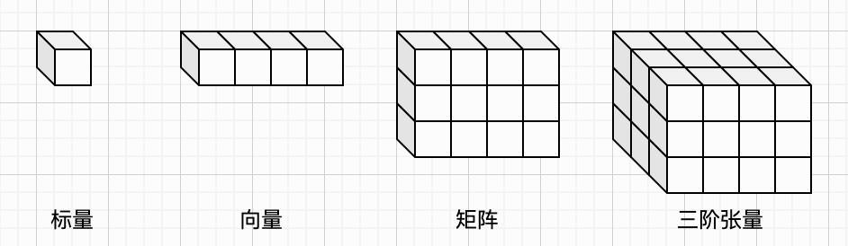
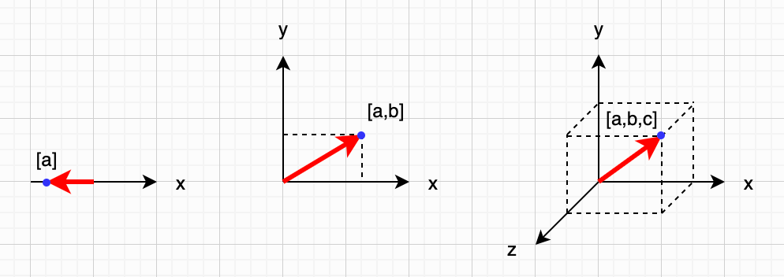

## 第零章：基础知识

如果可以的话，不用数学公式就把人工神经网络讲清楚，那当然是最理想的。不过很遗憾，这在实践中几乎做不到，除非只是停留在一些名词解释和宏观概念层面。

不过，二八原则在这里依然适用。实际上，我们只需要掌握少量的数学知识，就足以理解神经网络的大部分核心内容；而剩下那一小部分更深入的细节，才需要较强的数学功底，以及投入更多时间去仔细推敲。本书的目标，正是帮助读者用尽量少的数学工具，理解人工神经网络的主要思想和关键机制。

本章主要介绍线性代数中最基础的概念，具体来说，就是向量和矩阵，以及它们的一些基本运算规则，例如向量点积和矩阵乘法。这些内容是理解后续章节的基础。在此之前，我还会简单介绍一下不同维度的数据类型，帮助你建立直观的认识；而在本章的最后，也会简要介绍 NumPy 库和 PyTorch 框架，为后续代码部分做一个铺垫。

从实际经验来看，只要你没有把中学阶段的数学知识完全遗忘，理解向量和矩阵及其基本运算并不困难，大致相当于在四则运算的基础上稍微增加一点抽象程度而已。此外，像指数运算、方程、坐标系，以及一点点概率的基本概念，如果你还有印象，那就已经足够了。当然，如果这些内容已经比较生疏，也不必担心，可以在阅读过程中按需回顾，遇到不理解的地方再补一补即可。

好，我们先从“不同维度的数据”这个最直观的角度开始说起。


### 数据类型

维度这个概念，想必大家都不陌生。平时我们会去看2D或者3D动画电影，偶尔也会玩2D或者3D游戏。喜欢科幻小说的读者，应该也读过刘慈欣的《三体》，对“降维打击”也不陌生。

所谓的零维空间，其实就是一个点，除此之外什么也没有；一维空间可以理解为一条直线，上面可以有无数个点；二维空间则是一个平面，可以包含无数条直线；三维空间就是我们所生活的现实空间。至于再往上，如果再加上“时间”这个维度，有时也会把它粗略地理解为“四维时空”。而五维及更高维度的空间，就已经超出了大多数人的直觉范围，很难去想象。

在我们的日常经验中，连续空间是很自然、直观的。不过在神经网络和机器学习的语境中，我们通常不直接处理连续空间，而是更倾向于用“离散”的方式来表示数据。你可以把整个世界想象成由一个个小方格组成的结构，而不是连续的点、线、面、体。如果你玩过《我的世界》这种由方块构成的游戏，那这个类比就很好理解了：一切都是由离散的小单元拼接起来的。

在数学或编程语言中，我们通常用一个数（比如 `1.23`）来表示某种量的大小。这样一个单独的数，称为标量（Scalar），大致对应前面提到的“零维”。如果把多个标量按顺序排成一列（或一行），用来表示一组数据，就得到向量（Vector），可以类比为一维结构。如果把标量按行和列排成一个表格状的结构，就得到矩阵（Matrix），对应二维结构。如果再把数据像“魔方小方块”一样堆叠起来，就可以形成三维的数据结构。

再往更高维扩展时，就不再为每一种维度单独命名了，通常统一称为张量（Tensor）。例如，类似“魔方”的三维结构可以称为三阶张量，更高维则依次类推。从这个角度看，向量其实是一维张量，矩阵是二维张量，只不过在实际使用中，人们更习惯用“向量”和“矩阵”这些更具体的名称。

在这种离散的表示方式下，标量、向量、矩阵以及三阶张量的关系，可以通过下图更直观地理解：



在本书的公式和图表中，我们用小写字母（例如 $x$ ）来表示标量，用**粗体**小写字母（例如 $\mathbf{x}$ ）来表示向量，用大写字母（例如 $X$ ）来表示矩阵。这样一来，只要看字母的形态，就能分辨出它代表的是哪一种数据，不需要再依赖上下文去猜。如果出现三阶张量，我会用大写字母配合方括号来表示（例如 $[X]$ ），以便和矩阵做一个简单区分。更高阶的张量在正文中出现得不多，即使出现，也会结合具体语境进行解释。

在示例代码中，标量仍然用 Python 的 `float` 类型来表示；而向量、矩阵以及更高维的数据结构，统一用 NumPy 的数组（`np.array`）来表示。为了让代码和公式对得上，变量的命名也遵循一个简单约定：向量以 `vec` 开头，矩阵以 `mat` 开头。这样一来，读代码时不必回头去查某个变量到底是几维的，看名字就知道。

这里有一点需要提前说明。本书有少数代码的目的，恰恰是把某个运算**一步一步算给你看**——比如后面第一章会手写一个计算向量点积的函数，第三章会手写 Softmax 函数，第四章会手写卷积的加权求和。这些运算 NumPy 大多一行就能算完，可那样一来，要讲解的计算过程也就被藏起来了。所以这类函数我们仍然手写循环，把对应位置相乘、逐项累加的过程摊开。

但即便是这类手写实现，输入输出用的依然是 NumPy 数组——因为 NumPy 数组本身就可以逐元素遍历、也支持按下标取值，手写的循环照原样就能跑，不必退回 Python 原生列表。这样一来全书的数据类型是统一的，你也不会在“这里是列表、那里是数组”之间来回切换。我会在这类函数上方用注释注明 NumPy 的现成写法，你可以对照着看：上面是摊开的过程，下面是实际项目里该用的一行。

需要稍微提醒的是，在实际工程中（例如使用 PyTorch 时），这些数据还会用专门的张量类型来表示，在性能和功能上更强大。但在本书中，我们更关注概念本身，NumPy 数组已经足够表达全部要点。

维度、空间、离散数值、Python 数据类型，以及本书中符号表示之间的对应关系，可以通过下面这个表格来做一个整体性的理解：

| 维度 | 连续空间 | 离散数值       | Python类型 | 公式记法                        | 变量命名   |
| ---- | -------- | -------------- | ---------- | ------------------------------- | ---------- |
| 零维 | 点       | 标量（Scalar） | `float`    | 小写字母，例如 $x$              | 无特殊要求 |
| 一维 | 直线     | 向量（Vector） | `np.array` | 粗体小写字母，例如 $\mathbf{x}$ | `vec` 开头 |
| 二维 | 平面     | 矩阵（Matrix） | `np.array` | 大写字母，例如 $Y$              | `mat` 开头 |
| 三维 | 立体     | 三阶张量       | `np.array` | [大写字母]，例如 $[Z]$          |            |
| n维  |          | n阶张量        | `np.array` |                                 |            |

这张表对全书代码一律适用，包括上面提到的那些手写实现——它们只是把计算过程摊开写，用的数据类型仍然是 NumPy 数组。


### 向量

解释清楚了空间与维度的概念，以及连续和离散的差别之后，我们就可以更具体地来看向量了。重点是理解：向量与标量之间，以及向量与向量之间，是如何进行计算的。在本书中，当我们需要把向量或矩阵”展开”来看时，会把它们的元素写在方括号中，并按照固定顺序排列。例如，一个包含三个元素的向量 $\mathbf{a}$ ，可以表示为： $[a_1, a_2, a_3]$ 。

我们先来看向量与标量的四则运算。先说明：无论是“向量在左、标量在右”，还是“标量在左、向量在右”，结果都是一样的。计算时，只需要把这个标量依次作用到向量的每一个元素上即可，最终得到的结果仍然是一个向量。以加法为例，其含义就是把标量分别加到向量的每个元素上，计算公式如下：

$$
[a_1, a_2, ..., a_n] + b = [a_1 + b, a_2 + b, ..., a_n + b]
$$

进一步来说，如果有一个函数原本是作用在标量上的，那么我们也可以将它扩展到向量上：也就是让该函数分别作用于向量的每一个元素，最终得到一个新的向量。前面介绍的加法运算其实只是这类函数的一个特例，而无论函数多么复杂，都可以用同样的方式理解。我们用小写字母 `f` 表示任意函数，那么将 `f` 作用于向量的效果可以用下面的公式表示：

$$
f([a_1, a_2, ..., a_n]) = [f(a_1), f(a_2), ..., f(a_n)]
$$

接下来再看向量与向量之间的运算。向量之间同样可以进行加法和减法运算，但这里需要特别注意一个前提：两个向量的长度（也就是元素的个数）必须相同，否则无法逐元素对应计算。以加法为例，就是把两个向量中“位置相同”的元素一一相加，得到一个新的向量，计算公式如下：

$$
[a_1, a_2, ..., a_n] + [b_1, b_2, ..., b_n] = [a_1 + b_1, a_2 + b_2, ... , a_n + b_n]
$$

除了逐元素的加减运算之外，还有一种非常重要的运算，叫做向量的**点积**（Dot Product）。对于两个长度相同的向量，我们可以先按顺序将对应位置的元素两两相乘，然后把所有乘积加起来，最终得到一个标量，这就是点积运算的结果。我们可以使用数学中的求和符号来更清晰地表达“累加”的过程，向量点积的计算公式如下：

$$
[a_1, a_2, ..., a_n] \cdot [b_1, b_2, ..., b_n] = \sum_{i=1}^n{a_i \cdot b_i}
$$

讲到这里，我需要给不太熟悉向量的读者做一个补充说明。很多人之所以会感到困惑，是因为“向量”在不同的语境下，可能代表不同的含义。在前一小节中，我们把向量当作一组按顺序排列的离散数值（类似一个一维数组）来理解。但在几何意义上，向量也可以表示某个空间中的“点”或者“方向”。比如下图中的左、中、右三幅示意，分别展示了一维空间、二维空间和三维空间中的点与方向。



当我们用向量来表示空间中的点或方向时，向量中包含的元素个数，就对应了它所在空间的维度。比如，只包含一个数值的向量，可以表示一维空间中的位置；包含两个数值的向量，可以表示二维平面中的点或方向；包含三个数值的向量，则可以表示三维空间中的点或方向。在这个语境下，我们把向量所包含的数值个数称为向量的**维度**。

如此一来，尽管高维空间本身难以直观想象，但高维空间中的 “点” 却可以很方便地用向量表示，只需要用更多的数值来描述其位置即可。从这个角度看，向量既是一组数据的集合，也是连接“数据表示”与“几何直觉”的重要桥梁。


### 矩阵

如果已经理解了向量，那么矩阵其实就很好理解了。如果把向量想象成一列队伍，那矩阵则像做广播体操时排成的方阵，每个人对应一个元素。由于矩阵是二维结构，我们通常用“行数 × 列数”来描述它的形状（Shape）。按照惯例，在本书中，我们把一个有 n 行 m 列的矩阵称为一个 n×m 矩阵。

对于标量与矩阵之间的运算，以及矩阵与矩阵的加减运算，其规则和向量是类似的。先来看矩阵与标量的加法：只需要把这个标量加到矩阵的每一个元素上即可，结果仍然是一个矩阵。为了便于观察，我们以一个 2×3 的矩阵为例，对应的计算公式如下所示：

$$
\begin{bmatrix}
a_{11} & a_{12} & a_{13} \\
a_{21} & a_{22} & a_{23}
\end{bmatrix} + b =
\begin{bmatrix}
a_{11}+b & a_{12}+b & a_{13}+b \\
a_{21}+b & a_{22}+b & a_{23}+b
\end{bmatrix}
$$

正如前一小节所说，加法本质上只是一个特殊的函数。更一般地，对于任意一个作用在标量上的函数 `f`，我们都可以把它扩展到矩阵上：也就是让这个函数分别作用在矩阵的每一个元素上，最终得到一个新的矩阵。还是以 2×3 矩阵为例，其计算公式如下所示：

$$
f(\begin{bmatrix}
a_{11} & a_{12} & a_{13} \\
a_{21} & a_{22} & a_{23}
\end{bmatrix}) = 
\begin{bmatrix}
f(a_{11}) & f(a_{12}) & f(a_{13}) \\
f(a_{21}) & f(a_{22}) & f(a_{23})
\end{bmatrix}
$$

矩阵与矩阵之间的加减法，同样是逐元素进行的。因此，参与运算的两个矩阵必须具有完全相同的形状（行数和列数都一致），计算结果也保持相同的形状。我们仍然以 2×3 矩阵为例，矩阵加法的计算公式如下所示：

$$
\begin{bmatrix}
a_{11} & a_{12} & a_{13} \\
a_{21} & a_{22} & a_{23}
\end{bmatrix} +
\begin{bmatrix}
b_{11} & b_{12} & b_{13} \\
b_{21} & b_{22} & b_{23}
\end{bmatrix} =
\begin{bmatrix}
a_{11} + b_{11} & a_{12} + b_{12} & a_{13} + b_{13} \\
a_{21} + b_{21} & a_{22} + b_{22} & a_{23} + b_{23} \\
\end{bmatrix}
$$

这里特别说明一下：如果把上述逐元素计算中的“加法”替换为“乘法”，那么这种运算有一个专门的名字，叫做矩阵的哈达玛积（Hadamard Product），通常用一个带点的小圆圈符号来表示。这种运算在神经网络中也非常常见，因此我们也单独给出它的计算公式：

$$
\begin{bmatrix}
a_{11} & a_{12} & a_{13} \\
a_{21} & a_{22} & a_{23}
\end{bmatrix} \odot
\begin{bmatrix}
b_{11} & b_{12} & b_{13} \\
b_{21} & b_{22} & b_{23}
\end{bmatrix} =
\begin{bmatrix}
a_{11} \cdot b_{11} & a_{12} \cdot b_{12} & a_{13} \cdot b_{13} \\
a_{21} \cdot b_{21} & a_{22} \cdot b_{22} & a_{23} \cdot b_{23} \\
\end{bmatrix}
$$

最后，也是最重要的一种运算，是矩阵与矩阵的乘法。需要注意的是，矩阵乘法并不是把两个矩阵中对应位置的元素相乘（那是刚刚提到的哈达玛积）。矩阵乘法的规则稍微复杂一些，不太适合直接从公式入手理解。不过，如果我们把矩阵看作由“行向量”和“列向量”组成的集合，并用 `row(A, n)` 表示矩阵 A 的第 n 行，用 `col(B, n)` 表示矩阵 B 的第 n 列，那么矩阵乘法就可以理解为：用 A 的每一行，与 B 的每一列做向量点积，从而得到结果矩阵中的对应元素。以两个较小的矩阵为例，乘法计算公式如下所示：

$$
\begin{bmatrix}
a_{11} & a_{12} & a_{13} \\
a_{21} & a_{22} & a_{23}
\end{bmatrix} \times
\begin{bmatrix}
b_{11} & b_{12} \\
b_{21} & b_{22} \\
b_{31} & b_{32}
\end{bmatrix} =
\begin{bmatrix}
\mathrm{row}(A, 1) \cdot \mathrm{col}(B, 1) & \mathrm{row}(A, 1) \cdot \mathrm{col}(B, 2) \\
\mathrm{row}(A, 2) \cdot \mathrm{col}(B, 1) & \mathrm{row}(A, 2) \cdot \mathrm{col}(B, 2) \\
\end{bmatrix}
$$

需要特别注意的是，从这个定义可以看出，矩阵乘法并不要求两个矩阵的形状完全一致，但必须满足一个条件：前一个矩阵的列数，要等于后一个矩阵的行数。一般来说，一个 n×m 的矩阵与一个 m×k 的矩阵相乘，得到的结果是一个 n×k 的矩阵。


### NumPy

NumPy 是 Python 生态中一个非常重要、也非常常用的库，几乎是进行数学计算、科学计算以及编写 AI 相关代码时的“标配”。NumPy 提供了一个 `array()` 方法，可以通过 Python 原生的列表，方便地构造出向量、矩阵，乃至更高维的张量。基于这些数据结构，我们就可以使用 NumPy 提供的一系列函数，在标量、向量和矩阵之间进行高效而简洁的计算。

以向量为例，下面的代码展示了常见的一些运算方式。需要特别注意的是，在 NumPy 中，默认的乘法是逐元素相乘，而不是向量点积。如果需要计算点积，可以使用 `@` 运算符来实现。

```python
import numpy as np

vec_a = np.array([1, 2, 3])
vec_b = np.array([4, 5, 6])

print(vec_a + 1)     # [2 3 4]
print(vec_a * 2)     # [2 4 6]
print(vec_a + vec_b) # [5 7 9]
print(vec_a - vec_b) # [-3 -3 -3]
print(vec_a * vec_b) # [ 4 10 18]
print(vec_a @ vec_b) # 32
```

接下来是矩阵的相关计算示例。通过 `shape` 属性，我们可以方便地获取一个矩阵（或者更高维张量）的形状信息。在矩阵运算中，同样需要注意：默认的乘法依然是逐元素相乘（也就是前面提到的哈达玛积）；如果需要进行标准的矩阵乘法，也需要使用 `@` 运算符来表示。

```python
import numpy as np

mat_a = np.array([[1, 2, 3], [4, 5, 6]])
mat_b = np.array([[2, 3, 4], [5, 6, 7]])
mat_c = np.array([[1, 2], [3, 4], [5, 6]])

print(mat_a.shape)   # (2, 3)
print(mat_c.shape)   # (3, 2)
print(mat_a + 1)     # [[ 2  3  4] [ 5  6  7]]
print(mat_a * 2)     # [[ 2  4  6] [ 8 10 12]]
print(mat_a + mat_b) # [[ 3  5  7] [ 9 11 13]]
print(mat_a - mat_b) # [[-1 -1 -1] [-1 -1 -1]]
print(mat_a * mat_b) # [[ 2  6 12] [20 30 42]]
print(mat_b * mat_a) # [[ 2  6 12] [20 30 42]]
print(mat_a @ mat_c) # [[22 28] [49 64]]
print(mat_c @ mat_a) # [[ 9 12 15] [19 26 33] [29 40 51]]
```

对于三阶及以上的张量，本书不会涉及太多具体的计算细节，因此这里不再展开演示。在后续章节中，无论是详细展示某一步的计算过程，还是只关心整体流程，向量和矩阵都统一用 NumPy 数组来书写，变量命名也统一遵循前面提到的 `vec` / `mat` 约定，这样各章的代码彼此对得上，读起来也和公式一致。


### PyTorch

PyTorch 是一个基于 Python 语言的深度学习框架，最初由 Facebook（现 Meta）推出，目前由社区与企业共同维护与发展。它在学术研究和工业实践中都被广泛使用，因其灵活性和易用性而受到欢迎。除了 PyTorch 之外，常见的深度学习框架还包括 TensorFlow 等。

正如前言中提到的，本书中的示例代码大致分为两类：一类是用于帮助理解概念的“玩具代码”，另一类是可以实际运行的示例代码。对于后者，本书统一采用 PyTorch 来实现。

由于篇幅所限，这里不会详细介绍 PyTorch 的安装步骤或完整使用方法。在本书中，我们更多是把 PyTorch 当作一种“描述神经网络的工具”，重点关注模型的结构和计算流程，而不是框架本身的各种细节用法。如果你希望进一步学习 PyTorch，或者想在本地运行本书中的示例代码，可以查阅官方文档，或者参考一些专门介绍 PyTorch 的书籍和教程。


### 本章小结

在本章中，我们首先讨论了空间与维度的基本概念，以及连续空间与离散表示之间的差异。随后介绍了向量和矩阵的定义，并讲解了它们的基本运算规则，尤其是向量的点积和矩阵的乘法这两个后续会频繁用到的核心操作。接着，我们还简要了解了 NumPy 的基本用法，以及 PyTorch 框架的一些基础概念。

读完这一章，你已经打下了一个比较扎实的基础，足以理解后文中绝大部分涉及的公式和代码表达。当然，随着内容逐渐深入，个别细节可能仍需要反复体会，但整体阅读已经不会有太大障碍。从下一章开始，我们将正式进入人工神经网络的世界。在继续前行之前，不妨稍作休整，以更好的状态开启一个全新的学习阶段。
