## 第一章：人工神经元

大家有没有和孩子一起拼过积木模型？这种模型买回来时，是一大堆带有凸起与凹槽的塑料积木块，再配上一张拼装图纸。我们只要按照图纸，把积木一块一块、一层一层地拼接、垒叠起来，最后就能拼出一个完整又漂亮的模型（可以是人偶、动物、汽车，也可以是建筑物）。搭建人工神经网络也是一样的道理。先设计好整体的网络架构，再一层一层地构造、连接起来，最终就形成了一个完整的神经网络。

拼积木模型，首先得有积木块。搭建人工神经网络也是一样，首先得有人工神经元。如果你明白人工神经元是如何工作的，也理解每一层是如何运作的，那你就基本弄懂了整个人工神经网络是怎么起作用的。本章的任务，就是带你搞清楚：什么是人工神经元，以及它究竟是如何工作的。


### 最简单的神经元

我们的大脑大约有几百亿个神经元，它们相互连接，构成了一个无比庞大的神经网络。如果想用计算机程序模拟人类大脑，自然也要从模拟神经元开始，再逐步搭建出复杂的网络。这种由计算机程序模拟出来的神经元，叫作人工神经元（Artificial Neuron）；由大量人工神经元组成的网络，就是人工神经网络（Artificial Neural Network，简称ANN）。本书只围绕人工神经元展开讲解，在没有歧义的情况下，后文会直接简称其为**神经元**。

那么神经元起什么作用呢？传递信号。一个神经元会从其他神经元接收若干输入信号，再产生输出信号传递给其他神经元。我们先从最简单的情况入手：只接收一个输入，产生一个输出。我们用空心圆来表示神经元，用小写英文字母来表示信号。于是，一个最简单的神经元就如下图所示：

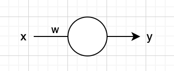

上图里的 $w$ 是什么呢？它是一个系数，用来根据输入信号 $x$ 计算输出信号 $y$ 。这里的 $x$ 、 $y$ 、 $w$ 都可以是任意实数。输入信号 $x$ 乘以系数 $w$ 就得到了输出信号 $y$ ，就这么简单。这一计算可以用方程表示为：

$$
y = wx
$$

如果我们把上面的人工神经元放大，把系数 $w$ 以及计算过程画在神经元内部，那么它看起来像是下面这样：

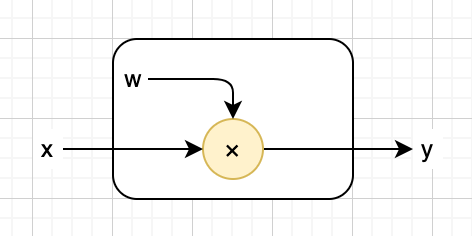

啥？这就是神经元？眼尖的读者一眼就能看出来，这不就是数学里最简单的**函数**（Function）吗？输入是 $x$ ，输出是 $y$ 。而且它对应的就是一个直线方程，表示平面直角坐标系中穿过原点的一条直线，斜率是 $w$ 。当 $w=2$ 时，这条直线就是[下面](https://www.desmos.com/calculator/pyztpgmk36?lang=zh-CN)这样：

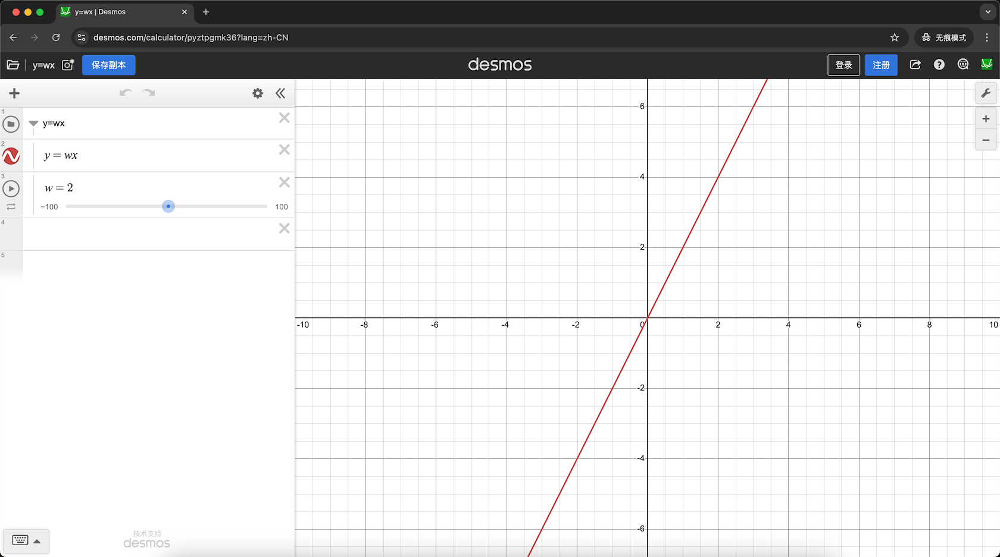

你是对的，而且这个结论非常重要。一个神经元就是一个函数，甚至整个人工神经网络，本质上也是一个超级复杂的函数。如果你暂时不理解也没关系，本书会慢慢为你解释这一点。我们用小写字母 $f$ 来表示函数，于是上面的等式可以重新写为：

$$
y = f(x) = wx
$$

好了，我们已经构造出了一个最简单的人工神经网络。它简单到甚至还称不上真正的“网络”，因为里面只有一个神经元。这个神经元也只有一个输入、一个输出。我们把这个系数 $w$ 称为神经元的**参数**（Parameter），调整它就能对应到不同斜率的直线。也就是说，我们这个神经网络，只有一个参数。而与之形成巨大反差的是，如今最前沿的大模型，参数数量可能高达数万亿！

那么，我们这个微不足道的迷你神经网络，到底能做些什么呢？答案很直观：它能根据给定的x坐标，“预测”出某条经过原点的直线上对应点的y坐标。我们用几行Python代码就可以实现这个神经网络，代码如下所示：

```python
def new_neuron(w: float):
    return lambda x: w * x

neuron = new_neuron(2) # w=2
print(neuron(1.2)) # 2.4
```

或许你心里还会有个疑问：这个参数为什么要用字母 $w$ 来表示？别急，在后面“加权求和”这一小节里，我会给你解释。


### 偏置

既然我们的神经元已经能根据x坐标（输入），“预测”一条直线上某个点的y坐标（输出），那何必非要限制这条直线必须经过原点呢？回想一下，参数 $w$ 代表的是直线的斜率，也就是直线的倾斜程度。只需要再增加一个表示截距的参数就够了，这样就能让直线沿y轴“平移”，不用再死死卡在原点上。我们称这个新参数为**偏置**（Bias），用小写字母 $b$ 表示，并把它写在神经元里面，如下图所示：

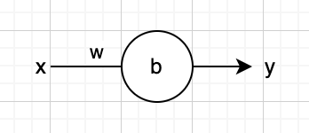

现在，我们的神经元表示的函数更强大一些了，因此需要更新一下它的等式，把偏置加上去。为清晰起见，我们还是把函数和直线完整的斜截式方程写在一起，如下所示：

$$
y = f(x) = wx + b
$$

我们把放大的神经元示意图也修改一下，把偏置的计算画进去，现在它看起来是下面这样：

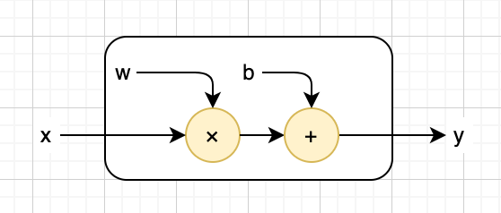

回到直线方程，假设某个神经元的参数 $w$ （斜率）为 3，参数 $b$ （截距）为 4，那么它对应的直线就如[下图](https://www.desmos.com/calculator/eyx6eo0mjx?lang=zh-CN)所示。如果你看的是本书电子版，可以点开这个链接，调整 $w$ 和 $b$ 的数值，观察直线的变化。

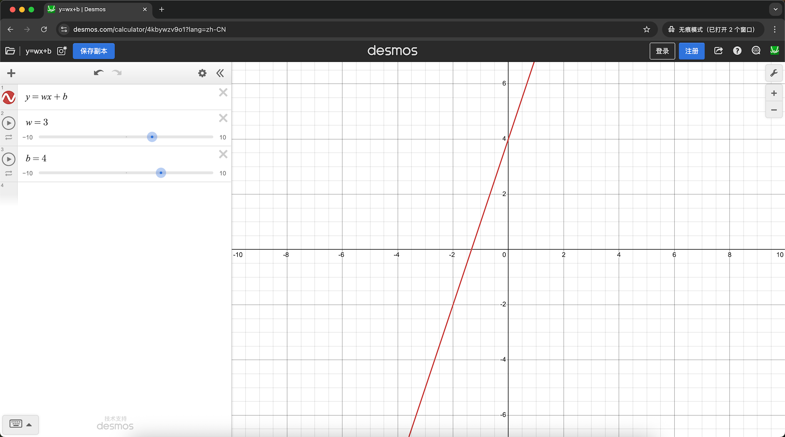

既然我们这个小小的“神经网络”已经变强了一点点，多了个参数 $b$ ，那我们也得修改之前的Python代码，把这个参数加进去。修改之后的代码如下：

```python
def new_neuron(w: float, b: float):
    return lambda x: w * x + b

neuron = new_neuron(3, 4) # w=3, b=4
print(neuron(2.5)) # 11.5
```


### 激活函数

如果你学过线性代数，就会发现，我们的神经元目前只能通过对输入做**线性变换**（Linear Transformation）来得到输出。就算你不懂线性代数也没关系，你只需要记住：我们的神经元现在只会计算直线。那要怎样才能让神经元计算更复杂的曲线呢？答案很简单：给输出加一个非线性变换。也就是说，神经元不直接输出 $y$ ，而是先把 $y$ 放进另一个函数里算一遍，然后再输出最终结果。我们用小写希腊字母 $\sigma$ 来表示这个函数，并把它画在神经元的输出线上，如下图所示：

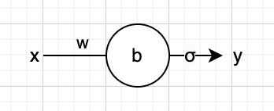

引入非线性变换后，我们的神经元变得更加强大了。现在，它表示的函数如下所示：

$$
y = f(x) = \sigma(wx + b)
$$

我们继续修改放大版的神经元示意图，把激活函数的计算也画进去，现在它看起来是下面这样：

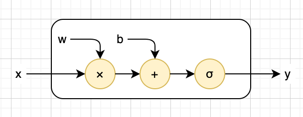

在人工神经网络中，这个用来引入非线性变换的函数，就叫做**激活函数**（Activation Function）。这个名字，直接来自它的核心功能：决定神经元是否被激活，以及激活到什么程度。如果你暂时还不太理解，也不用纠结，只要先看懂上面的公式就够了。随着你慢慢深入学习人工神经网络，自然会越来越明白它的作用。

那么真正的问题来了：激活函数到底长啥样呢？答案是，激活函数有很多种。这里我们先介绍三个最经典、最常用的。第一个激活函数叫做**Sigmoid**（也叫S型函数）。如果把它画出来，形状就像字母S，因此得名。它会把任意数值压缩到0～1之间，经常用来输出概率。下面是Sigmoid激活函数的定义：

$$
\mathrm{Sigmoid}(x) = \frac{1}{1+e^{-x}}
$$

这里 $e$ 表示自然常数，也叫欧拉数。如果用Python来实现Sigmoid函数，代码可能是下面这样：

```python
from math import e

def sigmoid(x: float) -> float:
    return 1 / (1 + e ** (-x))
```

第二个是**双曲正切函数**（Hyperbolic Tangent，简称Tanh），它会把任意数值压缩到-1～1之间。听名字就很复杂，对吧？其实公式本身很简单，下面是Tanh激活函数的定义：

$$
\mathrm{Tanh}(x) = \frac{e^x - e^{-x}}{e^x + e^{-x}}
$$

如果用Python来实现Tanh函数，代码可能是下面这样：

```python
def tanh(x: float) -> float:
    a, b = e ** x, e ** (-x)
    return (a - b) / (a + b)
```

第三个是**修正线性单元**（Rectified Linear Unit，简称ReLU）。是不是名字听起来也很吓人？不过相比Sigmoid和Tanh，这个激活函数倒是特别简单：它会把小于0的数值都变成0，大于等于0的数值保持不变。下面是ReLU激活函数的定义：

$$
\mathrm{ReLU}(x) = \mathrm{max}(0, x)
$$

如果用Python来实现ReLU函数，代码可能是下面这样：

```python
def relu(x: float) -> float:
    return x if x >= 0 else 0
```

仅从数学公式来看，很难直观地理解这些激活函数。将它们画在坐标系中，会更容易看出它们的特点。下面是 [Sigmoid](https://www.desmos.com/calculator/97wpmsaney)、[Tanh](https://www.desmos.com/calculator/tuldscdhoa)和[ReLU](https://www.desmos.com/calculator/kxppk5qyd7)激活函数的图像：

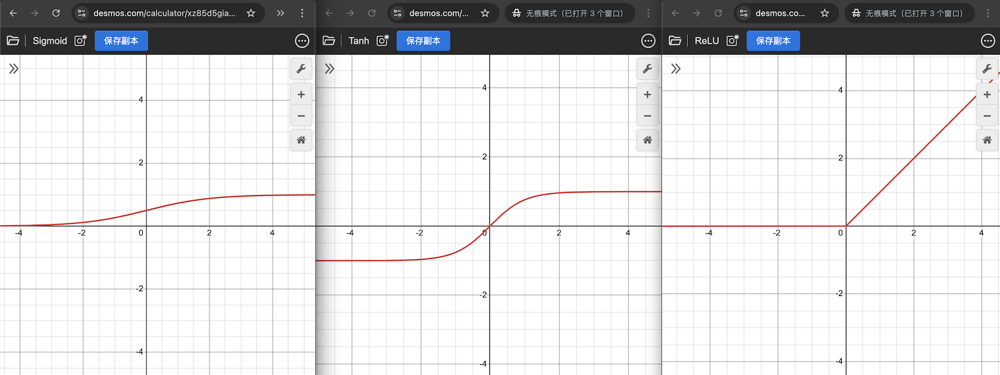

讲到这里，我需要说明几点。第一，小写希腊字母 $\sigma$ 通常专门用来表示Sigmoid激活函数，但在本书中，我们用它来泛指所有激活函数。第二，虽然引入激活函数后，我们小小的神经元变得更加强大了，但到目前为止，它依然只有 $w$ 和 $b$ 两个参数。至于在真正的人工神经网络中该如何选择激活函数，这是个很重要的问题，我们留到后面再详细讨论。

在之前的Python代码中，我们在构造神经元时传入了 $w$ 和 $b$ 这两个参数；现在，我们把激活函数也作为“参数”传入。修改后的代码如下：

```python
def new_neuron(w: float, b: float, af):
    return lambda x: af(w * x + b)

neuron1 = new_neuron(w=1, b=2, af=sigmoid)
neuron2 = new_neuron(w=3, b=4, af=tanh)
neuron3 = new_neuron(w=5, b=6, af=relu)
print(neuron1(-1.2)) # 0.6899744811276125
print(neuron2(-3.4)) # -0.9999917628565104
print(neuron3(-5.6)) # 0
```


### 加权求和

我们前面构造的神经元都只有一个输入和一个输出，这样的神经元只能连成一串，无法形成真正的网络。为了突破这个限制，我们需要让网络既能接收多个输入，也能产生多个输出。这两件事的解决办法并不一样：多个输入靠单个神经元自己就能做到，也就是本章接下来要讲的；而多个输出，靠的是把多个神经元并排摆在一起，我们留到下一章再说。假设某个神经元有三个输入，它的结构就如下图所示：

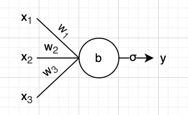

因为神经元有三个输入，所以参数 $w$ 也对应变成了三个（和输入一一匹配）。需要注意的是，偏置参数 $b$ 依然只有一个。相应地，神经元所表示的函数形式也发生了变化，新的计算公式如下所示：

$$
y = f(x_1, x_2, x_3) = \sigma(w_1 x_1 + w_2 x_2 + w_3 x_3 + b)
$$

聪明的读者一定已经看出来了吧？我们先把 $w$ 和 $x$ 一一相乘，再把所有乘积加起来，这正是经典的**加权求和**。这里的每一个 $w$ ，就是对应输入 $x$ 的**权重**（Weight）。参数 $w$ 这个名字，正是取自英文单词权重的首字母。得到加权求和之后，再把偏置 $b$ 也加上，然后再把结果送进激活函数就可以得到最终输出。我们把这些细节画进放大版的神经元示意图中，现在它看起来是下面这样：

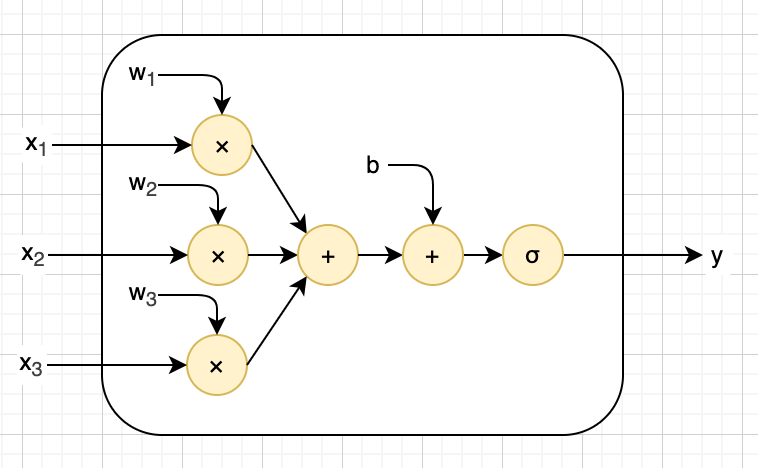

如果我们看懂了上面的图，也明白了全部的计算过程，就可以把神经元所接收的输入泛化到任意多个，并用数学里的求和符号来简化公式。新的函数和计算公式如下所示：

$$
y = f(x_1, x_2, ..., x_n) = \sigma(\sum_{i=1}^{n}{w_i x_i} + b)
$$

上面的等式看起来已经清爽多了，但还能进一步简化吗？答案是肯定的，我们有请**向量**（Vector）登场。假如某个神经元有n个输入，我们可以把这n个 $x$ 写成向量形式 $[x_1, x_2, ..., x_n]$ ，并用粗体小写字母 $\mathbf{x}$ 表示。相应的，我们把n个权重 $w$ 也写成向量形式 $[w_1, w_2, ..., w_n]$ ，并用粗体小写字母 $\mathbf{w}$ 表示。我们知道，向量**点积**正好可以用来计算加权求和：

$$
\mathbf{w} \cdot \mathbf{x} = w_1 x_1 + w_2 x_2 + ... + w_n x_n = \sum_{i=1}^n{w_i x_i}
$$

于是，我们就可以用向量和点积来简化神经元对应的函数与计算公式。新的等式如下所示：

$$
y = f(\mathbf{x}) = \sigma(\mathbf{w} \cdot \mathbf{x} + b)
$$

注意，上面这个简化意义重大。第一，等式重新变得非常简洁；第二，表达的含义也十分明确：我们的神经元现在接收向量作为输入，输出单个数值；第三，也是最重要的一点：这种向量计算可以直接交给计算机的图形处理器（Graphics Processing Unit，简称GPU）来优化执行，比直接在中央处理器（Central Processing Unit，简称CPU）上快好几个数量级。

GPU在通用计算上不如CPU，但非常擅长向量点积这类运算，能够大规模并行执行大量计算任务。虽然对单个神经元来说，在CPU还是GPU上计算差别不大，但对于动辄拥有成百上千亿个参数的神经网络而言，两者的速度就有天壤之别了。

现在我们来修改前面的Python代码，主要做两处调整：第一，构造神经元时，将参数 $w$ 从单个数值改为 NumPy 数组（用以表示向量）；第二，神经元计算环节，把普通乘法替换为向量点积。点积本身 NumPy 一个运算符就能算完，但这里我们先手写一遍，把“对应位置相乘再累加”这个过程摊开看清楚。新增的点积函数，以及修改后的神经元构造函数，代码如下：

```python
import numpy as np

# 手写实现，用于逐步演示点积的计算过程。
# NumPy 有现成实现：vec_a @ vec_b（也可以写成 np.dot(vec_a, vec_b)）
def dot_product(vec_a: np.ndarray, vec_b: np.ndarray) -> float:
    return sum(x * y for x, y in zip(vec_a, vec_b))

def new_neuron(vec_w: np.ndarray, b: float, af):
    return lambda vec_x: af(dot_product(vec_w, vec_x) + b)
```

神经元的代码已经准备就绪，现在我们用它来搭建一个简单的应用案例：这个应用接收三个输入 $x_1$ 、 $x_2$ 、 $x_3$ ，判断 $x_1$ 与 $x_2$ 之和是否大于 $x_3$ ，并将判断结果作为输出。对我们实现的神经元来说，完成这个任务易如反掌，只需为它设置合适的权重和偏置参数即可。将三个权重分别设置为：1、1、-1，将偏置设置为0，我们期望的计算如以下等式所示：

$$
y = 1 \times x_1 + 1 \times x_2 + (-1) \times x_3 + 0
$$

这里其实不用激活函数也可行，不过为了演示效果，我们选用最简单的ReLU函数。若最终输出大于0，就表示 $x_1$ 与 $x_2$ 之和确实大于 $x_3$ ；否则表示不大于。完整的应用代码和测试如下：

```python
neuron = new_neuron(vec_w=np.array([1, 1, -1]), b=0, af=relu)
print(neuron(np.array([1, 2, 3])) > 0) # False
print(neuron(np.array([4, 5, 6])) > 0) # True
```

经过一番努力，我们的迷你“神经网络”已经拥有了四个参数（三个权重和一个偏置），它能判断某两个数之和是否大于第三个数。是不是很了不起？我们可以把它封装起来，对外提供服务啦，如下图所示：

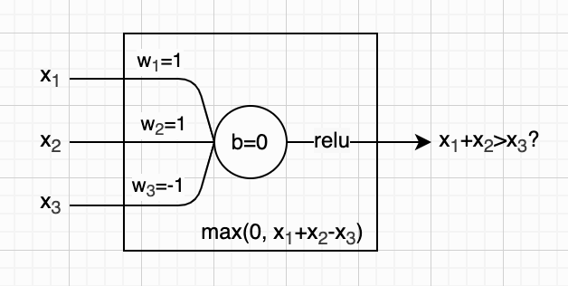


### MCP神经元

很多人会以为，人工神经元和神经网络是近几年才出现的时髦技术，其实不然。人工神经元的概念，早在1943年就已经诞生了。它由神经生理学家沃伦・麦卡洛克（[Warren McCulloch](https://en.wikipedia.org/wiki/Warren_Sturgis_McCulloch)）和逻辑学家沃尔特・皮茨（[Walter Pitts](https://en.wikipedia.org/wiki/Walter_Pitts)）在研究大脑工作机制后共同提出，初衷就是用机器模拟人类大脑的神经活动。这在当时是极具前瞻性的想法！要知道，那时候还没有真正进入计算机时代呢，世界上第一台通用电子计算机[ENIAC](https://en.wikipedia.org/wiki/ENIAC)直到三年后（1946年）才问世。

为了纪念这两位先驱，后人将他们提出的人工神经元模型命名为McCulloch–Pitts神经元，简称MCP神经元。MCP 神经元与本章介绍的神经元工作原理十分相似，感兴趣的读者可以查阅相关资料或阅读当年的原始[论文](https://en.wikipedia.org/wiki/A_Logical_Calculus_of_the_Ideas_Immanent_in_Nervous_Activity)，进一步深入学习。

MCP神经元的想法在当时实在太过超前，受限于那个年代的技术条件，很难搭建出真正实用的神经网络。直到1958年，人类历史上第一个具备自动学习能力的人工神经网络才终于出现。它掀起了人工智能史上第一波热潮，却又因一本著作而迅速陷入低谷。这段有趣的历史，我会在下一章为你详细介绍。


### 人工智能

我们前面已经多次提及**人工智能**（Artificial Intelligence，简称 AI），这个词最早是在 1956 年的[达特茅斯夏季研究项目](https://en.wikipedia.org/wiki/Dartmouth_workshop)中正式提出的。该会议由约翰・麦卡锡（[John McCarthy](https://en.wikipedia.org/wiki/John_McCarthy_(computer_scientist))）、马文・明斯基（[Marvin Minsky](https://en.wikipedia.org/wiki/Marvin_Minsky)）、克劳德・香农（[Claude Shannon](https://en.wikipedia.org/wiki/Claude_Shannon)）与纳撒尼尔・罗切斯特（[Nathaniel Rochester](https://en.wikipedia.org/wiki/Nathaniel_Rochester_(computer_scientist))）共同发起，它也标志着人工智能作为一门独立学科正式诞生。

上述四位科学家都是计算机科学与人工智能领域里程碑式的人物，他们每一个人的成就都值得大书特书、深入研读。不过限于本书篇幅，我们这里仅列举他们成就中最具影响力的一两个核心亮点，其余诸多重要贡献，感兴趣的读者可以自行查阅相关资料进一步了解。

例如，约翰・麦卡锡是著名的 Lisp 语言发明者。这门语言成为早期人工智能研究的核心工具，深刻影响了后续编程语言的发展，同时他也是 1971 年图灵奖获得者，以其对人工智能学科的奠基性贡献，被公认为“AI 之父”之一。

马文・明斯基是早期神经网络与认知科学研究的先驱，同样是 1969 年图灵奖得主。他创建了麻省理工学院人工智能实验室，推动了认知科学与人工智能的深度融合。我们在下一章介绍感知机时，会重点介绍这位先驱者的核心贡献。

克劳德・香农则是信息论的创始人，被誉为“数字时代的奠基人”，他提出的信息熵等核心理论，不仅奠定了现代通信技术的基础，更为人工智能中的数据表示、信息处理与智能决策提供了不可替代的数学支撑。

纳撒尼尔・罗切斯特是汇编语言的重要开创者，极大降低了编程门槛，为计算机普及奠定了基础。同时他也是计算机体系结构与软件工程领域的早期奠基人，主导设计了 IBM 701 这一里程碑式的商用科学计算机。

总之，由这四位先驱共同发起的达特茅斯会议，极大地激发了学术界与工业界对智能机器研究的热情，吸引了大量资金、人才与项目投入，开启了人工智能发展史上的第一个黄金时代，是人工智能发展历程中最重要的里程碑。而这段黄金时代，会在十几年后因马文・明斯基与另一位人工智能先驱合著的一部著作，以及后续一系列研究争议与经费政策转向而骤然陷入低谷，这一关键转折我们也将在下一章末尾详细展开。


### 本章小结

本章我们从单输入、单输出且仅含一个权重参数的神经元入手，介绍了其基本概念；随后引入偏置参数，再讲解激活函数，让神经元具备了非线性输出能力；接着将参数推广至任意多个，并阐释了加权求和的核心原理；最后补充了MCP神经元以及“人工智能”的相关历史背景。

如果你理解了本章内容，一定会惊讶于人工神经元的原理竟如此简单。你或许很难相信，正是这些看似不起眼的小单元，能组合成复杂的神经网络，甚至展现出逼近人类的智能水平。但事实确实如此，下一章，我便会带你初步验证这一结论。
