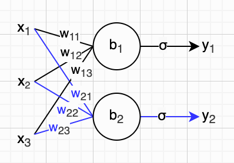
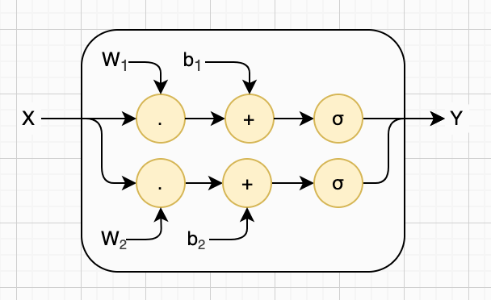
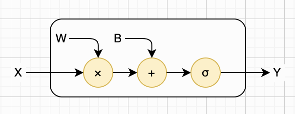
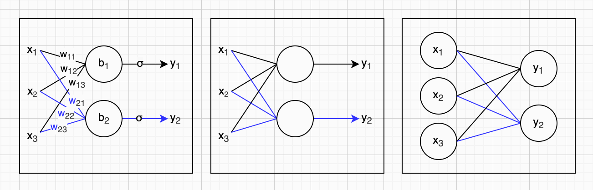
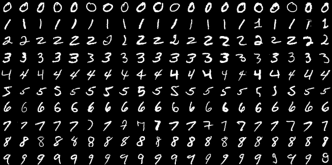
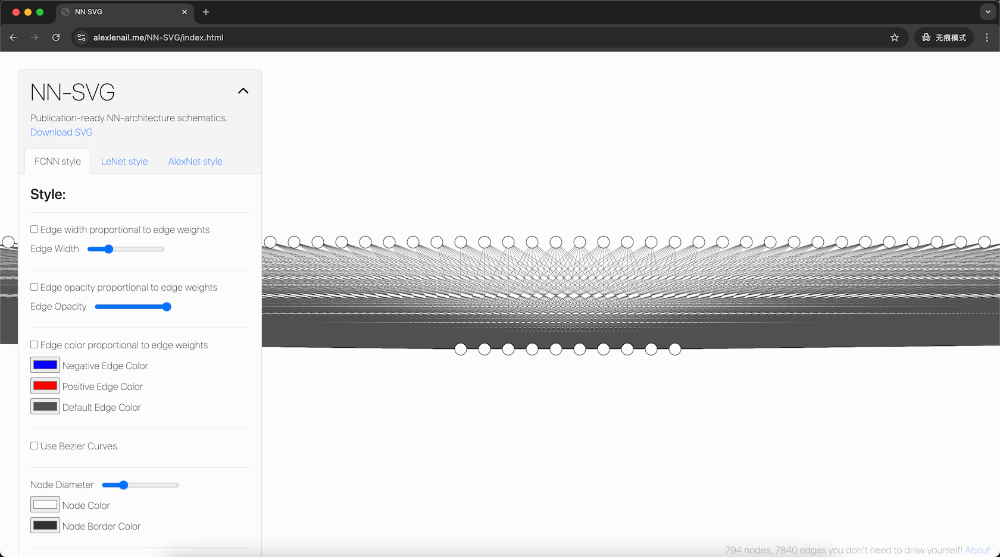
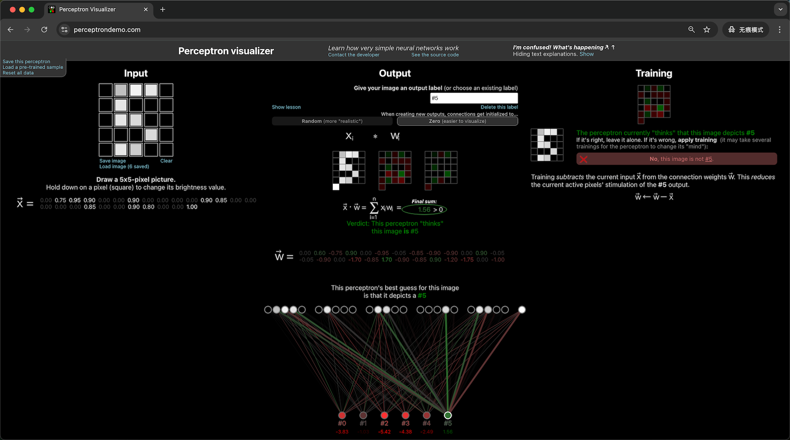
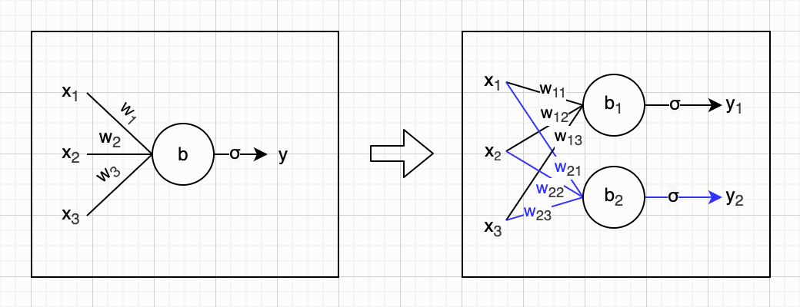

## 第二章：单层神经网络

在第一章中，我们已经了解了神经网络最基础的构成单元——神经元是如何工作的。我们知道，一个神经元的本质其实很简单：它先把n个输入分别与对应的权重相乘，再把所有结果加在一起；随后再加上一个偏置，对整体结果做一次平移调整；最后把这个值送入一个激活函数，完成一次非线性变换，输出最终结果。整个过程，就是人工神经元最核心的计算逻辑。

不过，单个神经元的能力终究是有限的。可一旦把大量神经元相互连接，组成一张神经网络，它能实现的功能就会变得异常强大。神经网络的结构，通常是一层一层搭建起来的。在本章，我会先带你认识单层神经网络，你很快就能直观感受到它的威力。而在下一章，我们再继续深入，一起学习更复杂的多层神经网络。


### 两个神经元

到目前为止，我们一直都在让单个神经元单打独斗。接下来，我们给它配上一个小伙伴，让它们一起工作，构成一个真正意义上的神经网络。为了画图和讲解方便，我们依然假设该网络有三个输入。这三个输入会同时被两个神经元完整接收，各自完成计算，最终分别输出一个结果，一共得到两个输出。这个简单的小神经网络，参数已经达到了八个（六个权重加两个偏置），结构如下图所示：



注意，虽然它们已经组成了一个小团队，但这两个神经元依然各自独立工作，不共享权重参数，彼此之间也并没有任何互动。我们在第一章已经学过单个神经元的工作原理，现在我们把这两个神经元的计算公式写在一起，如下所示：

$$
y_1 = f_1(x_1, x_2, x_3) = σ(w_{11} x_1 + w_{12} x_2 + w_{13} x_3 + b_1) \\
y_2 = f_2(x_1, x_2, x_3) = σ(w_{21} x_1 + w_{22} x_2 + w_{23} x_3 + b_2)
$$

还记得吗？我们可以用**向量**来简写输入列表与权重列表，再通过**点积**运算来完成输入的加权求和。举个例子，我们可以用大写字母 $W_1$ 表示向量 $[w_{11}, w_{12}, w_{13}]$ 。这样一来，上面的公式就可以简化成下面这样：

$$
y_1 = f_1(X) = σ(W_1 \cdot X + b_1) \\
y_2 = f_2(X) = σ(W_2 \cdot X + b_2)
$$

就像前一章一样，我们可以把上面这个由两个神经元组成的小网络放大，把计算细节画进去，如下图所示。注意，输入X、权重W，以及输出Y，全部都是大写字母，表示向量。



那么，前面这两个等式还能进一步简化吗？答案依然是肯定的。在数学中，我们把单个数值称为**标量**（Scalar）；把多个数值排成一行，放在小方括号里，就称为**向量**（Vector）；而把多个数值排成阵列形式，同样放在大方括号中，就叫作**矩阵**（Matrix）。比如，我们把六个权重参数排成两行三列，组合成一个矩阵，并用大写字母`W`表示，形式如下：

$$
W = \begin{bmatrix}
w_{11} & w_{12} & w_{13} \\
w_{21} & w_{22} & w_{23}
\end{bmatrix}
$$

顺便说一下，如果一个向量里有n个数值，我们就说这是一个n维向量。如果一个矩阵有n行m列，我们就说这是一个n×m矩阵。矩阵也可以只有一行数据，也就是说，向量其实是一种特殊的1×m矩阵。同样，矩阵也可以只有一列数据。因此，我们也可以把输入列表、输出列表、偏置列表都写成n×1矩阵形式，如下所示：

$$
X = \begin{bmatrix}
x_1 \\
x_2 \\
x_3
\end{bmatrix},
Y = \begin{bmatrix}
y_1 \\
y_2
\end{bmatrix},
B = \begin{bmatrix}
b_1 \\
b_2
\end{bmatrix}
$$


于是，我们就可以使用矩阵乘法和加法，重新写出由这两个神经元构成的小神经网络的计算公式。为了清晰起见，我们先把所有矩阵元素都明确写出来，完整公式如下所示。注意，当我们把矩阵丢给激活函数时，它会在矩阵的每一个元素上面起作用，输出一个同样大小的矩阵。

$$
\begin{bmatrix}
y_1 \\
y_2
\end{bmatrix}=σ(
\begin{bmatrix}
w_{11} & w_{12} & w_{13} \\
w_{21} & w_{22} & w_{23}
\end{bmatrix} \times
\begin{bmatrix}
x_1 \\
x_2 \\
x_3
\end{bmatrix} +
\begin{bmatrix}
b_1 \\
b_2
\end{bmatrix})
$$

也许你还不熟悉矩阵乘法的计算规则，这完全没关系。你可以去网上简单了解，也可以直接忽略不计。你只需要记住：上面这行紧凑的公式，和前面两行的公式是**完全等价**的。而且，用上矩阵之后，就算神经元和输入的数量再多，我们也能轻松表示。假设某个和上面结构类似的神经网络，有n个独立工作的神经元，接收m个输入，它的计算公式就可以写成：

$$
\begin{bmatrix}
y_1 \\
y_2 \\
\vdots \\
y_n
\end{bmatrix}=σ(
\begin{bmatrix}
w_{11} & w_{12} & \dots & w_{1m} \\
w_{21} & w_{22} & \dots & w_{2m} \\
\vdots & \vdots & \ddots & \vdots \\
w_{n1} & w_{n2} & \dots & w_{nm}
\end{bmatrix} \times
\begin{bmatrix}
x_1 \\
x_2 \\
\vdots \\
x_m
\end{bmatrix} +
\begin{bmatrix}
b_1 \\
b_2 \\
\vdots \\
b_n
\end{bmatrix})
$$

好的，相信你已经理解这个概念了。现在我们可以把矩阵里的具体元素隐藏起来，整个公式就又会变得非常简洁：

$$
Y = f(X) = σ(WX + B)
$$

我们利用矩阵乘法，可以把上面这个计算公式画进神经网络的内部，看起来是下面这样。注意，输入X、输出Y和偏置B仍然是列向量（或者说只有1列的矩阵），但是权重W是n×m矩阵。



还记得前一章我们提到，GPU特别擅长处理向量计算吗？其实这个说法并不够准确，主要是因为在上一章我们还没有介绍矩阵运算。事实上，GPU真正擅长的是矩阵运算。换句话说，我们这个神经网络的整套计算，完全可以直接交给GPU高效处理。借助矩阵，公式不仅看起来简洁，还天然隐含了计算上的优化，真是一举两得。

好了，我们的神经网络经历了一番蜕变：从单个输入到多个输入；从单个神经元到多个独立工作的神经元构成网络。它变复杂了，能力也变强了，但本质上仍然只是一个函数，而且函数的形式也没怎么变，不信你看下这张表：

| 神经网络                       | 公式                   | 说明                       |
| ------------------------------ | ---------------------- | -------------------------- |
| 单个神经元，单个输入，单个输出 | $y = f(x) = σ(wx + b)$ | $x$ 、 $y$ 、 $w$ 和 $b$ 都是标量 |
| 单个神经元，多个输入，单个输出 | $y = f(X) = σ(WX + b)$ | $X$ 和 $W$ 是向量             |
| 多个神经元，多个输入，多个输出 | $Y = f(X) = σ(WX + B)$ | $X$ 、 $Y$ 、 $W$ 和 $B$ 都是矩阵 |


### 简化网络图

如果神经网络只有几个神经元、少数输入，像前面那样画图，问题还不大。但我们接下来要面对的网络规模会相当可观，可能会有几百个神经元。如果还像之前那样细致画图，不仅十分繁琐，也不美观。因此，我们需要对图示进行简化。

具体来说，我们做五点简化：第一，权重不再逐一标出，你只需知道每条连接线上都对应一个权重参数即可；第二，偏置也不画出，你只需知道每个神经元都带有一个偏置参数；第三，激活函数同样隐藏，心里有数就行。做完这三点简化后，前面例子里的神经网络就可以画成下图（中）这样。

让我们继续简化。第四，去掉输出信号与连线，直接把输出值写在神经元内部；第五，把输入也视作神经元，并将输入值直接写进神经元里。经过这两步简化后，我们的神经网络就可以画成下图（右）这样：



好啦，我们化繁为简。从此以后，权重、偏置和激活函数，就都记在心里就好。那么问题来了：画成这样之后，我们的神经网络到底是一层，还是两层？从结构图上看，它确实包含输入层与输出层两层；但在神经网络的通用定义中，只有带可学习参数的层才被计入网络层数。因此，这是一个单层神经网络。重点在于，每一个输入神经元都与每一个输出神经元相连接，我们把这样的神经网络层叫做**全连接层**（Fully Connected Layer）。

另外，不难看出，假设某个全连接层有n个输入、m个输出，那么它对应的权重和偏置参数总数量可以用下面这个公式计算：

$$
params = (n + 1) \times m
$$


### 玩具全连接层

在第一章中，我们通过 Python 代码实现了基础的人工神经元，用于直观演示其工作原理。在本节，我们将继续用代码实现全连接网络层，展示其计算过程。为了省去手动实现矩阵乘法、向量加法等繁琐步骤，我们直接使用大名鼎鼎的 NumPy 库来完成这些计算。事实上，实现一个完整的全连接层非常简洁，除去库导入和测试代码，核心逻辑仅需两行，具体实现如下：

```python
import numpy as np

def new_fc_layer(w, b, af):
    return lambda x: af(w @ x + b)

w = np.array([[0.11, 0.12, 0.13],
              [0.21, 0.22, 0.23]])
b = np.array([0.31, 0.32])

layer = new_fc_layer(w, b, np.tanh) 
x = np.array([0.4, 0.5, 0.6])
print(layer(x)) # [0.45580236 0.57301481]
```

我们通过 NumPy 提供的 `array` 方法来创建矩阵与向量。特别需要注意代码中的 `@` 运算符，它是 NumPy 中专门用于矩阵乘法的符号。虽然输入参数 `x` 是一个一维向量，但 NumPy 会自动将其视为 3×1 的列向量参与运算，无需我们手动转换，使用起来非常方便。另外，NumPy还提供了Tanh激活函数，我们在测试代码里直接使用就可以了。


### MNIST数据集

前面我们的神经网络还太小，只能解决一些简单问题，比如预测直线上点的坐标、判断两个数是否大于第三个数，诸如此类。现在，我们终于可以挑战更复杂的任务了，比如人工神经网络领域的经典“Hello, World”案例：识别手写数字。不过在这之前，我们需要一些手写数字样本。好在这个麻烦早就有现成的解决方案，那就是[MNIST数据集](https://en.wikipedia.org/wiki/MNIST_database)。这一小节，我会简单介绍这个数据集，让你先有个基本认识。下一节我们就用Python代码写一个单层神经网络，并教它识别手写数字。

好，言归正传。MNIST数据集一共包含70,000张手写数字图片，其中60,000张用于训练，10,000张用于测试。这些图片都是灰度图，尺寸统一为28×28像素。也就是说，每张图片由784个像素点组成，每个像素占用一个字节，数值大小对应灰度深浅：0代表黑色，255代表白色。除此之外，每张图片还附带一个**标签**（Label），标明它对应的数字是0～9中的哪一个。你一定很好奇这些手写数字究竟长什么样，下面这张图就展示了其中一些例子：



那么，我们该从哪里获取MNIST数据集呢？本书的示例代码主要基于开源的深度学习框架PyTorch编写，用它下载并加载MNIST十分方便，绝大部分工作都会自动完成，具体可以参考下面的Python代码片段。如果你使用其他框架，通常也会提供类似的便捷方法。

```python
from torchvision import datasets, transforms

transform = transforms.ToTensor()
train_dataset = datasets.MNIST(root="./data", train=True, download=True, 
                               transform=transform)
test_dataset = datasets.MNIST(root="./data", train=False, 
                              transform=transform)
```

就算你暂时没看懂上面的代码也没关系，因为这也不是重点。你只需要知道：它会自动帮你把MNIST数据集下载到指定目录，并将训练数据和测试数据分别加载到内存中，供后续代码使用。其他相关代码，我们会在后面的小节再介绍。


### 识别手写数字

接下来，就让我们一起见证“大力出奇迹”的时刻。我们将搭建一个单层神经网络，利用MNIST数据集进行训练，让它学会识别手写数字。说是搭建，其实非常简单。以我们目前掌握的知识，只需要构建一个全连接层就足够了。把MNIST手写数字图片作为输入，网络就能直接输出对应的识别结果。

先来看输入部分。先不用纠结MNIST手写数字图片是不是二维的，你只需要把它看成28×28个像素点，每个像素点对应一个数值。这些像素值连在一起，就是一个长度为784的向量，也可以看作一个784×1的矩阵。因此，我们的神经网络一共需要784个输入神经元。

输出层的设计，倒是很有讲究。你可能会想：不就是输出0～9这十个数字吗？其实没这么简单。就算是人，也有看走眼的时候，更不用说神经网络了。因此，我们更希望网络输出的是**概率**，表示它认为这张图片是某个数字的可能性有多大。比如，网络可以输出：是数字7的概率为95.1%，是数字1的概率为4.3%，以此类推。所以，我们一共设置10个输出神经元，并且期望每个输出值都在0.0～1.0之间，分别对应数字0～9的概率。并且，这10个概率加起来，应该正好等于1。

如果要亲手画出这个神经网络的示意图，工作量可不小。好在有一个很方便的工具叫做[NN‑SVG](https://alexlenail.me/NN-SVG/index.html)，可以帮我们自动生成简化后的神经网络结构图。我用它生成的示意图大致如下。这个神经网络里一共有794个神经元、7,840条连接，线条密密麻麻，几乎看不清细节，我们只要直观感受一下它的复杂度就可以了。



根据前文的公式，我们很容易算出这个神经网络的总参数数为`(784+1)×10`，也就是7,850个参数。在第一章中，单个神经元的结构比较简单，我们都是手动设置参数。但上面这个看似简单的网络，实际已包含七千多个参数，手动设置显然不太现实，因此我们必须通过训练让它自动学习并调整参数。我已经用PyTorch框架实现了这个神经网络，代码其实非常简洁。这里仅展示构建网络的核心部分，完整代码可从本书配套源代码中获取。

```python
# 定义神经网络（感知机）
class Perceptron(nn.Module):
    def __init__(self):
        super(Perceptron, self).__init__()
        self.fc = nn.Linear(28 * 28, 10) # 全连接层：784 -> 10

    def forward(self, x):
        x = x.view(-1, 28 * 28) # 展平
        x = self.fc(x)
        return x
```

不懂编程的读者也完全不用担心。你只需要知道：PyTorch框架已经帮我们完成了大量底层工作，我们只需要简单描述出这个全连接层就够了。暂时也不用关心具体的训练过程，在本书后半部分我会为你详细讲解。现在，你不妨把它当成一个黑箱魔法：写好代码，用MNIST数据集跑一遍，这七千多个参数就会自动被调整好。我已经帮你运行了一遍这份代码，结果如下：

```
# uv run python ch02/perceptron.py 
Epoch [1/5], Loss: 0.9870
Epoch [2/5], Loss: 0.5525
Epoch [3/5], Loss: 0.4722
Epoch [4/5], Loss: 0.4333
Epoch [5/5], Loss: 0.4090
Test Accuracy: 89.93%
```

我们只看最后一行结果就够了：训练完成后，这个神经网络在识别MNIST手写数字时，准确率已经接近90%，简直难以置信！如果你有编程基础，可以想象一下：要是不使用神经网络，完全靠自己手写规则去识别这些数字，过程得有多么繁琐，而且未必就能达到这么高的准确率。

还有两点需要澄清。第一，我们目前的这个神经网络实际上并没有使用任何激活函数，它只是对输入做了一次线性变换。在下一章中，我们会对网络进行改进，在模型中加入激活函数。第二，输出层的10个神经元目前输出的只是**原始分数**（通常称为Logits），而不是概率。为了把这些分数转换为表示各个数字概率的数值，并使所有概率之和等于1，通常会使用一种叫作**Softmax**的函数。关于Softmax函数的具体原理，我也会在下一章中详细介绍。


### 感知机

我们上面实现的神经网络结构这么简单，是不是早就被前人想到了？你又猜对了：它就是我们在第一章结尾提到的[感知机](https://en.wikipedia.org/wiki/Perceptron)（Perceptron），也是人类历史上第一个具备自动学习能力的人工神经网络。

我们知道，由于时代条件的限制，MCP神经元的思想在问世后很长一段时间里都难以落地。直到1957年，心理学家和人工智能先驱弗兰克・罗森布拉特（[Frank Rosenblatt](https://en.wikipedia.org/wiki/Frank_Rosenblatt)），在IBM 704计算机上模拟实现了感知机。到了1960年，他又进一步造出了专用计算机，名为马克一号（[Mark I](https://en.wikipedia.org/wiki/Mark_I_Perceptron)）感知机。上一小节的Python代码里，我们的神经网络就叫做`Perceptron`，现在你知道原因了吧。

如果你想更深入地了解感知机，可以进一步查阅相关资料。我在整理资料时发现了一个非常有意思的[网站](https://perceptrondemo.com/)，它不仅图文并茂地介绍了感知机的发展历史，还提供了可交互的演示Demo，能把抽象的感知机直观地展示出来，对理解它的工作原理非常有帮助。我推荐你也试试，具体效果可以参考下面的截图：



感知机问世之后，人工智能领域迎来了第一波发展热潮。人们纷纷对它寄予厚望，相信它即将开启智能机器的新时代，这波热潮足足持续了十年之久。不过在实践中，人们也渐渐发现，感知机的能力似乎并没有想象中那么强大。直到1969年，人工智能先驱马文・明斯基（[Marvin Minsky](https://en.wikipedia.org/wiki/Marvin_Minsky)）和西摩・派珀特（[Seymour Papert](https://en.wikipedia.org/wiki/Seymour_Papert)）出版了那本著名的[《感知机：计算几何学导论》](https://en.wikipedia.org/wiki/Perceptrons_(book))。

这本书不仅详细剖析了Frank Rosenblatt提出的感知机，还以清晰严谨的方式证明了一个关键结论：感知机的模型能力存在本质局限。更准确地说：它只能解决[线性可分问题](https://en.wikipedia.org/wiki/Linear_separability)。说得再直白一点：比如它连最简单的[异或（XOR）问题](https://en.wikipedia.org/wiki/Exclusive_or)都无法解决。

你可能还不了解什么是线性可分问题，甚至也不清楚是什么异或问题，但这完全不影响你继续阅读本书。然而，这个局限对当年的感知机和它的拥趸而言，却是致命的打击，也直接引发了人工智能历史上的第一次寒冬。许多科学家纷纷转向其他研究领域，只有一小部分研究者仍在艰难地坚持探索。也正是多亏了这群不曾放弃的人，我们今天的大模型时代，才不会被推迟更久才到来。


### 机器学习

不过，《感知机》一书并没有将神经网络一棒子打死。相反，它其实给出了破局的思路。简单来说：没有什么问题，是增加一个**隐藏层**解决不了的；如果有，那就再加一层。只可惜，当时的技术条件依然有限，人们还不知道该如何训练这种多层神经网络，于是再一次陷入困局。直到1986年，**反向传播**算法问世，这个难题才终于被攻克。关于隐藏层，我会在下一章详细讲解；而反向传播算法，暂时当成魔法就好，我会在本书的后半部分为你慢慢介绍。

虽然本章尚未专门介绍相关概念，但这种只需设计好算法架构，让程序通过训练数据自主学习并获得合适参数的方式，就称为**机器学习**（Machine Learning，简称ML）。在这一方法中，通过数据不断调整模型参数的过程被称为**训练**。在MNIST数据集中，每一张手写数字图片都带有对应的标签。这种利用已知标签为程序提供学习依据的机器学习方式，被称为**监督学习**（Supervised Learning）。

相反，在没有标签、也没有标准答案的场景下，让模型从原始数据中自动发现内在结构、模式与规律的一类机器学习方法，称为**无监督学习**（Unsupervised Learning）。关于无监督学习的更多细节，我们会在后续章节中详细介绍。

对于监督学习而言，它能解决的问题大致可以分为两大类。第一类是**分类任务**（Classification）。这类任务的目标是将输入数据划分到预先定义好的离散类别中。比如经典的手写数字识别，模型需要判断一张图片对应的数字是 0 到 9 中的哪一个；再比如图像识别里区分一张图片是猫还是狗；又比如对一封电子邮件进行判断，识别它是正常邮件还是垃圾邮件。这些任务的共同点是：输出是有限、固定的类别，而不是连续变化的数值。

第二类是**回归任务**（Regression）。这类任务的目标不再是分类，而是预测一个连续的数值。例如预测某地区房屋的价格、未来某一天的气温、某个商品下个月的销量、用户未来一段时间的消费金额等。这类问题的输出可以是整数，也可以是小数，取值范围通常是一个连续区间，我们会在后面的章节详细介绍。

我们回到手写数字识别的例子。理论上或许存在一个理想函数：输入一张手写数字图片，就能100%准确判断出对应的数字。但在现实中，我们通常并不知道这样的函数具体是什么，只能想办法去逼近它。就像本章我们搭建的单层神经网络，手写数字识别的准确率尚且不足90%。这类对理想函数进行近似实现的数学表达，我们称之为**模型**（Model）。本章实现的模型仅有数千个参数，规模可以说微不足道；而当模型的参数规模达到数十亿、数百亿甚至更多时，人们通常将其称为**大模型**（Large Model）。

最后提一下，在人工智能研究领域，这种通过神经网络等模型从数据中学习参数、而非依赖人工编写规则来实现智能的流派，叫做**连接主义**（Connectionism）；相反，那种依靠人工定义明确逻辑规则、通过符号表示与符号推理实现智能的学派，叫做**符号主义**（Symbolism）；此外，还有一种强调智能体通过与环境交互，并根据行为反馈逐步学习策略的思路，被称为**行为主义**（Behaviorism）。


### 本章小结

本章首先介绍了由两个神经元构成的简易神经网络，随后讲解了如何通过矩阵运算简化网络的函数表达，以及GPU对这类运算的优化执行逻辑。我们还对神经网络示意图进行了简化，使其更适合表示大规模节点的网络结构。在此基础上，引入经典的MNIST手写数字数据集，设计并通过PyTorch实现了一个单层神经网络，完成了手写数字识别的训练与验证。最后，补充介绍了感知机的发展历程与相关背景知识，并对机器学习算法的基本概念做了初步说明。



理解了单层神经网络的原理后，我们就可以迈出关键一步：将多个单层网络逐层叠加，从而构建出表达能力更强的多层网络。在下一章，我们将从结构最简单的多层感知机入手，一步步揭开多层网络的奥秘。在这之后，我们还会陆续介绍卷积神经网络（Convolutional Neural Network，简称CNN）、循环神经网络（Recurrent Neural Network，简称RNN）等更复杂、更强大的深度学习架构，带你一步步走进现代人工智能的核心世界。
