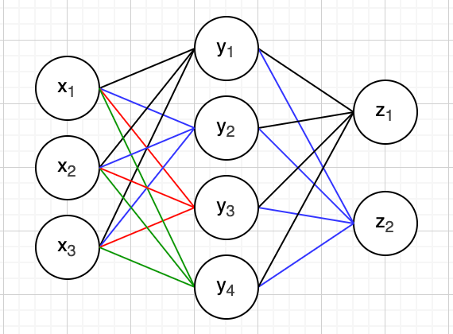
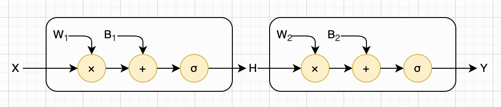
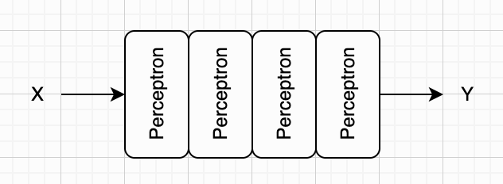
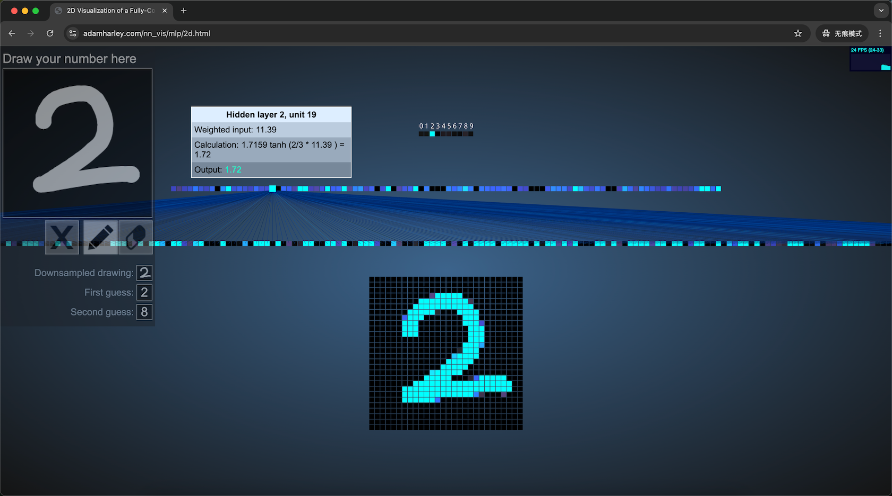
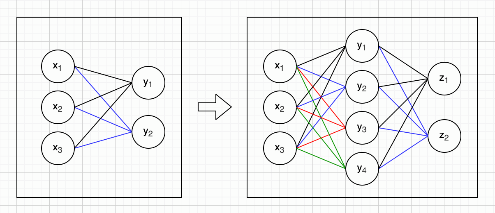

## 第三章：多层神经网络

在第一章中，我们讨论了人工神经网络的基本构成单元，也就是神经元的工作原理。在第二章中，我们进一步讨论了多个神经元如何组成单层神经网络，并动手设计了这样一个网络，用于识别手写数字。很难想象，如此简单的小型神经网络在经过MNIST数据集训练后，便能实现手写数字识别，且准确率接近90%。

我们知道，单层神经网络的计算能力是有限的。解决这一局限的方法在上一章中已经提及，那就是增加网络层数。本章将介绍如何为网络构建多层结构，并对上一章的实例进行改进，观察手写数字识别率能够提升到何种水平。上一章中还曾提到Softmax函数，但未展开介绍，本章也将对其进行详细讲解。


### 隐藏层

回顾第二章开头介绍的由三个输入、两个输出组成的简单神经网络，我们将输入神经元所在的层称为**输入层**，输出神经元所在的层称为**输出层**。由于输入层不包含权重与偏置参数，因此通常不将其算作真正意义上的网络层。从这个角度来看，该网络本质上仍是一个单层神经网络。现在我们对这个网络稍作修改，在中间增加一层神经元，并重新调整连接关系，如下图所示：



我们知道，输入层和输出层都是对外可见的：输入层负责接收外界信息，输出层负责呈现最终结果。而中间的层级，只在神经网络内部参与运算，外部无法直接观察，因此我们称之为**隐藏层**。

这样的网络结构看上去复杂了一些，但本质上并没有引入新的概念。我们完全可以把它拆开理解：输入层到隐藏层看成一个单层神经网络，隐藏层到输出层看成另一个单层神经网络。说白了，它就是两个单层全连接网络简单堆叠在一起。这两个单层网络各自都遵循我们前面介绍的计算规则，把它们放在一起，就可以写成下面的形式：

$$
\mathbf{h} = f_1(\mathbf{x}) = σ(W_1 \mathbf{x} + \mathbf{b}_1) \\
\mathbf{y} = f_2(\mathbf{h}) = σ(W_2 \mathbf{h} + \mathbf{b}_2)
$$

如果我们像前面的章节一样，把全连接层的计算细节画出来，那么这个两层网络看起来是下面这样。注意， $\mathbf{x}$ 、 $\mathbf{h}$ 、 $\mathbf{y}$ 和偏置 $\mathbf{b}$ 都是列向量，所以用粗体小写字母；而权重 $W$ 是矩阵，所以用大写字母。



由于我们已经非常熟悉单层神经网络的计算公式，因此不妨省略中间细节，把上面两行公式合并成一行，如下所示：

$$
\mathbf{y} = f(\mathbf{x}) = f_2(f_1(\mathbf{x}))
$$

如果你熟悉Unix/Linux Shell，一定马上会想到管道（Pipe）机制；或者你熟悉函数式编程，也能联想到类似的串联执行效果。就算这两个你都不了解也没关系，我们还可以用一条假想的橙汁流水线来理解：送入一个橙子，第一道工序把它清洗干净，传给下一道；第二道工序去掉果皮，再传给下一道；第三道工序榨出橙汁，倒入杯中；最后一道工序密封包装、贴上标签，一杯新鲜橙汁就制作完成了。

我们的多层神经网络也是这样工作的。一组信号流入第一层神经网络，得到一组输出；这组输出再作为新的输入，流入第二层神经网络，得到新的输出。如此逐层传递，直到最后一层，产生最终的输出信号。既然如此，无论神经网络有多少层，我们都不必费力写出每一层的公式。假如有一个N层神经网络，我们仍然用 $\mathbf{y}$ 表示最终输出，那么可以把整个网络统一写成一个公式，如下所示：

$$
\mathbf{y} = f(\mathbf{x}) = f_n(...f_2(f_1(\mathbf{x}))...)
$$


### 深度学习

顺便说一下，如果一个神经网络包含多个隐藏层，我们就可以把它称为**深度神经网络**（Deep Neural Network，简称 DNN）。这里的“深度”，指的其实就是网络中“层”的数量更多。层数越多，信息需要经过的计算步骤就越多，因此被形象地称为“更深”。而以这种深层神经网络为基础的机器学习方法，则被称为**深度学习**（Deep Learning，简称 DL）。

另外，我们这一章所讲的神经网络，信息是从输入层一路向前传递到输出层的，中间不会回头，也没有循环或反馈。这种最基础、最简单的网络结构，被称为**前馈神经网络**（Feedforward Neural Network，简称 FNN）。它可以看作是后面各种复杂网络结构的起点。

在后面的章节中，我们还会介绍一些结构更加复杂的模型，例如带有“循环结构”的网络（如 RNN），以及基于注意力机制的模型（如 Transformer）。不过，无论这些模型多么复杂，它们的基础，仍然可以追溯到这里介绍的这种最简单的前馈结构。


### 多层感知机

深度神经网络具备非常强大的表达能力，这一点我们会在后面的章节中逐步介绍。而目前我们能构建的，还只是最简单的一类神经网络结构，也就是由多个全连接层组成的前馈神经网络。由于这种网络可以看作是在前一章介绍的感知机模型基础上的扩展，因此通常被称为**多层感知机**（Multi-Layer Perceptron，简称MLP）。

实际上，多层感知机在功能上正是由多个感知机依次连接构成的。除了第一层的感知机直接接收外部输入外，每一个感知机的输出，都会作为下一个感知机的输入，信号在网络中逐层传递。一个由四个感知机依次串联组成的多层感知机结构，如下图所示：



我找到一个非常适合理解多层感知机的网站，它用可视化的方式，展示了一个能识别手写数字的多层感知机是如何工作的。需要说明的是，这个模型已经预先训练完成，你不需要关心训练过程，只需关注它如何识别数字即可。如果你一路跟着本书学到这里，却感觉知识还没完全串起来，或是对某些细节理解得不够透彻，我强烈推荐你去体验一下这个工具。这个工具完全在浏览器中运行，有[2D](https://adamharley.com/nn_vis/mlp/2d.html)和[3D](https://adamharley.com/nn_vis/mlp/3d.html)两个版本，下面是2D版本的截图：



以2D版本为例，这个MLP可视化工具的左上角是一块手写板，你可以直接手写数字进行测试。界面中其他区域的每一个小方格，都代表一个神经元。方格的亮度对应神经元的输出值：颜色越亮，代表数值越高。当你在手写板上书写数字时，整个神经网络会进行实时计算，并将结果立刻反映在所有神经元方格的颜色变化上。

网页最下方是一个由28×28个小方格组成的数字显示器，尺寸正好对应训练网络时使用的MNIST数据集图像。你在手写板上书写的内容，会被压缩为28×28像素的灰度图并显示在这里，这正是当前神经网络的输入层。

输入层上方是由300个神经元组成的隐藏层，再往上是另一个由100个神经元构成的隐藏层。最上方则是由10个神经元组成的输出层，分别对应0～9各个数字的得分。得分越高，代表神经网络判定为该数字的可能性越大。需要注意的是，这里的得分还不是严格意义上的概率。我会在后面的小节介绍如何通过Softmax函数，将这些得分转化为标准概率。

如果你选中某个神经元，网页还会以连线的形式把它对应的所有权重展示出来。比如上面的截图，就选中了第二个隐藏层中的第19个神经元。和神经元的表示方式一样，连线的颜色代表权重大小，线条越亮，对应的权重值越高。同时，页面还会弹出一个小窗口，显示该神经元的具体位置、带偏置的加权输入值，以及最终的输出值。从截图里也能看出，这个神经网络使用了我们在第一章介绍过的Tanh激活函数。

那么这个多层感知机一共有多少个参数呢？我们用上一章的公式来计算一下，结果见下表：

| 层     | 输入 | 输出 | 算式            | 参数数量 |
| ------ | ---: | ---: | --------------- | -------: |
| 第一层 |  784 |  300 | (784 + 1) × 300 |  235,500 |
| 第二层 |  300 |  100 | (300 + 1) × 100 |   30,100 |
| 输出层 |  100 |   10 | (100 + 1) × 10  |    1,010 |
| 累计   |      |      |                 |  266,610 |


### 玩具MLP

在第二章中，我们已经用 Python 代码亲手实现了玩具全连接层。现在，我们将这些独立的层按顺序串联起来，搭建一个完整的多层感知机（MLP）。为了让你阅读更连贯、不用来回翻页，我把之前定义的 `new_fc_layer` 函数也一并展示出来。下面是可以直接运行的完整代码：

```python
import numpy as np

def new_fc_layer(mat_w, vec_b, af=np.tanh):
    return lambda vec_x: af(mat_w @ vec_x + vec_b)

def new_mlp(layers: list):
    def mlp(vec_x):
        vec_current = vec_x # 保存输入，逐层向前传播
        for layer in layers:
            vec_current = layer(vec_current)  # 一层一层计算
        return vec_current
    return mlp
```

接下来，我们就用前面定义的全连接层，构建一个假想的多层感知机网络。这个网络的输入是一张 28×28 大小的灰度图片（与手写数字数据集的图片规格一致），经过多层计算后，最终输出 0～9 这 10 个数字对应的分数（分数可用于后续判断图片属于哪个数字类别）。

当然，我们这里仅为了直观展示网络的前向计算过程，也就是输入数据如何通过层层传递，最终得到输出结果。因此网络的所有参数（权重 w、偏置 b）都采用随机生成的方式，输入的图片数据也同样随机生成，暂不涉及模型训练和参数优化的内容。下面是完整的测试代码，可直接运行查看网络的计算效果：

```python
layer1 = new_fc_layer(np.random.randn(300, 784), np.random.randn(300))
layer2 = new_fc_layer(np.random.randn(100, 300), np.random.randn(100))
layer3 = new_fc_layer(np.random.randn(10, 100), np.random.randn(10))
mlp = new_mlp([layer1, layer2, layer3])
print(mlp(np.random.randn(28 * 28)))
```


### 真实MLP

现在你应该已经理解隐藏层和多层感知机的核心概念了。前面介绍的这款可视化工具非常直观实用，接下来我们就借鉴它的网络设计思路，对前一章实现的单层感知机进行升级，将其扩展为多层结构，并用MNIST数据集完成训练，看看实际效果如何。

我已经完成了相关代码的编写，其实新版代码和上一章的单层感知机代码相比，整体差异并不大，仅需新增两个隐藏层，并引入ReLU激活函数即可。以下是构建这个多层感知机的核心代码，完整代码可以从本书配套的源代码中获取。

```python
# 定义神经网络
class MLP(nn.Module):
    def __init__(self):
        super(MLP, self).__init__()
        self.fc1 = nn.Linear(28*28, 300) # 第一层：784 -> 300
        self.fc2 = nn.Linear(300, 100)   # 第二层：300 -> 100
        self.fc3 = nn.Linear(100, 10)    # 输出层：100 -> 10
        self.relu = nn.ReLU()

    def forward(self, x):
        x = x.view(-1, 28*28) # 展平
        x = self.relu(self.fc1(x))
        x = self.relu(self.fc2(x))
        x = self.fc3(x)
        return x
```

这段代码其实挺好理解，因为它基本就是把我们前一小节介绍的可视化神经网络，用PyTorch框架描述了一遍。但就算暂时读不懂也完全不用担心，你只需要知道，它帮我们构建了一个包含两个隐藏层、并使用ReLU激活函数的神经网络即可。另外，我们暂时不需要关心网络的训练过程，因此这里也没有展示训练相关的代码。我已经帮你运行过一遍完整代码，你直接查看结果就可以：

```
# uv run python ch03/mlp.py 
Epoch [1/5], Loss: 1.6728
Epoch [2/5], Loss: 0.5600
Epoch [3/5], Loss: 0.3944
Epoch [4/5], Loss: 0.3424
Epoch [5/5], Loss: 0.3125
Test Accuracy: 91.48%
```

我们直接来看最后一行的结果：准确率已提升至约91.5%。对比上一章不到90%的准确率，虽有进步，但提升幅度并不算大。上一章的单层网络仅有7千多个参数，而这个多层感知机的参数有将近27万个。增加了这么多神经元和参数，手写数字识别的准确率却只提升了不到2个百分点，效果确实差强人意。

这是因为手写数字本质上是二维的图像，而我们始终将其展平为一维数据来训练神经网络，这导致大量空间信息丢失。至于该如何解决这个问题，我们将在下一章详细探讨。


### Softmax函数

还记得吗？我们的神经网络输出的是一组分数值（有正有负），分数越高，代表识别为对应数字的倾向越强烈。在深度学习中，输出层这种未经处理的原始数值，通常被称为Logits（原始得分）。接下来我们就来聊聊Softmax函数，它也被称作“概率归一化函数”，可以将这些原始分数转换为一组概率值，并且所有概率加起来正好等于1。我们先来看Softmax函数的定义：

$$
\mathrm{Softmax}(z_i) = \frac{e^{z_i}}{\sum_{j=1}^{n}e^{z_j}}
$$

这个公式本身并不难理解，如果你熟悉Python语言，仅需三行代码就能实现：

```python
# 手写实现，用于逐步演示计算过程。
# NumPy 没有现成的 Softmax，但 np.exp 可以一次算完整个向量，
# 于是整个函数可以简写成一行：np.exp(vec_z) / np.exp(vec_z).sum()
def softmax(vec_z: np.ndarray) -> np.ndarray:
    vec_exp = [e ** v for v in vec_z]
    total = sum(vec_exp)
    return np.array([v / total for v in vec_exp])
```

不过还是有几点重要的细节需要说明。第一，虽然有些资料会把Softmax归为一种激活函数，但它与常见的激活函数存在本质区别。常见的激活函数通常是逐元素进行计算的，也就是说，每个神经元的输出只依赖于对应的输入值，彼此之间互不影响。而Softmax则不同：它的分母包含了所有神经元的输出，因此每一个输出都依赖整个向量，而不是逐元素计算得到的。

第二，Softmax 函数还有一个非常重要的优良特性：输入值越大，对应的概率会呈指数级放大；函数对数值之间的差异非常敏感。这个特性之所以重要，是因为它能拉大正确类别与其他类别的差距。

在类似识别手写数字这样的分类任务中，我们希望模型对“最可能的答案”给出极高置信度，同时压低其他错误类别的概率。指数形式能天然强化这种“优胜劣汰”的效果，让预测结果更清晰、更有区分度。

与之对比，如果我们只是简单地将所有输出直接求和，再用每个输出除以总和，虽然也能得到一组和为1的数值，看似也是概率分布，但这种方式对数值差异不敏感，无法放大最优解的优势。最终模型的预测会比较“模糊”，各类别概率接近，分类效果远不如Softmax理想。

顺便提一下，PyTorch框架内置了Softmax函数，使用起来非常方便，示例如下：

```python
outputs = model(images)  # 这里得到的是Logits
probabilities = torch.softmax(outputs, dim=1) # 转换为概率
```


### 超参数

在第二章的感知机中，我们直接使用28×28的输入和10个输出，没有引入更复杂的网络结构。本章介绍的多层感知机，我们也只是把可视化演示中的结构直接写成了代码。那么，对于像多层感知机这样的深度神经网络，究竟应该设计多少层、每层设置多少个神经元，又该使用哪种激活函数呢？从宏观层面确定网络结构的过程，通常被称为神经网络架构设计，而网络本身的结构则称为神经网络架构（Architecture）。

如何设计这样的架构并不在本书的讨论范围之内。不过，在带你学习新知识的同时，本书会逐步介绍一些非常经典的网络结构，例如下一章要讲的卷积神经网络，以及再下一章要讲的循环神经网络。

我们知道，神经网络的参数（权重和偏置等）是网络自己学出来的，会在训练过程中自动更新。与这些可学习的参数不同，神经网络架构中的层数、每层神经元的数量、激活函数的选择，以及本书后半部分会介绍的学习率、批次大小、训练轮数等，都是我们提前定好的，在训练过程中网络不会自行修改。我们把这些需要人工预先设定、无法通过训练自动学习的配置，统称为**超参数**（Hyperparameter）。


### 反向传播

我们前面介绍的多层感知机，在处理问题时，信号是单向流动的：从输入层进入，依次经过第一层、第二层等隐藏层，最后由输出层给出最终结果，因此也叫做前馈神经网络。但我们一直回避了一个关键细节：网络中的参数究竟是如何确定的？其实在第二章中我们已经初步提到：这类网络在训练时，会根据实际输出与预期结果之间的误差，从输出层开始，反向逐层调整参数，一直回溯到输入层。因为参数更新的方向，与信号前向传播的方向正好相反，所以这一算法被称为**反向传播**算法。

不过，要真正讲清反向传播算法，需要用到微积分等数学工具，理解门槛相对较高，因此我们会把详细推导放到本书后半部分再展开。这里我们先聚焦一个关键事实：反向传播的思想其实并不算新颖。早在1970年代，这一思路就已经被研究者提出，但长期没有得到广泛关注。直到1986年，大卫・鲁梅尔哈特（[David Rumelhart](https://en.wikipedia.org/wiki/David_Rumelhart)）、杰弗里・辛顿（[Geoffrey Hinton](https://en.wikipedia.org/wiki/Geoffrey_Hinton)）和罗纳德・威廉姆斯（[Ronald Williams](https://en.wikipedia.org/wiki/Ronald_J._Williams)）三人发表了那篇具有里程碑意义的论文，反向传播才真正被学界重视并流行起来。即便如此，在当时它也仍停留在理论与实验阶段，距离后来引爆深度学习浪潮，还有很长的路要走。

真正将反向传播算法落地到实际应用的，是杨立昆（[Yann LeCun](https://en.wikipedia.org/wiki/Yann_LeCun)）。1989年，他提出了卷积神经网络架构，并使用反向传播进行训练，成功应用于手写邮政编码识别，发表了极具影响力的论文，让这一算法从理论走向真实场景。到了1998年，杨立昆又推出了更加经典的LeNet-5，这一结构成为现代卷积神经网络的鼻祖。我们会在下一章详细讨论这一架构。


### 本章小结

本章首先介绍了隐藏层与深度神经网络的概念，借助可视化工具讲解了多层感知机，并使用PyTorch框架完成了模型实现。随后介绍了Softmax函数，说明如何将输出层的原始分数转换为归一化概率。最后，讲解了神经网络架构与超参数的含义，明确了二者在模型训练中的作用。



虽然我们实现的多层感知机参数已接近27万个，是上一章单层感知机参数的近34倍，然而手写数字识别的准确率却只提升了不到2%。其原因我们也已经了解：将二维图像信息直接展平为一维向量，会丢失大量空间结构信息。下一章，我们将介绍卷积神经网络，看看它是如何克服这一问题，以及能将数字识别的准确率提升到怎样的高度。
