## 第四章：卷积神经网络

从第二章开始，手写数字识别便一直作为本书的“Hello, World”示例，伴随我们逐步深入学习神经网络的相关原理。在整个过程中，我们一直采用一种直接的处理方式：将二维图像的像素点展平为一维向量，再直接输入网络进行处理。

然而对于手写数字识别而言，这种处理方式存在两个较为突出的问题：其一，它未能充分利用图像固有的空间结构，并非解决该问题的最优方案；其二，全连接网络的参数数量极为庞大，仅针对28×28像素的手写数字，我们设计的简单全连接网络参数就已达二十多万个，若面对更大尺寸的图像，其参数规模更是难以想象。

事实上，我们已经了解到，卷积神经网络（CNN）是处理图像数据的更优选择。本章将以此为切入点，带你深入剖析卷积神经网络的结构与工作原理，理解它如何通过特有的架构设计，高效提取并利用图像中的关键特征信息。

在本章中，我将先从宏观视角介绍卷积神经网络的整体架构，让你对其有一个整体认知。随后进入核心内容，依次讲解卷积神经网络中最关键的卷积运算与卷积层，再介绍池化层、扁平化等重要模块。我们会简要回顾1989年最早的卷积网络结构，并重点介绍1998年提出的经典架构LeNet‑5，同时完成该网络的复现。通过本章的学习，你将能够系统、清晰地建立起对卷积神经网络的完整认知。


### 整体架构

理解一个复杂问题最好的方式，是将其拆解为若干简单问题逐一突破。卷积神经网络同样可以沿用这一思路，我们可以把它清晰地拆分为两个核心模块来理解：卷积模块与多层感知机模块，如下图所示：

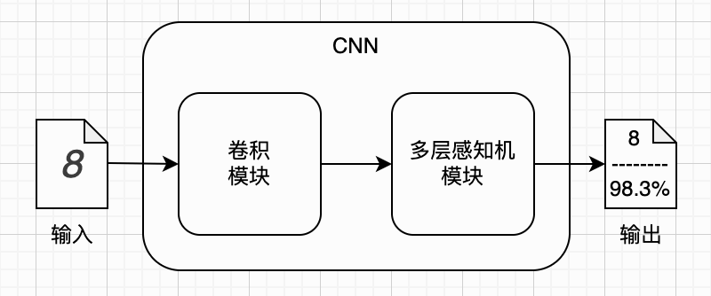

我们仍以手写数字识别为例进行学习。数字图像会先送入卷积模块完成特征提取与处理，输出一个特征向量（可以先这样直观理解）；再将该向量作为输入，传入多层感知机模块，最终得到分类识别结果。多层感知机就是我们已经熟悉的多层全连接网络，因此接下来只需重点理解卷积模块即可。卷积模块由卷积层、池化层等核心组件构成，我们可以逐一展开学习。而整个学习的起点，正是最基础的卷积操作。


### 卷积核

一听到卷积神经网络，再想到里面的卷积计算，你是不是瞬间觉得头大？如果去查数学上的卷积定义，还会看到一大堆带着复杂微积分符号的公式，很容易望而生畏。但实际情况是：尽管卷积神经网络中的“卷积”操作，和数学意义上的卷积本质同源，可我们理解深度学习里的卷积，完全不需要懂微积分，也不必纠结严格的数学定义，它的直观逻辑其实非常简单。

我们先从认识**卷积核**（Convolution Kernel，简称Kernel）开始。它也常被称作**过滤器**（Filter），至于为什么会有这个叫法，看完后面的内容你自然就明白了。所谓卷积核，本质上就是一个 n×n 的矩阵。这里的 n 称为卷积核的**大小**（Kernel Size），最常用的取值是 n=3 或 n=5。即便你已经忘记了矩阵的概念也完全不用担心，以 n=3 为例，你只需要把卷积核理解成一个 3×3 的九宫格，每个格子中存放一个数字即可，形式大致如下：

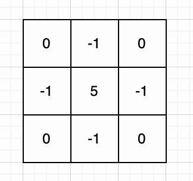

上面这个卷积核中的数值并非随意设定，它实际上能够对图像实现锐化处理。这一点，等你读完下一小节就会明白了。而在真实的卷积神经网络中，卷积核的这些数值并非人为指定，而是通过模型训练自动学习得到的。

接下来，我们画一张大小为 3×3 的小灰度图，总共包含 9 个像素。将它缩小观察，外形看起来就像一个微型的数字 1（下图左一）。把这张小图放大后，我们就可以在每个格子里标出对应像素的灰度数值（下图左二）。作为对比，我们把前面介绍的卷积核也放大绘制在一旁（下图左三）。

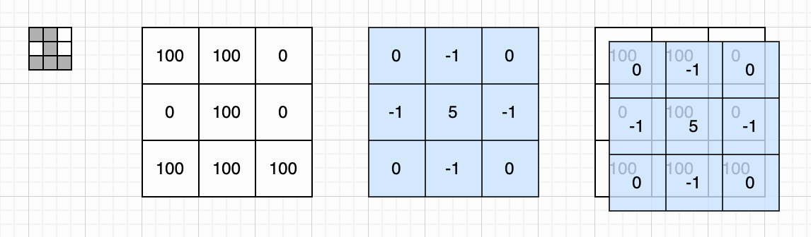

不难发现，这个卷积核恰好可以覆盖在这张小图像上，与其完全对齐（上图右一）。卷积核的作用，就是对它所覆盖的图像区域进行计算。计算过程也十分直观：依次遍历卷积核的每个位置，用核内数值与对应位置的像素灰度值相乘，再将所有乘积相加。如果你对神经元的工作原理还有印象，就会发现这一过程与神经元的加权求和十分相似。我们只需将图像的像素值看作输入，将卷积核中的每个数值对应为神经元的权重即可。

如果我们按照从上到下、从左到右的顺序遍历卷积核中的每个位置，上图展示的卷积计算过程就可以写成如下形式。为方便与上图对照查看，我将整个求和算式按三行展开：

$$
\begin{aligned}
(0×100) &+& (-1×100) &+& (0×0)   &+ \\
(-1×0)  &+& (5×100)  &+& (-1×0)  &+ \\
(0×100) &+& (-1×100) &+& (0×100) &= 300
\end{aligned}
$$

一般情况下，设卷积核大小为 $k$ 。我们用 $i$ 表示行号， $j$ 表示列号，用 $w_{ij}$ 表示卷积核中对应位置的值，用 $x_{ij}$ 表示被卷积核覆盖的图像对应像素值。那么，卷积核与它覆盖的图像的加权求和运算就可以用下面的公式统一表示：

$$
y = \sum_{i=1}^k\sum_{j=1}^k{w_{ij} \cdot x_{ij}}
$$

如果你对公式感到头疼，我们也完全可以用 Python 代码来表达这一计算过程，理解起来会更直观。它本质上只是一个两层循环：

```python
def weighted_sum(x: list[list[float]], 
                 w: list[list[float]], 
                 k: int) -> float:
    total = 0.0
    for i in range(k):
        for j in range(k):
            total += w[i][j] * x[i][j]
    return total
```

我们把卷积核里的每一个数值都称作它的参数。你应该还记得，单个神经元中通常还带有一个偏置参数，卷积核同样如此。也就是说，前面得到的加权求和结果，还需要再加上这个偏置，才是完整的计算结果。沿用之前的符号习惯，我们用大写字母 $P$ 表示被卷积核覆盖的小图像像素灰度矩阵，用 $K$ 表示卷积核的权重矩阵，用小写字母 $b$ 表示卷积核的偏置参数，并用星号（\*）表示卷积核的加权求和操作。由此，我们可以用下面的公式来表示完整的卷积计算：

$$
y = P * K + b
$$

我们用3×3小格子来表示输入小图片与卷积核矩阵，用一个小格子来表示输出值，用星号来表示卷积加权求和计算，于是上述卷积计算可以用下面这幅图表示：

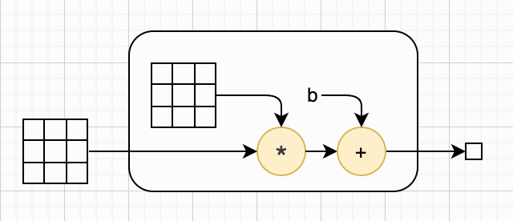

我们来总结一下：一个大小为 k 的卷积核，除了包含 k×k 个权重参数外，还额外带有一个偏置参数。因此，只要知道卷积核的大小 k，它的总参数数量就可以用下面的公式计算：

$$
params = k^2+1
$$

需要注意的是，卷积核并非必须是正方形。不过，为了便于讲解和大家理解，本章我们将默认卷积核为正方形。实际上，只要你掌握了正方形卷积核的基本运算规则，将其推广到非正方形卷积核的情况会非常容易。现在，我们已经理解了卷积核如何与图像的局部区域进行计算，接下来就一起学习完整的卷积操作。


### 滑动窗口

在前面的例子中，为了方便讲解，我们使用了与卷积核大小相同的小图像。但在实际场景里，卷积神经网络需要处理的图像，尺寸通常远大于卷积核，我们把这张待处理的图像称为卷积运算的输入。卷积核从上到下、从左到右依次扫过整个图像，将每个位置的计算结果按顺序排列，就构成了卷积运算的输出。

卷积核在单个位置上的计算结果只是一个数值，而完整的卷积运算最终会输出一个矩阵，相当于一张更小的图像。这张图像提取了输入图像的部分特征，因此通常被称为**特征图**。为方便图示说明，我们假设输入图像为 4×4 大小，卷积核仍保持 3×3 大小。完整的卷积运算过程如下图所示（这里假设偏置为0）：

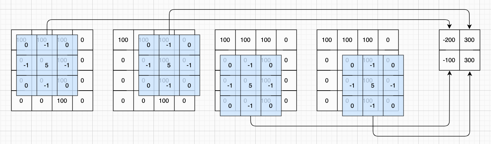

可以看到，卷积核如同一个小窗口，在图像上从上到下、从左到右依次滑动，这一过程被形象地称为**滑动窗口**（Sliding Window）机制。每次卷积核所覆盖的局部区域，则称为**图像块**（Patch）。不难得出，若输入图像大小为 n×n，卷积核大小为 k×k，卷积运算的输出即为 (n−k+1)×(n−k+1) 的矩阵。

我们用4×4的格子表示输入图片，仍然用3×3格子表示卷积核，并用2×2格子表示输出图片，那么滑动窗口的某次计算过程可以表示为下面这样：

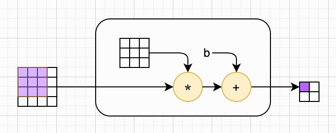

如果我们把前一小节介绍的卷积核加权求和过程抽象出来，将其视为一个作用于滑动窗口的独立函数，那么滑动窗口的主体逻辑就可以只关注窗口的移动规则，而不必关心内部具体如何计算。对应的 Python 实现如下：

```python
def apply_sliding_window(input_mat, k_h, k_w, stride, func):
    h, w = input_mat.shape                # 获取输入矩阵的高、宽
    out_h = (h - k_h) // stride + 1       # 计算输出矩阵的高、宽
    out_w = (w - k_w) // stride + 1       #
    output_mat = np.zeros((out_h, out_w)) # 初始化输出矩阵

    # 开始滑动窗口
    for i in range(out_h):
        for j in range(out_w):
            # 截取当前窗口
            start_i = i * stride
            start_j = j * stride
            window = input_mat[start_i:start_i + k_h, start_j:start_j + k_w]

            # 进行计算
            output_mat[i, j] = func(window)

    return output_mat
```

需要注意的是，该函数包含一个 `stride` 参数。这里我们先假设其值为 1，即暂时不产生实际效果，关于它的具体作用，我们会在后续小节详细介绍。此外，函数内部也已经考虑了窗口为矩形的通用情况。


### 填充

你可能已经发现，上面的操作会让输出尺寸与输入尺寸不一致。如果叠加多层卷积运算，图像会不断缩小，甚至可能被压缩到无法继续处理。此外，与图像中心的像素相比，边缘像素被卷积核覆盖的次数更少，也更容易出现信息丢失。为了同时解决这两个问题，我们会使用一项名为**填充**（Padding）的技术，如下图所示：

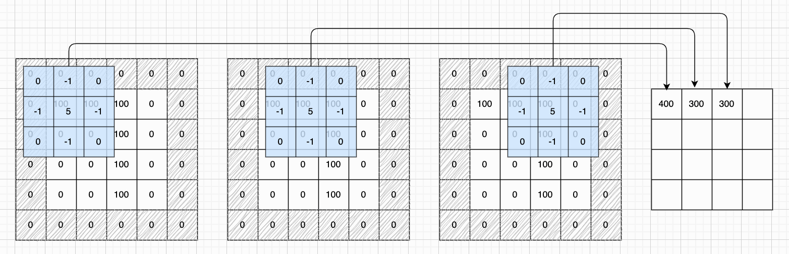

填充操作需要考虑两个关键要素：填充圈数和填充数值。先来看填充的圈数。在上面的例子中，我们对图像填充了一圈，从而让输出尺寸与输入保持一致。可以很直观地得出，若输入图像大小为 n×n，卷积核大小为 k×k，填充圈数为 p，那么卷积运算的输出就是一个 (n+2p−k+1)×(n+2p−k+1) 的矩阵。

再来看填充位置需要填入的数值。针对这一点有多种不同方案，本书不做过多展开。其中最简单的方式是直接填充 0，也就是**零填充（Zero Padding）**，正如上图所示。

我们稍微修改一下前一小节表示滑动窗口计算过程的内部细节图，给输入图片增加一圈填充，新的计算过程如下所示。就这个例子而言，滑动窗口已经走到了第二行第二列。

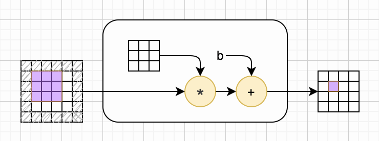

虽然手动实现填充逻辑并不复杂，但 NumPy 已经内置了 `pad` 方法，我们直接使用即可，既简洁又可靠。下面就是基于它实现的零填充函数：

```python
def zero_pad(input_mat, padding):
    if padding > 0:
        return np.pad(
            input_mat,
            pad_width=((padding, padding), (padding, padding)),
            mode='constant',
            constant_values=0
        )
    return input_mat
```


### 步幅

在前面的例子中，卷积核无论横向还是纵向，每次都只移动一个格子。它能否一次移动多个格子呢？答案是可以的。卷积核每次滑动的格子数，称为卷积操作的**步幅**（Stride）。我们沿用之前的示例，但是将卷积核大小设为 2×2，步幅也设为 2，此时卷积运算的前三次计算过程如下图所示：

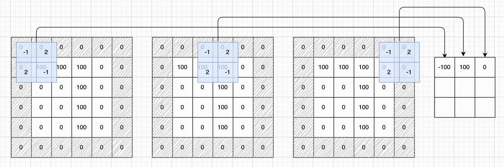

不难看出，在一般情况下，设输入图像大小为 n×n，卷积核大小为 k×k，填充圈数为 p，步幅为 s，则卷积运算的输出为 m×m 的矩阵，其中 m 可由下面的公式计算得出：

$$
m = \lfloor \frac{n+2p-k}{s} \rfloor +1
$$

我们之前实现的 `apply_sliding_window()` 函数已经内置了对步幅的支持，只需将 `stride` 参数设置为大于 1 的数值，即可生效。


### 完整的卷积运算

我们来总结一下：以一张 n×n 的图像为基础，在外围添加 p 圈填充后作为输入。使用一个 k×k 大小的卷积核，按照步幅 s，以从左到右、从上到下的滑动窗口方式在输入上滑动。卷积核与经过的每个图像块进行加权求和计算，并加上偏置，然后把这个值送入激活函数，得到最终计算结果。这些结果按对应位置依次排列，就得到了最终输出。整个过程是不是并不难理解？

现在，我们以填充后的图像作为输入。设卷积核为矩阵 $K$ ，卷积运算最终输出为 m×m 大小的矩阵 $Y$ ，用 $y_{ij}$ 表示其第 i 行第 j 列的元素，用矩阵 $P_{ij}$ 表示与该输出元素对应的局部图像块。那么，输出矩阵中任意位置的取值均可通过下面的公式计算。注意，之前为了便于理解，我们一直忽略了激活函数，这里把它给加上了。

$$
y_{ij} = σ(P_{ij} * K + b)
$$

现在，既然我们理解了卷积运算，就可以把细节都暂时抛弃了。我们知道星号代表这个操作就可以了。我们用X来表示输入图片，用K来表示卷积核权重矩阵，用b来表示卷积核偏置，用Y来表示输出图片。于是，完整的卷积计算可以用下图来表示：

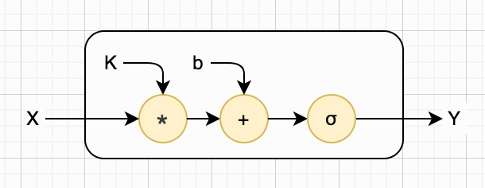

现在，我们使用 Python 代码完整实现卷积运算。这个函数能够灵活处理输入矩阵与卷积核不是正方形的情况。需要注意的是，我们直接通过 NumPy 的**逐元素相乘**（也叫哈达玛积，用星号表示）与内置的 `sum` 函数完成加权求和计算，没有使用之前我们自己定义的加权求和函数。完整的实现代码如下所示（TODO：补上激活函数）：

```python
def conv2d(input_mat, kernel_mat, bias, padding=0, stride=1):
    conv_func = lambda window: np.sum(window * kernel_mat) + bias # 卷积核计算
    k_h, k_w = kernel_mat.shape # 获取输入卷积核的高、宽
    input_mat = zero_pad(input_mat, padding) # 填充
    output_mat = apply_sliding_window(input_mat, k_h, k_w, stride, conv_func)
    return output_mat
```

读到这里，相信你已经对卷积运算有了清晰的认识。就算暂时没完全弄懂也没关系，毕竟书里的图都是静态的，确实不太好直观理解。我帮你找到了一个很好用的在[线小工具](https://poloclub.github.io/cnn-explainer/)，你可以随意调整输入大小、填充圈数、卷积核大小和步幅，既能自动播放整个滑动窗口的过程，也能手动选中区域，看清输入和输出之间的对应关系。强烈建议你动手试一试，效果非常直观。下面是它的界面截图：

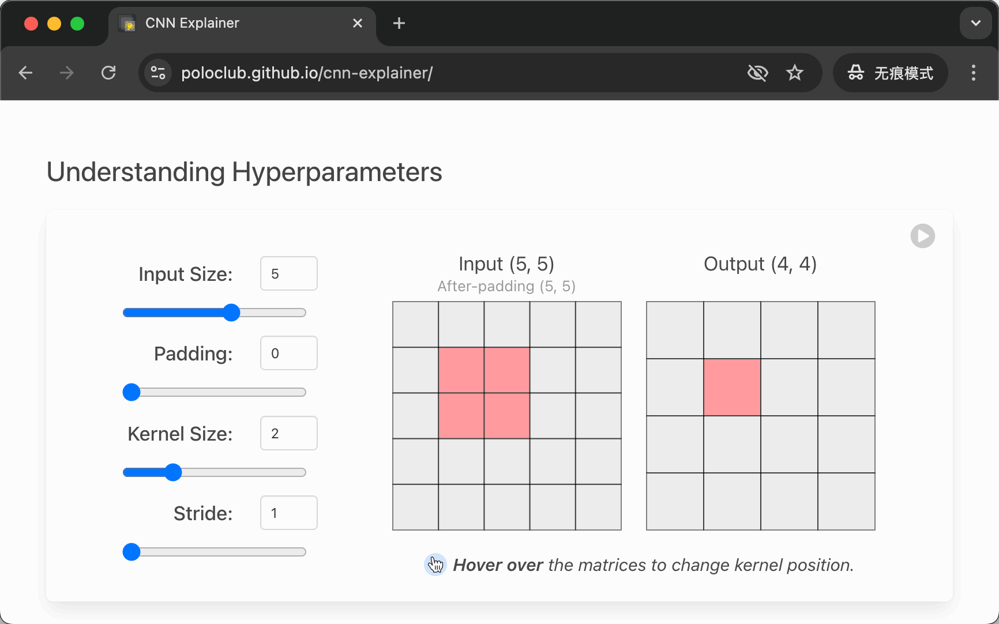

顺便提一句，卷积操作其实早在卷积神经网络出现之前就已经广泛使用了。它最早源于信号处理领域，主要用于对信号进行滤波，这也是它常被称作**过滤器**的原因。

除此之外，卷积在图像处理中也十分常见，比如实现图像模糊、锐化、边缘检测等效果。只不过在传统图像处理里，卷积核的数值通常由人工预先设定；而在卷积神经网络中，卷积核的参数是通过模型训练自动学习得到的。

这里有一个交互式在[线工具](https://setosa.io/ev/image-kernels/)，可以非常直观地帮你理解卷积核、卷积运算，以及它们在图像处理中的实际应用效果。下面这张截图展示了实现模糊效果所对应的卷积核，以及处理后的最终效果：

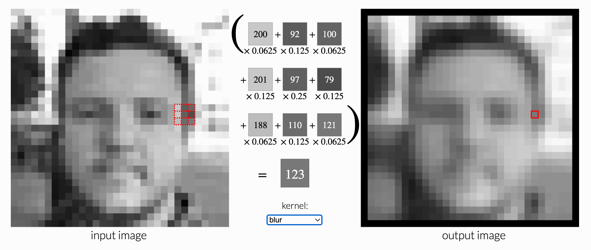


### 卷积层

弄懂了完整的卷积运算，我们就可以来学习卷积层了。在前面的例子中，我们只用一个卷积核进行计算，因此只能得到一张特征图。如果同时使用多个大小相同的卷积核，分别对输入执行卷积运算并提取多张特征图，就构成了一个卷积层。我们以一个最简单的卷积层为例：它包含两个 2×2 的卷积核，步幅为 2，输入为一张 3×3 的图像，最终输出两张 2×2 大小的特征图。这个卷积层的计算如下图所示：

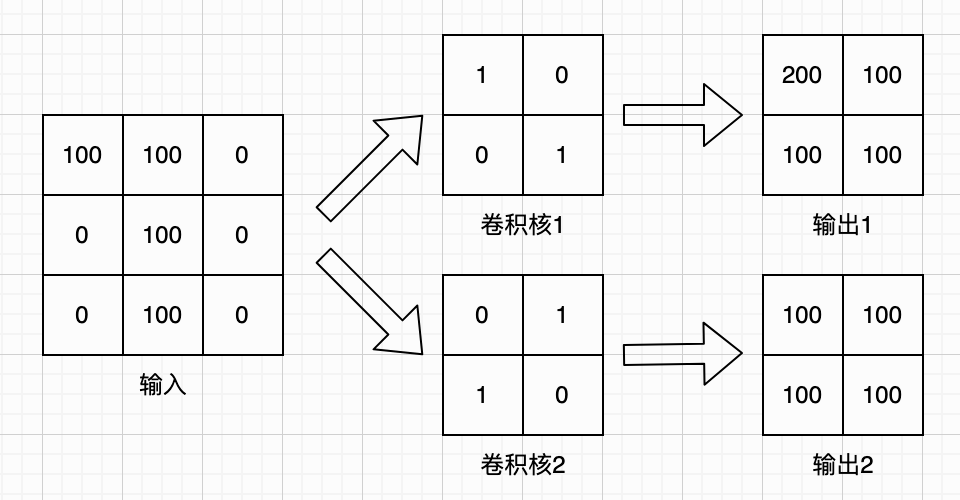

上面这张示意图，重点在于展示卷积核的数值分布与对应计算结果。和之前一样，我们可以先隐去具体的数值，只关注整体的计算逻辑。简化后的双核卷积层计算过程如下图所示：

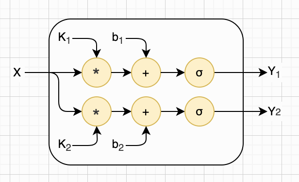

我们已经在前文中实现了 `conv()` 函数，基于该函数实现完整的卷积层会非常简便。只需对每个卷积核分别执行卷积操作，再将所有计算结果整合返回即可。对应的代码实现如下：

```python
def new_conv_layer(kernel_list, padding=0, stride=1):
    def conv_layer(input_mat):
        output_mat_list = []
        for kernel_mat, bias in kernel_list:
            output_mat = conv2d(input_mat, kernel_mat, bias, padding, stride)
            output_mat_list.append(output_mat)
        return output_mat_list
    return conv_layer
```

我们前面采用的两种画图方式，都不适合展示结构相对复杂的卷积层。因此，后续我们将采用 LeNet 风格来绘制复杂卷积网络，而 LeNet 网络的具体内容，会在本章后半部分详细介绍。恰好，我们在之前学习全连接网络时，已经介绍过一款在线工具 [NN-SVG](https://alexlenail.me/NN-SVG/LeNet.html)，它正好支持绘制 LeNet 风格的网络结构。

如下图所示，便是使用该工具绘制的卷积神经网络结构。网络输入为一张 64×64 的图像，随后经过一个卷积层；该卷积层包含 12 个 5×5 大小的卷积核，步幅设置为 1。需要注意的是，图中并未将全部卷积核逐一画出，仅在输入图像上用一个小方块示意卷积运算的过程。

不过从图中可以清晰看到，这个卷积层最终会输出12张60×60大小的特征图。这些特征图后续会进行扁平化处理，再输入到后面的全连接网络中，这部分内容我们将在后续小节中详细讲解。

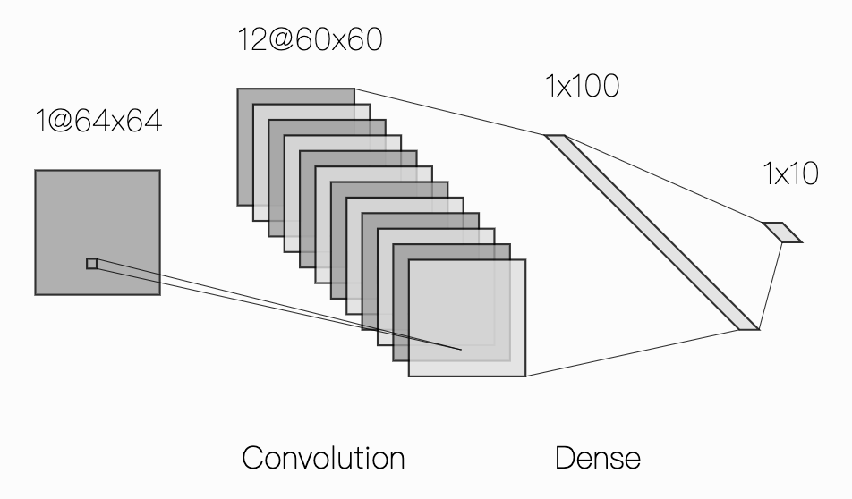

现在我们来计算上图所示卷积层的参数总数。每个卷积核包含 5×5+1=26 个参数，该层共有 12 个卷积核，因此这一层的总参数数量为 26×12=312。推广到一般情况：如果一个卷积层包含 n 个尺寸为 k 的卷积核，则该卷积层的参数总数可由以下公式计算：

$$
params = (k^2 + 1)n
$$


### 输入输出通道

在前面的例子中，我们假设输入为灰度图像。而在实际应用中，我们常常需要处理彩色图像。这类图像可以按照红、绿、蓝（RGB）三原色拆分为三张独立的图像分别进行处理，我们将一种颜色分量称为一个**通道**（Channel）。由于图像是卷积层的输入，因此我们将其称为**输入通道**。与之相对应，卷积层会生成多张特征图像，我们将其中的每一张特征图都称为一个**输出通道**。

为了适配多通道输入，卷积核不再是单一的二维矩阵，而是由多个矩阵组成的列表。具体来说，若输入通道数量为 m，则卷积层中的每个卷积核就对应包含 m 个矩阵，每个通道分别与一个矩阵进行运算。需要注意的是，每个卷积核对应的偏置项仍然只有一个。

我们再重申一遍：当输入通道数大于 1，例如为 m 时，每个卷积核同样会对应 m 个矩阵，而非单个矩阵。卷积核在某一位置计算时，只需对每个通道分别与对应的卷积核矩阵做加权求和，再将所有通道的结果累加，最后加上偏置即可。需要注意的是，偏置仅需添加一次。

为了更清晰地说明这一过程，我们仍以一个简单示例进行讲解。假设输入的彩色图像尺寸为 3×3，卷积核大小为 2×2，且当前计算位置位于图像左上角，此时的卷积计算过程如下图所示。可以看到，输入图像被拆分为三份，与之对应，卷积核同样包含三个矩阵。

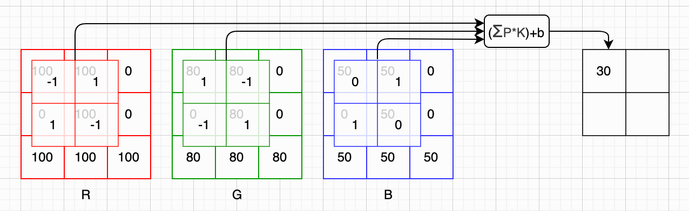

一般而言，我们假设某一卷积层具有 \(m\) 个输入通道和 \(n\) 个卷积核。我们仍采用 \(y_{ij}\) 表示某一个卷积核所对应输出矩阵中第 \(i\) 行、第 \(j\) 列的元素，用 \(P_{hij}\) 表示第 \(h\) 个输入通道上，与当前计算位置对应的小区域，用 $K_h$ 表示与通道对应的卷积核矩阵。那么，对于该卷积核而言，其输出矩阵上的某一元素 \(y_{ij}\)，可由以下公式计算得出：

$$
y_{ij} = (\sum_{h=1}^{m}{P_{hij} * K_{h}}) + b
$$

和前面小节的处理方式一致，我们将卷积核的具体参数隐去，仅保留核心的计算流程。下图清晰展示了上述 RGB 三通道卷积示例的完整计算细节：

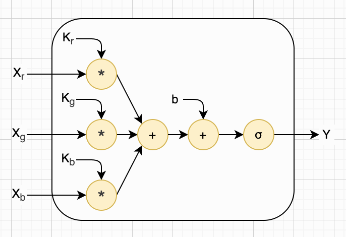

了解了输入通道的工作机制后，我们可以将这一细节暂时隐藏。我们用 `[X]` 表示多通道输入特征图，用 `[K]` 表示对应通道的卷积核权重集合，那么上文的计算过程便可简化为下图所示形式：

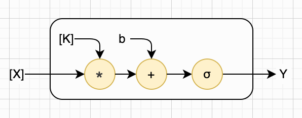

现在我们可以将卷积核的数量增加到两个，以此体现输出通道的概念。我们用 `[Y]` 表示多通道输出特征图，至此完整的卷积层计算过程可以用下图表示：

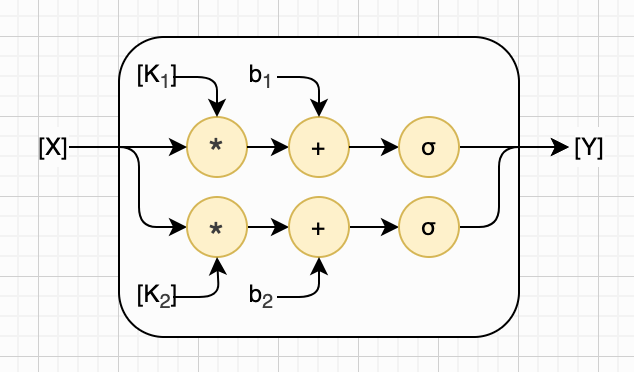

不过针对多通道输入的情况，我们需要相应更新卷积层参数的计算公式。一般而言，对于具有 \(m\) 个输入通道、\(n\) 个大小为 \(k\) 的卷积核的卷积层，其总参数数量可由以下公式计算得出：

$$
params = (m \cdot k^2 + 1)n
$$

现在我们来看一个稍复杂的网络结构。该网络在前一小节示例的基础上做了两处改造：第一，输入图像为彩色图像；第二，新增了第二个卷积层，该卷积层同样包含 12 个 5×5 大小的卷积核，且步幅设为 1。该网络的整体结构如下图所示：

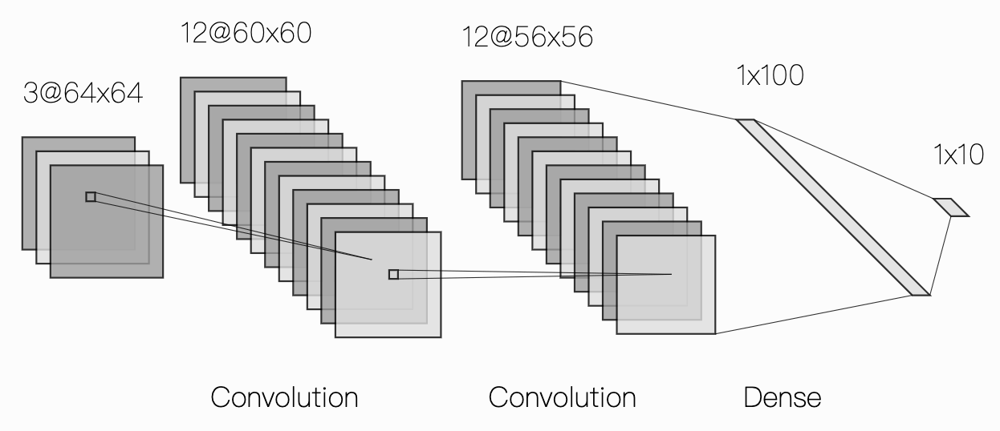

为了帮助大家更好地理解这一内容，我们来计算一下上图中两个卷积层的参数数量。首先分析第一个卷积层：该层的输入通道数为 3，输出通道数为 12，因此根据前文给出的公式，其总参数数量计算如下：

$$
(3 \times 5^2 + 1) \times 12 = 900
$$

接下来我们分析第二个卷积层：该层以第一个卷积层的输出作为自身输入，因此其输入通道数为 12；而该卷积层的输出通道数同样为 12，因此根据前文给出的公式，其总参数数量计算如下：

$$
(12 \times 5^2 + 1) \times 12 = 3612
$$

需要说明的是，此处为方便演示，卷积核数量等参数均为示例性设置，并无实际约束。在实际应用中，卷积层的数量、每个卷积层包含的卷积核个数、卷积核的大小及步幅等，均具有极强的灵活性，这些参数的设定属于模型架构设计的核心内容。

到这里，卷积层的核心工作原理、完整计算逻辑与关键细节，我们就已经全部讲解清楚了。接下来，我们对之前实现的卷积层函数进行改进，将输入通道与输出通道的相关逻辑整合进去，新的函数代码如下所示：

```python
def new_conv_layer2(kernel_list, padding=0, stride=1):
    def conv_layer(input_mat_list):
        output_mat_list = []
        
        # 遍历每一个多通道卷积核 (kernel_mat_list, bias)
        for kernel_mat_list, bias in kernel_list:
            output_mat_list_tmp = []
            
            # 遍历每个输入通道（对应每个卷积核通道）
            for i in range(len(input_mat_list)):
                input_mat = input_mat_list[i]
                kernel_mat = kernel_mat_list[i]
                output_mat = conv2d(input_mat, kernel_mat, 0, padding, stride)
                output_mat_list_tmp.append(output_mat)
            
            # 所有通道结果逐元素相加 → 再加偏置
            fused_mat = np.sum(output_mat_list_tmp, axis=0)
            output_mat = fused_mat + bias
            output_mat_list.append(output_mat)
        
        return output_mat_list
    return conv_layer
```


### 池化层

通过前文的介绍，我们已经掌握了卷积核、卷积运算的原理，也明确了卷积层的参数计算方式及输入、输出通道的核心概念。卷积层的核心作用是提取图像的局部特征，随着卷积操作的进行，特征图虽能保留关键特征，但仍存在尺寸较大、冗余信息较多的问题，且计算量会随网络深度增加而大幅提升。为解决这一问题，让模型更高效地学习通用特征，我们需要引入一种新的网络层——池化层（Pooling Layer）。

如果大家初次听到“池化层”这个词感到困惑，其实不必担心。我第一次接触这个术语时，也有同样的感受。实际上，我认为若将其翻译为“汇集层”，会更便于理解。因为池化层的核心作用，就是将局部区域内的多个像素特征汇集在一起，整合为一个特征值，从而达到缩小特征图尺寸、实现下采样的目的。不过，“池化层”作为领域内统一的标准翻译，我们后续仍沿用这一表述。接下来，我们将详细介绍池化层的定义、作用及常见的池化方式。

其实在理解卷积操作的基础上，掌握池化层就比较容易了。因为池化层同样采用滑动窗口机制，其计算逻辑与卷积操作的滑动窗口模式一致。不过与卷积操作相比，池化层的操作要简单得多。下面我们结合两者的异同，具体对比说明。

我们先来看二者的相似之处。首先，池化层同样需要定义一个固定大小的小窗口（即池化核），这个窗口有着明确的尺寸规格，比如常用的2×2规格。其次，与卷积操作的窗口移动方式一致，池化层的小窗口也会按照预设的步幅，从左至右、从上至下依次划过输入特征图，对窗口覆盖区域的特征进行计算处理后，将计算结果对应填入输出矩阵的相应位置。因此，对于任意一张输入图像而言，经过池化操作后，输出的依然是一张特征图，只是其尺寸会根据窗口和步幅的设置有所缩小，实现特征的压缩与提炼。

我们再来看二者的不同之处。第一，池化层的小窗口是没有可学习参数的。与卷积操作不同，卷积操作需要定义卷积核的具体权重参数，而池化操作的小窗口无需设置任何额外参数，因为其核心作用就是对覆盖区域内的图像信息进行汇集、整合，无需通过参数调整来提取特征。第二，虽然池化层的小窗口同样有移动步幅的设置，但该步幅通常大于1。例如，采用2×2的池化窗口搭配步幅2，就能将原特征图的尺寸压缩至原来的1/4，既实现了降维，又能高效保留关键特征，这也是实际应用中最常用的搭配方式。

可见，池化层的最主要目的就是压缩图像，也正因为如此，它经常被称为**下采样** （Downsampling）。最常用的池化操作是**最大池化**（Max Pooling） ，即取局部区域的最大值；除此之外，还有**平均池化** （Avg Pooling）等其他方式，此处不再一一介绍。我们以4×4的输入图片、2×2的池化窗口、步幅为2的最大池化为例，结合图示具体说明池化操作的过程。对于这张小图片而言，完整的池化操作如下图所示：

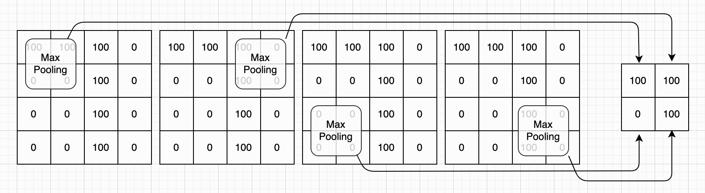

需要补充说明的是，若输入为多个通道，池化层会对每一张输入特征图依次进行独立处理，各通道的池化操作互不干扰、互不影响。对于任意一张输入特征图，我们仍假设其经过池化操作后的输出为矩阵 $Y$ ，其中 $y_{ij}$ 表示该矩阵中第i行、第j列的元素，矩阵 $P_{ij}$ 表示输入特征图上与该元素对应的局部区域（即池化窗口所覆盖的区域）。以最大池化为例，我们可通过以下公式，计算输出矩阵任意位置的元素值：

$$
y_{ij} = \mathrm{max}(P_{ij})
$$

我们将上一节中的LeNet风格示例进行拓展，在两个卷积层之后分别增添一个池化层。具体设置为：池化窗口大小为2×2，移动步幅为2。通过这样的设置，可将输入特征图的尺寸缩小至原来的1/4。更新后的完整网络结构如下所示：

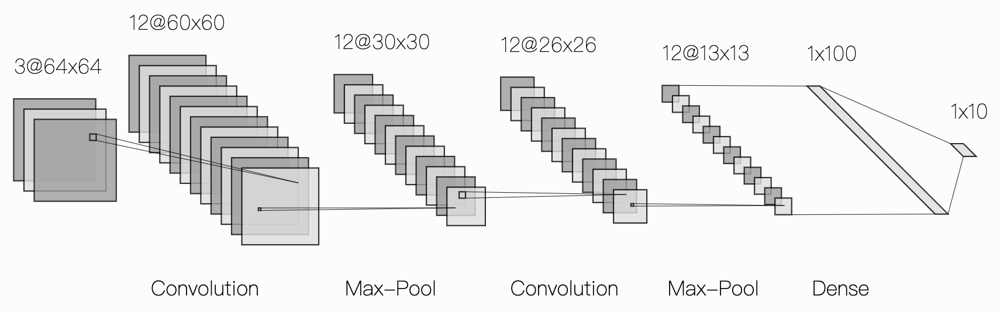

与上一节中的卷积层示例类似，此处池化层的小窗口大小、移动步幅也均为我随意设置的示例性参数，并非固定要求。在实际应用中，池化层的小窗口大小、移动步幅均可灵活调整，其设置逻辑与卷积核大小、步幅的设置逻辑一致，同样属于模型架构设计的核心内容之一。

代码：

```python
def max_pool2d(input_mat, win_size, stride=1):
    return apply_sliding_window(input_mat, win_size, win_size, stride, np.max)
```


### 扁平化

卷积模块处理完输入图片后，通常会输出 n 个特征图（其中 n 等于最后一层卷积层所使用的卷积核数量），这些特征图的尺寸通常远小于原始输入图片。而后续的全连接网络，其输入要求为一维特征向量，因此我们需要对这些多通道特征图进行一次**扁平化（Flatten）** 处理。

简单来说，扁平化的核心操作的是：将每一张特征图逐行逐列地展平为一个一维向量，再将所有通道对应的一维向量按顺序拼接整合，最终得到一个符合全连接网络输入规格的一维特征向量。我们可以将这一扁平化逻辑封装成一个函数，具体代码如下所示：

```python
def flatten(input_mat_list):
    flattened = []                # 创建一个空列表，用于存放所有元素
    for mat in input_mat_list:    # 遍历每一个通道的特征图
        for row in mat:           # 遍历矩阵中的每一行元素
            flattened.extend(row) # 将一行元素全部加入列表
    return flattened              # 返回展平后的一维数组
```

以上一小节的 LeNet 风格示意图为例，我们可以看到，经过卷积层和池化层处理后，会得到 12 张 13×13 大小的特征图（即 12 个通道）。把这 12 张 13×13 的小特征图进行扁平化处理后，每张特征图可展平为 13×13=169 个数值，12 张特征图总共就是 12×169=2028 个数值，这些数值整合起来，就构成了扁平化后的一维特征向量。将这个一维特征向量作为输入，送入后续的全连接模块，就能得到最终的输出结果。

好的，现在我们就来具体计算一下，上面例子中的卷积神经网络一共有多少个参数。首先明确两个关键前提：我们例子中所有卷积核的尺寸均为 5×5，且每个卷积层的卷积核都包含偏置项。具体计算过程如下：

第一个卷积层，输入通道数为 3，共设置 12 个卷积核（对应 12 个输出通道），根据参数计算逻辑，其总参数数量为 (3×5×5 + 1)×12 = 912 个；第二个卷积层，输入通道数为 12，同样设置 12 个卷积核，其总参数数量为 (12×5×5 + 1)×12 = 3612 个；需要注意的是，池化层仅负责特征压缩，没有可学习参数，因此不产生额外参数。综上，整个卷积模块的总参数数量就是 912 + 3612 = 4524 个。

扁平化处理后，12张13×13大小的特征图，总共可展平为12×13×13=2028个数值。这组扁平化后的数值将作为输入，传入第一个全连接隐藏层，该隐藏层共设置100个神经元。根据我们前文介绍的全连接层参数计算公式，可计算出该层的总参数数量为(2028+1)×100=202900个。

再看最后的输出层，该层共设置10个神经元，按照同样的参数计算公式，其参数数量为(100+1)×10=1010个。将第一个全连接隐藏层与输出层的参数数量相加，可得出整个全连接模块的总参数数量为202900+1010=203910个。卷积模块和全连接模块，一共是4524+203910=208434个参数。整个的计算见下表：

| 层             | 公式                              | 参数数量 |
| -------------- | --------------------------------- | -------: |
| 第一个卷积层   | $(3 \times 5^2 +1) \times 12$     |      912 |
| 第二个卷积层   | $(12 \times 5^2 +1) \times 12$    |    3,612 |
| 第一个全连接层 | $(12 \times 13^2 + 1) \times 100$ |  202,900 |
| 输出层         | $(100 + 1) \times 10$             |    1,010 |
| 累计           |                                   |  208,434 |


### 交互式工具

到这里为止，整个卷积神经网络就都介绍完毕了。相比多层感知机，卷积神经网络的结构确实更为复杂，因此我们不妨停下来，对前面讲解的内容做一个简要总结。其实卷积神经网络的核心概念很简洁，主要包含两个关键层：卷积层和池化层，这两个层交替堆叠，就构成了整个卷积模块。之后，我们将卷积模块的输出结果进行扁平化处理，再搭配一个全连接模块，便组成了完整的卷积神经网络。

卷积层由n个独立运行的卷积核组成，其输出结果为n个特征图，其中n也被称为卷积层的输出通道。每个卷积核包含m个k×k大小的权重矩阵，以及一个偏置项，这里的m就是卷积层的输入通道数量。每个卷积核会以滑动窗口的机制，按照预设的步幅划过输入图像，完成特征提取工作，并输出对应的特征图。

与卷积层不同，池化层没有可训练的参数，我们只需确定它的三个核心设置即可：池化方式（例如最大池化或平均池化）、池化窗口大小（如常用的2×2）以及移动步幅（如常用的2）。对于每一张输入特征图，池化层都会以相同的方式进行处理，最终生成一张尺寸缩小的特征图，从而实现下采样、压缩图像尺寸的核心作用。

在我们学习卷积核相关知识时，曾提到过一个[交互式工具](https://poloclub.github.io/cnn-explainer/)。这里需要补充说明的是，这个工具并非仅用于演示卷积核，而是一个完整的、以交互式方式讲解卷积神经网络的工具。如果大家对前面讲解的内容还没有完全理解，可以通过这个交互式网址深入学习。它的每一个部分几乎都可以点开查看细节，操作直观、讲解细致，非常适合入门学习者使用。下面是该工具的截图：

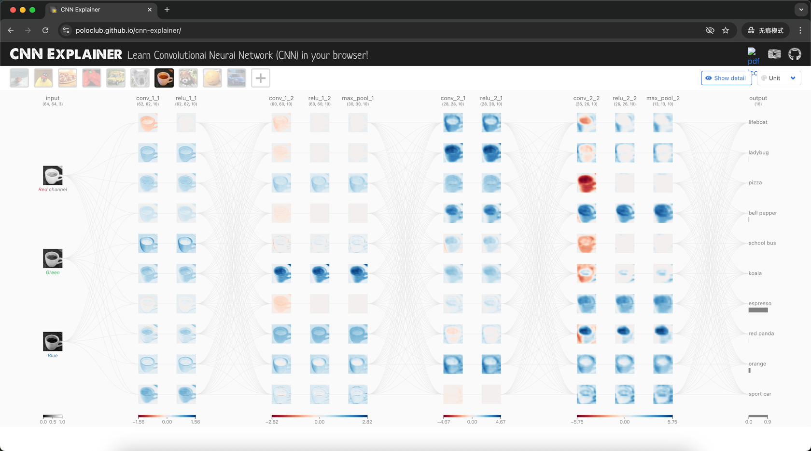


### LeCun1989：卷积神经网络的诞生

前面我们已经把 CNN 的核心组件（卷积层、池化层、扁平化）都讲完了，你可能会好奇：这么巧妙的结构是怎么想出来的？我们不妨从深度学习的一段关键历史讲起，你就能更深刻理解 CNN 的设计思路和价值。

时间回到 1989 年，当时神经网络研究刚刚从近 20 年的 “寒冬” 里走出来 ——1969年人工智能先驱马文・明斯基在《[感知机](https://direct.mit.edu/books/monograph/3132/PerceptronsAn-Introduction-to-Computational)》一书中证明了单层神经网络无法解决非线性问题，并且推断多层网络也没有有效的训练方法，这个结论直接把神经网络的研究打入了冷宫。直到 1986 年鲁梅尔哈特、辛顿等人提出反向传播（BP）算法，才从理论上解决了多层网络的训练问题，但当时这个算法只在简单的模拟数据集上跑通过，没人敢说它能解决真实世界的复杂任务。
就在这个节点，年轻的杨立昆（Yann LeCun）在贝尔实验室发表了一篇奠定现代计算机视觉基础的经典论文：《[反向传播算法在手写邮政编码识别中的应用](http://yann.lecun.com/exdb/publis/pdf/lecun-89e.pdf)》，直接打破了这个僵局，也开启了卷积神经网络的产业化序幕。
这篇论文没有做空泛的理论推导，而是瞄准了当时美国邮政的真实痛点：每天上百万封手写邮编的信件，人工识别效率低、错误率高，亟需自动化方案。杨立昆团队专门为手写数字识别设计的网络结构，第一次引入了我们前面刚讲的 “局部感受野”、“权值共享” 这两个卷积层的核心思想，这就是世界上第一个真正意义上的卷积神经网络，也是后续 LeNet 系列网络的雏形。

这里我们呼应一下前面的内容：我们之前用来绘制网络结构的 “LeNet 风格” 示意图，设计原型就来自这篇论文里的网络架构。
这篇论文最里程碑的意义在于：第一次把反向传播算法成功用到了真实世界的任务上。他们用了美国布法罗邮政局的真实手写邮编数据集，一共 9298 个样本，7291 个用来训练，2007 个用来测试，包含了各种书写风格、模糊不清的难例，非常贴近真实场景。最终网络做到了 1% 的错误率、9% 的拒绝率（实在识别不了的就交给人工），是当时的最高水平。这个成果直接打破了 “多层神经网络无法落地” 的固有认知：之前大家都觉得 BP 算法只是个理论玩具，而杨立昆团队证明了通过合理设计网络结构、融入任务先验知识，完全可以用 BP 算法训练深层网络处理真实图像数据。从此反向传播算法才真正成为所有深度神经网络训练的核心算法，卷积神经网络也正式走上了主流舞台。

这篇论文里的网络还只是雏形，经过杨立昆团队近 10 年的迭代优化，1998 年正式推出了更加成熟的 LeNet-5—— 是第一个真正商业化落地的卷积神经网络，后来被广泛用在 ATM 机识别支票数字的场景里，直到现在在很多银行还在使用基于这个架构改造的方案。1989 年的这个初代网络输入是 16×16 的灰度图像，包含两个卷积层（每个 12 个 5×5 卷积核）、一个全连接隐藏层、最后 10 个神经元输出对应 0-9 的分类。

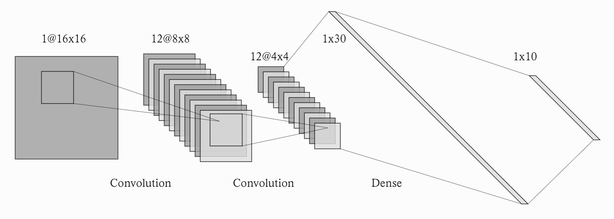

其实这个网络结构和我们前面讲的 CNN 结构逻辑已经完全一致了，只是在激活函数、下采样的实现细节上有一些差异，我们就不展开细讲了。
接下来我们重点讲解它的迭代版本：经典的 ***LeNet-5***。


### LeNet-5
LeNet-5作为 1989 年论文中网络雏形的优化升级版本，它的核心逻辑和我们前面刚讲的 CNN 标准范式完全一致：`输入层→卷积层→池化层→卷积层→池化层→扁平化→全连接层→全连接层→输出层`，这也奠定了后续所有卷积神经网络的标准结构模板。

原始 LeNet-5 的输入为单通道 32×32 像素的灰度图像，相比 1989 年版本的 16×16 输入有所扩大，目的是保留更丰富的数字笔画细节，提升识别精度。这里的尺寸设计也很巧：32×32 经过后续的卷积、池化操作，输出尺寸都是整数，不需要做特殊的裁剪或填充，刚好匹配我们前面讲的卷积输出尺寸计算公式。

我们逐层拆解它的结构：

+ 第一个卷积层：配置 6 个 5×5 大小的卷积核，卷积步幅设为 1，无填充。输入 32×32 的图像，输出为 6 张 28×28 大小的特征图，每个特征图对应一个卷积核提取的边缘、纹理等基础特征。
+ 第一个池化层：2×2 大小、步幅为 2 的最大池化，对特征图做下采样，输出变为 6 张 14×14 大小的特征图，既压缩了计算量，又提升了特征的平移鲁棒性。
+ 第二个卷积层：配置 16 个 5×5 大小的卷积核，步幅 1，无填充，进一步提取更高阶的组合特征（比如拐角、笔画片段），输出为 16 张 10×10 大小的特征图。
+ 第二个池化层：和第一个池化层参数一致，输出变为 16 张 5×5 大小的特征图，完成第二轮的特征压缩。
+ 扁平化处理：把 16 张 5×5 的二维特征图拉平成一维向量，总长度是 16×5×5=400，送给后续的全连接层。
+ 第一个全连接层：120 个神经元，负责把前面提取的所有特征做整合、映射。
+ 第二个全连接层：原始 LeNet-5 里是 84 个神经元，我们后面的代码实现做了微小调整，改成了 100 个，不影响核心结构。
+ 输出层：10 个神经元，对应 0-9 十个数字的分类。

它的结构示意图如下所示:
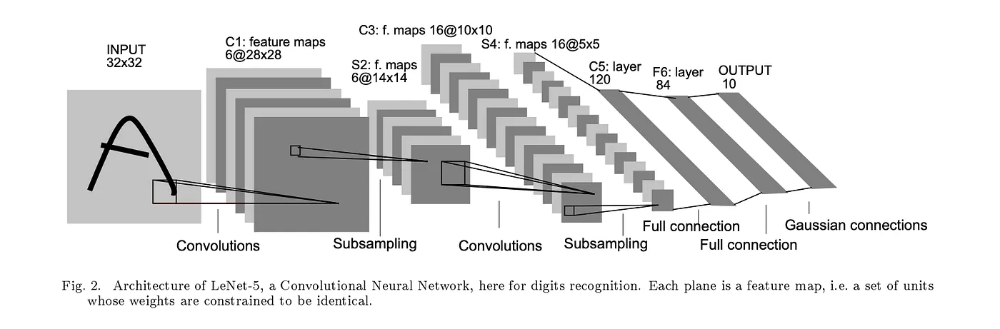

我们前面一直用的 LeNet 风格架构图，设计原型正是出自这篇经典论文。前面我们提到的 CNN 交互式可视化工具里，演示的就是这个 LeNet-5 的结构，感兴趣的同学可以去动手调整参数看看每一层的输出变化，理解起来会更直观。
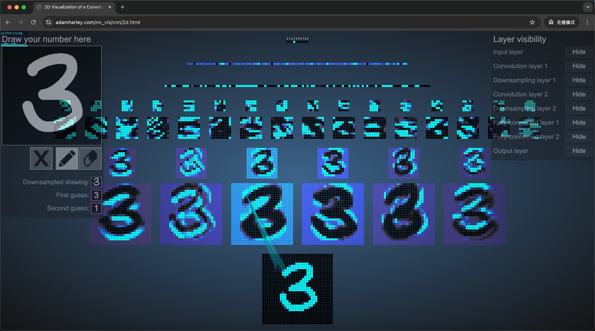

了解完 LeNet-5 的完整架构后，我们不妨举一反三，计算一下它的参数数量，巩固前面学过的参数计算方法。忘了怎么算的同学可以翻回本章前面卷积层、全连接层的参数计算公式，每一层的计算逻辑我们之前都讲过哦。我把每一层的参数数量整理在了下面的表格里，推导过程留给大家自行验证：

| 层             | 说明                                        | 参数量 |
| -------------- | ------------------------------------------- | -----: |
| 第一个卷积层   | 输入通道 = 1，输出通道 = 6，卷积核大小 = 5  |    156 |
| 第二个卷积层   | 输入通道 = 6，输出通道 = 16，卷积核大小 = 5 |  2,416 |
| 第一个全连接层 | 输入神经元 = 16×5×5=400，输出神经元 = 120   | 48,120 |
| 第二个全连接层 | 输入神经元 = 120，输出神经元 = 84           | 10,164 |
| 输出层         | 输入神经元 = 84，输出神经元 = 10            |    850 |
| 总计           |                                             | 61,706 |

接下来，我们用 PyTorch 框架来复刻这个经典的 LeNet-5 结构，用来完成 MNIST 手写数字识别任务。代码并不复杂（这里我们仅给出了前向推理过程，训练过程我们放在后面章节中单独讲解）：

```python
# 定义 LeNet-5 网络
class LeNet5(nn.Module):

    def __init__(self):
        super(LeNet5, self).__init__()

        # Conv layer 1, 1×28×28 -> 6×28×28
        self.conv1 = nn.Conv2d(in_channels=1, out_channels=6,
                               kernel_size=5, padding=2)

        # MaxPool, 6×28×28 -> 6×14×14
        self.pool = nn.MaxPool2d(2, 2)

        # Conv layer 2, 6×14×14 -> 16×10×10
        self.conv2 = nn.Conv2d(in_channels=6, out_channels=16,
                               kernel_size=5)

        # Fully connected layers, 16×5×5 = 400
        self.fc1 = nn.Linear(16 * 5 * 5, 120)
        self.fc2 = nn.Linear(120, 84)
        self.fc3 = nn.Linear(84, 10)

        self.relu = nn.ReLU()

    def forward(self, x):
        x = self.relu(self.conv1(x)) # Conv1
        x = self.pool(x)             # Pool1
        x = self.relu(self.conv2(x)) # Conv2
        x = self.pool(x)             # Pool2
        x = x.view(-1, 16 * 5 * 5)   # Flatten
        x = self.relu(self.fc1(x))   # Fully connected
        x = self.relu(self.fc2(x))   # Fully connected
        x = self.fc3(x)              # Output
        return x
```

这里有个小细节说明：原始LeNet-5的输入是32×32像素，而MNIST数据集的图片是28×28像素，所以我们只在第一个卷积层加了padding=2，通过边缘填充把输入补成32×32，其余结构完全和原始LeNet-5一致，最大程度保留了经典架构的设计。

我在本地跑了这个模型，训练5个epoch就能得到非常好的效果：
```
Epoch 1/5, Loss: 0.3111
Epoch 2/5, Loss: 0.0838
Epoch 3/5, Loss: 0.0595
Epoch 4/5, Loss: 0.0451
Epoch 5/5, Loss: 0.0378

Test Accuracy: 98.65%
```
这个准确率比我们之前实现的多层感知机的91.48%高了7个百分点，参数还不到它的1/4，这就是卷积结构处理图像数据的优势所在。


### 本章小结

在本章中，我们先从整体上介绍了卷积神经网络（CNN）的基本结构，然后循序渐进地讲解了卷积运算的核心机制，包括卷积核的计算方式、滑动窗口、填充、步幅、输入输出通道等关键概念。在此基础上，我们进一步介绍了一个完整卷积层的组成。接着，又讨论了池化层和扁平化等常见模块，帮助你理解一个典型 CNN 是如何由多个组件组合而成的。最后，我们简要回顾了杨立坤的重要研究与贡献，并重点介绍和复刻了经典的 LeNet-5 网络。

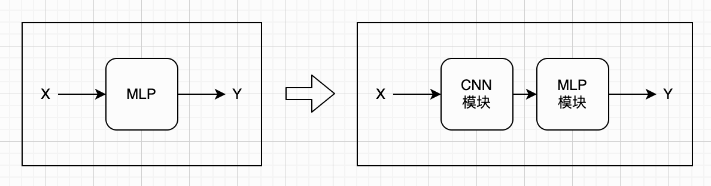

对比前一章介绍的多层感知机可以发现，LeNet-5 在参数数量上大约只有其 20% 左右，但在手写数字识别任务上的准确率却可以提升到接近 98.7%，效果提升是非常明显的。这也体现了卷积结构在处理图像数据时的优势：通过局部感受野、参数共享等机制，大幅减少参数的同时，还能更好地提取空间特征。为了让读者更直观地感受这种差异，我们将我们所实现的单层感知机、多层感知机以及 LeNet-5 的参数规模和识别准确率整理在下面的表格中，方便对比查看。

| 网络架构   | 参数数量 | 准确率 |
| ---------- | -------: | -----: |
| 单层感知机 |    7,850 | 89.93% |
| 多层感知机 |  266,610 | 91.48% |
| LeNet-5    |  61,706 | 98.65% |

从第二章开始，我们一直在处理“手写数字识别”这一类任务。这类问题有一个共同特点：输入数据的长度是固定的（例如固定大小的图像）。但在实际应用中，还有很多数据并不是固定长度的。比如给定一封邮件或一段文本，我们希望判断它是否是垃圾邮件；或者输入一句话，让模型完成翻译。这类问题的输入长度是变化的，传统的多层感知机和卷积神经网络就不太适合直接处理，而这正是循环神经网络（RNN）擅长的场景。

从发展历史来看，循环神经网络的提出其实要早于卷积神经网络。但从学习路径上考虑，后者的结构与计算过程更加直观易懂，因此我们先介绍了卷积神经网络相关内容。在接下来的章节中，我们将正式进入循环神经网络的学习，讲解其基本原理与经典变体。同时，我们也会逐步引入更具一般性的序列建模问题，并沿着模型演进的脉络，看看这些经典结构是如何一步步发展，最终走向如今的大语言模型的。
