## 第五章：循环神经网络

在第四章中，我们学习了卷积神经网络，并亲手实现了经典的 LeNet-5，在手写数字识别任务上取得了接近 99% 的准确率。从第二章的单层感知机，到第三章的多层感知机，再到第四章的卷积神经网络，一路走来，我们处理的始终是同一类问题：输入数据的结构是固定的。以手写数字识别任务为例，输入始终是一张尺寸固定的图像。

但现实世界中，有大量问题并不是这样的。考虑一下这些场景：给你一封邮件，判断它是否是垃圾邮件；给你一段语音，转录成文字；给你一句中文，翻译成英文。这些问题有一个共同点：输入的长度是不固定的。一封邮件可能有十个词，也可能有一千个词；一段语音可能持续三秒，也可能持续三分钟。我们把这类长度不定、有先后顺序的数据，统称为序列数据（Sequential Data）。

面对序列数据，我们之前学过的网络结构就显得力不从心了。比如，我们很难把一篇长短不一的文章直接塞进固定大小的输入层。而这正是循环神经网络（Recurrent Neural Network，简称 RNN）被提出的动机，它通过给全连接层添加一个隐藏状态，巧妙地解决了这个问题。

在本章中，我们将从回顾全连接层出发，一步步推导出 RNN 的结构与计算方式。你会看到，RNN 其实并不神秘，它只是在全连接层的基础上，增加了一个隐藏状态的传递机制。理解了 RNN 的基本原理之后，我们将动手实现一个字符级 RNN，让它在莎士比亚文集上训练，学会"续写"文章——这将是我们第一次亲身体验生成式 AI 的雏形。   


### 回顾全连接层

让我们先暂时忘记第四章介绍的卷积神经网络（CNN），回顾一下第二章开始介绍的全连接层。为了便于画图展示，我们以一个很小的全连接层为例来回顾：该层包含两个神经元，并接收三个输入。下图以三种不同的表现形式，展示了这个小的全连接层：

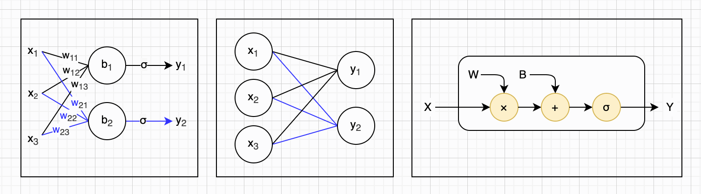

所谓全连接层，就是每一个输入都会与该层的每一个神经元相连接。但需要注意的是，全连接层中的每个神经元是相互独立计算的：每个神经元都拥有自己的一组权重参数（其数量与输入维度一致）以及一个偏置项，并基于这些参数独立地计算输出值。这一点也可以从上图（左）清晰地看出。

在我们熟悉了神经元和全连接层的基本工作机制之后，就可以把具体的权重、偏置和激活函数“折叠”或“隐藏”起来，从而将结构简化为更直观的表示形式，如上图（中）所示。这种表示方式更强调网络机构，而弱化了底层参数细节。

不过，无论是上图（左）还是（中），都只适用于展示结构较为简单的情况；当输入维度或神经元数量增加时，这种画法就会变得不够清晰。为了更好地描述实际中的全连接层结构，同时保留其计算本质，我们引入矩阵形式的表示方法，如上图（右）所示。

在这种表示中：输入 $\mathbf{x}$ 、输出 $\mathbf{y}$ 、偏置 $\mathbf{b}$ 都表示为**列向量**，用粗体小写字母；权重 $W$ 表示为一个**矩阵**，用大写字母，其每一行对应一个神经元的权重参数。这样不仅可以清晰表达结构，还能自然引出其计算过程。全连接层的前向传播可以统一表示为：

$$
\mathbf{y} = f(\mathbf{x}) = \sigma(W\mathbf{x} + \mathbf{b})
$$

其中， $W\mathbf{x} + \mathbf{b}$ 表示线性变换， $\sigma$ 表示逐元素应用的激活函数（如 ReLU、Sigmoid 等）。这个公式完整刻画了全连接层的前向计算过程。如果你对这些内容还不够熟悉，可以回顾本书第二章和第三章的相关内容，再继续阅读本章后续部分。


### 增加隐藏状态

如果你已经理解了上面回顾的全连接层，那么你就会知道：全连接层本身完全是**无状态**的。也就是说，一旦我们确定了一个全连接层的结构（输入维度、神经元数量、激活函数）以及参数（每个神经元的权重向量和偏置），那么对于任意一个确定的输入向量 $\mathbf{x}$ ，它的输出向量 $\mathbf{y}$ 就是**唯一且确定的**，不会受到“历史输入”的影响。

而循环神经网络（RNN）与全连接网络的关键区别就在这里：RNN 在全连接层的基础上，引入了一个**隐藏状态**（Hidden State）。这个隐藏状态可以在时间维度上被保留和传递。也就是说，RNN 在每次计算时，不仅依赖当前输入，还会结合“过去的信息”（即上一次的隐藏状态）来进行计算，并生成新的隐藏状态。随着输入序列一步一步地进入网络，这个隐藏状态会被不断更新、反复利用，这也正是“循环神经网络（Recurrent Neural Network）”这一名称的由来。

那么，RNN 层的隐藏状态到底是什么样子？它又是如何更新的呢？答案稍微复杂一点。首先，隐藏状态本质上是一个**向量**（通常称为隐藏向量或状态向量），其维度由模型设计决定（即隐藏层大小）。其次，为了完成隐藏状态的更新，RNN 在参数上也比全连接层更丰富一些。一个标准的 RNN 层通常包含三个权重矩阵和两个偏置向量，这些细节我们马上就会讨论。有些实现中会将偏置合并或省略输出层的激活函数，这取决于具体任务和框架实现。

简而言之，RNN 层的计算可以分为两个阶段来理解。首先，根据当前输入和旧的隐藏状态，计算新的隐藏状态。然后，基于更新后的隐藏状态，计算当前时刻的输出。我们用 $\mathbf{h}$ 和 $\mathbf{h}'$ 来表示前后隐藏状态，用带有下标的 $W$ 和 $\mathbf{b}$ 来表示权重矩阵和偏置向量，那RNN层对应的计算公式如下（这些下标的含义我马上会介绍）：

$$
\mathbf{h}' = \sigma(W_{xh}\mathbf{x} + W_{hh}\mathbf{h} + \mathbf{b}_h) \\
\mathbf{y} = \sigma(W_{hy}\mathbf{h}' + \mathbf{b}_y)
$$

相比全连接层，这个公式看起来确实更复杂一些。不过不用担心，如果你已经理解了全连接层，其实可以把 RNN 看作是“两个全连接层的组合 + 一个状态连接”。

我们先来看第一行的计算。如果暂时忽略 $W_{hh}\mathbf{h}$ 这一项，那么这一部分其实就是一个标准的全连接层（输入为 $\mathbf{x}$ ，输出为 $\mathbf{h}'$ ），如下图（左侧虚线框）所示。而第二行计算，则完全对应另一个标准的全连接层（从 $\mathbf{h}'$ 到 $\mathbf{y}$ ），如下图（右侧虚线框）所示。单看两个虚线框的话，完全就是一个两层全连接网络。

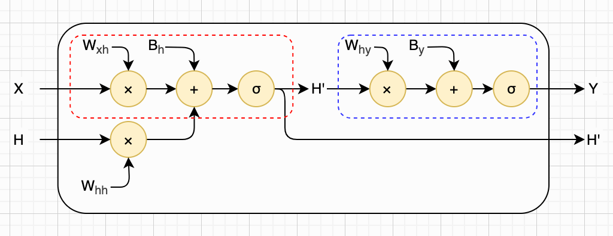

再回到第一行计算，我们只是在原本的全连接层基础上，引入了“上一时刻的隐藏状态”这一额外输入项（即 $W_{hh}\mathbf{h}$ ）。可以把它理解为：这个全连接层不仅“看当前输入”，还“看过去的记忆”。换句话说，RNN 层本质上可以理解为：一个“带记忆的全连接层”（用于更新隐藏状态） + 一个标准的全连接层（用于生成输出）。

需要注意的是，在上图中，为了便于理解，我们把“旧的隐藏状态 $\mathbf{h}$ ”画在左侧，与输入 $\mathbf{x}$ 并列；把“新的隐藏状态 $\mathbf{h}'$ ”画在右侧，与输出 $\mathbf{y}$ 并列。但在实际实现中，隐藏状态是RNN 内部维护的变量，并不会像普通输入输出那样显式暴露出来。等你熟悉这种计算方式后，可以将其理解为“隐式流动”的内部信息。

接下来，我们用一段 Python 代码来实现一个简单的玩具 RNN 层，帮助你加深对这些公式的理解：

```python
def new_rnn_layer(mat_w_xh, mat_w_hh, mat_w_hy, vec_b_h, vec_b_y, vec_h, af):
  def rnn_layer(vec_x):
    nonlocal vec_h  # 声明使用外部的隐藏状态
    vec_h = af(mat_w_xh @ vec_x + mat_w_hh @ vec_h + vec_b_h)
    vec_y = af(mat_w_hy @ vec_h + vec_b_y)
    return vec_h, vec_y
  return rnn_layer
```

（TODO：激活函数一般用Tanh）

你可能已经看懂了上面的介绍与公式推导，但依然会困惑：这样设计的直观意义是什么？隐藏状态与各个权重矩阵具体是什么形状？一段序列又是如何被切分成输入、一步步送入 RNN 中进行计算的？别着急，下面我们一步步拆开来讲清楚。


### 隐藏状态形状

看懂了前面的公式与示意图后，隐藏状态 $\mathbf{h}$ 的形状就相对容易理解了。不过为了避免过于抽象，我们可以借助一个具体的多层感知机（MLP）示例，来辅助理解 RNN 层的结构。假设我们有一个两层全连接网络，输入维度为 3，输出维度为 2，隐藏层神经元数量为 4，其结构如下图所示。你可以暂时把这个 MLP 的隐藏层，看作具有相同输入、输出维度的 RNN 层的隐藏状态。

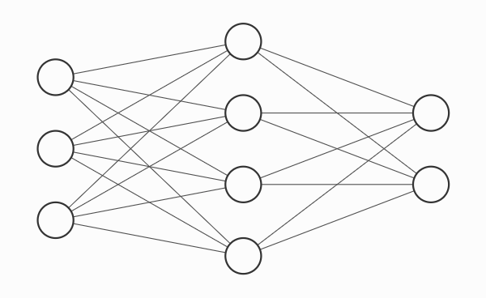

我们先来看前半部分公式，也就是更新隐藏状态的那一部分。还记得吗？它本质上是一个“增强版”的全连接层。因为隐藏状态 $\mathbf{h}$ 需要与权重矩阵 $W_{hh}$ 相乘，并且其结果 $W_{hh}\mathbf{h}$ 要与 $W_{xh}\mathbf{x}$ 相加，所以它们的维度必须是兼容的。这就意味着：隐藏状态 $\mathbf{h}$ 必须是一个向量，其长度等于该隐藏层的神经元数量。同时，矩阵 $W_{hh}$ 也必须是一个方阵，其行数和列数都等于隐藏层大小（即神经元数量）。

具体到上图这个例子，前半部分公式大致对应这个MLP的隐藏层。其输入维度是 3，临时的输出维度是（隐藏层神经元数量）是 4。那么：

- 输入 $\mathbf{x}$ ：长度为 3 （输入数量）的列向量
- 偏置 $\mathbf{b}_h$ ：长度为 4 （临时输出数量）的列向量
- 隐藏状态 $\mathbf{h}$ ：长度为 4 （临时输出数量）的列向量
- 临时输出（新隐藏状态） $\mathbf{h}'$ ：长度为 4 （临时输出数量）的列向量
- 权重 $W_{xh}$ ：形状为 $4 \times 3$ （临时输出 × 输入）
- 权重 $W_{hh}$ ：形状为 $4 \times 4$ （临时输出 × 临时输出）

在这个设定下，我们可以将输入、权重、偏置以及隐藏状态都画成“网格”形式，从而直观地理解矩阵运算的过程。第一部分（隐藏状态更新）的计算如下图所示：

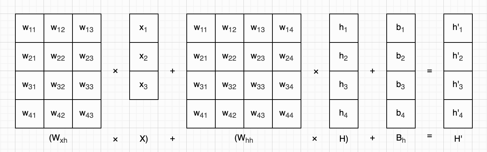

接下来再看后半部分公式，它就更容易理解了，因为这一部分本身就是一个标准的全连接层。其输入是隐藏向量 $\mathbf{h}'$ ，神经元数量对应输出向量的维度，计算结果就是该时刻 RNN 层的输出。具体到刚才的例子，后半部分公式正好对应MLP的输出层，且输出维度为 2，于是：

- 临时输入 $\mathbf{h}'$ ：长度为 4 （隐藏状态维度）的列向量
- 偏置 $\mathbf{b}_y$ ：长度为 2 （最终输出数量）的列向量
- 输出 $\mathbf{y}$ ：长度为 2 （最终输出数量）的列向量
- 权重 $W_{hy}$ ：形状为 $2 \times 4$ （最终输出 × 临时输入）

对应的计算过程如下图所示：

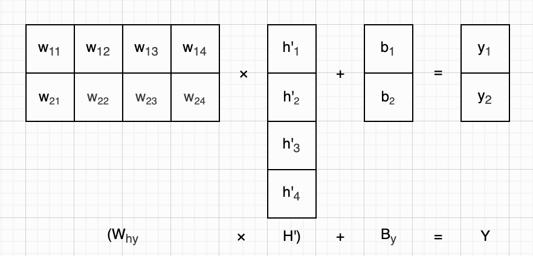

为了便于理解，我们暂时用小写字母 $x$ 来表示输入向量 $\mathbf{x}$ 的维度，用小写字母 $h$ 来表示隐藏状态 $\mathbf{h}$ 的维度，用小写字母 $y$ 来表示输出向量 $\mathbf{y}$ 的维度。这里要留意粗细之分：粗体的 $\mathbf{x}$ 是向量本身，非粗体的 $x$ 是一个标量，表示它的维度。当这些小写字母作为矩阵（包括列向量）下标时，它们不仅给出了矩阵的形状信息，还蕴含了矩阵的用途。下面这个表格，可以帮助你理解这些矩阵的形状和用途：

| 矩阵           | 形状 | 参数数量 | 说明                                          |
| -------------- | ---- | -------- | --------------------------------------------- |
| $\mathbf{x}$   | x×1  |          | 输入列向量                                    |
| $\mathbf{y}$   | y×1  |          | 输出列向量                                    |
| $\mathbf{h}$   | h×1  | 0        | 隐藏状态（列向量）                            |
| $\mathbf{b}_h$ | h×1  | h        | 偏置列向量，用于计算隐藏状态                  |
| $\mathbf{b}_y$ | y×1  | y        | 偏置列向量，用于计算输出                      |
| $W_{xh}$ | h×x  | h×x      | 权重矩阵，根据输入计算隐藏状态（x→h）         |
| $W_{hh}$ | h×h  | h×h      | 权重矩阵，根据旧隐藏状态计算新隐藏状态（h→h） |
| $W_{hy}$ | y×h  | y×h      | 权重矩阵，根据新隐藏状态计算输出（h→y）       |

需要特别注意的是：在 RNN 层中，只有权重矩阵和偏置向量是可学习参数，而隐藏状态 $\mathbf{h}$ 并不是模型参数，它只是随着输入序列动态更新的中间变量。因此，在给定输入维度 $x$ 、隐藏层维度 $h$ 、输出维度 $y$ 的情况下，RNN 层的总参数数量可以表示为：

$$
params=(h×x)+(h×h)+(y×h)+h+y
$$

为了直观感受 RNN 层的计算过程，我们结合上一小节实现的简易 RNN 层代码，把这个具体例子完整实现出来。由于不包含训练环节，我们直接用随机数初始化输入与所有参数，隐藏状态通常初始化为 0 即可。示例代码如下：

```python
_x, _h, _y = 3, 4, 2
mat_w_xh = np.random.rand(_h, _x) # 4×3
mat_w_hh = np.random.rand(_h, _h) # 4×4
mat_w_hy = np.random.rand(_y, _h) # 2x4
vec_b_h = np.random.rand(_h)      # 4×1
vec_b_y = np.random.rand(_y)      # 2×1
vec_h = np.zeros(_h)              # 4×1
vec_x = np.random.rand(_x)        # 3×1
layer = new_rnn_layer(mat_w_xh, mat_w_hh, mat_w_hy, vec_b_h, vec_b_y, vec_h, np.tanh)
vec_h2, vec_y = layer(vec_x)
print(vec_h2, vec_y)
```


### 循环更新状态

按照老规矩，既然我们已经理解了 RNN 层的基本结构，我们就可以把繁琐的计算细节先“隐藏”起来了。只保留几个核心要素：输入 $\mathbf{x}$ 、输出 $\mathbf{y}$ ，以及“旧的隐藏状态” $\mathbf{h}$ 和“新的隐藏状态” $\mathbf{h}'$ 。同时，我们对示意图做一个小调整：将原本的结构逆时针旋转 90°。这样一来：隐藏状态 $\mathbf{h} \rightarrow \mathbf{h}'$ 的传递体现在**水平方向**（对应时间的推进）；输入 $\mathbf{x}$ 和输出 $\mathbf{y}$ 的计算体现在**竖直方向**。

经过这样的简化与调整后，RNN 层可以表示为下图（左）这种形式。有些教材也会画成下图（右）这样：让隐藏状态从 RNN 单元“流出”后再“回流”进来，这种画法更直观地体现了“循环（Recurrent）”的含义。

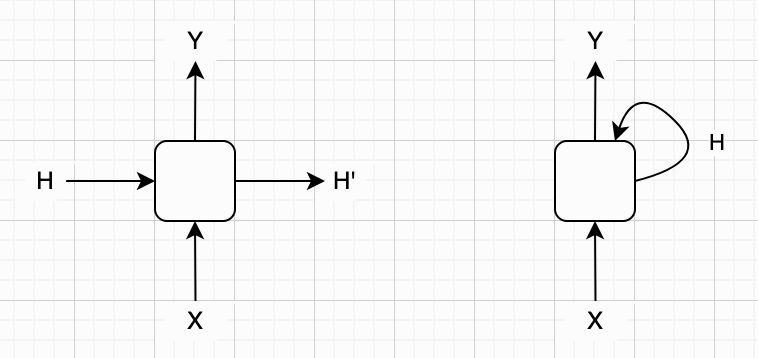

你可能会好奇：为什么要特意调整方向？毕竟我们一直习惯于“输入从左进入，输出从右流出”的表示方式。原因在于：我们接下来要引入“时间维度”。我们用下标 $t$ 表示某一时刻的计算，用 $t+1$ 表示下一个时刻，以此类推。在这样的表示下，隐藏状态就可以自然地在时间上串联起来：当前时刻的 $\mathbf{h}_t$ 会作为下一时刻的输入之一，参与计算 $\mathbf{h}_{t+1}$ 。

于是，我们就可以把 RNN 层在时间维度上“展开”（Unroll / Unfold）。展开之后，每一个时间步看起来就像一个结构相同、参数共享的“拷贝”。下图展示了某个 RNN 层在前三个时间步的计算过程：

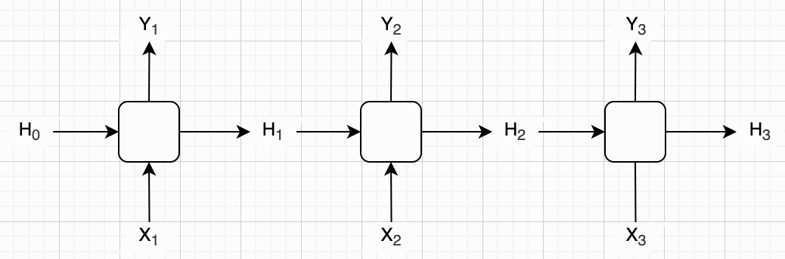

理解了这种展开方式的用意之后，我们还可以进一步简化表示，把隐藏状态写在水平箭头上方。这样既能减少图的复杂度，又能更紧凑地展示更长的时间序列。在这种表示方法下，我们可以很直观地画出 RNN 在多个时间步上的连续计算过程。如下图所示，展示了从某一时刻 $t$ 开始，连续进行六次计算的情况：

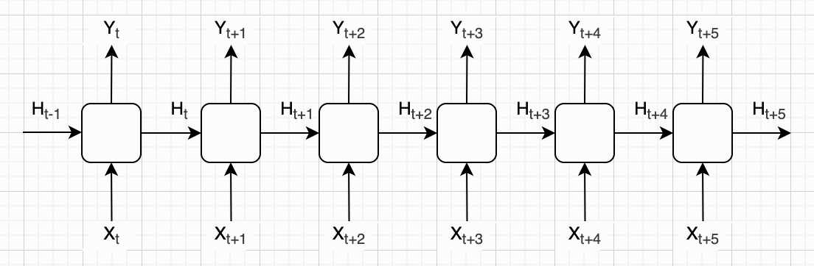

既然 RNN 层是在离散的输入序列上不断循环计算，那么用程序中的循环语句来表达这一过程就非常自然。我们可以直接使用上一小节实现的简易 RNN 层代码，将构造好的小 RNN 层放入循环中，逐次处理序列中的每一个步输入，从而完整模拟 RNN 的前向计算过程。

注意，我们在示例中暂时使用随机数来表示每一步的输入向量，并且写死循环次数为10。在后续小节中，我会详细介绍如何将一段真实文本转换成这样一系列的输入向量。示例代码如下所示：

```python
layer = new_rnn_layer(mat_w_xh, mat_w_hh, mat_w_hy, vec_b_h, vec_b_y, vec_h, np.tanh)

for i in range(10):
    vec_x = np.random.rand(_x)
    vec_h, vec_y = layer(vec_x)
    print(f't{i}: vec_x={vec_x.round(3)}, vec_y={vec_y.round(3)}, vec_h={vec_h.round(3)}')
```

跑一下上面的代码，可以打印出类似下面这样的内容：

```
t0: x=[0.301 0.594 0.333], y=[0.98  0.966], h=[0.915 0.83  0.872 0.707]
t1: x=[0.455 0.064 0.744], y=[0.989 0.982], h=[0.993 0.988 0.995 0.997]
t2: x=[0.72  0.571 0.219], y=[0.989 0.983], h=[0.996 0.995 0.998 0.998]
t3: x=[0.124 0.635 0.748], y=[0.989 0.983], h=[0.998 0.992 0.998 0.999]
t4: x=[0.621 0.12  0.373], y=[0.989 0.982], h=[0.993 0.993 0.997 0.998]
t5: x=[0.163 0.707 0.913], y=[0.989 0.983], h=[0.998 0.994 0.998 0.999]
t6: x=[0.257 0.867 0.719], y=[0.989 0.983], h=[0.998 0.995 0.999 0.999]
t7: x=[0.997 0.279 0.712], y=[0.989 0.983], h=[0.998 0.997 0.999 0.999]
t8: x=[0.222 0.346 0.866], y=[0.989 0.983], h=[0.997 0.992 0.998 0.999]
t9: x=[0.563 0.183 0.388], y=[0.989 0.983], h=[0.994 0.992 0.997 0.998]
```


### 多个RNN层

和多层感知机（MLP）的构建思路一致，我们同样可以将多个 RNN 层串联连接，组成一个深度 RNN 网络，以此提升模型对序列特征的提取能力。深层 RNN 能通过多层循环，逐步挖掘序列中更复杂、更抽象的上下文关联，比单层 RNN 更适合处理复杂的序列任务。

而在实际应用中，和卷积神经网络（CNN）的结构逻辑类似，大部分情况下，RNN 网络的最后都会衔接一个或多个普通的全连接层（MLP） 。这是因为 RNN 层的输出是包含序列特征的隐藏状态，其维度和特征形式往往无法直接适配最终任务的输出要求，全连接层的作用就是将这些时序特征进行映射、转换，最终输出符合任务需求的结果（如分类任务的类别概率、预测任务的数值等）。

下图展示的就是一个典型的深度 RNN 网络结构：包含两个串联的 RNN 层，以及一个用于最终输出的全连接层。

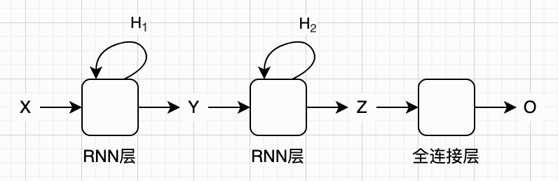

我们已经基本掌握 RNN 网络的核心基础概念。接下来，我们将前文实现的简易 RNN 层，与第二章搭建的全连接层代码进行整合。整合后的代码可以搭建出包含多层 RNN 结构与全连接输出层的完整网络，支持标准的前向计算流程；只需搭配循环逻辑，即可直接运行测试。具体实现代码如下所示：

```python
def new_rnn(rnn_layers: list, fc_layer):
    def rnn(vec_x):
        vec_current = vec_x                  # 保存输入，逐层向前传播
        for rnn_layer in rnn_layers:         # 遍历每一个RNN层
            vec_h, vec_y = rnn_layer(vec_current) # 一层一层计算
            vec_current = vec_y              # 忽略隐藏状态
        return fc_layer(vec_current)         # 全连接层计算
    return rnn
```


### 字符级RNN

本章开头我们提到过，RNN 比较适合处理输入序列长度不固定的问题。而在这类问题中，最常见、也最典型的应用场景就是文本处理，例如垃圾邮件识别、机器翻译等等。这也是本书接下来要重点讨论的内容。

现实世界中语言与文字种类繁多，而我们最为熟悉的便是中文与汉字。不过，为了降低理解门槛，同时避免过早引入复杂的文本预处理等问题，本书主要以字母构成的英文文本为例展开讲解。

对于英文这样的语言，一个更常见、也更“标准”的处理方式，是先将文本切分为一个个单词（word），再将这些单词作为序列输入到 RNN 中。不过，这种做法本身涉及到分词、词表构建、词向量等一系列额外的知识点。为了保持整体讲解的连贯性，本书会把这些内容放在后面再详细介绍。

在此之前，我们采用一种更直接的方式：将文本看作由字母和符号（统称为**字符**）组成的序列，一个字符一个字符地进行处理。虽然这种方法在表达能力上通常不如基于单词的建模方式，但它的优点在于简单直观，不需要太多前置知识，就可以直接应用 RNN 来解决问题。这种按字符处理文本的 RNN，我们称之为**字符级 RNN**（Character-Level RNN，简称 Char-RNN）。

不过，即便是使用 Char-RNN，我们仍然需要解决一个基本问题：如何将每一个字符（包括字母、数字以及标点符号）转换成模型可以接受的输入向量。最简单的方式是**索引编码**，但该方式存在明显缺陷，我将在下一小节进行说明。另一种经典方案为**独热编码**，将在后续小节中展开详细讲解。

这两种编码方案对于 Char-RNN 而言尚且可以接受，因为字符集规模通常很小（例如英文仅包含数十个字符，涵盖字母、数字与标点），无论是数据表示还是模型计算，整体开销都相对可控。但如果将处理单位从字符升级为单词，情况就会截然不同。在本书后续章节中，介绍完文本分词知识后，我会引入更加高效、通用的向量表示方法，以此解决单词级 RNN 所面临的各类问题。


### 索引编码

我们先来看最简单的索引编码（Index Encoding），也常称作标签编码（Label Encoding）。该编码方式只需将字符集中的字符统一排序，再按顺序从 1 开始依次编号，本质是将离散的类别符号映射为连续整数。为方便后续讨论，我们假设英文字符集仅包含小写字母与空格，字符集总大小为 27。由于 RNN 的输入要求为向量形式，因此可将每个字符编码为一维向量，这也是标量数值的简易向量化表示，具体编码过程如下图所示：

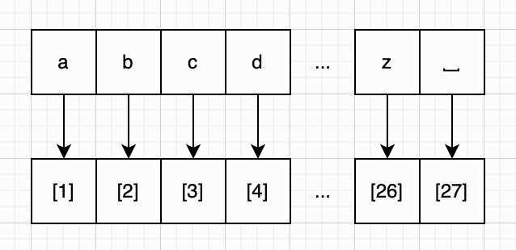

索引编码虽然简单直观，但问题也比较明显。由于篇幅原因，这里只列举几个容易理解的点。

首先，索引本身引入了人为的“顺序关系”。我们给字符排序并编号，只是为了方便表示，但这个顺序在语义上是没有意义的。然而，一旦把它作为数值输入给模型，RNN 在训练过程中可能会“误以为”这些数字之间存在大小关系。例如，它可能会认为 `b` 比 `a`“更大”，甚至在某些情况下倾向于学习这种数值上的大小规律，而不是字符本身的离散属性。

第二，索引编码会隐式引入“比例关系”。例如，模型可能会“误解”为 `d` 在某种意义上是 `b` 的“两倍”，或者 `c` 比 `a`“强三倍”。这些关系在数学上是成立的，但在字符表示中完全没有意义，却可能干扰模型的学习过程。

再进一步，这种码还会引入不合理的“距离关系”。例如，在这种表示下，`a` 和 `b` 的“距离”为 1，而 `a` 和 `z` 的“距离”为 25。但实际上，这种距离在字符语义中并没有任何真实含义。模型却可能会利用这些数值差异来进行计算，从而产生误导。

本质上来说，问题的根源在于：索引编码把“离散的符号”强行映射成了“连续的数值”，而神经网络恰恰非常擅长利用数值之间的大小、距离和比例关系，这就容易导致模型学习到一些并不存在的“伪规律”。

不过，我们也不是说索引编码完全没用。像学历、等级、星级评分这类自带高低、先后顺序的类别，使用整数编码就十分合适，数字大小能够直观体现层级关系，简洁又高效。但如果将其直接作为神经网络的原始输入来处理文本任务，多数情况下并不合适，因为文本中的字符并不存在天然大小关系。而我们接下来要介绍的独热编码，正好可以规避索引编码带来的顺序偏见，是一种更加合理的字符表示方案。


### 独热编码

其实，独热编码（One-Hot Encoding）和索引编码相比，本质上的差别只有一点：把原本的“一个整数索引”，展开成了一个 $k$ 维向量，其中 $k$ 等于字符集的大小。以前面的小写英文字母加空格为例，字符集大小是 27，因此每个字符都会被表示成一个长度为 27 的向量。

在这个向量中，只有当前字符对应的位置为 1，其余位置全部为 0。如果你把这些元素想象成一排小灯泡，那么只有一个灯泡是亮（“热”）的，其余都是灭的，因此得名“独热编码”。这种编码方式有时也被称为 1-of-k 编码。下图展示了独热编码的具体形式：

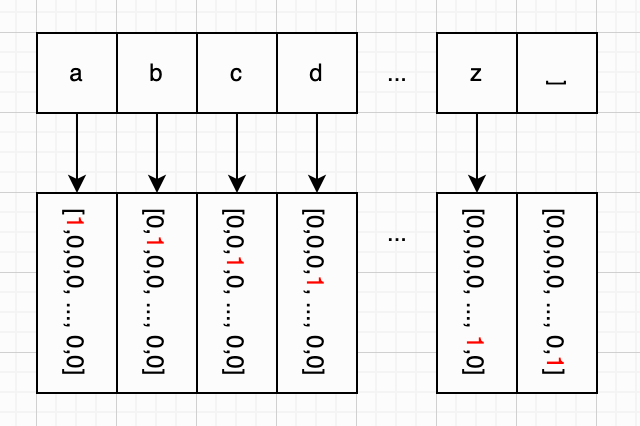

前面我们提到，索引编码会引入一些不合理的“大小关系”、“距离关系”和“比例关系”。而通过将索引展开成向量，独热编码彻底消除了这些问题：每个字符在向量空间中都是相互独立、等距的，模型无法再从数值上推断出任何“谁比谁大”之类的错误关系，从而避免了不必要的干扰。

不过，独热编码也并不是一个完美的方案，它同样存在一些明显的局限性。最典型的问题包括：

- **维度冗余**：向量的维度必须等于字符集大小，一旦字符集变大，输入维度就会迅速膨胀
- **数据稀疏**：每个向量中绝大多数元素都是 0，只有一个位置为 1，这在计算和存储上都不够高效
- **缺乏语义信息**：不同字符之间完全“正交”，无法表达任何相似性（例如 `a` 和 `b` 比 `a` 和 `#` 更相似这一点，在独热编码中是体现不出来的）

在字符集较小的情况下（例如 Char-RNN 场景），这些问题通常还可以接受。但如果我们把文本处理的基本单位从“字符”提升到更高层次的“单词”，那么词表规模往往会达到上万甚至更多，此时独热编码带来的维度和稀疏问题就会被放大许多个数量级，变得难以接受。关于这个问题，以及更高效的解决方案，我们会在后续章节中再详细讨论。

示例代码：

```python
import numpy as np

def char_one_hot(txt: str):
    # 1. 收集不重复的 char，排序
    vocab = sorted(set(txt))

    # 2. 生成 one-hot 矩阵
    mat_one_hot = np.eye(len(vocab), dtype=int)

    # 3. 打印每个 char 及其 one-hot vector
    for idx, ch in enumerate(vocab):
        print(f"{repr(ch)}: {mat_one_hot[idx].tolist()}")

txt = "To be, or not to be, that is the question."
char_one_hot(txt)
```

输出：

```
' ': [1, 0, 0, 0, 0, 0, 0, 0, 0, 0, 0, 0, 0, 0, 0, 0]
',': [0, 1, 0, 0, 0, 0, 0, 0, 0, 0, 0, 0, 0, 0, 0, 0]
'.': [0, 0, 1, 0, 0, 0, 0, 0, 0, 0, 0, 0, 0, 0, 0, 0]
'T': [0, 0, 0, 1, 0, 0, 0, 0, 0, 0, 0, 0, 0, 0, 0, 0]
'a': [0, 0, 0, 0, 1, 0, 0, 0, 0, 0, 0, 0, 0, 0, 0, 0]
'b': [0, 0, 0, 0, 0, 1, 0, 0, 0, 0, 0, 0, 0, 0, 0, 0]
'e': [0, 0, 0, 0, 0, 0, 1, 0, 0, 0, 0, 0, 0, 0, 0, 0]
'h': [0, 0, 0, 0, 0, 0, 0, 1, 0, 0, 0, 0, 0, 0, 0, 0]
'i': [0, 0, 0, 0, 0, 0, 0, 0, 1, 0, 0, 0, 0, 0, 0, 0]
'n': [0, 0, 0, 0, 0, 0, 0, 0, 0, 1, 0, 0, 0, 0, 0, 0]
'o': [0, 0, 0, 0, 0, 0, 0, 0, 0, 0, 1, 0, 0, 0, 0, 0]
'q': [0, 0, 0, 0, 0, 0, 0, 0, 0, 0, 0, 1, 0, 0, 0, 0]
'r': [0, 0, 0, 0, 0, 0, 0, 0, 0, 0, 0, 0, 1, 0, 0, 0]
's': [0, 0, 0, 0, 0, 0, 0, 0, 0, 0, 0, 0, 0, 1, 0, 0]
't': [0, 0, 0, 0, 0, 0, 0, 0, 0, 0, 0, 0, 0, 0, 1, 0]
'u': [0, 0, 0, 0, 0, 0, 0, 0, 0, 0, 0, 0, 0, 0, 0, 1]
```


### 生成式AI

（TODO：补充、润色）

如果你比较熟悉现在的聊天机器人，并且简单了解过它们的内部工作原理，你可能会惊叹：它们背后的基本思想其实并不复杂。根据已有的上下文，预测下一个词（或字符），然后不断重复这个过程，逐步生成整段文本，仅此而已。正是这样一个看似简单的机制，在大规模数据和模型参数的加持下，却能够表现出类似人类的语言能力，甚至在某些场景下呈现出“思考”的感觉。

这种从海量数据中学习规律，并据此生成新内容的模型范式，通常被称为**生成式 AI**（Generative AI，简称 GenAI）。而利用我们目前已经学习过的 Char-RNN，就可以构建一个“简化版”的生成式模型。

接下来，我们将搭建一个两层RNN+一个全连接层的小型RNN网络，并用一个微型的“莎士比亚文集”来训练它，并让它学会生成类似风格的文本。训练好以后，模型就帮我们写做了。例如，当我们输入 “Long, long ago,” 时，模型可能会生成类似 “when the world was quiet and full of gentle mysteries...” 这样的续写内容。

在这一小节中，我们将从**训练**、**种子**和**生成** 三个阶段，来理解这个模型是如何工作的。

先来看训练过程。本质上，我们是让模型从一个初始状态开始（通常将隐藏状态初始化为全 0），然后把文本数据**按字符逐个输入模型**。在每一个时间步，模型都会输出一个向量，表示“下一个字符”的概率分布（通常通过 softmax 归一化得到）。然后，我们将这个预测分布与真实的下一个字符进行对比，计算损失，并通过**反向传播**来不断调整模型参数。（关于反向传播的具体细节，我们会在本书的最后再详细介绍，这里先从整体流程理解。）假设训练文本以 “To be, or not to be...” 开头，那么训练过程大致如下图所示。在这个过程中，模型不断学习：在给定前面字符序列的情况下，应该预测什么样的下一个字符。

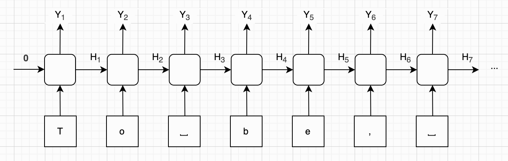

再来看种子阶段。当模型训练完成后，我们就得到了所有的参数。接下来，如果我们想让模型生成文本，就需要先给它一个“种子”。这个种子通常是一小段起始文本，你也可以把它理解为一个非常简化的“提示词（prompt）”。

在这个阶段，模型同样从初始隐藏状态开始（全 0），然后按顺序把种子中的字符输入模型。需要注意的是，这个过程中模型虽然也会输出“下一个字符的概率”，但这些输出我们通常不会使用，而是直接丢弃。我们的目的只是：通过输入种子，让模型内部的隐藏状态逐渐“进入语境”，形成一个能够代表当前上下文的状态。假如我们的种子是“Long, long ago,”，那么初始化阶段大致如下图所示：

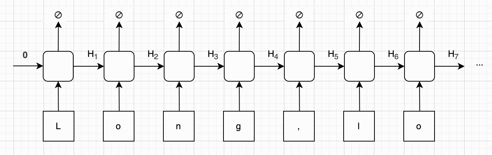

最后来看生成阶段。在完成种子输入之后，我们就进入真正的生成阶段。此时，模型已经有了一个包含上下文信息的隐藏状态，同时也能够输出“下一个字符的概率分布”。接下来，我们需要根据这个概率分布来选择一个字符，并将这个字符作为新的输入，继续喂给模型，从而不断生成后续内容。

最简单的做法是：每一步都选择概率最大的那个字符（贪心策略）。然后不断重复这个过程，直到生成了某个结束符（例如换行或特殊 token），或者达到预设的最大长度。我们假设模型预测的前几个字符是“when the world was quiet and full of gentle mysteries,”，生成过程大致如下图所示：

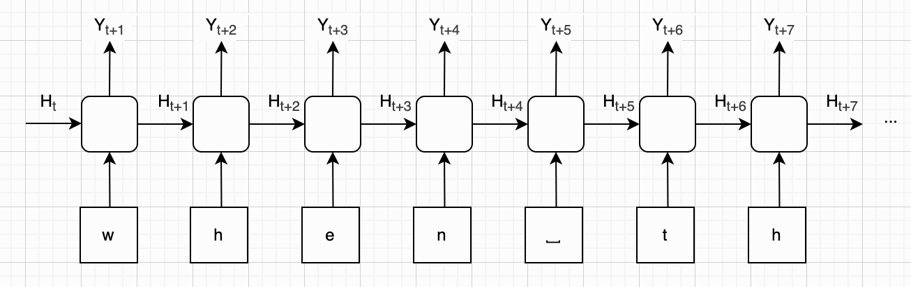

在工程实现上，我们不需要从零手写 RNN。像 PyTorch 这样的深度学习框架，已经内置了 RNN 模块，我们可以直接使用。只需要指定：字符集大小（vocab_size）、隐藏状态维度（hidden_size）、RNN 层数（num_layers），再配合一个全连接层，就可以构建出完整的 Char-RNN 模型。其中，RNN 负责处理序列信息，而线性层负责将隐藏状态映射到字符空间（即预测下一个字符的 logits）。例如：

```python
class CharRNN(nn.Module):
    def __init__(self, vocab_size, hidden_size, num_layers):
        super().__init__()
        self.rnn    = nn.RNN(vocab_size, hidden_size, num_layers)
        self.linear = nn.Linear(hidden_size, vocab_size)

    def forward(self, x_oh, hidden=None):
        out, hidden = self.rnn(x_oh, hidden)
        logits = self.linear(out)
        return logits, hidden
```

读者可能已经注意到：如果我们在生成阶段，每一步都选择概率最大的字符，那么在相同的种子输入下，模型每次生成的结果都会完全一致。这显然会让生成的文本变得单一、缺乏变化。而现实中的聊天机器人并不是这样工作的。它们通常会引入一些随机性控制策略，例如温度值、Top-k 采样、Top-p 采样等。这些方法可以在“确定性”和“随机性”之间做平衡，从而生成更加自然、多样的文本。我们将在下面的小节里，陆续详细介绍这些技术。

玩具char-rnn，效果：

```
============================================================
Seed: "long long ago"
============================================================
long long agooped the servant
The serves the world comes the servant the servant
The serves the world comes the servant the servant
The serves the world comes the servant the servant
The serves the world comes the servant the servant
The serves the world comes the servant the servant
The serves the world comes the servant the servant
The serves the world comes the servant the servant
The serves the world comes the servant the servant
The serves the world comes the servant the servant
The serves the world com
============================================================
```


### 温度值

我们在中学物理中学过，温度本质上反映的是分子的活跃程度。在 GenAI 中，也借用了“温度（Temperature）”这一概念，用来描述模型在生成文本时的“活跃程度”。温度值越高，模型越“发散”，生成结果更具多样性和创造性；温度值越低，模型越“保守”，更倾向于选择最确定的结果。

那温度是如何影响概率分布的呢？还记得在第三章中，我们介绍过 Softmax 归一化函数，它可以将模型输出的分数值（Logits）转化为概率分布。为了方便回顾，这里再次给出 Softmax 的公式，其中 $z_i$ 表示某个分数， $P_i$ 表示对应的概率：

$$
P_i = \frac{e^{z_i}}{\sum_{j=1}^{n}e^{z_j}}
$$

现在我们对这个公式做一个简单的改动，引入温度参数（用小写字母t表示）。方法很直接：将每个分数除以温度值，再进行 Softmax。也就是说，温度本质上是在 Softmax 之前对分数值进行整体缩放。修改后的公式如下：

$$
P_i = \frac{e^{z_i/t}}{\sum_{j=1}^{n}e^{z_j/t}}
$$

我们把第三章写的Softmax函数稍加修改，加上温度值参数 $t$ ，就变成了带温度的归一化函数，修改后的代码如下所示：

```python
from math import e

# 手写实现，用于逐步演示带温度的 Softmax 的计算过程。
# NumPy 没有现成的 Softmax，但 np.exp 可以一次算完整个向量，
# 于是整个函数可以简写成一行：np.exp(vec_z/t) / np.exp(vec_z/t).sum()
def softmax(vec_z: np.ndarray, t: float) -> np.ndarray:
    vec_exp = [e ** (v/t) for v in vec_z]
    total = sum(vec_exp)
    return np.array([v / total for v in vec_exp])
```

从新的归一化公式可以看出：

- 当 $t = 1$ 时，对原始 Softmax 没有任何影响
- 当 $t > 1$ 时，分数值被“压缩”，概率分布变得更加平缓：高概率降低，低概率升高
- 当 $t < 1$ 时，分数值被“放大”，概率分布变得更加尖锐：高概率更高，低概率更低
- 当 $t \to 0$ 时，分布趋近于 one-hot（只保留最大值）
- 当 $t \to \infty$ 时，分布趋近于均匀分布

我们以 logits = $[3, 2, 1]$ 为例，总结不同温度下，最终概率分布的变化情况，以及对模型输出的影响，见下表：

| 温度值变化 | 实际取值 | 概率分布              | 概率分布变化       | 模型输出       |
| ---------- | -------- | --------------------- | ------------------ | -------------- |
| → ∞        | 9.9      | [0.334, 0.333, 0.333] | 接近均匀分布       | 高度随机       |
| > 1        | 1.5      | [0.563, 0.289, 0.148] | 高概率 ↓，低概率 ↑ | 更随机，更发散 |
| = 1        | 1.0      | [0.665, 0.245, 0.09]  | 不改变分布         | “原始想法”     |
| < 1        | 0.5      | [0.867, 0.117, 0.016] | 高概率 ↑ ，低概率↓ | 更确定，更保守 |
| → 0        | 0.1      | [1.0, 0.0, 0.0]       | 极度尖锐           | 几乎完全确定   |

需要注意的是：仅仅调整温度值，并不能引入真正的随机性。如果我们在生成时始终选择概率最大的那个结果（即贪心策略），那么无论温度如何变化，最终输出仍然是确定的。因此，在实际应用中，温度通常需要配合采样策略（如 Top-k 或 Top-p）一起使用，才能既保证合理性，又增加多样性。


### Top-K/P采样

所谓 **Top-K 采样**（Top-K Sampling），其实从名字就可以很好理解。我们先将模型输出的概率分布按从大到小排序，然后只保留其中概率最高的前 $k$ 个（例如 $k=10$ ），其余的概率全部置为 0。

假设一共有 $n$ 个候选，由于我们丢弃了其中 $n-k$ 个概率值，此时剩余概率之和将不再等于 1，因此需要对保留下来的这 $k$ 个概率进行重新归一化。这里通常不再使用 Softmax，而是进行简单的比例归一化即可，其公式如下。注意：虽然公式写成对全部概率值求和，但实际上只有前 $k$ 项非零，其余已经被置为 0。

$$
P'_i = \frac{P_i}{\sum_{j=1}^{n}{P_j}}
$$

我们假设原始概率分布（已排序）为：[0.496, 0.254, 0.131, 0.067, 0.034, 0.018]，下表展示了不同 $k$ 值对采样范围和归一化结果的影响。可以看到： $k$ 越小，候选越少，结果越确定； $k$ 越大，候选越多，随机性越强。

| K    | 筛选后                                      | 归一化                                      |
| ---- | ------------------------------------------- | ------------------------------------------- |
| 4    | [0.496, 0.254, 0.131, 0.067, 0.0, 0.0, 0.0] | [0.523, 0.268, 0.138, 0.071, 0.0, 0.0, 0.0] |
| 3    | [0.496, 0.254, 0.131, 0.0, 0.0, 0.0]        | [0.563, 0.288, 0.149, 0.0, 0.0, 0.0]        |
| 2    | [0.496, 0.254, 0.0,  0.0, 0.0, 0.0]         | [0.661, 0.339, 0.0, 0.0, 0.0, 0.0]          |
| 1    | [0.496, 0.0, 0.0,  0.0, 0.0, 0.0]           | [1.0, 0.0, 0.0, 0.0, 0.0, 0.0]              |

和 Top-K 采样类似的，还有一种方法叫做 **Top-P 采样**（Top-p Sampling），它也被称为**核采样**（Nucleus Sampling）。两者的区别在于：Top-K固定候选数量（前 $k$ 个）；而Top-p则动态选择候选，使其累计概率达到阈值 $p$ （例如 0.8）。也就是说，我们从概率最大的开始往下累加，一直到总和超过 $p$ ，就停止，然后只保留这些候选，其余置为 0，再进行归一化。

不难看出，Top-P 是一种自适应机制：当概率分布很“集中”时，可能只需要少量候选；而当分布较“分散”时，则会保留更多候选。还是使用前面的例子，下表展示不同 $p$ 值的效果：

| P    | 筛选后                                      | 归一化                                      |
| ---- | ------------------------------------------- | ------------------------------------------- |
| 0.9  | [0.496, 0.254, 0.131, 0.067, 0.0, 0.0, 0.0] | [0.523, 0.268, 0.138, 0.071, 0.0, 0.0, 0.0] |
| 0.8  | [0.496, 0.254, 0.131, 0.0, 0.0, 0.0]        | [0.563, 0.288, 0.149, 0.0, 0.0, 0.0]        |
| 0.7  | [0.496, 0.254, 0.0,  0.0, 0.0, 0.0]         | [0.661, 0.339, 0.0, 0.0, 0.0, 0.0]          |
| 0.6  | [0.496, 0.254, 0.0,  0.0, 0.0, 0.0]         | [0.661, 0.339, 0.0, 0.0, 0.0, 0.0]          |

完成 Top-K 或 Top-p 筛选并归一化之后，我们就得到了一个新的概率分布。接下来，就可以按照这个分布进行**加权随机抽取**，选出最终的输出结果。这种方法的本质是：把概率分布看作一个 $[0,1]$ 区间的划分，然后随机落点，看最终落在哪一段。下面这个函数展示了一个简单的按概率采样的实现方式：

```python
import random

# 手写实现，用于逐步演示按概率采样的过程。
# NumPy 有现成实现：np.random.choice(len(vec_probs), p=vec_probs)
def sample_by_prob(vec_probs: np.ndarray) -> int:
    # 生成 0~1 之间的随机数
    rand = random.random()
    
    # 累计概率，判断落在哪个区间
    cumulative = 0.0
    for idx, prob in enumerate(vec_probs):
        cumulative += prob
        if rand < cumulative:
            return idx
```

最后，我们把整套采样流程完整串联。假设某次 RNN 输出的分数值为：[3, 1, 6, 2, 5, 4]，从带温度的概率归一化，到采样（这里以Top-K为例），再到加权随机抽取的完整过程，如下图所示：

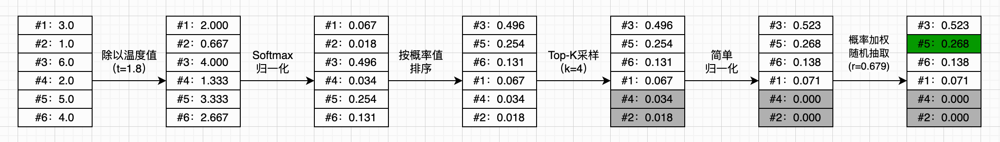

总之，通过温度 + Top-K / Top-p 采样 ，我们就可以在“确定性”和“随机性”之间取得平衡，从而生成既合理又多样的文本。

效果：

```
============================================================
Seed: "long long ago"
============================================================
long long agour,
Save at your suefilled to the counsel made a
kingarding fires will have thought in the consure
O' the that poised of little known to blood.

DUKE VINCENTIO:
So stay with thee saw I hear of love's face it be.
Which is umthing with them sorrow with thee?
Whating of them to be of me;
And tell me your most late, bid to bound touchly came,
For brother's saunt as great love; stranges: the swain
My sovereign, Gremio! why thou hast bitter years
To with my heart, give him particians?

BUCKINGHAM:
My
============================================================
```


### 本章小结

（TODO：这一小节是AI写的，需要重写）

本章从序列数据的处理需求出发，系统地介绍了循环神经网络（RNN）的核心思想与工作机制。

**从全连接层到 RNN。** 全连接层是无状态的：给定相同输入，输出始终一致。而现实中有大量任务涉及长度不固定的序列数据，如邮件分类、语音转录、机器翻译等。RNN 的核心创新在于引入了**隐藏状态**，使网络在处理每一步输入时，同时结合"过去的记忆"进行计算，并将更新后的状态传递给下一步——这正是"循环"二字的含义。

**RNN 的计算方式。** RNN 层的前向计算分为两个阶段：首先，结合当前输入与旧的隐藏状态，计算新的隐藏状态；然后，基于新的隐藏状态，输出当前时刻的结果。对应的公式为：

$$\mathbf{h}' = \sigma(W_{xh}\mathbf{x} + W_{hh}\mathbf{h} + \mathbf{b}_h)，\quad \mathbf{y} = \sigma(W_{hy}\mathbf{h}' + \mathbf{b}_y)$$

其中包含三个权重矩阵（ $W_{xh}$ 、 $W_{hh}$ 、 $W_{hy}$ ）和两个偏置，而隐藏状态 $\mathbf{h}$ 本身不是可学习参数，只是随序列推进动态更新的中间变量。

**时间展开与深层 RNN。** 将 RNN 在时间维度上"展开"，可以直观地看到每一时刻的计算是结构相同、参数共享的拷贝。与 MLP 和 CNN 类似，多个 RNN 层可以串联叠加，形成深层 RNN，末端通常接一个全连接层，将时序特征映射到任务输出。

**字符级 RNN 与文本编码。** 本章以**字符级 RNN（Char-RNN）**为例，介绍了如何将文本转换为向量输入。**索引编码**将字符映射为整数，但会引入虚假的大小、距离与比例关系，容易误导模型。**独热编码**将每个字符展开为一个 $k$ 维向量（仅对应位置为 1），彻底消除了这些偏见，但在字符集较大时会面临维度膨胀和数据稀疏的问题。

**生成式 AI 的雏形。** 训练好的 Char-RNN，可以实现"根据上下文预测下一个字符"的功能，这正是当代大语言模型的基本工作原理。生成过程分为三个阶段：用数据训练模型、输入种子文本让隐藏状态进入语境、循环采样生成后续文本。

**采样策略。** 为了让生成结果既合理又富有多样性，本章介绍了三种常用的采样控制手段：
- **温度值**：通过缩放 Softmax 输入，控制概率分布的"尖锐"或"平缓"程度；
- **Top-K 采样**：只保留概率最高的前 $k$ 个候选，其余置零后重新归一化；
- **Top-P 采样**（核采样）：动态保留累计概率达到阈值 $p$ 的候选集，自适应地平衡确定性与多样性。

以上三种方法通常组合使用，共同实现对生成质量与多样性的精细控制。

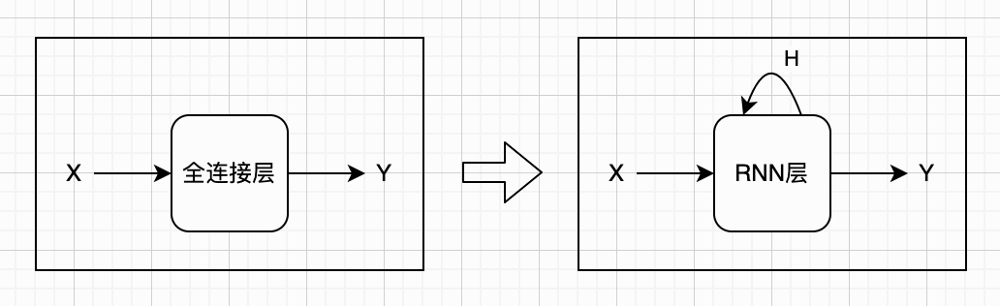
