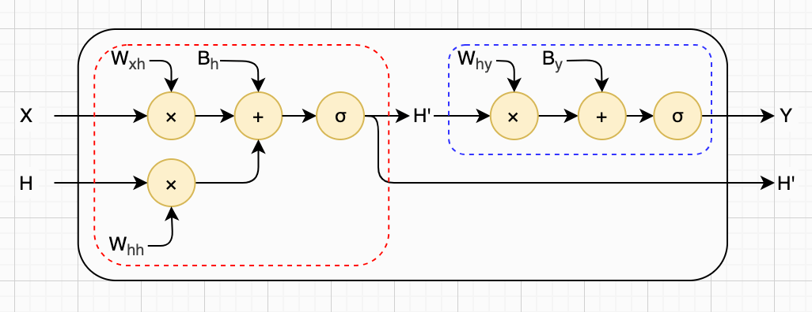
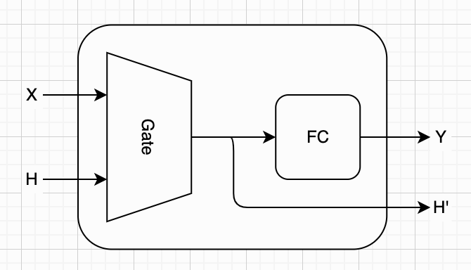
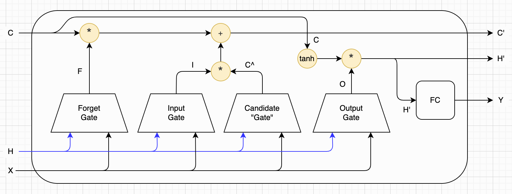
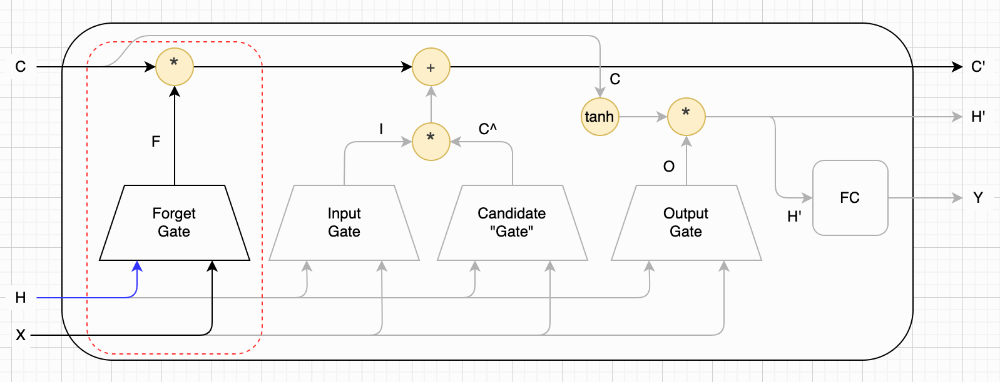
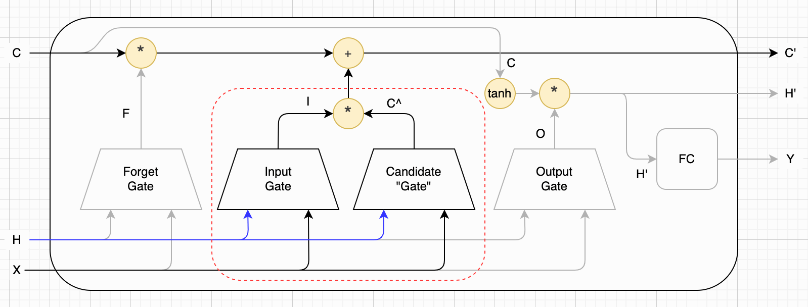
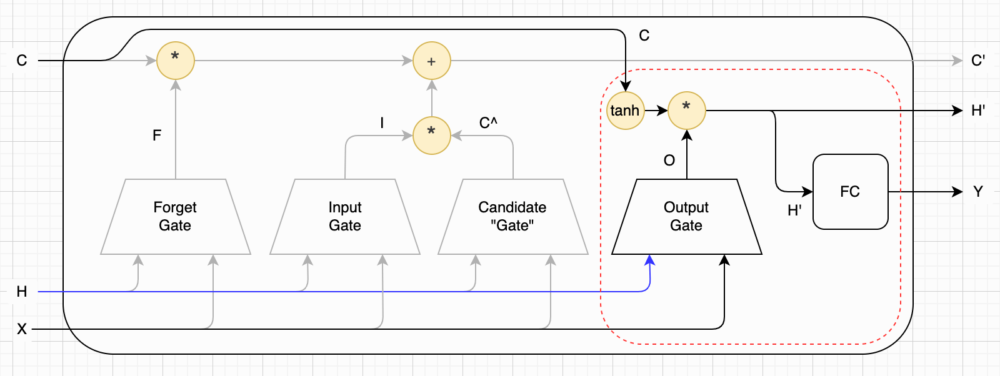
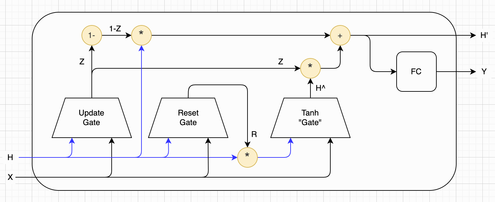

## 第七章：长短期记忆网络

（TODO：这一章许多细节是AI补充的，需要统一润色）

在前一章中，我们系统地讨论了 RNN（循环神经网络），并介绍了基于字符的 Char-RNN，以及一个简化版的生成式模型（GenAI）。我们通过在迷你版的莎士比亚文集上训练模型，让它能够根据一段提示文本，自动续写出后续内容。从实现角度来看，这个过程并不复杂：模型只需要不断根据已有上下文预测下一个字符，就可以生成一段连贯的文本。不过，当我们进一步思考时，会发现：简单的 RNN 虽然结构清晰，但在实际应用中存在一些比较明显的缺点。

其中最经典的问题，就是长距离依赖难以建模。理论上，RNN 可以通过隐藏状态在时间上传递信息，但在实际训练中，随着序列变长，早期的信息往往会逐渐“遗忘”。例如，在一句很长的句子中，开头的信息很难有效影响到结尾的预测。

其次，信息的“保留与遗忘”是被动发生的。在标准 RNN 中，隐藏状态的更新完全依赖于一个固定的线性变换加激活函数，模型并没有显式的机制去决定“哪些信息应该保留，哪些应该丢弃”。这使得模型在处理复杂序列时显得不够灵活。

最后是梯度消失与梯度爆炸等问题。在训练过程中，RNN 需要通过时间反向传播（BPTT）来更新参数。当序列较长时，梯度在多次传递过程中可能会迅速变得极小（消失）或极大（爆炸），从而导致模型难以训练，甚至完全无法收敛。不过读者可以暂时先不管这一点，本书的最后会统一介绍反向传播机制，到时候我们再来重新讨论这些问题。

为了解决这些问题，研究者们在 RNN 的基础上提出了一系列改进模型。其中最重要、也最经典的两种结构，就是长短期记忆网络（LSTM）和门控循环单元（GRU）。这两种模型的核心思想可以用一个关键词来概括：门（Gate）。

接下来，我们先回顾 RNN，并引出“门”的基本思想。然后我们详细讨论 LSTM 的结构与计算过程，在此基础上介绍更加简洁的变体： GRU。通过本章的学习，你将理解：为什么简单 RNN 不够用、LSTM / GRU 是如何改进信息流动的，以及“记忆”和“遗忘”是如何被模型显式控制的。为后续更复杂的序列模型（例如 Transformer等）打下坚实的基础。


### Gate概念

在正式介绍 LSTM 和 GRU 之前，我们先来简要回顾一下前一章中学习的 RNN 层计算逻辑。这一步非常重要，因为我们将从中抽象出一个核心概念——**门**（Gate）。如果你对 RNN 的计算过程还不够熟悉，建议先回到第五章再复习一遍，再继续阅读本节内容。先回顾一下 RNN 层的基本计算公式：

$$
H' = σ(W_{xh}X + W_{hh}H + B_h) \\
Y = σ(W_{hy}H' + B_y)
$$

我们可以用一种更直观的方式来理解这两行公式：

- 第一行：根据当前输入 $X$ 和上一时刻的隐藏状态 $H$ ，计算新的隐藏状态 $H'$
- 第二行：根据新的隐藏状态 $H'$ ，计算当前输出 $Y$

换句话说，一个 RNN 层可以看作是：一个“带隐藏状态输入的增强版全连接层” + 一个标准的全连接层 的串联结构。从计算流程上看，RNN 层需要先“更新记忆”（隐藏状态），再“生成输出”。整个过程如下图所示：



现在请特别关注上图左侧红框中的部分，也就是“根据输入和旧隐藏状态，计算新隐藏状态”的这一段逻辑。这一部分其实非常关键，因为：第一，它决定了“过去的信息如何影响现在”；第二，它是 RNN 能够处理序列的核心所在。如果我们把这部分计算抽象出来，并且暂时忽略内部的具体细节（权重、偏置、矩阵乘法等），就可以把它看作是一个“信息处理单元”。为了简化表示，我们可以将这个单元画成一个小梯形（或其他统一符号），表示它：接收输入 $X$ 和历史状态 $H$ ；输出新的状态 $H'$ 。我们把这个抽象出来的结构，称为：门。

这个名字并不是随便起的，它背后有一个非常重要的直觉：门的作用，是“控制信息是否通过”。虽然在标准 RNN 中，这个“门”还只是一个简单的线性变换 + 激活函数，但从抽象角度看，它已经具备了“筛选信息”的雏形：哪些信息被保留到新的隐藏状态中，哪些信息被削弱甚至丢弃。在后续的 LSTM 和 GRU 中，我们会看到：这个“门”会被进一步拆分成多个更加精细的控制结构（例如遗忘门、输入门等），从而实现对信息流动的精确控制。

在引入“门”的概念之后，我们可以对 RNN 的内部结构进行进一步简化：用一个“门”（梯形）表示隐藏状态更新过程；用一个“方块”表示标准全连接层（从隐藏状态到输出）这样，RNN 层的内部机制可以表示为如下形式：



这种表示方式的好处在于：屏蔽了复杂的数学细节、突出了信息流动的路径，为后续理解 LSTM / GRU 打下基础。理解了这一抽象之后，我们会发现：所谓“门”，在实现上其实非常简单。本质上，它仍然是一个带有输入和隐藏状态的线性变换加激活函数。因此，我们完全可以用几行 Python 代码来实现一个“门”的创建与计算过程。为了便于对比，我们也把之前全连接层的实现一起列出。通过对比你会发现：Gate 和全连接层的区别，仅仅在于“是否引入了隐藏状态”这一额外输入。下面是对应的完整代码实现：

```python
# x => y
def new_fc_layer(w, b, af):
    return lambda x: af(w @ x + b)

# x, h => h'
def new_gate(w_xh, w_hh, b_h, af):
    return lambda x, h: af(w_xh @ x + w_hh @ h + b_h)
```


### 长短期记忆网络

了解了“门”的概念之后，我们就可以用它来搭建**长短期记忆网络**（Long Short-Term Memory，简称 LSTM）了。相比于普通的 RNN 层只使用一个“隐式的门”（也就是隐藏状态更新过程），LSTM 引入了多个显式的门结构，用来更精细地控制信息的流动。

具体来说，LSTM 一共包含三个“真正的门”，以及一个用于生成候选信息的结构（通常称为“细胞候选”或“候选记忆”）。此外，它还引入了一个新的状态变量：**细胞状态（Cell State）**，用大写字母 $C$ 表示。

在大多数资料中，这几个结构是严格区分的：三个门负责“控制”；候选记忆负责“生成内容”。不过从计算形式上看，它们都具有类似的结构（线性变换 + 激活函数）。为了便于理解，本书将它们统一抽象为“门”，并将生成候选记忆的模块称为“候选门（Candidate Gate）”。稍后我们会再强调它们之间的区别。下面是 LSTM 层的整体结构示意图（这里的 \* 表示按元素相乘，即哈达玛积）：



与标准 RNN 相比，LSTM 最关键的变化是：除了隐藏状态 $H$ ，还额外引入了细胞状态 $C$ 。这两个状态的分工可以简单理解为： $H$ ：短期状态（用于输出）； $C$ ：长期记忆（用于跨时间传递信息）。也正是因为这种“短期 + 长期”的结构，LSTM 才得名 **长短期记忆网络**。

沿用前一章的命名方式，LSTM 的完整计算过程如下（这里的 \* 表示按元素相乘，即哈达玛积）。而且注意，标准门使用的通常都是Sigmoid激活函数，而细胞门使用的是Tanh激活函数。

$$
\begin{aligned}
F &= σ(W_{fx}X + W_{fh}H + B_f) \\
I &= σ(W_{ix}X + W_{ih}H + B_i) \\
O &= σ(W_{ox}X + W_{oh}H + B_o) \\
\hat{C} &= \mathrm{tanh}(W_{cx}X + W_{ch}H + B_c) \\
C' &= F * C + I * \hat{C} \\
H' &= O * \mathrm{tanh}(C) \\
Y &= W_{hy}H' + B_y
\end{aligned}
$$

从上图中，以及公式，可以看到，LSTM 包含三个门和一个“细胞门”，它们的输入都是当前输入 $X$ 和上一时刻的隐藏状态 $H$ ：

- **遗忘门（Forget Gate）**：决定旧记忆 $C$ 中哪些内容需要保留，对应上面公式第一行。遗忘门输出的是一个0～1直接的权重向量。
- **输入门（Input Gate）**：决定当前新信息有多少被写入记忆，对应上面公式第二行
- **输出门（Output Gate）**：决定当前记忆中有多少被用于输出，对应上面公式第三行
- **候选“门”（Cell Gate）**：生成候选记忆内容（新的信息），对应上面公式地五行

上面的图，以及这个计算公式，太复杂了。所以我们需要把它拆解，一个门一个门来理解。我们先来看遗忘门，如下图所示：



遗忘门，决定长期记忆C，哪些内容被慢慢忘记。遗忘门对应下面的计算公式：

$$
\begin{aligned}
F &= σ(W_{fx}X + W_{fh}H + B_f) \\
C' &= F * C + ... \\
\end{aligned}
$$

遗忘门的输出F，是一个0～1的权重矩阵。它和记忆C进行逐元素相乘，这是它能决定忘掉那些东西的核心。如果F的某个元素解决于0，则模型倾向于忘记对应状态。否则，如果接近于1，模型倾向于保留对应状态。

再来看输入门，如下图所示。



输入门对应下面公式：

$$
\begin{aligned}
I &= σ(W_{ix}X + W_{ih}H + B_i) \\
\hat{C} &= \mathrm{tanh}(W_{cx}X + W_{ch}H + B_c) \\
C' &= ... + I * \hat{C} \\
\end{aligned}
$$

和遗忘门类似，输入门的输出I，也是一个0～1的权重矩阵。但是不同的是，我们还需要计算一个候选记忆 $\hat{C}$ 。注意，由于使用了Tanh激活函数，隐藏候选记忆的每个元素，是-1～1，这个很重要（补充说明）。候选记忆是当前时刻新生成的、待筛选的临时记忆。候选记忆和输入门输出I，逐元素相乘，就得到了需要补充的记忆。

$$
C' = F * C + I * \hat{C}
$$

然后，被遗忘门塞选后的记忆，加上被输入门塞选后的候选记忆，就得到了新的记忆状态。见上面的公式。

懂了遗忘门和输入门，输出门就相对好理解了。它基本上就是之前RNN层，只是略微改变了一下。差别在于，我们把记忆状态C也考虑了进来。输出门的计算逻辑如下图所示：



下面是输出门对应的公式：

$$
\begin{aligned}
O &= σ(W_{ox}X + W_{oh}H + B_o) \\
H' &= O * \mathrm{tanh}(C) \\
Y &= W_{hy}H' + B_y
\end{aligned}
$$

和遗忘门、输入门一样，输出门的输出O，也是0～1的权重矩阵。和标准RNN模块不同，我们对C使用Tanh处理，然后和O逐元素相乘。输出门控制最终的短期记忆H，以及输出Y。


玩具代码：

```python
def new_lstm_layer(forget_gate, 
                   input_gate, 
                   output_gate, 
                   candidate_gate,
                   fc_layer):
    def layer(x, h, c):
        _f = forget_gate(x, h)
        _i = input_gate(x, h)
        _o = output_gate(x, h)
        _c = candidate_gate(x, h)
        new_c = _f * c + _i * _c
        new_t = _o * tanh(new_c)
        y = fc_layer(new_t)
        return y
    return layer
```


### 门控循环单元

LSTM 效果强、但结构重、计算贵；GRU 是 LSTM 的精简版，用更少参数、更快速度，换取接近的效果，在轻量化 / 低算力 / 短序列场景性价比碾压 LSTM。很多任务里，根本用不到这么复杂的三门机制。于是门控循环单元（Gated Recurrent Unit，简称GRU），对LSTM进行来简化。

GRU的主要简化：去掉细胞状态，重新回到单个隐藏状态H。三个门改成两个门。其中**重置门** （Reset Gate）：控制“过往历史要不要清空”。**更新门** （Update Gate）控制“旧记忆保留多少、新记忆写入多少”。下面是GRU的示意图：



下面是GRU的计算公式。也可以看出来，的确是比LSTM简单了许多。

$$
\begin{aligned}
Z &= σ(W_{zx}X + W_{zh}H + B_z) \\
R I'm &= σ(W_{rx}X + W_{rh}H + B_r) \\
\hat{H} &= \mathrm{tanh}(W_{hx}X + W_{hh}(R * H) +B_t)) \\
H' &= (1 - Z)*H + Z * \hat{H} \\
Y &= W_{hy}H' + B_y
\end{aligned}
$$

玩具代码：

```python
def new_gru_layer(update_gate, reset_gate, tanh_gate):
    def layer(x, h):
        _z = update_gate(x, h)
        _r = reset_gate(x, h)
        _h = tanh_gate(x, _r * h)
        new_h = (1 - _z) * h + _z * _h
        y = fc_layer(new_t)
        return y
    return layer
```


### 本章小结

TODO：
