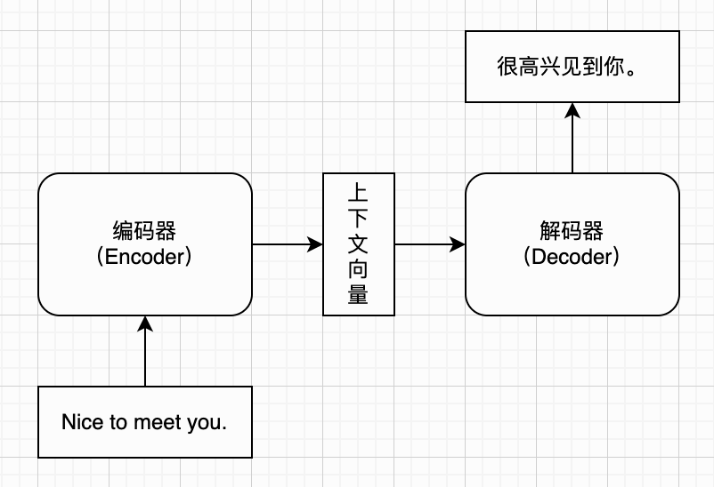

## 第八章：编解码结构

Seq2Seq？？（要不要单独一章）

sequence-to-sequence problems/ Sequence Modelling problems 

### 序列问题

https://arxiv.org/abs/1406.1078

> Seq2Seq（问题）
> ↓
> Encoder–Decoder（解决方案）

sequence problem

one-to-one

one-to-many

many-to-one

many-to-many（Neural Machine Translation）

Sequence-to-Sequence (Seq2Seq) problems

> is a special class of Sequence Modelling Problems in which both, the input and the output is a sequence.
>
> Encoder-Decoder models were originally built to solve such Seq2Seq problems.

### 编解码结构

编码器模块=>解码器模块

Encoder/Decoder

encoder-decoder models

Encoder–Decoder（Seq2Seq）架构

Sequence to Sequence Learning with Neural Networks, 2014

https://arxiv.org/abs/1409.3215

Learning Phrase Representations using RNN Encoder–Decoder for Statistical Machine Translation

### 编码器

TODO

### 解码器

TODO

### 例子（翻译）

TODO

### 本章小结

TODO
