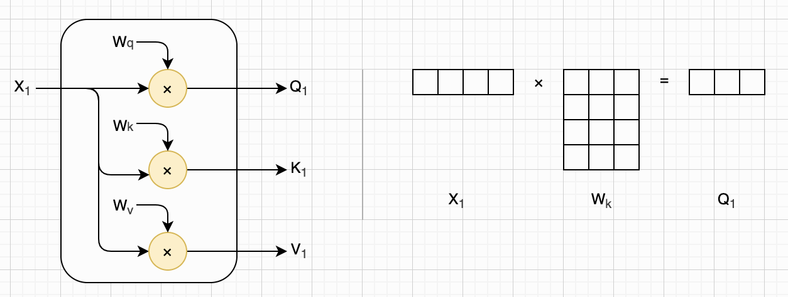
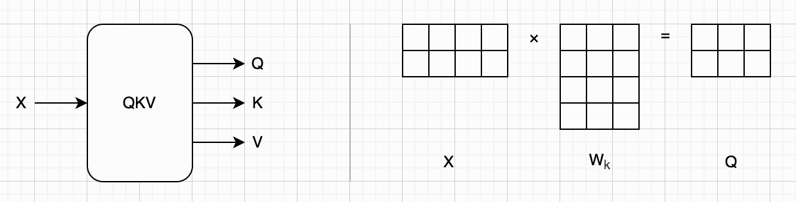
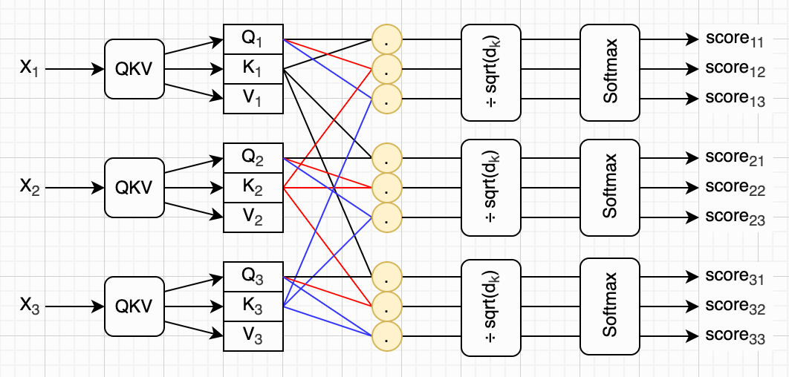
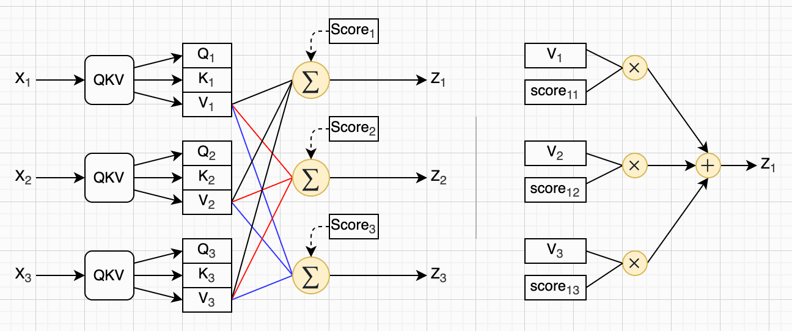

## 第十章：Transformer架构

自注意力机制，单独一章？

TODO

BERT：只用 Encoder（理解型模型）

GPT：只用 Decoder（生成型模型）


> 是的，**现在很火的大语言模型（LLM）底层就是深度学习**，而且是深度学习中的一种非常重要的模型结构：**Transformer**。


### Q、K、V

TODO：



KQV计算：

$$
\mathbf{q}_1 = \mathbf{x}_1 \times W_q \\
\mathbf{k}_1 = \mathbf{x}_1 \times W_k \\
\mathbf{v}_1 = \mathbf{x}_1 \times W_v
$$

矩阵：



用矩阵表示：

$$
Q = X \times W_q \\
K = X \times W_k \\
V = X \times W_v
$$

Python代码：

```python
def calc_qkv(w_q, w_k, w_v, x):
    q = x @ w_q
    k = x @ w_k
    v = x @ w_v
    return q, k, v
```


### 分数

介绍




分数：

$$
score_{ij} = \mathrm{softmax}(\frac{\mathbf{q}_i \cdot \mathbf{k}_j}{\sqrt{d_k}})
$$

用矩阵表示：

$$
Score = \mathrm{softmax}(\frac{Q \times K^T}{\sqrt{d_k}})
$$

Python代码：

```python
def calc_score(q, k, v, sqrt_d_k):
    score = q @ k.T / sqrt_d_k
    return softmax(score)
```


### 自注意力



V加权求和：

$$
\mathbf{z}_i = \sum_{j=1}^{n}{score_{ij} \times \mathbf{v}_j}
$$

用矩阵表示：

$$
Z = \mathrm{softmax}(\frac{Q \times K^T}{\sqrt{d_k}}) \times V
$$

代码：

```python
def calc_self_attention(w_q, w_k, w_v, sqrt_d_k, x):
    q, k, v = calc_qkv(w_q, w_k, w_v, x)
    score = calc_score(q, k, v, sqrt_d_k)
    return score @ v
```


### 多头自注意力

多个W矩阵，计算出多个Z

拼接Z

乘上另外一个W

玩具代码：

```python
def new_multi_head(heads, w_o):
    def multi_head(x):
        z_list = [head(x) for head in heads]
        z = np.concatenate(z_list, axis=1)
        return z @ w_o
    return multi_head
```


### 编码器

TODO


### 解码器

TODO


### 整体架构

TODO


### PyTorch实现

TODO


### 本章小结

TODO
