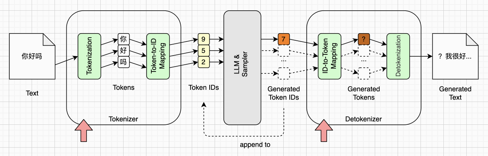
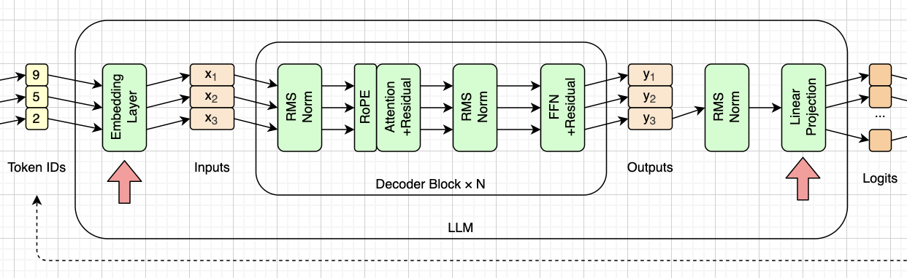
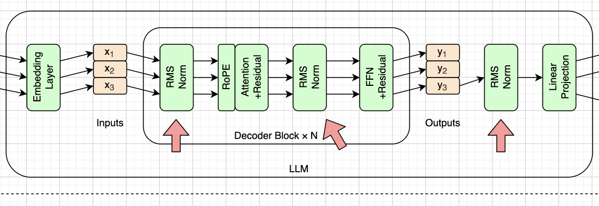
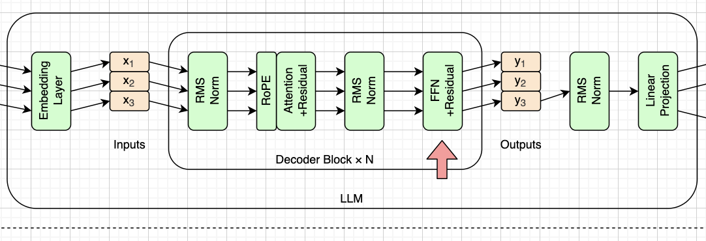
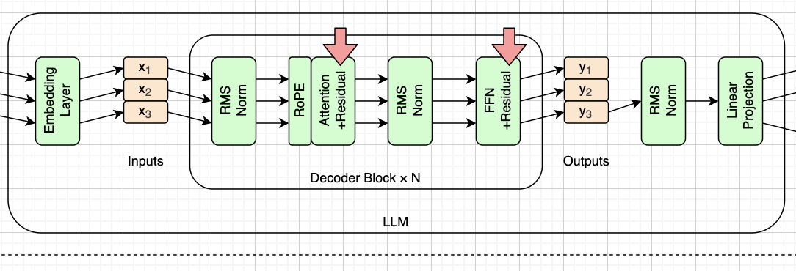
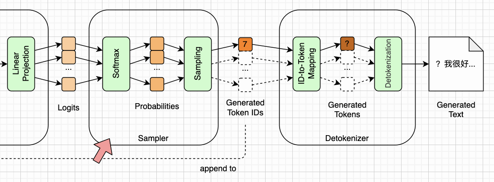

# LLM推理引擎概览

《自己动手写LLM推理引擎》这本书的主要目的，并不是教你如何写出像[vLLM](https://github.com/vllm-project/vllm)那样的工业级推理引擎，而是带你理解LLM（大语言模型）推理引擎的基本原理。或者更准确地说，是想通过手写推理引擎，帮你理解LLM的工作原理。

本书不会涉及LLM的架构设计和训练过程，只负责把推理过程说清楚。如果你对LLM的设计和训练感兴趣，可以参考Karpathy的[nanoGPT](https://github.com/karpathy/nanoGPT)，或者Raschka的[《Build a Large Language Model (From Scratch)》](https://github.com/rasbt/LLMs-from-scratch)（中译《从零构建大模型》）。如果你发现有更好的学习资料，也可以通过留言等方式告诉我。

如果想一下子精通LLM的方方面面，难度是非常大的。由于我们只关注LLM推理过程，学习难度就大幅降低了。像微积分、链式求导、反向传播这些门槛略高的知识，我们都可以暂时不管。基本上我们只要懂向量、矩阵，以及向量点积、矩阵乘法等基本线性代数基础就可以了。

为了提高学习的趣味性，我们不打算建造空中楼阁。我们会加载真实的[SmolLM2](https://arxiv.org/abs/2502.02737)模型，一步一步从零实现推理引擎。该模型最小的版本只有135M个参数，在老旧笔记本电脑上只用CPU也能跑起来。关于SmolLM2模型，我们会在第二章详细介绍。本章会以该模型为切入点，介绍LLM推理引擎的完整工作过程，顺便给出全书的路线图。


## 推理过程总览

下面就是LLM推理过程示意图，它既是数据的流向图，同时也是本书的路线图。注意这张图是以SmolLM2模型为例的，许多细节都与该模型对齐。其他模型未必与这张图严丝合缝，但工作原理大致是相同的。


从上图可以看出，LLM推理引擎大致可以分为四个大的模块。从左到右依次是：Tokenizer、LLM、Sampler和Detokenizer。而大的模块里，又有一些小的模块。

两边的两个模块：Tokenizer和Detokenizer，其实是密不可分的，我们会在第三章统一介绍。采样器（Sampler）负责从LLM给出的分数（Logits）里挑出一个词元（Token），并顺便注入一些随机性，让输出更加多样，我们会在第十章介绍。中间的LLM是整个推理引擎的核心，也是本书的重点，其余大部分章节都是围绕这个模块展开讨论。

另外，这张图并不只是一条流水线，而是一个循环。每转一圈只产出一个词元，这个词元会被追加到输入序列的末尾，然后整条流水线从头再走一遍。推理引擎启动起来后，这个循环就一直往复，直到满足停止条件。这个“每次只产出一个，然后把前面的全部重算一遍”的特点，正是第十一章要解决的问题。

下面我们逐个介绍这些小模块，它们也正好对应了后面每一章的内容。


## 模型结构与权重（第二章）

我们先来看中间最大的这个模块，也就是LLM，下面是放大以后的图。再次注意，这幅图是专门根据SmolLM2模型的架构来画的。注意看中间的那个方框，也就是Transformer架构里的Decoder块。以SmolLM2为例，它一共重复了30次。为了使图好看，我们并没有把这30个块都画出来，你理解即可。


由于LLM比较复杂，所以我们需要把它拆分为多个小模块，分开来理解和实现。在上图中，这些小模块（绿色）按顺序大致是：词嵌入、归一化、位置编码、注意力机制、前馈网络、线性投影。我们会在第四到第九章详细讨论这些小模块，以及图上画不出来的残差连接。需要说明的是，后面的章节顺序和这里略有出入：位置编码虽然画在注意力机制的前面，但我们会先讲注意力机制，再回过头来补上位置编码，这样更容易理解。

对于推理引擎来说，LLM就是一份规格说明加一个权重文件。有了这些信息和数据，推理引擎就可以工作了。我们会在第二章详细介绍HuggingFace（简称HF）模型的各种信息，包括元数据、权重数据等。并以SmolLM2模型为例，分析以上提到的每一个模块需要多少权重参数，以及它们在权重文件中的位置。

现在我们按照信息流动的方向，看看每一个模块大致是如何工作的。


## 分词（第三章）

我们人类是以**字**（汉语）或者**单词**（英语）为单位来理解文字的，但LLM不是这样，它是以**词元**（Token）为单位来理解文字的。为了简化描述，我们先把LLM和采样器隐藏起来，变成一个黑盒子，如下图所示：



简而言之，在进入LLM之前，文字会先被切分为一个个词元，然后再通过查表得到一个个ID。这些ID经过LLM和采样器处理后，会预测出下一个ID。这个新的ID又会被追加到原来的序列末尾，再走一遍，如此往复。我们把这样陆续产出的ID收集起来，反向查表就可以得到一系列词元，再把这些词元拼接起来，就得到了输出文字。

在本书中，我们把这个切分文字得到词元（Tokenization），再查表得到ID（Token-to-ID）的过程，统称为Tokenizer模块。把ID反向查表得到词元（ID-to-Token），再拼接成文字（Detokenization）的过程，统称为Detokenizer模块。

最后要说明一点。为了便于理解，图上用的是一个简化的例子：“你好吗”被切成“你”、“好”、“吗”三个词元，ID分别是9、5、2。真实情况没有这么整齐，词元和汉字并不是一一对应的。本书后面的图，凡是出现具体的词元和ID，都做了类似的简化，重点在于说明数据的流向，而不是某个具体的值。此外，由于SmolLM2更擅长英文，所以我们实际跑真实模型的时候，会以英文为例，而不是中文。

关于文字切分和拼接过程，以及词元两个方向查表的细节，我们会在第三章详细讨论。


## 词嵌入（第四章）

前一小节的描述其实并不完全准确。实际上，LLM内部处理的也并不是词元，而是一种向量，我们称之为**词嵌入**（Embedding）。

负责转换的有两个模块。其中一个位于入口处，负责将词元ID转换为词嵌入。另外一个模块位于出口处，负责把词嵌入转换为**分数**（Logits）。这两个模块，一个在最左边，叫做词嵌入层；一个在最右边，叫做线性投影，如下图所示：



有趣的是，在SmolLM2里，这两个模块用的是同一个权重矩阵，这叫做**权重共享**（Weight Tying）。参数量较小的模型大多这么做，因为词嵌入矩阵在小模型里占比很高。模型大了之后，这个占比会降下来，不少大模型（比如Qwen2.5-7B、Mistral-7B）就不再共享了。由于这个缘故，我们将在第四章统一介绍词嵌入和线性投影这两个模块。


## 归一化（第五章）

**归一化**（Normalization）模块在上面这张图里一共出现了三次，分别位于注意力机制、FFN和线性投影模块的前面，如下图所示。但要注意，图上画的只是一层。以SmolLM2为例，前两个归一化模块位于Decoder块内部，会跟着重复30次；最后一个位于整个模型的出口处，只有一个。30×2+1，所以整个模型一共有61个归一化模块。



在传统Transformer架构中，这个概念叫做**层归一化**（Layer Normalization），而且位置在注意力机制和FFN的后面。但是后来的架构，大部分把层归一化进行了前移，也就是目前的位置，因此有了post-norm和pre-norm之分。

现代LLM（包括SmolLM2）更喜欢使用图中画的RMSNorm。由于RMSNorm实际上并不是传统层归一化，所以我们把它叫做归一化。我们会在第五章详细讨论层归一化的前因后果，以及RMSNorm的细节。


## 注意力机制（第六章）

我们知道，目前的LLM大多采用Decoder-only的Transformer架构，SmolLM2也不例外。这个架构出自2017年的经典论文《Attention Is All You Need》。这篇论文非常重要，是整个Transformer架构，乃至整个LLM的开山之作。如果你还没读过它，一定要读三遍以上。

从这篇论文的标题你就可以知道，**注意力**机制有多么重要。可以这么说，注意力机制就是整个LLM的核心。而它在我们的数据流向图中也的确处于核心位置，如下图所示。我们会在第六章详细讨论注意力机制的基本原理。


由于注意力机制如此之重要，所以对于Transformer的优化和改进，主要就集中在这块。由于篇幅有限，本书不可能覆盖所有这些优化。我们会在第十一章讨论KV Cache，在第十二章讨论FlashAttention。


## 位置编码（第七章）

注意力机制有一个缺陷，那就是对词元顺序不太敏感。举个例子，不管输入的文字是“猫捉老鼠”还是“老鼠捉猫”，注意力机制给出的计算结果都一样。这显然是不合理的。为了解决这个问题，Transformer出厂就自带了**位置编码**（Positional Encoding）。最初的做法是算出一个代表位置的向量，直接加到词嵌入向量上。

但是最开始提出的位置编码方式也是有局限性的，所以后来又发展出许多优化方式，目前采用比较多的是旋转位置编码（Rotary Position Embedding，简称RoPE）。由于SmolLM2采用的也是RoPE，所以我们的数据流向图里也直接反映了这个细节。RoPE其实并不是一个独立模块，它和注意力机制是密不可分的。但由于它比较复杂，所以我们把它单独画了出来，紧挨在注意力机制的前面，如下图所示：


我们将在第七章简要介绍Transformer架构最初提出的位置编码方案，并重点介绍目前主流的RoPE方案。


## 前馈网络（第八章）

从历史上来说，**前馈网络**（Feed-Forward Network，简称FFN）是较早出现的（最早可以追溯到1950年代后期），是整个人工神经网络和深度学习的基础。而且FFN也是所有这些模块中相对比较容易理解的。但是按照数据流向，FFN是比较靠后的，在Decoder块的出口处，如下图所示：



别看FFN在图中就这么一个小小的模块，它其实占据了整个LLM大约六成的参数量，以及很大一部分计算量。为了优化这个模块，目前不少大模型采用了一种叫做混合专家（Mixture of Experts，简称MoE）的方案。不过SmolLM2参数量比较小，并没有采用MoE。

我们会在第八章详细介绍FFN以及SwiGLU激活函数，并简要介绍MoE优化。


## 残差连接（第九章）

前面介绍注意力机制和FFN的时候，你可能已经留意到了，这两个模块里面还有一个“+Residual”，这个对应**残差连接**（Residual Connections），如下图所示。由于残差连接不太好画在这个数据流向图里，所以以文字形式写在了注意力和FFN这两个模块里。



残差连接的概念在模型训练阶段是非常重要的，极大地提高了训练的稳定性。我们将在第九章讨论残差连接的基本概念，以及几种优化方式。


## 采样（第十章）

LLM（这里是SmolLM2）的输出，是将近五万个实数，也就是分数。如果我们每次都选最高分，然后选出对应词元ID，再把这些ID还原成文字，也是可以的。但这样的输出会索然无味，缺乏多样性。同样的输入总是获得同样的输出，换句话说，同样的问题总是得到同样的答案。为了解决这个问题，我们引入采样器模块，负责注入多样性，如下图所示：



另外注意采样器输出后面的这条虚线。正是这条虚线，让流水线成为了一个循环，让引擎转动了起来。

实际上，每次取最高分也是一种采样，叫做贪婪采样。我们将在第十章介绍目前绝大部分LLM推理引擎都会用到的采样算法，包括温度、top-k、top-p等。


## 优化（第十一、十二章）

前面十章走完，我们的推理引擎就真的能工作了。到那个时候，LLM推理的完整过程，尤其是Transformer架构和注意力机制的基本原理，你应该都已经心里有数了。

不过前面介绍注意力机制的时候提到过，还有两项优化值得单独拿出来讲。它们有两个共同点：一是都不改变数据流，在总览图上加不了任何新的方框，改的只是“怎么算”，而不是“算什么”；二是都在LLM的核心，也就是注意力机制上做文章。

**KV Cache**（第十一章）治的是总览图里那条虚线。既然每产出一个词元，都要把整个序列重新算一遍，而历史词元算出来的K和V每次都完全相同，那就干脆把它们存下来。于是推理过程裂成了两个阶段：**预填充**（Prefill，一次性处理整段输入）和**解码**（Decode，每次只算一个新词元）。这是“推理引擎”这四个字真正开始有分量的地方。

**FlashAttention**（第十二章）针对的是注意力机制内部的一个中间矩阵。这个矩阵的行数和列数都等于序列长度，序列一长，光是把它存下来就会撑爆内存。办法是把矩阵切成小块分别计算，再用一种叫做在线softmax的技巧把结果拼起来，全程不把完整矩阵算出来。需要说明的是，这本质上是针对GPU显存层级做的优化，我们在CPU上只能演示它的数学正确性，演示不出加速效果。

如果上面这两段你暂时看不明白，完全没关系。这里冒出来的每一个名词，后面都会详细解释。等你读完前面十章再回过头来看，应该就是另一番感觉了。


## 为五行代码写一本书

如果我们使用HF的transformers库，那么五行Python代码就可以跑通SmolLM2-135M模型，类似下面这样：

```python
tok = AutoTokenizer.from_pretrained(MODEL_DIR)
model = AutoModelForCausalLM.from_pretrained(MODEL_DIR)
ids = tok(PROMPT, return_tensors="pt")
out = model.generate(**ids, max_new_tokens=20, do_sample=False)
text = tok.decode(out[0])
```

这五行分别是：加载分词器、加载模型、把文字变成词元ID、生成、再把ID变回文字。其中`MODEL_DIR`是模型文件所在的目录，`PROMPT`是输入的文字。如果输入的是`"Once upon a time"`，跑完这五行，`text`里就是下面这句话：

```
Once upon a time, there was a little girl named Lily. She lived in a big house with her family, but
```

这五行里，前三行是准备，第五行是收尾，真正干活的是第四行。别看`generate`只是一次函数调用，它内部其实是个循环，一共转了20圈：把整个序列送进30个Decoder块算一遍，从最后一个位置挑出一个词元，追加到序列末尾，然后接着算下一圈。第一圈的输入是4个词元，第20圈就变成23个了，加起来一共算了270个，可我们真正想要的只有20个。这个浪费我们放到第十一章再说。

你可能也注意到了，本章前面介绍的那些模块，其实全都藏在这几行代码里面：第一行和第五行是分词和反分词，第二行是加载权重，而第四行每转一圈，都要把词嵌入、归一化、注意力机制、位置编码、前馈网络、残差连接和采样器走一遍。后面十一章要做的，就是把它们一个一个自己写出来。用HF只要五行，我们自己写下来大概要一千行左右。这一千行既不会跑得更快，生成的文字也不会更好，但是写完之后，每一个数字是怎么算出来的，你心里就有数了。

如果你的目的只是调用LLM生成文字，那么你只看这五行代码就可以了。但如果你想弄明白这五行代码，尤其是第四行代码背后的秘密，那这本书就是为你而准备的。希望本书能带给你不一样的阅读体验！


## 本章小结

这一章有两个目的。第一，按照数据流动的方向，把LLM推理引擎，尤其是LLM内部的各个基本模块，整个过了一遍。第二，给出全书的路线图，交代每一章要讲什么。

如果你还不太熟悉LLM和推理引擎，那么读完本章，应该已经对它们有了大致的印象。接下来，我们就按照这一章定好的路线图逐个展开。下一章先从加载模型、解析模型参数开始。

