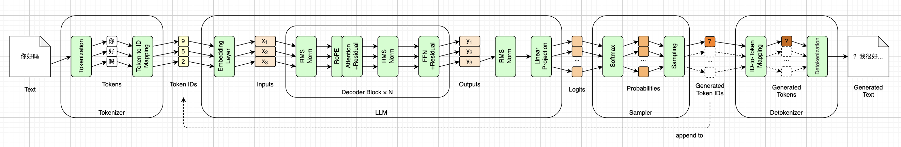
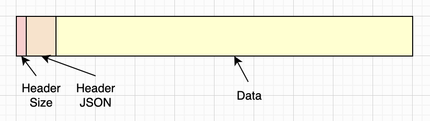
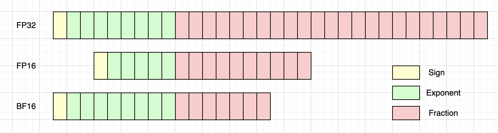

# 模型文件与权重


在第一章里，我们按照数据流动的方向，讨论了LLM的基本模块，以及推理引擎的基本工作原理。同时，我们也制定了整本书的路线图。我们还写了五行代码，展示了使用HF（[Hugging Face](https://huggingface.co/)）提供的`transformers`库加载LLM并进行推理是多么简单。但是，这五行背后的计算过程，需要我们用一整本书来深挖。

这一章我们主要讨论HF模型相关的文件，重点是Safetensors文件的格式。我们会下载SmolLM2模型相关的所有文件，并大致介绍这些文件的作用。我们会重点关注`model.safetensors`文件，把每一块数据在哪、起什么作用，都搞清楚。

为了便于参考，我们把前一章的数据流向图重新贴过来，如下所示。注意，这一章你不必纠结这些绿色小模块的具体细节。我们只要搞清楚这些小模块对应的参数量大约是多少，大致在数据文件中的什么位置，就可以了。从下一章开始，我们会逐个详细了解这些模块。



我们从下载模型相关文件开始。


## 下载模型

虽然说我们写的是玩具级LLM推理引擎，但这个玩具，是可以真实跑在CPU上的。加载的是真实模型，进行的也是真实计算。只是，我们追求的是理解推理过程，而非极致的性能。由于这个缘故，我们选了[SmolLM2](https://huggingface.co/collections/HuggingFaceTB/smollm2)这个“小”模型。关于这个模型的更多介绍，可以参考本书前言。

SmolLM2模型一共有三个尺寸：135M，360M，和1.7B。本书使用135M，你可以在SmolLM2的[HF模型主页](https://huggingface.co/HuggingFaceTB/SmolLM2-135M)（模型卡片）上看它的详细信息。为了简化文字，后文中提到的SmolLM2模型，如无特殊说明，均指135M这个尺寸。

你还可以在模型的[文件和版本](https://huggingface.co/HuggingFaceTB/SmolLM2-135M/tree/main)页面下，查看模型相关的文件和版本信息。从这个页面可以看出来，HF是用Git仓库来管理模型文件的，连分支和提交历史都有。不过本书我们也不关心这个细节了，我们只要能把这些文件下载到本地就可以。

由于模型相关文件比较多，为了避免手动下载这些文件，我写了一个Shell脚本，就放在随书源代码的`code/`目录下。你运行这个脚本，就会在`code/models/SmolLM2-135M`子目录里下载好SmolLM2模型相关的所有文件。注意，`models/`目录里面的内容是没有提交到本书仓库的，所以在第一次执行随书Python代码之前，你需要先把这个脚本跑一遍。

SmolLM2模型一共有十个文件，我们在下一小节挨个介绍。


## 模型文件

使用脚本下载好模型后，我们使用`tree -a`命令看一下`code/models`目录，可以看到`SmolLM2-135M`子目录下一共有10个文件：

```
code/models
└── SmolLM2-135M
    ├── .gitattributes
    ├── config.json
    ├── generation_config.json
    ├── merges.txt
    ├── model.safetensors
    ├── README.md
    ├── special_tokens_map.json
    ├── tokenizer_config.json
    ├── tokenizer.json
    └── vocab.json
```

不要被这些文件给吓到了。其中，`.gitattributes`是[git-lfs](https://git-lfs.com/)配置，`README.md`是说明文件，本书我们不管它们。

还有两个文件：`vocab.json`和`merges.txt`，它们是老一代的分词器格式，前者是词表，后者是BPE合并规则。新格式`tokenizer.json`把这两样东西连同预处理管线一起打包了，内容是重复的。其实我们只下载`tokenizer.json`就够用，不过这是2MB的大JSON文件，词表和合并规则都嵌在里面，不便阅读；而`merges.txt`是纯文本，一行一条合并规则，肉眼直接能读。所以我们也把它们下载下来了，第三章讲BPE的时候，拿它们当参照会直观一些。如果好奇也可以看看，但本书的代码不使用它们。

剩下的文件里，有三个是分词器相关的。前面提到的`tokenizer.json`是分词器本体，词表、BPE合并规则，以及分词前的预处理管线，全都打包在这一个文件里。`tokenizer_config.json`是分词器的配置，记录了分词器的类型、能处理的最大长度，以及几个特殊词元分别是什么。`special_tokens_map.json`则专门列出特殊词元。这三个文件我们会在下一章逐个交代。

配置文件`generation_config.json`记录生成文本时的默认参数，它是这十个文件里最小的一个，只有111字节。别看名字唬人，在SmolLM2-135M里它其实只记了`bos_token_id`和`eos_token_id`两个字段，值都是0。温度、top-k这些采样参数一个都没有，要等到第十章我们自己定。

最重要的是剩下的两个文件。`config.json`就是第一章说的那份规格说明，704字节，二十来个字段，记录了模型的架构和各种超参数：隐藏层维度576、30层、9个注意力头、词表大小49152等等。推理引擎靠它才知道该建多大的矩阵、建多少个。这个文件我们留到第四章，等真正要用它的时候再读。而`model.safetensors`就是模型权重本身，一亿三千多万个参数都躺在这里面，它是本章后半部分的重点。

有一件值得注意的事：权重和分词是两套完全独立的东西，分在不同的文件里。所以到第三章讨论词元和分词时，我们可以完全不碰`model.safetensors`文件里面的内容。

最后一点，是将来换更大的模型时会遇到的。由于SmolLM2模型的权重数量并不大，所以只有`model.safetensors`这一个文件。但模型超过一定大小之后，HF会把权重切成好几片，变成`model-00001-of-00003.safetensors`这样的一串，外加一个`model.safetensors.index.json`索引文件，记录哪个**张量**（Tensor）在哪一片里。SmolLM2三个尺寸都用不着切，所以本书我们暂不关心这个问题。


## 模型数据（Safetensors）

现在我们来聚焦在`model.safetensors`文件上。如果你用`ls -l`命令看一下这个文件，会发现它有`269,060,552`个字节，大约269MB。你可能会问，我们用的不是SmolLM2-135M尺寸的模型吗？怎么文件大小是269MB呢？这是因为，135M说的是**参数量**，不是字节数。这个模型有一亿三千多万个参数，而`model.safetensors`用**BF16**格式来存放它们，每个参数占两个字节，所以字节数正好是参数量的两倍。我们会在后面的小节介绍BF16格式。

从文件名后缀可以判定，`model.safetensors`文件使用了[Safetensors](https://huggingface.co/docs/safetensors/en/index)文件格式。这是HF在2022年提出并开源的一种张量存储格式，如今已经是HF生态里的默认格式。这种格式特别简单，没有代码，没有对象，只有数据。简单带来三个好处：可以用mmap直接映射；可以只读出其中一个张量而不加载整个文件；解析头部就能拿到全部元信息。

简而言之，Safetensors文件包含两个部分：**元数据**（Metadata）和权重数据。文件的前八个字节是元数据的字节数，用**小端序**（Little-Endian）编码。然后是元数据，JSON格式。最后是权重数据，按顺序排列着所有模型权重。前八个字节加上元数据合在一起，又叫做**文件头**（Header）。Safetensors文件的内容可以直观地画成下面这样：



注意，上面这张只是示意图。图中显示的元数据字节数、元数据，以及权重数据，都不是按真实占比画的，你理解大致内容即可。下面我们用`hexdump`命令看一下`model.safetensors`文件：

```
% hexdump -C -n80 models/SmolLM2-135M/model.safetensors
00000000  40 77 00 00 00 00 00 00  7b 22 5f 5f 6d 65 74 61  |@w......{"__meta|
00000010  64 61 74 61 5f 5f 22 3a  7b 22 66 6f 72 6d 61 74  |data__":{"format|
00000020  22 3a 22 70 74 22 7d 2c  22 6d 6f 64 65 6c 2e 65  |":"pt"},"model.e|
00000030  6d 62 65 64 5f 74 6f 6b  65 6e 73 2e 77 65 69 67  |mbed_tokens.weig|
00000040  68 74 22 3a 7b 22 64 74  79 70 65 22 3a 22 42 46  |ht":{"dtype":"BF|
...
```

由于SmolLM2的Safetensors文件还是太大了，所以这里我只贴了前几行输出。开头的八个字节是`40 77 00 00 00 00 00 00`，按小端序读出来是`0x7740`，也就是`30,528`，这就是元数据的字节数。从第九个字节开始，是元数据，的确是JSON格式，连`{"__metadata__":{"format":"pt"}`都能在右边的ASCII栏里直接读出来。再往后才是权重数据，这里没有展示出来。

总结一下，SmolLM2的Safetensors文件，一共`269,060,552`个字节。开头是文件头，八个字节的长度加上`30,528`个字节的元数据，一共占据了`30,536`个字节。剩下的`269,030,016`个字节，全都是模型权重数据。

接下来的几个小节，我们先看元数据，再看模型整体的权重数据，然后看Transformer架构Decoder块内部的权重分布，接着简要介绍一下BF16浮点数格式，最后看看怎么用现成的库把权重加载进来。


## 元数据（JSON）

由于Safetensors文件的格式非常简单，所以写代码解析它也是非常容易的。这一章的随书源代码里有一个`load_header.py`脚本，可以打印出`model.safetensors`文件的元数据。感兴趣的读者可以自己跑一下这个脚本。这里我帮你跑了一下，打印出了JSON元数据。为了适合书面排版，我这里只贴一小部分数据，并且稍微调整了一下格式：

```json
{
  "__metadata__": { "format": "pt" },
  "model.embed_tokens.weight": {
    "dtype": "BF16", "shape": [49152, 576], "data_offsets": [0, 56623104]
  },
  "model.layers.0.input_layernorm.weight": {
    "dtype": "BF16", "shape": [576], "data_offsets": [56623104, 56624256]
  },
  "model.layers.0.mlp.down_proj.weight": {
    "dtype": "BF16", "shape": [576, 1536], "data_offsets": [56624256, 58393728]
  },
  "model.layers.0.mlp.gate_proj.weight": {
    "dtype": "BF16", "shape": [1536, 576], "data_offsets": [58393728, 60163200]
  },
  "model.layers.0.mlp.up_proj.weight": {
    "dtype": "BF16", "shape": [1536, 576], "data_offsets": [60163200, 61932672]
  },
  "model.layers.0.post_attention_layernorm.weight": {
    "dtype": "BF16", "shape": [576], "data_offsets": [61932672, 61933824]
  },
  "model.layers.0.self_attn.k_proj.weight": {
    "dtype": "BF16", "shape": [192, 576], "data_offsets": [61933824, 62155008]
  },
  "model.layers.0.self_attn.o_proj.weight": {
    "dtype": "BF16", "shape": [576, 576], "data_offsets": [62155008, 62818560]
  },
  "model.layers.0.self_attn.q_proj.weight": {
    "dtype": "BF16", "shape": [576, 576], "data_offsets": [62818560, 63482112]
  },
  "model.layers.0.self_attn.v_proj.weight": {
    "dtype": "BF16", "shape": [192, 576], "data_offsets": [63482112, 63703296]
  },
  // ... 其他数据 ...
  "model.norm.weight": {
    "dtype": "BF16", "shape": [576], "data_offsets": [269028864, 269030016]
  }
}
```

这个元数据也很好理解了，它描述了模型权重数据是如何分布的。最前面的`__metadata__`是一个特殊字段，它不描述任何张量，而是留给写文件的程序的一块自由区域，里面可以放任意的键值对。SmolLM2这里只放了一条`format: pt`，表示这个文件是PyTorch写出来的，这个字段还可以是`tf`、`flax`、`np`等等。除它之外，剩下的每一个字段，都对应一个张量。所以你数JSON的键会数出273个，而全部张量只有272个，多出来的那个就是`__metadata__`。

注意每一个字段，Key就是名字，Value又包括三个数据：`dtype`、`shape`和`data_offsets`。`dtype`告诉我们，张量的元素是什么类型。这里我们可以看到，是前面提到的`BF16`，我们在后面会详细介绍。`shape`告诉我们，张量是什么形状。本书我们只关心**向量**（形状是`[N]`）和**矩阵**（形状是`[M, N]`）即可。`data_offsets`告诉我们张量在数据里的位置，用一对起止偏移来表示。这里还有一点要注意，offset是基于**权重数据**的起点算的，并不是基于整个文件。要在文件里定位一个张量，还得再加上文件头那`30,536`个字节。忘了加也不会报错，读出来照样是一堆合法的浮点数，只是全错。

我们知道，SmolLM2一共有30个Decoder块。可以看到，它们在JSON文件里编号从0开始，一直到29。把这些块都贴上也太浪费空间了，所以我只保留了第0个块，其他都删掉了。反正数据长得都一样，你看一个就知道其他了。顺便说一下，在本书中，我可能会混用Decoder块（Block）和层（Layer）。哪种表述自然我就用哪种，通常是不会带来歧义的。


## 权重数据（总体）

从前面的JSON元数据里，我们可以大致看出：模型权重数据，大部分都是Decoder块。词嵌入层参数只占大约21%，30个Decoder块加起来，大概占了79%，具体的账我们在本章后面再算。总体的权重数据分布如下图所示（大致是真实比例）：


总之，拿到元数据，我们是很容易按顺序扫描Safetensors文件，或者随机从文件里读取任意一个张量数据的。这一章的随书源代码里有一个`load_weights.py`脚本，就是根据JSON元数据，读取每一个张量，打印出它的信息，你也可以跑一下试试。这个脚本会打印出三个表格：第一个按Decoder块（也就是层）分组汇总，第二个不分组，把每个张量都列出来，第三个是参数量的统计。我们先来看分组表格，下面是它的输出：

```
┌──────────────┬───────────┬───────────┬──────────┐
│ part         │   tensors │    offset │    bytes │
├──────────────┼───────────┼───────────┼──────────┤
│ embed_tokens │         1 │         0 │ 56623104 │
│ layers.0     │         9 │  56623104 │  7080192 │
│ layers.1     │         9 │  63703296 │  7080192 │
│ layers.10    │         9 │  70783488 │  7080192 │
│ layers.11    │         9 │  77863680 │  7080192 │
...
│ layers.19    │         9 │ 134505216 │  7080192 │
│ layers.2     │         9 │ 141585408 │  7080192 │
│ layers.20    │         9 │ 148665600 │  7080192 │
│ layers.21    │         9 │ 155745792 │  7080192 │
...
│ layers.29    │         9 │ 212387328 │  7080192 │
│ layers.3     │         9 │ 219467520 │  7080192 │
...
│ layers.9     │         9 │ 261948672 │  7080192 │
│ norm         │         1 │ 269028864 │     1152 │
└──────────────┴───────────┴───────────┴──────────┘
```

如果把30层都打印出来，也太长了，所以我刻意省略了许多层。从这个表格里，我们可以看到，Decoder块对应的权重，在模型里并不是按照次序来排列的，而是按照名字的字母顺序。所以第1层之后，就是第10层；第19层之后是第2层；而第9层排在最后。这也正是为什么，解析Safetensors文件只能认`data_offsets`，不能图省事按元数据里的出现顺序去数第几层。数错了同样不会报错，只是第2层会拿到第11层的权重。

表格里还有几个数值得留意。30个Decoder块的结构完全一样，每块都是9个张量、`7,080,192`个字节，一个不多一个不少。而块外面只有两个张量：开头的词嵌入矩阵`embed_tokens`，和末尾的`norm`。最后这个`norm`是RMSNorm的权重向量，只有`1,152`个字节，按比例画出来不到半个像素，所以上面那张图里根本看不见它。

接下来我们看看每一个块，也就是每一层，参数是怎么布局的。


## 权重数据（每层）

其实从前面的JSON元数据，我们也能大概看出每一层的数据分布。我们把它画出来，类似下图。一个Decoder块有9个张量，这里按参数量画成了长条：左边三块是FFN需要的权重矩阵，右边四块是注意力机制需要的权重矩阵，两个RMSNorm向量太小，画不出来。


如果你还看不懂这些数据，也没关系。后面介绍注意力机制和前馈网络时，我们会详细介绍这些权重。我们前面提到的`load_weights.py`打印出的第二个表格，会把每一层都展开，类似下面这样：

```
┌──────────────────────────┬──────────────┬───────────┬──────────┐
│ tensor                   │        shape │    offset │    bytes │
├──────────────────────────┼──────────────┼───────────┼──────────┤
│ embed_tokens             │ (49152, 576) │         0 │ 56623104 │
│ l.0.input_layernorm      │        (576) │  56623104 │     1152 │
│ l.0.mlp.down_proj        │  (576, 1536) │  56624256 │  1769472 │
│ l.0.mlp.gate_proj        │  (1536, 576) │  58393728 │  1769472 │
│ l.0.mlp.up_proj          │  (1536, 576) │  60163200 │  1769472 │
│ l.0.post_attn_layernorm  │        (576) │  61932672 │     1152 │
│ l.0.self_attn.k_proj     │   (192, 576) │  61933824 │   221184 │
│ l.0.self_attn.o_proj     │   (576, 576) │  62155008 │   663552 │
│ l.0.self_attn.q_proj     │   (576, 576) │  62818560 │   663552 │
│ l.0.self_attn.v_proj     │   (192, 576) │  63482112 │   221184 │
...
│ norm                     │        (576) │ 269028864 │     1152 │
└──────────────────────────┴──────────────┴───────────┴──────────┘
```

这个表格如果全贴上来有两百多行，同样是太长了，所以我只留了第0层数据。此外，为了适合书面排版，我把张量名的`model.`前缀和`.weight`后缀都省略了，还把`layers.`缩写成了`l.`，把`post_attention`缩写成了`post_attn`。

有一个比较有趣的地方，看图一眼就能看出来：左边三块的总宽度，正好是右边四块的三倍。也就是说，在一个Decoder块内部，FFN占了大约75%的参数，注意力只占25%。最后我们算算总账，看看参数都花在哪了：

| 部分 | 参数量 | 占比 |
| --- | --: | --: |
| 词嵌入矩阵（49152×576） | 28,311,552 | 21.0% |
| 30个Decoder块里的FFN | 79,626,240 | 59.2% |
| 30个Decoder块里的注意力 | 26,542,080 | 19.7% |
| 全部61个RMSNorm | 35,136 | 0.03% |
| **合计** | **134,515,008** | |

这张表里有两点值得留意。

第一，参数的大头在FFN，不在注意力。大家整天讲注意力，但它其实还不到两成，FFN占了将近六成。这个结论在真正的大模型身上同样成立，而且往往更极端：SmolLM2一个块里FFN是注意力的3倍，Llama-3.1-8B是4.2倍，Qwen2.5-7B更是接近7倍。这也是为什么超大模型都会采用混合专家（MoE）这种方案的缘故，我们在第八章会详细介绍FFN，并顺带说一下MoE。

第二，61个RMSNorm加起来只有35,136个参数，占比0.03%。61这个数字是这么来的：30个Decoder块，每块两个RMSNorm，再加上模型最末尾的那一个。它们少到在前面两张图里都画不出来，不过参数少不等于不重要，第五章我们会专门介绍它。

说到这里，我们可以回过头看看本章开头那张数据流向图了。图上绿色的小模块有十几个，但真正要吃权重的只有五个：词嵌入、RMSNorm、注意力、FFN，还有最后的线性投影。其余的一个参数都不需要。分词和反分词靠的是`tokenizer.json`里的词表，不在这269MB里面；RoPE是按位置当场算出来的，根本不用存，第七章我们会看到；残差连接只是一次加法；Softmax和采样就更纯粹了，它们只对Logits做运算。

至于最后那个线性投影，它确实需要一个矩阵，可你在这272个张量里怎么也找不到它。原因是SmolLM2用了**权重共享**（Weight Tying），也就是第一章提过的那件事：线性投影直接拿词嵌入矩阵来用，两头共用一份数据，所以文件里只存了一份。这也正是为什么，`config.json`里`tie_word_embeddings`这个字段的值是`true`。至于一个矩阵怎么能当两样东西用，我们在第四章会详细介绍。

这一章的最后，我们来简单看看BF16格式。


## BF16格式

学过编程的读者，对IEEE 754的浮点数格式应该都不陌生：FP64（双精度）、FP32（单精度）、FP16（半精度）。模型很吃内存和带宽，而用FP32存权重，每个参数要占四个字节。换成16位的格式，空间和带宽立刻省一半，所以大家很自然地想这么干。但FP16有个麻烦，它的指数位只有5位，能表示的数值范围很窄，最大只到`65,504`。而深度学习里的数值动不动就跨好几个数量级，用FP16很容易溢出成无穷大，一旦溢出，后面的计算就全废了。

于是Google的Brain团队提出了[BrainFloat16](https://en.wikipedia.org/wiki/Bfloat16_floating-point_format)，简称bfloat16，或者BF16。它换了一种取舍：指数位保持8位，和FP32一样宽，尾数位砍到7位。FP32、FP16和BF16的指数位和尾数位的对比关系，见下图：



BF16的设计取舍很清楚：**牺牲精度，保住动态范围**。它的指数位和FP32一样宽，所以FP32能表示的数量级它都能表示，只是有效数字少。对深度学习来说，数值溢出比精度损失致命得多，所以BF16赢了FP16。还有一个附带的好处：BF16转FP32是无损的，尾数位补零即可；反过来才会丢精度。

另外一定要注意，对于本书来说，BF16只是**存储格式**，并不是计算格式。本书后面加载模型时，会统一升成FP32，因为CPU上FP32的算子更快也更全。GPU上则恰恰相反，以NVIDIA为例，从Ampere架构开始，硬件原生支持BF16矩阵乘。所以在GPU上跑大模型，权重和中间结果全程保持BF16才是常态。只是我的笔记本电脑比较老旧，没有可用的GPU，所以本书只能以CPU为主。


## 加载模型

读到这里，你应该已经对HF的模型文件、尤其是Safetensors文件的格式，比较了解了。这种文件是非常简单的，写一个脚本来加载它非常容易，前面那两个脚本就是这么干的。但它们的目的是打印模型信息，而为了写推理引擎，我们还需要一个专门把权重拿到手的模块。

自己从头解析文件这件事，我决定不做了。我们的目标是理解推理过程，而不是痴迷于造轮子。由于Safetensors是HF提出的，所以它已经提供了一个很好用的库，就叫做`safetensors`。用这个库，几行代码就能把张量取出来，类似下面这样：

```python
with safe_open(PATH, framework="pt") as f:
    for name in f.keys():
        t = f.get_tensor(name)  # 直接拿到张量，不是裸字节
        print(f"{name:<48}{str(tuple(t.shape)):>14}  {t.dtype}")
```

不过有一点要说明：这个库的Python接口并不提供`data_offsets`，`keys()`只给名字，`get_tensor()`只给张量，每块数据在文件里的位置是看不见的。这也是前面那两个脚本值得自己写一遍的理由，只有亲手拆过一次，你才知道`get_tensor()`背后究竟发生了什么。

解析文件的活交给库，但为了后面用着方便，我们还是要在它外面包一层。这一章的随书源代码里有一个`weights.py`，里面的`Weights`类就是干这件事的：一次性把272个张量全读进来，整理成三样东西，入口的`embed_tokens`、中间的30层，以及最后的`norm`。下面是这个类的主要代码：

```python
class Weights:
  def __init__(self, model_dir=MODEL_DIR, dtype=torch.float32):
    path = Path(model_dir) / "model.safetensors"
    with safe_open(path, framework="pt") as f:

      def get(name): # 读一个张量，顺便从bf16升成fp32。
        return f.get_tensor(name).to(dtype)

      self.embed_tokens = get("model.embed_tokens.weight")
      self.n_layers = count_layers(f.keys())

      p = "model.layers" # 纯粹为了书面排版，省点宽度
      self.layers = [
        {
          "input_norm"    : get(f"{p}.{i}.input_layernorm.weight"),
          "q_proj"        : get(f"{p}.{i}.self_attn.q_proj.weight"),
          "k_proj"        : get(f"{p}.{i}.self_attn.k_proj.weight"),
          "v_proj"        : get(f"{p}.{i}.self_attn.v_proj.weight"),
          "o_proj"        : get(f"{p}.{i}.self_attn.o_proj.weight"),
          "post_attn_norm": get(f"{p}.{i}.post_attention_layernorm.weight"),
          "gate_proj"     : get(f"{p}.{i}.mlp.gate_proj.weight"),
          "up_proj"       : get(f"{p}.{i}.mlp.up_proj.weight"),
          "down_proj"     : get(f"{p}.{i}.mlp.down_proj.weight"),
        }
        for i in range(self.n_layers)
      ]

      self.norm = get("model.norm.weight")
```

有三个细节值得说一下。

第一，每一层的9个张量装在一个dict里，而且是**按数据流的顺序**排的：先归一化，再注意力，再归一化，最后FFN。前面说过，它们在文件里是按名字的字母序躺着的，那个顺序适合机器，不适合人。名字也都缩短了，`model.layers.0.self_attn.q_proj.weight`这一长串，到这里就是`q_proj`。

第二，层数是**数出来的**，不是写死的。`count_layers()`扫一遍张量的名字，看`model.layers.N.`里的N最大到几。这样`w.layers[2]`拿到的一定是第2层，下标就是层号，不会再踩到字母序那个坑。`config.json`里当然写着30，不过那个文件我们留到第四章再打开。

第三，所有权重在读进来的时候，统一从BF16升成了FP32，也就是前面那一节说的，CPU上FP32的算子更快也更全。代价是内存翻倍：文件是269MB，读进内存大约538MB。

后面各章需要权重的时候，直接构造一个`Weights`，然后按名字取就行了。


## 本章小结

这一章做了三件事。第一，把HF模型仓库里那十个文件挨个认了一遍，知道了权重和分词是两套完全独立的东西，分在不同的文件里。第二，把`model.safetensors`从头到尾拆开了，说白了，这个文件就是一个索引加一堆浮点数：`30,536`个字节的文件头，外加`269,030,016`个字节的权重，每个参数用BF16格式，占两个字节。第三，顺着元数据看清了`134,515,008`个参数的分布：272个张量，其中270个属于30个Decoder块；参数的大头在FFN，占了将近六成，而注意力还不到两成。

除了读懂，这一章还留下了一件工具：`weights.py`里的`Weights`类。解析Safetensors格式的活交给了HF的`safetensors`库，我们只在外面包了一层：把272个张量一次性读进内存，整理成入口的`embed_tokens`、中间的30层和最后的`norm`，名字缩短，顺序按数据流排。从第四章起，凡是要用到权重的地方，都从它这里拿。

另外还有两个坑值得记住，它们都不会报错。`data_offsets`是相对权重数据的起点算的，忘了加文件头，读出来是一堆合法但全错的浮点数；张量在文件里按名字的字母序排列，不是按层的顺序，按出现顺序去数第几层，第2层会拿到第11层的权重。这两种错误都不会让程序崩溃，只会让模型胡说八道。好在用现成的库可以绕过它们，但知道它们的存在，将来换个格式、换个框架时你才不会栽跟头。

不过到目前为止，我们手上也只是一堆浮点数而已，一次计算都还没做过。下一章我们暂时把这堆浮点数放一边，去处理第一章总览图上最外侧那两个盒子，也就是分词。整个第三章都不会用到`model.safetensors`文件，等到第四章，才会第一次拿这堆浮点数真的去算点什么。
