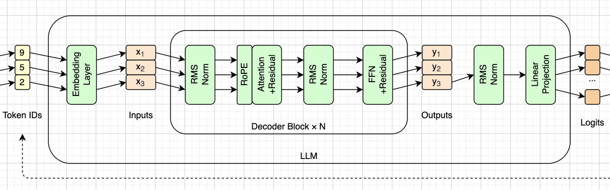
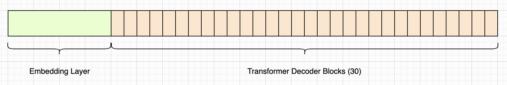
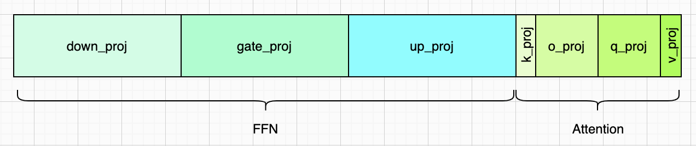

# 模型结构与权重

> **本章代码**：打开 `model.safetensors` 和 `config.json`，只加载、不计算——把第一章那张参数分布表逐个数字验证一遍。
>
> - **造哪个框**：还不对应任何框，这一章是给后面十章备料
> - **跑出什么**：272 个张量的清单（名字、形状、dtype）、文件 269.1 MB、总参数 134,515,008、单个 block 3,540,096；再按第一章那张表分类汇总——词嵌入 21%、FFN 59%、注意力 19.7%、61 个 norm 0.03%
> - **对拍**：参数量与第一章 transformers 报的一致；张量名与 HF `state_dict` 的键**集合完全相同**
> - **坑**：文件里没有 `lm_head.weight`（`tie_word_embeddings`），也没有任何 bias；每个 `.weight` 都是 `(out, in)` 已经转置好的——`q_proj` 和 `o_proj` 是 576×576 方阵，转置了**不报错**，但结果全错
> - **不做**：不建任何 `nn.Module`，这一章只有「读」



上一章我们用别人的引擎跑通了 SmolLM2，也看到了它的结构。这一章把权重文件打开，看看那 1.35 亿个参数到底以什么形式躺在磁盘上、又是怎么分配的。

这一章不做任何计算。目标只有一个：**把第一章那张参数分布表，用文件里的真实数据重新算一遍**，每个数字都要对上。对不上就说明理解错了，而这时候错了最便宜——后面十章都建立在这批张量之上。


## 关于SmolLM2

SmolLM2 是 HuggingFace 在 2025 年初放出的小模型系列，论文见 https://arxiv.org/abs/2502.02737 。有 135M / 360M / 1.7B 三个尺寸，**本书全程用最小的 135M**。

选它的理由有三条：

1. **架构是现代标配**。它是 Llama 架构的 decoder-only 模型（HF 里就叫 `LlamaForCausalLM`），RMSNorm、RoPE、GQA、SwiGLU、权重共享一样不缺。学会它，Llama 3.2、Qwen 2.5 这些主流模型的结构就都认识了。
2. **小到笔记本能跑**。1.35 亿参数，权重文件 269 MB，全部升成 fp32 装进内存也只有 1 GB 出头，CPU 上跑一次前向是秒级的。
3. **数字算得清**。全书会反复手算参数量和张量形状，135M 的每一个数都能心算验证。

对比一下常见的几个小模型：Llama 3.2-1B 和 Qwen 2.5-1.5B 架构类似但大一个数量级，CPU 上跑起来体感很差；GPT-2 倒是够小，但它用的是 LayerNorm + 绝对位置编码 + 普通 FFN，全是上一代的东西。SmolLM2-135M 是"够现代"和"够小"的交点。

关键配置（第二章会从 `config.json` 里读出来，全书不硬编码任何一个）：

| 字段                  | 值     | 推导                      |
| --------------------- | ------ | ------------------------- |
| `hidden_size`         | 576    | 全程流动的向量维度        |
| `num_hidden_layers`   | 30     | Decoder Block 的层数      |
| `num_attention_heads` | 9      | `head_dim` = 576 / 9 = 64 |
| `num_key_value_heads` | 3      | GQA，3 个 q 头共享一组 kv |
| `intermediate_size`   | 1536   | = 576 × 8/3               |
| `vocab_size`          | 49152  | 词表大小                  |
| `rope_theta`          | 100000 | 注意不是常见的 10000      |
| `tie_word_embeddings` | true   | 首尾共用一个矩阵          |

总参数 **134,515,008**，分布在 **272** 个张量里。


**一个值得留意的事实：从 Inputs 到 Outputs，张量形状始终是 `(T, 576)`。** 30 个 Decoder Block 首尾相接，每一层都在**原地改写**同一个形状的东西——不放大、不缩小、不改维度。这条贯穿始终的 576 维数据流，有个通俗的叫法：残差流（residual stream）。每一层做的事情，本质上都是往这条流里"加"一点东西。

形状只在两头变：入口把 token id 变成 576 维向量，出口把 576 维向量变成 49152 维的 logits。而这两次变换用的是**同一个矩阵**（见下面「词嵌入」一节）。

参数都花在哪了：

| 部分                      | 参数量          | 占比  |
| ------------------------- | --------------- | ----- |
| 词嵌入矩阵（49152 × 576） | 28,311,552      | 21.0% |
| 30 个 block 里的 FFN      | 79,626,240      | 59.2% |
| 30 个 block 里的注意力    | 26,542,080      | 19.7% |
| 全部 61 个 RMSNorm        | 35,136          | 0.03% |
| **合计**                  | **134,515,008** |       |

这张表里藏着一个反直觉的结论：**大家整天讲注意力，但参数的大头在 FFN**，将近六成。注意力只占两成。

第二章的任务就是把这 272 个张量从 `model.safetensors` 里读出来，验证上面每一个数字。


## 模型格式

从 HuggingFace 下载下来的模型目录里有这么几个文件：

| 文件 | 作用 | 谁用 |
|---|---|---|
| `config.json` | 架构超参：层数、维度、头数…… | 本章 |
| `model.safetensors` | 权重本体，269.1 MB | 本章 |
| `tokenizer.json` | 词表和合并规则 | 第三章 |
| `tokenizer_config.json` | 特殊 token、对话模板 | 第三、九章 |
| `generation_config.json` | 默认采样参数 | 第十章 |

第一件值得注意的事：**权重和分词是两套完全独立的东西，分在不同文件里**。这解释了为什么第三章可以完全不碰那 269 MB。


### safetensors 格式

早年 PyTorch 存权重用 `.bin`，本质是 `torch.save`，底层是 Python 的 pickle。pickle 的问题很致命：**反序列化等于执行代码**。下载一个陌生人的权重文件，等于在自己机器上跑他的脚本。

safetensors 就是为了解决这个问题，格式简单到可以在一段话里说完：

```
[8 字节] 头部长度 N
[N 字节] JSON 头：每个张量的名字、dtype、形状、以及它在数据区的字节区间
[剩余]   裸的张量数据，一个挨一个
```

没有代码，没有对象，只有数据。附带的三个好处：可以 mmap 直接映射；可以只读出其中一个张量而不加载整个文件；解析头部就能拿到全部元信息。

> 演示建议：用 `hexdump` 或几行 Python 读出前 8 个字节，把 JSON 头 `print` 出来。读者会发现所谓「模型文件」并不神秘——它就是一个索引加一大片浮点数。


### bfloat16

文件里的 `dtype` 是 `torch.bfloat16`。

| 格式 | 符号 | 指数 | 尾数 | 特点 |
|---|---|---|---|---|
| fp32 | 1 | 8 | 23 | 基准 |
| fp16 | 1 | 5 | 10 | 范围窄，训练容易溢出 |
| bf16 | 1 | **8** | 7 | 范围和 fp32 一样，精度低 |

bf16 的设计取舍很清楚：**牺牲精度，保住动态范围**。它的指数位和 fp32 一样宽，所以 fp32 能表示的数量级它都能表示，只是有效数字少。对深度学习来说，数值溢出比精度损失致命得多，所以 bf16 赢了 fp16。

bf16 转 fp32 是无损的（补零即可），反过来才会丢精度。

**它是存储格式，不是计算格式。** 本书加载时统一升成 fp32，原因有二：CPU 上 fp32 的算子更快也更全；fp32 是全书数值验证的基准，用它才能和第一章跑出来的结果严格对比。

于是文件大小可以手算：

```
134,515,008 个参数 × 2 字节 = 269,030,016 字节 ≈ 269.03 MB
```

实际文件 269.1 MB，多出来的几十 KB 就是那段 JSON 头。**如果这个数对不上，要么参数量理解错了，要么 dtype 猜错了。**


## 加载模型

代码分两层，各管一件事：

- `ModelConfig`：读 `config.json`，把超参变成一个对象
- `Weights`：读 `model.safetensors`，把张量读进内存并升到 fp32

一条原则：**一个超参都不写死**。576、30、9、3、1536 这些数字全部从 config 里来。写死了换个模型就全崩，而且会掩盖理解错误。

跑起来先打印张量清单——名字、形状、dtype，一共 272 行。第一个要当场验证的式子：

```
272 = 30 × 9 + 2
```

每层 9 个张量，30 层，再加上 2 个不属于任何层的。

然后做三重对账：

1. 遍历所有张量把 `numel()` 加起来 → **134,515,008**
2. × 2 字节 → 269,030,016，和 `ls -l` 的结果只差一个 JSON 头
3. 和第一章 `model.num_parameters()` 报的数字一致

三条都通过，才说明这个文件被真正读懂了。

### 张量的命名

所有名字都以 `model.` 开头，比如 `model.layers.0.self_attn.q_proj.weight`。这是因为 HF 的 `LlamaForCausalLM` 把主干包在了 `.model` 属性里，`lm_head` 挂在外面——所以按理说应该有一个不带 `model.` 前缀的 `lm_head.weight`。

但它不在文件里。


### 两个「没有」

这一章最重要的发现，是文件里**缺了**什么。

**没有 `lm_head.weight`。** 模型末尾要把 576 维投影回 49152 个词的分数，理应有一个 (49152, 576) 的矩阵。它不在文件里，因为 `config.json` 里 `tie_word_embeddings: true`——输出投影直接复用词嵌入矩阵，省下 28M 参数，正好是模型的 21%。这个谜底第四章揭晓。

**没有任何 bias。** 9 个张量里 6 个是权重矩阵、3 个是 norm 的增益，一个偏置都没有，对应 `attention_bias: false`，这是 Llama 系模型的惯例。

第二点有个直接的代码后果：**`nn.Linear(..., bias=False)` 是必须的**。写成默认的 `bias=True`，会凭空多出一堆零初始化的偏置，加载时不报错，模型也照样跑——但它已经不是原来那个模型了。


### 形状是转置好的

每个 `.weight` 的形状都是 `(out_features, in_features)`，这正是 `nn.Linear` 的布局，计算时做 `x @ W.T`。所以加载时直接 copy，**不要转置**。

这个坑很阴险：`k_proj` 是 (192, 576)，转置了形状不匹配会当场报错；但 `q_proj` 和 `o_proj` 都是 (576, 576) 的**方阵**——转置了照样能跑，只是结果全错。


## 总参数



整条是全模型的参数，绿色那块是词嵌入，右边 30 道是 30 个 Decoder Block。

| 部分 | 计算 | 参数量 | 占比 |
|---|---|---|---|
| 词嵌入 | 49152 × 576 | 28,311,552 | 21.0% |
| 30 个 Block | 3,540,096 × 30 | 106,202,880 | 79.0% |
| 最后的 norm | 576 | 576 | ~0% |
| **合计** | | **134,515,008** | |

值得停一下的是那块绿色：**一张查表用的矩阵，占了整个模型的两成**。

这是小模型的特点。词表大小 49152 是由语言决定的，和模型规模无关；而隐层维度会随模型变大而变大，**分母涨得比分子快**。同样一张表放进 SmolLM2-1.7B（隐层 2048），就是 100,663,296 个参数，占比从 21% 掉到 5.9%。

这也解释了为什么权重共享（`tie_word_embeddings`）在小模型上是笔大买卖——省下的正是这 21%。SmolLM2 三个尺寸都做了共享；但跨到别的模型家族看，这件事和规模明显相关：Qwen2.5 的 0.5B 和 1.5B 共享，7B 就不共享了，Mistral-7B、OLMo-2-7B 同样不共享。省那几个百分点，不值得让入口和出口被迫用同一套表示。

图上看不见的：61 个 RMSNorm 加起来只有 35,136 个参数，按比例画出来不到半个像素。


## 每一层



一个 Block 的 9 个张量，按参数量画成条。左边四块是注意力，右边三块是 FFN，两个 norm 太小画不出来。

清单按**数据流顺序**排（文件里是字母序，那会把执行顺序打乱）：

| # | 张量 | 形状 | 参数量 |
|---|---|---|---|
| 1 | `input_layernorm.weight` | (576,) | 576 |
| 2 | `self_attn.q_proj.weight` | (576, 576) | 331,776 |
| 3 | `self_attn.k_proj.weight` | (192, 576) | 110,592 |
| 4 | `self_attn.v_proj.weight` | (192, 576) | 110,592 |
| 5 | `self_attn.o_proj.weight` | (576, 576) | 331,776 |
| 6 | `post_attention_layernorm.weight` | (576,) | 576 |
| 7 | `mlp.gate_proj.weight` | (1536, 576) | 884,736 |
| 8 | `mlp.up_proj.weight` | (1536, 576) | 884,736 |
| 9 | `mlp.down_proj.weight` | (576, 1536) | 884,736 |
| | **合计** | | **3,540,096** |

对应的计算是这样的（后面五章会把它逐个拆开）：

```
h = x + o_proj( attention(q_proj, k_proj, v_proj ← input_layernorm(x)) )
y = h + down_proj( silu(gate_proj(·)) * up_proj(·) )   其中 · = post_attention_layernorm(h)
```

这两行里藏着三个设计决策，都能从形状里直接读出来。

**一、192 不是笔误，是 GQA。**

```
q_proj  (576, 576)   ← 9 个头 × 64
k_proj  (192, 576)   ← 3 个头 × 64
v_proj  (192, 576)   ← 3 个头 × 64
```

query 有 9 个头，key/value 只有 3 个，每个 kv 头被 3 个 query 头共享。省下的参数其实很少（k 和 v 加起来才少 44 万），**真正省的是推理时的 KV Cache**——8192 上下文下是 378 MB 对 1133 MB。第六章讲原理，第十一章才看得到它的价值。

**二、1536 = 576 × 8/3。**

SwiGLU 用三个矩阵，而不是普通 FFN 的两个。普通 FFN 中间层宽 4d = 2304，两个矩阵共 2,654,208 个参数；SwiGLU 想用三个矩阵维持同样的预算，中间层就得压到 8/3 × 576 = 1536——3 × 576 × 1536 = 2,654,208，分毫不差。第八章展开。

**三、FFN 和注意力是 3 : 1。**

看图一眼就能看出来：右边三块的总宽度是左边四块的三倍。FFN 占一个 block 的 75%，注意力只占 25%。

放到全模型看，FFN 59%、注意力 20%。**大家整天讲注意力，参数的大头却在 FFN。**

最后验算总账：

```
3,540,096 × 30 = 106,202,880
106,202,880 + 28,311,552 + 576 = 134,515,008   ✓
```


## 本章小结

这一章做完了三件事：

- 读懂了模型文件的格式——safetensors 是「JSON 索引 + 裸浮点数」，bf16 是存储格式而非计算格式
- 把 272 个张量读进内存，三重对账（参数量、文件大小、与 transformers 一致）全部通过，一个超参没写死
- 发现了两个「没有」：没有 `lm_head.weight`（权重共享），没有任何 bias

现在手里有的只是一个字典：名字到张量的映射。还没有任何计算，也没有建立任何 `nn.Module`。

下一章我们暂时把这堆浮点数放一边，去处理第一章总览图上最外侧那两个盒子——分词。那一章会有个有意思的发现：它压根用不着这个 269 MB 的文件。
