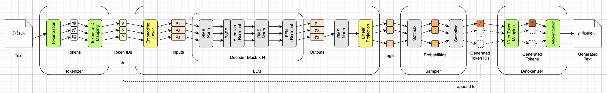
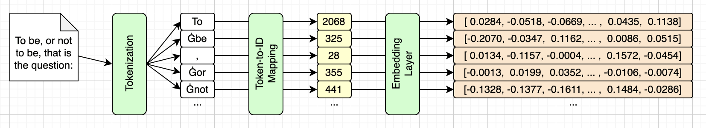
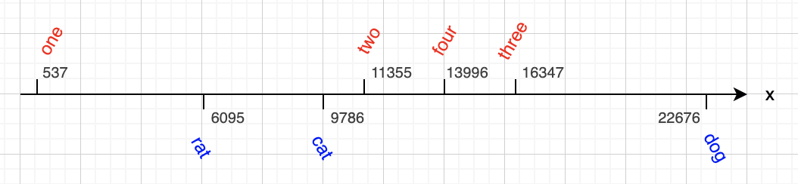
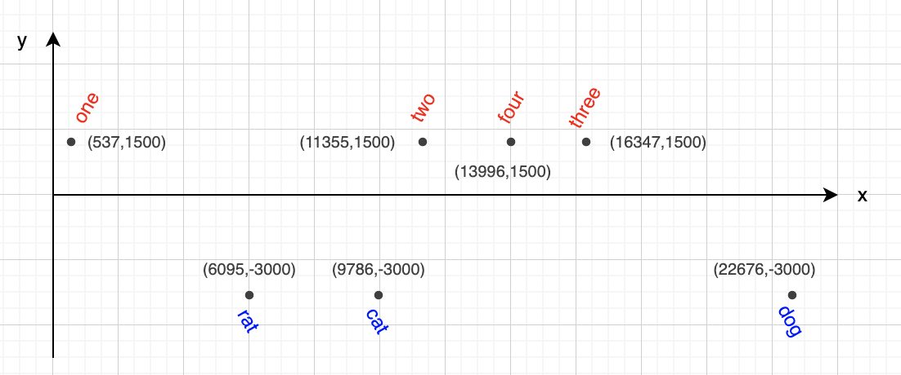
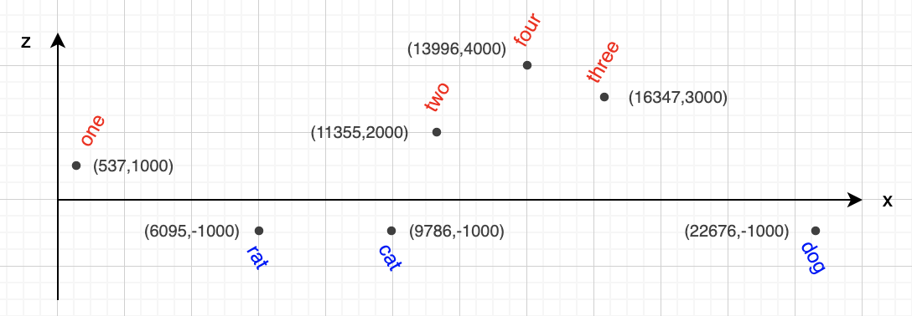
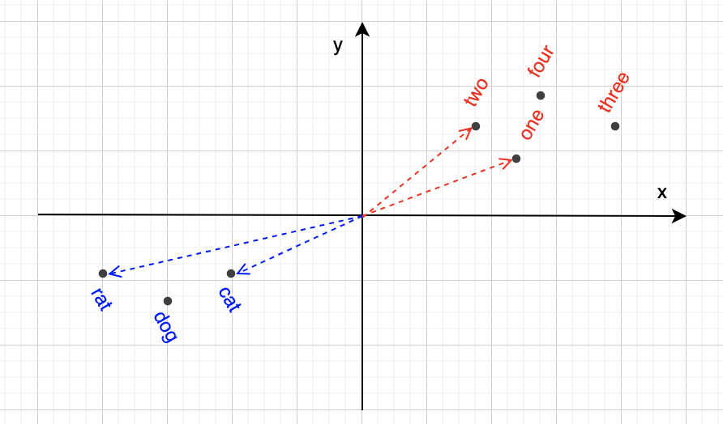
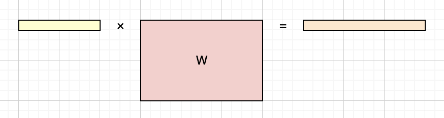

# 词嵌入（Embedding）


在第二章，我们了解了HF模型相关的文件，其中最大的两个文件是`model.safetensors`和`tokenizer.json`。前者装着模型全部的权重参数，我们已经在第二章详细讨论过它的内容。后者装着模型的词表、合并规则和一些配置信息，我们也已经在第三章详细讨论过它的内容。

在第三章，我们介绍了分词和词元的概念，重点讨论了SmolLM2使用的BPE分词法。我们还写了一个假的LLM推理引擎，它只是把最外面两端的Tokenizer和Detokenizer模块给实现了，如下图绿色模块所示：



按照路线图的计划，我们该实现词嵌入层和线性投影了。这两个小模块正好位于LLM的两头，如上图黄色模块所示。

这一章我们先介绍词嵌入的基本概念，说说为啥需要词嵌入，再看看怎么衡量两个词嵌入向量有多接近。然后我们正式认识词嵌入矩阵，以及位于LLM出口处的线性投影，并回答这两个模块为什么可以共用同一个矩阵。最后我们写代码，把它们都实现出来。

提前打声招呼，这一章会用到一点线性代数：向量、向量点积和矩阵乘法。如果读起来有点吃力，也没关系，这些就是第一章说的那点基础，简单翻一翻就够了。


## 什么是词嵌入

这一小节先正式看一下什么是词嵌入，下一小节再说为什么需要词嵌入，以及它为什么要叫这个古怪的名字。我们从前一章介绍过的分词和词元说起。我们知道，一段文字，在进入LLM之前，会先被切分为一个个词元，然后词元再查词表，变成一个个ID。进入LLM之后，第一道工序就是把这些ID转换成一个个向量，也就是所谓的**词嵌入**（Embedding）。这个过程如下图所示：



上图最右边每一个橙色长矩形都代表一个词嵌入。注意，和本书大多数插图不同，上面这幅图用的是真实数据。词元是真的，ID和词嵌入向量里的数字也是真的。在SmolLM2里，词嵌入向量的维度是576。这一点可以从`model.safetensors`文件里的JSON元数据得到确认，里面有多个权重矩阵形状都包含576。例如，词嵌入矩阵的形状是`[49152, 576]`（后文会详细介绍这个矩阵），如下（片段）所示：

```json
  "model.embed_tokens.weight": {
    "dtype": "BF16", "shape": [49152, 576], "data_offsets": [0, 56623104]
  },
```

也可以从`config.json`配置文件里的`hidden_size`字段得到确认。这里`hidden`表示隐藏向量，它的维度和词嵌入维度是一样的，我们会在后面的章节里详细介绍。相关字段如下（片段）所示：

```json
{
  /* 其他字段 */
  "hidden_size": 576,
  "tie_word_embeddings": true,
  /* 其他字段 */
}
```

这里我顺便把`tie_word_embeddings`字段也一起贴出来了，等会我会介绍这个字段的含义。


## 为什么需要词嵌入

那为什么需要词嵌入呢？就用ID进行计算不行吗？肯定也是可以的，但是效果不好，因为单个整数能表示的信息量太少了。为了说明这个问题，我准备了一个具体的例子。用第三章的脚本`tokenize_demo.py`，你自己也可以跑一下，下面是输出：

```
原文    '~one,two,three,four;cat,dog,rat'
词元    ['~', 'one', ',', 'two', ',', 'three', ',', 'four', ';', 'cat', ',', 'dog', ',', 'rat']
ID      [110, 537, 28, 11355, 28, 16347, 28, 13996, 43, 9786, 28, 22676, 28, 6095]
共 31 个字符，14 个词元
```

可以看到，“一二三四”这四个单词对应的词元ID分别是`537`、`11355`、`16347`和`13996`，而“猫狗鼠”这三个单词对应的词元ID分别是`9786`、`22676`和`6095`，看起来好像没什么规律。例如这四个数字词元ID既没有挨着，间距也不一致，甚至都不是按顺序排列的（四在三前面）。我们把这七个词元ID按比例画在一维数轴上，看起来是下面这样：



如果我们用向量来表示词元，那么就可以携带更多信息。比如，我们可以用第二个维度来表示词元的类别：用`1500`表示数字，用`-3000`表示动物。现在，我们把七个词元都变成了二维向量，例如`cat`对应`(9786,-3000)`。我们把这些词元向量画在平面直角坐标系上，不过为了好看，我把箭头省略了，只保留了点，如下图所示：



这下我们和LLM一眼就可以看出数字和动物的差别了。我们还可以再增加一个维度，用来表示顺序关系。例如，“一二三四”这四个词元的顺序分别是`1000`、`2000`、`3000`和`4000`。“猫狗鼠”这三个词元没啥顺序关系，所以我们统一用`-1000`来表示。这样，七个词元都变成了三维向量，例如`two`对应`(11355,1500,2000)`。

三维直角坐标系不太好画图，所以我们把这些向量投影到平面直角坐标系上，把中间维度省略。这样，数字词元的顺序就一目了然了，如下图所示：



我们还可以添加更多的维度，例如第四个维度表示（人或者动物的）性别，第五个维度表示情绪，等等。如果把时间也算成一个维度，人类勉强可以理解四维时空，但是更高维度就很难想象了。但是对LLM来说，完全不是问题，所以维度可以轻松达到576，或者更高。例如最近发布的DeepSeek-V4.1-Flash模型，其词嵌入维度高达5120。

在机器学习里，我们把类似上面假想的顺序呀、性别呀、情绪呀等维度上的数值，叫做**特征**（Feature）。相应的，词嵌入向量也叫做**特征向量**（Feature Vector）。只不过在LLM里，这些维度和特征，并不是人为安排的，而是在训练阶段学习出来的。

最后说说“嵌入”这个古怪的名字是怎么来的。“嵌入”（Embedding）本是数学上的说法，指的是把一个东西整体放进另一个更大的空间里去。这里被放进去的，是整张词表；那个更大的空间，就是前面说的576维空间。词元原本是一个个孤零零的符号，两个词元之间只有“相同”和“不同”，谈不上谁离谁更近。嵌进这个空间之后，每个词元成了一个点，点和点之间就有了距离和方向。所以说，嵌入换来的，正是词元之间原本没有的“远近”。


## 向量相似度

前面我们把词元ID也当成了一个特征，这只是为了方便说明。实际的词嵌入是不包含词元ID的，两者之间只有一一对应的映射关系，这个我们下一小节再说。

为了更好地说明词元之间的相似关系，我调整了一下前面的例子，把词元ID和其他维度的数值都换成了我刻意造的。注意，这里只是为了介绍向量相似度，所以具体数值并不重要。我们把这七个词嵌入向量重新投影到平面直角坐标系上，另外还多画了四个箭头，用来表示向量夹角，如下图所示：



那么，我们到底为什么说，数字词元相互比较接近，动物词元也相互比较接近呢？在数学上，这种接近程度可以用向量的**相似度**（Similarity）来衡量。这也是我们用向量来表示词元的另外一个好处。

数学上有许多衡量向量相似度的办法，其中最简单也最广泛使用的，就是**余弦相似度**（Cosine Similarity）。我们用粗体小写字母 $\mathbf{a}$ 和 $\mathbf{b}$ 来表示两个向量，用 $\theta$ 来表示向量的夹角，用 $\|\mathbf{v}\|$ 来表示某向量的模长（也就是这个向量的长度），那么余弦相似度的公式可以写成下面这样：

$$
\mathrm{cos\_sim}(\mathbf{a},\mathbf{b})
= \cos\theta
= \frac{\mathbf{a}\cdot\mathbf{b}}{\|\mathbf{a}\| \|\mathbf{b}\|}
$$

可以看到，余弦相似度只和向量的夹角有关。在上面的图里，数字词嵌入之间的夹角，以及动物词嵌入之间的夹角，都比较小，所以我们说数字词元相互比较接近，动物词元相互比较接近。但是数字词嵌入和动物词嵌入的夹角比较大，所以我们说数字词元和动物词元不太接近。

如果每次计算相似度时，还得算向量模长，那还是有点麻烦的。如果向量的模长恰好都是1，那这个问题就不存在了。此时余弦相似度函数就可以直接简化成向量点积公式：

$$
\mathrm{cos\_sim}(\mathbf{a},\mathbf{b})
= \mathbf{a}\cdot\mathbf{b}
$$

为了达到这个目的，我们可以在计算之前，先让词嵌入向量的模长全部等于1，这个过程叫做**归一化**（Normalization）。不过真实模型里的归一化并不完全是这么做的，关于这一点，我们在下一章会详细介绍。

换一个角度，两个向量的点积同时受两件事影响：**向量模长**和**方向夹角**。我们只要调整一下前面的余弦相似度公式，就可以通过向量的模长和夹角来计算点积，下面是公式：

$$
\mathbf{a}\cdot\mathbf{b} = \|\mathbf{a}\| \|\mathbf{b}\| \cos\theta
$$

上面这个公式，这里先不展开，后面再说。


## 词嵌入矩阵

前面的章节中，我们已经多次提到过词嵌入矩阵了，这一小节我们正式认识一下它。先简单回顾一下，在`model.safetensors`文件里，这个权重矩阵的形状是 $[49152 \times 576]$ ，这一点我们在第二章中详细介绍过。那为啥是这个形状呢？其实已经没啥悬念了吧？

词嵌入矩阵一共49152行，正好对应SmolLM2模型的词表大小；一共576列，正好就是词嵌入向量的维度。

换句话说，词元和词嵌入一一对应。而且词嵌入就是按照词元ID的顺序排列的。也就是说，词嵌入矩阵就是一个查找表，给定一个词元ID，直接去查表就能找到对应的词嵌入向量。比如词元`cat`的ID是9786，那直接去取词嵌入矩阵的第9786行，就能得到向量。

这一章的随书源代码里有一个`vocab_head.py`脚本，可以打印出词表开头的若干个词元，以及它们在矩阵里的那一行。下面是开头十个，它们正好都是第三章介绍过的特殊词元：

| ID   | 词元              | 词嵌入向量（576维，只显示头3尾2）                     | 模长  |
| ---- | ----------------- | ----------------------------------------------------- | ----- |
| 0    | `<\|endoftext\|>` | `[-0.1177,  0.0278,  0.0481, ... , -0.2520,  0.0283]` | 2.979 |
| 1    | `<\|im_start\|>`  | `[-0.0203, -0.0311, -0.0327, ... , -0.0132, -0.1367]` | 3.306 |
| 2    | `<\|im_end\|>`    | `[-0.0212, -0.0337, -0.0278, ... , -0.0122, -0.1367]` | 3.307 |
| 3    | `<repo_name>`     | `[-0.1191, -0.0854, -0.1240, ... , -0.0698, -0.0977]` | 3.721 |
| 4    | `<reponame>`      | `[-0.1147, -0.0840, -0.0962, ... , -0.0762, -0.1099]` | 3.530 |
| 5    | `<file_sep>`      | `[-0.0179, -0.0369, -0.0299, ... , -0.0125, -0.1377]` | 3.308 |
| 6    | `<filename>`      | `[ 0.1138, -0.1118, -0.0172, ... ,  0.0605, -0.1406]` | 6.745 |
| 7    | `<gh_stars>`      | `[-0.0179, -0.0369, -0.0300, ... , -0.0125, -0.1377]` | 3.308 |
| 8    | `<issue_start>`   | `[-0.0179, -0.0369, -0.0300, ... , -0.0125, -0.1377]` | 3.308 |
| 9    | `<issue_comment>` | `[-0.0179, -0.0369, -0.0299, ... , -0.0125, -0.1377]` | 3.308 |

顺便说一下，词嵌入的模长并不是1。那么词嵌入矩阵是怎么来的呢？是训练出来的。开始的时候，都是随机初始化的，模长大致是1，然后在训练中不断调整。这里我们就不展开讨论了，如果有机会的话，我可能会写一本《自己动手训练LLM》，到时候再仔细介绍。


## 线性投影

我们先把前面路线图里的LLM模块放大，仔细看看它两端的小模块。这张图也不是新画的，我们在第一章见过它，如下所示：


入口处的词嵌入层前一小节其实已经讲清楚了：这里不需要任何计算，只要根据词元ID，查词嵌入矩阵就可以。换句话说，就是一个简单的查表操作。

一系列词元ID，经过查表，得到一系列词嵌入向量，也就是上图的输入列表。这些输入向量，经过LLM的层层处理，就得到输出列表。我们只需要最后一个输出向量，对它进行一个归一化处理，这个我们下一章再说。注意输出和输入的维度是一样的，也就是576。

在LLM的出口处，我们得到的是一堆分数（Logits）。一共多少个分数呢？49152个。没错，词表大小是多少，就有多少个分数。因为我们实际上是给每一个词元打分，分数越高，意味着下一个词元是它的可能性也越高。注意这里分数还不是概率，这个我们在第十章还会详细讨论。

也就是说，我们需要把一个576维的向量，变成一个49152维的向量。这个正好就是矩阵乘法要干的事情，叫做**线性变换**（Linear Transformation），或者**线性投影**（Linear Projection）。而我们需要的，是一个 $[576 \times 49152]$ 形状的矩阵。

其实线性变换的公式特别简单。我们假设最后一个输出向量是 $\mathbf{x}$ ，线性变换矩阵是 $W$ ，分数向量是 $\mathbf{l}$ 。那么这个线性变换可以用下面的矩阵乘法等式给出：

$$
\mathbf{l} = \mathbf{x} \times W
$$

我们把输入的向量看作一个 $[1 \times 576]$ 的矩阵，正好可以跟线性变换矩阵相乘，结果是一个 $[1 \times 49152]$ 的矩阵，也就是分数向量。我们用下面这个示意图来表示这个矩阵乘法：



注意，由于SmolLM2模型的词嵌入向量维度和词表大小都非常大，上面的图并没有按真实比例去画，你大致理解计算过程即可。


## 权重共享

看到这里，你有没有发现一个有趣的点。处于LLM入口处的词嵌入矩阵，形状是 $[49152 \times 576]$ ；处于出口处的线性投影矩阵，形状是 $[576 \times 49152]$ 。那么这两个矩阵能合二为一吗？其实答案我们已经知道了，可以，这个就是所谓的**权重共享**（Weight Tying），我们在第二章也提到过。

所以，真正的问题是，为什么这两个矩阵可以共享，以及为什么要共享。

第二个问题，为什么要共享，其实是相对好理解的：省参数。当模型比较小的时候，词嵌入矩阵在整个模型里的占比是很大的。第二章我们算过这笔账，SmolLM2的词嵌入矩阵有28,311,552个参数，占了全模型的21%。如果出口再单独存一份同样大小的矩阵，模型就要凭空大出两成，而对这么小的模型来说，这笔参数实在太贵了。

那模型大了为什么就不共享了呢？因为省下来的那部分变小了。同一种语言的词表大小基本是固定的，SmolLM2三个尺寸用的都是这49152个词元；而词嵌入的维度会随着模型变大而变大。分母涨得比分子快，词嵌入矩阵在模型里的占比就会一路降下来。还是这张表，搬进SmolLM2-1.7B（词嵌入维度2048），就是100,663,296个参数，听着不少，可那个模型一共有十七亿个参数，占比从21%掉到了5.9%。

另一方面，共享也不是白拿的。入口和出口被绑在同一张表上，模型就少了一份自由度，它没法让“读词”和“写词”用两套不同的表示。小模型能省下两成参数，这个代价值得付；大模型只能省下百分之几，那就未必了。所以第一章说过，参数量较小的模型大多会共享，而不少大模型就不再共享了。Qwen2.5这一家正好能看出分界：0.5B和1.5B都共享，到了7B就各存一份；Mistral-7B和OLMo-2-7B也都是各存一份。

第一个问题，那为啥可以共享呢？关键在于，出口那个矩阵乘法到底在算什么。

我们把前面那个线性变换按列拆开看。在 $\mathbf{l} = \mathbf{x} \times W$ 里，分数向量 $\mathbf{l}$ 的第 $j$ 个分量，正好等于 $\mathbf{x}$ 和 $W$ 的第 $j$ 列做点积。也就是说，出口是拿着手里这个576维的向量，和49152个向量挨个算了一遍点积，谁的点积大，谁的分数就高。

而点积意味着什么，前面“向量相似度”那一小节已经说过了：方向越一致、模长越大，点积就越大。所以出口干的事情，说白了就是拿着手里这个向量，到词表里去找最像的那个词元。

既然要找最像的，那总得先知道每个词元长什么样。而每个词元长什么样，正是入口那张表里存着的东西。入口问的是“这个词元的向量是什么”，出口问的是“哪个词元的向量和它最像”，两边打交道的是同一套表示，那当然可以用同一张表。

形状上也正好对得上。词嵌入矩阵是 $[49152 \times 576]$ ，一行一个词元；线性投影矩阵是 $[576 \times 49152]$ ，一列一个词元。两者互为转置，同一份数据，一个按行读，一个按列读，根本不用存两份。

这也就是第二章留下的那个谜底了：`model.safetensors`里的272个张量，怎么找也找不到线性投影的矩阵。因为它压根就没存，`config.json`里的`tie_word_embeddings`是`true`，出口直接把词嵌入矩阵转过来用了。


## 代码实现

理论介绍完了，接下来我们看代码实现。在前一章，我们写了一个假的引擎。这一章开始，我们要一点一点实现真家伙了。我们先定义一个`Model`类，把目前的两个小模块写进去。注意，这个`Model`类依赖第二章写好的`Weights`类：加载权重的活交给`Weights`，`Model`自己只负责计算。下面是核心代码：

```python
from weights import MODEL_DIR, Weights

class Model:
    def __init__(self, model_dir=MODEL_DIR):
        self.weights = Weights(model_dir)

    # 入口：词元ID换成词嵌入，(T,) → (T, 576)
    def to_embeddings(self, ids):
        return self.weights.embed_tokens[ids]

    # 出口：词嵌入换成分数，(..., 576) → (..., 49152)
    def to_logits(self, x):
        return x @ self.weights.embed_tokens.T

    # 整个引擎，目前就这两步：(T,) → (49152,)
    def forward(self, ids):
        embeddings = self.to_embeddings(ids)
        return self.to_logits(embeddings[-1])
```

这个类，其实目前就两个核心方法，都特别简单。第一个方法`to_embeddings()`把一系列ID查表，变成词嵌入向量的列表，也就是一个矩阵。第二个方法`to_logits()`把一个输出向量通过线性变换，变成分数向量。

对于不熟悉PyTorch的读者，第二个方法可能需要稍微解释一下。这里的`@`是Python的矩阵乘法运算符，PyTorch的张量实现了它。`.T`表示矩阵转置，前面说过，出口用的就是词嵌入矩阵转过来的那一份。

另外还有一个`forward()`方法，只不过是把前两个组合起来。中间本该有30个Decoder块，现在一个都没有，所以这是个零层的LLM。只投影最后一个位置，是因为要预测的下一个词元只看它。其他的细节我们在后续章节会补上。

有了`Model`类，我们就可以写`Engine`类了。下面是核心代码：

```python
from tokenizers import Tokenizer
from model import Model
from weights import MODEL_DIR

ROUNDS = 10  # 转多少圈，也就是生成多少个词元

class Engine:
    def __init__(self, model_dir=MODEL_DIR):
        self.model = Model(model_dir)
        self.tok = Tokenizer.from_file(str(model_dir / "tokenizer.json"))

    # 一串词元ID进去，一串更长的ID出来。
    def generate(self, ids):
        ids = list(ids)  # 复制一份，不去改调用方手里那个list
        for _ in range(ROUNDS):
            ids.append(self.infer(ids))
        return ids

    # 转一圈：一串词元ID进去，下一个词元ID出来。
    def infer(self, ids):
        logits = self.model.forward(ids)  # (T,) → (49152,)
        return int(logits.argmax())
```

这里的`argmax()`要说一句。它返回的不是最大值本身，而是最大值所在的**下标**。由于`logits`是一个49152维的向量，第 $j$ 个分数对应的正好是ID为 $j$ 的那个词元，所以取最高分的下标，拿到的直接就是下一个词元的ID，不用再查一次表。顺带一提，每次都取最高分其实也是一种采样，叫做贪婪采样，我们在第十章再详细介绍。

我们跑一下看看。这一章的随书源代码里有一个`engine.py`脚本，输入“Once upon a time”，转十圈，得到的是“Once upon a time time time time time time time time time time time”。把这14个词元连同它们的词嵌入列成表格，是下面这样：

| 序号 | 来源 | ID   | 词元      | 词嵌入（576维，只显示头3尾2）                                     |
|----|----|------|---------|-------------------------------------------------------|
| 0  | 输入 | 6403 | `Once`  | `[ 0.1157,  0.0342,  0.1113, ... ,  0.0178, -0.0381]` |
| 1  | 输入 | 1980 | `Ġupon` | `[-0.0374, -0.0278, -0.0189, ... , -0.0405, -0.0684]` |
| 2  | 输入 | 253  | `Ġa`    | `[-0.1206, -0.0140,  0.0066, ... ,  0.0273,  0.0258]` |
| 3  | 输入 | 655  | `Ġtime` | `[-0.2109, -0.0928,  0.1602, ... ,  0.0442,  0.0337]` |
| 4  | 生成 | 655  | `Ġtime` | `[-0.2109, -0.0928,  0.1602, ... ,  0.0442,  0.0337]` |
| 5  | 生成 | 655  | `Ġtime` | `[-0.2109, -0.0928,  0.1602, ... ,  0.0442,  0.0337]` |
| 6  | 生成 | 655  | `Ġtime` | `[-0.2109, -0.0928,  0.1602, ... ,  0.0442,  0.0337]` |
| 7  | 生成 | 655  | `Ġtime` | `[-0.2109, -0.0928,  0.1602, ... ,  0.0442,  0.0337]` |
| 8  | 生成 | 655  | `Ġtime` | `[-0.2109, -0.0928,  0.1602, ... ,  0.0442,  0.0337]` |
| 9  | 生成 | 655  | `Ġtime` | `[-0.2109, -0.0928,  0.1602, ... ,  0.0442,  0.0337]` |
| 10 | 生成 | 655  | `Ġtime` | `[-0.2109, -0.0928,  0.1602, ... ,  0.0442,  0.0337]` |
| 11 | 生成 | 655  | `Ġtime` | `[-0.2109, -0.0928,  0.1602, ... ,  0.0442,  0.0337]` |
| 12 | 生成 | 655  | `Ġtime` | `[-0.2109, -0.0928,  0.1602, ... ,  0.0442,  0.0337]` |
| 13 | 生成 | 655  | `Ġtime` | `[-0.2109, -0.0928,  0.1602, ... ,  0.0442,  0.0337]` |

这个输出，比前一章随机胡言乱语强了一些，但也强不到哪去，看起来它就是不断重复最后一个词元。

为什么会这样呢？因为中间那30层还不存在，所以送进出口的那个向量，就是词表里`Ġtime`那一行本身，一层都没被加工过。而前面说了，出口问的是“词表里哪一行和这个向量最像”。拿`Ġtime`自己去问，答案当然是它自己：自己和自己的点积就是模长的平方，8.378；而排第二的`time`只有5.491，差了将近三分。挑中之后追加到序列末尾，`forward()`又只看最后一行，下一圈的状态和这一圈一模一样，于是就这么一直循环下去了。

这里还有两件事值得说明一下。

第一，前面的`Once`、`Ġupon`、`Ġa`一个都没参与。没有任何东西能把它们混进最后那个向量里，而“把别的位置混进来”正是注意力机制要干的活，那是第六章的事。所以现在这个引擎连上下文这个概念都还没有，更别说词序了。

第二，不是每个词元都会复读自己。`Ġtime`能守住自己，是因为没人比它更像它；换个词元就未必了。比如`Hello`，它和自己的点积是6.757，和`<filename>`的点积最高，为7.748。所以喂`Hello`进去，出来的下一个词元是`<filename>`，然后一直重复。把`Hello`喂给`engine.py`，读者可以自己跑一下看看。

关于第二点，看一眼前面那张表就明白了：`<filename>`的模长有6.745，而`Hello`只有2.599。这正是“向量相似度”那一小节留下的尾巴，点积同时受夹角和模长影响，模长大的那一行总是占便宜。而管模长这件事的，正是下一章要讲的归一化。


## 本章小结

这一章做了三件事。

第一，弄清了词嵌入是什么，以及为什么需要它。一个整数只能说出“是哪个词元”，而一个576维的向量还能带上各种特征，词元之间才有了远近可言。“嵌入”这个名字说的就是这件事：把整张词表放进一个576维的空间，词元变成这个高维空间里的点，点和点之间就有了距离和方向。顺着这个思路，我们还认识了余弦相似度，以及它背后的点积、夹角和模长。

第二，认识了词嵌入矩阵，并且发现模型的头和尾用的是同一个矩阵。入口拿词元ID去取一行，出口拿一个向量去和每一行做点积，问的是“词表里哪个词元和它最像”。两边打交道的是同一套表示，形状上又正好互为转置，所以一份数据读两遍就够了，这就是权重共享。第二章留下的那个疑问，272个张量里怎么也找不到线性投影的矩阵，答案就在这里。

第三，写了`Model`和`Engine`两个类，把这两个方向接了起来。引擎的两头现在都是真算的了，只有中间那30个Decoder块还空着。

当然，输出还是很难看。给它“Once upon a time”，它会一直重复`Ġtime`。原因我们也看清了：最后那个向量没被任何一层加工过，拿自己去问“谁和我最像”，答案当然还是自己。而换一个模长小的词元，比如`Hello`，就会被模长大的`<filename>`抢走。点积同时受夹角和模长影响，这个尾巴留给了下一章。

下一章我们讲归一化，它管的正是模长这件事。
