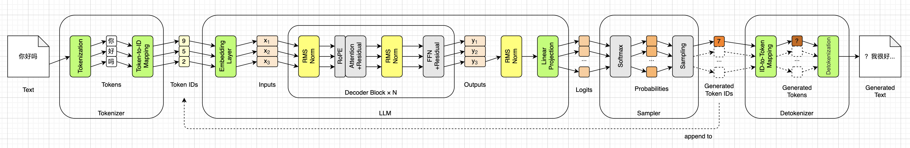
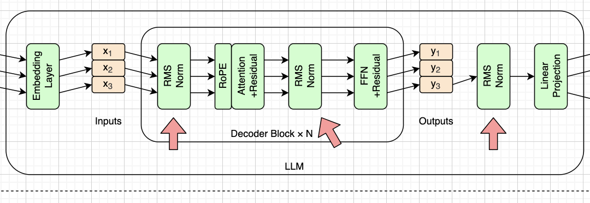
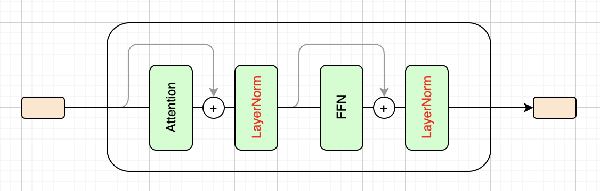
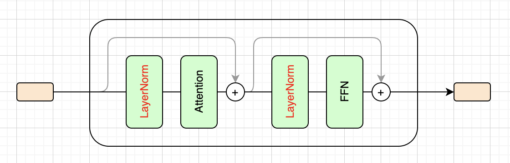
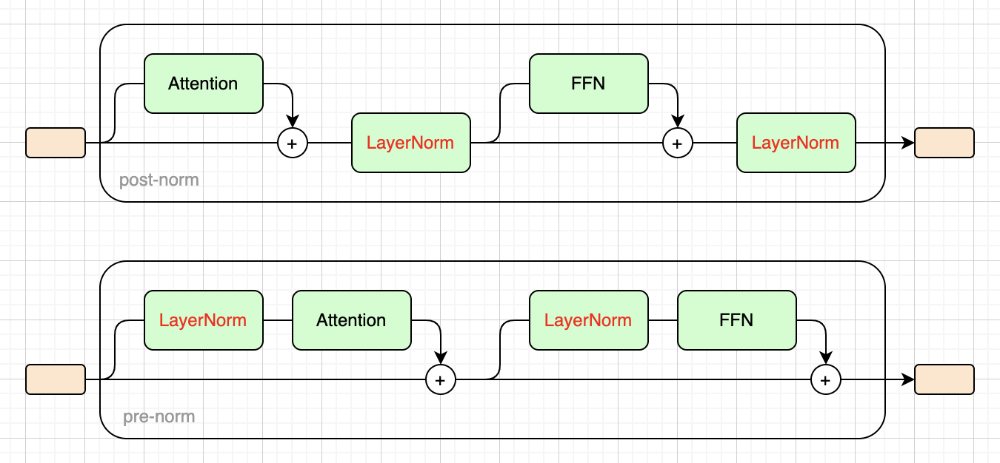

# 归一化（Normalization）


回顾一下到目前为止我们做的事情。在第一章，我们定好了手写LLM推理引擎的路线图。在第二章，我们了解了HF模型相关的文件，并重点分析了`model.safetensors`权重文件。在第三章，我们学习了词元和分词的概念，并重点讨论了比较流行的BPE分词算法，以及与分词相关的`tokenizer.json`文件。在第四章，我们学习了词嵌入和线性投影。

我们已经实现了六个小模块，并且写了一个只能胡言乱语，或者不停重复最后一个词的LLM推理引擎。我已经在路线图里把这六个模块涂成了绿色，如下所示：



按照从左到右的顺序，也就是数据流动的方向，我们该实现归一化模块了。在采用Transformer架构的LLM里，有多处用到了归一化，我已经涂成了黄色，如上图所示。以SmolLM2为例，一共是30层，每层两个，再加上出口处的一个，所以实际上一共有61个归一化模块。最初的Transformer用的是LayerNorm，而SmolLM2等现代LLM大多采用它的简化版RMSNorm，所以我直接把RMSNorm写进了路线图里。

为了把SmolLM2跑起来，实际上只知道RMSNorm就可以了。但是，知其然也知其所以然，肯定是更好的。所以这一章我们还是会先讨论最基本的概念：什么是归一化，以及为什么需要归一化。接着讨论归一化的位置，这是因为Transformer架构在2017年提出之后，这个位置发生过一次变化。然后，我们看LayerNorm的具体公式，再看这一章的核心，也就是RMSNorm的计算公式。最后我们会用代码实现RMSNorm，让前一章的推理引擎离真正可以工作更近一步。


## 什么是归一化

上一章末尾，我们留了一个尾巴：向量点积同时受**夹角**和**模长**影响，模长大的词元总是占便宜，`Hello`就是这么被`<filename>`抢走的。当时我们还说过，如果向量的模长都是1，余弦相似度就可以直接简化成点积，而把模长统一成1的这个过程，就叫做归一化。这一章我们就从这里接着说。

其实“归一化”这个词，意思比上一章说的要宽。凡是把一堆数值拉到同一个尺度上，让它们可以放在一起比较，都可以叫做**归一化**（Normalization，简称**Norm**）。上一章说的“把模长变成1”是一种；考试成绩折算成百分制也是一种；统计学里最常用的一种，是先减去平均值，再除以标准差，让这堆数的平均值变成0，标准差变成1。

深度学习里说的归一化，基本上就是最后这一种，具体公式我们放到后面的小节再给。从这个意义上说，把Normalization翻译成“标准化”或者“规范化”，也许更贴切一些。不过业界早已约定俗成，叫它归一化，本书也沿用这个叫法。

问题在于，神经网络里的数值那么多，到底拿“哪一堆数”来算平均值和标准差呢？几种常见的归一化方法，区别主要就在这里。

最早流行起来的，是2015年Google的Ioffe和Szegedy提出的**批归一化**（Batch Normalization，简称**BatchNorm**）。它最早用在卷积网络上，统计的方向是“跨样本”：训练时一次喂进去一批图片，对于某一个特征，把这一批图片在这个特征上的数值收集起来，算平均值和标准差，再拿它们去归一化每一张图片的这个特征。换句话说，统计量是一批样本共享的，单独一个样本自己算不出来。

一年之后，Ba、Kiros和Hinton三人提出了**层归一化**（Layer Normalization，简称**LayerNorm**）。它把统计的方向转了九十度：不跨样本，而是在同一个样本内部，把这一层的全部特征收集起来算平均值和标准差。换到SmolLM2的语境里，就是对每一个词元，拿它自己那576个数算统计量，和别的词元无关，和一批里有几个序列更无关。

那为什么Transformer，以及后来的LLM，选的都是LayerNorm这个方向呢？这要从文本和图片的差别说起。一批图片尺寸一样，同一个特征在每张图上都有，跨样本统计是说得通的。但文本不一样：一批序列长短不齐，第一个序列的第8个词元和第二个序列的第8个词元之间，没有任何可比性。更何况推理的时候我们一次只喂一个序列，一批只有一个样本，跨样本的统计量根本无从算起。

BatchNorm的办法是把训练时的统计量存下来，推理时直接用，但这样一来，又多出一套要保存的数据。而LayerNorm逐词元独立，词元自己的576个数永远在手边，不管序列多长、一批几个，算法都一样。对推理引擎来说，这一点尤其友好：我们接下来写的归一化代码，拿一个`(T, 576)`的矩阵进来，对每一行各算各的，出去还是`(T, 576)`。

至于SmolLM2用的RMSNorm，它是LayerNorm的简化版，统计的方向和LayerNorm完全一样，只是公式上少了几步。所以说到底，LLM里的归一化都是层归一化这一路的，区别只在计算细节，这个我们留到本章后半部分再细说。


## 为什么需要归一化

先把话说在前面：这个问题的完整答案在**训练**里。BatchNorm那篇论文给的解释叫“内部协变量偏移”，后来又有人用实验反驳，说真正起作用的是别的东西。到今天为止，大家都同意它有效，但为什么有效，还没有一个公认的说法。由于本书的重点是**推理**而非训练，所以我们不深入探讨这个细节，只说两个结论。这两个结论都是推理时能亲眼看到的。

**第一个结论：数值会漂。**

我们在第一章的总览图上看到过，Decoder块是一层摞一层的，每一层都往向量上加东西（怎么加的，第九章讲残差连接时再说）。只加不减，层数一多，数值自然就越滚越大。而且漂得并不均匀：有的维度特别大，有的特别小，一层层叠下去，差距会被越拉越开。

这件事不用等到训练才看得见。我们自己的引擎还只有骨架，所以我借第一章用过的`transformers`库，把真模型跑了一下“Once upon a time”，盯着最后一个词元的向量，每过几层量一次模长。这一章的随书源代码里有一个`drift.py`脚本，干的就是这件事，你也可以自己跑一下。词嵌入刚查出来的时候，模长是2.894，也就是上一章那个数。过完第1层，就变成了37.1；过完第10层是144.4；过完第30层是635.0，比进来的时候大了两百多倍。而且这635里，光第17维一个数就是449.4，它一个人就占了模长平方的一半。注意，这是一个完整的真模型，61个归一化一个都不少。数值照样一路往上涨，是因为这些归一化都不在这条“往上加东西”的主线上，后面讲归一化的位置时就会看到。

如果就这么放任不管，第25层的注意力和FFN看到的输入，会比第1层看到的大上百倍。而权重矩阵是固定的，同一个矩阵，面对大一百倍的输入，算出来的东西也会跟着大一百倍。归一化干的，就是在每个子层的入口处，把这个漂掉的尺度重新拉回来，让第1层和第30层的注意力和FFN，看到的都是同一个尺度的输入。至于它拉到多大、怎么拉，是后面小节的事。

**第二个结论：出口要靠它收尾。**

这和上一章末尾那件事有关。我们说过，出口的线性投影是拿手里的向量和词表里49152行挨个算点积，而点积同时受夹角和模长影响。要是直接把一个模长635的向量送到出口，每一个分数都会跟着放大，比过了归一化之后大十几倍，最高分会把其他候选甩得极远，到第十章换算成概率的时候，几乎就只剩一个候选了。所以30层走完，出口的线性投影之前，还要再过一个归一化。还是刚才那次实验，635.0过完出口的归一化之后，模长回到了40.7。这个数不是巧合：RMSNorm会先把均方根拉到1，再乘上一组训练好的权重，所以出来多大，主要由那组权重决定，和进来的向量有多大没有关系。

说到这里，可以回头看看上一章那个尾巴了。归一化管的是我们手里这个向量的模长，让它不随层数漂；词表那边每一行的模长，是训练时定下来的，归一化管不着。所以上一章`Hello`被`<filename>`抢走的事，光靠归一化是解决不了的，要等中间那30层真正干起活来才见分晓。

前面的内容如果没看懂，也没关系，只要记住一点：SmolLM2的权重是在有归一化的情况下训练出来的。我们写的是推理引擎，权重是别人训练好的，训练时每一层都做了归一化，我们推理时就必须原样照做，少一个、位置放错一个，数字就对不上，输出就是胡话。所以对这本书来说，“为什么需要归一化”其实不是一个选择题。真正要搞清楚的是：它放在哪，以及它具体怎么算。下面几节就说这两件事。


## 在什么位置归一化

第一章介绍归一化的时候提过一句：传统Transformer架构里，层归一化放在注意力机制和FFN的后面，后来的架构把它前移了，于是有了post-norm和pre-norm之分。这一节就把这件事说清楚。我们先把第一章那张图再贴一次，图上三个红色箭头指的就是SmolLM2里归一化的位置：



要说清“前”和“后”，得先说清楚相对于什么。在上面的图里，注意力机制和FFN这两个框里都写着“+Residual”，这就是第九章要仔细讲的**残差连接**（Residual Connection）。这里先只说它最基本的样子：一个子层（注意力机制或者FFN）算完之后，并不是直接把结果往下传，而是把结果**加回到它自己的输入上**，再往下传。我们把子层记作 $f$ ，输入记作 $\mathbf{x}$ ，那么一个子层走完，往下传的是 $\mathbf{x} + f(\mathbf{x})$ ，而不是 $f(\mathbf{x})$ 。

打个比方，数据有两条路可以走。一条是**主干**，什么都不干，原样往下传；另一条是**旁路**，拐进子层里算一圈，再汇回主干。两条路在出口处相加。所谓归一化的位置，问的就是：这个归一化，是放在主干上，还是放在旁路里？

有一点需要解释一下：这里说的位置，指的是Decoder块内部的那两个归一化。线性投影前面那一个，不管哪种放法，都紧挨着线性投影，谈不上前后之分。区别只在于它是不是单独多出来的一个，这个我们放到这一节最后再说。


### post-norm：2017年的做法

在2017年，《Attention Is All You Need》给出的写法，是先相加，再归一化。我们可以用公式表示成：

$$
\mathbf{y} = \mathrm{Norm}(\mathbf{x} + f(\mathbf{x}))
$$

归一化在相加**之后**，作用在主干上。也就是说，每过一个子层，整条主干都要被重新缩放一次。因为归一化落在子层后面，这种放法叫做**post-norm**。值得一提的是，这篇论文只规定了归一化放在哪，并没有发明层归一化。层归一化是前一年Ba等人那篇论文的东西，Transformer只是拿来用了。

为了便于观察，我把一个Decoder块内部的注意力和FFN，以及两个归一化都画出来了。post-norm如下图所示：



在上图里，灰色箭头和加号表示残差连接，我们到第九章再展开讨论。但对照前面那个比方，灰色箭头其实才是主干，它绕开子层，原样往下传；穿过注意力机制和FFN的那条黑线才是旁路。这里我们只关注归一化和加号谁先谁后即可，后面还会有一幅主干和旁路更分明的图。


### pre-norm：现在的做法

后来的做法，是先归一化，再送进子层，相加这一步不碰归一化。我们可以用公式表示成：

$$
\mathbf{y} = \mathbf{x} + f(\mathrm{Norm}(\mathbf{x}))
$$

归一化挪到了旁路里，只作用在送进子层的那份数据上，主干上只剩一个加法。因为归一化落在子层前面，这种放法叫做**pre-norm**。GPT-2在2019年就是这么改的，把层归一化挪到每个子层的入口，Llama系列沿用了这个做法，SmolLM2也是。pre-norm如下图所示，你可以和前面的图对比：



回头再看这一节开头那张图，两个红色箭头分别指着注意力机制和FFN的**前面**，画的正是pre-norm。


### 为什么主流换成了pre-norm

两个公式的区别，只是一个括号的位置，后果却很大。

**post-norm的主干上有归一化。** 数据每过一个子层，整条主干都要被重新缩放一次。层数少的时候没事，原始Transformer只有6层，但堆到几十层，几十次缩放叠加起来，这条通路就不再“透明”了：第30层看到的，已经不是词嵌入加上前面29层各自的贡献，而是被反复缩放了几十次之后的东西。

**pre-norm的主干是一条干净的加法通路。** 从词嵌入一路通到最后一层，中间不经过任何缩放，每一层只是往上“加”自己的那份贡献。

前面两幅图的画法，是为了尽量和路线图保持一致。为了把主干和旁路区分得更清楚，我又专门画了一幅对比图，上面是post-norm，下面是pre-norm，中间那条直线就是主干。可以看到，post-norm的两个归一化都卡在主干上，而pre-norm的主干上只剩两个加号：



至于为什么这个区别如此要命，完整的答案还是在训练里，关键词是梯度和学习率预热，感兴趣的读者可以去查。按我们的约定，不深入探讨训练，所以就此打住，只取两个对我们有用的结论。

第一个结论：**SmolLM2用的是pre-norm。** 这件事从第二章那9个张量的名字上也看得出来。每一层有两个归一化的权重，`input_layernorm`在注意力机制前面，`post_attention_layernorm`在FFN前面。后面这个名字有点坑，它叫post，指的是“注意力子层之后的那一个”，说的是位置，不是说它是post-norm。它干的仍然是pre-norm的活：先归一化，再送进FFN。

第二个结论：**pre-norm欠了一笔债。** 主干上没有归一化，每一层又都往主干上加东西，那主干上的数值就没人管了。上一节量出来的那串数字，2.894一路涨到635.0，就是这笔债：30层走完，主干上的向量从来没有被归一化过。所以出口的线性投影之前，**必须再补一个归一化**，把尺度拉回来再交给出口。换成post-norm，就没有这一步，因为最后一个子层出口处本来就有一个。

这就是`model.norm`的来历，也解释了第一章那个数字：30层，每层两个，再加上出口那一个，一共61个。多出来的那个1，是pre-norm欠下的债。GPT-2当年挪完位置，也是在最后一个块后面补了一个层归一化，道理是一样的。


## LayerNorm

这一小节我们来看LayerNorm的具体计算，公式最早出自前面提到的2016年Ba等人那篇论文，不过写法和原文略有出入，本节最后再交代。整个计算过程可以分成四步，我们先把这四步写在一起，每一步一行，下面是完整的公式：

$$
\begin{aligned}
\mu &= \frac{1}{d} \sum_{i=1}^{d} x_i \\
\sigma^2 &= \frac{1}{d} \sum_{i=1}^{d} (x_i - \mu)^2 \\
\hat{x}_i &= \frac{x_i - \mu}{\sqrt{\sigma^2 + \epsilon}} \\
y_i &= \gamma_i \cdot \hat{x}_i + \beta_i
\end{aligned}
$$

第一步，我们先算**均值**（Mean），用小写希腊字母 $\mu$ 表示。其中 $d$ 表示向量的维度，对SmolLM2来说就是576， $x_i$ 表示向量中的每一个元素。

第二步，计算**方差**（Variance），用小写希腊字母 $\sigma$ 的平方 $\sigma^2$ 表示。如果开平方，就得到**标准差**（Standard Deviation） $\sigma$ 。

第三步，归一化。每个元素先减去均值，再除以标准差，这一步做完，这576个数的均值就变成了0，方差就变成了1。我们用戴帽子的 $\hat{x}_i$ 表示归一化后的元素。这里小写希腊字母 $\epsilon$ 表示一个很小的数，主要是为了避免除零错误：如果这576个数恰好全都一样，方差就是0，没有 $\epsilon$ 垫着，分母就是0了。通常这个数也会写在`config.json`配置文件里，这个我们下一小节再提。

第四步，进行逐元素的缩放和偏移。这里 $\gamma$ 叫做**增益**（Gain）， $\beta$ 叫做**偏置**（Bias）。你可能会觉得奇怪，刚把均值拉成0、方差拉成1，为什么又要缩放和偏移？因为第三步对每个词元一视同仁，全都硬拉到同一个尺度，这对模型来说太死板了，有的维度也许就该大一点，有的就该偏一点。 $\gamma$ 和 $\beta$ 就是留给模型的两组旋钮，每组和向量一样有576个数，让它自己学出每一个维度该放多大、往哪边偏。这两组数都是训练出来的参数，用LayerNorm的模型会把它们和其他权重一起存进Safetensors文件。SmolLM2用的不是标准LayerNorm，它的情况我们也是留到下一小节再细说。

有了均值和方差的定义，我们可以把后面两步合并在一起，写成向量形式，如下所示：

$$
\mathrm{LayerNorm}(\mathbf{x}) = \boldsymbol{\gamma} \odot \frac{\mathbf{x} - \mu}{\sqrt{\sigma^2 + \epsilon}} + \boldsymbol{\beta}
$$

注意，在前面分开四步的公式里，所有小写字母都是普通字体，表示标量。但是在合并后的公式里， $\mathbf{x}$ 、 $\boldsymbol{\gamma}$ 和 $\boldsymbol{\beta}$ 都是粗体，表示向量，而 $\mu$ 和 $\sigma$ 仍然是标量，向量减去一个标量，意思是每个元素都减去它。那个看起来像圆圈里面有个小点的符号 $\odot$ ，表示向量的逐元素相乘，也叫**哈达玛积**（Hadamard Product）。它的计算结果还是向量，而点积的结果是一个数，别把两者搞混就行。

最后交代一下出处，免得你去翻论文时对不上。LayerNorm的原论文是Ba、Kiros和Hinton在2016年发表的《Layer Normalization》（arXiv:1607.06450），上面这套写法和它有三处出入。一是符号：原论文把增益和偏置记作 $g$ 和 $b$ ，我们跟着PyTorch文档和大多数资料，写成 $\gamma$ 和 $\beta$ 。二是 $\epsilon$ ：原论文里没有它，是后来的实现为了防止除零才加上的。三是激活函数：原论文把后面的激活函数也写进了同一个式子，我们这里不管它。如今PyTorch的`nn.LayerNorm`等主流实现，用的都是上面这套写法，后面讲RMSNorm也沿用它。

整个计算过程还是挺好理解的，不过也有可以省的地方：先要算出均值，再拿每个元素减去均值去算方差，归一化时还要再减一遍均值，最后再加上偏置。每个词元、每一层都要这么走一遍。2019年，Zhang和Sennrich做了实验，发现LayerNorm里真正起作用的是除以标准差的那一步缩放，减去均值那一步贡献不大，去掉之后模型的效果差不多，算得还更快。所以后续大多采用了简化版本RMSNorm，我们下一小节讨论。


## RMSNorm

相比前面介绍的LayerNorm，RMSNorm砍掉了两样东西：**不减均值，不加偏置**。它出自前面提到的2019年Zhang和Sennrich那篇论文《Root Mean Square Layer Normalization》（arXiv:1910.07467）。我们还是先来看一下它的完整公式，然后再拆开解释：

$$
\begin{aligned}
\mathrm{RMS}(\mathbf{x}) &= \sqrt{\frac{1}{d}\sum_{i=1}^{d} x_i^2} \\
\hat{x}_i &= \frac{x_i}{\sqrt{\frac{1}{d}\sum_{j=1}^{d} x_j^2 + \epsilon}} \\
y_i &= \gamma_i \cdot \hat{x}_i
\end{aligned}
$$

第一步，我们计算**均方根**（Root Mean Square，简称**RMS**），这就是RMSNorm这个名称前缀的由来。

第二步，归一化，也就是每个元素都除以均方根。注意看这里也有 $\epsilon$ ，含义和LayerNorm公式里的一样，而且也是加在根号**里面**的，所以分母没有直接写成 $\mathrm{RMS}(\mathbf{x})$ 。有些资料把它写在根号外面，那和HF的实现就对不上了。在SmolLM2里， $\epsilon$ 的值是`0.00001`，写在了`config.json`配置文件里，字段是`rms_norm_eps`：

```json
{
  // ... 其他字段
  "rms_norm_eps": 1e-05,
  // ... 其他字段
}
```

这一步做完，576个数的均方根就是1。这也正好回应了上一章那句“真实模型里的归一化并不完全是这么做的”：均方根是1，模长却是 $\sqrt{576}=24$ ，并不是1。

第三步，缩放。这里并没有偏移，所以我们只需要 $\gamma$ 系数，不需要 $\beta$ 系数。这也和SmolLM2整体的风格一致：第二章那份元数据里，所有张量的名字都以`weight`结尾，没有一个是偏置。

我们也把这三步合在一起，写成向量形式，如下所示：

$$
\mathrm{RMSNorm}(\mathbf{x}) = \boldsymbol{\gamma} \odot \frac{\mathbf{x}}{\sqrt{\frac{1}{d}\sum_{i=1}^{d} x_i^2 + \epsilon}}
$$

注意， $\mathbf{x}$ 和 $\boldsymbol{\gamma}$ 也都是粗体，表示向量。和LayerNorm一样，这里向量 $\boldsymbol{\gamma}$ 也是训练出来的，维度和词嵌入向量一样，都是576。RMSNorm每一层两个，出口处还有一个，所以对于SmolLM2来说，一共有61个，加起来只有35,136个参数，占全模型的0.03%。每个 $\boldsymbol{\gamma}$ 的形状，都可以从Safetensors文件的JSON元数据里看到：

```json
  // ... 其他数据 ...
  "model.layers.0.input_layernorm.weight": {
    "dtype": "BF16", "shape": [576], "data_offsets": [56623104, 56624256]
  },
  // ... 其他数据 ...
  "model.layers.0.post_attention_layernorm.weight": {
    "dtype": "BF16", "shape": [576], "data_offsets": [61932672, 61933824]
  },
  // ... 其他数据 ...
  "model.norm.weight": {
    "dtype": "BF16", "shape": [576], "data_offsets": [269028864, 269030016]
  }
```

最后，为了方便对比，我把LayerNorm和RMSNorm的公式写在一起了，见下表：

| 步骤 | LayerNorm                                                    | RMSNorm                                                      |
| ---- | ------------------------------------------------------------ | ------------------------------------------------------------ |
| 1    | $\mu = \frac{1}{d} \sum_{i=1}^{d} x_i$                       |                                                              |
| 2    | $\sigma^2 = \frac{1}{d} \sum_{i=1}^{d} (x_i - \mu)^2$        | $\mathrm{RMS}(\mathbf{x}) = \sqrt{\frac{1}{d}\sum_{i=1}^{d} x_i^2}$ |
| 3    | $\hat{x}_i = \frac{x_i - \mu}{\sqrt{\sigma^2 + \epsilon}}$   | $\hat{x}_i = \frac{x_i}{\sqrt{\frac{1}{d}\sum_{j=1}^{d} x_j^2 + \epsilon}}$ |
| 4    | $y_i = \gamma_i \cdot \hat{x}_i + \beta_i$                   | $y_i = \gamma_i \cdot \hat{x}_i$                             |
|      | $\mathrm{LayerNorm}(\mathbf{x}) = \boldsymbol{\gamma} \odot \frac{\mathbf{x} - \mu}{\sqrt{\sigma^2 + \epsilon}} + \boldsymbol{\beta}$ | $\mathrm{RMSNorm}(\mathbf{x}) = \boldsymbol{\gamma} \odot \frac{\mathbf{x}}{\sqrt{\frac{1}{d}\sum_{i=1}^{d} x_i^2 + \epsilon}}$ |


## 代码实现

在前面的章节里，我们其实已经用到了`config.json`里的好几项配置，比如词嵌入的维度576、词表大小49152、Decoder块的层数30，以及第四章的权重共享。不过当时我们并没有去读这个文件：576和49152藏在词嵌入矩阵的形状里，30是第二章从张量的名字里数出来的，权重共享则是直接把词嵌入矩阵转置过来用。

但这一章的 $\epsilon$ 不一样，权重文件里没有它，只能从`config.json`里读。第二章说过，这个文件等后面用到它时再打开，现在就是那个时候。我们正好借此机会写一个`Config`类，让它统一负责这些配置项。

这个`Config`类会一次性把`config.json`解析出来。目前我们只写了这一章和之前提到的几个配置项，后面需要其他新配置项的时候，我们再修改这个文件，也非常简单。

```python
import json
from weights import MODEL_DIR

class Config:
    """SmolLM2的规格说明，读自`config.json`。"""

    def __init__(self, model_dir=MODEL_DIR):
        with open(model_dir / "config.json", encoding="utf-8") as f:
            self.raw = json.load(f)

        self.hidden_size = self.raw["hidden_size"]                    # 576
        self.num_hidden_layers = self.raw["num_hidden_layers"]        # 30
        self.vocab_size = self.raw["vocab_size"]                      # 49152
        self.tie_word_embeddings = self.raw["tie_word_embeddings"]    # true
        self.rms_norm_eps = self.raw["rms_norm_eps"]                  # 1e-05
```

注意那个`raw`：其实整个JSON都读进来了，只是我们暂时只给这五个字段起了名字，其余字段都先留在`raw`里。

然后，我们要修改一下`Model`类，让它依赖`Config`，再增加几个方法。为了节约篇幅，我把这些方法都写成了一行：

```python
import torch
from config import Config
from weights import MODEL_DIR, Weights

class Model:
    def __init__(self, model_dir=MODEL_DIR):
        self.config = Config(model_dir)    # 规格说明，读自`config.json`
        self.weights = Weights(model_dir)  # 权重数据，读自`model.safetensors`

    def to_embeddings(self, ids): return self.weights.embed_tokens[ids]
    def to_logits(self, x): return x @ self.weights.embed_tokens.T
    def attn(self, x): return torch.randn_like(x)
    def ffn(self, x): return torch.randn_like(x)
    def rms_norm(self, x, weight): pass
    def block(self, x, layer): pass
    def forward(self, ids): pass
```

其中`to_embeddings()`和`to_logits()`是第四章写的，一点没变。`attn()`和`ffn()`是两个空位，等会再说。剩下三个方法是这一章的重点，具体细节挨个展开。先看`rms_norm()`：

```python
    def rms_norm(self, x, weight):
        variance = x.pow(2).mean(-1, keepdim=True)
        return x * torch.rsqrt(variance + self.config.rms_norm_eps) * weight
```

这个方法非常简单，只有两行，和前面的RMSNorm公式一一对应。第一行先把每个元素平方，再沿着最后一维求平均，得到的是每个词元自己那576个数的均方，形状从`(T, 576)`变成`(T, 1)`。`keepdim=True`就是为了留住那个1，这样第二行做除法的时候，每个词元的576个数，除的都是它自己的那一个数，形状又回到`(T, 576)`。第二行的`torch.rsqrt()`是开平方再取倒数，乘上它就相当于除以均方根，最后再逐元素乘上 $\boldsymbol{\gamma}$ ，也就是参数`weight`。另外，这里的变量名`variance`是照抄HF的，其实它算的是均方，没有减均值，并不是方差。

前面说过， $\epsilon$ 要加在根号**里面**，它护着的是均方。写代码时这里特别容易写错：加到根号外面去，结果会悄悄变，而且不报错。

还有个实现细节值得说明：HF的写法会先把输入转成FP32算完再转回去。我们全程FP32，这一步用不着，但要知道它为什么存在，否则读HF源码时会困惑。第二章说过，BF16的指数位和FP32一样宽，不怕溢出，怕的是尾数只有7位，576个平方加起来，精度会丢不少。

然后是`block()`方法，它负责每一个Decoder块的计算，真正干活的也只有两行：

```python
    def block(self, x, layer):
        x = x + self.attn(self.rms_norm(x, layer["input_norm"]))
        x = x + self.ffn(self.rms_norm(x, layer["post_attn_norm"]))
        return x
```

这个方法也很好理解。第一行先过一个RMSNorm，再送进注意力；第二行先过另一个RMSNorm，再送进FFN。归一化都在子层前面，这正是前面说的pre-norm。注意每一行开头的`x = x + ...`：子层算出来的结果，是加回到它的输入上的，这就是前面提过的残差连接，第九章再细说。

两个空位（前面提到的`attn()`和`ffn()`）现在还没有真东西可填，先拿随机数冒充，和第三章那个假引擎是同一个路子：形状对了，残差就加得上，骨架也就接通了，至于加进去的是什么，这一章不管。`randn_like()`的意思是，造一个形状、类型都和`x`一样的张量，里面填上随机数，`x`里的值一个都不看。

最后是`forward()`方法，它把整条流水线串起来：

```python
    def forward(self, ids):
        hidden = self.to_embeddings(ids)                   # (T,) → (T, 576)
        for layer in self.weights.layers:                  # 30个Decoder块
            hidden = self.block(hidden, layer)
        hidden = self.rms_norm(hidden, self.weights.norm)  # 出口处那一个norm
        return self.to_logits(hidden[-1])                  # (576,) → (49152,)
```

这个方法的第一行和最后一行，是前一章就写好的。我们只是在中间堆了30层Decoder块，然后再加入最后那个RMSNorm。

现在我们来测试一下最新代码。这一章我们只是增加了`Config`类，修改了`Model`类，`Engine`类一行都没动，它只认`model.forward()`。`engine.py`里改动的只是`main()`的打印格式：上一章那张词嵌入表格这里用不上了，换成了第三章那种每转一圈打一行的样子。我们还是输入“Once upon a time”，下面是输出：

```
输入   'Once upon a time'
词元   ['Once', 'Ġupon', 'Ġa', 'Ġtime']
ID     [6403, 1980, 253, 655]

转10圈，每圈把新词元追加到序列末尾，然后整串重算一遍：
  ids → 词嵌入 (T, 576) → 30个Block → 出口norm → 取最后一行 → 投影 → 取最高分

  第 5个词元   ID  1461   'Ġvarious'
  第 6个词元   ID 14083   'engu'
  第 7个词元   ID 12690   'requency'
  第 8个词元   ID 41346   '?]('
  第 9个词元   ID 46446   'erma'
  第10个词元   ID 31290   'hoea'
  第11个词元   ID   411   'Ġby'
  第12个词元   ID 45021   'ieft'
  第13个词元   ID 42128   'ediatr'
  第14个词元   ID 47575   'Ġlinestyle'

ID     [6403, 1980, 253, 655, 1461, 14083, 12690, 41346, 46446, 31290, 411, 45021, 42128, 47575]
词元   ['Once', 'Ġupon', 'Ġa', 'Ġtime', 'Ġvarious', 'engu', 'requency', '?](', 'erma', 'hoea', 'Ġby', 'ieft', 'ediatr', 'Ġlinestyle']
输出   'Once upon a time variousengurequency?](ermahoea byieftediatr linestyle'
```

很遗憾，看起来又回到了第三章那种胡言乱语的状态。这是因为两个空位里填的还是随机数，30层往主干上灌进去的全是噪声，送到出口的向量早已面目全非，挑出来的词自然也是乱的。而且随机数没有固定种子，你每跑一次，得到的胡话都不一样。

不过和上一章比，难看的方式变了。上一章是不停地复读最后一个词，因为最后那个向量没被任何一层碰过，拿它自己去问谁最像，答案永远是它自己；这一章，这个不动点被随机数打破了，每一圈都换一个词。骨架确实通了，只是流过去的是垃圾。

虽然输出没什么参考价值，不过`rms_norm()`本身的计算是可以核对的。这一章的随书源代码里有一个`check_rmsnorm.py`脚本，专门把它和`transformers`里的`LlamaRMSNorm`比了一下：同样的输入、同样的权重，两边的输出逐位相同，一个比特都不差。


## 本章小结

这一章做了四件事。

第一，弄清了什么是归一化，以及为什么需要它。归一化就是把一堆数值拉到同一个尺度上，而LLM里的归一化都是层归一化这一路：每个词元拿自己那576个数算统计量，和别的词元无关。之所以需要它，是因为Decoder块一层层往向量上累加，数值会漂，真模型里最后一个词元的模长，从2.894一路涨到了635.0。更硬的一条理由是，SmolLM2的权重就是在有归一化的情况下训练出来的，推理时必须原样照做。

第二，弄清了归一化放在哪。2017年的Transformer是先相加再归一化，叫post-norm；后来的GPT-2、Llama和SmolLM2改成先归一化再送进子层，叫pre-norm，主干上只剩一个加法。代价是主干上的数值没人管了，这笔债要在出口之前还上，所以必须再补一个归一化。30层每层两个，再加上出口那一个，一共61个，第一章那个数字就是这么来的。

第三，从LayerNorm出发认识了RMSNorm。RMSNorm砍掉了减均值和偏置，只除以均方根，再乘上 $\boldsymbol{\gamma}$ ，其中 $\epsilon$ 要加在根号里面。每个RMSNorm只有576个参数，61个加起来也才35,136个。

第四，把这些写成了代码。我们新建了`Config`类，给`Model`加上了`rms_norm()`、`block()`和`forward()`，中间那30层的骨架就搭起来了。我们还用`check_rmsnorm.py`把`rms_norm()`和`transformers`里的`LlamaRMSNorm`对了一下，输出逐位相同。引擎现在是：

```
ids → embed → [norm → □ → norm → □] × 30 → norm → lm_head → logits
```

不过两个空位里填的还是随机数，所以输出照旧是胡话，只是胡得和上一章不一样了：上一章是不停地复读，这一章是每一圈都换一个词。下一章我们往第一个空位里填东西，也就是整张图上唯一一个让词元之间互相交换信息的部件：注意力机制。
