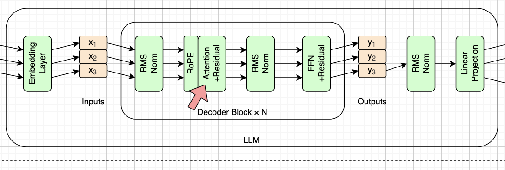

# 注意力机制（Attention）

> **本章代码**：往骨架的第一个空位里填注意力。分四步走——单头 → 多头 → GQA → 因果掩码。
>
> - **造哪个框**：`attn.png` 的 Attention+Residual
> - **形状**：`(T, 576) → (T, 576)`。中间拆成 9 个头 × 64 维，q 是 `(T, 9, 64)`，k/v 只有 `(T, 3, 64)`，算完再拼回 576
> - **引擎**：`ids → embed → [norm → attn → norm → □] × 30 → norm → lm_head → logits`（填了第一个）
> - **关键**：整张图里**只有这一个部件让不同 token 交换信息**。Embedding、RMSNorm、FFN 眼里每个位置都是孤立的
> - **跑出什么**：注意力权重矩阵，看得见因果掩码的下三角；以及 3 个 q 头共享一组 kv 的分组关系
> - **对拍**：**这一章还对不上 transformers**，因为缺 RoPE。改用 `F.scaled_dot_product_attention(..., is_causal=True)` 当参照——PyTorch 自带，正好是「无位置信息的因果注意力」
> - **章末实验**：把输入 token 打乱，输出一模一样。留给下一章
> - **说明**：总览图上 RoPE 画在 Attention 前面，这里先跳过它



上一章的骨架有两个空位。这一章填第一个。

这是全书最长的一章，因为注意力是 Transformer 里唯一真正复杂的部件。分五步走：先讲它要解决什么问题，再从最简单的单头开始，逐步加上因果掩码、多头、GQA。

**整张图里，这是唯一一个让不同 token 互相交换信息的地方。** Embedding 是逐 token 查表，RMSNorm 是逐 token 归一化，FFN 是逐 token 变换——它们眼里每个位置都是孤立的。只有注意力会让第 3 个 token 去看第 1、2 个 token。一句话：**注意力负责"混合"，其它所有部件负责"加工"。**

要讲的几点：

- **Q / K / V**：每个 token 出三个向量，用 query 去和别人的 key 匹配，按匹配程度加权取别人的 value。
- **因果掩码**：生成式模型只能看左边。第 3 个 token 能看 1、2，看不到 4、5。这是"预测下一个词"这个任务的硬性要求。
- **GQA（分组查询注意力）**：SmolLM2 有 9 个 query 头，却只有 3 个 key/value 头，3 个 q 头共享一组 kv。省下的参数其实不多（k、v 两个矩阵从 576×576 缩到 192×576），真正省的是推理时 KV Cache 的内存——这一点要等到第十一章才看得出价值。
- **它是唯一计算量随序列长度平方增长的部件**。序列翻倍，注意力的开销翻四倍。第十一、十二两章都是在治它。


## 为什么需要注意力

回到第一章那句话：**整张图里，只有这一个部件让不同 token 交换信息。**

Embedding 是逐 token 查表，RMSNorm 是逐 token 归一化，FFN 也是逐 token 变换——在它们眼里，每个位置都是孤立的，第 3 个 token 完全不知道第 1、2 个 token 的存在。

可是语言不是这样的。要预测「我今天去了一趟___」的下一个词，必须回看前面。怎么"回看"？

**最朴素的想法**：把前面所有 token 的向量平均一下，加到当前位置上。这确实能传递信息，但太粗糙——"去了"和"一趟"对预测的贡献显然不一样，凭什么给同样的权重？

**注意力的答案**：还是加权平均，但**权重是算出来的，而且随内容变化**。当前 token 自己决定该多看谁。

一句话概括：**注意力 = 内容决定权重的加权平均。**


## 单头注意力


### 三个角色

每个 token 用三个不同的矩阵，从自己的向量投影出三个新向量：

| 向量 | 来源 | 含义 |
|---|---|---|
| **q**（query） | `q_proj` | 我想找什么 |
| **k**（key） | `k_proj` | 我是什么，用来被别人匹配 |
| **v**（value） | `v_proj` | 匹配上了，我能提供什么 |

一个常用的类比是检索：拿着 query 去和所有条目的 key 比对，谁匹配就取谁的 value。区别在于这里不是"取一个"，而是**按匹配程度对所有 value 加权求和**——是软的检索。

要强调的是：q、k、v 都是从**同一个** $\mathbf{x}$ 投影出来的（所以叫 self-attention），只是过了三个不同的矩阵，扮演三种角色。


### 算分数

$$\mathrm{score}(i, j) = \frac{\mathbf{q}_i \cdot \mathbf{k}_j}{\sqrt{d_{\mathrm{head}}}}$$

第 i 个 token 对第 j 个 token 的关注度，就是它俩 q 和 k 的点积。

**为什么要除以 $\sqrt{d_{\mathrm{head}}}$ **（这里是 $\sqrt{64} = 8$ ）：维度越高，点积的数值越大、方差越大。不缩放的话，softmax 的输入过大，输出会**饱和**成接近 one-hot 的形状——只盯着一个 token，其余权重全是 0，"加权平均"退化成"挑一个"，注意力就白设计了。除以 $\sqrt{d}$ 把方差拉回 1 附近。


### softmax 与加权求和

score 矩阵每行过一次 softmax，变成一行和为 1 的权重；然后用这行权重对所有 value 加权求和，得到这个位置的输出。

最后过 `o_proj` 投回 576 维——这一步的作用是把各个头的结果混合起来（下面讲多头时会更清楚）。


### 形状

```
x       (T, 576)
q,k,v   (T, 576)          ← 三次线性投影
scores  (T, T)            ← q @ k.T
weights (T, T)            ← softmax
out     (T, 576)          ← weights @ v，再过 o_proj
```

**注意 `scores` 是 T × T 的。** 序列翻倍，它翻四倍。这就是注意力那个平方复杂度的来源，也是第十二章要治的东西——现在先记住它的存在。


## 因果掩码


### 为什么要挡住未来

生成式模型的任务是"根据前面预测下一个"。如果算第 i 个位置时能看到第 i+1 个 token，那就是在抄答案——训练时会学到一个作弊的捷径，推理时（未来还不存在）就彻底垮掉。

所以必须硬性规定：**第 i 个位置只能看 1..i。**


### 怎么实现

在 softmax **之前**，把 score 矩阵的上三角置成 $-\infty$ 。

$$\mathrm{score}(i,j) = -\infty \quad (j > i)$$

**为什么是 $-\infty$ 而不是 0**：因为掩码要在 softmax 之前生效。 $\exp(-\infty) = 0$ ，softmax 之后权重正好是 0；而如果置成 0， $\exp(0) = 1$ ，反而给了未来一个不小的权重——这个错误很隐蔽，模型照样能跑，只是效果莫名其妙地差。


### 打印出来看

把某一层某个头的注意力权重矩阵打印出来，会看到一个**下三角矩阵**，每行的和都是 1。这是这一章最值得截图的一张输出。

可以顺带观察一下权重的分布：第一个 token 只能看自己，所以权重是 1.0；越往后可选的越多，权重越分散。很多模型还会出现"大量注意力堆在第一个 token 上"的现象（attention sink），可以提一句。


### 一个第十一章的伏笔

decode 阶段每次只算 1 个新 token，T = 1，score 矩阵只有一行，掩码全是 0——**整个掩码可以跳过**。这个优化留到第十一章。


## 多头注意力


### 为什么要多头

一个头只能学会一种"关注模式"。但语言里同时存在很多种关系：语法上的主谓宾、语义上的指代、位置上的邻近……让一个头全学会不现实。

多头的做法很直接：**并行跑多组 QKV，各看各的，最后拼起来。**

SmolLM2 有 **9 个头**，每个头的维度是 576 / 9 = **64**。


### 不是真的跑 9 遍

实现上有个关键点：**9 个头是 reshape 出来的，不是 9 个独立的矩阵。**

`q_proj` 一次性输出 576 维，然后 reshape 成 `(T, 9, 64)` 就完事了。每个头看到的是这 576 维里的一段。所以第二章看到的形状是：

```
q_proj  (576, 576)   =  9 个头 × 64 维 × 输入 576 维
```

算完 9 个头各自的 64 维输出，拼回 576 维，再过 `o_proj`。`o_proj` 的作用这时候就清楚了：**它负责把各头的结果混合**，否则 9 个头各算各的，永远不会交流。


## 分组查询注意力（GQA）


### 第二章留下的问号

第二章看到形状时留了个疑问：

```
q_proj  (576, 576)   ← 9 × 64
k_proj  (192, 576)   ← 3 × 64   ？
v_proj  (192, 576)   ← 3 × 64   ？
```

192 不是笔误。**query 有 9 个头，key/value 只有 3 个头**，每 3 个 query 头共享一组 key/value。这就是 GQA（Grouped-Query Attention）。

### 三种方案

| 方案 | q 头 | kv 头 | 特点 |
|---|---|---|---|
| MHA | 9 | 9 | 标准做法，质量最好 |
| MQA | 9 | 1 | 最省，但质量掉得明显 |
| **GQA** | 9 | **3** | 折中，现在的主流 |

### 实现

读的时候把 3 组 kv 各复制 3 份，对齐 9 个 q 头（通常叫 `repeat_kv`）。

**这里有个坑**：要用 `repeat_interleave` 的语义——每个 kv 头**连续**重复 3 次，得到 `[0,0,0,1,1,1,2,2,2]`；而不是整组重复 3 遍的 `[0,1,2,0,1,2,0,1,2]`。两种写法形状完全一样，都不报错，但配对关系全错。又一个静默错误。

### 省的到底是什么

**不是参数。** k 和 v 两个矩阵从 576×576 缩到 192×576，一共才少 44 万个参数，占全模型 0.3%，可以忽略。

**是 KV Cache。** 推理时每个 token 都要缓存 K 和 V，头数直接决定缓存大小。9 个头变 3 个头，缓存直接省掉三分之二——8192 上下文下是 378 MB 对 1133 MB。

所以要点明：**GQA 是一个为推理而做的设计**，训练时几乎没有好处。它的价值要到第十一章才真正兑现。这也正是"从推理视角看模型"能看到、而训练视角容易忽略的东西。


## 代码实现

### 组装

一个 `Attention` 类：四个 `nn.Linear`（`bias=False`，第二章的发现）、reshape 分头、算分数、加掩码、softmax、`repeat_kv`、加权求和、`o_proj`。

填进上一章骨架的第一个空位：

```
ids → embed → [norm → attn → norm → □] × 30 → norm → lm_head → logits
```

### 对拍：这一章对不上 transformers

**必须提前说明**：这一章的注意力和 HF 的 `LlamaAttention` 对不上，因为我们还没有 RoPE。这不是 bug，是进度。

改用 PyTorch 自带的 `F.scaled_dot_product_attention(q, k, v, is_causal=True)` 当参照——它正好就是"无位置信息的因果注意力"，是这一章的完美 oracle。等下一章补上 RoPE，再和 `LlamaAttention` 对。

### 跑一下

输出会比第五章好一点点——终于有 token 间的交互了——但仍然不通顺，因为还缺 FFN，也缺位置信息。

### 章末实验：它不认识词序

这一章最重要的一个演示。

**把输入 token 的顺序打乱，输出一模一样。**

原因在数学里明摆着：注意力做的是加权求和，而加法不分先后。「我打你」和「你打我」，在它眼里是同一堆向量的同一种组合。

（严格说因果掩码会带来一点顺序依赖，但那只是"能看几个"的区别，不是"谁在第几位"的信息。可以设计成打乱后半段、或者对比无掩码的情形，把现象做干净。）

一个连词序都分不清的模型，显然不可能生成通顺的文本。这个洞下一章补。


## 本章小结

这一章填上了 Block 的第一个空位：

- **注意力 = 内容决定权重的加权平均**，q 找、k 被找、v 被取
- **因果掩码**保证只能看左边，softmax 前置 $-\infty$
- **多头**是 reshape 出来的，9 个头 × 64 维，`o_proj` 负责混合
- **GQA** 用 3 个 kv 头服务 9 个 q 头，省的不是参数，是第十一章的 KV Cache

引擎现在是 `ids → embed → [norm → attn → norm → □] × 30 → norm → lm_head → logits`。

但它有个致命缺陷：**对词序完全无感**。下一章补上位置编码。
