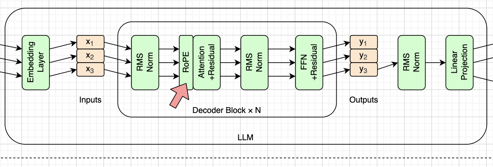

# 位置编码（Positional Encoding）

> **本章代码**：补上 RoPE，注意力才算完整。
>
> - **造哪个框**：`rope.png` 的 RoPE，位置在 norm 之后、attention 之前
> - **形状**：不改变任何形状，只把 q `(T, 9, 64)` 和 k `(T, 3, 64)` 原地旋转
> - **引擎**：结构不变，但每一层的 q/k 在算注意力分数之前先转一次——**30 层每层都要转**，不是入口转一次就完事
> - **跑出什么**：重做上一章的打乱实验，这次输出变了
> - **对拍**：现在能和 `LlamaAttention` 对上了，相对误差 ~1e-7。**从这一章起判据换成相对误差**，不能再要求逐位——RoPE 的 cos 表引入了 1 ulp 的差异，往后一路放大
> - **坑**：`rope_theta` 是 100000 不是常见的 10000；配对方式是 half-split 不是 interleaved。两种都是真旋转，都能生成通顺文本，**只有对拍能分辨**
> - **数字**：RoPE 一个可训练参数都没有，权重文件里找不到它



上一章结束时留了个洞：注意力对词序完全无感，打乱输入输出不变。这一章补这个洞。


红箭头指着 RoPE，位置在 RMS Norm 之后、Attention 之前。

**为什么需要它**：上一章说注意力是唯一混合 token 的部件，但它有个致命缺陷——**它对顺序毫不敏感**。把输入的词打乱，注意力算出来的结果一模一样，因为它只做加权求和，加法不分先后。「我打你」和「你打我」在它眼里没有区别。位置编码就是来补这个洞的。

要讲的几点：

- **RoPE 不是加上去的，是转过去的**。早期做法是造一个位置向量加到词向量上；RoPE 换了个思路——把 q 和 k 向量在平面上**旋转**一个角度，角度由位置决定。两个 token 做点积时，结果只跟它们的**位置差**有关，相对位置就这么天然地编码进去了。
- **注意它在图上的位置：在 Decoder Block 内部。** 这意味着 30 层里每一层都要重新旋转一次，不是在入口转一次就完事。这和 GPT-2 那种"入口加一次绝对位置编码"是完全不同的做法。
- **它没有一个可训练参数**。RoPE 全靠 `rope_theta` 这个常数算出来的三角函数表，权重文件里找不到它。


## 位置编码


### 问题的形状

注意力算的是加权求和，加法不分先后——这是它的数学本性，改不了。所以位置信息只能**额外**注入。

注入什么？两个候选：

- **绝对位置**：告诉模型"这是第 5 个词"
- **相对位置**：告诉模型"这两个词隔了 3 个位置"

直觉上语言更需要后者。「上一个词」这件事，在句首和句尾应该是同一回事；一个句子整体往后挪 10 个位置，内部关系不该发生变化。

位置编码这条技术线，基本就是从绝对慢慢走向相对的过程。


### 第一代：学出来的绝对位置嵌入

BERT、GPT-2 的做法。搞一张 `max_len × d` 的表，第 i 个位置查第 i 行，把结果加到词向量上。

简单直接，但有两个硬伤：

- **外推不了**。训练时表只有 512 行，遇到第 513 个位置就没有对应的行了
- 它是**绝对**的，模型得自己从绝对位置里学出相对关系


### 第二代：三角函数绝对位置编码

2017 年原始 Transformer 论文的做法。不学，直接用公式造：

$$PE_{(pos,\,2i)} = \sin\left(\frac{pos}{10000^{2i/d}}\right), \qquad PE_{(pos,\,2i+1)} = \cos\left(\frac{pos}{10000^{2i/d}}\right)$$

设计动机是**不同维度用不同波长**：低维波长短、振荡快，负责分辨近距离；高维波长长、变化慢，负责表示远距离。合起来就像一个多进制的位置计数器。

好处是不用学、任意长度都能算。论文里还提到一个性质： $PE_{pos+k}$ 可以由 $PE_{pos}$ 线性变换得到，所以模型"**也许**能学会利用相对位置"——注意是"也许"，这只是个可能性，没有被强制。


### 绝对位置编码的根本问题

不管学出来的还是算出来的，第一二代都是**加到词向量上**的。这带来两个麻烦：

1. 位置信息进了残差流，和语义信息**混在一起**，后面每一层都得自己去分离
2. 模型想要的相对关系，得靠自己从绝对位置里"推导"，没人保证它推得出来

RoPE 换了个根本思路：**不加到向量上，而是旋转 q 和 k，让点积天然只依赖位置差。**


## 旋转位置编码


### 核心构造

把一个 64 维的 head 向量看成 **32 个二维平面**上的点。在位置 $m$ 上，第 $i$ 个平面旋转 $m\theta_i$ 这么大的角度：

$$\begin{pmatrix} x'_{2i} \\ x'_{2i+1} \end{pmatrix} = \begin{pmatrix} \cos m\theta_i & -\sin m\theta_i \\ \sin m\theta_i & \cos m\theta_i \end{pmatrix} \begin{pmatrix} x_{2i} \\ x_{2i+1} \end{pmatrix}$$

不同的平面转速不同， $\theta_i$ 决定第 $i$ 个平面转多快。


### 为什么这样就编码了相对位置

这是全章的关键。旋转矩阵有个性质： $R_m^{\mathsf T} R_n = R_{n-m}$ 。于是

$$(R_m \mathbf{q}) \cdot (R_n \mathbf{k}) = \mathbf{q}^{\mathsf T} R_m^{\mathsf T} R_n \mathbf{k} = \mathbf{q}^{\mathsf T} R_{n-m}\, \mathbf{k}$$

**旋转之后的点积，只和位置差 $n - m$ 有关，与它们各自在哪无关。**

绝对位置进去，相对位置出来。这就是 RoPE 最漂亮的地方——它不需要模型去"学会"相对位置，相对位置是它算出来的结果。

顺带两个好性质：旋转不改变向量长度，所以不会破坏原有的数值尺度；也不占用任何维度，信息是"藏"在角度里的。

### 频率与 base

$$\theta_i = \frac{1}{\mathrm{base}^{2i/d}}$$

`base` 就是 config 里的 `rope_theta`。低维 $\theta$ 大转得快，高维 $\theta$ 小转得慢——和三角函数编码是同一个思路，多进制计数器。

**SmolLM2 的 base 是 100000，不是常见的 10000。** base 越大，高维平面转得越慢，能分辨的距离范围越长。这是为长上下文调的参数（SmolLM2-1.7B 用的又是 130000）。这个数必须从 config 读，写死了就错。

### 两个实现约定，必须讲清

**一、配对方式：哪两个维度组成一个平面？**

- **interleaved**：配相邻的，`(0,1) (2,3) (4,5) …`。原始 RoFormer 论文的写法
- **half-split**：配隔半个头的，`(0,32) (1,33) (2,34) …`。用 `rotate_half` 实现，GPT-NeoX 和 HF 的写法

SmolLM2 的 config 里 `rope_interleaved: false`，选的是**后者**。

两种都是货真价实的旋转，都保范数，都能让模型生成通顺的文本——**只有和参考实现对拍才能分辨。** 这是全书最典型的静默错误：选错了不报错、不崩溃、输出看起来也像那么回事，只是和真实模型完全不是一回事。

**二、只作用在 q 和 k 上，不作用在 v 上。**

因为 RoPE 要影响的是「谁和谁匹配」，不是「匹配上了给什么内容」。v 是内容，不该被位置扭曲。

### 每一层都要转

看第一章的图：RoPE 画在 **Decoder Block 内部**。这意味着 30 层里每一层都要重新旋转一次，而不是在入口转一次就完事。

这和 GPT-2 那种"入口加一次绝对位置编码"是完全不同的设计——位置信息不进残差流，每层现用现算。

### 零参数

整个 RoPE 靠 `base` 算出来的三角函数表，**一个可训练参数都没有**。第二章翻遍 272 个张量也找不到它，原因就在这里。


## 代码实现

### 预计算还是现算

`inv_freq` 是 32 个数，然后对 8192 个位置算出 cos/sin 表，形状 `(8192, 64)`。可以启动时一次算好，也可以每次现算（HF 就是现算的）。

预计算更快，但要知道一个数值细节：**`torch.cos` 在大张量和小张量上差 1 ulp**。它对大张量走向量化 kernel，对小张量走标量 kernel，两条路径的舍入不完全一样。角度本身是逐位相同的，只有余弦差这一点点。

这一点点，就是下面判据要改的原因。

### 应用

对 q 和 k 各做一次：

```
x_rotated = x * cos + rotate_half(x) * sin
```

`rotate_half` 就是把后半段取负、挪到前面——它是那个 half-split 配对的具体实现。

### 判据从这一章起改成相对误差

前面几章的部件（RMSNorm、后面的 SwiGLU）都能做到和 HF **逐位相同**。从 RoPE 开始不行了。

具体做法：

- 断言 `max|diff| / max|out| < 1e-5`，**不要用裸的 `atol`**
- 原因：绝对误差会随激活值大小增长。T=128 时注意力输出量级到 40，这个 1e-7 的相对误差换算成绝对值就有 1.5e-5，一个固定的 atol 迟早会误报
- 真正的错误（配对方式写反、`repeat_kv` 用错）相对误差在 **1e0** 量级。1e-7 和 1e0 之间隔着七个数量级，**没有灰色地带**——要么明显对，要么明显错

这个"判据随进度放宽，但错误依然一眼可辨"的经验，值得在这里正式写一段，因为后面几章都要用。

### 对拍清单

1. `inv_freq` 与 HF 逐位相同
2. cos/sin 表差 1 ulp
3. **整个 Attention 现在能和 `LlamaAttention` 对上了**，相对误差 ~1e-7

第三条是这一章的验收标准——上一章对不上的，这一章对上了。

### 重做打乱实验

把上一章那个实验再跑一遍：打乱输入 token 的顺序。

**这次输出变了。** 洞补上了。


## 本章小节

这一章补上了注意力缺的那块：

- 注意力对顺序无感，位置信息必须额外注入
- 前两代把位置**加**到词向量上，RoPE 改成**旋转** q 和 k
- 旋转的点积只依赖位置差，相对位置是算出来的而不是学出来的
- 两个约定要照抄：`rope_theta = 100000`、half-split 配对。选错了不报错，只有对拍能发现
- 从这一章起，数值判据是**相对误差**

引擎的结构没变，但每一层的 q/k 在算分数前都会先转一次。Block 的第一个子层至此完整。

下一章填第二个空位——然后把 30 层真正接通。
