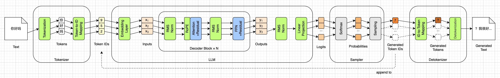

# 残差连接（Residual Connections）


todo



todo

> 
>
> **本章代码**：把注意力和 FFN 用一条旁路包起来，Decoder Block 至此完整。
>
> - **造哪个框**：`rc.png` 里那两个 `+Residual`——第一章说过，它在数据流向图上画不出来
> - **形状**：`(T, 576) → (T, 576)`。旁路不改变形状，主干也不改变形状，两者相加还是 `(T, 576)`
> - **骨架**：`h = x + Attn(norm(x))`，`y = h + FFN(norm(h))`
> - **引擎**：`ids → embed → [norm → attn → norm → ffn] × 30 → norm → lm_head → logits`
> - **要讲**：残差连接的基本概念；它和第五章 pre-norm / post-norm 的关系（norm 在旁路里还是旁路外）；以及 HC、mHC、AttnRes 几种改进
> - **对拍**：HC / mHC / AttnRes 都不是 SmolLM2 用的方案，**这部分没有可对拍的参考实现**，只讲原理不落代码


**一个图上看不见的东西：残差连接。** 图里写的是「Attention+Residual」和「FFN+Residual」，残差被折进框里了，没有画出那条绕过去的旁路。但 pre-norm 和 post-norm 的区别恰恰是"norm 放在旁路里还是旁路外"，讲这一节必须把那条旁路补出来：

```
h = x + Attention(Norm(x))
y = h + FFN(Norm(h))
```

**一个值得留意的事实：从 Inputs 到 Outputs，张量形状始终是 `(T, 576)`。** 30 个 Decoder Block 首尾相接，每一层都在**原地改写**同一个形状的东西——不放大、不缩小、不改维度。这条贯穿始终的 576 维数据流，有个通俗的叫法：残差流（residual stream）。每一层做的事情，本质上都是往这条流里"加"一点东西。


## 残差连接


### 骨架长什么样

一个子层的标准形态是这样的：

$$\mathbf{h} = \mathbf{x} + f(\mathrm{Norm}(\mathbf{x}))$$

三个部件：一条**主干**（ $\mathbf{x}$ 直通过去）、一条**旁路**（先归一化，再经过 $f$ ）、末尾一个**加法**。

$f$ 就是后面要填的器官——在第一个空位是注意力，在第二个空位是 FFN。


### 为什么要有主干

直觉上的解释：每一层不是"重新算一个 $\mathbf{x}$ "，而是"往 $\mathbf{x}$ 上**加**一点修正"。30 层就是 30 次小幅修正，而不是 30 次推倒重来。

这条主干贯穿整个模型，形状始终是 `(T, 576)` ——第一章说过，它有个通俗的叫法：**残差流**（residual stream）。每一层都在往这条流里写入自己的贡献，同时也读取前面所有层写进去的东西。

还有一个更技术的理由，但它属于训练的范畴（简单说：没有这条直通的加法通路，几十层深的网络根本训不出来）。按前言的约定，本书只取结论：**残差是必需的，不是可选的优化**。


### 图上看不见它

要提醒读者：第一章那些图上**画不出残差**。你看到的是 `Attention+Residual` 和 `FFN+Residual`——残差被折进框名里了，那条绕过去的旁路没有画出来。

而 pre-norm 和 post-norm 的区别，恰恰就是"norm 在旁路里还是旁路外"。所以这一节需要单独画一张图，把主干、旁路、加法三者分开。


### 一个 Block 有两条残差

```
h = x + Attn(norm₁(x))     ← 第六、七章填
y = h + FFN(norm₂(h))      ← 第八章填
```

对应第二章看到的两个张量：`input_layernorm` 是 norm₁，`post_attention_layernorm` 是 norm₂。

顺带说一个命名陷阱：**`post_attention_layernorm` 叫 post，干的却是 pre-norm 的活**。它的意思是"在注意力之后的那个 norm"（指位置在 attention 子层后面），不是"post-norm"。第一次读 HF 代码的人几乎都会在这里卡一下。


## HC&mHC


## AttnRes


## 本章小结

TODO

