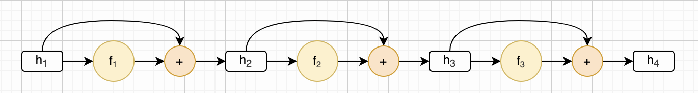
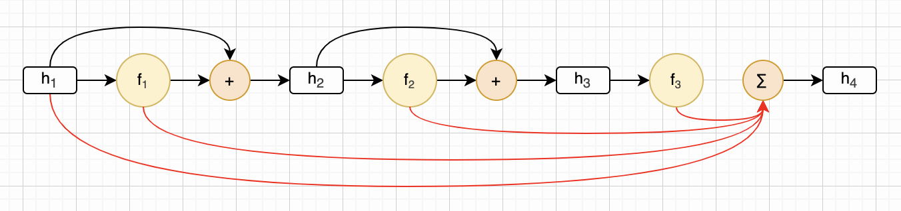
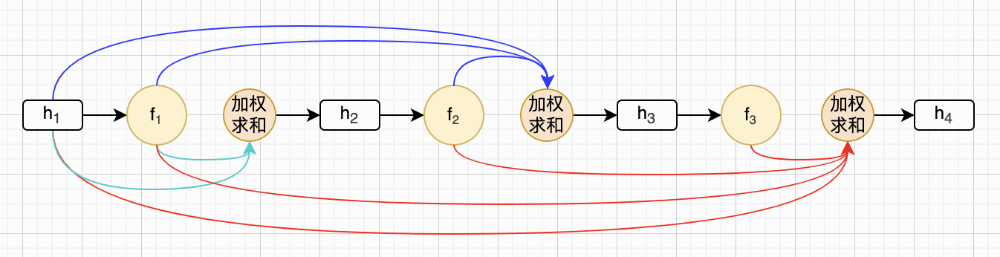
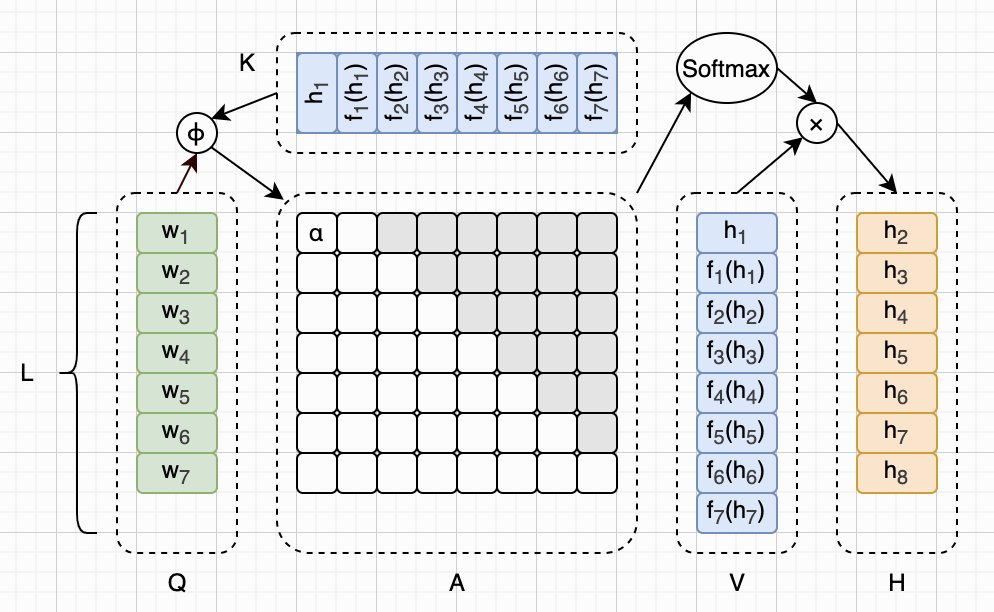
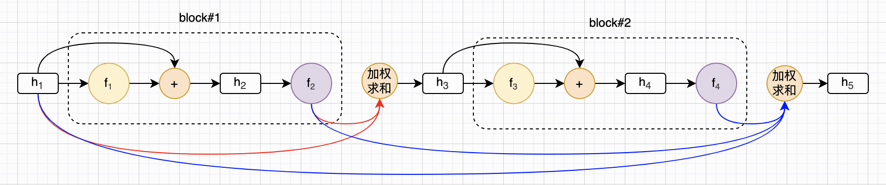

## 图解Kimi Attention Residuals

在[前一篇文章](https://zhuanlan.zhihu.com/p/2066090950934509121)里，我介绍了Kimi K3模型技术架构里提到的Stable LatentMoE。这篇文章我介绍一下K3用到的另外一项技术，也是Kimi提出的，叫做**注意力残差**（Attention Residuals，简称**AttnRes**）。

注意啦，千万不要被这个名字给误导了。我刚开始看到它，以为是类似Flash Attention、Paged Attention、Multi-head Latent Attention等注意力机制的优化。但实际上Attention单词在前面，所以它其实是用类似注意力的机制去优化**残差连接**（Residual Connections）。本文先带领读者快速复习一下残差连接的基本原理，然后介绍Kimi提出的AttnRes。

关于残差连接的优化，还有一条路径是字节跳动提出的[Hyper-Connections](https://arxiv.org/abs/2409.19606)（简称HC），以及DeepSeek在此基础上提出的改进方案[Manifold-Constrained Hyper-Connections](https://arxiv.org/abs/2512.24880)（简称mHC）。如果你想了解这两项技术，也可以看我之前写的[关于DeepSeek-V4的文章](https://zhuanlan.zhihu.com/p/2053601625491690393)。

图解LLM系列的文章都没有用AI润色，文字都是自己敲的，图都是自己画的，原汁原味。不过我使用AI检查了错别字，还有很多不确定的地方，我也问了AI。如果一些AI回答的片段，我觉得可以直接用，会以引用的形式贴到文中，一眼就能看出来。由于我还在慢慢学习中，本文可能难免有错误和疏漏，如果你发现的话，可以在评论区告诉我，我会在下一版改进。

## 残差连接

我们先来回顾一下**残差连接**，这个技术是Transformer架构出厂时就自带的，详见2017年的经典论文《Attention Is All You Need》。本文假设读者已经对标准的Transformer架构、注意力机制、残差连接都非常熟悉了，如果还不熟悉的话，可以先熟读这篇经典论文。

为了便于讨论，我们只关注目前主流的LLM架构，也就是只有Decoder模块的Transformer架构。在这种架构里，Decoder由许多的Block（层）串联起来，每个Block里又包括一个注意力模块和一个FFN模块。这里，我先贴一个之前介绍DeepSeek-V4时画的架构图。我们忽略各种细节，只关注Decoder Blocks就可以了。

在Transformer架构里，注意力模块和FFN模块都是有残差连接的。而在本文中，我们并不关心注意力模块和FFN模块的具体工作方式。所以，为了进一步简化讨论，我们就把注意力模块和FFN模块都当成黑盒子就好了。如果某个LLM模型有`L`层的话，就有`2L`个这样的黑盒子串联起来。

好吧，后文我们就直接用`L`来表示黑盒子的数量，而且把每个盒子看作一层。我们也不再区分是哪种盒子，统一用 $f_l()$ 来表示盒子的计算，其中 $1 \le l \le L$ 表示第几个盒子（也就是第几层）。经过这些简化后，我们可以统一给出某一层的计算公式。这个公式出现在AttnRes论文第1节第一段话里，并且在2.1小节也单独出现过：

$$
\begin{aligned}
\boldsymbol{h}_l = \boldsymbol{h}_{l-1} + f_{l-1}(\boldsymbol{h}_{l-1})
\end{aligned}
\tag{§2.1a}
$$

上面这个公式本身是很好理解的，其中 $h_l$ 表示隐藏向量。如果模型一共有`L`层的话，那么 $h_1$ 就是第一层输入， $h_2$ 就是第一层输出，同时也是第二层输入，以此类推， $h_{L+1}$ 就是最后一层输出。公式里每层函数计算出结果后，都要把输入也加上，这个就是所谓的残差连接。我们取`L=3`，可以把上面这个公式每一层都画出来，就像下面这样：

上面这个其实是个递归公式，所以是可以展开的。展开以后的形式，在AttnRes论文2.1小节第二段话里也出现了。下面是展开过程：

$$
\begin{aligned}
\boldsymbol{h}_l &= f_{l-1}(\boldsymbol{h}_{l-1}) + \boldsymbol{h}_{l-1} \\
    &= f_{l-1}(\boldsymbol{h}_{l-1}) + f_{l-2}(\boldsymbol{h}_{l-2}) + \boldsymbol{h}_{l-2} \\
    &= f_{l-1}(\boldsymbol{h}_{l-1}) + f_{l-2}(\boldsymbol{h}_{l-2}) + f_{l-3}(\boldsymbol{h}_{l-3}) + \boldsymbol{h}_{l-3} \\
    &= ... \\
    &= f_{l-1}(\boldsymbol{h}_{l-1}) + f_{l-2}(\boldsymbol{h}_{l-2}) + f_{l-3}(\boldsymbol{h}_{l-3}) + ... + f_{1}(\boldsymbol{h}_{1}) + \boldsymbol{h}_{1} \\
    &= \boldsymbol{h}_1 + \sum_{i=1}^{l-1}f_i(\boldsymbol{h}_i)
\end{aligned}
\tag{§2.1b}
$$

还是取`L=3`，我们可以把 $h_4$ 的计算展开成： $\boldsymbol{h}_4 = \boldsymbol{h}_1 + f_1(\boldsymbol{h}_1) + f_2(\boldsymbol{h}_2) + f_3(\boldsymbol{h}_3)$ 。这一计算过程如下图所示：

不难看出，这就是一个简单的累加。而Kimi认为，这样不好，有改进空间。具体哪里不好，本文就不详细解释了，读者可以仔细阅读AttnRes论文。那怎么改进呢？就是把这个简单的累加，改成**加权求和**，这就是AttnRes，后文详细介绍。

## 注意力残差

现在我们知道了，AttnRes就是把前面公式里那种直接累加的形式，改成加权求和。但是我们还看不出它和“注意力”机制有什么联系。别着急，等到下一小节这一点就清晰了。我们先来看AttnRes的公式，也就是论文第3小节开头给出的公式（1）：

$$
\begin{aligned}
\boldsymbol{h}_l = \alpha_{0 \to l} \cdot \boldsymbol{h}_1 + \sum_{i=1}^{l-1} \alpha_{i \to l} \cdot f_i(\boldsymbol{h}_i)
\end{aligned}
\tag{F1}
$$

这个公式，其实就是前面那个展开的公式，增加权重`α`而已。所有的权重加起来等于1，也就是说：

$$
\begin{aligned}
\sum_{i=0}^{l-1}\alpha_{i \to l} = 1
\end{aligned}
\tag{§3a}
$$

我们还是取`L=3`，增加权重后的残差连接如下图所示。注意，每一层都是有自己的一套`α`的。第一层2个（绿色箭头），第二层3个（蓝色箭头），第三层4个（红色箭头），以此类推。

那么这些权重怎么来的呢？AttnRes论文3.1小节给出了答案，我们马上来讨论。

## Full AttnRes

你还记得标准Transformer架构注意力机制的Q、K、V计算吗？如果忘记的话，赶紧复习一下。因为这一小节严重依赖这个知识。这里我贴一张介绍[MSA](https://zhuanlan.zhihu.com/p/2059278715834652015)时画的注意力公式的示意图，方便读者和AttnRes进行对比。

OK，继续。根据前面的介绍，我们知道，计算 $h_l$ 的时候，需要`l`个`α`权重。我们用`i`来表示这`l`个权重的下标，并且把第`l`层、第`i`个`α`权重表示成 $\alpha_{i \to l}$ 。于是，我们可以用某个函数`ϕ`来计算`α`，见下面这个公式：

$$
\begin{aligned}
\alpha_{i \to l} = \phi(\boldsymbol{q}_l, \boldsymbol{k}_i)
\end{aligned}
\tag{§3.1a}
$$

那么，这个函数`ϕ`，以及参数`q`、`k`，又是啥？是不是看到点注意力机制Q、K、V的味道了？先来看`ϕ`，论文3.1小节第一段话给出了答案：

$$
\begin{aligned}
\phi(\boldsymbol{q}, \boldsymbol{k}) = \exp\left(\boldsymbol{q}^\top \mathrm{RMSNorm}(\boldsymbol{k})\right)
\end{aligned}
\tag{§3.1b}
$$

然后权重`α`还需要经过Softmax概率归一化，于是论文公式（2）给出了`α`的最终计算公式：

$$
\begin{aligned}
\alpha_{i \to l} = \frac{\phi\left(\boldsymbol{q}_l, \boldsymbol{k}_i\right)}{\sum_{j=0}^{l-1} \phi\left(\boldsymbol{q}_l, \boldsymbol{k}_j\right)}
\end{aligned}
\tag{F2}
$$

那么`q`和`k`到底是啥呢？`q`是一个可学习的权重向量，每层一个。`k`和`v`就是每一层的输出（ $h_1$ 是例外）。论文里的公式（3）给出了`q`、`k`和`v`的定义：

$$
\begin{aligned}
\boldsymbol{q}_l = \boldsymbol{w}_l,\quad
\boldsymbol{k}_i = \boldsymbol{v}_i =
\begin{cases}
\boldsymbol{h}_1 & i = 0 \\
f_i(\boldsymbol{h}_i) & 1 \le i \le l-1
\end{cases}
\end{aligned}
\tag{F3}
$$

有了`q`、`k`和`v`的定义，我们就可以把前一小节介绍的公式（F1）重写。这就是AttnRes论文里的公式（4）：

$$
\begin{aligned}
\boldsymbol{h}_l = \sum_{i=0}^{l-1} \alpha_{i \to l} \cdot \boldsymbol{v}_i
\end{aligned}
\tag{F4}
$$

以上这些公式里，`q`、`k`和`v`都是向量形式，`α`是标量形式。我们把`q`、`k`和`v`放在一起，变成矩阵形式（用大写字母`Q`、`K`、`V`表示）。把所有的`α`也都放在一起，变成矩阵形式（用大写字母`A`表示）。然后我们就可以把AttnRes完整的计算过程画成下面这样，现在你看出来它和Transformer架构注意力机制的相似之处了吧？

注意，上图`A`矩阵里的灰色部分是不需要计算的，这点和Transformer注意力机制的**因果掩码**也是很相似的。由于每一层都要参与这个注意力机制，因此论文里把它叫做**Full Attention Residuals**（简称**Full AttnRes**）。

我们用`d`来表示模型维度。不难看出，对于每一个token，Full AttnRes需要的计算量是 $O(L^2 d)$ 。由于K（=V）需要缓存起来，所以需要的存储空间是 $O(Ld)$ 量级。由于模型的层数通常不会是一个非常巨大的数，所以这些开销尚可接受。不过，论文里也给出了优化方案，那就是**Block Attention Residuals**（简称**Block AttnRes**），详见下文。

## Block AttnRes

Block AttnRes的优化思路也很简单，就是把层分组（Block），组内使用普通的残差连接，组间使用AttnRes。这种分组的思想，在LLM架构里经常被用来做优化，例如[GQA](https://zhuanlan.zhihu.com/p/2059278715834652015)（Grouped-Query Attention）、[MSA](https://zhuanlan.zhihu.com/p/2059278715834652015)（MiniMax Sparse Attention）等。

假设模型一共有`L`层，共分成`N`组，则每一组有`S = L/N`层（假设`L`可以被`N`整除）。这里我们取`L=4`（共4层），`N=2`（分2组，每组2层），那么Block AttnRes可以画成下面这样：

不难看出，分组优化之后，AttnRes的计算量从 $O(L^2d)$ 变成了 $O(N^2d)$ ，内存用量从 $O(Ld)$ 变成了 $O(Nd)$ 。

## 总结

本文首先回顾了残差连接的基本原理，然后介绍了Kimi提出的注意力残差（AttnRes）基本思路，然后通过Full AttnRes介绍了AttnRes的实现细节，最后介绍了Block AttnRes优化。

本文的重点在于介绍残差连接和AttnRes的基本思想和计算过程，但是对于为什么需要残差连接、残差连接存在的问题、AttnRes是否解决了这些问题、解决的效果如何等，并没有展开讨论。在AttnRes的论文里，对这些问题有详细的讨论，感兴趣的读者可以进一步阅读论文。

## 主要参考资料

* 论文：[Attention Is All You Need](https://arxiv.org/abs/1706.03762)
* 论文：[Hyper-Connections](https://arxiv.org/abs/2409.19606)
* 论文：[mHC: Manifold-Constrained Hyper-Connections](https://arxiv.org/abs/2512.24880)
* 论文：[Attention Residuals](https://arxiv.org/abs/2603.15031)
* 论文：[Kimi K3: Open Frontier Intelligence](https://github.com/MoonshotAI/Kimi-K3/blob/main/k3_tech_report.pdf)
