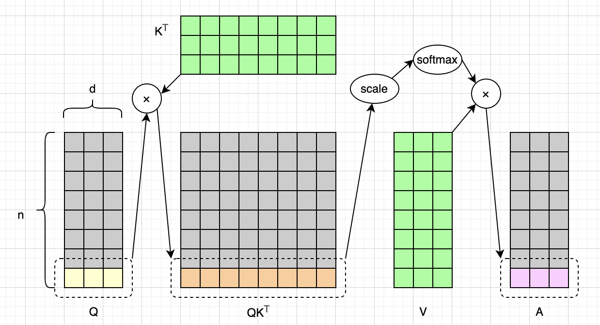
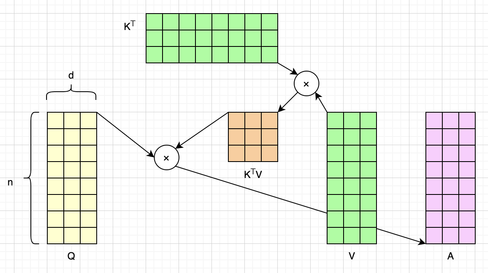
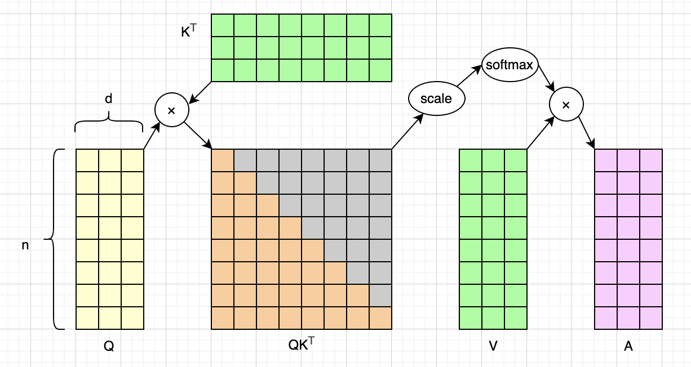
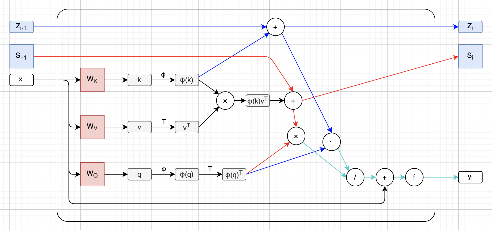
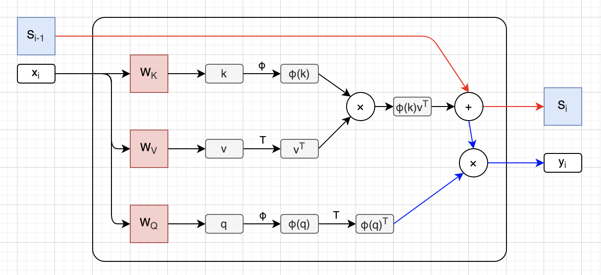
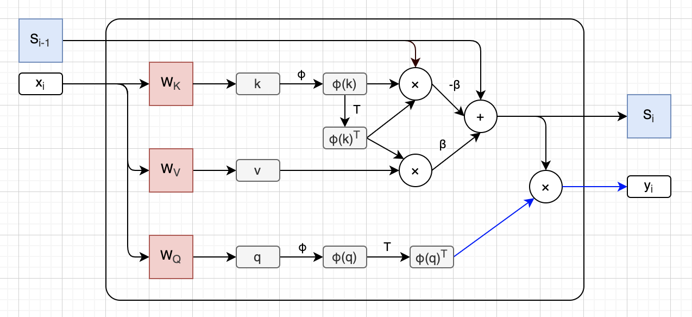
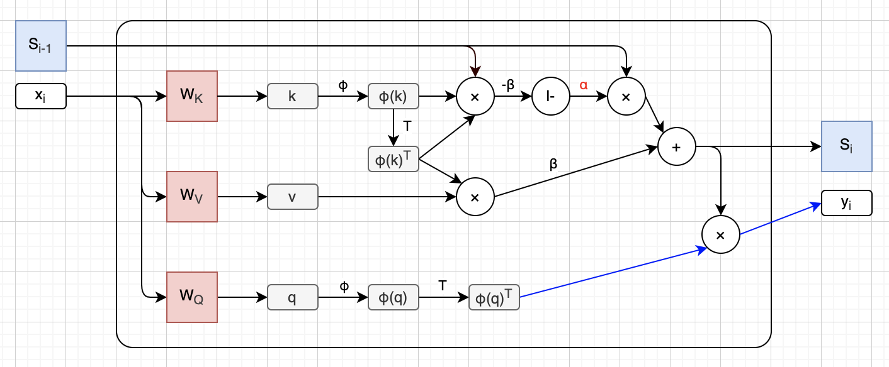

# 图解Kimi Delta Attention

这是介绍Kimi K3模型的第三篇文章。在[第一篇文章](https://zhuanlan.zhihu.com/p/2066090950934509121)里，我们大致梳理了MoE的发展路径，并重点讨论了NVIDIA提出的LatentMoE，以及Kimi的改进版本Stable LatentMoE。在[第二篇文章](https://zhuanlan.zhihu.com/p/2066821576473982490)里，我们回顾了残差连接的基本概念，并重点讨论了Kimi提出的注意力残差（Attention Residuals，简称AttnRes）。在这篇文章里，我们会重点讨论Kimi提出的线性注意力机制：Kimi Delta Attention（简称KDA）。

对于我来说，KDA的论文还是比较难懂的。为了搞懂KDA，我把它发展路径上的关键论文（见文末参考资料）都读了一遍。当然这些论文我也没全部都看明白，只是大致能读懂KDA论文里的公式，以及它的基本工作原理了。本文会从标准的Transformer架构和Softmax注意力机制开始，沿着KDA发展的路径，一步一步讲解，一直讲到KDA为止。我会尽自己最大的努力把KDA说明白（写完文章才发现，我可能做不到☹️）。

由于本文介绍的公式来自许多篇论文，而这些论文所使用的字母和符号并不统一。为了便于阅读，在本文中，我会尽量使用统一的字母和符号。我会在这些字母或符号第一次出现时，给出说明。此外，在本文中我们统一用大写字母表示**矩阵**（例如 $Q$ ），用小写粗体字母表示**向量**（例如 $\boldsymbol{x}$ ），用普通小写字母表示**标量**（例如 $n$ ）。（注：由于论文太多了，这一段也没做到☹️）

图解LLM系列的文章都没有用AI润色，文字都是自己敲的，图都是自己画的，原汁原味。不过我使用AI检查了错别字，还有很多不确定的地方，我也问了AI。如果一些AI回答的片段，我觉得可以直接用，会以引用的形式贴到文中，一眼就能看出来。由于我还在慢慢学习中，本文可能难免有错误和疏漏，如果你发现的话，可以在评论区告诉我，我会在下一版改进。

## 标准注意力

我们先从经典的Softmax注意力开始说起。本文假设读者已经对标准的Transformer架构和Softmax注意力机制非常熟悉了，如果还不熟悉的话，可以先熟读2017年的那篇经典论文：[Attention Is All You Need](https://arxiv.org/abs/1706.03762)。下面是**Softmax注意力**（论文中叫做**缩放点积注意力**）公式，也就是这篇论文里的公式（1）：

$$
\begin{aligned}
\text{Attention}(Q,K,V)=\text{softmax}\left(\frac{QK^\top}{\sqrt{d_k}}\right)V
\end{aligned}
\tag{A1}
$$

上面这个公式，相信大家已经刻在脑子里了，不必过多解释。在原论文中， $d_k$ 表示Q和K的维度、 $d_v$ 表示V的维度，且 $d_k = d_v$ 。由于本文的重点是注意力公式，为了简化讨论，后文我们统一用`d`来表示Q、K、V的维度。而Q、K、V则是输入 $\boldsymbol{x}$ 经过三个可学习权重矩阵变换而来的：

$$
\begin{aligned}
Q = \boldsymbol{x} W_Q, \\
K = \boldsymbol{x} W_K, \\
V = \boldsymbol{x} W_V
\end{aligned}
\tag{1.1}
$$

现在我们回到前面的注意力公式上。我在之前的文章中画过它的示意图，这里直接贴过来，方便读者观察：

由于Softmax函数的使用，我们只能先算出 $QK^\top$ ，然后再去和V做矩阵乘法。我们还需要把K和V都缓存起来，这就是所谓的KV Cache机制。我们用`n`来表示输入序列的长度，那么总体而言，标准注意力机制的计算复杂度是 $O(n^2 d)$ ，存储 $QK^\top$ 中间矩阵需要占用 $O(n^2)$ 内存，KV缓存用量是 $O(n d)$ 。

虽然Softmax注意力效果非常好，但是由于平方复杂度，它难以支撑非常长的输入序列（也就是LLM的超长上下文）。于是各大厂商都想尽办法优化标准注意力机制，减少计算量，尤其是减少KV Cache使用量，例如[DeepSeek MLA](https://zhuanlan.zhihu.com/p/2054251474260070710)、[CSA+HCA](https://zhuanlan.zhihu.com/p/2053601625491690393)，以及[MiniMax MSA](https://zhuanlan.zhihu.com/p/2059278715834652015)等。此外，[Flash Attention](https://zhuanlan.zhihu.com/p/2056096665124262956)算法使得我们可以不必存储完整的 $QK^\top$ 中间矩阵就能计算出精确结果，将内存用量也降到了 $O(nd)$ 。

前面这些优化，都不改变标准Softmax注意力公式。但还有一个思路，就是把Softmax给去掉，使得注意力公式可以利用矩阵乘法结合律进行变换，最后使得计算量变成 $O(nd^2)$ 复杂度，缓存用量变成 $O(d^2)$ 。这个就是所谓的**线性注意力**（Linear Attention）机制，是本文后半部分讨论的重点。

不过在讨论线性注意力之前，我们先对Softmax注意力公式进行一个变换，为后面的讨论做铺垫。在此之前，我们先回顾一下Softmax计算公式：

$$
\begin{aligned}
\text{softmax}(z_i) = \frac{e^{z_i}}{\sum_{j=1}^{n} e^{z_j}}
\end{aligned}
\tag{1.2}
$$

我们可以把上面这个Softmax公式，融合进最开始的公式（A1）中，写成下面这个**加权求和**形式：

$$
\begin{aligned}
A_i = V'_i = \frac
  {\sum_{j=1}^{n} \text{exp}(\frac{Q_i K^\top_j}{\sqrt{d}}) V_j}
  {\sum_{j=1}^{n} \text{exp}(\frac{Q_i K^\top_j}{\sqrt{d}})}
\end{aligned}
\tag{1.3}
$$

注意，这两种写法，是**完全等价**的。后面这种写法， $Q_i$ 、 $K_i$ 、 $V_i$ 表示向量，是Q、K、V矩阵中的一行（或一列）。 $Q_i K^\top_j$ 表示向量点积运算，结果是标量。此外，在上面这个公式中， $\text{exp}(x) = e^x$ 。我们取`n=8`、`d=3`、`i=8`，那么上面这个公式可以表示成下面这样：

我们把计算**相似度**的函数抽取出来，令 $\text{sim}(\boldsymbol{q}, \boldsymbol{k}) = \text{exp}(\frac{\boldsymbol{q} · \boldsymbol{k}^\top}{\sqrt{d}})$ ，于是上面这个注意力公式可以改写成下面这样：

$$
\begin{aligned}
V'_i = \frac
  {\sum_{j=1}^{n} \text{sim}(Q_i, K_j) V_j}
  {\sum_{j=1}^{n} \text{sim}(Q_i, K_j)}
\end{aligned}
\tag{B3}
$$

你可能要问了，为啥要把Softmax注意力公式改成这种形式呢？答案在下一小节里。

## 线性注意力

我们继续来看下一篇论文：[Transformers are RNNs: Fast Autoregressive Transformers with Linear Attention](https://arxiv.org/abs/2006.16236)。实际上前面这个公式（B3），就是这篇论文里的公式（3），只是稍微修改了一下字母，和本文保持统一。

### Linearized Attention

这篇论文的3.2小节说，当我们把注意力公式写成（B3）形式后，我们就可以尝试各种不同的`sim()`函数，唯一的限制是`sim()`函数的返回值不能是负数。论文里提到了几种kernel函数：`k(x, y)`，都满足这个条件。其实这里我没完全看懂☹️，只是知道有一些kernel函数可以找到一个特征映射函数 $\phi$ ，使得：

$$
\begin{aligned}
k(x, y) = \phi(x)^\top \phi(y)
\end{aligned}
\tag{2.1.1}
$$

于是，我们把相似度函数`sim()`换成某个具体的kernel函数`k()`。然后，前面的公式（B3）就可以写成下面这种形式，也就是论文3.2小节里的公式（4）：

$$
\begin{aligned}
V'_i = \frac
  {\sum_{j=1}^{n} \phi(Q_i)^\top \phi(K_j) V_j}
  {\sum_{j=1}^{n} \phi(Q_i)^\top \phi(K_j)}
\end{aligned}
\tag{B4}
$$

这里最重要的一点，就是我们可以对上面的公式应用**矩阵乘法结合律**。于是，我们可以把上面这个公式进一步改写成下面这样，也就是论文3.2小节里的公式（5）：

$$
\begin{aligned}
V'_i = \frac
  {\textcolor{red}{\phi(Q_i)^\top} \sum_{j=1}^{n} \phi(K_j) V^\top_j}
  {\textcolor{red}{\phi(Q_i)^\top} \sum_{j=1}^{n} \phi(K_j)}
\end{aligned}
\tag{B5}
$$

上面这个公式仍然是向量写法。对于分子，如果我们把它写回矩阵形式，就得到了论文3.2小节里的公式（6）。注意，函数 $\phi$ 是逐行作用在矩阵上的。

$$
\begin{aligned}
\big(\phi(Q)\phi(K)^\top \big)V = \phi(Q)\big(\phi(K)^\top V\big)
\end{aligned}
\tag{B6}
$$

上面的公式（B5）就是论文提出的**线性注意力**公式。由于我们可以一次性算出 $\sum_{j=1}^{n} \phi(K_j) V^\top_j$ ，以及 $\sum_{j=1}^{n} \phi(K_j)$ ，然后用它们来计算每一个Q，于是整个的计算和内存复杂度都降到了 $O(n)$ 量级。

如果你读到这里比较迷糊，别担心，因为我刚开始也是这样。其实线性注意力的核心思想，就是把计算 $(QK^\top)V$ 变成计算 $Q(K^\top V)$ 。那为啥这样就可以把计算复杂度从 $O(n^2)$ 降到 $O(n)$ 呢？看一下下图你就明白了。

由于改变了计算顺序，我们不用去算那个巨大的 $QK^\top$ 了，只需要算非常小的 $K^\top V$ 。为了简化讨论，我们假设 $\phi$ 函数输出向量的维度也是`d`。如果`d`远小于`n`，那么计算复杂度就从 $O(n^2 d)$ 降到了 $O(n d^2)$ 。

不过呢，上面的复杂度，没有考虑 $\phi$ 函数的计算。论文3.2.1小节说，对于指数kernel，其 $\phi$ 函数输出维度无穷大，所以不可用。对于多项式kernel，它的 $\phi$ 函数输出维度是有限的，计算复杂度大概是 $O(n d^3)$ 。如果`n`远大于 $d^2$ ，那么线性注意力还是有优势的。作为实验，论文使用一种叫做`elu`的激活函数构造了一个 $\phi$ 函数，计算复杂度可以达到 $O(n d^2)$ 。

其实论文3.2.1小节我也没有完全看明白，所以这里就点到为止，感兴趣的读者可以仔细阅读这篇论文。下面给出这个用`elu`激活函数构造的 $\phi$ 函数，也就是论文3.2.1小节里的公式（7）：

$$
\begin{aligned}
\phi(x) &= \text{elu}(x) + 1 \\
&= \begin{cases}
x + 1, & \text{if } x > 0 \\
\exp(x), & \text{if } x \le 0
\end{cases}
\end{aligned}
\tag{B7}
$$

### Causal Masking

我们知道，现代LLM都是decoder-only的Transformer架构。这种模型在训练的时候，要给注意力分数（也就是 $QK^\top$ ，在计算Softmax之前）增加**因果掩码**（Causal Mask），防止前面的token看到后面的token。增加了因果掩码（灰色，表示-∞）的标准注意力计算如下图所示：

考虑因果掩码，我们可以把前面的公式（B3）改写成下面这样，也就是论文3.3小节里的公式（8）。唯一的差异就是求和的上标从`n`变成了`i`，我用红色进行了标记：

$$
\begin{aligned}
V'_i = \frac
  {\sum_{j=1}^{\textcolor{red}{i}} \text{sim}(Q_i, K_j) V_j}
  {\sum_{j=1}^{\textcolor{red}{i}} \text{sim}(Q_i, K_j)}
\end{aligned}
\tag{B8}
$$

根据之前的讨论，我们可以把上面这个公式改成线性注意力形式，类似公式（B5）。这就是论文3.3小节里的公式（9）：

$$
\begin{aligned}
V'_i = \frac
  {\phi(Q_i)^\top \sum_{j=1}^{\textcolor{red}{i}} \phi(K_j) V^\top_j}
  {\phi(Q_i)^\top \sum_{j=1}^{\textcolor{red}{i}} \phi(K_j)}
\end{aligned}
\tag{B9}
$$

我们把上面这个公式里的求和部分提取出来，写成 $S_i$ 和 $Z_i$ 。于是这个公式就可以进一步简化成下面这样，也就是论文3.3小节里的公式（12）：

$$
\begin{aligned}
S_i &= \sum_{j=1}^{i} \phi(K_j) V_j^\top, \\
Z_i &= \sum_{j=1}^{i} \phi(K_j), \\
V_i' &= \frac{\phi(Q_i)^\top S_i}{\phi(Q_i)^\top Z_i}
\end{aligned}
\tag{B10～12}
$$

上面公式里的 $S_i$ 和 $Z_i$ 是求和形式，实际上也可以写成递归形式：

$$
\begin{aligned}
S_i &= S_{i-1} + \phi(K_i) V_i^\top, \\
Z_i &= Z_{i-1} + \phi(K_i)
\end{aligned}
\tag{2.2.1}
$$

### Transformers are RNNs

论文3.4小节指出，理论上来说，任何Transformer模型，其实本质上都是RNN（Recurrent Neural Network，循环神经网络）。当然，实际上并不是这样。比如Softmax注意力，就没有这样一个可用的 $\phi$ 函数。

为了清晰地看到这一点，论文把（decoder-only ）Transformer架构里的一个层（包括一个Attention模块 + 一个FFN），写成了下面这个形式。这就是论文3.4小节里的公式（16～20）：

$$
\begin{aligned}
s_0 &= 0, \\
z_0 &= 0, \\
s_i &= s_{i-1} + \phi\left(x_i W_K\right)\left(x_i W_V\right)^T, \\
z_i &= z_{i-1} + \phi\left(x_i W_K\right), \\
y_i &= f_l\left( \frac{\phi\left(x_i W_Q\right)^T s_i}{\phi\left(x_i W_Q\right)^T z_i} + x_i \right).
\end{aligned}
\tag{B16～20}
$$

如果你前面的公式都看懂了，上面这5个公式还是比较好理解的。它无非就是把前面出现过的一些公式，换一种写法，并写在一起。不过我没有调整公式里的字母和符号，所以还是需要解释一些细节：

* `s`（矩阵）和`z`（向量）是RNN的两个隐藏状态，初始值都是`0`。
* 下标`i`表示输入序列的序号，下标`l`表示层序号。
* $x_i$ 和 $y_i$ 都是向量，表示某一层的输入和输出。
* 最后一行 $+ x_i$ 这项，表示残差连接。
* 最后一行最外边的函数 $f_l$ 表示FFN模块。

我们把上面这5行公式画成RNN结构，如下图所示：

### 简化公式

上面的公式是不是看着比较复杂？我们重点来关注前面的公式（B12）。有一个好消息是，后面许多工作表明，我们把这个公式里的分母去掉可能会更好。于是，使用线性注意力的Transformer计算公式就可以简化成下面这样：

$$
\begin{aligned}
S_i &= S_{i-1} + \phi(K_i) V_i^\top, \\
V_i' &= \phi(Q_i)^\top S_i
\end{aligned}
\tag{2.4.1}
$$

我们把上面这个简化后的公式画出来，如下图所示：

到这里，《Transformers are RNNs》这篇论文的主要公式就介绍完了，我们让AI来总结一下这篇论文的主要贡献。

>Q：用简短的语言总结一下《Transformers are RNNs》这篇论文的主要贡献。
>
>AI：这篇论文首次提出了 Linear Attention，通过将 Softmax Attention 表示为核函数（kernel）形式，利用矩阵乘法结合律将 Attention 的时间复杂度从 $O(N^2)$ 降低到 $O(N)$ ，并进一步推导出一种递推（RNN-like）的状态更新公式，使 Transformer 能够像 RNN 一样进行高效的在线推理。

## DeltaNet

现在我们来到下一篇论文：[Linear Transformers Are Secretly Fast Weight Programmers](https://arxiv.org/abs/2102.11174)。这篇论文重新解释了Linear Transformers，认为它其实等价于1990年代就有的Fast Weight Programmers (FWPs)，并且提出了一些改进 。其实我没有完全看懂这篇文章，我们还是让AI来总结一下吧。

> Q：用简短的语言总结一下《Linear Transformers Are Secretly FWPs》这篇论文的主要贡献。
>
> AI：这篇论文有两个核心贡献：一是将 Linear Attention 重新解释为 Fast Weight Programmer；二是指出原始 Linear Attention 的纯加法 Memory 存在容量限制，并首次将 Delta Rule 引入 Linear Attention，用误差驱动（error-driven）的 Memory 更新替代简单累加，为后续 DeltaNet、Gated DeltaNet 和 KDA 奠定了基础。
>
> AI：虽然这篇论文并没有直接使用 **DeltaNet** 这一名称，但它奠定了 DeltaNet 的核心思想：利用 **delta rule** 对线性注意力中的记忆进行更新。随后，后续工作将这一模型体系正式命名为 **DeltaNet**。

### FWP

在这篇论文的3.2小节里，它把《Transformers are RNNs》论文里的RNN公式（B16～20）改成了FWP形式。下面是该论文3.2小节中的公式（4）以及公式（15）～（19）：

$$
\begin{aligned}
\boldsymbol{k}^{(i)}, \boldsymbol{v}^{(i)}, \boldsymbol{q}^{(i)} &= W_k \boldsymbol{x}^{(i)},\, W_v \boldsymbol{x}^{(i)},\, W_q \boldsymbol{x}^{(i)} \\
\boldsymbol{W}^{(i)} &= \sum_{j=1}^{i} \boldsymbol{v}^{(j)} \otimes \phi(\boldsymbol{k}^{(j)}) \\
\boldsymbol{z}^{(i)} &= \sum_{j=1}^{i} \phi(\boldsymbol{k}^{(j)}) \\
\boldsymbol{W}^{(i)} &= \boldsymbol{W}^{(i-1)} + \boldsymbol{v}^{(i)} \otimes \phi(\boldsymbol{k}^{(i)}) \\
\boldsymbol{z}^{(i)} &= \boldsymbol{z}^{(i-1)} + \phi(\boldsymbol{k}^{(i)}) \\
\boldsymbol{y}^{(i)} &= \frac{1}{\boldsymbol{z}^{(i)} \cdot \phi(\boldsymbol{q}^{(i)})}\, \boldsymbol{W}^{(i)} \phi(\boldsymbol{q}^{(i)}) 
\end{aligned}
\tag{C4,15～19}
$$

上面这些公式这里就不展开介绍了，关于FWP的更多细节，读者可以仔细阅读这篇论文第2、3小节。

### Delta Rule

在论文的4.2小节里，介绍了“Delta Rule”优化方式。我们直接来看公式吧，下面是论文里的公式（4）以及公式（20）～（22）：

$$
\begin{aligned}
\boldsymbol{k}^{(i)},\boldsymbol{v}^{(i)},\boldsymbol{q}^{(i)} &= W_k \boldsymbol{x}^{(i)},\, W_v \boldsymbol{x}^{(i)},\, W_q \boldsymbol{x}^{(i)} \\
\bar{\boldsymbol{v}}^{(i)} &= \boldsymbol{W}^{(i-1)} \phi(\boldsymbol{k}^{(i)}) \\
\beta^{(i)} &= \sigma\left(W_\beta \boldsymbol{x}^{(i)}\right) \\
\boldsymbol{v}^{(i)}_{\text{new}} &= \beta^{(i)} \boldsymbol{v}^{(i)} + \big(1-\beta^{(i)}\big)\bar{\boldsymbol{v}}^{(i)}
\end{aligned}\
\tag{C4,20～22}
$$

下面是论文里的公式（23）～（25）：

$$
\begin{aligned}
\boldsymbol{W}^{(i)} &= \boldsymbol{W}^{(i-1)} + \underbrace{\boldsymbol{v}^{(i)}_{\text{new}} \otimes \phi(\boldsymbol{k}^{(i)})}_{\text{write}} - \underbrace{\bar{\boldsymbol{v}}^{(i)} \otimes \phi(\boldsymbol{k}^{(i)})}_{\text{remove}} \\
&= \boldsymbol{W}^{(i-1)} + \beta^{(i)} \big(\boldsymbol{v}^{(i)} - \bar{\boldsymbol{v}}^{(i)}\big) \otimes \phi(\boldsymbol{k}^{(i)}) \\[6pt]
\boldsymbol{y}^{(i)} &= \boldsymbol{W}^{(i)} \phi(\boldsymbol{q}^{(i)})
\end{aligned}
\tag{C23～25}
$$

上面这两组公式，我也不想自己解释了，我们继续来问AI。

> Q：用简短的语言总结一下《Linear Transformers Are Secretly FWPs》4.2小节引入的Delta Rule。
>
> AI：Delta Rule 不再把新的 Value 直接写入 Memory，而是根据 Memory 当前的预测误差（Prediction Error）更新 Memory，从"累加记忆"变成"修正记忆"。
>
> AI：传统 Linear Attention 每次都将新的 Key-Value 对直接累加到 Memory 中，而 Delta Rule 则先利用当前 Memory 预测 Value，再根据预测误差更新 Memory。这使得 Memory 不再只是不断累加信息，而能够主动修正已有映射，为后续 DeltaNet 和 Kimi Delta Attention 的 Memory 更新机制奠定了基础。

### FAVOR+

顺便说一下，论文的5.3节还提出了另外一个 $\phi$ 函数，也就是论文中的公式（31）和（32）。公式中的`R`是一个矩阵，形状是`m × d`。下面是这两个公式：

$$
\begin{aligned}
h(\boldsymbol{x}) &= \frac{1}{\sqrt{2}} \exp\left(-\frac{\|\boldsymbol{x}\|^2}{2}\right) \\
\phi(\boldsymbol{x}) &= \frac{h(\boldsymbol{x})}{\sqrt{m}}
\begin{bmatrix}
\exp\left(\boldsymbol{R}\boldsymbol{x}\right) \\
\exp\left(-\boldsymbol{R}\boldsymbol{x}\right)
\end{bmatrix}
\end{aligned}
\tag{C31,32}
$$

### 简化公式

我们对这篇论文的讨论就到这里为止了。由于我自己的理解也不是很到位，大部分的细节都没有展开介绍，感兴趣的读者可以深入阅读该论文。如果你对这些细节不感兴趣，其实也不用担心。我们直接看[这篇博客](https://sustcsonglin.github.io/blog/2024/deltanet-1/#)对于DeltaNet的总结就好了，下面是这篇博客里提出的DeltaNet核心公式：

$$
\begin{aligned}
\boldsymbol{S}_t &= \boldsymbol{S}_{t-1} - \beta_t \big(\boldsymbol{S}_{t-1}\boldsymbol{k}_t - \boldsymbol{v}_t\big)\boldsymbol{k}_t^\top \\
&= \boldsymbol{S}_{t-1} - \beta_t \boldsymbol{S}_{t-1}\boldsymbol{k}_t\boldsymbol{k}_t^\top + \beta_t \boldsymbol{v}_t\boldsymbol{k}_t^\top
\end{aligned}
\tag{D1}
$$

上面这个公式，只是状态更新函数，而且它把 $\phi$ 函数也省略了。为了理解它，你需要把它和前一节线性Transformer的简化公式对比着看。我根据上面这个公式，修改了一下之前RNN的简化图，看起来差不多是下面这样：

## Gated DeltaNet

其实我还读了这篇论文：[Parallelizing Linear Transformers with the Delta Rule over Sequence Length](https://arxiv.org/abs/2406.06484)。不过这篇论文主要是讨论怎么优化DeltaNet的训练，我看的并不是很明白，所以就不展开介绍了。前面介绍的公式（D1）就是来自这篇论文的作者之一写的博客，感兴趣的读者可以仔细阅读一下这篇论文，以及这篇博客（实际上一共有三篇）。

然后我们来看下一篇论文：[Gated Delta Networks: Improving Mamba2 with Delta Rule](https://arxiv.org/abs/2412.06464)。同样的，我也不展开介绍了。这篇论文的主要贡献，是给DeltaNet增加了一个Gate。论文首先把前面DeltaNet的公式（D1）重写为下面这个形式（重点看第二行就可以了）：

$$
\begin{aligned}
\boldsymbol{S}_t &= \boldsymbol{S}_{t-1} - \underbrace{\big(\boldsymbol{S}_{t-1}\boldsymbol{k}_t\big)}_{\boldsymbol{v}_t^{\text{old}}}\boldsymbol{k}_t^\top + 
  \underbrace{\Big(\beta_t \boldsymbol{v}_t + (1-\beta_t)\boldsymbol{S}_{t-1}\boldsymbol{k}_t\Big)}_{\boldsymbol{v}_t^{\text{new}}}\boldsymbol{k}_t^\top \\
&= \boldsymbol{S}_{t-1}\big(\mathbf{I}-\beta_t \boldsymbol{k}_t\boldsymbol{k}_t^\top\big)+\beta_t \boldsymbol{v}_t\boldsymbol{k}_t^\top
\end{aligned}
\tag{4.1}
$$

然后引入了Gate，于是公式变成了这样：

$$
\begin{aligned}
\boldsymbol{S}_t = 
  \boldsymbol{S}_{t-1}\Big(\textcolor{red}{\alpha_t} \big(\mathbf{I}-\beta_t \boldsymbol{k}_t\boldsymbol{k}_t^\top\big)\Big) + 
  \beta_t \boldsymbol{v}_t\boldsymbol{k}_t^\top
\end{aligned}
\tag{E10}
$$

这个 $\alpha_t$ 是一个0～1之间的标量，论文并没有说它是怎么算出来的，只说它是从Mamba2学的。这篇文章写了太长时间了，这里先不考究了，等后面有时间再来补充细节吧😂。上面这个公式，可以大致画成下面这样：

## KDA

好吧，磕磕巴巴终于写到KDA了。现在我们来解读论文：[Kimi Linear: an Expressive, Efficient Attention Architecture](https://arxiv.org/abs/2510.26692)。这篇论文的2.2小节对前面的工作做了一个总结，这里我也重新梳理一遍。

首先是Softmax注意力机制，写成**求和**形式：

$$
\begin{aligned}
V'_i = \frac
  {\sum_{j=1}^{n} \text{exp}(\frac{Q_i K^\top_j}{\sqrt{d}}) V_j}
  {\sum_{j=1}^{n} \text{exp}(\frac{Q_i K^\top_j}{\sqrt{d}})}
\end{aligned}
\tag{1.3}
$$

然后可以抽象出**相似度函数**，于是我们可以把上面的公式改写成下面这样：

$$
\begin{aligned}
V'_i = \frac
  {\sum_{j=1}^{n} \textcolor{red}{\text{sim}}(Q_i, K_j) V_j}
  {\sum_{j=1}^{n} \textcolor{red}{\text{sim}}(Q_i, K_j)}
\end{aligned}
\tag{B3}
$$

然后引入 $\phi$ 函数，于是我们可以把上面的公式改写成下面这样：

$$
\begin{aligned}
V'_i = \frac
  {\sum_{j=1}^{n} \textcolor{red}{\phi}(Q_i)^\top \textcolor{red}{\phi}(K_j) V_j}
  {\sum_{j=1}^{n} \textcolor{red}{\phi}(Q_i)^\top \textcolor{red}{\phi}(K_j)}
\end{aligned}
\tag{B4}
$$

考虑**因果掩码**，并利用**矩阵乘法结合律**改写公式，就得到了**线性注意力**机制：

$$
\begin{aligned}
V'_i = \frac
  {\textcolor{red}{\phi(Q_i)^\top} \sum_{j=1}^{\textcolor{red}{i}} \phi(K_j) V^\top_j}
  {\textcolor{red}{\phi(Q_i)^\top} \sum_{j=1}^{\textcolor{red}{i}} \phi(K_j)}
\end{aligned}
\tag{B9}
$$

提取出S和Z状态，并把状态更新写成递归形式，我们就可以把线性注意力机制表示成一个**RNN**：

$$
\begin{aligned}
S_i &= S_{i-1} + \phi(K_i) V_i^\top, \\
Z_i &= Z_{i-1} + \phi(K_i) \\
V_i' &= \frac{\phi(Q_i)^\top \textcolor{red}{S_i}}{\phi(Q_i)^\top \textcolor{red}{Z_i}}
\end{aligned}
\tag{2.2.1}
$$

去掉Z状态和分母，于是我们就得到了下面这个简化版RNN：

$$
\begin{aligned}
S_i &= S_{i-1} + \phi(K_i) V_i^\top, \\
V_i' &= \phi(Q_i)^\top S_i
\end{aligned}
\tag{2.4.1}
$$

引入**Delta Rule**，并进一步把 $\phi$ 函数也省略，我们就得到了**DeltaNet**状态更新函数：

$$
\begin{aligned}
\boldsymbol{S}_t &= \boldsymbol{S}_{t-1} - \beta_t \big(\boldsymbol{S}_{t-1}\boldsymbol{k}_t - \boldsymbol{v}_t\big)\boldsymbol{k}_t^\top \\
&= \boldsymbol{S}_{t-1} - \beta_t \boldsymbol{S}_{t-1}\boldsymbol{k}_t\boldsymbol{k}_t^\top + \beta_t \boldsymbol{v}_t\boldsymbol{k}_t^\top
\end{aligned}
\tag{D1}
$$

重写前面的公式，并增加Gate，我们就得到了**Gated DeltaNet**状态更新函数：

$$
\begin{aligned}
\boldsymbol{S}_t = 
  \boldsymbol{S}_{t-1}\Big(\textcolor{red}{\alpha_t} \big(\mathbf{I}-\beta_t \boldsymbol{k}_t\boldsymbol{k}_t^\top\big)\Big) + 
    \beta_t \boldsymbol{v}_t\boldsymbol{k}_t^\top
\end{aligned}
\tag{E10}
$$

在上面的公式中， $\alpha_t$ 是个标量。Kimi对此进行了优化，把它变成了一个细粒度的**对角矩阵**，这就是Kimi Delta Attention（简称KDA）。下面是KDA的核心公式，也就是KDA论文公式（1）：

$$
\begin{aligned}
\boldsymbol{S}_t &= \big(\mathbf{I}-\beta_t \boldsymbol{k}_t\boldsymbol{k}_t^\top\big) \textcolor{red}{\mathrm{Diag}(\boldsymbol{\alpha}_t)}\boldsymbol{S}_{t-1}+\beta_t \boldsymbol{k}_t\boldsymbol{v}_t^\top \in \mathbb{R}^{d_k\times d_v} \\
\boldsymbol{o}_t &= \boldsymbol{S}_t^\top \boldsymbol{q}_t \in \mathbb{R}^{d_v}
\end{aligned}
\tag{F1}
$$

这篇文章太长了，包含太多公式，我也写了太长时间，我决定暂时就到此为止。KDA论文里还有许多细节，例如优化算法、Kimi线性架构，等等。如果读者想进一步了解这些细节的话，可以进一步阅读KDA论文。

## 总结

本文实际上是许多篇论文的概要介绍，目的是讲清楚KDA核心公式。我们首先总结了标准Softmax注意力机制计算公式，以及它存在的问题。然后介绍了线性注意力机制的基本概念，以及它如何把注意力机制的复杂度从平方降到线性。然后介绍了DeltaNet以及Gated DeltaNet的优化，最后介绍了KDA核心公式。

由于知识储备还不够，以及时间和精力有限，本文介绍的许多论文，我其实都没有看的特别明白，只能说有个大概的了解。结果就是，相比之前的文章，这篇文章我觉得写的并不是很满意。如果我后面有了更好的理解，还会再来完善这篇文章。

## 主要参考资料

* 论文：[Attention Is All You Need](https://arxiv.org/abs/1706.03762)
* 论文：[Transformers are RNNs: Fast Autoregressive Transformers with Linear Attention](https://arxiv.org/abs/2006.16236)
* 论文：[Linear Transformers Are Secretly Fast Weight Programmers](https://arxiv.org/abs/2102.11174)
* 论文：[Parallelizing Linear Transformers with the Delta Rule over Sequence Length](https://arxiv.org/abs/2406.06484)
* 论文：[Gated Delta Networks: Improving Mamba2 with Delta Rule](https://arxiv.org/abs/2412.06464)
* 论文：[Kimi Linear: an Expressive, Efficient Attention Architecture](https://arxiv.org/abs/2510.26692)
* 论文：[Kimi K3: Open Frontier Intelligence](https://github.com/MoonshotAI/Kimi-K3/blob/main/k3_tech_report.pdf)
* 博客：[DeltaNet Explained](https://sustcsonglin.github.io/blog/2024/deltanet-1/)

