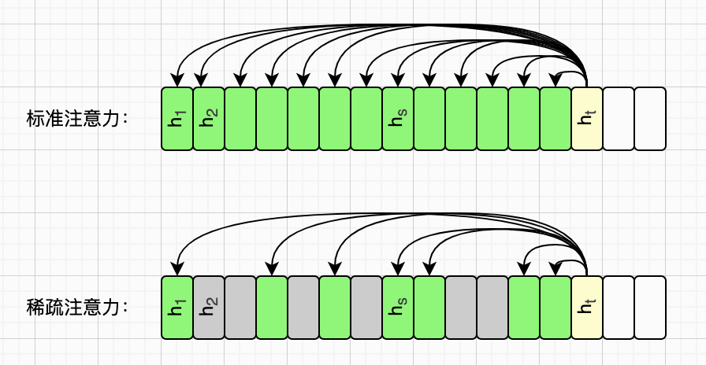
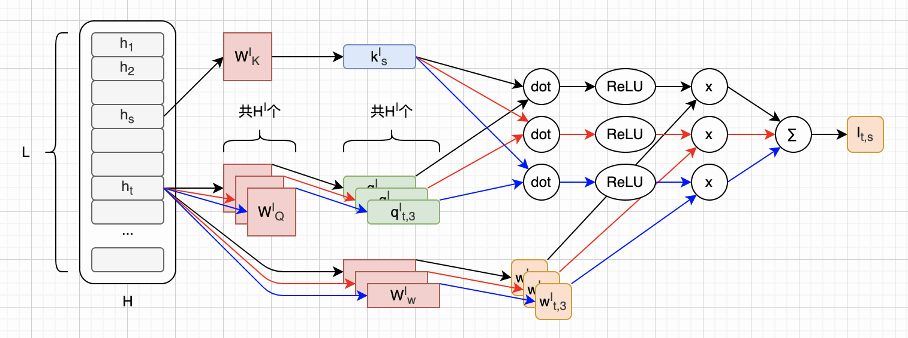
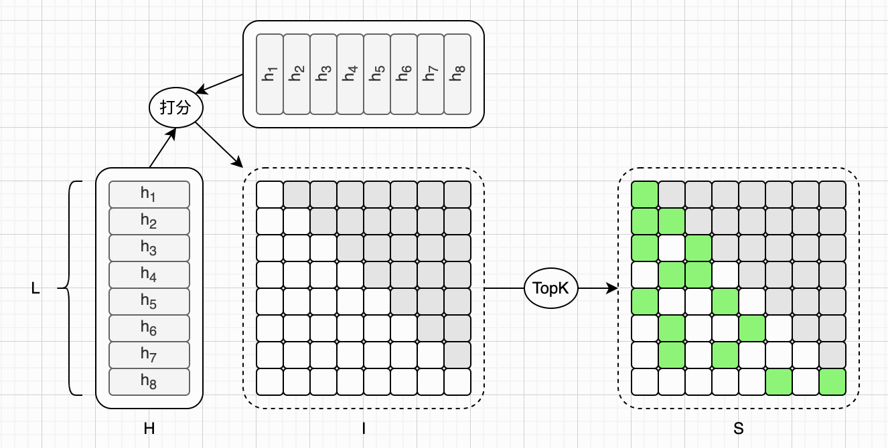
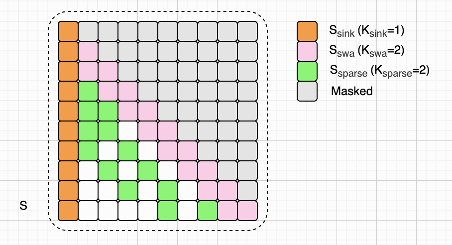
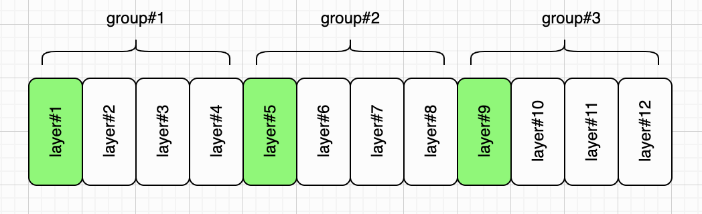
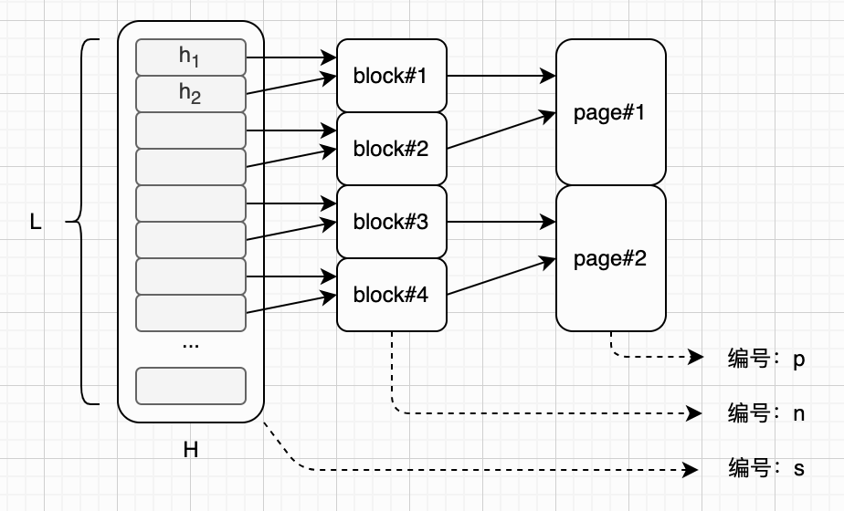
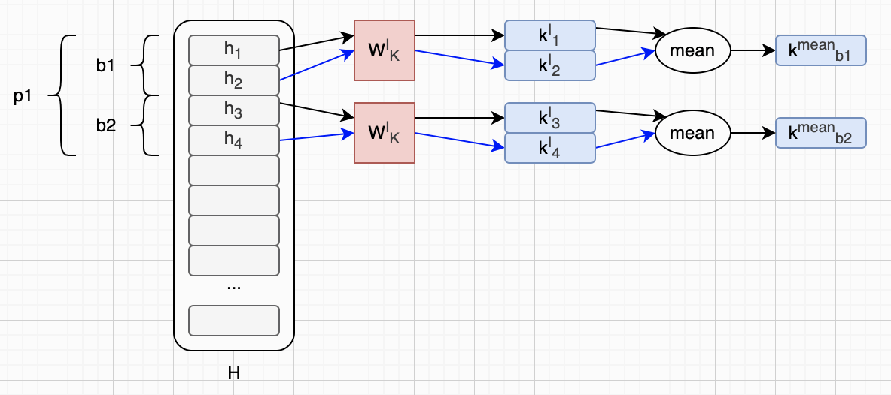
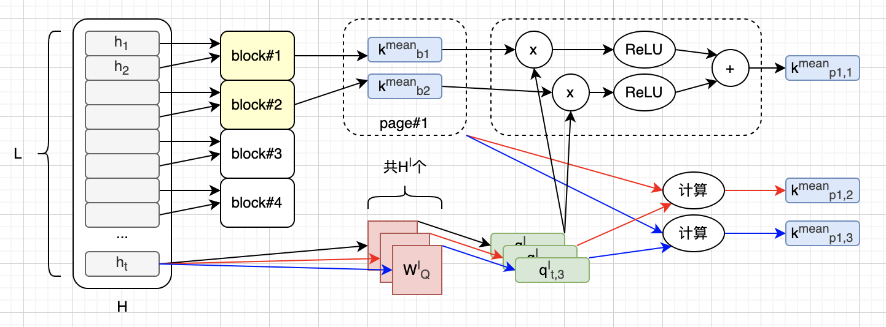
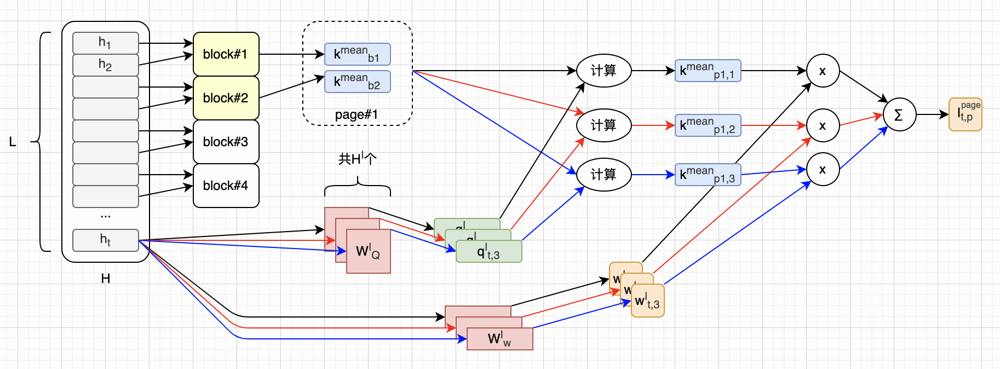

# 图解LongCat Sparse Attention

本文我们来解读[LongCat-2.0](https://longcat.chat/blog/longcat-2.0/)提出的稀疏注意力机制：**LongCat Sparse Attention**（简称LSA）。LSA建立在**DeepSeek Sparse Attention**（简称DSA）的基础之上。LongCat团队分析了DSA的一些缺点，并针对性地提出了三项优化。和以往的文章一样，本文重点在于解读LSA论文里的数学公式，以及理解模型在推理阶段的计算过程。模型的训练、优化等，不在本文讨论范围内。

本文跟随LSA论文的节奏，先简单回顾一下标准注意力机制，指出它存在的问题。然后介绍DSA，以及（LSA论文中指出的）它存在的问题。最后介绍LSA针对这些问题提出的三项优化。为了提高叙述一致性，本文将尽量采用LSA论文中的字母和符号风格。

本文假设读者已经对Transformer架构和标准注意力机制非常熟悉了，所以第一小节会直接给出该机制的公式，并指出它存在的问题。如果你还不是很熟悉标准注意力，建议先熟读2017年的经典论文（文末有链接）。我们在第二小节会讨论DSA，所以如果你不了解DSA也不影响阅读本文。不过，如果你对DeepSeek-V4模型感兴趣，可以看我之前写的[文章](https://zhuanlan.zhihu.com/p/2053601625491690393)。此外，作为横向对比，你也可以看一下我之前写的关于MiniMax Sparse Attention（简称MSA）的[文章](https://zhuanlan.zhihu.com/p/2059278715834652015)。

图解LLM系列的文章都没有用AI润色，文字都是自己敲的，图都是自己画的，原汁原味。不过我使用AI检查了错别字，还有很多不确定的地方，我也问了AI。如果AI回答的某些片段，我觉得可以直接用，会以引用的形式贴到文中，一眼就能看出来。由于我还在慢慢学习中，本文难免有错误和疏漏，如果你发现的话，可以在评论区告诉我，我会在下一版改进。

## 标准注意力机制

我们先从标准的注意力机制说起。如前所述，本文假设读者已经熟知经典的Transformer架构了，所以这里直接给出标准（单头）注意力机制的计算公式，也就是《Attention Is All You Need》论文里的公式（1）：

$$
\begin{aligned}
\text{Attention}(Q,K,V)=\text{softmax}\left(\frac{QK^\top}{\sqrt{d_k}}\right)V
\end{aligned}
\tag{A1}
$$

上面这个公式就不多解释了，这里再附上一张我用了好多次的示意图：

我们用`L`来表示输入序列的长度，很容易看出，标准注意力机制需要的计算量与 $L^2$ 成正比。换句话说，标准注意力机制的计算量是 $O(L^2)$ 复杂度。当输入序列很长的时候（比如100万上下文），这种二次方复杂度就成了问题。于是，各种优化方案被提了出来，试图降低注意力机制的计算复杂度，其中就包括本文将要介绍的稀疏注意力机制，大约可以把复杂度降低到 $O(LK)$ 。我们在下一小节会介绍`K`。

稀疏注意力机制只是对标准注意力机制做微调，并不改变计算公式。还有一类优化，通过修改标准注意力计算公式，可以直接把计算复杂度降低到 $O(L)$ ，因此被称为“线性注意力”。对线性注意力感兴趣的读者，可以看我之前写的介绍Kimi Delta Attention（简称KDA）的[文章](https://zhuanlan.zhihu.com/p/2069361821924975331)。下面我们先来讨论LSA的基础：DSA。

## DeepSeek Sparse Attention（DSA）

LSA论文在2.1小节大致介绍了稀疏注意力机制的发展轨迹，然后在2.2小节简单总结了DSA的工作机制，最后在2.3小节分析了DSA的瓶颈。这一小节我们会图解DSA核心公式，然后列出LSA论文里指出的性能瓶颈。

我们已经知道，标准注意力机制最大的问题，就是 $O(L^2)$ 计算复杂度。这是因为每一个token都要和它前面的所有token去算注意力分数，如下图（上）所示。而稀疏注意力机制，就是想各种办法，让每一个token只和它前面的一小部分token去算注意力分数，如下图（下）所示。

如果我们让每个token只和它前面的固定n（比如1024）个token去算注意力分数，这就得到了Sliding Window Attention（简称SWA）机制。SWA是最简单的稀疏注意力机制，不过它太简单粗暴了，所以到了DSA的时候，就采用了更复杂的token筛选机制。

### Indexer Scoring

总体而言，DSA稀疏注意力计算可以分为三步。一、打分；二、Top-K筛选；三、注意力计算。我们先来看打分阶段，下面是对应的计算公式，也就是LSA论文2.2小节里的公式（1）：

$$
\begin{aligned}
I_{t,s} = \sum_{j=1}^{H^I} w_{t,j}^I \cdot \mathrm{ReLU}\left(\mathbf{q}_{t,j}^I \cdot \mathbf{k}_s^I\right)
\end{aligned}
\tag{L1}
$$

我来解释一下这个公式，从右往左：

* $\mathbf{q}_{t,j}^I$ ，这里的**q**和**k**向量，作用和标准注意力机制里的同名向量类似。这里加上上标 $I$ ，以示区分。注意，indexer也是多头的，下标`j`表示indexer头的编号。下标`t`则表示token的编号。
* $\mathbf{k}_s^I$ ，同上，`s`表示被查询token的编号。这里**q**和**k**也是由输入（通过可学习权重矩阵）变换而来。注意，**k**只有一组，所以这里indexer做了和Multi-Query Attention（简称MQA）差不多的优化。
* `ReLU()`，**q**和**k**向量进行点积运算，然后经过`ReLU()`激活函数。
* $w_{t,j}^I$ ，权重值。跟**q**和**k**一样，也是由输入变换而来。`t`、`j`、`I`含义同上。
* $\sum_{j=1}^{H^I}$ ，每个indexer头算出一个分数，所有头加权求和。 $H^I$ 表示indexer头的数量。
* $I_{t,s}$ ，最后算出的indexer分数。如果我们忽略`s`下标， $I_t$ 就是一个向量，表示第`t`个token和它前面的所有token算出的分数集合。如果我们把`t`下标也忽略， $I$ 就是一个矩阵。下一小节有一个图，会把这个矩阵画出来。

在LSA论文里，并没有给上面提到的这些权重矩阵起名字。本文我们按照论文的风格，把它们叫做 $W_K^I$ 、 $W_Q^I$ 和 $W_w^I$ 。我们假设indexer头数为3，于是，上面的公式可以画成下面这样：

### Top-K Selection

有了打分以后，就可以进行Top-K筛选了。这个过程对应LSA论文2.2小节里的公式（2）：

$$
\begin{aligned}
S_t = \mathrm{arg}\ \mathrm{topK}\left(\{I_{t,s}\}_{s \le t},\ K\right)
\end{aligned}
\tag{L2}
$$

这个公式比较好懂，它定义了一个函数`topK()`，第一个参数是 $I_t$ 向量，第二个参数是`K`，结果是 $S_t$ 集合。这里的`arg`表示筛选出来的是分数最高的`K`个token的下标，而不是分数本身。`K`也就是前面提到过的、每个token参与注意力计算的KV项数量。我们可以用类似标准注意力机制的方式，把这个indexer打分矩阵 $I$ ，以及Top-K筛选后的矩阵 $S$ 画出来。我们取`L=8`，`K=2`，并用绿色表示选中的分数，那么打分和Top-K筛选过程可以画成下面这样：

### Sparse Attention

打分，并进行Top-K筛选之后，就可以进行稀疏注意力计算了。这里完全就是使用标准注意力计算公式，只是我们只对筛选出的K和V子集进行计算。这个过程对应LSA论文2.2小节里的公式（3）：

$$
\begin{aligned}
\mathbf{u}_t = \mathrm{Attn}\left(\mathbf{h}_t,\ \{\mathbf{c}_s \mid s \in S_t\}\right)
\end{aligned}
\tag{L3}
$$

上面这个公式里的 $\mathbf{c}_s$ 表示MLA（Multi-Head Latent Attention）压缩后的KV项。如果你不熟悉DeepSeek MLA，其实你忽略这个细节也行，把 $\mathbf{c}_s$ 换成 $\mathbf{k}_s$ 和 $\mathbf{v}_s$ 就可以了。如果你对MLA感兴趣，可以看看我之前写的[文章](https://zhuanlan.zhihu.com/p/2054251474260070710)。

到这里，DSA就介绍完了。不难看出，由于indexer打分机制和标准注意力机制很像，所以它的计算复杂度大致上也是 $O(L^2)$ 。只不过呢，跟标准注意力机制相比，DSA的indexer头数更少（大概只有注意力头数的一半）、indexer头的维度也更低（大概只有1/3）、而且支持FP8量化。所以，DeepSeek把它称为“Lightning Indexer”，意味着它速度飞快。

最后，由于相比标准注意力计算，“Lightning Indexer”的计算量可以忽略，于是DSA的整体计算复杂度就降低到了 $O(LK)$ ，其中`L`就是输入序列长度，`K`是筛选出的KV项数量。

### 计算瓶颈

不过呢，LongCat团队认为DSA也是有优化空间的。他们分析了DSA，并具体指出了两处性能瓶颈（见LSA论文2.3小节）：

> Bottleneck 1: Non-coalesced memory access arising from **Indexer Output Discontiguity**.
>
> Bottleneck 2: **High Indexer Overhead** from linear-scaling scoring and Top-K selection.

第一个瓶颈比较容易理解。标准注意力机制每次要算全部的KV，所以访问的是连续内存。而DSA需要访问的是不连续的KV项，对GPU不友好，所以可以优化。第二个瓶颈，是关于分数扫描和Top-K筛选的。对每一个token来说，这个计算开销大体上是 $O(L)$ 复杂度，如果`L`很大，这个开销也很大，可以优化。

针对第一个瓶颈，LSA提出了一项优化；针对第二个瓶颈，LSA提出了两项优化。我会在下一小节详细介绍这三项优化：

>**Streaming-Aware Indexing**: Improving Locality for Hardware-Aligned Coalesced Access
>
>**Cross-Layer Indexing**: Amortizing Indexing Overhead via Inter-layer Pattern Redundancy
>
>**Hierarchical Indexing**: Coarse-to-Fine Sparse Selection

## LongCat Sparse Attention（LSA）

前面提到的三项优化（流式感知索引、跨层索引、分级索引），加在一起就构成了LSA。下面我们分别来看这三项优化。

### Streaming-Aware Indexing（SAI）

这个优化用大白话说，就是把SWA（Sliding Window Attention）的思想，引入DSA。原本DSA就用了MQA（Multi-Query Attention）的思想，现在LSA把SWA思想也加入了进去。简而言之，就是把原先的稀疏区间分为三块：sink、swa和sparse，见LSA论文3.1小节里的公式（6）：

$$
\begin{aligned}
S_t = \underbrace{S_{\text{sink}} \quad \cup \quad S_{\text{swa}}}_{\text{fixed streaming budgets}} \cup S_{\text{sparse}}
\end{aligned}
\tag{L6}
$$

其中sink和swa区间是连续的，只有sparse区间是稀疏的。这三个子集里元素的数量加起来，正好等于`K`：

$$
\begin{aligned}
K_{\text{sink}} &= |S_{\text{sink}}|, \quad S_{\text{sink}} = \{1,\dots,K_{\text{sink}}\} \\
K_{\text{swa}} &= |S_{\text{swa}}|, \quad S_{\text{swa}} = \{t-K_{\text{swa}}+1,\dots,t\} \\
K_{\text{sparse}} &= |S_{\text{sparse}}|, \\
K &= K_{\text{sink}}+K_{\text{swa}}+K_{\text{sparse}}
\end{aligned}
\tag{\S3.1}
$$

这样，indexer打分和Top-K筛选的区间就缩小了，见LSA论文3.1小节里的公式（7）：

$$
\begin{aligned}
S_{\text{sparse}} = \mathrm{arg\ topK}\big(\{I_{t,s}\}_{s \notin S_{\text{sink}} \cup S_{\text{swa}}},\, K_{\text{sparse}}\big)
\end{aligned}
\tag{L7}
$$

在LSA论文里， $K_{sink}$ 取值`16`、 $K_{swa}$ 取值`1024`，这两个加起来大约等于 $K_{sparse}$ ，这样连续区间和稀疏区间的比例大约是`1:1`。这里我们取`L=10`、 $K_{sink}=1$ 、 $K_{swa}=2$ 、 $K_{sparse}=2$ 。于是，我们可以把经过SAI优化后的indexer打分矩阵用下面这个示意图表示：

### Cross-Layer Indexing（CLI）

这个优化比较好懂。简单来说就是把注意力层每`N`个分为一组，每组只有第一层打分，其余层就复用第一层的打分结果。这样，indexer的计算开销就变成了原来的`1/N`。在LSA论文里，`N=2`。这里我们取`N=4`，用绿色表示第一层（需要打分），那么CLI优化可以用下图表示：

### Hierarchical Indexing（HI）

前面两项优化，都是会影响到训练阶段的，例如需要增加额外的参数和微调。而这项优化是“training-free”，可以直接应用在训练好的模型上面。这项优化把打分过程拆成了两个阶段：

> Stage 1: Block-level coarse filtering.
>
> Stage 2: Token-level refinement.

#### Block-level coarse filtering

我们先来看块级别的粗粒度过滤，这个计算见LSA论文3.3小节里的公式（9）：

$$
\begin{aligned}
I_{t,p}^{\text{page}} = \sum_{j=1}^{H^I} w_{t,j}^I \cdot \sum_{n \in \text{page}_p} \mathrm{ReLU}\left(\mathbf{q}_{t,j}^I \cdot \mathbf{k}_n^{\text{mean}}\right)
\end{aligned}
\tag{L9}
$$

上面这个公式包含的信息量很大，所以我们一点一点来理解它。首先，我们需要把输入分成小块，每个块里包含`B`个token。然后再把块组成页，每页包含`P`个token，也就是`P/B`个块。这里我们取`B=2`、`P=4`（也就是每页2个块），则分块和分页逻辑可以表示成下图这样：

在上面的公式里，下标`p`表示页的编号，下标`n`表示页内块的编号，下标`t`和`s`表示token的编号。对于每个块，我们先把块里的**k**向量取均值，算出来 $\mathbf{k}_n^{mean}$ ，下面是公式：

$$
\begin{aligned}
\mathbf{k}_n^{\text{mean}} = \mathrm{mean}_{s \in \text{sub-block}_n} \mathbf{k}_s^I
\end{aligned}
\tag{\S3.3}
$$

上面这个计算 $\mathbf{k}_n^{mean}$ 的公式，可以画成下面这样：

我们再来看右边这个求和公式，我把它用红色高亮了（知乎公式渲染不支持修改颜色，所以我也加上了括号）：

$$
\begin{aligned}
I_{t,p}^{\text{page}} = \sum_{j=1}^{H^I} w_{t,j}^I \cdot
  \textcolor{red}{
    \underbrace{
      \sum_{n \in \text{page}_p} \mathrm{ReLU}\left(\mathbf{q}_{t,j}^I \cdot \mathbf{k}_n^{\text{mean}}\right)
    }
  }
\end{aligned}
\tag{L9}
$$

对于每一页（编号`p`），以及每一个indexer头（编号`j`），都可以根据上面高亮的这个求和公式算出来一个中间值。我们把这个中间值叫做 $\mathbf{k}_{p,j}^{\text{mean}}$ 。以第一页为例，这个计算过程可以表示成下面这样：

而完整公式的计算过程，可以用下图表示：

这个粗筛，其实就是按页筛选，最后只选出`M`个页。这`M`个页加在一起，就构成了下一步细筛的候选对象，见LSA论文3.3小节里的公式（10）：

$$
\begin{aligned}
\mathcal{S}_t^{\text{page}} &= \bigcup_{p\in\mathcal{P}_t}\bigcup_{n\in\text{page}_p} \text{sub-block}_n,\\
\text{where}\ \mathcal{P}_t &= \mathrm{arg\ topK}\left(\{I_{t,p}^{\text{page}}\}_{p\le \lceil t/P\rceil},\, M\right).
\end{aligned}
\tag{L10}
$$

可以看到，原来的打分空间是 $O(L)$ 复杂度，经过这样按页初筛后，打分空间降到了与`L`无关的 $O(M \cdot P)$ 。

#### Token-level refinement

按页初筛之后，就是细粒度打分。这里公式基本上没什么变化，只是计算空间大幅缩小。下面是LSA论文里给出的公式（11），只是对下标`s`进行了限制，你可以和前面介绍的公式（1）对比来看：

$$
\begin{aligned}
I_{t,s} = \sum_{j=1}^{H^I} w_{t,j}^I \cdot \mathrm{ReLU}\big(\mathbf{q}_{t,j}^I \cdot \mathbf{k}_s^I\big), \quad s \in \mathcal{S}_t^{\text{page}}.
\end{aligned}
\tag{L11}
$$

最后是更新后的Top-K公式，也就是LSA论文里的公式（12），你可以和前面介绍的公式（2）对比来看：

$$
\begin{aligned}
\mathcal{S}_{\text{sparse}} = \mathrm{arg\ topK}\big(\{I_{t,s}\}_{s\in\mathcal{S}_t^{\text{page}} \cap [1,t]},\, K_{\text{sparse}}\big).
\end{aligned}
\tag{L12}
$$

LSA论文指出，相比Top-K计算量，打分计算量可以忽略。粗筛（公式10）的计算复杂度，大致是 $O(L/P)$ 。细筛（公式12）的计算复杂度，大致是 $O(M \cdot P)$ 。于是，用上HI优化之后，总体的筛选复杂度从 $O(L)$ 降到了 $O(L/P + M \cdot P)$ 。

在LSA论文里，页大小`P`固定取值128（也就是一页128个token），块大小`B`和`M`则属于超参数。论文指出，`B=8`（即一页16个块）是比较合理的值。

## 总结

标准注意力机制的计算复杂度是 $O(L^2)$ ，成了采用经典Transformer架构的LLM提高上下文长度的主要限制。DSA（DeepSeek Sparse Attention）稀疏注意力机制通过“Lightning Indexer”打分和Top-K筛选，将计算复杂度降低到了 $O(LK)$ ，但仍然有优化空间。LongCat团队分析了DSA，指出了其中两处性能瓶颈，并针对性提出了三项优化。这三项优化加在一起，构成了LSA（LongCat Sparse Attention）。

本文跟随LSA论文的节奏，首先简单回顾了标准注意力计算公式，然后简要介绍了DSA的工作原理，最后介绍了DSA的瓶颈以及LSA的优化措施。由于篇幅以及能力的限制，本文只是重点讲解了DSA和LSA的核心公式，以及计算过程。还有大量的细节，本文并没有详细介绍。对这些细节感兴趣的读者，可以进一步阅读LSA论文。

## 主要参考资料

* 论文：[Attention Is All You Need](https://arxiv.org/abs/1706.03762)
* 论文：[DeepSeek-V3.2](https://arxiv.org/abs/2512.02556)
* 论文：[LongCat Sparse Attention](https://arxiv.org/abs/2608.01662)
* 博客：[Introducing LongCat 2.0](https://longcat.chat/blog/longcat-2.0/)

