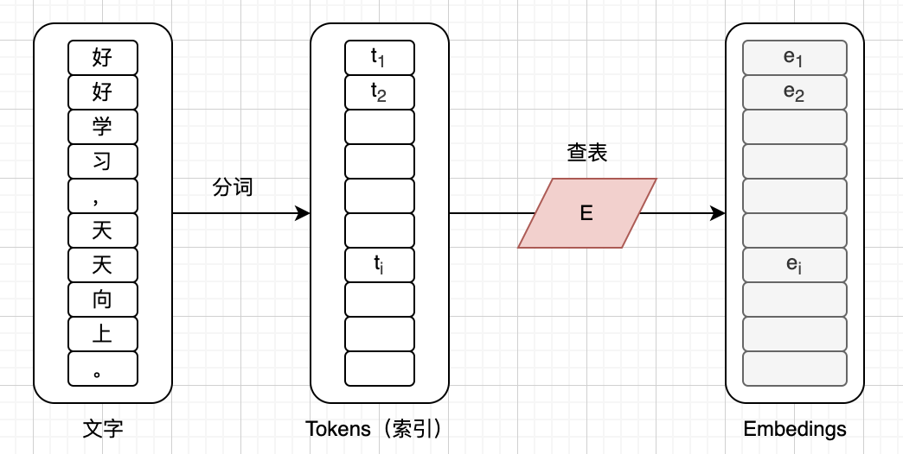
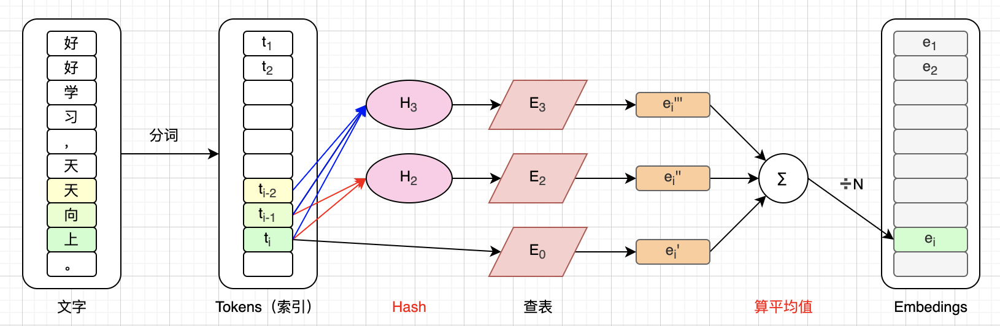
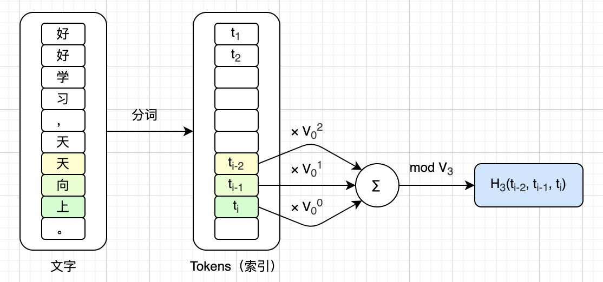
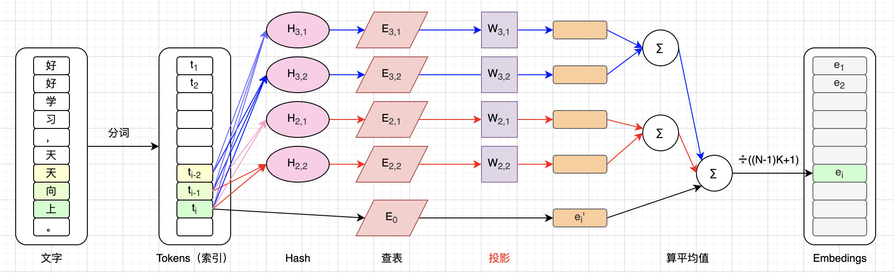

# 图解N-gram Embedding

在[前一篇文章](https://zhuanlan.zhihu.com/p/2074508069179074518)里，我们讨论了[LongCat-2.0](https://longcat.chat/blog/longcat-2.0/)在DSA（DeepSeek Sparse Attention）基础之上改进后的稀疏注意力机制：LSA（LongCat Sparse Attention）。这一篇文章我们介绍LongCat-2.0使用的另外一项技术：**N-gram Embedding**。

经典Transformer架构的标准模块，我们这个系列已经讨论得差不多了，包括：标准注意力机制和各种优化手段、FFN层和混合专家（MoE）、位置编码、残差连接，等等。不过对于词嵌入层，我们聊得比较少。因为相对于其他技术，词嵌入层好像太简单了，几乎没啥可说的。但实际上并不是这样的。

本文我们重点要介绍的是LongCat团队发表的论文：《Scaling Embeddings Outperforms Scaling Experts in Language Models》（文末有链接）。这篇论文的名字很直白地告诉我们：MoE扩展到一定程度后，再去扩展它收效甚微，还不如去扩展词嵌入层。

和以往的文章一样，本文重点在于解读这篇论文（后面简称**NgE论文**）里的数学公式，以及理解模型在推理阶段的计算过程。模型的训练、优化等，不在本文讨论范围内。另外，本文假设读者已经对Transformer架构、注意力机制、MoE、词嵌入等技术非常熟悉了。如果你还不熟悉它们，可以先读读相关论文，或者先看看这个系列前面的文章。

图解LLM系列的文章都没有用AI润色，文字都是自己敲的，图都是自己画的，原汁原味。不过我使用AI检查了错别字，还有很多不确定的地方，我也问了AI。如果AI回答的某些片段，我觉得可以直接用，会以引用的形式贴到文中，一眼就能看出来。由于我还在慢慢学习中，本文难免有错误和疏漏，如果你发现的话，可以在评论区告诉我，我会在下一版改进。

## 标准Embedding

这一小节我们简述一下Transformer架构里的标准Embedding层是如何工作的，我会尽量采用NgE论文里的字母和符号风格。

我们用`V`来表示大模型的**词汇表**大小（也就是**词汇量**），用`D`来表示词嵌入（隐藏向量）维度。以LongCat-2.0为例，`V=163840`，`D=8192`。我们用`E`来表示词嵌入查找表（简称**嵌入表**，Embedding Table），它其实就是一个`V`行`D`列的矩阵：

$$
E \in \mathbb{R}^{V \times D}
$$

查找表`E`很像一个权重矩阵，也是模型在训练过程中学习出来的。我们用下标`i`来表示输入token的序号，用 $t_i$ 来表示某个token在词汇表中的位置，用 $\mathbf{e}_i$ 来表示某个token对应的词嵌入向量，那么查表过程`E()`可以写成下面这个等式：

$$
\mathbf{e}_i = E(t_i)
$$

简而言之，输入文字首先被切分成许多token，每个token在词汇表中有一个序号，然后再用这个序号查嵌入表就可以得到最终想要的词嵌入向量。为了简化讨论，本文假设每个汉字对应一个token。那么整个embedding过程如下图所示：

## MoE的扩展问题

如前所述，NgE论文指出，当MoE扩展到一定程度的时候，再去扩展它，意义就不大了，还不如扩展embedding层。论文的第1小节对此进行了讨论，论文的第3小节还对比分析了扩展MoE和扩展embedding层的效果。本文不会展开介绍这些细节，感兴趣的读者可以仔细阅读这篇论文。接下来我们重点看论文的第2小节，也就是关于N-gram Embedding层的介绍。

## N-gram Embedding

这个N-gram Embedding，简单来说，就是把**滑动窗口上下文**的思想，引入到嵌入层。标准的嵌入层，每个token对应唯一的词嵌入（不管它前面的token是啥）。而N-gram Embedding，就是把某个token前面的token也考虑进去。如果只考虑前一个token，就是2-gram；如果考虑前两个token，就是3-gram；以此类推。

我们以“**好好学习，天天向上！**”为例，并且只看最后一个字：“**上**”。假设`N=3`，我们可以得到“**上**”、“**向上**”、“**天向上**”三个token组合（简称**词组**）。然后我们在原来的嵌入表之外再增加两个嵌入表，于是一共有了三个嵌入表： $E_0$ 、 $E_2$ 、 $E_3$ 。用三个词组分别查三个嵌入表，得到三个词嵌入向量，取平均值就得到了最终的词嵌入向量。注意，我们用 $E_0$ 来指代原始的嵌入表 $E$ ，它的词汇量是 $V_0$ ，也就是前面说的 $V$ 。另外，并没有 $E_1$ ，扩展嵌入表从 $E_2$ 开始。

不过这里有一个问题。由于原嵌入表词汇量 $V_0$ 本身就特别大（例如 `163840` ），而两个token可能的组合数量高达 $V_0^2$ ，三个token可能的组合数量高达 $V_0^3$ ，这个数量就更大了。如果扩展嵌入表 $E_n$ 要给每一种组合都留一行，它的形状就是 $V_0^n \times D$ ，这个参数量就太巨大了。为了解决这个问题，我们只给 $E_n$ 分配 $V_n$ 行（ $V_n$ 远小于 $V_0^n$ ），然后先给词组算一个**哈希值**，再用这个哈希值去查表。

以上就是N-gram Embedding大致的计算过程，对应论文第2小节里的公式（1）：

$$
\begin{aligned}
\mathbf{e}_{i}=\frac{1}{N}\left(E_{0}(t_{i})+\sum_{n=2}^{N}E_{n}\left(\mathcal{H}_{n}(t_{i-n+1},\dots,t_{i})\right)\right), \\
\text{where } t_{j} =0 \text{ if } j \le 0
\end{aligned}
\tag{F1}
$$

这个公式里的字母和符号我们大部分都介绍过了，只剩 $\mathcal{H}_n$ 需要说明一下，它表示前面提到的哈希函数。如果你觉得上面这个公式不好理解，可以看下面这个示意图：

论文中采用**多项式滚动哈希函数**（Polynomial Rolling Hash Function），下面是它的定义，对应论文第2小节里的公式（2）：

$$
\begin{aligned}
\mathcal{H}_{n}(t_{i-n+1},\dots,t_{i})=\left(\sum_{j=0}^{n-1}t_{i-j}*V_{0}^{j}\right)\bmod V_{n}.
\end{aligned}
\tag{F2}
$$

这个哈希函数，是把词组里每个token的序号当作系数，分别乘上原嵌入表词汇量 $V_0$ 的不同次幂，求和之后再对 $V_n$ 求余数。换个角度看，求和其实就是把这`n`个序号当成一个 $V_0$ 进制数，求余数则是把它压缩到扩展嵌入表的行数范围之内。我们取`N=3`，`n=3`，这个哈希函数的计算过程可以画成下面这样：

为了进一步增强模型的表达能力、减少哈希碰撞，我们可以把每个扩展的嵌入表分成`K`个**子嵌入表**。于是，我们一共得到了`(N-1) × K`个子扩展嵌入表，每一个子嵌入表的维度是`D/((N-1)K)`。由于子嵌入表的维度变小了，我们还需要通过一个线性变换，再把词嵌入的维度升到`D`。注意，子嵌入表可能有不同的词汇量。

概括一下：拆分之后，我们用 $E_{n,k}$ 来表示某个子嵌入表，用 $V_{n,k}$ 来表示它的词汇量，用 $\mathcal{H}_{n,k}$ 来表示它的哈希函数，用 $W_{n,k}$ 来表示它对应的线性投影矩阵。然后，我们可以更新前面的公式（1），得到论文第2小节里的公式（3）：

$$
\begin{aligned}
\mathbf{e}_{i}=\frac{1}{(N-1)K+1}\left(E_{0}(t_{i})+\sum_{n=2}^{N}\sum_{k=1}^{K}W_{n,k}E_{n,k}\big(\mathcal{H}_{n,k}(t_{i-n+1},\dots,t_{i})\big)\right), \\
\text{where } 
  E_{n,k} \in \mathbb{R}^{V_{n,k} \times D/\left((N-1)K\right)},
  W_{n,k} \in \mathbb{R}^{D \times D/\left((N-1)K\right)}
\end{aligned}
\tag{F3}
$$

上面这个公式看着复杂，但其实展开后和公式（1）差不多。我们取`N=3`、`K=2`，于是上面这个公式可以画成下面这样：

## 总结

本文简要回顾了标准Embedding层的计算，然后介绍了N-gram Embedding的核心公式。我觉得[LongCat-2.0](https://longcat.chat/blog/longcat-2.0/)对于N-gram Embedding的介绍挺好的，这里直接拿过来作为本文总结：

> LongCat-2.0 继承了 [LongCat-Flash-Lite](https://arxiv.org/abs/2601.21204) 的 N-gram Embedding，在同 MoE 正交的稀疏维度上扩展参数，从而提升参数利用效率。为适配 LongCat-2.0 的庞大规模，n-gram size 被设为 5；模型中包含 135B N-gram Embedding 参数，并遵循以下扩展原则：
>
> - **MoE 的稀疏度已越过甜点区。** 即便不考虑 N-gram Embedding，LongCat-2.0 的稀疏度就接近 97%，此时再增加 135B 专家参数所带来的性能收益较少。相比之下，增加同等参数量的 N-gram Embedding 所带来的收益远超标准MoE。
> - **N-gram Embedding 的占比被约束在最优区间。** 实验表明，当 N-gram Embedding 参数在总参中占比过高（超过 50%）时，其相对于扩增专家的优势会消失。在 LongCat-2.0 中，该占比被控制在 10% 以内，处于安全比例内。
>
> 这两条原则保证了 N-gram Embedding 相较同等规模的纯 MoE 模型的稳健优势。除此之外，在推理阶段，将参数从专家转移到 N-gram Embedding 可降低大 batch 解码时的显存 I/O，从而加速解码过程。

本文画的图都是以解读公式为主要目的，LongCat-2.0关于N-gram Embedding的介绍附带了一张示意图，站在宏观角度描述了N-gram Embedding的工作原理。这里附上这幅图，供读者参考：

## 主要参考资料

* 论文：[Attention Is All You Need](https://arxiv.org/abs/1706.03762)
* 论文：[Scaling Embeddings Outperforms Scaling Experts in Language Models](https://arxiv.org/abs/2601.21204)
* 博客：[Introducing LongCat 2.0](https://longcat.chat/blog/longcat-2.0/)

