# 图解LLM（大白话版）

图解LLM这个系列的其他文章，解读的都是LLM相关的论文和公式。这一篇不一样，它是面向普通人的，是我站在一个LLM用户的角度去写的科普文章。我不讲复杂的数学公式，也不贴代码，我们从大家天天都在用的拼音输入法说起，一路聊到你正在用的豆包、DeepSeek到底是怎么工作的。如果你是程序员，或者已经了解LLM的大部分术语，那么可以跳过本文，直接去看该系列其他文章。

图解LLM系列的文章都没有用AI代笔，文字都是自己敲的，图都是自己画的，原汁原味。不过我使用AI检查了错别字和病句，还有很多不确定的地方，我也问了AI。如果AI回答中的某些片段我觉得可以直接用，会以引用的形式贴到文中，一眼就能看出来。由于我还在慢慢学习中，本文难免有错误和疏漏，如果你发现的话，可以在评论区告诉我，我会在下一版改进。

## 从输入法说起

我们先从大家都熟悉的电脑（或手机）中文拼音**输入法**开始说起。比如说我要写一段话：“**好好学习，天天向上！**”。我打开输入法，先输入拼音“hao”。输入法会给我一些建议，把它认为最合适的字排在最前面，如下图第1行所示。接着我再输入拼音“hao”和“xue”，到目前为止我的输入法猜测得都不错，如下图第2、3行所示。

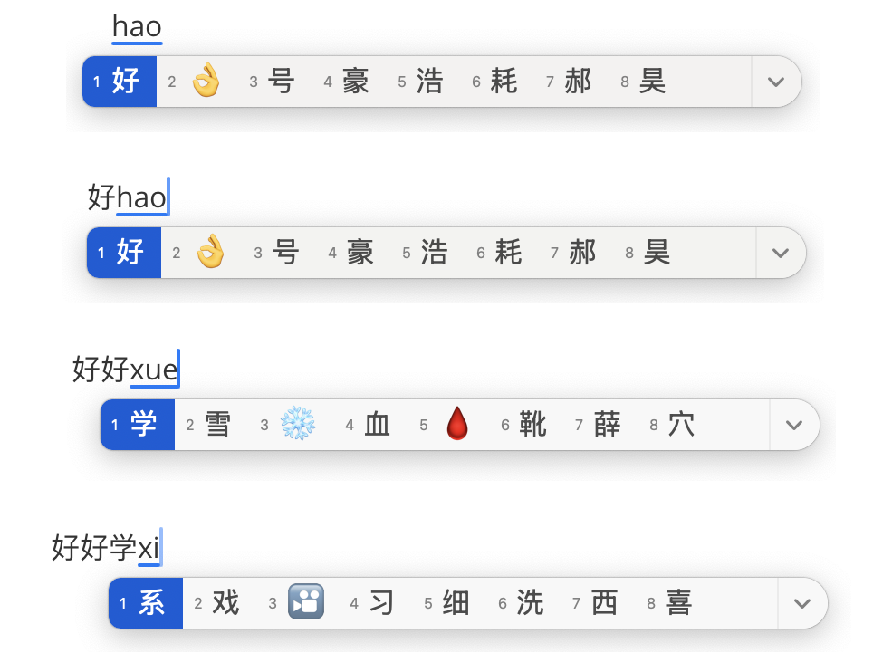

可是在我输入“xi”的时候，情况变了。按道理“习”应该排第一才对，但实际情况并不是这样，如上图第4行所示。这是为什么呢？因为输入法并没有刻意去记住我前面写了哪些文字。对它来说，我输入的每个字（基本上）都是**独立**的，互不影响。

## 上下文（Context）

那如果我的拼音输入法可以记住我前面打过的字，是不是就可以提高**预测**的准确率？换句话说，就是把最合适的字，尽量排在最前面。答案是肯定的。只是这样做的代价也特别大，所以普通的拼音输入法都不会这样去做。

由于我们大部分时候都是按顺序打字的，也就是一个接一个地敲，所以我们把某个字前面的文字叫做它的**上下文**（Context）。注意啦，这里的上下文，准确地说，其实就是“**上文**”而已。因为我们正在打的这个字，它后面还空空如也，“**下文**”还在我们的脑袋里。

## 人类智能（Us）

好的，我们可以忘掉拼音输入法了。想象一下这个场景：

我问你：**“好好学习，天**”，后面跟啥字？你可能会告诉我“**天**”。

我问你：“**好好学习，天天**”，后面跟啥字？你可能会告诉我“**向**”。

我问你：“**好好学习，天天向**”，后面跟啥字？你可能会告诉我“**上**”。

我问你：“**从前有座山，山里有个**”，后面跟啥字？你可能会告诉我“**庙**”。

好吧，你可能觉得太简单了。

我问你：“**牛顿第一定律是：**”，后面跟啥字？我相信你可以回答上来。

我问你：“**宇宙的终极奥秘是：**”，后面跟啥字？我觉得你大概率不知道😄。

简而言之，我给你一个**上下文**，让你说下一个字，然后反复。只要你知识足够渊博，而且愿意配合我，我就能通过这种**问答**方式得到我想要的**任何**信息。就像下图这样：

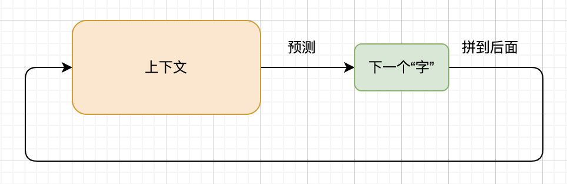

上面这个循环非常强大！很可能远超你的想象。如果有一台机器，可以像人一样，通过给定的上下文预测下一个字，那么这台机器就会（在某种程度上）表现出人类的智慧！

如果人类评判者，通过文字聊天，**无法区分对面是人还是机器**，那就认为这台机器具备了智能。这就是大名鼎鼎的**图灵测试**（Turing Test）。

## 人工智能（AI）

但是你肯定不会配合我，原因有三：

* 你知识不够渊博。而且不光你，任何一个正常人都不可能掌握全人类积攒的所有知识。
* 你不够耐心。我每次只让你说一个字，你很快就烦了（不打我就算不错了😊）。
* 就算你恰好能回答我的问题，也足够有耐心，这样的沟通效率还是太低了。

所以我们需要**人工智能**（Artificial Intelligence，简称**AI**）：掌握了大量人类知识（甚至会画画、创作音乐、制作视频）、从不拒绝人类（但可能会要求你付费）、效率非常高（比如每秒产生几十上百个字）的计算机软件或者机器。

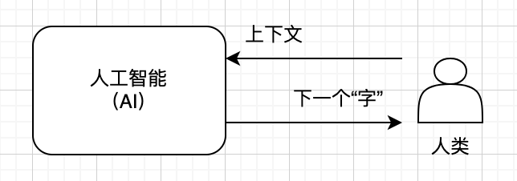

## 机器学习（ML）

那么如何制造出这种可以通过上下文预测下一个字的AI呢？目前主流的办法就是**机器学习**（Machine Learning，简称**ML**）。你不需要知道这种办法的细节，你只需要知道为了达到这个目的，需要海量的资料（几乎涵盖全人类所有的知识），以及超级强大的计算机（比如GPU集群）。这个只有大公司能办得到。

站在人类的角度，通过海量数据让AI变聪明的过程，叫做**训练**（Training）。站在AI的角度，汲取知识变强的过程，叫做**学习**（Learning）。这两个过程是同一枚硬币的两面，如下图所示：

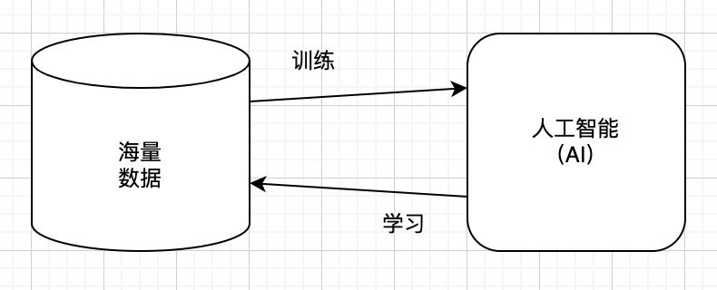

## 人工神经网络（ANN）

机器学习也有许多方法，目前主流的方法叫做**人工神经网络**（Artificial Neural Networks，简称**ANN**）。简单来说，ANN是在模拟人类的大脑。成年人的大脑大约有860亿个神经元，它们构成了一张复杂的神经网络。而能和你对话的AI，内部也有大量的**人工神经元**（Artificial Neuron），它们彼此相连，这就构成了人工神经网络，类似下面这样：

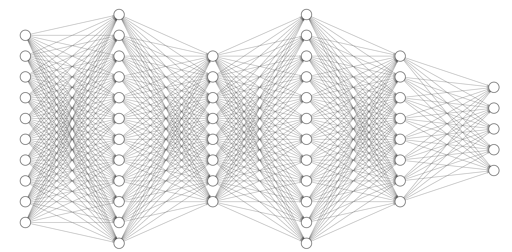

类似上面这种典型的人工神经网络有许多**层**（Layer），信息一层一层传递。这种多层神经网络又叫做**深度神经网络**（Deep Neural Networks，简称**DNN**），使用DNN的机器学习就叫做**深度学习**（Deep Learning，简称**DL**）。

不要被前面这些词吓到，因为你不需要懂它们的原理。但是有一个概念你需要知道，那就是**参数数量**。我们可以把上面这张图想象成一个**机器大脑**，每个小圆圈都是一个**机器神经元**，这些密密麻麻的连线表示神经元之间的**连接**。我们还可以给每个连线附带一个0～1之间的数字（例如`0.534`），表示它的粗细，也就是两个神经元之间的关联强度。通过调整这些数字，我们就可以控制神经元的连接，最终就能调整出一个聪明的机器大脑。

我们可以粗略地把控制连线粗细的数字叫做这个机器大脑的**参数**（Parameter），而所有连线的总数量就是它的总**参数数量**。你只需要知道，大致上，机器大脑的总参数量**越大**，它就**越聪明**。你可能使用过或听说过DeepSeek-V4-Pro，它大概拥有**1.6万亿**个参数！

## 大语言模型（LLM）

那么有没有一种机器，给它一个上下文，就可以**完美**地预测出下一个字呢？理论上也许是存在的，但是实际上我们造不出来。前面说的，通过机器学习 + 神经网络制造出来的AI，只是大致能工作而已。这种AI谈不上完美，但是凑合能用。我们把这种距离完美“下一个字预测器”还有一定距离，但勉强能用的神经网络（更准确点说是全部参数+规格说明），叫做**模型**（Model）。

AI未必就是专门处理文字的，比如说也可以专门处理视频、图像、声音等信息。我们把专门处理文字，也就是人类语言的模型，叫做**语言模型**（Language Model）。我们把参数数量非常巨大（比如100亿以上）的语言模型叫做**大语言模型**（Large Language Model，简称**LLM**）。

如今，LLM已经遍地开花了。你使用过或者听说过的LLM很可能包括：GPT、Gemini、Grok、LLaMA、Claude、DeepSeek、Qwen、Kimi、GLM、MiniMax，等等。而这些模型的最新版本，普遍都支持**百万字**上下文。你把《红楼梦》前80回丢给LLM，让它续写也不成问题。

前面提到的模型参数，有时候也被称为模型的**权重**（Weights）。以上这些模型，有些（比如GPT）是大公司的机密，它们只会提供服务让你使用。另外一些（比如DeepSeek）则把架构设计、规格说明连同全部的参数都公开了，任何人都可以下载部署（也需要相对强大的机器）。这种公开设计细节和参数的模型，通常被叫做**开放权重模型**（Open Weight Model）。

为了简化文字，后文可能会混用模型、大模型、大语言模型、LLM。在本文的讨论范围里，它们基本上都代表相同的含义。

## 词元（Token）

你可能以为LLM和人一样，也是以单词（英文），或者汉字（中文）为单位，来理解文字的。对于英文（或者其他字母语言）来说，按空格把句子拆分成单词（或者标点符号）是很容易的事。对于中文来说，每个字（或者标点符号）天然就是独立的单位。

但其实并不是这样，LLM是以更细粒度的**词元**（Token）为单位来理解文字的。实际上，LLM唯一能够理解的，既不是字、单词，也不是词元，而是**数字**。不过为了不牵扯太多细节，我们不展开讨论这一点。我们暂时认为LLM以词元为单位思考就足够了。

那什么是词元呢？这里我就不定义这个术语了，我举几个例子你就明白了。比如说英文单词`unhappiness`，可能会被拆分成两个词元：`un`和`happiness`。再比如英文单词`understanding`，也可能会被拆分成两个词元：`understand`和`ing`。把一段文字拆分成词元的过程叫做**分词**（Tokenization）。平均来说，每个单词大约对应1.3～1.5个词元。

汉字的情况又不太一样，因为一个汉字没法像英文单词那样再拆分。但是，常用的词可能会被优化为一个词元，比如“**学习**”、“**工作**”。所以，平均来说，每个汉字可能会对应0.55～0.67个词元。

其实每个单词、汉字，或者标点符号对应几个词元并不重要。重要的是你要知道，你使用的AI工具，都是按**词元**来收费的，并不是按字数。每个LLM都有自己的**词汇表**（Vocabulary），里面收录了常用字词所对应的词元。生僻的内容则会被拆成很细碎的片段，不但更费词元，模型理解起来也更吃力。

总结一下到目前为止我们掌握的信息。上下文首先被切分为词元序列，然后输入LLM。之后LLM内部通过神经网络进行一系列复杂计算，给我们预测出下一个词元。整个过程如下图所示：

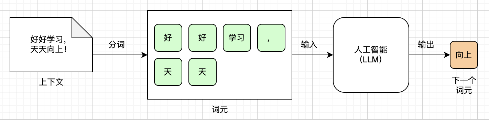

## 条件概率（Conditional Probability）

讨论到这里，我们可以来聊点**数学**了（别害怕，不多）。前面我们一直说LLM可以根据给定的上下文，预测下一个词元。这个描述其实并不准确。实际上，LLM会给出全部词汇表里每一个词元的**概率**，而这些概率加起来正好等于1。如果我们每次只挑概率最高的那个词元，正好就是前面描述的“预测下一个词元”的效果。

还是以“好好学习，天天”为例，把这个上下文作为输入，LLM可能会输出：“向上”的概率=0.91、“不”的概率=0.04、“年”的概率=0.02、“爱”的概率=0.01，等等。整个过程如下图所示：

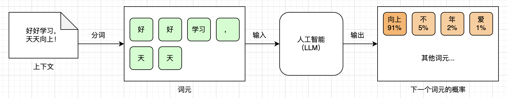

如果你的高中数学知识还没忘光，可能已经想起来了：这不就是**条件概率**吗？给定上下文，下一个词元出现的概率为： $P(\text{某个词元} | \text{上下文})$ 。LLM的训练过程，本质上就是让LLM在海量数据中学习这个概率分布知识。

如果你完全不懂条件概率也没太大关系。你只要明白，LLM能做的事情，就是通过你给它的上下文词元，预测出下一个词元的概率分布。然后我们再通过某种方式利用这个概率分布，选出一个词元来，拼接到原来的上下文后面，继续喂给LLM，如此往复。这就是和豆包、DeepSeek聊天时，背后发生的事情。

## 采样（Sampling）

从上一小节可知，我们需要从LLM的输出中，根据所有词元的概率分布（总和为1），选出一个词元，这个过程就叫做**采样**（Sampling）。加上采样之后，整个预测过程如下图所示：

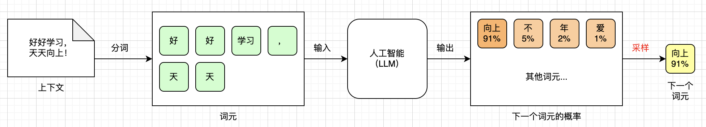

最简单的采样办法，就是每次都选概率最高的那个词元。这样的话，理论上，同样的输入会得到同样的输出。但我们使用的LLM（比如豆包、DeepSeek）显然不是这样的。你问豆包或者DeepSeek同样的问题，每次都可能会得到不同的回答。

这是因为豆包或者DeepSeek这样的服务，会使用**温度值**来调整下一个词元的概率分布。你可以认为温度值控制着LLM的“脑洞”大小。温度值越大，LLM思维就越活跃，回答越发散，更有创造力。温度值越小，LLM就越死板，回答越保守，更像背书本。再搭配上**Top-K**或者**Top-P**采样法，LLM就表现出了随机性。

关于温度值，以及Top-K/Top-P采样法，这里就不展开讨论了，你只要知道它们让LLM表现得更像人类就可以了。但是有一件事你必须了解，那就是LLM会产生**幻觉**（Hallucination）。如果你使用LLM的过程中发现它一本正经地胡说八道，也别奇怪，毕竟它只是个概率模型——它只负责预测下一个词元，并不会核对自己说的是不是事实，随机采样则会让这个问题更突出。总之，LLM的回答，你自己一定要核实，不能轻易相信！

## 后训练（Post-Training）

回忆一下前面“机器学习”那一小节，我们讨论了AI的“训练”和“学习”。现在我们掌握了更多的知识，可以稍微深入再聊一下这一点。

我们已经知道，对于LLM来说，它掌握的是文字之间隐藏的条件概率。所以简单来说，我们只要把各种知识收集起来，然后丢给AI让它自己去学习规律就可以了。这种不需要人类来处理数据，直接让AI自己领悟的方法，叫做**无监督学习**（Unsupervised Learning）。

通过无监督学习训练出来的模型可以用，但不好用。比如说，模型的回答可能会混合中英文或其他语言、可能会夹杂各种术语和公式、可能啰嗦或者长篇大论、甚至可能语言粗鲁或者包含有害信息。为了解决这些问题，我们需要通过人工精挑细选一些训练资料，然后让模型继续学习这些数据。由于这些数据需要人工标注，所以我们把这一过程叫做**监督学习**（Supervised Learning）。

现在，我们可以把整个模型的训练过程大致分为两个阶段。第一个阶段就是之前介绍的无监督学习，我们把它叫做**预训练**（Pre-Training），得到的是**基础模型**（Base Model）。在此基础之上，我们再进行监督学习，得到一个好用的模型，我们把这个阶段叫做**后训练**（Post-Training）。

具体而言，其实后训练又可以细分为几个阶段。例如：监督微调 + 偏好对齐。所谓**监督微调**（Supervised Fine-Tuning，简称**SFT**），主要是让基础模型能够很好地服从各种指令、统一语言和格式，等等，总之就是让模型变得好用。而**偏好对齐**（Preference Alignment），主要就是避免模型输出有害信息，符合人类价值观。

现在我们把完整的训练过程画出来，如下图所示：

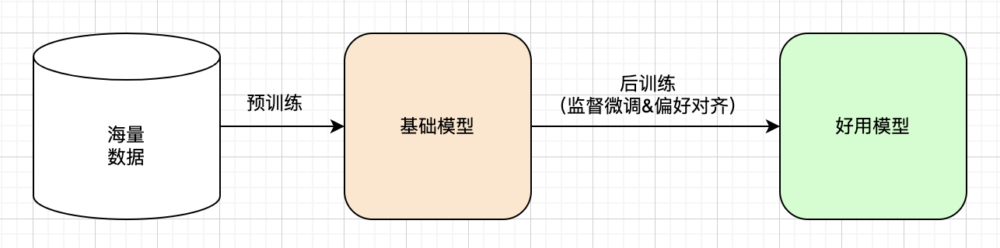

## 聊天机器人（ChatBot）

前面介绍了一大堆的理论和概念，现在终于可以聊**应用**（App）了。我们已经了解了LLM的基本技术原理，那怎么用它来干活儿呢？这个问题，我相信大部分读者都可以回答出来。因为我们日常生活中可能已经离不开大模型了，也许你时时刻刻都在用它，只是你未必知道这个应用的技术名称：**聊天机器人**（ChatBot）。

是的，LLM的第一代应用，就是聊天机器人。你每天在用的豆包、元宝、DeepSeek、Kimi等，本质上都是LLM聊天机器人。互联网大公司基本上都训练了自己的大模型，然后跑在自己的硬件集群上，对内或对外提供LLM服务。这些大公司又开发了自己的聊天机器人服务，提供给普通用户使用，如下图所示：

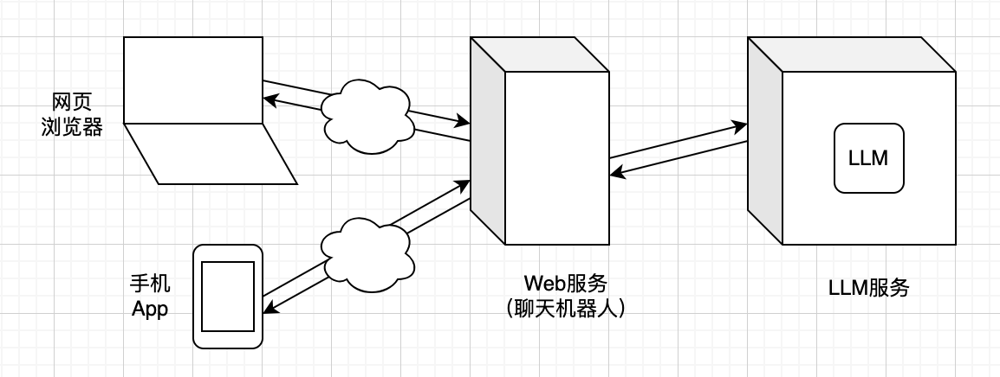

于是乎，最尖端的AI技术，在经过无数科技公司、计算机科学家、程序员、工程师等日复一日的钻研、试错与迭代之后，就免费（也许是暂时）提供给每个人使用，触手可及。曾经需要庞大算力集群、专业团队才能触碰的智能能力，如今普通人打开网页或手机就能调用。不必拥有昂贵的硬件，不用精通复杂算法，写作、推理、编码、答疑，这些前沿能力直接交到普通人手中。

## 提示词（Prompt）

除了LLM，聊天机器人背后的技术，其实并不复杂。不过如果你不是程序员的话，也没必要去了解它。但是有一个概念，你必须了解，那就是**提示词**（Prompt）。

我们知道，LLM学习了海量的数据，掌握了大量的知识。但是它也存在局限性，最大的问题有三个：

第一，它没有自己的记忆系统。举个例子，你问LLM一个问题，它会回答。但是你让它回忆你问过的问题，它根本就想不起来。对于LLM来说，你的每一次提问，都是独立的。

第二，它无法自己获取新知识。举个例子，如果某个LLM学习了截至2026年8月31日的国内电影票房数据，那么你问它9月份的电影票房情况，它是回答不出来的。这个叫做LLM的**知识截止日期**（Knowledge Cutoff）。

第三，它只能回答问题，除此之外啥也做不了。举个例子，你让LLM帮你运行一段Python代码，看看输出是啥，它做不到。它只能帮你分析代码，推测结果是啥。

而聊天机器人，在某种程度上解决了这些问题。对于第一个问题，聊天机器人会帮你管理LLM**会话**（Session）。简单来说，就是把你和LLM的沟通历史全部保存下来。然后你的每一个新问题，都会被拼接到历史记录后面，然后再发给LLM。

聊天机器人帮你管理的对话历史，就是完整的**LLM上下文**。而你的提问，就是所谓的**提示词**。完整上下文和用户提示词的关系，如下图所示：

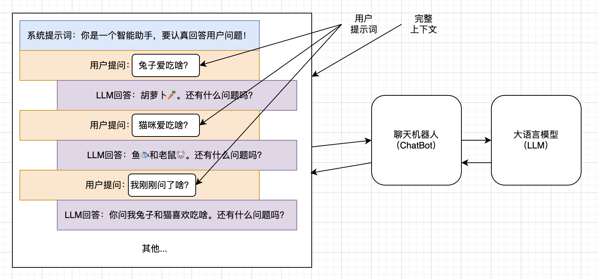

对于第二个问题，目前主流的聊天机器人，通常都会提供Web搜索功能。当LLM发现用户的问题超出自己的知识范围后，就会告诉聊天机器人，需要借助搜索引擎去搜索资料。然后聊天机器人会代劳，去搜索信息，然后把搜索结果再告诉LLM。掌握了最新信息之后，LLM继续工作，得到最终结果。这个过程如下图所示：

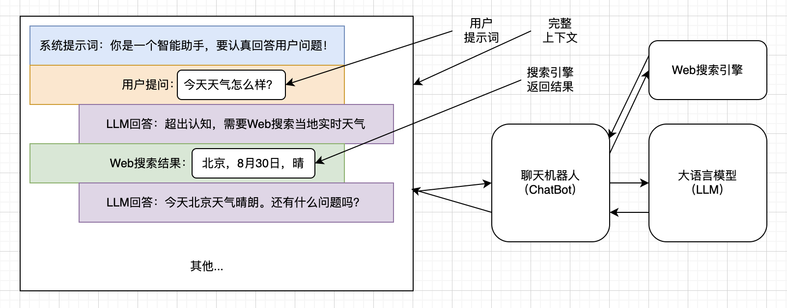

对于第三个问题，其实聊天机器人能做的也有限。像代码执行等简单的任务，聊天机器人是可以提供内置支持的。但是更复杂的任务，例如编辑电脑文件、发送邮件、通过IM软件发送消息等，就无能为力了。这些是第二代LLM应用要解决的问题，见下一小节。

说到提示词，大家肯定听说过**提示词工程**（Prompt Engineering）。这是在早期LLM推理能力不足、上下文窗口受限的背景下诞生的，当时需要精心设计指令、补充示例来弥补模型短板。而如今经过微调与对齐的现代大模型，指令理解能力大幅提升，普通场景下很多花哨的提示技巧已经不需要太考虑，直白表达需求即可。（但在系统提示、Agent开发等专业场景中，提示词依旧十分重要。）

## 智能体（Agent）

有了强大的LLM，只用来做个聊天机器人，是远远不够的。实际上，研发和部署LLM的公司，也早早意识到了这个问题，所以也都开放了LLM的API（应用程序编程接口），对外提供服务。由于本文主要面向普通人而非程序员，所以这一小节我们仍然是点到为止。你只要知道，程序员们可以通过API来访问LLM服务，这样他们就可以开发自己的应用。

就这样，第二代LLM应用爆发了，那就是**智能体**（Agent）。聊天机器人主要是跑在大公司的服务器上，你通过网页浏览器或者手机App访问。智能体则不同，它可以跑在你自己的电脑上。你要自己安装，然后授权它操作你的电脑，如下图所示：

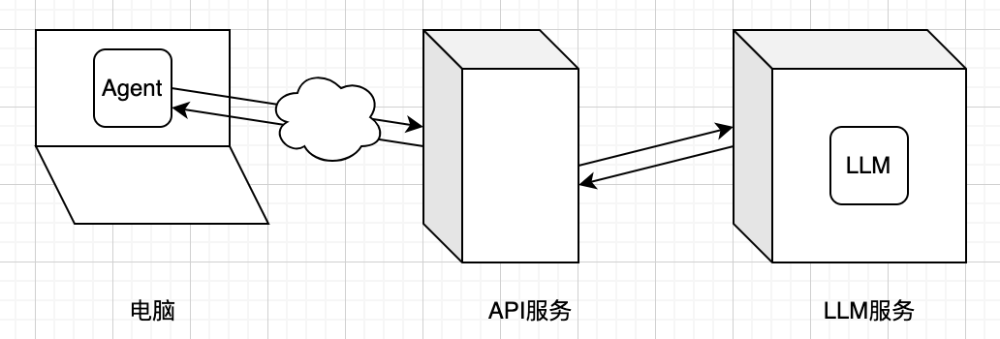

由于这样的智能体跑在你自己的电脑上，所以它可以读写你的本地文件、替你整理资料、帮你收发邮件，甚至能接管你的IM聊天工具，几乎无所不能。当然了，这一切都需要你的授权。智能体的本质，就是利用LLM作为大脑来思考，然后把LLM的指令落实为具体的操作。除了读写文件、Web搜索等内置能力，智能体还可以利用各种工具，所以理论上它的能力是没有上限的。下面这个示意图粗略展示了智能体查邮件的过程：

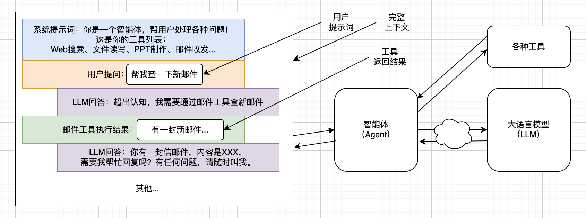

大家还记得今年年初异常火爆的龙虾（OpenClaw），以及目前正流行的爱马仕（Hermes）吗？它们就是智能体的代表。你可能也听说过Copilot、Cursor、Claude Code、Codex、CodeBuddy等，它们是程序员专门用来写代码的智能体，效果非常不错。此外Coze、WorkBuddy等智能体，普通人也很容易上手，如果你还没有体验过，一定要提上日程！

## 技能（Skill）

和聊天机器人沟通时，由于我们只是处理一些问答、调查、翻译、润色、写作等相对简单的任务，所以写的提示词也通常都比较简单，不需要太花里胡哨。

但是在使用智能体时，我们处理的任务往往都比较复杂，例如编写大型软件项目、完整地写一本书、处理复杂的工作流，等等。这时候，我们就需要写比较复杂的提示词。而且，我们经常要处理相似的任务，用到相同的提示词。那么与其每次都把复杂的提示词复制+粘贴，不如把它们保存成文件、起好名字、放到某个地方，需要的时候，让智能体自己加载。我们积累下来的这些复杂提示词文件，就叫做**技能**（Skill）。

以写作为例，下面这个示意图粗略展示了智能体写剧本的过程：

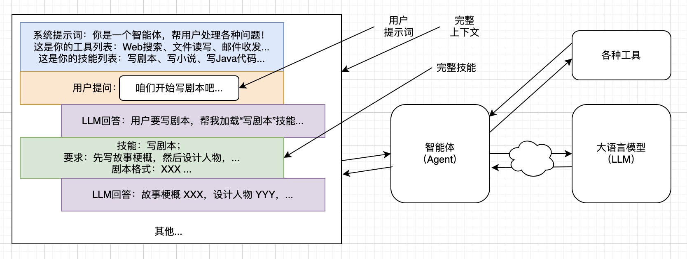

技能这套规范最早由Anthropic在Claude Code中提出，推出之后便快速在AI社区得到普及，如今市面上绝大多数智能体产品都对其提供支持。这套标准统一了技能的描述与调用方式，大大降低了开发门槛，人人都可以制作专属技能，并且能够便捷地分享出来，供给其他人直接使用，由此也催生了不断壮大的第三方技能生态。

## 总结

这篇文章已经太长了，我原本以为一上午就可以写完，结果整整花了一个周末的时间。由于目标读者是普通人，所以有许多的技术细节都没有展开讨论。还有一些技术名词，例如RAG、MCP、Vibe Coding、Harness Engineering等，由于太专业了，就直接跳过了。因为表达能力有限，本文肯定也有很多描述不准确的地方。但是作为科普文章，我觉得勉强是可以接受的。

感谢你读到最后。希望读完本文后，每天都在使用LLM的你，可以对LLM有一个更深入的了解。
