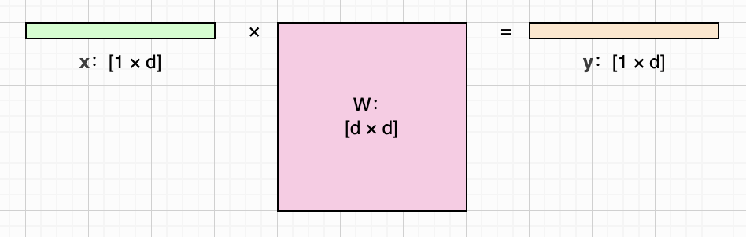
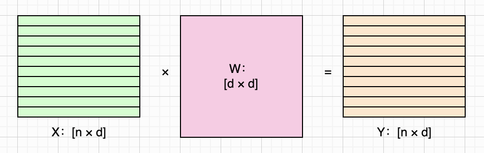
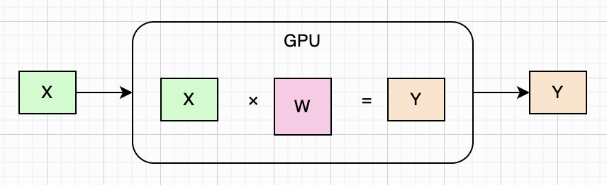
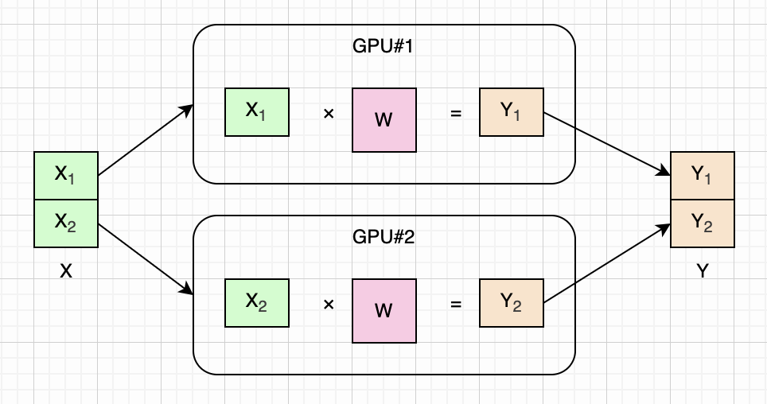
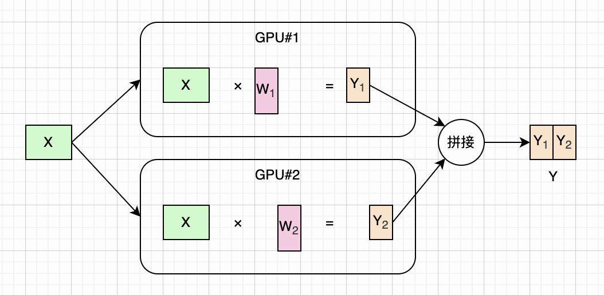
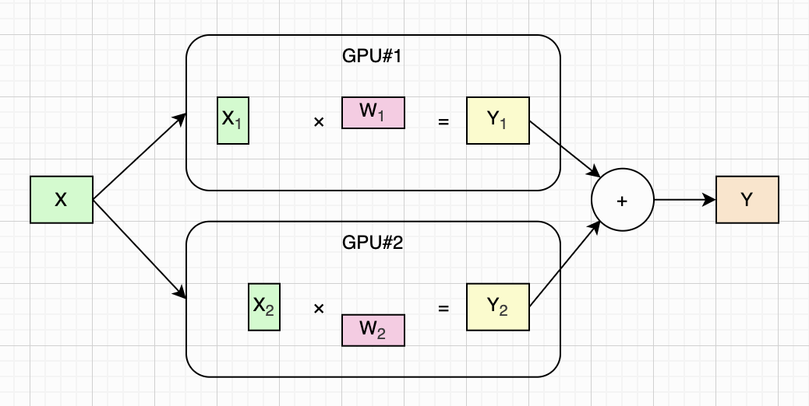
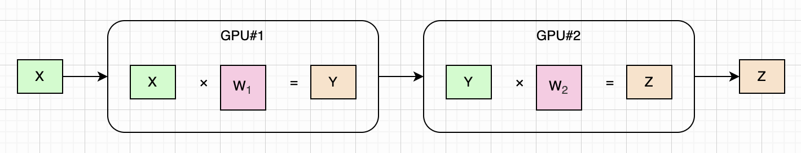
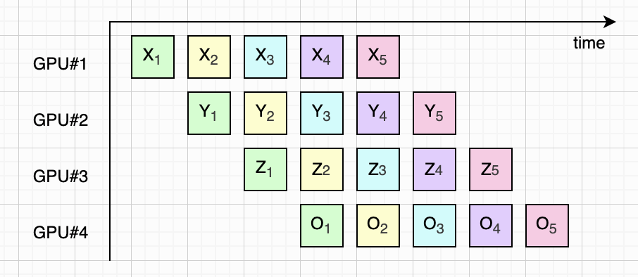
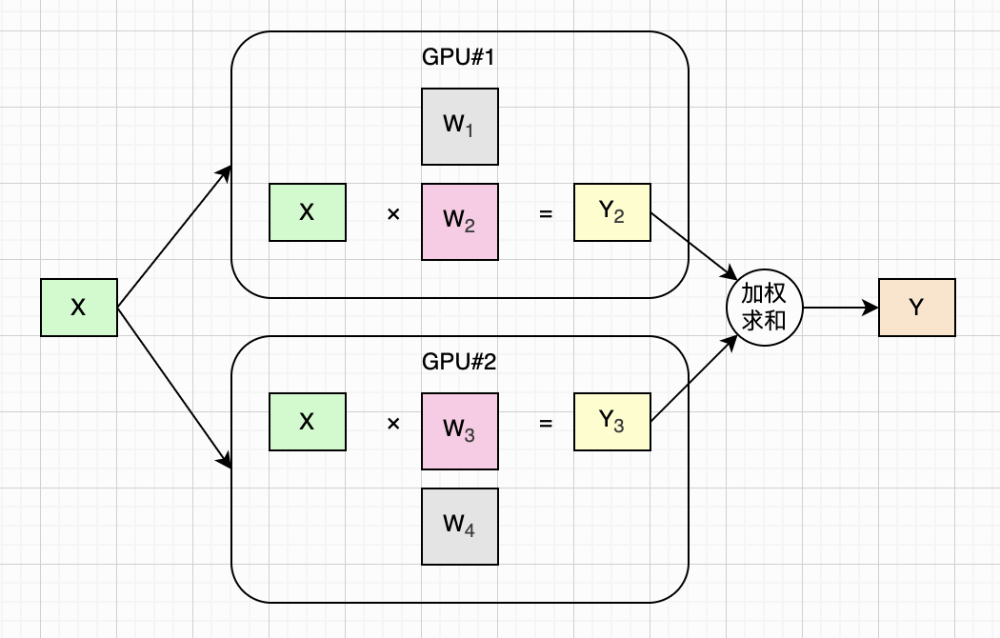

# 图解LLM并行策略（基础篇）

如果你经常读LLM相关的文章或者论文，对**数据并行**（Data Parallelism，简称**DP**）、**张量并行**（Tensor Parallelism，简称**TP**）、**模型并行**（Model Parallelism，简称**MP**）、**流水线并行**（Pipeline Parallelism，简称**PP**）、**专家并行**（Expert Parallelism，简称**EP**）等名词和缩写并不陌生，但是还没搞清楚它们各自起什么作用，那么这篇文章就是为你准备的。

本文的目标，就是用最简单的语言和最直观的示意图，把这几个并行概念统一介绍一遍。为了达到这个目的，我们将对LLM的训练与推理过程进行极大的简化。更详细和完整的讲解，我们留到其他文章再深入聊。

本文假设读者已经对LLM（包括Transformer架构、注意力机制等）非常熟悉了。如果你还不熟悉，可以先阅读相关论文和博客，或者本系列其他文章。

图解LLM系列的文章都没有用AI代笔，文字都是自己敲的，图都是自己画的，原汁原味。不过我使用AI检查了错别字和病句，还有很多不确定的地方，我也问了AI。如果AI回答中的某些片段我觉得可以直接用，会以引用的形式贴到文中，一眼就能看出来。由于我还在慢慢学习中，本文难免有错误和疏漏，如果你发现的话，可以在评论区告诉我，我会在下一版改进。

## 简化模型

以上这些并行，每一种都可以展开写一篇很长的文章。为了在一篇文章里把它们都介绍一遍，我们需要简化一下LLM的训练和推理过程。长话短说，在本文中，我们就认为LLM是一个巨大的多层**FFN**（Feed-Forward Network），每一层都有一个巨大的**权重矩阵**。

对于其中任意一层，我们用大写字母`W`来表示其权重矩阵，形状是`[d × d]`，其中`d`是模型的隐藏维度。我们用粗体小写字母**x**和**y**来表示**输入**和**输出**向量（`[1 × d]`矩阵），那么每一层的计算可以用下面这个**矩阵乘法**公式表示：

$$
\mathbf{y} = \mathbf{x} W
$$

注意，本文将输入和输出表示为**行向量**，所以上面的公式中**x**在`W`前。有些文章中可能会把输入和输出表示为**列向量**，这样就需要把**x**写在`W`后面。这两种表示方法，只是习惯不同，本质上都是同样的计算。上面这个公式可以画成下面这样：

## 批处理

以训练阶段为例，每次处理一个输入是非常低效的。我们可以把多个输入打包在一起，当作一个**批次**（Batch）来处理，这样就可以充分利用GPU（或者TPU、NPU）的计算能力。我们把`n`个输入放在一起，变成一个`[n × d]`矩阵，用`X`来表示。同理，输出也变成了一个矩阵，用`Y`表示。于是前面的矩阵乘法公式可以重新写为：

$$
Y = X W
$$

我们假设批次大小`n=10`，那么上面这个公式就可以用下图来表示：

## 单GPU

现在我们来考虑最简单的情况：我们只有一张显卡（GPU），且只考虑模型某一层的计算。假设我们取合适的`n`，这样输入`X`和权重矩阵`W`都可以直接放进显存计算，并且算出`Y`。这个过程如下图所示：

现在假设我们手头有许多张显卡。这里为了简化讨论，我们假设有两张显卡，但无论多少张显卡，道理都是一样的。另外，虽然本文以GPU为例讨论，但同样的道理也适用于TPU、NPU等硬件。

## 数据并行（Data Parallelism）

**数据并行**（DP）主要在训练阶段使用。我们知道，训练时需要处理海量数据。为了不让显卡闲着，我们把批次大小`n`调成原来的两倍。这样，理论上来说，原先需要很长时间才能训练完的模型，现在只需要一半时间就可以了。

现在，这两张显卡就是一个整体了，每次可以处理`2n`条输入`X`，且从逻辑上仍然可以用前面的公式来计算。但是，很显然，每张显卡每次只能处理一半的批次。根据矩阵乘法的规则，我们把`X`横切为两半，每张卡处理一半，然后再把结果拼接起来，这样就得到了完整的输出`Y`。这样，完整的计算过程可以写成下面这样：

$$
\begin{aligned}
X &= \begin{bmatrix} X_1\\ X_2 \end{bmatrix}, \\
Y_1 &= X_1 W, \\
Y_2 &= X_2 W, \\
Y & = \begin{bmatrix} Y_1\\ Y_2 \end{bmatrix}.
\end{aligned}
$$

简而言之，数据并行（DP）就是把权重矩阵复制到多张显卡上，然后把这些卡当作一个整体，并行处理一个大的批次。我们把这个大的批次叫做**全局批次**（Global Batch），每张卡处理的小批次叫做**局部批次**（Local Batch）。以两张卡为例，上面这个公式可以画成下面这样：

注意啦，上面这个公式以及示意图，只是为了介绍DP的基本概念，我们对模型的训练过程进行了极大的简化。实际上，模型在训练的时候，并不是简单把两份`Y`拼接起来，而是每张卡先利用自己的输出，通过“反向传播”算出“梯度”，然后再进行一个“AllReduce”的通信过程，把整体的“梯度”同步给所有显卡。最后，每张卡都用同步后的“梯度”调整自己的权重矩阵，从而达到训练的目的。

关于**反向传播**和**梯度下降**，这里就一笔带过了，感兴趣的读者可以进一步查阅相关资料。关于AllReduce通信，我们会在后续文章中深入讨论。

## 张量并行（Tensor Parallelism）

我们继续。假如我们的权重矩阵非常大，大到一张显卡都放不下，怎么办？答案就是把权重矩阵切成小份，分开放到不同的显卡里。还是以两张显卡为例，对于模型来说，相当于两张卡并行计算矩阵乘法，每张算一半。

虽然这种并行最常见场景就是切**二维权重矩阵**，但它的设计概念不限于矩阵，而是可以推广到更高维度的数据（也就是**张量**）。所以论文、书籍、博客等各种资料都将这种并行统称为**张量并行**（TP）。

我们回到二维矩阵。具体而言，又有两种切分法：**纵切**和**横切**。纵切法的过程和前一小节介绍的DP有点像：都是每张卡各算一部分，最后把结果拼接起来；区别在于DP切的是数据，而这里切的是权重矩阵。以两张显卡为例，就是把权重矩阵从中间竖着切成两半。根据矩阵乘法的规则，我们把`X`发送到两张卡上，分别处理，各得到一半输出。然后把两半输出拼接起来，就得到了完整的输出`Y`。完整的计算过程可以写成下面这样：

$$
\begin{aligned}
W &= [W_1, W_2] \\
Y_1 &= X W_1 \\
Y_2 &= X W_2 \\
Y & = [Y_1, Y_2]
\end{aligned}
$$

纵切法TP（列并行）可以画成下面这样：

横切法和纵切法差不多，区别在于输入和输出的处理。还是以两张显卡为例，我们把权重矩阵从中间横着切成两半，放到两张卡里。由于`W`的行数变成了一半，所以输入`X`也要相应地竖着切成两半，分别发到两张卡上进行计算。根据矩阵乘法的规则，把两张卡算出的输出叠加起来，就得到了完整的输出`Y`。完整的计算过程可以写成下面这样：

$$
\begin{aligned}
W &= \begin{bmatrix} W_1\\ W_2 \end{bmatrix}, \\
X &= [X_1, X_2], \\
Y_1 &= X_1 W_1, \\
Y_2 &= X_2 W_2, \\
Y & = Y_1 + Y_2 .
\end{aligned}
$$

横切法TP（行并行）可以画成下面这样：

顺便说一下，列并行时算出的分片是左右两半，拼在一起才是完整输出，所以需要用到AllGather通信。而行并行时算出的分片是部分和，互相叠加才是完整输出，所以需要用到AllReduce通信。关于AllGather和AllReduce通信，我们会在后续文章中深入讨论。

## 模型并行（Model Parallelism）

前面我们只考虑了模型中的一层，实际上LLM通常有几十层。不过为了简化讨论，这里我们只考虑两层网络，更深层网络道理也是一样的。两层网络的计算公式可以写成下面这样（注意，这里的`W1`和`W2`表示第一层和第二层的权重矩阵，和上一节TP中表示两个分片的`W1`、`W2`含义不同）：

$$
\begin{aligned}
Y &= X W_1, \\
Z &= Y W_2.
\end{aligned}
$$

如果模型的整体权重太大，以至于一张卡装不下，我们就可以按层把模型拆分，为每层权重矩阵分配一张显卡，这就是**模型并行**（MP）。前面这个公式可以画成下面这样：

## 流水线并行（Pipeline Parallelism）

你可能会问了，前面这个MP，只是把模型按层分配给不同显卡，可是也没有并行呀？训练或推理的时候，第一层（第一张卡）先算，算完之后第二层（第二张卡）才能开始算。模型越深，显卡空闲时间越长。

的确是这样的，一张卡算的时候，其他卡闲着。所以我们可以进一步优化，在一张卡算完一个批次后，就赶紧让它算下一个批次，让所有显卡都忙碌起来。这种工作方式就像工厂流水线一样，所以被称为**流水线并行**（PP）。这里以四张卡为例（也就是把模型分成了四层），如下图所示：

## 专家并行（Expert Parallelism）

我们知道，现代LLM为了持续提升参数量，收获**缩放定律**（Scaling Law）带来的红利，同时控制整体计算开销，会采用一种叫做**混合专家**（Mixture of Experts，简称**MoE**）的技术。

简单来说，MoE就是把每一层的巨大权重矩阵分解为许多小的权重矩阵。这些小权重矩阵的参数量加起来，大致相当于原来那个巨大的权重矩阵的参数量（实际的MoE模型往往会更多）。其中每一个小权重矩阵就叫做一个**专家**，每次只有少数专家会被**激活**（参与计算），其他专家空闲。

使用MoE的模型，每一层的计算可以用下面这个简化公式来表示。其中`m`是专家总数，`k`是每次激活的专家数，`S`是被激活的这`k`个专家的下标集合，`w`是每个被激活专家的权重。如果你想进一步了解MoE，可以看我之前写的[文章](https://zhuanlan.zhihu.com/p/2066090950934509121)。

$$
\begin{aligned}
Y &= \sum_{i\in \mathcal S} w_i X W_i, \\
\text{where} \quad & \mathcal S \subseteq \{1,2,\dots,m\},\ |\mathcal S| = k,\quad \sum_{i\in \mathcal S} w_i = 1.
\end{aligned}
$$

和张量并行（TP）类似，由于一张显卡无法装下所有专家，所以我们把这些专家分成小组，分配到不同显卡上，这就叫做**专家并行**（EP）。

我们假设模型一共有四个专家，每次激活其中的两个。我们把前两个专家放在第一张卡里，把后两个专家放在第二张卡里。某一次计算可能激活了专家2和3，整体的计算过程如下图所示：

## 总结

本文通过极度简化的模型和公式，并搭配直观的示意图，介绍了LLM训练和推理过程中常用的几种并行优化的基本概念，包括：

* 数据并行（DP），把权重矩阵复制到每张GPU上，把数据批次切分给不同GPU并行处理。
* 张量并行（TP），把权重矩阵（横或者纵）切分到不同GPU上并行处理。
* 模型并行（MP），把权重矩阵按层分配到不同GPU上处理。
* 流水线并行（PP），用流水线的方式优化MP，提高GPU利用率。
* 专家并行（EP），把MoE专家分配到不同GPU上处理。

由于篇幅有限，还有一些并行策略没有讨论，例如上下文并行（Context Parallelism）、序列并行（Sequence Parallelism）等。在后续的文章中，我可能会介绍这些并行策略，或者深入介绍本文中提到的这些并行策略。

## 主要参考资料

* 书：[How to Scale Your Model](https://jax-ml.github.io/scaling-book/)
* 博客：[Parallelism methods](https://huggingface.co/docs/transformers/en/perf_train_gpu_many)
* 博客：[Paradigms of Parallelism](https://colossalai.org/docs/concepts/paradigms_of_parallelism/)
* 文档：[Parallelisms Guide](https://docs.nvidia.com/nemo/megatron-bridge/latest/parallelisms.html)

