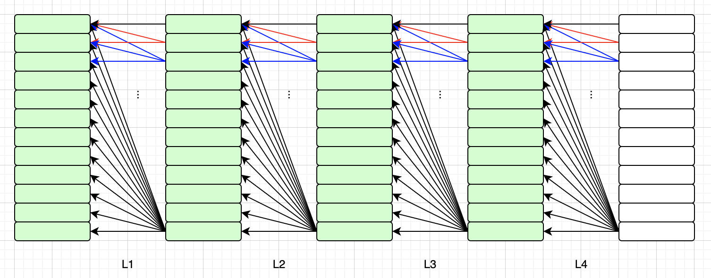
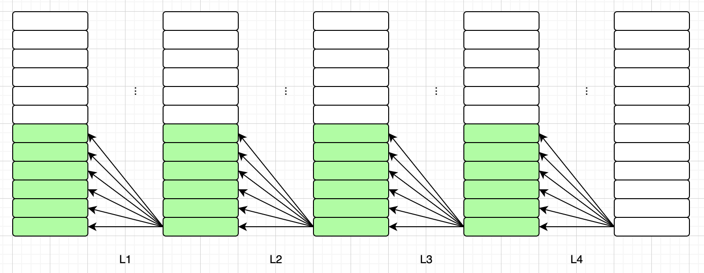
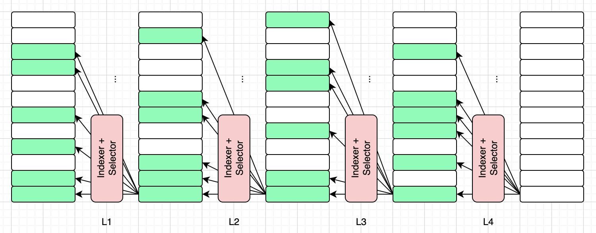
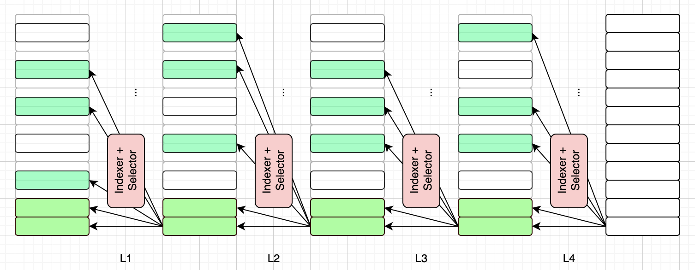
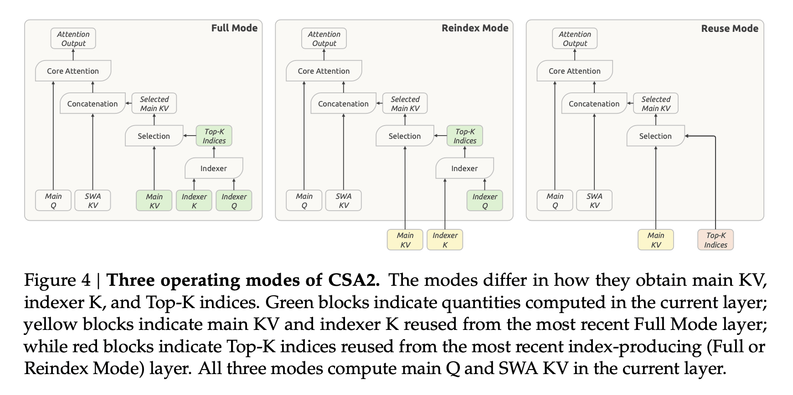
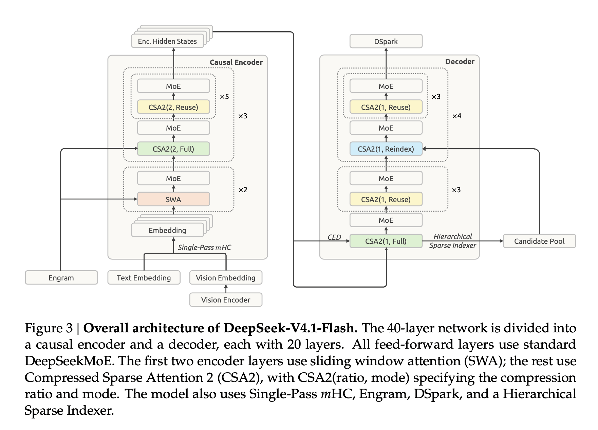
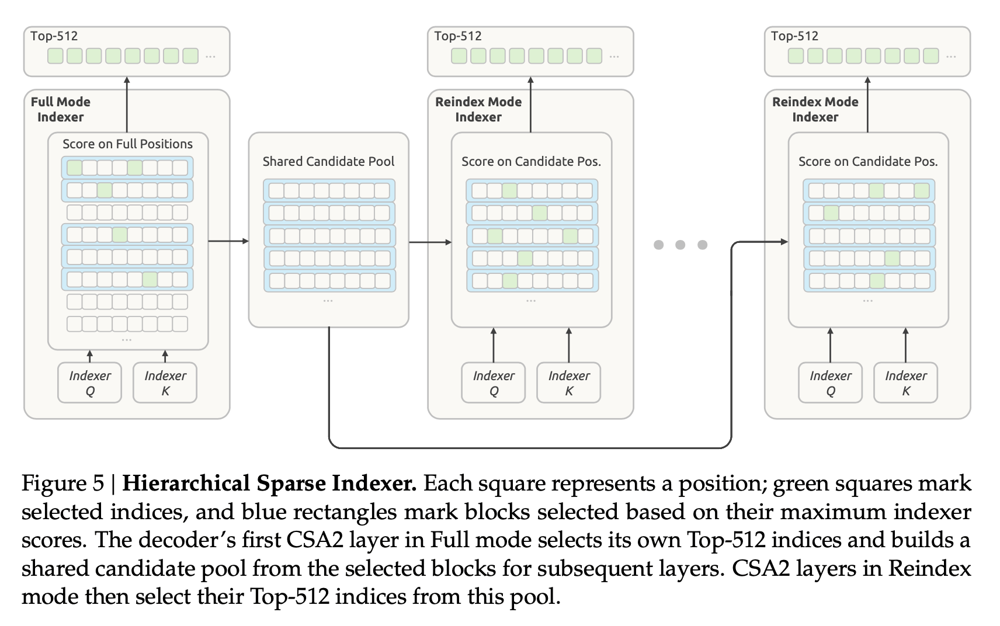

# 图解Compressed Sparse Attention 2

这篇文章介绍[DeepSeek-V4.1-Flash](https://www.deepseek.com/en/news/deepseek-v4-1-flash/)模型[技术报告](https://arxiv.org/abs/2609.19969)里提到的**Compressed Sparse Attention 2**（简称**CSA2**）。和前面的一些文章不同，本文不会详细介绍CSA2的数学公式，原因有二。

第一，技术报告里面就没有仔细介绍CSA2的公式，更多的是文字说明，以及一些示意图。这个可能是因为CSA2只是在DeepSeek-V4提出的CSA基础上做了调整，所以报告的作者只想文字说明CSA2的一些改进。其实，整个V4.1技术报告里公式都是偏少的，这一点和之前的技术报告风格有点不太一样。

第二，我已经在之前的文章里介绍过CSA的公式（见[图解DeepSeek-V4核心公式](https://zhuanlan.zhihu.com/p/2053601625491690393)一文CSA小节），以及CSA的前辈DSA的公式（见[图解LongCat Sparse Attention](https://zhuanlan.zhihu.com/p/2074508069179074518)一文DSA小节）。此外，我还在[图解MiniMax Sparse Attention](https://zhuanlan.zhihu.com/p/2059278715834652015)一文中梳理过MQA、GQA等优化，以及稀疏注意力的基本原理。

基于以上这两点原因，本文也没有把重点放在公式解读上，而是想通过一系列风格一致的示意图，把CSA的发展路径总结一遍。如果你对于CSA第一版还不熟悉，或者想复习一下相关的概念和公式，可以看前面这些文章。

图解LLM系列的文章都没有用AI代笔，文字都是自己敲的，图都是自己画的，原汁原味。不过我使用AI检查了错别字和病句，还有很多不确定的地方，我也问了AI。如果AI回答中的某些片段我觉得可以直接用，会以引用的形式贴到文中，一眼就能看出来。由于我还在慢慢学习中，本文难免有错误和疏漏，如果你发现的话，可以在评论区告诉我，我会在下一版改进。（说明：本文CSA2小节是个例外，AI补充比较多，图也直接用了技术报告里的原图）

## 标准注意力机制

这个属于老生常谈了。本系列的文章，大部分都要从经典的Transformer架构和标准注意力机制说起。本文假设读者已经对LLM（包括Transformer架构、注意力机制等）非常熟悉了。如果你还不熟悉，可以先阅读相关论文和博客，或者本系列其他文章。

这里简单说一下。采用Transformer架构的LLM，由许多**层**构成，比如DeepSeek-V4.1-Flash就有40层。每一层大致又可以分成两个模块：**注意力机制**和**前馈网络**（FFN）。本文我们只关心注意力机制。

输入文字在经过**分词**处理后，会变成一个**词元**（Token）列表。这些词元经过查**词表**后得到ID列表，然后再经过词嵌入层处理得到**词嵌入**列表。词嵌入其实就是**向量**，以DeepSeek-V4.1-Flash为例，这些词嵌入向量的维度是5120。这些向量作为**输入**，经过一层一层（注意力机制 + FFN）处理之后，就得到一个**输出**序列。

把输出序列里的最后一个向量拿出来，经过一个**线性投影**，就得到了另外一个和词表一样大的向量，这个就是所谓的**分数**（Logits）。分数经过Softmax处理后得到下一个词元的概率分布，然后再经过**采样器**处理，就得到了下一个Token的ID。以DeepSeek-V4.1-Flash为例，词表大小是129280。

然后我们把这个ID再送回开始处，追加到之前那些ID后面，再走一遍这个过程，这样就可以源源不断地产生新的Token，直到遇到停止信号，或者超过某种限制。

以上描述的细节有点太多了，大部分都不是本文关心的内容，你了解即可。所以我把这些细节全部都忽略了，只留下了输入和输出向量、中间状态（也叫隐藏向量），以及一些箭头来象征性表示层和注意力机制。输入序列走完N层注意力机制，得到输出序列的简化过程，如下图所示：

在上图中，最左边一堆（12个）小矩形表示输入序列，最右边的是输出序列，中间的是隐藏状态。最顶上的小矩形表示第一个词元，最底下的表示最后一个词元。除了最右边的输出序列，其余矩形都涂成了绿色，表示它们都能被注意到。箭头是从右指向左边的，大致表示注意力机制。为了让图大小适中，我一共只画了四层。在这种简化的图中实在无法画出注意力机制的全部计算细节，所以你意会即可。

不过，上图有两点我想特别强调一下，都和箭头有关。

第一，每一个词元，都只能注意到它**前面**的词元，这个就是所谓的**因果关系**。你看Transformer和注意力机制相关论文时，会看到**因果掩码**（Causal Mask）。在DeepSeek-V4.1-Flash的技术论文里，也有“Causal Encoder-Decoder (CED)”一节。这些地方出现的**因果**（Causal），指的就是这个意思。

第二，如果把所有箭头都画出来，那上图就没法看了，密密麻麻都是箭头。所以我只给前三个词元，以及最后一个词元，画了箭头，并且用红、蓝、黑三种颜色把不同词元的箭头区分开，颜色本身没有别的含义。但是你可以想象一下这些箭头。总之，由于每一个词元都要去注意它前面的所有词元，所以注意力机制的计算复杂度大约是 $O(N^2)$ 量级，这里N指输入序列的长度。

换句话说，注意力机制的计算量，和输入序列长度的平方成正比。如果输入序列特别长（比如DeepSeek-V4.1-Flash支持最长100万词元），那这个计算量就大得惊人了。这就是后面要介绍的这些优化想方设法要解决的问题。

## Sliding Window Attention（SWA）

滑动窗口注意力的思想特别简单。既然标准注意力机制的计算量和输入序列长度的平方成正比，那我就不看整个序列。每个词元，我只看前面的**固定M**个词元。这样，计算的复杂度就从 $O(N^2)$ 降低为 $O(N \times M)$ 。如果M远小于N，那么计算量就大幅降低了。假设我们取M=6，那么SWA可以画成下图这样：

注意在上面这个图里，我们只画了**最后一个**词元的箭头，其余词元都没有体现。绿色矩形的含义和上一张图一样，表示可以被注意到的词元，其余词元用普通白色矩形表示。

SWA只看前面固定M个词元肯定是有问题的，理解能力远不如标准注意力机制。就好比我们读一篇文章，如果每次只能理解200个字，那肯定是看了后面的忘了前面的。所以通常SWA并不会被单独使用，更多还是跟其他优化方式结合起来用，就比如后面要介绍的CSA。

## DeepSeek Sparse Attention（DSA）

DSA是DeepSeek-V3.2引入的。DSA有两个主要部分：一个是**闪电索引器**（Lightning Indexer），另一个是**细粒度词元选择器**（Fine-grained Token Selector）。

对于某个词元，闪电索引器会使用类似注意力机制的做法，对它前面的词元进行索引打分。但是相比于注意力机制，这里的计算是很轻量级的，所以它的名字叫做“闪电”索引器，意味着速度飞快。

打完分以后，细粒度词元选择器再根据索引分数从前面的词元里选出K个来。当前词元只和这**Top-K**个词元进行注意力计算，因此计算的复杂度就从 $O(N^2)$ 降低为 $O(N \times K)$ 。如果K远小于N，那么计算量也就大幅降低了。

在DeepSeek-V3.2里，K=2048。这里我们假设K=6，那么DSA可以画成下图这样：

和SWA一样，我们只画了**最后一个**词元的箭头，其余词元都没有体现。我们用粉色框表示闪电索引器和筛选器，用深绿色矩形表示被筛选出来的词元，用普通白色矩形表示其他词元。

这里需要特别注意一点：DSA省下的是**计算**，不是**存储**。所有词元的KV仍然要老老实实留着，因为后面的query随时可能选中它们。这一点和SWA不一样，SWA只保留最近的M个词元，存储和计算都省了。

DSA也有许多优化空间，这里就不展开介绍了。LongCat团队分析了DSA的几处瓶颈，并针对性提出了三项优化措施，最终形成了LSA，具体可以看我[前面的文章](https://zhuanlan.zhihu.com/p/2074508069179074518)。

## Compressed Sparse Attention（CSA）

CSA是DeepSeek-V4引入的。可以粗略认为：CSA = SWA + DSA + 压缩模块。

前面也提到过，SWA单独拿出来使用，可能效果不理想，所以往往和其他优化机制一起用。我们用W来表示SWA的窗口大小。在DeepSeek-V4-Flash里，W=128。也就是说，某个词元肯定能注意到它前面的128个词元。为了便于画图，这里我们假设W=2，CSA的示意图稍后给出。

离当前词元更远的词元，首先要经过一个压缩操作。以DeepSeek-V4-Flash为例，这个压缩比m=4。也就是说，每4个词元会被压缩成一个。这里我们假设m=2，也就是两两一组压缩。

压缩后的词元，会经过闪电索引器和Top-K筛选器，选出最多K个压缩向量。这些筛选出的远处向量，和SWA窗口的近处向量一起，进入最终的注意力计算。在DeepSeek-V4-Flash里，K=512。这里我们假设K=3。

把窗口大小W、压缩比m、筛选器K都缩小后，CSA可以画成下面这样：

在上图中，每一列外层的白色矩形仍然表示词元，叠在上面的窄矩形则是压缩之后的向量，一个窄矩形对应2个词元。浅绿色矩形表示SWA窗口内的词元，深绿色半透明的窄矩形表示被筛选器选中的压缩向量。

实际上，CSA最后进行的也不是标准注意力计算，而是MQA（Multi-Query Attention）。不过由于不好在上图里体现MQA，这里就不展开介绍了。想深入了解[CSA](https://zhuanlan.zhihu.com/p/2053601625491690393)和[MQA](https://zhuanlan.zhihu.com/p/2059278715834652015)的读者可以阅读我之前写的文章。

## Compressed Sparse Attention 2（CSA2）

前面我们简要讨论了标准注意力机制，以及SWA和DSA优化，然后介绍了CSA。这一小节我们讨论DeepSeek-V4.1-Flash提出的CSA改进版本，也就是CSA2。这一小节主要参考了DeepSeek-V4.1-Flash技术报告的第2.3小节，里面的一些图我觉得画得挺好的，直接贴过来了。

### 三个优化维度

对于标准注意力机制的优化，大致可以分为三个维度：entry、sequence和layer。前面讨论的那些优化，基本都在sequence这个维度上。DeepSeek-V4.1-Flash技术报告在第2.3小节开头对这几个维度上的优化进行了总结，我把它整理成了表格：

| 维度     | 优化                                                         | 例子                       |
| -------- | ------------------------------------------------------------ | -------------------------- |
| entry    | 缩小单个KV条目：例如减少KV头的数量，或者让所有头共享一个小的潜向量 | MQA、GQA、MLA              |
| sequence | 沿着序列方向合并：每m个词元的KV被压缩成一个条目              | CSA、HCA                   |
| layer    | 有些层不再自己保存，而是直接复用其他层的缓存和选择结果       | IndexCache、YOIO、HySparse |

报告特别强调，这三个维度是**相乘**的关系，所以三个维度上的优化可以叠加。CSA2的特别之处在于三个维度都占上了，不过entry这一份主要是从CSA继承下来的，CSA2自己的改进集中在sequence和layer上，下面我们逐个来看。

先看sequence维度。CSA2在这个维度上主要是给CSA做减法，简化了压缩器（Compressor）和索引器（Indexer）：

* 压缩器：在CSA里，压缩比为m时，每个main KV条目其实是由2m个原始条目压出来的，相邻的压缩条目之间存在重叠，压缩时还要用绝对位置编码来编码这2m个条目的位置。CSA2把重叠和绝对位置编码都去掉了。
* 索引器：CSA的indexer K，是从隐藏状态单独走一条压缩路径算出来的。CSA2改成直接由main KV条目投影得到，省掉了这条单独的路径。

这两处改动的目的都不是提升效果，而是简化实现、提高训练效率。另外，CSA2还把压缩比为1（也就是压根不压缩）当成一种特例包含了进来，后面看图3的时候会用到这一点。

再看entry维度，CSA2其实没有什么新动作，直接继承了CSA的做法：最后做注意力计算时用的是MQA，所有query头共享同一份KV，条目自然就小了。这一点前面介绍CSA时已经提过，这里就不重复了。

不过DeepSeek-V4.1-Flash这一代确实把条目又压小了一圈，靠的是FP4：main KV缓存以4比特精度存储。报告把这个归为缓存精度上的优化，和架构上的优化并列，严格说不算CSA2的一部分，所以本文也不展开，感兴趣的读者可以看技术报告的2.4.4小节。CSA2的跨层复用加上FP4缓存，最终把每个词元的全局KV缓存压到了890字节，大约是DeepSeek-V4-Flash的四分之一。

最后看layer维度。其实这个维度之前已经有不少工作了，报告举了三个例子：IndexCache跨层复用Top-K索引，省下的是索引器的计算；YOIO只计算一次稀疏路由，然后让所有层共享；HySparse让稀疏层去复用稠密层的KV缓存。但是报告也指出，光复用索引并不能省下main KV的存储，全网共享路由会影响效果，而混合设计里还留着完整的注意力层。更重要的是，这些方法没有一个同时覆盖了三个维度。CSA2的卖点就在这里：三个维度一起用，而且缓存共享和索引复用是**解耦**的。

下面我们来仔细看看layer维度的优化。

### 三种复用模式

具体来说，CSA2主要是引入了KV和Index的复用。CSA2的每一层都被**静态**指定为三种模式之一：Full、Reindex和Reuse。三种模式有一个共同点，就是query和SWA KV都由当前层自己计算，区别只在main KV、indexer K和Top-K索引这三样东西上，下面这张表进行了总结：

| 模式    | main KV      | indexer K    | Top-K        |
| ------- | ------------ | ------------ | ------------ |
| Full    | 当前层计算   | 当前层计算   | 当前层计算   |
| Reindex | 复用前面的层 | 复用前面的层 | 重新计算     |
| Reuse   | 复用前面的层 | 不使用       | 复用前面的层 |

这张表有两点需要补充说明。

第一，表格里的“复用前面的层”，来源并不相同。main KV和indexer K，复用的是前面最近一个算过它们的层；而Reuse模式复用的Top-K索引，来自前面最近一个产出过索引的层，Full和Reindex都算。另外Reuse模式压根不计算indexer Q、也不打分，所以对它来说indexer K是用不上的。

第二，为什么要多出Reindex这种模式，只留Full和Reuse不行吗？因为这两种复用省下来的东西不一样：共享main KV和indexer K，省的是**缓存存储**；复用Top-K索引，省的是**索引器的计算**。两者是解耦的，所以中间才有Reindex这种“KV复用、但是索引重新算”的模式，它既省了存储，又允许每一层选出不同的词元。

技术论文里的图4总结了这三种模式，我觉得画得挺清晰的，贴过来方便读者查看：

这几种模式在DeepSeek-V4.1-Flash里是分层出现的，见技术论文图3。图中的CSA2(ratio, mode)，前一个参数是压缩比，后一个是模式。可以看到，编码器最前面两层是纯SWA层，后面的CSA2层压缩比为2；而解码器那边的压缩比是1，也就是前面提到的不压缩那种特例。

### 分层稀疏索引器

同样是layer维度，CSA2还对索引器（Indexer）进行了优化。前面说的Reindex模式，虽然省掉了KV的重新计算，但Top-K还是要重新选的，而剩下的这些索引器，仍然要在全部可见的上下文上打分。上下文越长，这块开销就越突出。

CSA2的做法是引入一个**共享候选池**（Shared Candidate Pool），这个机制只用在解码器里。解码器里第一个Full模式的层，在全部位置上打分，选出自己的Top-512。与此同时，它还顺手做一次**块**粒度的筛选：每个块取块内最高的那个分数作为这个块的分数，再挑出分数最高的那些块，把这些块覆盖到的位置收集起来，就构成了候选池。技术报告举的例子是选2048个块、每块8个位置，也就是16384个候选位置，比最终要选的512个大得多。后面那些Reindex模式的层，就不用再扫整个序列了，只在这个候选池里打分，各自选出各自的Top-512。

这样一来，只要候选池的大小固定，深层索引器处理每个查询的开销，就不再随着上下文长度线性增长，而是变成了常数。需要注意的是，第一个Full模式的层仍然要扫描全部位置，省下来的是它后面那些索引器的开销。另外，候选池虽然是共享的，但每一层仍然可以在池子里选出最适合自己的Top-K，这也正是Reindex和Reuse的区别所在。由于是先选块、再在块里选位置，所以这个机制叫做**分层稀疏索引器**（Hierarchical Sparse Indexer）。见技术论文图5：

在上图中，每个小方格表示一个位置，绿色的小方格表示最终被选中的位置，蓝色的长条表示按块内最高分筛选出来的块。

## 总结

本文没有讲公式，而是用一组风格一致的示意图，把CSA这条线的发展路径梳理了一遍。

标准注意力机制的计算量和序列长度的平方成正比，这是长上下文最主要的障碍。SWA用一个固定大小的窗口，把计算量降到了 $O(N \times M)$ ，但是只能看到近处。DSA用轻量级的闪电索引器打分，再选出Top-K个词元，把计算量降到了 $O(N \times K)$ ，远近都能照顾到。CSA在DSA的基础上，一方面用SWA兜住近处，另一方面把远处的词元压缩之后再筛选。CSA2则在CSA的基础上，进一步简化了压缩器和索引器，并且把layer这个维度也用了起来，让一部分层直接复用其他层的KV和Top-K索引。

前面说过，技术报告把这类优化归纳为entry、sequence、layer三个相乘的维度，CSA2把这三个维度一起用上了。下面这张表，把前面几种做法放在一起做个对比：

| 机制       | 每个词元能注意到什么                                  | entry | sequence | layer |
| ---------- | ----------------------------------------------------- | ----- | -------- | ----- |
| 标准注意力 | 前面的全部词元                                        |       |          |       |
| SWA        | 前面固定W个词元                                       |       | ✓        |       |
| DSA        | 索引器选出的Top-K个词元                               |       | ✓        |       |
| CSA        | 窗口内的W个词元，加上压缩后选出的Top-K个              | ✓     | ✓        |       |
| CSA2       | 同CSA，另外简化了压缩器和索引器，并且跨层复用KV和索引 | ✓     | ✓        | ✓     |

表格里CSA和CSA2在entry维度上的那个勾，指的是它们最后用的是MQA，多个头共享同一份KV。

需要说明的是，本文只是梳理了脉络，很多细节都没有展开，比如CED架构、FP4缓存、SWA Bounded Replay，以及CSA2在训练上的配合等等。对这些细节感兴趣的读者，可以进一步阅读DeepSeek-V4.1-Flash技术报告。

## 主要参考资料

* 论文：[Attention Is All You Need](https://arxiv.org/abs/1706.03762)
* 论文：[DeepSeek-V3.2](https://arxiv.org/abs/2512.02556)
* 论文：[DeepSeek-V4: Towards Highly Efficient Million-Token Context Intelligence](https://huggingface.co/deepseek-ai/DeepSeek-V4-Pro/blob/main/DeepSeek_V4.pdf)
* 论文：[DeepSeek-V4.1-Flash: Pushing the Limits of KV Cache Compression](https://arxiv.org/abs/2609.19969)

