# 图解DeepSeek训练过程

本文梳理一下DeepSeek系列模型（V1、V2、V3、R1、V3.2、V4）的训练过程。我们知道，现代大语言模型（Large Language Model，简称LLM）的训练过程大致可以分为两个阶段：**预训练**（Pre-train）和**后训练**（Post-train）。DeepSeek系列模型在预训练阶段变化不大，主要是后训练阶段一直在演进，所以本文主要关注后训练阶段。

图解LLM系列的文章都没有用AI润色，文字都是自己敲的，图都是自己画的，原汁原味。不过我使用AI检查了错别字，还有很多不确定的地方，我也问了AI。如果一些AI回答的片段，我觉得可以直接用，会以引用的形式贴到文中，一眼就能看出来。由于我还在慢慢学习中，本文可能难免有错误和疏漏，如果你发现的话，可以在评论区告诉我，我会在下一版改进。

## DeepSeek-V1

在DeepSeek-V1的技术论文里，后训练被称为**对齐**（Alignment）。具体而言，对齐又分为两个阶段：**监督微调**（Supervised Fine-Tuning，简称SFT）和**强化学习**（Reinforcement Learning，简称RL）。RL也有很多算法，DeepSeek-V1使用的是**DPO**（Direct Preference Optimization）。DeepSeek-V1整体训练过程如下图所示：

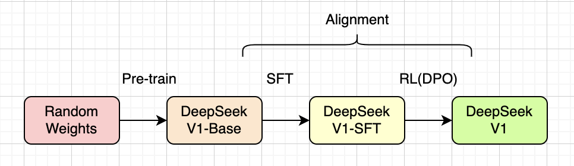

不过，严格来说，DPO好像不属于RL。但许多资料都把DPO归到RL里一起介绍，所以本文就把它当作RL的一种了。

>Q：DPO 是强化学习算法吗？
>
>AI：**DPO 不属于传统意义上的强化学习算法。** 它是一种**基于偏好数据的直接策略优化方法**，通过普通梯度下降直接优化语言模型，使其更倾向于生成人类偏好的回答，而**不需要奖励模型、环境交互或 PPO 等强化学习步骤**。

## DeepSeek-V2

在DeepSeek-V2的技术论文里，后训练仍然被称为对齐，而且也是分SFT和RL两个阶段，只是RL阶段的算法从DPO换成了**GRPO**（Group Relative Policy Optimization）。DeepSeek-V2整体训练过程如下图所示：

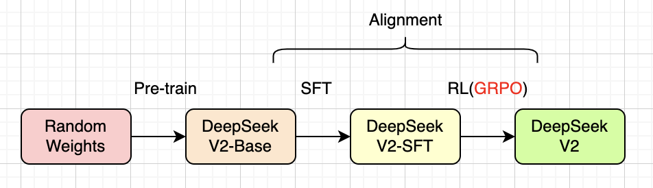

RL阶段又细分为两个小阶段：推理对齐（Reasoning Alignment）和人类偏好对齐（Human Preference Alignment）。这个细节这里就不展开介绍了，感兴趣的读者可以阅读原论文。

## DeepSeek-V3

到了DeepSeek-V3的技术论文里，后训练就不再被称为对齐了。DeepSeek-V3的整体训练过程和V2差不多，如下图所示：

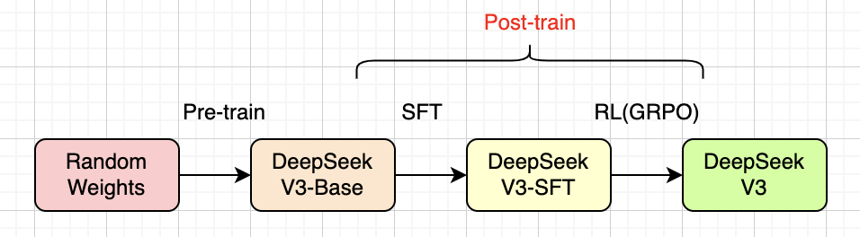

比较有趣的是，先后发布的DeepSeek-V3和R1模型，实际上是穿插在一起训练的，它们都源自DeepSeek-V3基础模型，如下图所示。这一小节我们重点介绍V3模型，下一小节介绍R1模型。

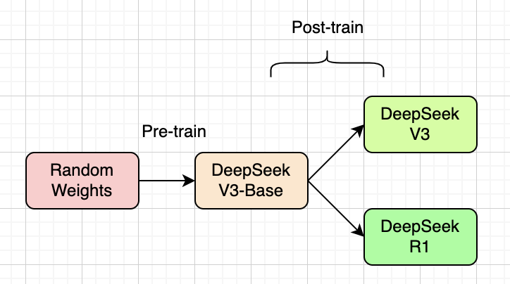

DeepSeek-V3在SFT阶段使用了两类数据：**推理数据**（Reasoning Data）和**非推理数据**（Non-Reasoning Data）。为了获得推理类数据，DeepSeek-V3先训练了一个内部R1模型，然后又用这个内部模型训练出许多专家模型（例如代码专家、数学专家等），最后用这些专家模型来生成数据，如下图所示：

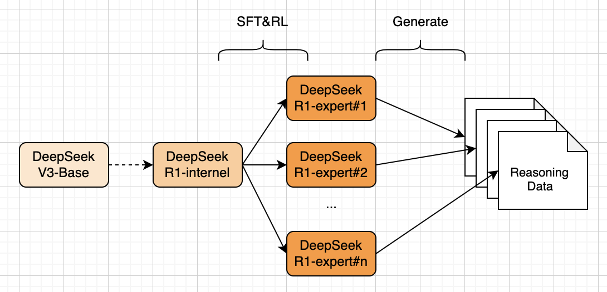

而非推理类数据（例如写作、问答等），则是使用DeepSeek-V2.5模型生成，并进行人工验证，如下图所示：

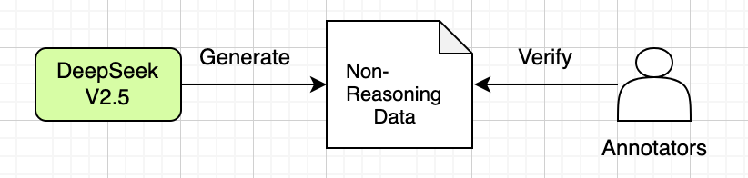

DeepSeek-V3在RL阶段使用了两类**奖励模型**（Reward Model，简称RM）：**基于规则的RM**（Rule-Based RM）和**基于模型的RM**（Model-Based RM）。像一些数学问题、代码编写等，比较容易根据规则验证，就使用基于规则的RM。而像一些开放式问答，就使用基于模型的RM。这个基于模型的RM，是从R1的某个SFT Checkpoint训练出来的，如下图所示：

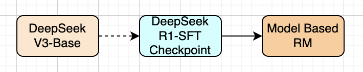

## DeepSeek-R1

DeepSeek-R1证明了：后训练阶段不用SFT、只用RL，就能训练出OpenAI-o1那样强大的推理模型。为了验证这一点，DeepSeek先训练了一个实验性质的R1-Zero模型，其训练过程如下图所示：

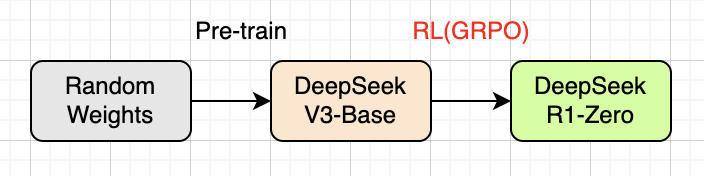

R1-Zero的RL训练阶段，只使用了基于规则的RM，包含两类奖励：精确奖励（Accuracy Rewards）和格式奖励（Format Rewards）。精确奖励适用于有确定结果的数学问题、LeetCode编程问题等，格式奖励让模型学会把思考过程放在`<think>`和`</think>`标签里。

结果是：DeepSeek-R1-Zero在推理方面表现的很好，但是也有问题，例如返回结果可读性差以及多语言混合。那是否可以更好呢？DeepSeek觉得可以，于是进一步细化了RL阶段，训练出了R1模型，其训练过程如下图所示：

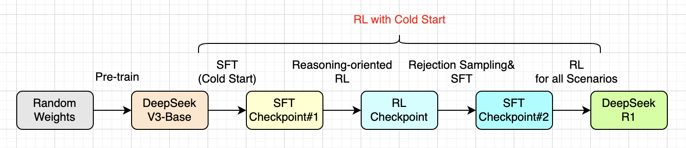

具体而言，DeepSeek-R1的RL阶段又分为4个小阶段：

* **冷启动**（Cold Start），通过一些长CoT（Chain of Thought）数据微调模型（SFT）。相比R1-Zero，这个改善了模型输出的可读性（Readability）和性能。
* **面向推理的RL**（Reasoning-Oriented RL），这个就对应R1模型的RL阶段。这个阶段主要就是训练模型的逻辑推理能力。
* **拒绝采样和SFT**（Rejection Sampling & SFT），这个阶段有点类似DeepSeek-V3的SFT，通过推理和非推理两类数据来增强模型的写作和角色扮演等通用能力。
* **全场景RL**（RL for all Scenarios），这阶段主要是进一步和人类偏好对齐，让模型尽可能产生对人类有益的信息、避免产生对人类有害的信息。

训练好R1模型后，DeepSeek还利用该模型蒸馏出了具有推理能力的Qwen2.5、Llama-3.3等较小的模型。以Qwen2.5-32B为例，蒸馏过程大致如下图所示：

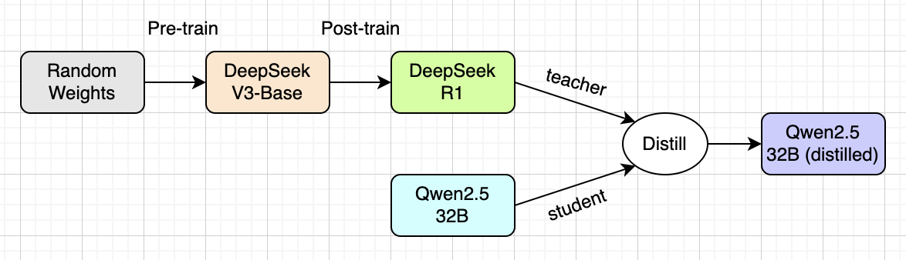

## DeepSeek-V3.2

DeepSeek-V3.2对后训练阶段进行了调整，把V3的SFT+RL(GRPO)换成了**专家蒸馏**（Specialist Distillation）+**混合RL**（Mixed RL），其训练过程如下图所示：

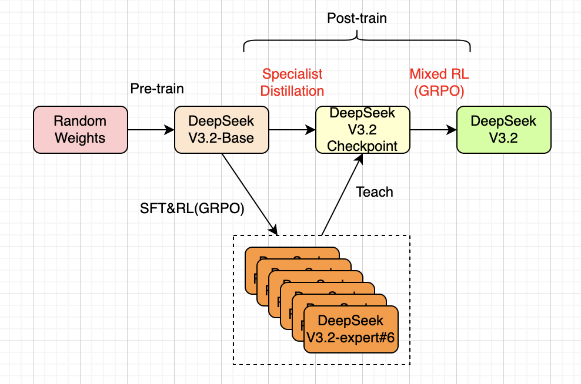

从上图可以看到，在预训练完得到V3.2基础模型之后，DeepSeek通过SFT+RL的方式，训练出6个临时的专家模型。这6个专家模型涵盖数学、编程、通用逻辑推理、通用智能体任务、智能体编程、智能体搜索等领域。然后再利用这些专家模型，蒸馏出一个Checkpoint模型。最后，DeepSeek在同一个RL训练阶段里混合进行推理、智能体和人类偏好对齐这三种强化，得到了最终的V3.2模型。

## DeepSeek-V4

DeepSeek-V4的训练过程和V3差不多，只是把后训练阶段的混合RL换成了**OPD**（On-Policy Distillation），如下图所示：

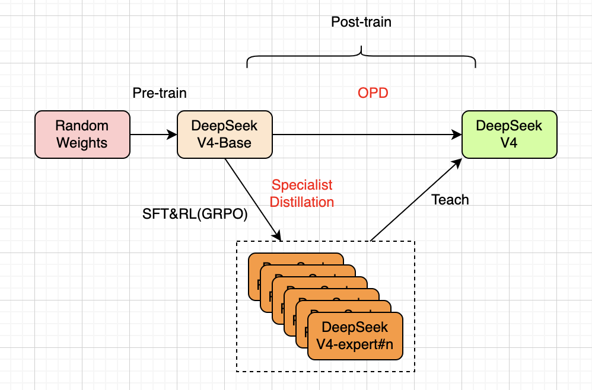

从上图可以看出，训练出临时的专家模型后，DeepSeek-V4并没有像V3那样，先蒸馏出一个模型，然后再RL得到最后的模型。而是直接利用这些专家蒸馏出最终的V4模型，这个就是OPD。

## 总结

本文简要梳理了DeepSeek系列模型从V1到V4版本的训练流程演进，重点关注后训练阶段。为了便于对比，我们把DeepSeek在后训练阶段的核心演进路径整理为表格，如下所示：

| 模型 | 后训练阶段 |
|------|-----------|
| V1 | SFT + DPO |
| V2 | SFT + GRPO（推理对齐 + 人类偏好对齐）|
| V3 | SFT（推理数据 + 非推理数据）+ GRPO（规则RM + 模型RM）|
| R1-Zero | RL（基于规则的RM） |
| R1 | 冷启动SFT → 推理RL → 拒绝采样&SFT → 全场景RL |
| V3.2 | 专家蒸馏 + 混合RL（推理 + 智能体 + 人类偏好对齐） |
| V4 | 专家蒸馏 + OPD（On-Policy Distillation） |

## 主要参考资料

论文：[DeepSeek LLM: Scaling Open-Source Language Models with Longtermism](https://arxiv.org/abs/2401.02954)

论文：[DeepSeek-V2: A Strong, Economical, and Efficient Mixture-of-Experts Language Model](https://arxiv.org/abs/2405.04434)

论文：[DeepSeek-V3 Technical Report](https://arxiv.org/abs/2412.19437)

论文：[DeepSeek-R1: Incentivizing Reasoning Capability in LLMs via Reinforcement Learning](https://arxiv.org/abs/2501.12948)

论文：[DeepSeek-V3.2: Pushing the Frontier of Open Large Language Models](https://arxiv.org/abs/2512.02556)

论文：[DeepSeek-V4: Towards Highly Efficient Million-Token Context Intelligence](https://arxiv.org/abs/2606.19348v1)