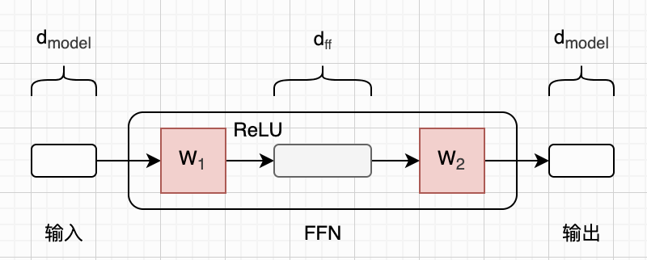
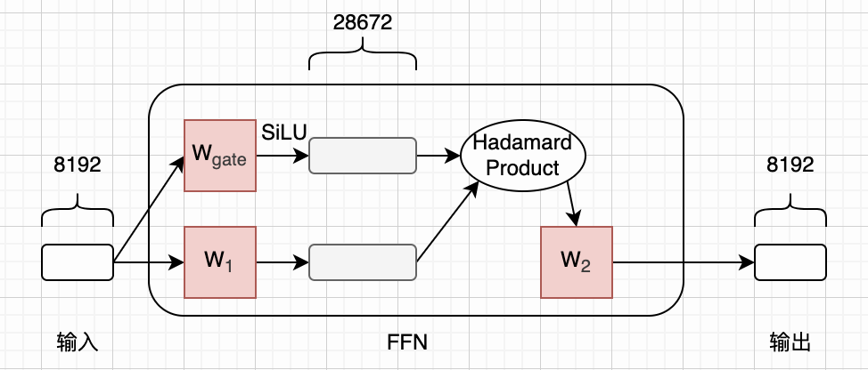
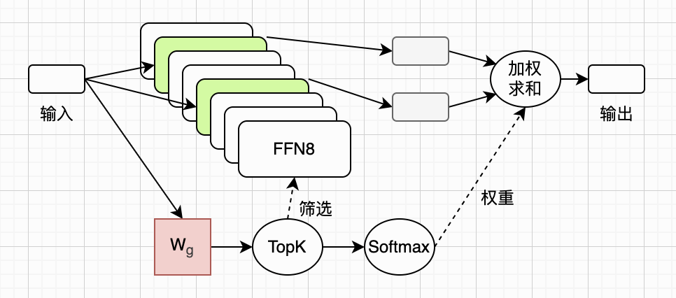
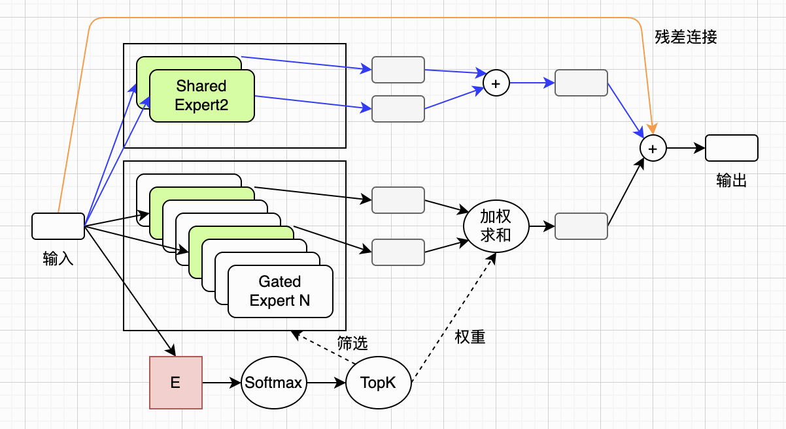
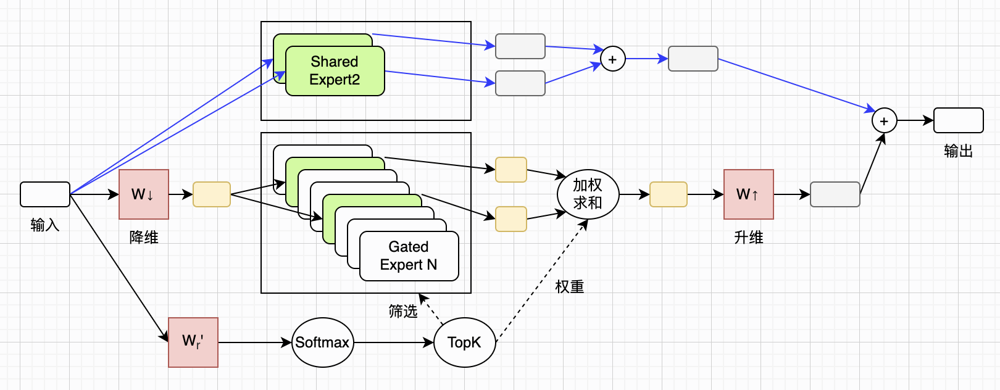
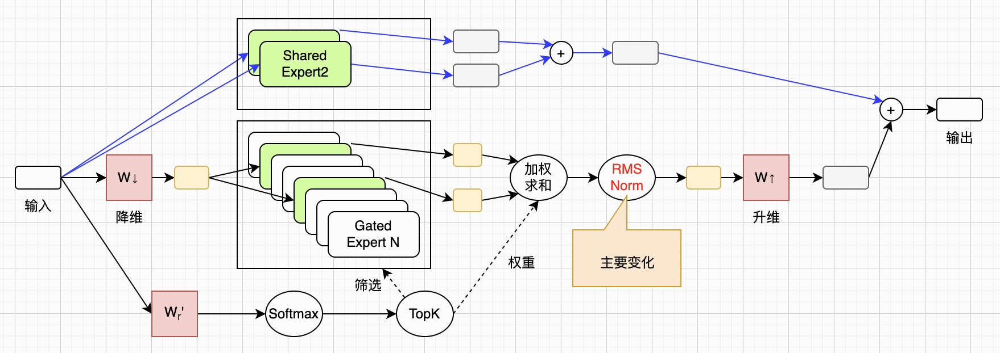
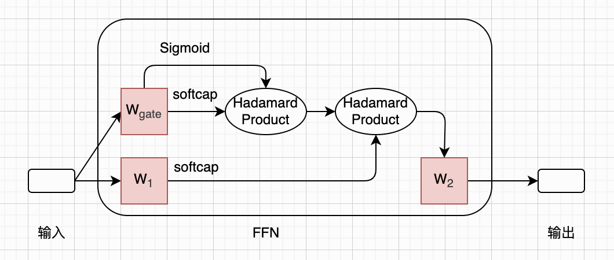

# 图解Kimi K3 Stable LatentMoE

最近Kimi发布了最新的K3模型，引起了广泛的关注和讨论。我也凑热闹读了读K3的技术论文，里面的架构部分提到了KDA（Kimi Delta Attention）、MLA（Multi-head Latent Attention，由DeepSeek提出）、Attention Residuals、LatentMoE（由NVIDIA提出）等技术细节。

我在之前的文章里详细介绍过[MLA](https://zhuanlan.zhihu.com/p/2054251474260070710)和[DeepSeekMoE](https://zhuanlan.zhihu.com/p/2053601625491690393)，这篇文章详细介绍LatentMoE，后续文章会介绍KDA和Attention Residuals。

借讨论LatentMoE的契机，我大致梳理了MoE的提出和优化过程。在这篇文章里，我们首先讨论标准的稠密模型，以及存在的问题。接着讨论经典MoE设计，以及优化版本DeepSeekMoE。最后讨论LatentMoE，以及K3所做的改进。

图解LLM系列的文章都没有用AI润色，文字都是自己敲的，图都是自己画的，原汁原味。不过我使用AI检查了错别字，还有很多不确定的地方，我也问了AI。如果一些AI回答的片段，我觉得可以直接用，会以引用的形式贴到文中，一眼就能看出来。由于我还在慢慢学习中，本文可能难免有错误和疏漏，如果你发现的话，可以在评论区告诉我，我会在下一版改进。

## Dense FFN

MoE的概念其实早在1990年代就出现了，不过本文我们主要讨论现代大语言模型（LLM）里的MoE。我们从经典的Transformer架构开始说起。

本文假设读者已经对标准的Transformer架构和注意力机制非常熟悉了，如果还不熟悉的话，可以先熟读2017年的那篇经典论文：《Attention Is All You Need》。这里，我先贴一个之前介绍DeepSeek-V4时画的图：

这张图省略了非常多的细节，这篇文章里我们也不需要关心这些细节。我们重点看Transformer架构里的Decoder Block，注意每个Block里都有一个**前馈神经网络**（Feed-Forward Network，简称**FFN**）。由于历史原因，在一些文章，尤其是工程实现里，FFN也经常被称为**多层感知机**（Multi-Layer Perceptron，简称**MLP**）。

由于在Transformer架构里，每一个token都要**单独**经过每一层的FFN，所以在后文中，我们就只关注这个FFN就可以了。在2017年的经典论文里，这个FFN就是一个简单的两层网络，中间使用`ReLU`激活函数。论文里的公式（2）对FFN进行了数学定义：

$$
\begin{aligned}
\text{FFN}(x) = \max(0,\, xW_1 + b_1)W_2 + b_2
\end{aligned}
\tag{A2}
$$

在这篇论文里，词嵌入的维度用 $d_{model}$ 表示，论文里取值`512`。在FFN里，权重矩阵 $W_1$ 先把输入升维到 $d_{ff}$ （论文里取值`2048`），然后权重矩阵 $W_2$ 再把维度降回去得到输出。为了简化讨论，在后文中，我们直接把这个 $d_{ff}$ 叫做**FFN的维度**。我们暂时忽略偏置，上面的公式可以用下图来表示（紫色方块表示可学习权重矩阵，并直接用它隐含矩阵乘法）：

对于某一个Block里的FFN而言，由于每一个token都要走一遍完整的FFN计算（所有权重都要参与计算），所以我们把这种FFN叫做**稠密FFN**（Dense FFN）。由于FFN比较简单，所以给定一个LLM的架构，计算其FFN的权重参数数量也比较简单。我们假设某个LLM一共有`l`层（也就是`l`个Decoder Blocks），那么这个LLM的FFN权重参数总量可以用下面的公式来计算：

$$
d_{model} \times d_{ff} \times 2 \times l
$$

虽然FFN非常简单，但问题也很明显，那就是参数数量太大了。为了直观感受这个问题，我们来看一下Llama-3-70B模型。从名字就可以知道，该模型一共有70B（约700亿）参数。它一共有80层，其中模型维度是`8192`，FFN维度是`28672`，使用SwiGLU激活函数。由于SwiGLU激活函数的使用，Llama-3-70B的FFN要比前面画的稍微复杂一些，如下图所示：

本文不展开介绍SwiGLU激活函数了，我们只要知道，很多知名模型都采用了SwiGLU，包括Llama系列、Qwen系列、DeepSeek系列等等。总之，SwiGLU的使用，使得FFN多了一个权重矩阵，因此权重参数数量增加了50%。于是，我们稍微修改前面计算FFN权重参数总量的公式，并把Llama-3-70B的超参数带入进去，可得：

$$
d_{model} \times d_{ff} \times 3 \times l \approx 56.4B
$$

总共70B参数，其中56.4B是FFN。也就是说，Llama3模型中大约80%的参数都是FFN的，这个结论对于其他LLM模型来说基本上也成立。那么，一个很自然的问题就是：能不能只激活其中一小部分FFN，而不是每次都计算全部呢？这就是MoE诞生的核心动机。

## Sparse FFN（MoE）

这一小节我们以Mistral 8x7B模型为例，介绍一下目前最流行的稀疏FFN方案，也就是**混合专家**（Mixture of Experts，简称**MoE**）。

MoE听起来挺吓人的，但其实原理特别简单，就是把原来那个巨大的FFN，分解成许多小的FFN，每一个小FFN就被称为一个**专家**。经过训练后，不同专家会自发习得不同领域的知识，并由**路由机制**选择合适专家参与计算，多个专家配合处理输入，因此叫做**混合专家**模型。

在推理的时候，每个token只会被少数几个专家（小FFN）去计算，剩下的大部分专家就都空闲，等待处理其他token。这样采用MoE的模型既拥有了海量的参数，可以享受缩放定律（Scaling Law）带来的能力提升，而实际推理时又仅仅启用（激活）其中一小部分专家，实际计算开销被有效控制住，可谓一举两得。下面是Mistral 8x7B模型的MoE架构图：

这个图可以分为上下两部分来分别理解。上半部分其实比较容易懂，原来的大FFN被分成了8个，每次只激活其中的2个（用绿色表示）。这两个被激活的小FFN的输出，再进行一个加权求和，就得到了最终的输出。

在Mistral论文里，用`n`表示专家数量，用 $E_i$ 来表示第`i`个专家的计算，用 $G_i$ 来表示第`i`个专家的权重（0表示没有被激活）。于是，对于某一层来说，整个MoE的计算可以写成下面这个公式：

$$
\begin{aligned}
\sum_{i=0}^{n-1}G(x)_i E_i(x)
\end{aligned}
\tag{M1}
$$

上图的下半部分，画出了专家的筛选过程。首先，输入会和一个Gate权重矩阵 $W_g$ 相乘，输出是一个`n`维向量，正好对应`n`个专家。然后这个小的向量再进行一次TopK筛选，只保留`K`个值（其余全部设置成负无穷）。最后这个小向量再进行一次Softmax计算，这样就得到了加权求和需要的权重。这个计算论文里也给出了公式：

$$
\begin{aligned}
G(x) := \mathrm{Softmax}\big(\mathrm{TopK}(x \cdot W_g)\big)
\end{aligned}
\tag{M2}
$$

Mistral 8x7B模型总共有47B参数，但是由于使用了MoE，每个token只激活其中的13B。关于该模型的各种细节，这里就不展开讨论了，本文重点关注其MoE架构，感兴趣的读者可以阅读它的技术论文（文末有链接）。

## DeepSeekMoE

DeepSeekMoE在MoE的基础上做了三个方面的改进：让专家变得更小、更细，增加共享专家，以及负载均衡方面的考虑。下面是DeepSeekMoE的架构图，接下来我们分别来介绍这三个方面的改进。

第一个改进，细分专家。早期的MoE架构，专家通常设计得比较“胖”。也就是说，专家数量通常比较少，单个专家规模较大。例如前面介绍的Mistral 8x7B模型只有8个专家，每次激活2个。随着模型参数量越来越大，这样设计可能就不合理了。于是，DeepSeekMoE主张把专家设计得更“瘦”，拆分粒度进一步细化。直观上来说，专家数量大幅增多，每个专家擅长的领域更狭窄、分工更精细化了。

具体而言，DeepSeekMoE提出了一个超参数`m`，在传统MoE的基础之上，进一步将每个小专家划分为`m`个更小的专家（总共`mN`个）。而每个token激活的专家数量，也从原来的`K`个变成了`mK`个。DeepSeekMoE论文中的公式（6、7、8）对这个细粒度MoE进行了定义：

$$
\begin{aligned}
\mathbf{h}_t^l &= \sum_{i=1}^{mN} \left( g_{i,t} \, \text{FFN}_i \left( \mathbf{u}_t^l \right) \right) + \mathbf{u}_t^l, \\
g_{i,t} &=
\begin{cases}
s_{i,t}, & s_{i,t} \in \text{Topk}(\{s_{j,t} \mid 1 \leqslant j \leqslant mN\},\, mK), \\
0, & \text{otherwise},
\end{cases} \\
s_{i,t} &= \text{Softmax}_i \left( \mathbf{u}_t^{l^\top} \mathbf{e}_i^l \right)
\end{aligned}
\tag{D6、7、8}
$$

第二个改进，增加共享专家。在传统MoE设计里，分配给不同token的各个专家，都需要掌握一部分通用基础知识。 这就导致很多专家会在各自的参数里重复学习这类公共知识，造成大量参数冗余。于是DeepSeekMoE提出了**共享专家**的概念，由它统一学习、承载所有场景通用的基础知识。这样，其余可路由专家就不用再重复学习公共内容，专家之间的参数冗余就能大幅缓解。 最终，模型参数利用效率变得更高，各个路由专家也能更专注，发展出各自独特的专业能力。

在DeepSeekMoE论文里，用 $K_s$ 来表示共享专家的数量，这些专家每一个token都会被激活，不参与路由。其余 $mN - K_s$ 个是路由专家，每个token只激活`K`个。论文里的公式（9、10、11）对设置共享专家的细粒度MoE进行了定义：

$$
\begin{aligned}
\mathbf{h}_t^l &= \sum_{i=1}^{K_s} \text{FFN}_i\left(\mathbf{u}_t^l\right) + \sum_{i=K_s+1}^{mN} \left(g_{i,t} \text{FFN}_i\left(\mathbf{u}_t^l\right)\right) + \mathbf{u}_t^l, \\
g_{i,t} &=
\begin{cases}
s_{i,t}, & s_{i,t} \in \text{Topk}(\{s_{j,t}\mid K_s + 1 \leqslant j \leqslant mN\},\, mK - K_s), \\
0, & \text{otherwise},
\end{cases} \\
s_{i,t} &= \text{Softmax}_i\left(\mathbf{u}_t^{l^T} \mathbf{e}_i^l\right). 
\end{aligned}
\tag{D9、10、11}
$$

以上两组公式虽然看起来复杂，但和前一小节给出的Mistral论文里的公式其实差不多。除了一些字母和符号不一样，还有几个细节需要说明一下。

第一，DeepSeekMoE论文里的公式考虑了**残差连接**，也就是公式（6）、（9）最右边的加项。如果你还不熟悉残差连接，直接忽略这个加项也不影响对于MoE的理解。

第二，DeepSeek论文里描述的MoE是先算Softmax，再算TopK，和Mistral顺序相反。

第三，在Mistral论文的MoE公式里，有一个Gate矩阵 $W_g$ 。在DeepSeek论文的MoE公式里，写成了向量形式。从计算上来看，是等价的。不过我问了问AI，说DeepSeek这种写法可能有其优势：

> Q：用简短易懂的语言总结一下 DeepSeekMoE 论文里 e 向量的使用，对比传统 MoE 门控 W 矩阵，有何优势。
>
> AI：虽然质心向量路由与传统矩阵门控数学等价，但独立的专家质心\(\boldsymbol{e}_i^l\)提供清晰几何解释，便于引入正则促进专家特化，并且天然适配共享专家与细粒度动态专家混合的 MoE 架构。

第三个改进：负载均衡。虽然专家多了，但是如果训练时只有少数专家得到了学习机会，导致推理时只有这些专家有机会激活，那也不行。于是DeepSeekMoE考虑了专家之间的负载均衡，让每个token激活的专家尽可能分散。这个改进主要是训练阶段的，本文就不展开讨论了，读者可以通过论文了解更多细节。

顺便说一下，在DeepSeek-V4-Pro模型里，专家数量达到了385个。其中1个是共享专家，其余384个是路由专家，每个token激活6个。DeepSeek-V4-Pro模型的总参数量到达了1.6T（万亿），每个token激活49B。

## LatentMoE

如果你了解MLA（Multi-head Latent Attention），那么看到LatentMoE里这个“Latent”字样可能会感觉到很熟悉。实际上它们用到的原理也的确差不多，就是先把某种高维的东西投影到一个较低维度，进行计算，然后再投影回高维度。

LatentMoE的论文介绍了许多的背景和技术细节，这里就不展开讨论了，感兴趣的读者可以阅读原论文。本文我们只要知道，LatentMoE主要是对MoE的路由专家部分进行了改造，在输入进入路由专家之前，先给它降维，然后再把结果升维。下面是LatentMoE的总体架构图：

论文第3小节给出了LatentMoE的计算公式，一共两个（差别非常之小），本文直接介绍第二个公式：

$$
\begin{aligned}
\ell\text{-MoE}_\text{acc}(x) := W_\uparrow \cdot \left( \sum_{i\in\mathcal{T}_{K',N'}} p_i' E_i(W_\downarrow \cdot x;\ell) \right) + \sum_{j=N'+1}^{N'+S} E_j(x;d).
\end{aligned}
\tag{L2}
$$

如果你直接看这个公式，肯定会很抓狂。但实际上它和前面介绍的Mistral MoE、DeepSeekMoE的差别并不是很大。为了搞清楚这个公式，我们先熟悉一下LatentMoE论文（公式）里出现的各种字母和符号：

| 字母/符号                      | 含义                               | 说明                           | 例    |
| ------------------------------ | ---------------------------------- | ------------------------------ | ----- |
| `d`                            | 模型维度                           | 隐藏向量维度                   | 4096  |
| `m`                            | FFN维度                            |                                | 2688  |
| ℓ                              | Latent空间维度                     | 隐藏向量压缩后的维度           | 1024  |
| `𝛼`                            | 压缩比、专家数量放大系数           | `𝛼 = d/ℓ`                      | 4     |
| `N`，`N'`                      | 路由专家总数量                     | `N' = 𝛼·N`                     | N=128 |
| `K`，`K'`                      | 每个token激活的专家数量            | `K' = 𝛼·K`                     | K=6   |
| `S`                            | 共享专家数量                       | 下标`i`是专家索引              | 2     |
| $p_i$ ， $p'_i$                  | 路由权重                           |                                |       |
| $W_↓$                          | Latent下投影矩阵                   | 形状：`[ℓ × d]`                |       |
| $W_↑$                          | Latent上投影矩阵                   | 形状：`[d × ℓ]`                |       |
| $W_r$                          | 路由权重矩阵，相当于Mistral的 $W_g$ | 形状：`[N × d]`                |       |
| $W'_r$                         | 放大后的 $W_r$                      | 形状：`[N' × d]`               |       |
| $\mathcal{T}_{K',N'}$          | TopK之后的索引列表                 |                                |       |
| $E_i(·; \ell)$                 | 专家（小FFN）的计算                | 下标`i`是专家索引，ℓ是输入维度 |       |
| $\ell\text{-MoE}_\text{acc}()$ | LatentMoE整体计算                  |                                |       |

现在我们来拆解前面这个公式，一点一点把它弄明白：

1、模型的维度是`d`，压缩之后Latent空间的维度是ℓ，于是压缩率就是`𝛼 = d/ℓ`。注意，压缩的只是隐藏状态，路由FFN的维度并没有变，还是`m`。

2、由于隐藏状态被压缩了，所以路由FFN也被压缩了。根据第一小节计算FFN参数量的公式可知，压缩之后路由FFN所需的参数量变成了原来的`1/𝛼`。

3、给定一个MoE模型的架构，`N`、`K`、`S`是架构的超参数，这个比较好理解。为了保持参数量，LatentMoE会对这个架构的路由专家数量进行放大，具体来说就是把`N`和`K`都乘以系数`𝛼`，得到`N'`和`K'`。注意，每个token激活的专家数量也放大了。但是`S`是不变的，共享专家不受影响。

4、由于压缩，路由专家的参数量变成了原来的`1/𝛼`。但是由于数量放大，路由专家的数量变成了原来的`𝛼`倍。所以总体上整个FFN的参数量保持不变。

5、上面公式最右边的加项对应共享专家的计算，一共`S`个共享专家，输入和输出都是维度`d`。这一项并没有受到压缩的影响。

6、上面公式里左边的加项，对应路由专家的计算。输入会先降维到ℓ，然后算完后再升维回`d`。其中 $p' = \text{Softmax}\big(W_r' \cdot x\big)$ ，计算专家权重。 $\mathcal{T}_{K',N'}$ 表示TopK之后的索引列表。

到这里，LatentMoE就介绍完了。当然，我们只是大致了解了LatentMoE的工作原理，实际上还有大量的细节没有介绍（其实我也还没吃透）。感兴趣的读者可以继续专研LatentMoE论文。

## Stable LatentMoE

新鲜出炉的Kimi K3也采用了LatentMoE，不过进行了几处改进，然后称之为Stable LatentMoE。K3技术论文的2.3小节对Stable LatentMoE进行了详细介绍，感兴趣的读者可以仔细阅读。本文只是简单介绍一下这三处改进：Normalized LatentMoE、Sigmoid Tanh Unit GLU、Quantile Balancing。

我们先来看第一个改进：Normalized LatentMoE。这个改动相对比较简单，其实就是在路由专家输出加权求和之后，增加了一个RMSNorm计算。K3论文里的公式（11）描述了这个改进：

$$
\begin{aligned}
\boldsymbol{u} &= \sum_{i\in\mathcal{T}_{k}(\boldsymbol{x})} p_i E_i^{\text{routed}}\big(\mathbf{W}^{\downarrow}\boldsymbol{x}\big), \\
\boldsymbol{y} &= \sum_{j=1}^{N_s} E_j^{\text{shared}}(\boldsymbol{x}) + \mathbf{W}^{\uparrow}\,\text{RMSNorm}(\boldsymbol{u}).
\end{aligned}
\tag{K11}
$$

上面这个公式基本上就是LatentMoE公式的拆解版，原来的一行公式被拆分为两行，另外字母和符号稍微有些变化。最大的变化就在第二行加号右边的加项，在升维之前进行了RMSNorm计算。我们把LatentMoE的图稍微修改一下，就得到了Normalized LatentMoE的架构图：

第二个改进是用Sigmoid Tanh Unit GLU（简称SiTU-GLU）替换掉FFN里的SwiGLU激活函数（见本文第一小节）。SiTU-GLU看着非常复杂，论文公式（12）对它进行了定义：

$$
\begin{aligned}
\text{SiTU-GLU}(\boldsymbol{x}) = \left[\beta_1 \tanh\left(\frac{\mathbf{W}_g \boldsymbol{x}}{\beta_1}\right) \odot \text{Sigmoid}(\mathbf{W}_g \boldsymbol{x})\right] \odot \left[\beta_2 \tanh\left(\frac{\mathbf{W}_u \boldsymbol{x}}{\beta_2}\right)\right]
\end{aligned}
\tag{K12}
$$

论文中也提到了 $\text{softcap}(x, \beta) = \beta \tanh(x/\beta)$ ，于是我们可以用softcap函数来简化上面的公式，把它画成下面这样：

第三个改进是Quantile Balancing，也就是用“auxiliary-loss-free routing”替换“auxiliary-loss-based routing”。这个属于训练层面的改进，我自己也没完全弄明白呢，这里就不展开介绍了。感兴趣的读者可以进一步阅读K3技术论文。

## 总结

本文首先介绍了MoE提出的动机，接着以Mistral 8x7B模型为例，介绍了经典MoE的设计。然后介绍了DeepSeekMoE对经典MoE设计的改进，以及NVIDIA LatentMoE引入的更多改进。最后介绍了Kimi K3提出的Stable LatentMoE。

在文章的最后，我简单总结了一下Mistral 8x7B、DeepSeek-V4-Pro、Nemotron 3 Super以及Kimi K3这4个模型MoE相关的参数，方便读者参考和对比。

| 超参数/模型           | Mistral 8x7B | DeepSeek-V4-Pro | Nemotron 3 Super | Kimi K3          |
| --------------------- | ------------ | --------------- | ---------------- | ---------------- |
| 层数                  | 32           | 61              | 88               | 93               |
| MoE架构               | Mistral MoE  | DeepSeekMoE     | LatentMoE        | Stable LatentMoE |
| 总参数/激活参数       | 47B/13B      | 1.6T/49B        | 120B/12B         | 2.78T/104.2B     |
| 路由专家数量/激活数量 | 8/2          | 384/6           | 512/22           | 896/16           |
| 共享专家数量          | 0            | 1               | 1                | 2                |
| 模型维度              | 4096         | 7168            | 4096             | 7168             |
| 专家（FFN）维度       | 14336        | 3072            | 2688             | 3072             |
| 共享专家维度          |              |                 | 5376             |                  |
| Latent维度            | N/A          | N/A             | 1024             | 3584             |

## 主要参考资料

论文：[Attention Is All You Need](https://arxiv.org/abs/1706.03762)

论文：[The Llama 3 Herd of Models](https://arxiv.org/abs/2407.21783)

论文：[GLU Variants Improve Transformer](https://arxiv.org/abs/2002.05202)

论文：[Mixtral of Experts](https://arxiv.org/abs/2401.04088)

论文：[DeepSeekMoE: Towards Ultimate Expert Specialization in Mixture-of-Experts Language Models](https://arxiv.org/abs/2401.06066)

论文：[DeepSeek-V4: Towards Highly Efficient Million-Token Context Intelligence](https://huggingface.co/deepseek-ai/DeepSeek-V4-Pro/blob/main/DeepSeek_V4.pdf)

论文：[LatentMoE: Toward Optimal Accuracy per FLOP and Parameter in Mixture of Experts](https://arxiv.org/abs/2601.18089)
论文：[Nemotron 3 Super: Open, Efficient Mixture-of-Experts Hybrid Mamba-Transformer Model for Agentic Reasoning](https://arxiv.org/pdf/2604.12374)

论文：[Kimi K3: Open Frontier Intelligence](https://github.com/MoonshotAI/Kimi-K3/blob/main/k3_tech_report.pdf)