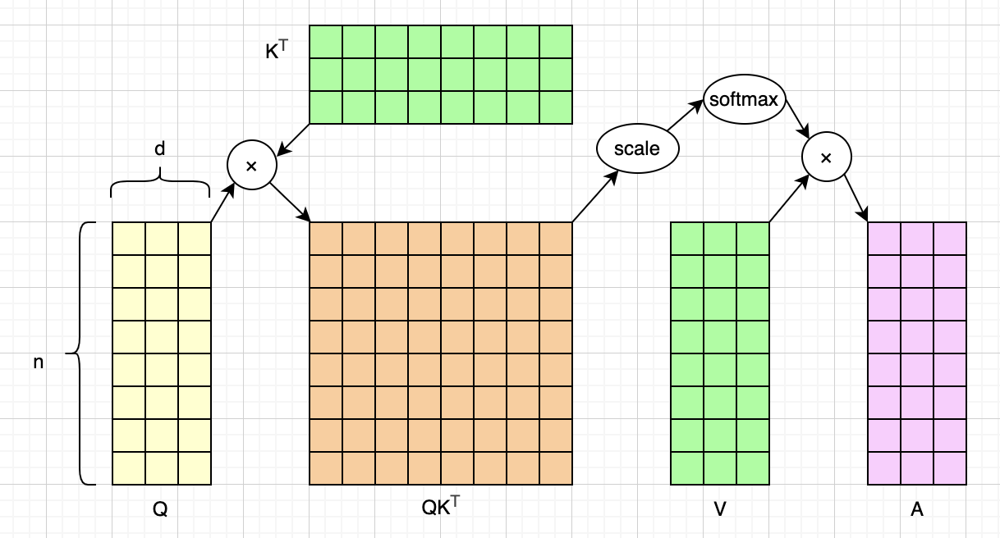
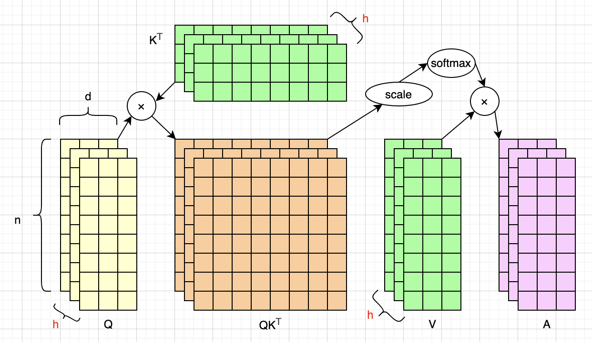
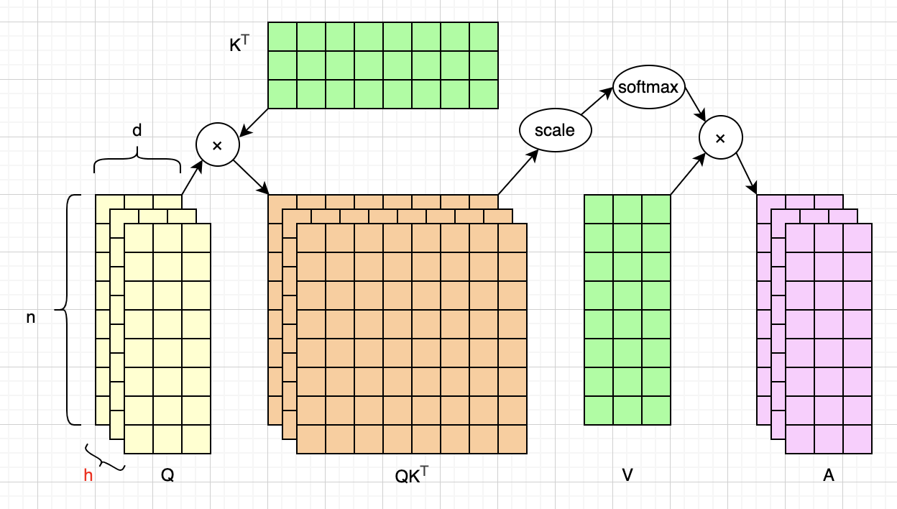
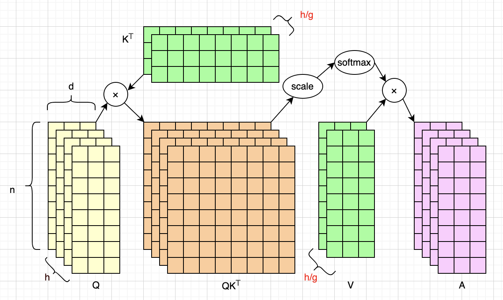
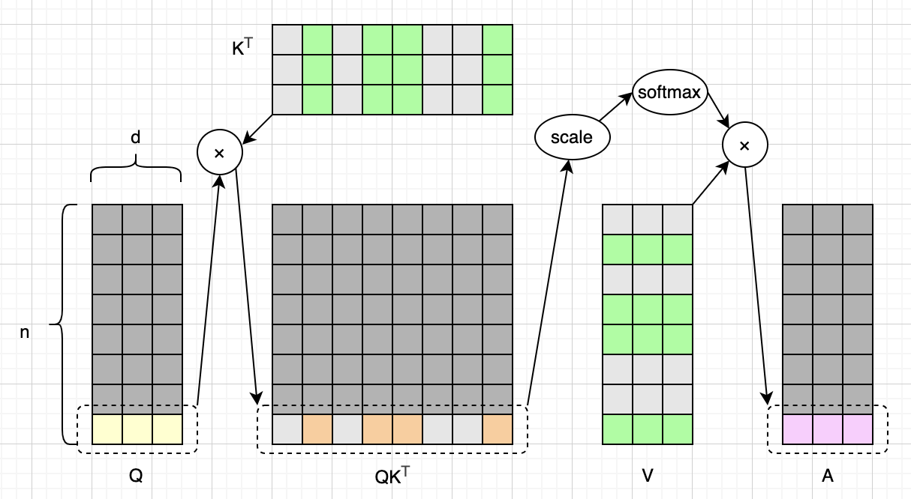
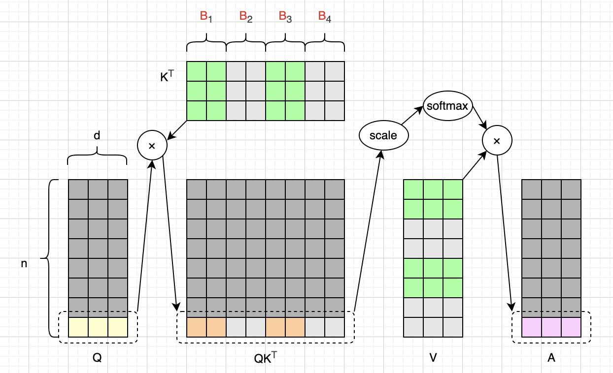
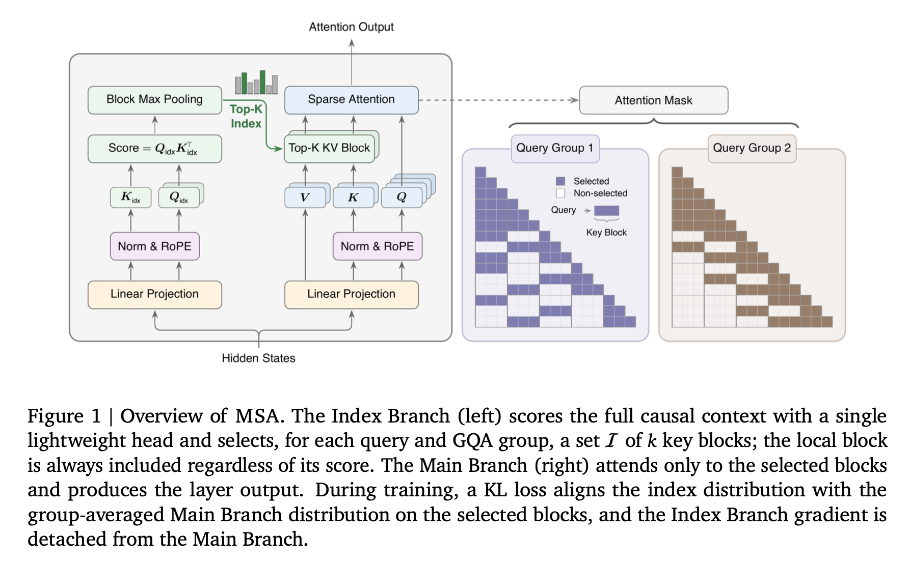
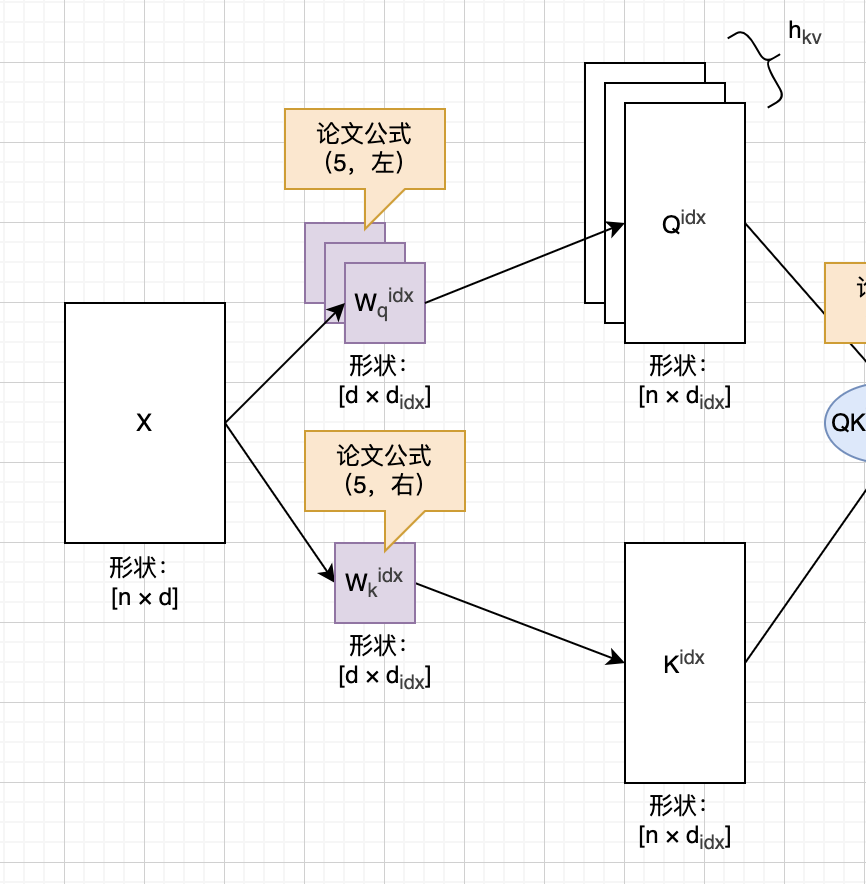
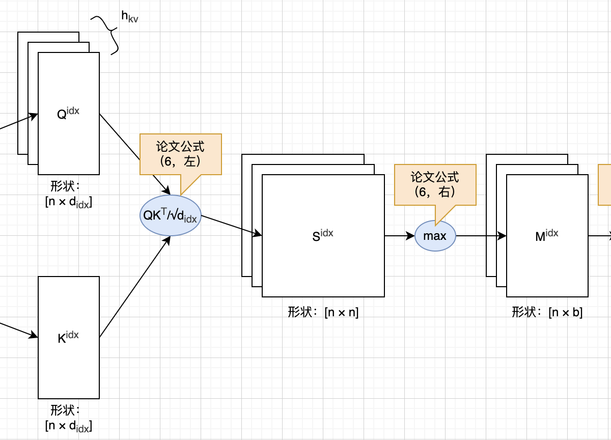
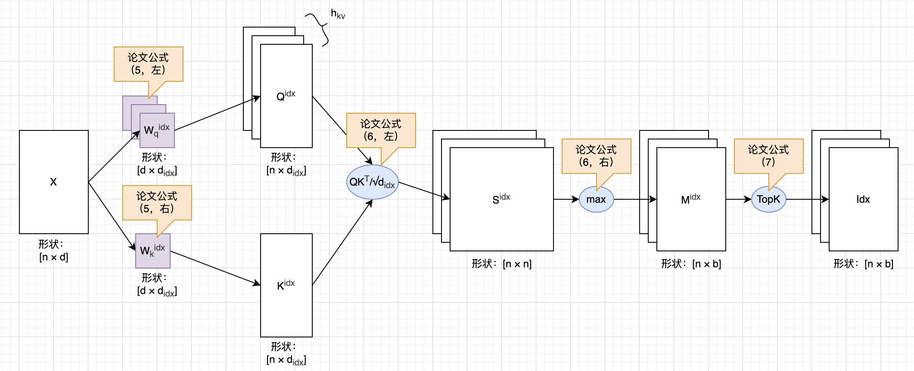

# 图解MSA（MiniMax Sparse Attention）

本文主要解读MiniMax稀疏注意力机制（MiniMax Sparse Attention，简称MSA）技术论文第2、3小节里的数学公式。其中“预备知识”这一小节大致对应论文第2小节，复习一下标准注意力机制，以及MQA、GQA和稀疏注意力等优化机制。“MiniMax稀疏注意力”这一小节大致对应论文第3.1小节，会详细介绍MSA架构。

图解LLM系列的文章都没有用AI润色，文字都是自己敲的，图都是自己画的，原汁原味。不过我使用AI检查了错别字，还有很多不确定的地方，我也问了AI。如果一些AI回答的片段，我觉得可以直接用，会以引用的形式贴到文中，一眼就能看出来。由于我还在慢慢学习中，本文可能难免有错误和疏漏，如果你发现的话，可以在评论区告诉我，我会在下一版改进。

## 预备知识

MSA论文第2小节介绍了一些注意力机制的预备知识，本文我们也一起复习一下。

### 单头注意力

我们先来看标准的（单头）注意力机制，这是2017年经典论文《Attention Is All You Need》提出的，是整个Transformer架构和现代LLM的基础。下面是论文里的公式（1）：

$$
\begin{aligned}
\mathrm{Attention}(Q, K, V) = \mathrm{softmax}\left(\frac{QK^T}{\sqrt{d_k}}\right)V
\end{aligned}
\tag{A1}
$$

本文假设读者已经对标准的Transformer架构和注意力机制非常熟悉了，如果还不熟悉的话，一定要先熟读2017年的那篇经典论文。为了简化讨论，我们用`d`来表示Q、K、V维度，用`n`来表示序列长度。取`d=3`，`n=8`，我们可以把上面这个公式画成下面这样（本文暂不考虑因果掩码）：

这个公式，以及上图，这里就不展开介绍了。需要提一下的是，公式中，Q、K、V都是由输入矩阵线性变换来的。在推理阶段，K和V是需要缓存起来的，这就是所谓的KV Cache，图中画成了绿色。不难看出，KV Cache需要的存储量和输入序列的长度是成正比的。当输入序列特别长的时候，KV Cache就成了瓶颈。后面要介绍的MQA、GQA等优化，都是在试图减少KV Cache的存储量。

### 多头注意力

前面给出的是单个注意力头的计算公式，Transformer论文里推荐**多头注意力**（Multi-Head Attention，简称**MHA**）。其实就是多个注意力头分别算注意力，然后再拼接起来，下面是论文3.2.2小节给出的MHA公式：

$$
\begin{aligned}
\text{MultiHead}(Q, K, V) &= \text{Concat}(\text{head}_1,\dots,\text{head}_h)W^O \\
\text{where }\ \text{head}_i &= \text{Attention}(XW_i^Q, XW_i^K, XW_i^V)
\end{aligned}
\tag{A3.2.2}
$$

我们用`h`来表示注意力头数。取`h=3`，上面的公式可以画成下面这样：

在MSA论文2.1小节里，以另一种形式描述了标准注意力机制，也就是论文公式（1）：

$$
\begin{aligned}
\alpha_{t,i}^{(h)} &= \frac{\text{exp}\big(\langle q_t^{(h)}, k_i^{(h)} \rangle / \sqrt{d_h}\big)}{\sum_{j\le t}\text{exp}\big(\langle q_t^{(h)}, k_j^{(h)} \rangle / \sqrt{d_h}\big)}, \\
o_t^{(h)} &= \sum_{i\le t} \alpha_{t,i}^{(h)} v_i^{(h)}.
\end{aligned}
\tag{M1}
$$

这个公式和2017年Transformer论文里的公式（1）是一致的，只是把Softmax计算体现出来了。公式里，`t`表示Q的索引，`i`表示K和V的索引， $d_h$ 表示注意力头的维度。这个公式比较好理解，其他细节这里就不展开介绍了。在本文中，我们统一用Q、K、V来表示矩阵，用**q**、**k**、**v**来表示向量，和公式保持一致。

### 多查询注意力

既然KV Cache是瓶颈，那么就想办法减少需要缓存的KV就行了。最简单的办法就是`h`个Q共用一组KV，这就是**多查询注意力**（Multi-Query Attention，简称**MQA**）提出的优化机制。MQA的基本架构如下图所示：

这个优化肯定是很有效的，比如说注意力头数`h=64`，由于所有的Q共用一组KV，MQA一下子就让KV Cache的用量变成了标准MHA的1/64。但是压缩得这么狠，想想肯定也是要付出代价的：

> Q：简述一下MQA带来的问题。
>
> AI：一句话概括就是：MQA 用共享 K/V 换取了推理效率，但代价是牺牲了一部分多头注意力的表示能力；GQA 则是在二者之间取得了更好的平衡。

### 分组查询注意力

MQA的问题是压缩得太狠了：不管注意力头数`h`是多少，就共用一组KV。那么一个折中的办法就是：把Q分组，每一组Q共用KV。这就是**分组查询注意力**（Grouped-Query Attention，简称**GQA**）提出的优化机制，如下图所示（两个Q一组）：

我们假设把每`g`个Q分为一组，那么需要的KV数量就是 $h_{kv}=h/g$ 。不难看出，GQA对于KV Cache的压缩率就是`1/g`。当`g=1`时，就是标准MHA；当`g=h`时，就是MQA。

### 稀疏注意力

不管是标准 MHA 机制，还是 MQA、GQA 优化，每一个 Token 都要和它自身以及前面的所有 Token 计算注意力分数，这种覆盖全部允许位置进行交互的方式叫做**稠密注意力机制**（Dense / Full Attention）。与之相对应的，就是**稀疏注意力机制**（Sparse Attention，本文简称**SA**）。MSA论文2.2小节简要介绍了一种两阶段稀疏注意力机制，也就是公式（2）描述的机制：

$$
\begin{aligned}
\mathcal{I}_i &= \text{Index}_\phi(q_i, K_{\leq i}), \\
\quad o_i &= \text{Attn}\big(q_i, K[\mathcal{I}_i], V[\mathcal{I}_i]\big)
\end{aligned}
\tag{M2}
$$

所谓的两阶段，就是索引+注意力计算。第一阶段，根据某个**q**算出一个索引表（这个表的大小，应该远小于输入序列长度），这个就是上面公式第一行的含义。第二阶段，从索引表里查出对应的**kv**，计算注意力，这就是上面公式里第二行的含义。

我们暂时先关注单个注意力头，并且聚焦在最后一个**q**的上面，稀疏注意力机制大致可以画成下面这样。其中深灰色表示我们暂时不关心的计算、浅灰色表示不在索引表内的**kv**、绿色表示在索引表内的**kv**、棕色表示计算出的注意力分数。

### 分块稀疏注意力

但是上面介绍的SA对于GPU来说并不是很友好（具体可以看MSA论文），于是就有了**分块稀疏注意力机制**（Block Sparse Attention，本文简称BSA）。

BSA和SA基本原理是差不多的，只是我们要把Q和K分块。然后第一阶段算索引的时候，并不是像SA那样给每个**kv**分别算，而是按块来算。然后第二阶段也是按块选出**kv**，然后计算注意力。我们假设每个块里有2个**k**或者**v**，BSA机制可以画成下图这样：

### 基于GQA的分块稀疏注意力

不难看出，MQA和GQA致力于减少KV Cache用量，SA和BSA致力于减少注意力计算量。如果把这两种优化结合起来，就能达到同时减少KV Cache用量和注意力计算量的效果，这就是MSA论文2.3小节介绍的**基于GQA的分块稀疏注意力机制**（GQA + BSA = GQA-Based Block Sparse Attention）。

我们先来看MSA论文里的公式（3），它的意思是每一个GQA组有其共享的BSA索引表：

$$
\begin{aligned}
\mathcal{I}_i^{(r)} = \mathcal{I}_i^{(h)} = \mathcal{I}_i^{(h')}, \quad h,h'\in\mathcal{H}_r.
\end{aligned}
\tag{M3}
$$

再来看MSA论文公式（4），它描述了GQA分块策略。其中 $N$ 是输入序列长度， $B_k$ 是块的大小， $B$ 是分块数， $b$ 是块索引， $B_b$ 是某个分块。

$$
\begin{aligned}
B_b &= \{(b-1)B_k + 1,\dots,\min(bB_k,N)\},\\
b &= 1,\dots,B,\quad B=\left\lceil N/B_k\right\rceil.
\end{aligned}
\tag{M4}
$$

上面这个公式（4）可能不是很直观，我们来举个简单的例子：

* 输入序列长度： $N=100$ 。
* 分块大小： $B_k = 16$ ，也就是16个**k**或者**v**一个块。
* 分块数量： $B=\left\lceil N/B_k\right\rceil = 7$ ，共7个块。
* 分块索引： $b = 1, 2, ..., 7$ ，从1到7。
* 第一个块： $B_1 = \{1, 2, ..., 16\}$
* 第二个块： $B_2 = \{17, 18, ..., 32\}$
* 最后一个块： $B_7 = \{97, 98, 99, 100\}$

## MiniMax稀疏注意力

如果前面介绍的一大堆内容你都理解了，那么MiniMax稀疏注意力机制（MiniMax Sparse Attention，简称MSA）就好懂了，因为它本质上就是前面说的GQA+BSA。下面是MSA论文图1，介绍了MSA的整体结构，贴在这里供大家参考：

前面介绍的两阶段SA并没有说怎么得到索引表，MSA论文的3.1小节主要就是介绍这个细节。现在我们就来讨论MSA论文3.1小节里的数学公式。

### 索引表

我们先来看索引表的计算，从MSA论文里的公式（5）入手：

$$
\begin{aligned}
Q^{idx} &= XW_q^{idx} \in \mathbb{R}^{N\times H_{kv}\times d_{idx}},\\
K^{idx} &= XW_k^{idx} \in \mathbb{R}^{N\times 1\times d_{idx}}.
\end{aligned}
\tag{M5}
$$

如果你熟悉标准注意力机制，一眼就能看出来，上面的公式非常眼熟。没错，和标准注意力机制一样，这里Q和K也是输入通过线性变换得来的，公式里的上标`idx`表示这个是索引表计算。由于MSA基于GQA，所以我们会得到 $h_{kv}$ 个 $Q^{idx}$ 矩阵，它们共享一个 $K^{idx}$ 矩阵。公式（5）的计算过程如下图所示：

接下来是计算索引表分数，也就是MSA论文里的公式（6）。在这个公式里，下标`i`表示**q**的索引、下标`j`表示**kv**的索引、下标`b`表示BSA分块索引、上标`(r)`表示GQA分组索引。

$$
\begin{aligned}
S_{i,j}^{idx,(r)} &= \frac{\big(Q^{idx}\big)_i^{(r)} \big(K^{idx}\big)_j^\top}{\sqrt{d_{idx}}}, \\
M_{i,b}^{idx,(r)} &= \max_{\substack{j\in\mathcal{B}_b \\ j\le i}} S_{i,j}^{idx,(r)}.
\end{aligned}
\tag{M6}
$$

上面公式（6）的S部分，是不是和注意力机制也很像？只是没有Softmax而已。而M部分，就是按BSA的思想，每个块取一个最大值。看起来，这就是一个简化版注意力机制。为了保持画图风格统一，我们临时用小写字母`b`来表示分块的数量，于是上面的公式可以画成下面这样：

上面的公式（6）算出了索引表的分数，我们还需要一个TopK机制，对分数表进行筛选，只保留一小部分分数，其余全部筛除掉（设置成 $-\infty$ ）。这就是MSA论文里公式（7）描述的计算：

$$
\begin{aligned}
\mathcal{I}_i^{(r)} = \text{TopK}_{b\in\{1,\dots,B\}}\big(M_{i,\cdot}^{\text{idx},(r)},\,k\big).
\end{aligned}
\tag{M7}
$$

现在我们把完整的索引表计算过程画出来，如下图所示：

### 注意力

有了索引表，现在可以进行GQA+BSA注意力计算了，这就是MSA论文里公式（8）描述的计算：

$$
\begin{aligned}
O_i^{(h)} = \text{softmax}\left( \frac{Q_i^{(h)} \big(K^{(r)}[\mathcal{I}_i^{(r)}]\big)^\top}{\sqrt{d_h}} \right) V^{(r)}[\mathcal{I}_i^{(r)}]
\end{aligned}
\tag{M8}
$$

上面这个几乎就是标准注意力公式，只是增加了GQA分组、BSA分块和查表细节，这里就不展开讨论了。

## 总结

在标准Transformer架构中，自回归推理阶段需要缓存历史Token对应的K与V（KV Cache），缓存容量随输入序列长度线性增长。因此随着上下文长度持续增加，KV Cache将消耗大量GPU显存，这也是支撑超长上下文（例如 1M Tokens）场景的主要瓶颈之一。

为了缓解这种显存压力，研究者针对标准MHA注意力机制提出了许多优化方案。例如MQA和GQA这类稠密注意力变体，通过直接减少KV头数量来降低缓存开销。而SA和BSA等方案则将MHA改造为稀疏注意力结构，以此减少注意力的整体计算量。MiniMax MSA采用GQA+BSA组合方案，同时兼具GQA与BSA二者的优势，能够有效支持长达1M Tokens的上下文。

本文回顾了标准的MHA机制，以及MQA、GQA、SA、BSA等优化机制，并详细介绍了MSA的架构，解读了论文中的核心数学公式。但MSA原文篇幅较长，包含大量实现细节，本文未能逐一展开（我也没有完全读懂）。感兴趣的读者可进一步阅读MSA原始论文。

## 主要参考资料

论文：[Attention Is All You Need](https://arxiv.org/abs/1706.03762)

论文：[Fast Transformer Decoding: One Write-Head is All You Need](https://arxiv.org/abs/1911.02150)

论文：[GQA: Training Generalized Multi-Query Transformer Models from Multi-Head Checkpoints](https://arxiv.org/abs/2305.13245)

论文：[MiniMax Sparse Attention](https://arxiv.org/abs/2606.13392)

